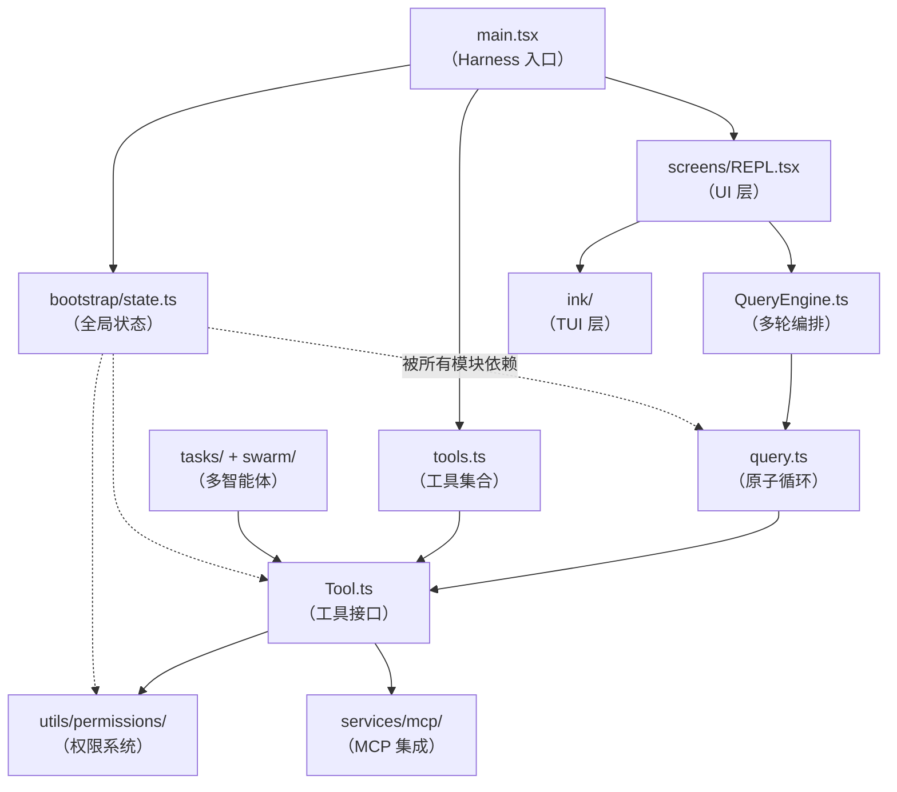
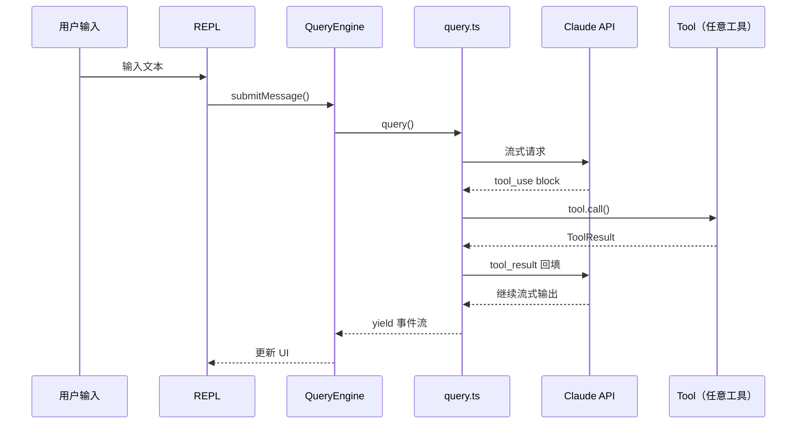

# 第1章：运行时 Harness 全景——总体架构解析

> *"A harness doesn't do the work. It holds the horses together."*

> 2000 个文件、565 个 `.tsx`、59 个工具——运行 `claude` 时，谁来管理这 11 个子系统的初始化顺序？哪个子系统先启动，哪个后启动，如果顺序错了会发生什么？本章拆解 Harness 模式如何用"单入口组装 + 显式依赖方向"解决这个协调问题。

2000 个文件，565 个 `.tsx`，59 个工具，113 个命令——你运行 `claude`，背后跑着的不是一个 CLI wrapper，而是一套需要协调 11 个子系统的运行时框架。

这产生了一个真实的工程问题：**当子系统数量超过 5 个，它们的初始化顺序、依赖方向、扩展接口就会成为系统复杂性的主要来源**。工具系统需要在 REPL 之前就绪；权限系统需要知道哪些工具存在；Bootstrap 状态需要在所有子系统之前初始化……谁来管理这条依赖链？

这个问题很难，因为它有两个相互矛盾的目标：**可扩展性**（新增工具只需几行代码）和**可控性**（初始化顺序不能出错）。本章解析 Claude Code 的解法——Harness 模式——以及这个选择带来了什么，放弃了什么。

读完这章，你能用同样的分析框架审视自己的 CLI 工具，识别其中隐含的依赖混乱。

## 1.1 Harness 模式如何解决子系统协调问题？

先看 Claude Code 选择的答案：**单入口组装**。

`src/main.tsx` 是物理入口，但它的职责不是实现功能，而是**把其他模块组装起来**。看它的三个核心 import：

```typescript
// src/main.tsx:35
import { launchRepl } from './replLauncher.tsx';
// src/main.tsx:46
import { getTools } from './tools.ts';
// src/main.tsx:88
import { filterCommandsForRemoteMode, getCommands } from './commands.ts';
```

**源码参考：** `src/main.tsx:35,46,88`

这三行背后是三个独立子系统的入口。`main.tsx` 不实现 REPL、不实现任何工具、不实现任何命令——它只负责把这些子系统接在一起，并管理它们的初始化顺序。

"Harness"的工程含义由此清晰：一个**不承载业务逻辑的协调层**。它解决的核心问题是：当 A 依赖 B、B 依赖 C 时，谁来保证初始化顺序？答案是——专门负责"组装"的那一层。

### 为什么不选 Plugin 架构？

Plugin 架构也能解决多子系统协调，但有一个关键差异：

| 维度 | Harness（单入口组装）| Plugin 架构 |
|------|--------------------|-----------| 
| 初始化控制 | 入口文件显式管理顺序 | 依赖注册/发现机制 |
| 依赖方向 | 静态，编译期可见 | 动态，运行期注册 |
| 调试难度 | 低（依赖链可追踪）| 高（注册顺序隐式）|
| 扩展成本 | 改 `tools.ts` 或 `commands.ts` | 实现 Plugin 接口并注册 |

**核心权衡**：Claude Code 的工具集在启动时就已确定（部分依据 feature flag 和用户类型），不需要运行时动态发现。**当扩展集合在编译期已知时，Harness 比 Plugin 架构的依赖链更透明、更易调试。**

## 1.2 依赖方向如何决定模块组织？

11 个子系统不是平等的——它们有严格的依赖方向，这个方向直接决定了本书的章节顺序。

**图 1-1：Claude Code 模块依赖关系图**



箭头表示"依赖"：被指向的模块必须先初始化。图中有几个值得注意的关键点：

**`bootstrap/state.ts` 是无处不在的依赖**（虚线）。它是全局状态的单一来源，连 `query.ts` 里也有：

```typescript
// src/QueryEngine.ts:184
export class QueryEngine {
  private config: QueryEngineConfig
  private mutableMessages: Message[]
  private abortController: AbortController
  // ...
}
```

**源码参考：** `src/QueryEngine.ts:184`

`QueryEngine` 的内部状态（消息历史、abort 控制器）完全独立，但它仍然需要通过 `bootstrap/state.ts` 访问会话 ID、成本计数等跨模块共享状态（详见第5章）。

**`Tool` 接口是工具层的统一抽象**。无论 `BashTool`、`FileEditTool` 还是 MCPTool，都实现同一个接口：

```typescript
// src/Tool.ts:362
export type Tool<
  Input extends AnyObject = AnyObject,
  Output = unknown,
  P extends ToolProgressData = ToolProgressData,
> = {
  call(args, context, canUseTool, parentMessage, onProgress?): Promise<ToolResult<Output>>
  description(input, options): Promise<string>
  readonly inputSchema: Input
  isEnabled(): boolean
  isReadOnly(input): boolean
  // ...
}
```

**源码参考：** `src/Tool.ts:362`

这个接口设计让 `query.ts` 可以调用任意工具而无需关心实现类型——这是第11章的主题。

**图 1-2：工具调用数据流**



这条链路上，每一层的职责边界都是清晰的：`query.ts` 负责单轮原子循环（第8章），`QueryEngine` 负责多轮编排（第9章），`REPL` 负责 UI 状态（第2篇）。

## 1.3 哪些模块被排除，以及为什么？

这个问题本身是一个架构决策：**重建源码的完整度直接影响分析的可靠性**。

Claude Code v2.1.88 的重建版本约 60-70% 完整，以下模块是有意排除的分析范围：

| 模块 | 路径 | 排除原因 |
|------|------|---------|
| KAIROS（Assistant 模式）| `src/assistant/` | feature flag `KAIROS` 门控，多为空实现 |
| SSH 远程 | `src/ssh/` | 最小实现（2 文件），仅接口骨架 |
| Proactive 建议 | `src/proactive/` | 最小实现（2 文件）|
| Coordinator 模式 | `src/coordinator/` | feature flag `COORDINATOR_MODE` 门控 |
| Voice 模式 | `src/voice/` | 1 个接口文件 |

以 KAIROS 为例，在 `src/main.tsx:80` 可以看到它的加载方式：

```typescript
// src/main.tsx:80
const assistantModule = feature('KAIROS')
  ? require('./assistant/index.js') as typeof import('./assistant/index.js')
  : null;
```

**源码参考：** `src/main.tsx:80`

`feature('KAIROS')` 在普通用户的 Bun 构建中返回 `false`，整个 `require` 分支被编译期死代码消除——这意味着即使分析源码，也只能看到一个空壳（详见第4章）。

**分析一个只有接口没有实现的模块不会产生有用的工程洞察，只会产生推断性结论。** 这是为什么这些模块被显式排除，而不是"假装分析"。

完整的 feature flag 分类见附录 B。

## 模式提炼

### 单入口组装（Single-Entry Assembly）

**解决的问题**：多子系统 CLI 的初始化顺序和依赖关系难以管理。

**核心做法**：入口文件只负责 import 和连接，不承载任何业务逻辑；被依赖的模块总是先于依赖方初始化。

**前置条件**：子系统数量 ≥ 5，且扩展集合在启动时已知（不需要运行时动态发现）。

**源码证据**：`src/main.tsx:35,46,88` — 连续三个 import 分别引入 REPL、工具集、命令集，`main.tsx` 自身不实现任何一个。

### 接口统一（Interface Unification）

**解决的问题**：多种扩展形态（本地工具、MCP 工具、Skill 工具）需要统一调度，调用方不应依赖具体实现类型。

**核心做法**：定义 `Tool` 接口，所有扩展点实现该接口；`query.ts` 只依赖接口，不依赖实现。

**前置条件**：扩展点种类 > 3，且需要被同一调度器统一处理。

**源码证据**：`src/Tool.ts:362` — `Tool` 类型定义了 `call`/`description`/`inputSchema` 等核心方法，BashTool/MCPTool/SkillTool 全部实现该接口。

### 显式排除（Explicit Exclusion）

**解决的问题**：不完整的实现分析会产生误导性结论，且浪费读者时间。

**核心做法**：识别 stub 模块（feature flag 门控 + 空实现），在架构文档中显式标注排除原因，指向查找完整信息的路径。

**前置条件**：项目有已知的未完成功能模块。

**源码证据**：`src/main.tsx:80` — `feature('KAIROS') ? require('./assistant/index.js') : null`，Bun 编译时整个分支物理消失。

## 踩坑

### ❌ 把业务逻辑写进 main.tsx，入口变"上帝对象"

每个新功能都往 `main.tsx` 里加，半年后入口文件超过 800 行，每次 PR 都有合并冲突。

**识别信号**：`main.tsx` 里出现了 `if (args[0] === '/help') { ... }` 这类业务判断。

**正确做法**：入口只做三件事——初始化 bootstrap 状态、聚合子系统（`getTools()`/`getCommands()`）、启动 REPL。Claude Code 的 `main.tsx` 的业务逻辑几乎为零（`src/main.tsx:35,46,88`）。

### ❌ 让 Harness 直接依赖具体工具类而非接口

```typescript
// ❌ 错误
import { BashTool } from './tools/BashTool/BashTool.ts'
import { FileEditTool } from './tools/FileEditTool/FileEditTool.ts'
const tools = [new BashTool(), new FileEditTool()]  // 入口直接 new 具体类
```

**后果**：添加工具必须改 main.tsx，顺序依赖变成隐式约定，测试时无法 mock。

**正确做法**：通过 `getTools()` 聚合函数获取 `Tool[]`，Harness 只依赖接口（`src/tools.ts:193`）。

### ❌ 忽视初始化顺序，在 Bootstrap 就绪前访问全局状态

```typescript
// ❌ 错误：REPL 在 bootstrap 前初始化
const repl = initREPL()   // getOriginalCwd() 此时返回 undefined
initBootstrap()            // 太晚了
```

依赖方向图（图 1-1）不只是文档，它决定了代码里的 import 顺序——被依赖的模块必须先初始化。


## 你能做什么

- **画依赖方向图，而不是功能分组图**：按"谁依赖谁"而非"功能属于哪类"来组织模块关系图，依赖方向决定初始化顺序
- **识别你的 `main.ts` 里有没有业务逻辑**：如果有，考虑拆分——入口文件应只做连接，不做业务
- **在扩展集合已知时选 Harness，在需要运行时发现时选 Plugin**：两者解决不同场景，不是优劣之分
- **登记项目的 stub 模块**：用表格记录未完成实现，标注排除原因，避免文档读者分析空壳代码
- **按依赖方向排列文档章节**：被依赖的概念先讲，这是理解系统的最快路径

---

*第1章建立了全书的模块地图，以及 Harness 模式背后的设计理由。第2章将深入 Claude Code 最有争议的技术选型：为什么用 React 渲染 CLI 界面？`bun:bundle` 的 `feature()` 为什么是架构级决策而非普通的环境变量开关？*
