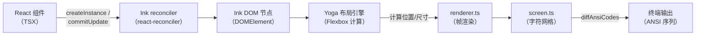
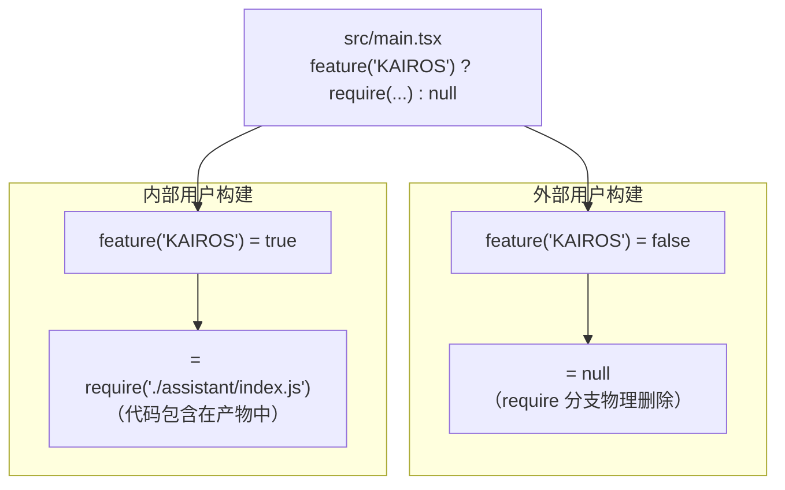

# 第2章：技术栈选型——React/Ink + Bun + TypeScript 的工程逻辑

> *"The right abstraction is worth a thousand lines of boilerplate."*

> 565 个 `.tsx` 文件、一个没有浏览器的终端进程——Claude Code 为什么用 React 渲染 CLI？更关键的是：`bun:bundle` 的 `feature()` 为什么能让内部代码在外部用户的产物中"物理消失"，而不只是"运行时跳过"？这两个选型决定了整个系统的安全边界。

Claude Code 的 `src/` 目录里有 565 个 `.tsx` 文件。`.tsx` 意味着 JSX，意味着 React。在一个没有浏览器的终端进程里，React 能跑吗？

这是一个反直觉的选择，但它背后有具体的工程理由。更重要的是，**Bun 替代 Node 带来了一个架构级的能力**，不是性能，而是编译期死代码消除——这直接影响了 Claude Code 如何隔离内部和外部用户的代码。

本章解析三个核心选型：React/Ink、Bun + `bun:bundle`、TypeScript。每个选型都有"为什么不选 X"的具体理由，而不只是"我们选了 Y"。

理解这些选型，你就能理解为什么第4章（feature flag）能做到"内部代码在普通用户构建中物理消失"——这不是运行时的 if/else，而是编译期的结构性设计。

## 2.1 为什么用 React 渲染 CLI，而不是 blessed 或 chalk？

先明确问题：一个 AI Coding Agent 的 CLI 界面，需要什么能力？

- **状态管理**：对话历史、权限请求状态、多个并行 Agent 的进度——界面状态随时间变化
- **条件渲染**：根据运行模式（Plan/Auto/默认）显示不同 UI 元素
- **组件复用**：消息气泡、进度条、权限对话框在多处出现，逻辑一致
- **焦点和事件**：键盘导航、Vim 模式、命令历史

用 `chalk` 直接渲染字符串能解决颜色问题，但无法解决状态管理。用 `blessed` 能解决布局，但组件抽象不够，状态变化时需要手动操作 DOM-like 树。

Claude Code 的选择是 **Ink**——一个将 React 的组件模型和 reconciler 移植到终端的库。核心证据在：

```typescript
// src/ink/reconciler.ts:4
import createReconciler from 'react-reconciler'
```

**源码参考：** `src/ink/reconciler.ts:4`

这一行说明 Ink 不是在 React DOM 之上叠加终端输出，而是**用 `react-reconciler` 包自建了一个 host config**，将 React 的虚拟 DOM 映射到终端字符网格，而非 HTML DOM。

### 自建 reconciler 意味着什么？

`react-reconciler` 是 React 18/19 的核心包，允许任何宿主环境实现自己的"DOM 操作"。Ink 实现了其中三个关键方法：

```typescript
// src/ink/reconciler.ts:331
createInstance(originalType, newProps, ...): DOMElement {
  // 将 React 组件实例映射为 Ink 的 DOMElement（终端节点）
  const node = createNode(type)
  for (const [key, value] of Object.entries(newProps)) {
    applyProp(node, key, value)
  }
  return node
}
```

```typescript
// src/ink/reconciler.ts:426
commitUpdate(node, _type, oldProps, newProps): void {
  // 增量更新：只计算 diff，只修改变化的属性
  const props = diff(oldProps, newProps)
  // ...
}
```

**源码参考：** `src/ink/reconciler.ts:331,426`

`createInstance` 和 `commitUpdate` 是 host config 的核心：前者在 React 首次挂载时创建终端节点，后者在状态变化时只更新差异部分，避免全屏重绘。

### 选型对比

| 维度 | React/Ink | blessed | chalk 直接渲染 |
|------|-----------|---------|--------------|
| 状态管理 | ✅ React hooks | ❌ 手动 | ❌ 无 |
| 组件复用 | ✅ 组件树 | ⚠️ 有限 | ❌ 字符串拼接 |
| 增量更新 | ✅ reconciler diff | ⚠️ 手动 | ❌ 全量重绘 |
| 布局引擎 | ✅ Yoga Flexbox | ✅ 有 | ❌ 无 |
| 维护成本 | 中（需维护 reconciler）| 高 | 低（简单场景）|

**核心权衡**：React/Ink 的代价是需要自建 reconciler（第38章详细分析），但收益是获得了 React 生态的全部能力——状态管理、组件抽象、Flexbox 布局，在有状态 CLI 界面中这些能力是刚需，不是奢侈品。

**图 2-1：Ink 的渲染链路**



注意 `screen.ts` 层的 `diffAnsiCodes`——这是帧级别的差量更新，只输出变化的字符，而非每帧重绘全屏。

## 2.2 `bun:bundle` feature() 为什么是架构级决策？

这是本章最重要的一节，也是理解第4章的前提。

**问题**：Claude Code 需要向 Anthropic 内部用户暴露某些功能（如 `REPLTool`、KAIROS 模式），而外部用户不应该看到这些功能的代码——不只是运行时跳过，而是**代码不应出现在外部产物里**。

用 `process.env.NODE_ENV` 的方式行吗？不行：

```typescript
// ❌ 运行期分支——代码仍在产物中，只是运行时跳过
if (process.env.USER_TYPE === 'ant') {
  const internalTool = require('./internal/tool.js')
}
```

即使条件永远不满足，`./internal/tool.js` 的代码仍然存在于产物中，可以被 unpack 看到。

Bun 的 `feature()` API 解决了这个问题：

```typescript
// src/main.tsx:21
import { feature } from 'bun:bundle';

// src/main.tsx:80
const assistantModule = feature('KAIROS')
  ? require('./assistant/index.js') as typeof import('./assistant/index.js')
  : null;
```

**源码参考：** `src/main.tsx:21,80`

**在 Bun 编译时**，`feature('KAIROS')` 被替换为字面量 `true` 或 `false`。如果是 `false`，整个三元表达式变成 `null`，`require('./assistant/index.js')` 分支被**物理删除**——产物中不存在这段代码，无法被 unpack 看到。

这是**编译期死代码消除（Dead Code Elimination, DCE）**，不是运行期的 if/else。

### 两种 flag 方式的本质差异

```typescript
// 方式 A：运行期 flag（代码存在，条件可绕过）
if (process.env.ENABLE_INTERNAL === 'true') {
  // 此代码在外部产物中仍然存在
}

// 方式 B：编译期 flag（外部产物中代码不存在）
const internalFeature = feature('INTERNAL_ONLY')
  ? require('./internal/code.js')
  : null
```

| 维度 | 运行期 flag | 编译期 `feature()` |
|------|-----------|-------------------|
| 代码是否在产物中 | ✅ 存在 | ❌ 物理删除 |
| 可否通过环境变量绕过 | ✅ 可以 | ❌ 不可能 |
| 修改是否需要重新构建 | ❌ 不需要 | ✅ 需要 |
| 产物体积 | 较大 | 较小 |

**核心权衡**：编译期 flag 的代价是**每次修改 flag 值都需要重新构建发布**；收益是**外部用户的产物里不包含内部代码**，这对于商业产品的代码隔离是硬性需求。

**图 2-2：编译期 DCE 的效果**



第4章将详细分析所有 60+ 个 feature flag 的分类和用途。

## 2.3 TypeScript 与 Bun 的构建流程

Claude Code 的构建命令是：

```bash
bun build src/main.tsx --outdir dist --target bun
```

`--target bun` 是关键：它让 Bun 知道要处理 `bun:bundle` 的 `feature()` 调用（DCE），同时允许使用 Node.js 兼容的 API。如果换成 `--target node`，`feature()` 就退化为普通函数，DCE 失效。

TypeScript 的配置（`tsconfig.json`）启用了严格类型检查，但实际构建走的是 Bun 的内置 TypeScript 编译器，不需要额外的 `tsc` 构建步骤——这让开发周期从"修改→tsc→bundle"缩短为"修改→bun build"。

**代价**：`bun:bundle` 是**非标准 API**，不在 Node.js 或任何 W3C 标准中。这意味着如果未来需要迁移到其他运行时，这个 feature flag 体系需要重写。这是 Claude Code 有意接受的技术债——为了编译期 DCE 能力，绑定 Bun 生态。

## 模式提炼

### 编译期特性门控（Compile-time Feature Gating）

**解决的问题**：内部代码不应出现在外部用户的产物中，运行期条件判断无法实现物理隔离。

**核心做法**：用编译器能识别并消除的常量（如 `bun:bundle` 的 `feature()`）包裹内部代码，构建时替换为字面量 false，整个分支被 DCE 删除。

**前置条件**：有内部/外部用户的产物区分需求，且愿意接受"修改 flag 需要重新构建"的约束。

**源码证据**：`src/main.tsx:80` — `feature('KAIROS') ? require('./assistant/index.js') : null`，外部构建产物中不含 `assistant/index.js` 的任何内容。

### 声明式终端 UI（Declarative Terminal UI）

**解决的问题**：有状态的 CLI 界面用字符串操作实现时，状态变化触发的重绘逻辑难以维护。

**核心做法**：用 React 组件描述 UI 状态，由 reconciler 计算差量并执行最小化更新，开发者不直接操作终端 API。

**前置条件**：界面有状态（非静态输出），且组件复用需求高。

**源码证据**：`src/ink/reconciler.ts:426` — `commitUpdate` 方法计算 props diff，只更新变化的属性，而非全量重绘。

### 受控技术债（Controlled Technical Debt）

**解决的问题**：采用非标准 API 会引入迁移风险，但有时非标准 API 是获得关键能力的唯一路径。

**核心做法**：明确记录非标准依赖的范围和原因，在获得能力的同时接受约束。

**前置条件**：非标准 API 带来的收益（此处是编译期 DCE）明显超过迁移风险。

**源码证据**：`src/main.tsx:21` — `import { feature } from 'bun:bundle'`，一个只存在于 Bun 构建环境的 API，整个 feature flag 体系绑定于此。


## 延伸：replLauncher.tsx——App 与 REPL 的动态组装

`src/replLauncher.tsx` 是 Harness 将 Ink 组件树动态组装的桥接层：

```typescript
// src/replLauncher.tsx:12
export async function launchRepl(
  root: Root,
  appProps: AppWrapperProps,
  replProps: REPLProps,
  renderAndRun: (root: Root, element: React.ReactNode) => Promise<void>
): Promise<void> {
  const { App } = await import('./components/App.js')  // 动态 import
  const { REPL } = await import('./screens/REPL.js')   // 动态 import
  await renderAndRun(root, <App {...appProps}><REPL {...replProps} /></App>)
}
```

**源码参考：** `src/replLauncher.tsx:12`

为什么用动态 `import` 而不是静态 import？这是 Bun 的 lazy module loading——`App` 和 `REPL` 组件只在 `launchRepl` 被调用时才加载，主模块加载期间不评估这些组件的模块代码。这对冷启动有轻微收益，更重要的是明确标记"这两个模块是 REPL 的依赖，不是启动必须的依赖"。


## 踩坑

### ❌ 用运行期环境变量替代 feature() 做内部代码门控

```typescript
// ❌ 错误：代码仍然存在于外部产物中
if (process.env.ENABLE_KAIROS === 'true') {
  require('./assistant/index.js')  // 用户能从产物里看到这段代码
}
```

任何人设置环境变量就能绕过限制，内部代码也无法从外部产物中消除。

**正确做法**：用 `feature('KAIROS') ? require(...) : null`，Bun 编译时物理删除整个分支（`src/main.tsx:80`）。

### ❌ bun build 忘写 --target bun 导致 DCE 失效

```bash
bun build src/main.tsx --outdir dist --target node  # ❌
# feature() 不会被替换，内部代码不会物理删除
```

**验证方法**：用 `grep -r 'assistant' dist/` 检查产物——正确构建时应该找不到任何 `assistant/` 相关内容。

### ❌ 在 Ink 组件里直接调用 process.stdout.write() 绕过 reconciler

```typescript
// ❌ 错误：绕过 reconciler，终端状态不一致
useEffect(() => { process.stdout.write('\x1b[2JHello') })
```

`commitUpdate` 负责增量更新（`src/ink/reconciler.ts:426`），直接写终端会破坏 Ink 维护的内部 DOM 状态，下次渲染时出现错位或重复输出。


## 你能做什么

- **评估自己的 CLI 是否需要 React/Ink**：判断标准是界面是否有状态。静态输出（如 `ls` 风格）用 chalk 足够；有状态的交互界面（对话、进度、多视图）考虑 Ink
- **用编译期 flag 而非运行期 flag 隔离内部功能**：如果你的产品有内部/外部用户区分，`feature()` 模式比环境变量更安全
- **清楚地记录绑定非标准 API 的技术债**：在代码注释或 ADR 中写明"我们使用 X 是为了 Y，代价是 Z"
- **在 `--target bun` 和 `--target node` 之间有意选择**：前者获得 `bun:bundle` 能力，后者保持运行时通用性

---

*第2章解析了 React/Ink 和 `bun:bundle` 的选型逻辑。第3章将分析 `main.tsx` 的另一个设计决策：为什么三个异步预热任务在模块加载期间（而非函数体内）启动，以及这个选择为冷启动节省了多少时间。*
