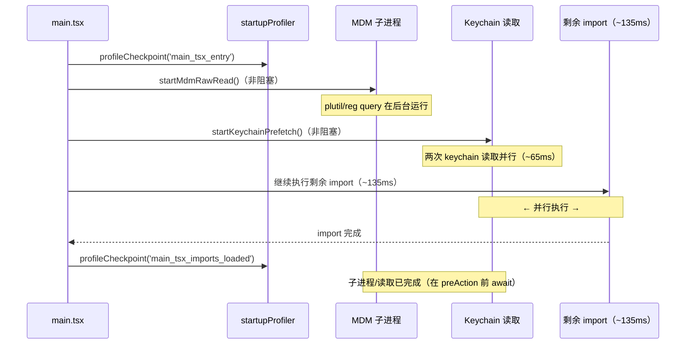
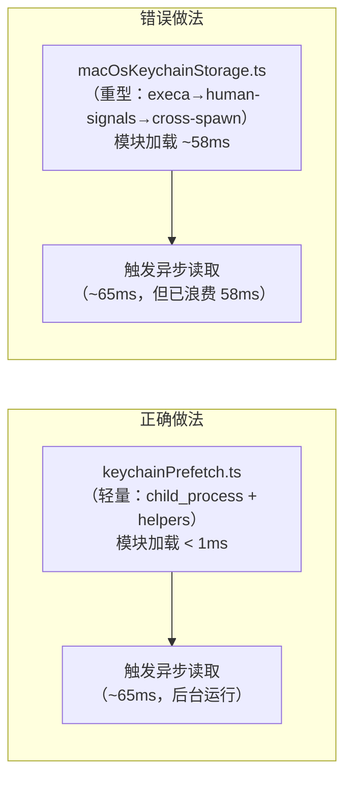

# 第3章：启动流水线的并发艺术

> *"Don't wait for what you know you'll need."*

> Claude Code 的冷启动时间是 135ms。如果 MDM 读取（65ms）和 keychain 预热（45ms）串行执行，光这两步就要 110ms。实际上它们是并行的——但并行窗口只在模块加载阶段存在，一旦 `main()` 开始执行就关闭了。怎样抓住这个窗口？

`src/main.tsx` 的第 11 行有一个注释：`// eslint-disable-next-line custom-rules/no-top-level-side-effects`。

这行注释说明，正下方的代码有意违反了 ESLint 规则——在 `import` 语句之间执行副作用。ESLint 禁止这种行为是有道理的：副作用在模块加载时执行，顺序难以控制，测试隔离困难。但 Claude Code 在这里违反了规则，并且违反了三次。

**为什么值得为此承受技术债？** 因为每次违反规则，都为用户节省了 10-65ms 的冷启动时间。

这个问题的难点在于：**冷启动时间的优化窗口是模块加载阶段（约 135ms），一旦 `main()` 函数开始执行，这个窗口就关闭了**。如果等到 `main()` 里再触发 I/O，就是串行而非并行。

读完这章，你能识别自己 CLI 工具中的"可并行但被串行化"的 I/O 操作，以及如何用 profileCheckpoint 量化每段延迟，将"感觉变慢了"变成"第 N 阶段多了 X ms"。

## 3.1 为什么在 import 之间触发异步任务？

在 Node.js/Bun 模块系统中，`import` 语句是按顺序执行的。但**被 import 的模块的副作用**（顶层代码）在被 import 时立即执行。这给了一个利用机会：

```typescript
// src/main.tsx:9-20
import { profileCheckpoint, profileReport } from './utils/startupProfiler.ts';

// eslint-disable-next-line custom-rules/no-top-level-side-effects
profileCheckpoint('main_tsx_entry');           // ← 副作用①：打下第一个时间戳

import { startMdmRawRead } from './utils/settings/mdm/rawRead.ts';

// eslint-disable-next-line custom-rules/no-top-level-side-effects
startMdmRawRead();                             // ← 副作用②：触发 MDM 子进程（非阻塞）

import { ensureKeychainPrefetchCompleted, startKeychainPrefetch } from './utils/secureStorage/keychainPrefetch.ts';

// eslint-disable-next-line custom-rules/no-top-level-side-effects
startKeychainPrefetch();                       // ← 副作用③：触发 Keychain 读取（非阻塞）
```

**源码参考：** `src/main.tsx:12,16,20`

这三行的关键是：`startMdmRawRead()` 和 `startKeychainPrefetch()` 都是**非阻塞的**——它们触发异步操作后立即返回。真正的等待发生在后面 `preAction` 阶段的 `await ensureMdmSettingsLoaded()` 和 `await ensureKeychainPrefetchCompleted()`。

等待期间，剩余的 import 语句（约 135ms）已经在执行。**两个耗时任务与模块加载并行进行，而不是串行等待。**

### "import 副作用"模式 vs "main 函数内启动"

为什么不在 `main()` 函数里启动这些任务？

```typescript
// ❌ 错误方式：在 main() 里启动
async function main() {
  startMdmRawRead()      // 时机太晚：此时模块加载已完成 135ms，并行窗口关闭
  startKeychainPrefetch()
  // ...
}
```

```typescript
// ✅ 正确方式：在 import 之间启动（实际代码）
import { startMdmRawRead } from './utils/settings/mdm/rawRead.ts';
startMdmRawRead();  // 时机正确：模块加载期间，并行执行
// ... 后续 import 继续 ...
```

**核心权衡**：在 `import` 间执行副作用的代价是测试隔离困难（模块加载时副作用自动触发，单元测试需要 mock）；收益是获得了模块加载这 135ms 的"免费"并行窗口。**当并行节省的时间（65-135ms）明显大于隔离成本时，这个权衡是合理的——代码里的 3 个 `eslint-disable` 注释是明确的"有意违规"标记。**

**图 3-1：三路并发启动时序**



图中的关键是时间线重叠部分：MDM 子进程和 Keychain 读取与 135ms 的模块加载并行，而非串行。

## 3.2 profileCheckpoint 如何量化每段延迟？

感性上的"启动慢了"无法定位瓶颈，`profileCheckpoint` 系统将其变成可测量的数据：

```typescript
// src/utils/startupProfiler.ts:65
export function profileCheckpoint(name: string): void {
  if (!SHOULD_PROFILE) return
  const perf = getPerformance()
  perf.mark(name)               // 使用 Node.js Performance API 打时间戳
  if (DETAILED_PROFILING) {
    memorySnapshots.push(process.memoryUsage())  // 可选：同时记录内存
  }
}
```

**源码参考：** `src/utils/startupProfiler.ts:65`

`SHOULD_PROFILE` 控制是否启用（100% ant 用户，0.1% 外部用户采样），`DETAILED_PROFILING` 控制是否同时记录内存快照。

`main.tsx` 中共有约 15 个 checkpoint，构成完整的启动剖面：

```
main_tsx_entry                    ← 进入 main.tsx（最早时间戳）
main_tsx_imports_loaded           ← 所有 import 完成（第 209 行）
eagerLoadSettings_start/end       ← 设置加载阶段
main_function_start               ← main() 开始执行
preAction_start                   ← Commander.js preAction 钩子
preAction_after_mdm               ← await MDM 完成
preAction_after_init              ← init() 完成
...
```

**源码参考：** `src/main.tsx:209,503,515,586,908,915`

`profileReport()` 函数将这些 checkpoint 转换为可读的时间线：

```typescript
// src/utils/startupProfiler.ts:123
export function profileReport(): void {
  // ...
  for (const [i, mark] of marks.entries()) {
    lines.push(formatTimelineLine(
      mark.startTime,
      mark.startTime - prevTime,   // ← 与上一个 checkpoint 的差值（阶段耗时）
      mark.name,
      ...
    ))
  }
  lines.push(`Total startup time: ${formatMs(lastMark?.startTime ?? 0)}ms`)
}
```

**源码参考：** `src/utils/startupProfiler.ts:123`

输出格式是每行显示"绝对时间 | 阶段耗时 | checkpoint 名称"，让开发者能直接定位哪个阶段是瓶颈。设置环境变量 `CLAUDE_CODE_PROFILE_STARTUP=1` 即可启用详细输出。

## 3.3 MDM 与 Keychain 预取的设计约束

两个预取模块的注释都明确写了设计约束，这是源码第一手的设计文档：

`src/utils/secureStorage/keychainPrefetch.ts` 的注释写道：
> "Imports stay minimal: child_process + macOsKeychainHelpers.ts (NOT macOsKeychainStorage.ts — that pulls in execa → human-signals → cross-spawn, ~58ms of synchronous module init)"

**源码参考：** `src/utils/secureStorage/keychainPrefetch.ts:1`

这揭示了一个关键约束：**预取模块自身的 import 开销必须接近零**，否则加载预取模块的时间就抵消了预取的收益。`keychainPrefetch.ts` 刻意只 import `child_process` 和一个轻量级 helper，而不是 `macOsKeychainStorage.ts`（会拉入一条 `execa→human-signals→cross-spawn` 的重型依赖链，58ms 的同步模块初始化）。

同样，`rawRead.ts` 的注释也说明：
> "Minimal module for firing MDM subprocess reads without blocking the event loop. Has minimal imports — only child_process, fs, and mdmConstants"

**源码参考：** `src/utils/settings/mdm/rawRead.ts:1`

这两处注释共同揭示了一个通用原则：**"早触发"的模块必须是轻量级的**——它的价值是触发并行，而不是执行大量逻辑。任何重型依赖都会被转移到 "import 阶段"的串行成本中，破坏并行收益。

**图 3-2：轻量级预取模块 vs 重型依赖的成本对比**



## 模式提炼

### 模块加载并行化（Module-Load Parallelism）

**解决的问题**：CLI 启动时需要多个独立 I/O 操作（配置读取、凭证验证），串行执行浪费了模块加载阶段的时间窗口。

**核心做法**：在 `import` 语句之间触发非阻塞 I/O 操作，让它们与后续模块加载并行执行；在首次使用前 `await` 结果。

**前置条件**：操作必须相互独立（无依赖关系），且触发模块必须轻量（import 开销 < 1ms）。

**源码证据**：`src/main.tsx:16,20` — `startMdmRawRead()` 和 `startKeychainPrefetch()` 在 import 阶段触发，在 `preAction` 的 `await` 前已完成，总节省约 135-200ms。

### 量化启动剖析（Quantified Startup Profiling）

**解决的问题**：启动性能优化缺乏数据支撑，无法定位瓶颈，也无法验证优化效果。

**核心做法**：在关键路径插入 checkpoint 埋点，收集绝对时间和阶段差值；`profileReport()` 输出可读时间线；生产环境采样，不影响用户性能。

**前置条件**：有长期的启动性能优化需求，需要持续跟踪。

**源码证据**：`src/utils/startupProfiler.ts:65,123` — `profileCheckpoint` 用 Performance API 打时间戳，`profileReport` 计算阶段差值输出时间线。

### 轻量预触发（Lightweight Early Trigger）

**解决的问题**：早触发的模块若引入重型依赖，加载成本抵消了并行收益。

**核心做法**：早触发模块只 import `child_process`、`fs` 等零成本原生模块，业务逻辑委托给独立的重型模块（在首次使用时加载）。

**前置条件**：需要在模块加载阶段触发的操作，以及能分离的轻量触发层和重型业务层。

**源码证据**：`src/utils/secureStorage/keychainPrefetch.ts:1` — 注释明确说明"NOT macOsKeychainStorage.ts — that pulls in execa → human-signals → cross-spawn, ~58ms"，刻意避免引入重型依赖。


## 延伸：并行预热的权衡

### 为什么不在 main() 函数体内触发 I/O？

这是最常见的"启动串行化"反模式：

```typescript
// ❌ 串行（常见写法）
async function main() {
  await startMdmRawRead()        // 等65ms
  await startKeychainPrefetch()  // 再等45ms
  launchRepl()                   // 总共等110ms再启动
}
```

```typescript
// ✅ 并行（Claude Code 的做法）
// 在模块加载时（import 之间）触发
startMdmRawRead()        // 非阻塞，立即返回
startKeychainPrefetch()  // 非阻塞，立即返回
// main() 执行时，I/O 已经在后台完成了
```

**核心洞察**：模块加载本身需要 ~135ms，这段时间本来就在"等待"——把 I/O 塞进这段等待时间，是零成本的并行优化（`src/main.tsx:11-20`）。

### 为什么 profileCheckpoint 必须是第一行？

如果 `profileCheckpoint('main_tsx_entry')` 不是文件的第一行执行的代码，它后面记录的时间戳就不能代表真正的"进程启动时间"，会错过前面的所有初始化开销。这是为什么源码里专门注释了"需要早于 module evaluation"（`src/utils/startupProfiler.ts:65`）。


## 踩坑

### ❌ 在 main() 函数体内触发 I/O，串行执行错过并行窗口

```typescript
async function main() {
  await startMdmRawRead()        // 65ms，阻塞
  await startKeychainPrefetch()  // 45ms，阻塞，总计 110ms
  launchRepl()
}
```

模块加载窗口（约 135ms）已经过去，现在才触发 I/O 是串行执行。

**正确做法**：在 `import` 语句之间的顶层触发（`src/main.tsx:11-20`），让 I/O 与模块加载并行，节省 65ms+。

### ❌ 第一个 profileCheckpoint 位置太晚，测量数据失真

```typescript
import { launchRepl } from './replLauncher.tsx'  // ← 此 import 已触发大量初始化
profileCheckpoint('main_entry')  // 漏掉了最前面的初始化时间
```

**正确做法**：第一个 checkpoint 必须放在 `src/main.tsx` 的绝对第一行，比任何 import 都早（`src/main.tsx:9`）。

### ❌ 把"顶层副作用"当成通用模式到处使用

ESLint 规则 `no-top-level-side-effects` 被 `// eslint-disable-next-line` 注释绕过了三次——每次都有充分理由（节省 10-65ms）。但如果滥用这种模式，每个模块都在加载时触发 I/O，初始化顺序会变成无法追踪的谜题。这是有意接受的技术债，不是通用做法。


## 你能做什么

- **检查你的 CLI `main()` 函数里有没有可以"前移"的独立 I/O**：配置文件读取、远程凭证验证、缓存预热——如果它们相互独立，考虑在模块加载阶段触发
- **用 `perf.mark()` + `perf.getEntriesByType('mark')` 为关键路径打点**：Node.js Performance API 是零依赖的，无需引入第三方工具
- **明确记录"有意违规"的 ESLint 规则**：与其悄悄加 `eslint-disable`，不如像 `main.tsx` 一样加注释说明"为什么值得违规"
- **预触发模块的 import 开销必须接近零**：用 `node -e "require('./your-module')"` 测量模块加载时间，确保不超过 1ms

---

*第3章解析了启动并发优化的具体实现。第4章将展开 `feature()` 这个工具的完整体系——60+ 个 feature flag 是如何分类的，双层架构（编译期 + 运行期）各自解决什么问题。*
