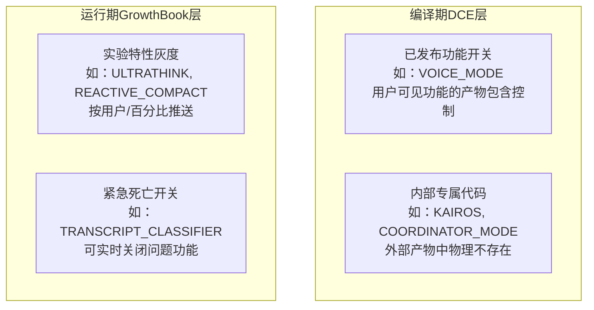
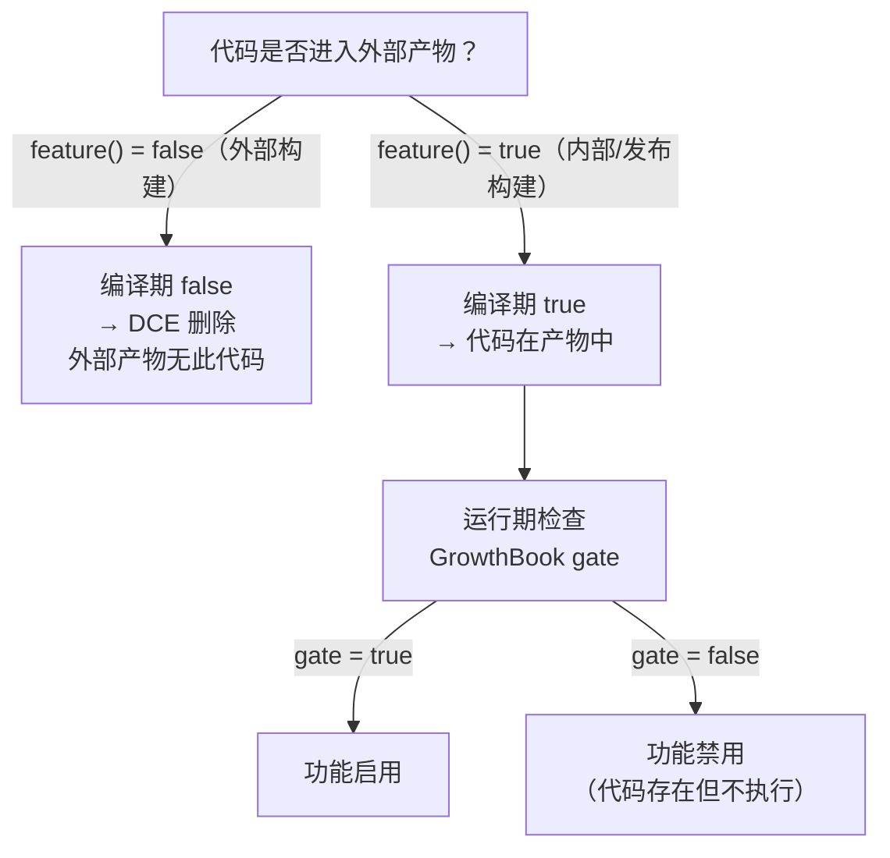

# 第4章：Feature Flag 的双层架构

> *"The best feature flag is one the user never knows exists."*

> 同一份源码编译出两个产物：内部版本有 KAIROS、COORDINATOR_MODE、REPLTool；外部版本没有这些代码，物理上不存在，无法被逆向。这不是靠 if/else 实现的——`if` 分支里的代码仍然在产物中。那么怎样让代码"物理消失"？

Claude Code 的 `claude` 命令有两个版本：你安装的那个，和 Anthropic 内部员工用的那个。两者来自同一份源码，但产物体积不同，可用工具不同，可用模式不同。

这不是靠两套代码库实现的，而是靠**60+ 个 feature flag** 实现的。

问题在于：feature flag 通常用环境变量实现——`if (process.env.ENABLE_X === 'true')`。这种方式的代码永远在产物里，只是运行时跳过。而 Claude Code 需要更强的保证：**某些内部功能的代码在外部用户的产物中物理上不存在**，不能被逆向工程，不能被环境变量绕过。

这就是为什么 Claude Code 有**两层 flag 体系**：编译期消除（`bun:bundle feature()`）和运行期 A/B（GrowthBook）。两层不是冗余，而是解决不同问题。理解这两层，你就理解了为什么第37章分析"未发布功能"时，能从源码中找到骨架代码——它们是用运行期 flag 门控的，不是编译期消除的。

## 4.1 编译期 flag 如何实现代码物理隔离？

看一个具体例子——KAIROS 是 Anthropic 内部的 Assistant 模式：

```typescript
// src/main.tsx:80
// Dead code elimination: conditional import for KAIROS (assistant mode)
const assistantModule = feature('KAIROS')
  ? require('./assistant/index.js') as typeof import('./assistant/index.js')
  : null;
```

**源码参考：** `src/main.tsx:80`

注释已经说明了目的：`Dead code elimination`。`feature('KAIROS')` 在 Bun 编译时被替换为字面量 `false`（对外部用户），整个三元表达式变成：

```typescript
const assistantModule = null;
```

`require('./assistant/index.js')` 的分支不存在于产物中。即使用户解包 `claude.cjs`，也找不到 `assistant/` 的任何内容。

这不只是 import 级别的隔离——看 `src/types/permissions.ts` 里的模式：

```typescript
// src/types/permissions.ts:33
export const INTERNAL_PERMISSION_MODES = [
  ...EXTERNAL_PERMISSION_MODES,
  ...(feature('TRANSCRIPT_CLASSIFIER') ? (['auto'] as const) : ([] as const)),
] as const satisfies readonly PermissionMode[]
```

**源码参考：** `src/types/permissions.ts:33`

`auto` 权限模式（AI 分类器模式）在外部用户的产物中**甚至不在枚举里**——整个 `['auto']` 数组被 DCE 删除。用户无法设置一个不存在的枚举值。

### 编译期 flag 的两种用途

在 `src/tools.ts` 里可以看到更多模式：

```typescript
// src/tools.ts:26
const SleepTool =
  feature('PROACTIVE') || feature('KAIROS')
    ? require('./tools/SleepTool/SleepTool.js').SleepTool
    : null

// src/tools.ts:29
const cronTools = feature('AGENT_TRIGGERS')
  ? [
      require('./tools/ScheduleCronTool/CronCreateTool.ts').CronCreateTool,
      require('./tools/ScheduleCronTool/CronDeleteTool.ts').CronDeleteTool,
      require('./tools/ScheduleCronTool/CronListTool.ts').CronListTool,
    ]
  : []
```

**源码参考：** `src/tools.ts:26,29`

`feature('PROACTIVE')` 门控 `SleepTool`，`feature('AGENT_TRIGGERS')` 门控三个定时任务工具。外部用户的工具集里没有这些工具，工具数量更少，API 调用时 token 开销也更低。

## 4.2 运行期 flag 如何支持不发版的功能推送？

编译期 flag 改一次需要重新构建发布。对于 A/B 实验和灰度发布，这太重了——Anthropic 需要一种方式，在同一个发布版本内向不同用户推送不同行为。

这是 GrowthBook 层的用途。看一个典型的"双层 flag"模式：

```typescript
// src/utils/thinking.ts:17-22
/**
 * Build-time gate (feature) + runtime gate (GrowthBook). The build flag
 * controls code inclusion in external builds; the GB flag controls rollout.
 */
export function isUltrathinkEnabled(): boolean {
  if (!feature('ULTRATHINK')) {
    return false         // 编译期：代码不在外部产物
  }
  return getFeatureValue_CACHED_MAY_BE_STALE('tengu_turtle_carbon', true)
  // 运行期：通过 GrowthBook 控制灰度比例
}
```

**源码参考：** `src/utils/thinking.ts:17`

这是双层 flag 的标准形态：
1. **第一层（编译期）**：`feature('ULTRATHINK')` — 控制代码是否存在于产物
2. **第二层（运行期）**：`getFeatureValue_CACHED_MAY_BE_STALE('tengu_turtle_carbon', true)` — 控制实际启用的用户比例

GrowthBook 的核心是 `initializeGrowthBook()` 和 `checkGate_CACHED_OR_BLOCKING()`：

```typescript
// src/services/analytics/growthbook.ts:622
export const initializeGrowthBook = memoize(
  async (): Promise<GrowthBook | null> => {
    let clientWrapper = getGrowthBookClient()
    // ...
    // 在认证可用时重新初始化，获取用户个性化的 flag 值
    if (!clientCreatedWithAuth) { ... resetGrowthBook() ... }
  }
)

// src/services/analytics/growthbook.ts:904
export async function checkGate_CACHED_OR_BLOCKING(gate: string): Promise<boolean> {
  // 快速路径：磁盘缓存已有结果
  const cached = getGlobalConfig().cachedGrowthBookFeatures?.[gate]
  if (cached === true) { return true }
  // 慢路径：等待 GrowthBook 初始化
  // ...
}
```

**源码参考：** `src/services/analytics/growthbook.ts:622,904`

`CACHED_MAY_BE_STALE` 和 `CACHED_OR_BLOCKING` 两个后缀揭示了运行期 flag 的一个设计权衡：
- `CACHED_MAY_BE_STALE`：同步返回缓存值，可能是旧的，但不阻塞
- `CACHED_OR_BLOCKING`：等待最新值，可能慢但准确

高频路径（如权限检查）用前者，低频但精确的功能（如 A/B 实验报告）用后者。

## 4.3 60+ flag 的分类体系

并非所有 flag 都有相同的意图。结合源码注释可以分为四类：

**图 4-1：Feature Flag 四象限**



| 类型 | 代表 flag | 特征 | 修改成本 |
|------|----------|------|---------|
| 内部专属代码 | `KAIROS`, `COORDINATOR_MODE` | 编译期 DCE，外部产物无此代码 | 需重新构建发布 |
| 已发布功能开关 | `VOICE_MODE`, `MONITOR_TOOL` | 编译期控制，外部可选 | 需重新构建发布 |
| 实验特性灰度 | `ULTRATHINK`, `REACTIVE_COMPACT` | 运行期推送，可热更新 | GrowthBook 配置即时生效 |
| 紧急死亡开关 | `TRANSCRIPT_CLASSIFIER` | 运行期，问题时立即关闭 | 实时生效，无需发版 |

`TRANSCRIPT_CLASSIFIER`（AI 分类器权限模式）是一个典型的死亡开关候选：它出现在 `src/types/permissions.ts:35`，通过编译期 flag 控制 `auto` 模式是否进入枚举——如果发现问题，可以通过 GrowthBook 实时关闭，并在下次构建时从枚举中移除。

**图 4-2：两层 flag 体系的决策流程**



## 模式提炼

### 双层特性门控（Two-Layer Feature Gating）

**解决的问题**：单层 flag 无法同时满足"代码物理隔离"和"不发版热更新"两个需求。

**核心做法**：编译期 flag（`bun:bundle feature()`）控制代码是否存在于产物；运行期 flag（GrowthBook）控制功能是否对当前用户启用。只有通过第一层的代码才需要运行期检查。

**前置条件**：产品有内部/外部用户的产物区分，同时有灰度发布需求。

**源码证据**：`src/utils/thinking.ts:17` — `isUltrathinkEnabled()` 先检查 `feature('ULTRATHINK')`（编译期），再检查 `getFeatureValue_CACHED_MAY_BE_STALE('tengu_turtle_carbon')`（运行期）。

### 缓存读取分级（Tiered Cache Access）

**解决的问题**：运行期 flag 的读取可能阻塞高频路径；但某些场景需要准确值。

**核心做法**：高频路径用 `CACHED_MAY_BE_STALE`（同步，可能旧），精确路径用 `CACHED_OR_BLOCKING`（异步等待），函数命名直接说明一致性保证。

**前置条件**：flag 读取频率差异显著（如权限检查 vs 实验报告）。

**源码证据**：`src/services/analytics/growthbook.ts:734,904` — 两个函数名称后缀直接编码了语义承诺，调用方能从函数名判断一致性保证。

### 类型级 Flag 集成（Type-Level Flag Integration）

**解决的问题**：运行期 flag 只影响行为，不影响类型系统，TypeScript 仍能看到被门控的类型。

**核心做法**：在类型定义层也使用编译期 flag，让被门控的类型在外部构建的类型系统中根本不存在。

**前置条件**：需要对外部用户隐藏整个功能，包括其类型签名。

**源码证据**：`src/types/permissions.ts:33` — `feature('TRANSCRIPT_CLASSIFIER') ? (['auto'] as const) : ([] as const)` 让 `auto` 模式在外部构建的 `PermissionMode` 类型中不存在。


## 延伸分析：为什么不用更简单的方案

### 为什么不用 .env 文件管理 flag？

```bash
# 看起来更简单的方案
ENABLE_KAIROS=true claude run
```

`.env` 文件方案的核心问题是：flag 的值在运行时才确定。这意味着：
1. 内部代码总是在产物中（只是运行时跳过）
2. 任何人可以通过修改环境变量启用内部功能
3. 无法做到代码层面的物理隔离

`bun:bundle feature()` 的关键优势是**构建时确定**——外部用户的产物中，内部代码根本不存在（`src/main.tsx:80`）。这不是"条件判断更严格"，而是代码物理消失。

### 为什么不用 git 分支管理内部/外部版本？

这是另一种常见的代码隔离方案：维护两个分支，`main`（外部版本）和 `internal`（内部版本），定期将 `main` cherry-pick 到 `internal`。

为什么 Claude Code 不用这个方案：
- **合并冲突**：60+ 个 flag 意味着大量的同一位置的分支差异，cherry-pick 和合并会频繁冲突
- **测试重复**：两个分支需要分别测试，成本翻倍
- **错误风险**：忘记某个 feature 的 cherry-pick 会导致内部功能"消失"

同一代码库 + 编译期 flag 是更可维护的方案：开发在同一个 commit history 上进行，内部/外部版本的差异完全由构建配置决定（`src/main.tsx:21`）。

### 为什么 GrowthBook 不直接用 localStorage？

GrowthBook 的 `CACHED_MAY_BE_STALE` 和 `CACHED_OR_BLOCKING` 两种读取模式（`src/services/analytics/growthbook.ts:734`）暗示了一个问题：为什么需要远程 flag，而不是本地存储？

本地方案（如 localStorage）的缺陷：
- **无法回滚**：一旦功能出现问题，必须等用户更新到新版本才能修复
- **无法灰度**：无法向特定百分比的用户推送
- **无法即时**：修改配置需要重新发布

GrowthBook 是"不发版的热更新"——出现严重 bug 时，可以在几秒内关闭某个 flag，无需等待用户更新（这就是"死亡开关"的工程价值）。


## 踩坑

### ❌ 混淆编译期 flag 和运行期 flag 的职责边界

| 场景 | 错误做法 | 正确做法 |
|------|---------|---------|
| 内部专属代码 | GrowthBook 运行期 flag | `feature()` 编译期 DCE |
| A/B 灰度实验 | 重新构建发布 | GrowthBook 实时推送 |

**核心原则**：需要"代码不在产物里"用编译期；需要"不发版能开关"用运行期。

### ❌ 在权限检查热路径上使用 CACHED_MAY_BE_STALE

```typescript
// ❌ 危险：过期缓存值可能让已关闭的功能继续可访问
function canAccessInternalFeature() {
  return getFeatureValue_CACHED_MAY_BE_STALE('internal_access')
}
```

`CACHED_MAY_BE_STALE` 的语义承诺是"可能读到旧值"（`src/services/analytics/growthbook.ts:734`）——用于 UI 显示可以接受，用于安全判断则不行。需要准确值时用 `CACHED_OR_BLOCKING`。

### ❌ 忘记清理废弃 flag，形成永久死代码

`feature('OLD_2023') ? newCode() : oldCode()` 中的 `oldCode()` 分支在 flag 启用后永远不执行，但代码还在。建议每季度审查一次 flag 清单，删除已全量推送的 flag 对应的旧分支。


## 你能做什么

- **对"需要物理隔离"的功能使用编译期 flag**：如果某功能的代码不应出现在外部产物中，运行期 flag 不够——需要能 DCE 的编译器特性
- **用函数命名编码一致性承诺**：`CACHED_MAY_BE_STALE` vs `CACHED_OR_BLOCKING`——调用方一眼就能知道读取的是否最新值
- **建立 flag 的四象限分类**：将 flag 显式分为"内部专属/功能开关/灰度实验/死亡开关"，不同类型用不同机制管理
- **在类型层也应用 flag**：如果一个功能要对外完全不可见，不只是代码要 DCE，连类型也应该条件化

---

*第4章解析了 feature flag 双层体系的架构设计。第5章将转向 Bootstrap 全局状态——一个把 50+ 个状态变量集中在一个模块里的"反模式"，以及为什么这个选择是正确的。*
