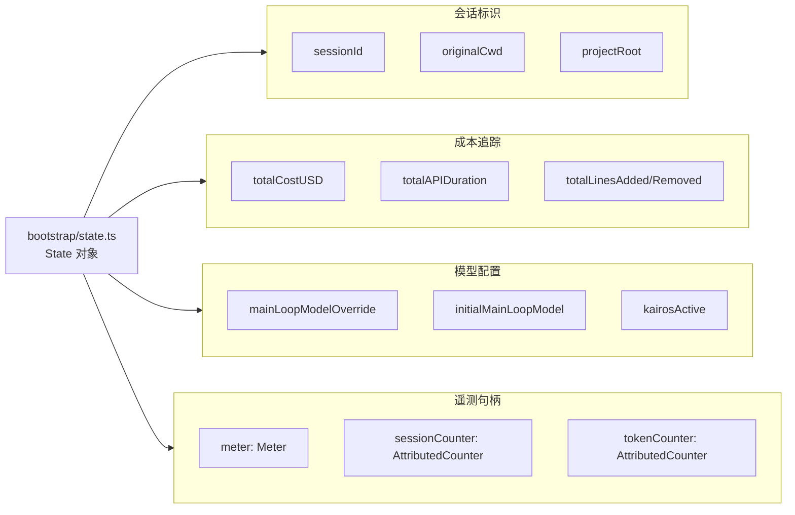
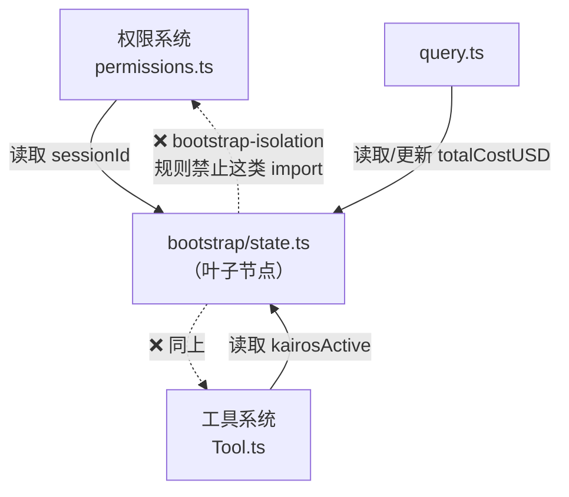

# 第5章：Bootstrap 全局状态——进程的状态脊梁

> *"Global state is a code smell—unless it's the only honest way to model the truth."*

> `src/bootstrap/state.ts` 有一行注释：`DO NOT ADD MORE STATE HERE`。这个模块有 80 个字段，包含 8 个 OpenTelemetry 对象。它是设计失误还是刻意为之？为什么 ESLint 有一条专门限制它的自定义规则？本章回答"什么状态值得全局化"。

`src/bootstrap/state.ts` 的第 31 行有一条警告：

```typescript
// DO NOT ADD MORE STATE HERE - BE JUDICIOUS WITH GLOBAL STATE
```

**源码参考：** `src/bootstrap/state.ts:31`

这种注释很少见。它说的不是"不能用这个文件"，而是"你知道你在干什么之前，不要向这里加东西"。这是一个有意识地维护的全局状态模块，**不是历史遗留的意外**。

为什么一个设计良好的系统会需要全局状态？为什么 OpenTelemetry 的指标对象会出现在这个文件里？为什么有一条专门的 ESLint 规则（`bootstrap-isolation`）来限制这个模块的 import 范围？

这三个问题共享同一个答案：**当状态需要被整个进程共享，且初始化顺序是关键约束时，全局模块比依赖注入更诚实**。

读完这章，你能识别哪些状态适合全局模式、哪些不适合，以及如何用自定义 ESLint 规则防止这种设计被滥用。

## 5.1 80 个状态变量集中在一个模块——这是设计还是债务？

先看 `State` 类型的规模：

```typescript
// src/bootstrap/state.ts:45
type State = {
  originalCwd: string
  projectRoot: string
  totalCostUSD: number
  totalAPIDuration: number
  // ... 
  kairosActive: boolean
  // ...
  meter: Meter | null
  sessionCounter: AttributedCounter | null
  locCounter: AttributedCounter | null
  // ... 还有约 60 个字段
  sessionId: SessionId
  // ...
}
```

**源码参考：** `src/bootstrap/state.ts:45`

约 80 个字段，覆盖四个关注点：

| 分组 | 代表字段 | 用途 |
|------|---------|------|
| 会话标识 | `sessionId`, `originalCwd`, `projectRoot` | 跨模块定位当前会话 |
| 成本追踪 | `totalCostUSD`, `totalAPIDuration`, `totalLinesAdded` | 跨工具调用的累计统计 |
| 模型配置 | `mainLoopModelOverride`, `initialMainLoopModel` | 当前会话的模型设置 |
| 遥测 | `meter`, `sessionCounter`, `tokenCounter` | OpenTelemetry 指标句柄 |

### 为什么不用依赖注入？

`totalCostUSD` 在哪里会被更新？`QueryEngine`、`BashTool`、`AgentTool`——每次调用 LLM 或执行工具后都会更新。如果用依赖注入，这意味着每个工具的 `call()` 函数都需要接受一个 `costTracker` 参数，每个中间层都要透传它。

**工具接口（`src/Tool.ts:362`）**已经有 5 个参数：

```typescript
call(
  args: z.infer<Input>,
  context: ToolUseContext,
  canUseTool: CanUseToolFn,
  parentMessage: AssistantMessage,
  onProgress?: ToolCallProgress<P>,
): Promise<ToolResult<Output>>
```

再加 `costTracker`、`metricCounter`、`sessionId`…参数列表会变成 10 个。

**核心权衡**：

| 维度 | 依赖注入 | 全局状态（bootstrap） |
|------|---------|---------------------|
| 可测试性 | ✅ 高（可替换依赖）| ⚠️ 需 mock 模块 |
| 代码噪声 | ❌ 高（透传参数）| ✅ 低（直接调用） |
| 隐藏依赖 | ✅ 无（接口显式）| ❌ 有（调用方不知道依赖）|
| 适用场景 | 局部状态、可替换策略 | 进程级单例、跨层共享 |

**Claude Code 的选择**：`totalCostUSD` 这类字段确实是进程级单例——整个进程只有一份成本计数（初始化为 `0`，见 `src/bootstrap/state.ts:280`）。**当"全局唯一"是业务事实而非设计选择时，全局状态是诚实的**，依赖注入反而在假装它可以被替换。

**源码参考：** `src/bootstrap/state.ts:280`

**图 5-1：State 字段分组**



## 5.2 bootstrap-isolation 规则如何防止依赖循环？

`bootstrap/state.ts` 是整个系统的**叶子节点**——它不能 import 任何业务模块，否则会形成循环依赖。举一个真实例子：

```
权限系统（permissions.ts）
  → 使用 sessionId（需要 bootstrap/state）
  
bootstrap/state.ts
  → 如果 import permissions.ts（需要验证权限）
  → 循环！
```

为了防止这种情况，代码库有一个自定义 ESLint 规则 `bootstrap-isolation`。看 `state.ts` 顶部的注释：

```typescript
// src/bootstrap/state.ts:15-17
// zero circular-dep risk. Path-alias import bypasses bootstrap-isolation
// (rule only checks ./ and / prefixes); explicit disable documents intent.
// eslint-disable-next-line custom-rules/bootstrap-isolation
import { randomUUID } from 'src/utils/crypto.js'
```

**源码参考：** `src/bootstrap/state.ts:15`

这行注释说明：`bootstrap-isolation` 规则检查 `./` 或 `/` 前缀的相对路径 import，路径别名 `src/` 可以绕过。但这里**显式加了 `eslint-disable` 注释来文档化这是有意为之的特例**——这是"受控例外"的写法，不是悄悄绕过规则。

**图 5-2：bootstrap-isolation 防止循环依赖**



**结论**：`bootstrap-isolation` 是把架构约束（"bootstrap 是叶子"）转化为**可自动检查的规则**。违反这条规则意味着引入了循环依赖，构建会报错。

## 5.3 遥测指标为什么不是独立的 OTel 单例，而是嵌入 State？

State 里有 8 个 OTel 相关字段：`meter`、`sessionCounter`、`locCounter`、`prCounter`、`commitCounter`、`costCounter`、`tokenCounter`、`codeEditToolDecisionCounter`。

这看起来很奇怪——OTel 通常是独立的 SDK，为什么要把它的句柄放进业务状态对象？

原因在注释中没有明说，但可以从代码结构推断：**遥测指标需要在会话开始时初始化，在会话结束时上报**。如果 OTel 是独立的单例，初始化顺序就需要额外管理——谁先初始化，谁可以使用。

把 OTel 句柄放进 `State`，则初始化顺序自然变成：**初始化 `State` 时一并初始化所有 OTel 对象**。任何访问 `totalCostUSD` 的代码，都可以顺手调用 `costCounter.add(delta)`，不需要知道 OTel 是否已经初始化。

```typescript
// src/bootstrap/state.ts:95（示意）
meter: Meter | null
sessionCounter: AttributedCounter | null
costCounter: AttributedCounter | null
tokenCounter: AttributedCounter | null
```

`null` 是重要的：State 初始化时所有 OTel 字段为 `null`（`src/bootstrap/state.ts:277`），OTel SDK 初始化成功后才填充句柄。调用方只需 `costCounter?.add(delta)` 即可安全使用。这种"先 null 后填充"模式让 OTel 的初始化时序与会话启动时序完全解耦。

**源码参考：** `src/bootstrap/state.ts:277`（state 对象初始化赋值）

**核心权衡**：OTel 内嵌 State 的代价是 `State` 类型承担了遥测职责，不够"纯粹"；收益是生命周期自动对齐——不会出现"会话已结束但 OTel 还未关闭"或"OTel 已初始化但 sessionId 还未就绪"的时序问题。

## 5.4 状态变化通知：不用 EventEmitter，用 createSignal 解决什么问题？

State 里有一些需要被观察的字段。以会话切换为例：

```typescript
// src/bootstrap/state.ts:481
const sessionSwitched = createSignal<[id: SessionId]>()
```

**源码参考：** `src/bootstrap/state.ts:481`

`createSignal` 创建一个轻量级事件信号——不是 RxJS Observable，而是一个简单的发布-订阅机制。`switchSession()` 函数在切换会话时 emit 这个信号，订阅方（如会话持久化模块）可以响应并做清理。

这在第23章（会话系统）中有详细分析。

## 模式提炼

### 有注释的全局状态（Annotated Global State）

**解决的问题**：全局状态容易被滥用——每次"暂时需要"时就加一个字段，最终成为无人敢动的大泥球。

**核心做法**：集中存放，但在文件顶部加"不要随意添加"的警告注释；配合自定义 lint 规则强制执行依赖约束；字段加注释说明为什么需要全局化。

**前置条件**：确实需要跨多个子系统共享的进程级唯一状态，且无法通过参数传递实现。

**源码证据**：`src/bootstrap/state.ts:31` — `// DO NOT ADD MORE STATE HERE - BE JUDICIOUS WITH GLOBAL STATE`，明确说明这不是随意添加的地方。

### 架构约束代码化（Codified Architecture Constraint）

**解决的问题**："bootstrap 模块不能 import 业务模块"这类规则只靠 code review 难以持续执行。

**核心做法**：将依赖方向约束写成自定义 ESLint 规则（`bootstrap-isolation`），使违规在开发时立即可见。

**前置条件**：有明确的模块依赖层次规范，且层次规范需要长期维护。

**源码证据**：`src/bootstrap/state.ts:17` — `// eslint-disable-next-line custom-rules/bootstrap-isolation`，规则存在且被执行，例外情况须显式注释说明原因。

### 遥测生命周期对齐（Telemetry Lifecycle Alignment）

**解决的问题**：OTel 对象独立管理时，初始化顺序和会话生命周期难以对齐，容易出现"use before init"或"report after session end"的时序问题。

**核心做法**：将遥测句柄内嵌为 State 的字段，随 State 一起初始化和销毁；用 `null` 表示未初始化，调用方用 `?.add()` 安全访问。

**前置条件**：遥测需要按会话粒度统计，且遥测的生命周期与会话完全对应。

**源码证据**：`src/bootstrap/state.ts:95` — `meter: Meter | null`，8 个遥测字段全部随 State 初始化，字段类型允许 `null` 处理未就绪状态。

## 踩坑

### ❌ 无视注释往 state.ts 里堆字段

`src/bootstrap/state.ts:31` 的警告 `DO NOT ADD MORE STATE HERE - BE JUDICIOUS WITH GLOBAL STATE` 被忽略的代价是：模块体积增长，初始化时间延长，字段的生命周期没有人负责。

**判断标准**：这个状态是"进程级唯一、整个生命周期都需要"的吗？如果不是，放在使用方的本地作用域。

### ❌ 在 Bootstrap 初始化之前读取状态

```typescript
// ❌ getSessionId() 返回 undefined
import { getSessionId } from './bootstrap/state.ts'
const sid = getSessionId()  // 调用时 state 未初始化
```

这类 bug 只在首次运行时出现，且 undefined 会静默传播到日志和遥测，造成数据损坏。**ESLint 规则 `bootstrap-isolation` 专门用来防止这类 import 顺序错误**（`src/bootstrap/state.ts:31`）。

### ❌ 绕过 getter/setter 直接修改 state 对象引用

```typescript
import { state } from './bootstrap/state.ts'
state.totalCostUSD += 0.05  // ❌ 绕过 addCost() 函数
```

setter 函数里可以埋日志、触发事件、做校验。直接修改对象引用，成本统计异常时无法追踪到修改点。


## 你能做什么

- **在引入全局状态前问自己**：这个状态真的是进程级唯一的吗？还是我只是懒得传参？只有前者才适合全局模块
- **为全局状态模块加"不要随意添加"注释**：明确意图，防止 code review 时被忽视的字段悄悄增长
- **用自定义 ESLint 规则固化依赖层次**：与其在 PR 评论里说"这里不该 import"，不如一次性写成规则让 CI 自动检查
- **遥测句柄随业务状态一起初始化**：避免独立的 OTel 单例，将 `Meter`/`Counter` 等句柄放在与其生命周期一致的对象中

---

*第5章完成了第一篇"地基"的最后一章。第6章开始进入第二篇——Agent 主循环：当用户按下回车，第一个处理这个输入的函数是什么，它怎么决定把输入交给谁？*
