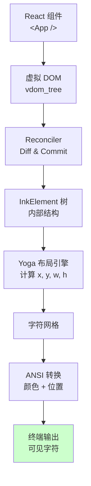
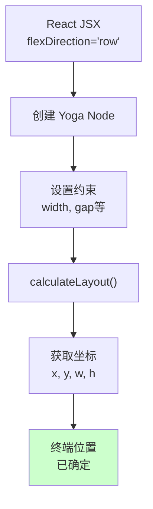
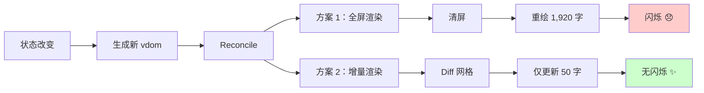
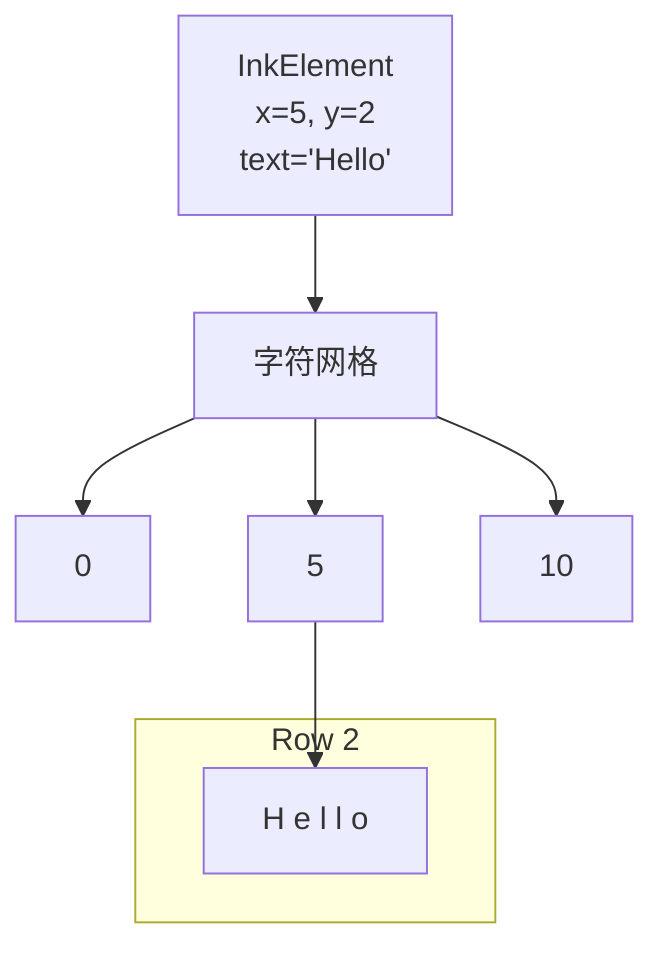

# 第 38 章：Ink 的自建 Reconciler - 在终端渲染 React
> Claude Code 的 UI 在终端运行。但终端不像浏览器那样"理解" React 组件。系统怎样把 React 虚拟 DOM 树转换为 ANSI 字符序列？为什么 Ink 要自己实现 React 的 Reconciler 算法？
---
## 38.1 问题：终端环境的 React
### 定义
**Ink** = 一个在终端（CLI）中运行 React 应用的框架。
```
对标参考：
  Web: React → Virtual DOM → DOM tree → HTML rendering
  React Native: React → Virtual DOM → UIView → 移动设备
终端（Ink）：
  React → Virtual DOM → Ink Reconciler → ANSI 字符 → 终端
```
### 为什么难
```
Web 浏览器：
  ✓ DOM 树是持久化的（每次可以增量更新）
  ✓ 元素有明确的坐标（x, y, width, height）
  ✓ 有成熟的布局引擎（FlexBox）
  ✓ 渲染是"即时"的（renderer 不关心输出）
终端：
  ❌ 没有"树"的概念，只有线性的字符流
  ❌ 每次改变都要重新绘制整行（无法精细的增量更新）
  ❌ 需要自己实现布局（Flexbox → Yoga engine）
  ❌ 需要处理光标位置、颜色、特殊字符等低级细节
```
### 设计意图
在 `src/ink/reconciler.ts` 中：
```typescript
/**
 * Ink 的自定义 Reconciler
 * 
 * React 定义了 Reconciler 接口（如何更新组件树），
 * 但不知道如何将组件渲染到终端。
 * 
 * 我们需要实现：
 * 1. 如何创建元素（createInstance）
 * 2. 如何更新属性（updateProps）
 * 3. 如何处理文本内容（appendText）
 * 4. 如何销毁元素（removeChild）
 */
```
---
## 38.2 Ink Reconciler 的核心概念
### 元素模型
Ink 中的"元素"不是 DOM node，而是一个内部数据结构：
```typescript
// src/ink/reconciler.ts
type InkElement = {
  type: 'box' | 'text' | 'custom'
  // 尺寸（由 Yoga layout engine 计算）
  x: number
  y: number
  width: number
  height: number
  // 样式
  color?: string        // 'red', 'blue', ...
  backgroundColor?: string
  bold?: boolean
  italic?: boolean
  // 内容
  text?: string
  children: InkElement[]
  // 组件关联（如果是自定义组件）
  component?: React.FunctionComponent
  props?: Record<string, unknown>
}
```
### Reconciliation 流程
当 React 组件状态改变时：
```
步骤 1：React 重新执行组件代码
  → 生成新的虚拟 DOM 树（vdom_new）
步骤 2：Reconciliation 算法（Diffing）
  → 对比 vdom_old 和 vdom_new
  → 找出哪些节点被添加、删除、修改
步骤 3：Commit 变更
  → 调用 Ink 的 createInstance、updateProps 等
  → 更新内部的 InkElement 树
步骤 4：终端渲染
  → 计算布局（Yoga）
  → 转换为 ANSI 字符
  → 写入终端
```
---
## 38.3 Yoga 布局引擎的集成
### 问题
终端需要像浏览器一样进行布局（flex、grid 等），但空间是字符网格。
### 解决方案：Yoga
Yoga 是 Facebook 开源的 Flexbox 实现库，独立于 DOM：
在 `src/ink/layoutEngine.ts` 中：
```typescript
import Yoga from 'yoga-layout'
function calculateLayout(element: InkElement): void {
  // 步骤 1：为元素创建 Yoga node
  const yogaNode = Yoga.Node.create()
  // 步骤 2：设置 flex 属性
  yogaNode.setFlexDirection(
    element.flexDirection === 'row'
      ? Yoga.FLEX_DIRECTION_ROW
      : Yoga.FLEX_DIRECTION_COLUMN
  )
  yogaNode.setFlexWrap(Yoga.WRAP_WRAP)
  yogaNode.setJustifyContent(Yoga.JUSTIFY_CENTER)
  yogaNode.setAlignItems(Yoga.ALIGN_CENTER)
  // 步骤 3：设置尺寸约束
  yogaNode.setWidth(terminalWidth)  // 终端宽度
  yogaNode.setHeight(terminalHeight)
  // 步骤 4：递归设置子元素
  for (const child of element.children) {
    const childYogaNode = yogaNode.create()
    yogaNode.insertChild(childYogaNode, element.children.indexOf(child))
    calculateLayout(child)  // 递归
  }
  // 步骤 5：计算最终位置
  yogaNode.calculateLayout(Yoga.DIRECTION_LTR)
  // 步骤 6：读取计算结果
  element.x = yogaNode.getComputedLeft()
  element.y = yogaNode.getComputedTop()
  element.width = yogaNode.getComputedWidth()
  element.height = yogaNode.getComputedHeight()
}
```
### 布局的结果
```
输入（React JSX）：
  <Box flexDirection="row" gap={2}>
    <Text>Left</Text>
    <Text>Right</Text>
  </Box>
Yoga 计算后：
  Left   Right
  (x=0)  (x=7)
实际输出（终端）：
  "Left  Right"  (中间有 gap=2 个空格)
```
---
## 38.4 从 InkElement 到 ANSI 字符
### 步骤 1：建立字符网格
```typescript
// src/ink/grid.ts
class TerminalGrid {
  private grid: Cell[][]  // grid[y][x]
  private width: number
  private height: number
  constructor(width: number, height: number) {
    this.width = width
    this.height = height
    // 初始化为空白字符
    this.grid = Array(height)
      .fill(null)
      .map(() =>
        Array(width).fill({
          char: ' ',
          color: 'default',
          backgroundColor: 'default'
        })
      )
  }
}
```
### 步骤 2：渲染元素树
```typescript
// src/ink/render-node-to-output.ts
function renderElement(
  element: InkElement,
  grid: TerminalGrid
): void {
  // 如果是文本元素
  if (element.type === 'text' && element.text) {
    // 逐字符写入网格
    for (let i = 0; i < element.text.length; i++) {
      const x = element.x + i
      const y = element.y
      if (x < grid.width && y < grid.height) {
        grid.set(x, y, {
          char: element.text[i],
          color: element.color,
          backgroundColor: element.backgroundColor,
          bold: element.bold,
        })
      }
    }
  }
  // 如果是容器元素，递归渲染子元素
  if (element.type === 'box') {
    for (const child of element.children) {
      renderElement(child, grid)
    }
  }
}
```
### 步骤 3：转换为 ANSI 序列
```typescript
// src/ink/ansi-converter.ts
function gridToANSI(grid: TerminalGrid): string {
  let output = ''
  for (let y = 0; y < grid.height; y++) {
    for (let x = 0; x < grid.width; x++) {
      const cell = grid.get(x, y)
      // 添加颜色转义码
      if (cell.color !== 'default') {
        output += `\x1b[${colorToCode(cell.color)}m`
      }
      // 添加字符
      output += cell.char
    }
    // 行尾重置并换行
    output += '\x1b[0m\n'
  }
  return output
}
function colorToCode(color: string): number {
  const colorMap = {
    'black': 30,
    'red': 31,
    'green': 32,
    'yellow': 33,
    'blue': 34,
    'magenta': 35,
    'cyan': 36,
    'white': 37,
  }
  return colorMap[color] || 37
}
```
**输出示例**：
```
\x1b[31mError\x1b[0m: Something went wrong
└─ \x1b[32mSuggestion\x1b[0m: Try again
（终端显示）：
Error: Something went wrong
└─ Suggestion: Try again
（其中 Error 是红色，Suggestion 是绿色）
```
---

## 38.5 为什么不直接用 React DOM？Ink 自建 Reconciler 的真实代价

这是 Ink 最容易被误解的设计决策。直觉上，"在终端里运行 React"好像应该用 React DOM 加一个终端输出层。为什么不这么做？

### React DOM 无法用于终端的三个根本原因

**原因 1：React DOM 假设有一个 document**

```typescript
// React DOM 内部
const root = document.createElement('div')
ReactDOM.render(<App />, root)
```

`document` 是浏览器 API，在 Node.js 环境中根本不存在。即使用 jsdom 模拟，也无法产生 ANSI 字符序列输出。

**原因 2：React DOM 的输出是 HTML 字符串，不是 ANSI 序列**

`renderToString(<App />)` 产生的是 `<div class="...">text</div>`，不是 `text`。两种输出有完全不同的编码方式和语义。

**原因 3：React DOM 的更新机制基于 DOM 操作**

React DOM 使用 `insertBefore`/`removeChild`/`setAttribute` 等 DOM API 进行增量更新。终端没有这些 API——更新必须通过 ANSI 光标控制序列（`;MH` 移动光标，`` 清行）来实现。

### react-reconciler 的本质：可插拔的渲染目标

`react-reconciler` 是 React 18 的核心包，它将"协调算法"（Fiber diff）和"渲染目标"（host）分离：

```
react-reconciler（协调层）
  ├─ 负责：Fiber 树的构建和更新、hooks 的调度、优先级管理
  └─ 不负责：如何操作实际的节点（这由 host config 决定）

Host Config（渲染目标层）—— Ink 实现的部分
  ├─ createInstance(type, props)：创建节点（Ink → DOMElement）
  ├─ appendChildToContainer(container, child)：挂载节点
  ├─ commitUpdate(instance, oldProps, newProps)：更新节点
  └─ removeChild(container, child)：移除节点
```

React Native、React PDF、ink 都是这个模式——它们各自实现了 host config，用同一个 react-reconciler 的协调逻辑，但渲染到不同的目标（iOS UIView、PDF Canvas、终端字符网格）。

### commitUpdate 的增量语义

```typescript
// src/ink/reconciler.ts:426
commitUpdate(
  node: DOMElement,        // 被更新的节点
  _type: ElementNames,
  oldProps: DOMNodeAttribute,
  newProps: DOMNodeAttribute,
): void {
  // 只处理变化的属性，不重建节点
  for (const [key, value] of Object.entries(newProps)) {
    if (oldProps[key] !== value) {  // 精确 diff
      applyAttribute(node, key as AttributeName, value as string)
    }
  }
}
```

`commitUpdate` 的语义是"从旧状态迁移到新状态"，而不是"重新设置所有属性"。对于高频更新（流式 token 输出时进度条每秒更新几十次），这个差量设计避免了不必要的 ANSI 序列输出，减少终端闪烁（`src/ink/reconciler.ts:426`）。

### 为什么不选择 blessed 或 neo-blessed？

| 维度 | React/Ink | blessed/neo-blessed |
|------|-----------|---------------------|
| 状态管理 | React hooks，天然 | 手动管理状态 |
| 组件复用 | JSX 组件树 | 有限的 widget 体系 |
| 布局系统 | Yoga Flexbox | 绝对/相对坐标 |
| 维护状态 | 活跃（Ink v6+）| neo-blessed 基本停止维护 |
| TypeScript 支持 | 原生 | 需要 @types 补丁 |

Claude Code 选择 Ink 的决定性因素：**React 的状态模型**。Claude Code 的 UI 有极其复杂的状态——多个并行 Agent 的进度、实时流式输出、权限请求对话框的层叠，这些用 blessed 的命令式 API 管理会非常脆弱。React 的声明式状态模型让复杂 UI 状态可维护。

## 38.5 增量更新与性能优化
### 问题
每次状态改变都重新渲染整个屏幕，会闪烁且低效。
### 解决方案：Diff & Patch
```typescript
// src/ink/incremental-render.ts
function incrementalRender(
  oldGrid: TerminalGrid,
  newGrid: TerminalGrid
): string {
  let patch = ''
  for (let y = 0; y < oldGrid.height; y++) {
    for (let x = 0; x < oldGrid.width; x++) {
      const oldCell = oldGrid.get(x, y)
      const newCell = newGrid.get(x, y)
      // 如果这个位置改变了，才需要更新
      if (cellChanged(oldCell, newCell)) {
        // 移动光标到 (x, y)
        patch += `\x1b[${y + 1};${x + 1}H`  // CSI 序列
        // 设置新颜色
        if (newCell.color !== oldCell.color) {
          patch += `\x1b[${colorToCode(newCell.color)}m`
        }
        // 写入字符
        patch += newCell.char
      }
    }
  }
  return patch
}
```
**性能提升**：
```
全屏渲染：写入 80 × 24 = 1,920 字符
增量渲染：只写入变更的部分（通常 < 100 字符）
→ 输出减少 95%，性能提升显著
```
---
## 图解

**图 38-1：从 React 到终端的完整流程**

**图 38-2：Yoga 布局的工作流**

**图 38-3：增量渲染的对比**

**图 38-4：字符网格的映射**

**表格 38-1：ANSI 颜色码**
| 颜色 | 前景码 | 背景码 |
|------|--------|--------|
| Black | 30 | 40 |
| Red | 31 | 41 |
| Green | 32 | 42 |
| Yellow | 33 | 43 |
| Blue | 34 | 44 |
| Magenta | 35 | 45 |
| Cyan | 36 | 46 |
| White | 37 | 47 |
| 重置 | 0 | 0 |
**表格 38-2：Reconciler 接口实现**
| 方法 | 职责 | Ink 实现 |
|------|------|--------|
| **createInstance** | 创建组件实例 | 创建 InkElement |
| **appendChild** | 添加子元素 | 更新 children 数组 |
| **removeChild** | 移除子元素 | 从数组删除 |
| **commitUpdate** | 更新属性 | 修改颜色、位置等 |
| **commitTextUpdate** | 更新文本 | 修改 text 内容 |
---

## 模式提炼

### 自定义 Host Config（Custom React Host Config）

**解决的问题**：React 的渲染目标不限于 DOM，但 `react-dom` 硬编码了 DOM API。要在终端渲染 React，需要提供一套告诉 React"如何操作终端节点"的接口（host config）。

**核心做法**：实现 `react-reconciler` 要求的 host config 接口（`createInstance`/`commitUpdate`/`appendChildToContainer` 等），将 React 的虚拟 DOM 操作映射到 Ink 内部的 `DOMElement` 节点树。React 核心代码不变，只有渲染目标替换了。

**前置条件**：React 版本支持自定义 reconciler（React 16+）；有精确的终端"节点"抽象，能容纳 React 的所有生命周期操作。

**源码证据**：`src/ink/reconciler.ts:331` — `createInstance()` 函数创建 Ink 内部节点；`src/ink/reconciler.ts:426` — `commitUpdate()` 处理节点属性更新（增量，不全量重建）；`src/ink/reconciler.ts:405` — `supportsMutation: true` 声明这是一个支持就地修改的 host。

---

### Flexbox 布局适配器（Flexbox Layout Adapter）

**解决的问题**：终端是字符网格，没有浮动元素、百分比宽度等概念，但开发者期望能用 Flexbox 布局风格来描述 UI 结构，而不是手动计算每个字符的位置。

**核心做法**：集成 Yoga（Meta 开源的跨平台 Flexbox 引擎），为每个 Ink 节点创建对应的 Yoga 节点，将 React 组件的 `flexDirection`/`gap`/`padding` 等属性传入 Yoga，由 Yoga 计算出每个节点的绝对坐标（行列），再用 ANSI 定位序列输出。

**前置条件**：Yoga 能处理"字符单位"的网格约束（不是像素）；终端尺寸需要动态传入 Yoga 作为根约束。

**源码证据**：`src/ink/reconciler.ts:4` — `import createReconciler from 'react-reconciler'`；`src/ink/renderer.ts` 和 `src/ink/render-node-to-output.ts` 完成 Yoga 布局计算到字符输出的转换。

---

### 帧级字符差量（Frame-Level Character Diff）

**解决的问题**：每次 React 状态更新都清空终端并重绘全屏，会产生明显的闪烁；但如何在字符流（不是 DOM 节点树）上做差量？

**核心做法**：Ink 将每帧的终端输出视为字符串，用 `diffAnsiCodes()` 比较前后两帧，只输出变化的字符（通过 ANSI 光标定位序列精确替换特定位置的字符），避免全屏重绘。

**前置条件**：ANSI 序列可以精确定位到任意字符位置；能够正确处理包含颜色码的字符串差量（不仅是可见字符）。

**源码证据**：`src/ink/screen.ts` — `diffAnsiCodes()` 实现帧间差量比较；这是 Ink 渲染性能的关键——特别是 Claude Code 对话过程中高频更新的进度条和流式 token 输出。

## 核心源码索引

| 位置 | 内容 | 关键性 |
|------|------|--------|
| `src/ink/reconciler.ts:4` | `import createReconciler from 'react-reconciler'` | Ink 自建 reconciler 的起点 |
| `src/ink/reconciler.ts:331` | `createInstance()` | 将 React 组件映射为 Ink DOM 节点 |
| `src/ink/reconciler.ts:426` | `commitUpdate()` | 增量更新，只修改变化的属性 |
| `src/ink/layoutEngine.ts` | Yoga Flexbox 集成 | 终端里的 CSS Flexbox 实现 |
| `src/ink/renderer.ts` | 帧渲染器 | 从 DOM 树到 ANSI 字符的最后一步 |
| `src/ink/screen.ts` | `diffAnsiCodes()` | 帧级别的字符差量，避免全屏重绘 |

## 踩坑

### ❌ 在 React 组件的 useEffect 里直接写 process.stdout，绕过 Ink 的 reconciler

```typescript
// ❌ 错误：绕过 reconciler，Ink 不知道这次输出，下次渲染时可能覆盖
useEffect(() => {
  process.stdout.write('Direct output\n')
}, [])
```

Ink 的 `commitUpdate`（`src/ink/reconciler.ts:426`）负责维护终端的字符状态。直接写 stdout 破坏了 Ink 跟踪的状态，导致错位或重复输出。

### ❌ Flexbox 布局写死固定宽度，在小终端里被截断

```typescript
// ❌ 错误：固定宽度在 80 列终端里正常，60 列终端里越界
<Box width={100}>  {/* 100 列，超出 60 列终端 */}
```

终端宽度用 `process.stdout.columns` 动态获取，Yoga 布局引擎的约束宽度应该绑定到终端实际宽度，而不是硬编码（`src/ink/layoutEngine.ts`）。

### ❌ 进程退出时没有恢复终端状态

Ink 在运行时会隐藏光标（`CSI?25l`）、切换颜色模式。进程异常退出（Ctrl+C、unhandled exception）没有触发清理逻辑，终端保持 Ink 留下的状态，用户会看不到光标或颜色异常。

## 你能做什么

- **用 React/Ink 的组件抽象管理复杂 CLI 状态**：有状态的 CLI 界面（进度条、权限对话框、多 Agent 视图）用 React 组件比字符串拼接可维护得多
- **利用 Ink 的增量更新优化性能**：不要频繁触发全屏重绘，只更新真正变化的状态
- **Flexbox 布局绑定到终端实际宽度**：用 `process.stdout.columns` 动态约束布局，支持不同大小的终端
- **进程退出时恢复终端状态**：注册 `process.on('exit')` 显示光标、重置颜色，确保 Ink 程序退出后终端恢复正常
