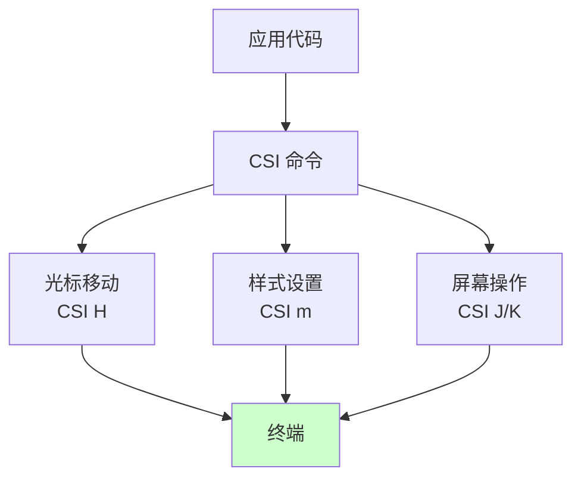
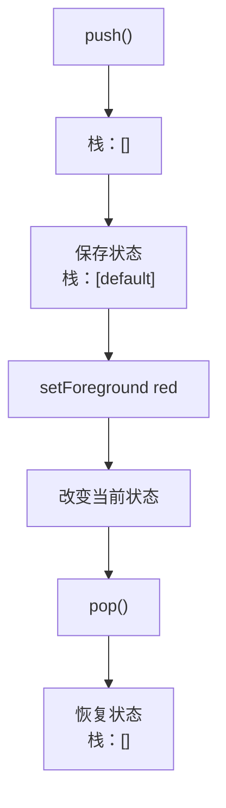
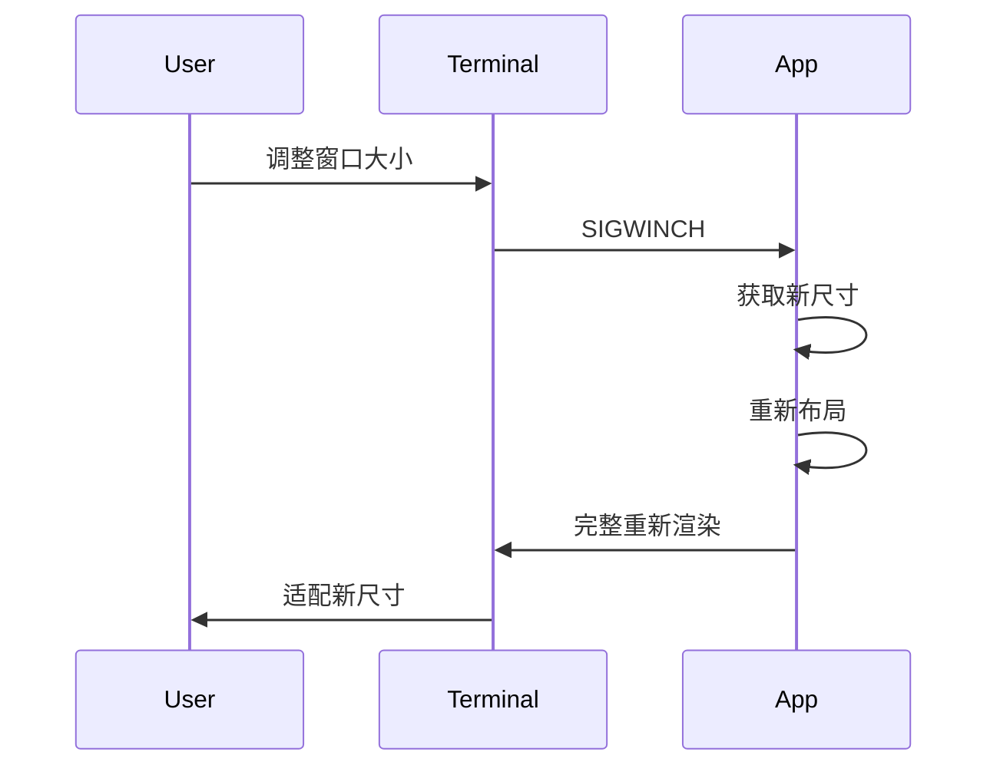

# 第 39 章：终端原语与光标管理 - 低级控制的边界
> Claude Code 在终端中运行 React 组件（ch38）。但实际的"绘制"工作需要什么？光标怎样精确定位？如何避免终端状态混乱？
---
## 39.1 问题：终端的低级 API
### 定义
**终端原语** = 对终端物理特性的最小操作集合：
- 光标移动（上/下/左/右/绝对定位）
- 文本颜色和样式
- 屏幕清空和区域清空
- 特殊字符和符号
```
对比：
  Web：调用 DOM API，浏览器负责渲染
  终端：需要发送原始 ANSI 转义序列到 stdout
```
### 为什么难
```
问题 1：状态泄漏
  • 某个命令设置了红色文本
  • 忘记重置
  → 后续所有文本都是红色（污染全局状态）
问题 2：光标位置不可知
  • 想写第 5 行第 10 列
  • 但终端可能已经换行或被其他程序写入
  • 无法精确定位（不像 DOM 的绝对坐标）
问题 3：屏幕尺寸动态变化
  • 用户调整终端窗口大小
  • 旧的坐标全部失效
  • 需要完整重新布局和渲染
问题 4：竞态条件
  • 多个进程都在写终端
  • Agent A 在第 10 行写进度条
  • Agent B 同时在第 5 行写日志
  • 结果混乱
```
---
## 39.2 ANSI 转义序列的核心操作
### 光标控制
在 `src/ink/cursorControl.ts` 中：
```typescript
// CSI = Control Sequence Introducer
const CSI = '\x1b['
class CursorController {
  // 绝对定位：光标移到 (row, col)
  moveTo(row: number, col: number): string {
    return `${CSI}${row + 1};${col + 1}H`
    //           ↑ 终端计数从 1 开始，不是 0
  }
  // 相对移动
  moveUp(count: number = 1): string {
    return `${CSI}${count}A`
  }
  moveDown(count: number = 1): string {
    return `${CSI}${count}B`
  }
  moveRight(count: number = 1): string {
    return `${CSI}${count}C`
  }
  moveLeft(count: number = 1): string {
    return `${CSI}${count}D`
  }
  // 保存和恢复光标位置
  save(): string {
    return '\x1b7'  // SCP (Save Cursor Position)
  }
  restore(): string {
    return '\x1b8'  // RCP (Restore Cursor Position)
  }
  // 隐藏/显示光标
  hide(): string {
    return `${CSI}?25l`  // l = off
  }
  show(): string {
    return `${CSI}?25h`  // h = on
  }
}
```
### 样式设置
```typescript
class StyleController {
  // SGR = Select Graphic Rendition
  // 颜色（前景）
  setForeground(colorCode: number): string {
    return `${CSI}${colorCode}m`
  }
  // 常见颜色码：
  //  30-37 = 标准颜色 (黑、红、绿、黄、蓝、品红、青、白)
  //  90-97 = 亮色
  // 38;5;n = 256 色模式
  // 38;2;r;g;b = RGB 真彩色
  // 粗体/斜体
  bold(): string {
    return `${CSI}1m`
  }
  italic(): string {
    return `${CSI}3m`
  }
  underline(): string {
    return `${CSI}4m`
  }
  // 重置所有样式
  reset(): string {
    return `${CSI}0m`
  }
}
```
### 屏幕清空
```typescript
class ScreenController {
  // 清空整个屏幕
  clear(): string {
    return `${CSI}2J`
  }
  // 清空光标到屏幕末尾
  clearToEnd(): string {
    return `${CSI}0J`
  }
  // 清空当前行
  clearLine(): string {
    return `${CSI}2K`
  }
  // 从光标到行末清空
  clearToLineEnd(): string {
    return `${CSI}0K`
  }
}
```
---
## 39.3 状态管理与恢复
### 问题
ANSI 样式是"粘性"的（一旦设置就一直生效，直到重置）。
```
脚本 1：输出红色文本
  echo -e '\x1b[31mRed\x1b[0m'  ← 记得重置
  ✓ 结果：只有"Red"是红色
脚本 2：输出红色文本但忘记重置
  echo -e '\x1b[31mRed'         ← 忘记 \x1b[0m
  ❌ 结果：后续所有终端输出都是红色（污染全局）
```
### 解决方案：Save/Restore 栈
在 `src/ink/styleStack.ts` 中：
```typescript
class StyleStack {
  private stack: StyleState[] = []
  private current: StyleState = {
    foreground: 'default',
    background: 'default',
    bold: false,
    italic: false,
    underline: false
  }
  push(): void {
    // 保存当前状态到栈
    this.stack.push({...this.current})
  }
  pop(): void {
    // 恢复到上一个状态
    if (this.stack.length > 0) {
      this.current = this.stack.pop()!
      this.emitReset()
    }
  }
  setForeground(color: string): void {
    this.current.foreground = color
  }
  // 最后，为所有样式变更清理环境
  cleanup(): void {
    this.current = {
      foreground: 'default',
      background: 'default',
      bold: false,
      italic: false,
      underline: false
    }
    // 输出重置命令
    process.stdout.write('\x1b[0m')
  }
}
```
**使用示例**：
```typescript
const styles = new StyleStack()
// 输出普通文本
process.stdout.write('Normal')
// 进入红色模式
styles.push()
styles.setForeground('red')
process.stdout.write('\x1b[31mRed')
// 回到普通文本
styles.pop()
process.stdout.write('Normal again')
// 清理（保险起见）
styles.cleanup()
```
---
## 39.4 屏幕尺寸与自适应
### 获取终端大小
在 `src/ink/terminalSize.ts` 中：
```typescript
class TerminalSize {
  private width: number
  private height: number
  private resizeListeners: Set<() => void> = new Set()
  constructor() {
    // 初始化
    const size = process.stdout.getWindowSize?.() || [80, 24]
    this.width = size[0]
    this.height = size[1]
    // 监听尺寸变化（SIGWINCH 信号）
    process.on('SIGWINCH', () => {
      this.onResize()
    })
  }
  private onResize(): void {
    const newSize = process.stdout.getWindowSize?.() || [80, 24]
    if (newSize[0] !== this.width || newSize[1] !== this.height) {
      this.width = newSize[0]
      this.height = newSize[1]
      // 通知所有监听器
      for (const listener of this.resizeListeners) {
        listener()
      }
    }
  }
  onResize(callback: () => void): () => void {
    this.resizeListeners.add(callback)
    // 返回取消监听函数
    return () => {
      this.resizeListeners.delete(callback)
    }
  }
  getSize(): {width: number; height: number} {
    return {width: this.width, height: this.height}
  }
}
```
### 重新布局
当终端尺寸改变时，所有组件需要重新计算布局：
```
事件流：
  SIGWINCH 信号 → onResize() 
    → 更新 terminalSize 
    → 触发所有 resizeListeners 
    → Ink 重新计算 Yoga 布局 
    → 完整重新渲染屏幕
```
---
## 39.5 竞态条件与互斥
### 问题
```
两个异步任务同时写终端：
Task A：写进度条 50%
  "Progress: [#####      ] 50%"
Task B：写日志
  "INFO: Task completed"
结果（竞态）：
  "Progress: INF: [#####O     ] 50%Task completed"
  ↑ 完全混乱
```
### 解决方案：互斥锁
在 `src/ink/terminalMutex.ts` 中：
```typescript
class TerminalMutex {
  private isLocked = false
  private queue: Array<() => Promise<void>> = []
  async write(task: () => Promise<void>): Promise<void> {
    // 如果已加锁，加入队列
    if (this.isLocked) {
      return new Promise((resolve) => {
        this.queue.push(async () => {
          await task()
          resolve()
        })
      })
    }
    this.isLocked = true
    try {
      await task()
    } finally {
      this.isLocked = false
      // 处理队列中的下一个任务
      if (this.queue.length > 0) {
        const next = this.queue.shift()!
        // 不等待（继续非阻塞）
        this.write(next)
      }
    }
  }
}
// 使用
const mutex = new TerminalMutex()
// 两个任务都会通过互斥锁序列化
await mutex.write(async () => {
  // 写进度条（原子操作，不会被打断）
  process.stdout.write('Progress: 50%\n')
})
await mutex.write(async () => {
  // 写日志（原子操作）
  process.stdout.write('INFO: Task completed\n')
})
```
---
## 延伸：终端控制的设计选择与权衡

### 为什么用 ANSI 转义序列而不是 ncurses？

`ncurses` 是 C 语言的终端控制库，很多 TUI 应用都基于它。为什么 Ink 不基于 ncurses？

1. **Node.js/Bun 生态无法直接用 ncurses**：ncurses 是 C 库，在 Node.js 中使用需要 native bindings，增加了安装复杂度（编译依赖、平台差异）

2. **ncurses 的抽象层是"窗口"，而非"字符"**：ncurses 管理多个 `WINDOW` 对象，适合传统的全屏 TUI 应用（如 vim、htop）。但 Claude Code 的 UI 是流式输出 + 偶尔的弹框，不是全屏 TUI，ncurses 的窗口管理是过度设计

3. **跨平台性**：ANSI 序列在 macOS、Linux、Windows Terminal 上都有标准支持。`ncurses` 需要 terminfo 数据库，在不同平台上行为可能有差异

### 为什么用 Yoga 而不是自己实现布局算法？

Flexbox 布局算法本身并不复杂（对于基本用例），为什么 Ink 不自己实现？

1. **边缘情况的复杂性**：`flex-wrap`、`align-items`、`justify-content` 的各种组合形成了极多的边缘情况。Meta 的 Yoga 团队经过多年打磨，Ink 获得了一个经过充分测试的实现，而无需自己测试这些边缘情况

2. **一致性**：Yoga 是 React Native 使用的同一个布局引擎。开发者用 React Native 的布局经验来写 Ink 组件，行为是一致的，降低了学习成本

3. **多线程安全**：Yoga 支持多线程布局计算，Ink 未来可以利用这一点优化大型布局的性能

### CSI 和 OSC 序列的分工：为什么不统一成一种序列？

```
CSI (Control Sequence Introducer): ESC[...
  用于：光标控制、颜色、屏幕操作
  特点：即时生效，参数是数字
  
OSC (Operating System Command): ESC]...
  用于：标题设置、超链接、图片（Kitty 协议）
  特点：可能涉及二进制数据，参数是字符串
```

两种序列的分工来自历史设计：CSI 是 ANSI 标准（1976年），简单高效；OSC 是后来扩展的，用于需要字符串参数（如 URL）的操作。统一成一种会要求 ANSI 标准重新设计，实际上不可能。

Ink 的 `csi.ts`（`src/ink/termio/csi.ts`）和 `osc.ts`（`src/ink/termio/osc.ts`）分别处理这两种序列，正好对应了这个历史分工——不是 Ink 的过度设计，而是终端标准的现实。

### tokenizer 与 parser 分工的工程价值

```
单阶段处理（合并 tokenize + parse）：
  raw bytes → Action
  
  缺陷：
  - 测试困难：无法独立测试"字节切分"和"意义解析"
  - 扩展困难：添加新序列类型需要修改整个状态机

两阶段处理（tokenize → parse）：
  raw bytes → Token → Action
  
  优势：
  - tokenizer 只关心字节边界（ESC 开始，BEL 或 ST 结束）
  - parser 只关心 Token 的语义（这个 CSI 序列代表什么操作）
  - 分别测试、分别替换
```

`src/ink/termio/tokenize.ts:57` 的 `createTokenizer()` 和 `src/ink/termio/parser.ts:87` 的 `parseCSI()` 的职责分离，是软件工程中"单一职责原则"的直接体现——一个函数只做一件事，做好一件事。

## 图解

**图 39-1：ANSI 控制流**

**图 39-2：样式栈的管理**

**图 39-3：SIGWINCH 事件处理**

**表格 39-1：常见 ANSI 代码**
| 操作 | 代码 | 参数 |
|------|------|------|
| 光标绝对位置 | CSI H | row, col |
| 光标上移 | CSI A | count |
| 清空屏幕 | CSI 2J | - |
| 粗体 | CSI 1m | - |
| 红色 | CSI 31m | - |
| 重置 | CSI 0m | - |
---

## 模式提炼

### 样式栈（Style Stack）

**解决的问题**：ANSI 颜色码是全局状态——设置了红色之后不重置，后续所有输出都是红色。嵌套的颜色区域（红色里面的蓝色）更难处理。

**核心做法**：用栈管理样式状态。进入颜色区域时 `push()` 保存当前状态，离开时 `pop()` 恢复。这和编程语言的词法作用域是同构的。

**前置条件**：所有终端输出都通过统一的样式管理器，不允许直接调用 ANSI 转义码。

**源码证据**：`src/ink/styleStack.ts` — `StyleStack.push()/pop()` 管理颜色作用域，进程退出时 `cleanup()` 重置所有样式。

### 互斥写入（Mutex Write）

**解决的问题**：多个异步任务（主对话、子 Agent、后台日志）同时写终端，输出内容交叉混乱。

**核心做法**：所有终端写入通过 `TerminalMutex.write()` 序列化。新的写入请求如果当前有写入在进行，加入等待队列（Promise 链），写入完成后自动触发下一个。

**前置条件**：终端写入是异步操作，并发写入会产生竞态；写入原子性比写入延迟更重要。

**源码证据**：`src/ink/terminalMutex.ts` — `TerminalMutex.write()` 实现写入序列化，`queue: Array<() => Promise<void>>` 管理等待列表。

### 事件驱动布局（Event-Driven Layout）

**解决的问题**：终端窗口大小会动态改变（用户拖拽窗口），所有基于固定尺寸计算的布局瞬间失效。

**核心做法**：监听 `SIGWINCH` 信号，收到信号时更新终端尺寸，通知所有监听者触发重新布局和完整重渲染。

**前置条件**：布局计算依赖终端尺寸，且尺寸改变时需要完整重算（不能增量更新布局）。

**源码证据**：`src/ink/terminalSize.ts` — `process.on('SIGWINCH', this.onResize)` 监听尺寸变化，`resizeListeners` 集合存储所有需要通知的组件。

## 延伸：termio 模块——tokenizer/parser 的职责分工

ch39 的现有内容描述了高层的 ANSI 控制概念，但遗漏了 Ink 真实实现的核心——`src/ink/termio/` 目录下的 tokenizer/parser 体系：

### tokenizer：把字节流切分为 token

```typescript
// src/ink/termio/tokenize.ts:57
export function createTokenizer(options?: TokenizerOptions): Tokenizer {
  // tokenizer 是有状态的——它记住"上一个 ESC 是否还没有匹配"
  // 当 tokenizer 识别到 ESC[ 时，进入 CSI 状态，等待后续字节
  // Token 类型包括：PrintableChar、CSI序列、OSC序列、DEC序列等
}
```

**tokenizer 的职责**：把原始字节流切分为有意义的 token（可打印字符、控制序列），但不解释序列的含义。

### parser：解释 CSI 序列的含义

```typescript
// src/ink/termio/parser.ts:87
function parseCSI(rawSequence: string): Action | null {
  // 解析 CSI 序列：ESC[ params finalByte
  // 例如：ESC[31m → 设置红色前景色（SGR: Select Graphic Rendition）
  // 例如：ESC[3;4H → 光标移到第3行第4列（CUP: Cursor Position）
}

// src/ink/termio/parser.ts:81
function parseCSIParams(paramStr: string): number[] {
  // 解析参数字符串："31;1" → [31, 1]（红色 + 粗体）
}
```

**parser 的职责**：把 CSI token 转换为具体的 `Action`（光标移动、颜色变化等）。

### CSI/SGR/OSC/DEC 四类控制序列

```typescript
// src/ink/termio/csi.ts（CSI 序列类型定义）
export const CSI_PREFIX = ESC + String.fromCharCode(ESC_TYPE.CSI)  // ESC[

// src/ink/termio/sgr.ts:127
export function applySGR(paramStr: string, style: TextStyle): TextStyle {
  // SGR（Select Graphic Rendition）: 颜色和文本样式
  // ESC[0m → 重置，ESC[31m → 红色，ESC[1m → 粗体
}
```

**四类控制序列对比**：

| 类型 | 前缀 | 用途 | 示例 |
|------|------|------|------|
| CSI | ESC[ | 光标/颜色/屏幕控制 | ESC[3;4H（移动光标）|
| SGR | ESC[...m | 字符样式（颜色/粗体）| ESC[31m（红色）|
| OSC | ESC] | 操作系统命令（标题/图片）| ESC]0;title（设置标题）|
| DEC | ESC? | DEC 私有控制（鼠标/备用屏幕）| ESC[?25l（隐藏光标）|

### DEC 与 OSC 控制序列

**DEC 私有模式**（`src/ink/termio/dec.ts`）控制终端的特殊功能：

```typescript
// src/ink/termio/dec.ts:14
export const DEC = {
  CURSOR_VISIBLE: 25,      // ESC[?25l 隐藏光标 / ESC[?25h 显示光标
  ALT_SCREEN: 47,          // ESC[?47h 切换备用屏幕（全屏应用常用）
  MOUSE_NORMAL: 1000,      // 启用鼠标事件报告
}
// DEC 私有模式：CSI ? N h（开启）/ CSI ? N l（关闭）
```

**OSC 操作系统命令**（`src/ink/termio/osc.ts`）控制终端标题、颜色主题等：

```typescript
// src/ink/termio/osc.ts:21
export function osc(...parts: (string | number)[]): string {
  // 生成 OSC 序列：ESC ] parts BEL/ST
  // 例如：ESC]0;My App → 设置终端标题为 "My App"
  // Kitty 终端用 ST 终止符（避免 BEL 蜂鸣），其他终端用 BEL
}
```

OSC 序列的特殊之处：终止符有两种（BEL `` 和 ST `ESC\`），且不同终端的支持不一致——`osc()` 函数根据 `env.terminal` 自动选择正确的终止符，这是跨终端兼容性的具体体现（`src/ink/termio/osc.ts`）。

## 踩坑

### ❌ SGR 颜色码设置后忘记重置，污染全局终端状态

```bash
# ❌ 错误：忘记  重置
echo -e 'Error message'
# 后续所有终端输出都变成红色，直到手动 reset
```

每次颜色设置后必须用 `` 重置（`src/ink/styleStack.ts`）。更好的做法是用 `StyleStack.push()/pop()` 模式，保证样式的作用域隔离。

### ❌ 用相对光标移动代替绝对定位，受其他程序影响

```typescript
// ❌ 不稳定：如果有其他程序写了终端，相对位置就错了
cursor.moveUp(3)  // 假设光标在第 N 行，向上移 3 行
// 但其他程序刚好也写了输出，实际位置不是预期的
```

在多进程共用同一个终端的场景下，只有绝对定位（`CSI row;colH`）是可靠的。

### ❌ 不监听 SIGWINCH 信号，终端调整大小后布局混乱

```typescript
// ❌ 遗漏：没有处理终端 resize 事件
const size = process.stdout.getWindowSize()  // 只读一次
// 用户调整窗口后，size 仍然是旧值
```

`TerminalSize` 类（`src/ink/terminalSize.ts`）通过 `process.on('SIGWINCH', ...)` 监听尺寸变化，触发完整的重新布局和渲染。

## 你能做什么

- **用 StyleStack 的 push/pop 模式管理颜色作用域**：像 CSS 的块作用域一样，进入颜色区域 push，离开时 pop，杜绝颜色泄漏
- **用绝对定位代替相对光标移动**：在多进程或多线程写终端的场景下，只有绝对定位（`CSI row;colH`）是可靠的
- **监听 SIGWINCH 并触发重新布局**：终端 resize 是用户会做的操作，应该优雅处理而不是忽视
- **理解 ANSI 状态机**：终端状态（颜色、光标、备用屏幕）是全局的，进入任何修改状态的操作都要有对应的恢复操作
