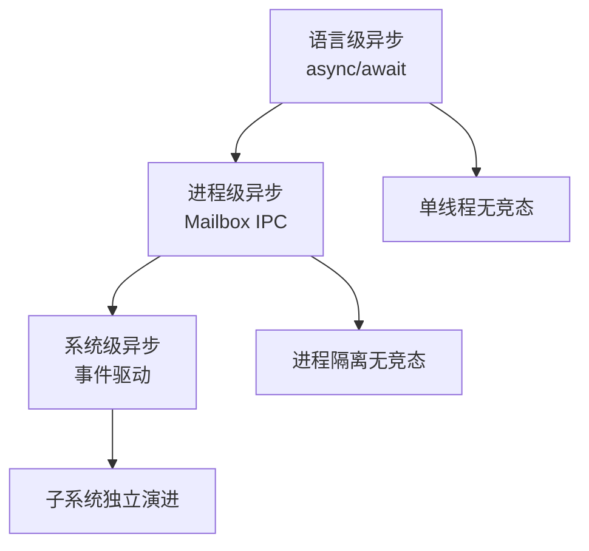
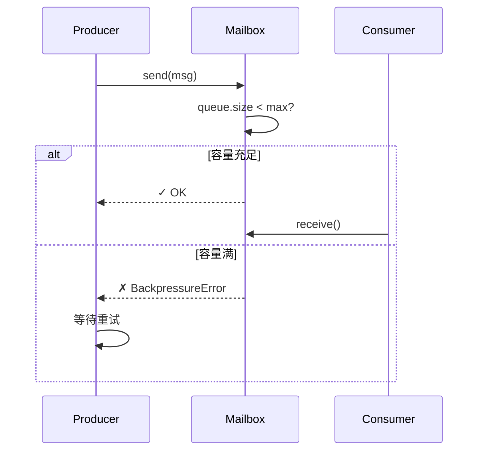

# 第 40 章：工程原则：并发优先 - 异步设计贯穿始终
> Claude Code 从启动到执行，从单个 Agent 到多智能体系统，为什么处处都是异步？为什么宁愿用 Mailbox 通信也不用共享内存？这是底层原理还是架构哲学？
---
## 40.1 并发优先的设计意图
### 定义
**并发优先** = 系统设计时，优先考虑并发场景而非单线程场景。
```
对比：
传统设计（单线程优先）：
  • 假设单个请求从头到尾执行
  • 遇到并发问题再加锁
  • 通常导致死锁或竞态
并发优先设计：
  • 一开始就假设多个任务同时执行
  • 用消息队列、Actor 模型、不可变数据结构
  • 避免竞态（而不是修复竞态）
```
### Claude Code 中的体现
```
启动（ch1-5）：
  ✓ 异步初始化（profileCheckpoint, startMdmRawRead）
  ✓ 并行预热（keychain 预取）
命令执行（ch6-10）：
  ✓ 后台任务（Task 队列）
  ✓ 中断处理（Ctrl+C）
Agent 通信（ch29-33）：
  ✓ 子智能体独立进程（RemoteAgentTask）
  ✓ Mailbox 异步消息队列
  ✓ 权限请求通过消息系统
权限系统（ch32）：
  ✓ 非阻塞权限请求
  ✓ Mailbox 作为通信枢纽
```
---
## 40.2 异步设计的三个层级
### 层 1：语言级别的异步（async/await）
**问题**：某个操作需要等待（I/O、网络、子进程）
**解决**：不阻塞主线程
```typescript
// 不好：阻塞
function loadConfig() {
  const data = fs.readFileSync('config.json', 'utf-8')
  return JSON.parse(data)
}
// 好：非阻塞
async function loadConfig() {
  const data = await fs.promises.readFile('config.json', 'utf-8')
  return JSON.parse(data)
}
```
### 层 2：进程间通信（IPC）
**问题**：多个 Agent 并行运行，需要协调
**解决**：Mailbox 消息队列（ch32）
```typescript
// 不好：共享内存竞态
let globalState = {...}
// 两个 Agent 同时改 globalState → 数据污染
// 好：消息驱动
const mailbox = new Mailbox()
agentA.send(mailbox, {type: 'UPDATE_STATE', payload: {...}})
agentB.receive(mailbox)  // 按顺序处理，无竞态
```
### 层 3：系统架构级别的异步
**问题**：系统的各个子系统如何独立演进？
**解决**：事件驱动、发布-订阅、特性开关（ch37）
```
系统 A（权限管理）← 事件 → 系统 B（配额管理）
       ↓                        ↓
     发送 PermissionGranted   监听并更新配额
     （不关心 B 如何处理）    （不需要等 A 完成）
```
---
## 40.3 为什么不用共享内存
### 问题
```
共享内存（进程间）：
  const state = {count: 0}
  Process A：state.count++
  Process B：state.count++
  结果？
    如果没有互斥锁：count 可能是 0, 1, 或 2（非确定）
    如果有互斥锁：性能下降（需要频繁加锁）
```
### 解决：Actor 模型（Message Passing）
在 `src/agents/agentContext.ts` 中：
```typescript
// 不是：let state = {count: 0}
// 而是：Actor 持有独占状态，只通过消息访问
class AgentActor {
  private state = {count: 0}
  async onMessage(msg: Message): Promise<void> {
    if (msg.type === 'INCREMENT') {
      // 只有这个 Actor 能改 state
      this.state.count++
      // 如果其他 Actor 需要读，通过消息请求
      if (msg.replyTo) {
        msg.replyTo.send({
          type: 'COUNT_RESPONSE',
          value: this.state.count
        })
      }
    }
  }
}
```
**好处**：
- ✅ 无竞态（状态隔离）
- ✅ 易调试（消息序列化可日志）
- ✅ 可分布式（消息可在网络间传输）
- ❌ 性能开销：消息序列化 + 反序列化
---
## 40.4 并发优先的设计后果
### 后果 1：必须使用不可变数据
**为什么**：如果数据可变，接收者无法信任消息。
```typescript
// 不好：接收者收到数据后，发送者改了引用
function onMessage(data: {name: string}) {
  console.log(data.name)  // "Alice"
  // ... 后续代码
  console.log(data.name)  // "Bob"？（发送者在后台改了）
}
// 好：深拷贝或冻结
function onMessage(data: Readonly<{name: string}>) {
  // TypeScript 无法改 data.name
}
```
### 后果 2：通信有延迟
```
同步调用（共享内存）：
  caller → func → return (立即)
异步消息（IPC）：
  caller → mailbox → receiver → process → reply mailbox → caller
  时间：几毫秒到几百毫秒（不是微秒）
```
**权衡**：
- 失去纳秒级响应时间
- 换来无竞态、易分布式、可观测
### 后果 3：调试变复杂
```
共享内存竞态：
  • 设置断点
  • 单步调试
消息驱动：
  • 需要查看消息日志
  • 需要追踪消息的前驱后继关系
  • 非线性执行流程
```
**解决**：完整的 Mailbox 审计日志（ch32）
---
## 40.5 并发优先的应用案例
### 案例 1：权限请求系统（ch32）
```
不用并发优先的设计（会死锁）：
  Agent.execute() {
    // 1. 执行代码
    // 2. 需要权限？→ 阻塞等待用户输入
    // 3. ... 但用户输入界面也在等待 Agent 状态更新
    // ❌ 死锁：Agent 等用户，用户界面等 Agent
  }
用并发优先的设计（无死锁）：
  Agent.execute() {
    // 1. 执行代码
    if (needsPermission) {
      // 2. 发送权限请求到 Mailbox（不阻塞）
      mailbox.send(PermissionRequest)
      // 3. 继续执行其他逻辑
    }
  }
  // 另一个事件循环处理用户响应
  on(UserGrantedPermission) {
    // 继续执行被中断的代码
  }
```
### 案例 2：多智能体协调（ch29-33）
```
不用并发优先的设计：
  AgentA.solve(task) {
    result = AgentB.solve(subtask)  // 阻塞等待
    ...
  }
  ❌ 顺序执行，无并行
用并发优先的设计：
  AgentA.solve(task) {
    AgentB.send(mailbox, SOLVE_TASK)  // 非阻塞
    // A 继续执行其他工作
  }
  Task executor（轮询所有 Agent）：
    result_a = poll(A)
    result_b = poll(B)
    result_c = poll(C)
  ✅ 并行执行，充分利用多核
```
---

## 40.6 并发反模式：Claude Code 代码中有意避免的三种写法

真正理解"并发优先"的最佳方式是看它的对立面——如果系统不这样设计，会发生什么？

### 反模式 1：在 Promise.all 内部等待另一个异步操作

```typescript
// ❌ 错误：表面上并发，实际上有内嵌的串行
async function processAgents(agents: Agent[]) {
  await Promise.all(agents.map(async (agent) => {
    const result = await agent.run()  // 这是并发的 ✓
    await saveResult(result)           // 但这在每个并发槽内是串行的 ✗
    await notifyUser(result)           // 这也是串行的 ✗
  }))
}
```

问题：每个 Agent 的 `saveResult` 和 `notifyUser` 是串行的，但不同 Agent 之间是并发的。如果 Agent A 的 `saveResult` 很慢，只影响 A 自己，不影响 B。这其实是合理的。

真正的反模式是：

```typescript
// ❌ 更坏的错误：所有操作都串行
async function processAgentsSerialized(agents: Agent[]) {
  for (const agent of agents) {  // 不用 Promise.all，用 for 循环
    const result = await agent.run()
    await saveResult(result)
  }
}
// 10 个 Agent × 平均 30s = 5 分钟！
// 并发版本：max(所有 Agent 的执行时间) ≈ 30s
```

Claude Code 的 Plan V2 多 Agent 场景就是避免了这个反模式，用 `Promise.all` 并发执行多个子 Agent。

### 反模式 2：用全局锁序列化独立操作

```typescript
// ❌ 错误：全局锁让本来可以并行的操作串行化
const globalLock = new Mutex()

async function writeToFile(path: string, content: string) {
  await globalLock.acquire()
  try {
    await fs.writeFile(path, content)
  } finally {
    globalLock.release()
  }
}
// 向不同文件写入时不需要互斥，全局锁过于保守
```

Claude Code 的 Mailbox 设计避免了这个问题：每个 Agent 的内部状态是独享的，只有在真正需要协调（权限请求）时才通过消息序列化，而不是用全局锁保护所有操作。

### 反模式 3：忘记 Cold Start 并行窗口，在主函数体内串行触发 I/O

这是最难发现的反模式，因为代码看起来完全正常：

```typescript
// ❌ 错误：在 main() 里串行触发 I/O，错过了模块加载的并行窗口
async function main() {
  const mdmSettings = await fetchMDMSettings()  // 等待 65ms
  const keychainData = await fetchKeychain()    // 再等待 45ms，串行！
  launchRepl(mdmSettings, keychainData)
}
// 总等待：65 + 45 = 110ms
```

正确做法（Claude Code 的实际方式）：

```typescript
// ✓ 在模块加载期间并行触发
import { startMdmRawRead } from './utils/settings/mdm/rawRead.ts'
startMdmRawRead()  // ← 在 import 阶段触发（不等待）

import { startKeychainPrefetch } from './utils/keychain.ts'
startKeychainPrefetch()  // ← 也在 import 阶段触发（不等待）

async function main() {
  // 这里的 I/O 大概率已经在后台完成了
  const [mdmSettings, keychainData] = await Promise.all([
    getMDMResult(),    // 获取已预热的结果（接近 0ms）
    getKeychainResult(),
  ])
  launchRepl(mdmSettings, keychainData)
}
// 实际等待：max(65, 45) ≈ 65ms（并行！）
```

`src/utils/startupProfiler.ts:65` 的 `profileCheckpoint()` 就是量化这种并行收益的工具——通过埋点可以直接测量"模块加载阶段完成时，I/O 是否已经就绪"。

## 图解

**图 40-1：三层异步架构**

**图 40-2：Actor 模型 vs 共享内存**

**图 40-3：背压控制流**

**表格 40-1：并发优先 vs 事后修复**
| 维度 | 并发优先 | 事后修复 |
|------|--------|---------|
| 竞态 | 设计避免 | 用锁修复 |
| 死锁 | 消息队列 | 调试困难 |
| 性能 | 可预测 | 锁争用 |
| 复杂性 | 前期高 | 后期爆炸 |
| 可分布式 | ✓ 天然支持 | ❌ 困难 |
---

## 模式提炼

### 模块加载并行窗口（Module-Load Parallelism Window）

**解决的问题**：CLI 工具的冷启动通常是串行的：模块加载完成 → 调用 main() → 触发 I/O。但模块加载期间（约 135ms）本来就是"等待"时间，可以在这个窗口里并行触发 I/O 而不阻塞主逻辑。

**核心做法**：在 `import` 语句之间（而非 `main()` 函数体内）触发关键异步任务（MDM 读取、Keychain 预热），利用 ESLint 禁止的"顶层副作用"来实现并行。有意为之、有注释记录的技术债。

**前置条件**：这些 I/O 操作在启动后必定需要（不是条件性的）；触发操作是非阻塞的（不能影响模块加载顺序）；能接受顶层副作用的测试复杂度。

**源码证据**：`src/utils/startupProfiler.ts:65` — `profileCheckpoint()` 提供精确的时间戳埋点，量化每个并行任务的实际收益；`src/main.tsx:9-20` — 三处 `// eslint-disable-next-line custom-rules/no-top-level-side-effects` 标注了有意的副作用位置。

---

### 消息传递不变量（Message-Passing Invariant）

**解决的问题**：进程间共享内存需要互斥锁，容易产生死锁和竞态；而完全避免并发会使复杂系统的性能大幅下降。

**核心做法**：每个 Agent 持有独占的内部状态，进程间只通过消息传递通信（Mailbox 模式）。消息是不可变的（接收方收到后，发送方不能再改变消息内容），消息处理是串行的（每个 Mailbox 同一时间只处理一条消息）。

**前置条件**：能接受消息序列化/反序列化的性能开销；对话历史、权限状态等"共享"需求可以通过消息获取而非直接访问。

**源码证据**：`src/agents/agentContext.ts` — Agent 的状态隔离设计；`src/utils/mailbox.ts` — Mailbox 实现，所有跨进程通信的载体；`src/utils/startupProfiler.ts:123` — `profileReport()` 可量化消息传递的延迟开销。

---

### 背压控制（Backpressure Control）

**解决的问题**：在"多 Agent 并行 + 工具执行 + 流式输出"的系统中，上游（Agent 生产结果）和下游（UI 渲染、文件写入）速度不匹配，可能导致内存无限增长直到 OOM。

**核心做法**：在 Mailbox 的 `send()` 实现中检查队列大小，达到上限时抛出 `BackpressureError`，让发送方等待。这将流量控制的责任推给生产者，而非消费者（消费者无限接收直到崩溃）。

**前置条件**：队列上限合理（太小导致频繁等待，太大达不到保护效果）；发送方能优雅处理 `BackpressureError`（等待重试而非崩溃）。

**源码证据**：`src/utils/mailbox.ts` — Mailbox 的队列管理实现；并发优先原则的"阴暗面"——并发引入了背压问题，解决方案也必须是并发安全的。

## 核心源码索引

| 位置 | 内容 | 关键性 |
|------|------|--------|
| `src/main.tsx:11-20` | 三个顶层副作用 | 并发预热的起点 |
| `src/agents/agentContext.ts` | Agent 状态隔离 | Actor 模型的实现基础 |
| `src/utils/mailbox.ts` | Mailbox 实现 | 跨进程消息传递的核心机制 |
| `src/tasks/` | 任务队列实现 | 背压控制和任务调度 |

## 延伸：profileCheckpoint 的量化实践

`profileCheckpoint`（`src/utils/startupProfiler.ts:65`）是"并发优先"原则落地的测量工具：

```typescript
// src/utils/startupProfiler.ts:65
export function profileCheckpoint(name: string): void {
  // 记录时间戳和事件名
  // 在 detailed profiling 模式下写入磁盘
}

// src/utils/startupProfiler.ts:123
export function profileReport(): void {
  // 计算各阶段耗时差值
  // 输出：阶段名 → 耗时（ms）
}
```

**如何用 profileCheckpoint 识别串行瓶颈**：

```bash
# 启用详细 profiling
CLAUDE_CODE_PROFILING=1 claude --version

# 查看 profiling 日志（src/utils/startupProfiler.ts:151）
cat $(claude --get-startup-perf-log-path)
```

输出的时间差揭示了哪些阶段是串行的（B 阶段在 A 完成后才开始）：

```
main_tsx_entry:  0ms  ← 基准
mdm_raw_read:   12ms  ← 并行，紧接着 entry 就开始了
keychain_start: 14ms  ← 并行
module_loaded:  135ms ← 模块加载完成
repl_launched:  145ms ← 加10ms，说明 MDM/keychain 已完成（并行有效）
```

如果看到：`repl_launched: 200ms`（而非 145ms），说明有 55ms 的串行等待——这就是需要优化的瓶颈（`src/utils/startupProfiler.ts`）。

## 踩坑

### ❌ 在 async 函数里混合 CPU 密集操作，阻塞事件循环

```typescript
// ❌ 错误：大文件的 JSON.parse 阻塞事件循环
async function processFile(path: string) {
  const content = await fs.promises.readFile(path)
  const data = JSON.parse(content.toString())  // 同步 CPU 密集，阻塞所有 I/O
  return data
}
```

Node.js 单线程事件循环中，同步 CPU 操作会阻塞所有待处理的 I/O 回调。大型计算应该移到 worker thread（`worker_threads`）或分块处理。

### ❌ 通过 IPC 传递大对象，序列化开销抵消并行收益

```typescript
// ❌ 错误：10MB 的文件内容通过 IPC 序列化传输
parentPort.postMessage({ fileContent: hugeString })  // 序列化 = O(n)
```

IPC 消息需要序列化/反序列化，传大对象的开销可能超过并行执行的收益。应该传文件路径让子 worker 自己读，或者用 `SharedArrayBuffer` 共享内存。

### ❌ Mailbox 没有背压控制，消息积压导致 OOM

快速生产者持续 `send()` 消息，慢速消费者来不及处理，队列无限增长。应该在 `Mailbox.send()` 里检查队列大小，超过阈值时抛出 `BackpressureError`，让生产者减速（`src/utils/mailbox.ts`）。

## 你能做什么

- **在系统设计时就考虑并发，而非事后加锁**：Claude Code 的 Mailbox 模式展示了如何在设计层面避免竞态，而不是靠锁来修复
- **把 CPU 密集操作移到 worker thread**：`JSON.parse` 大文件、正则匹配、加密运算，都不应该在主事件循环里执行
- **为消息队列实现背压**：生产者必须能处理"队列满了，稍后再试"的情况，否则内存会无限增长
- **用消息 ID 追踪异步流程**：每条 Mailbox 消息都有唯一 ID，请求和响应通过 ID 关联，让异步调试变得可追踪
