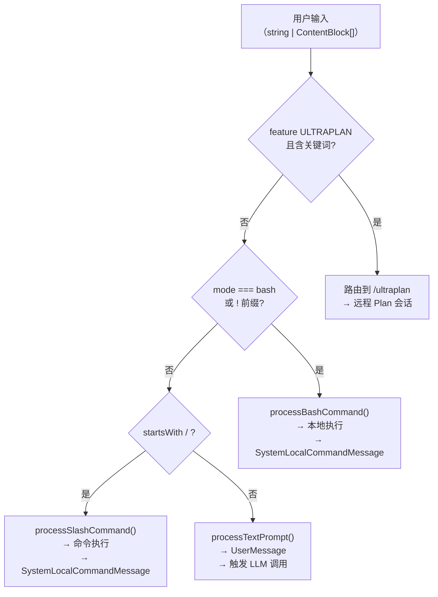
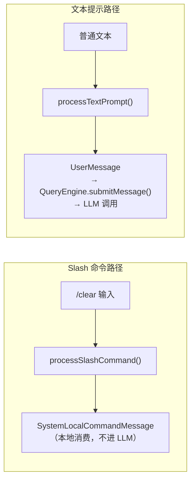

# 第6章：用户输入的三条分叉路

> *"Every input is a question: what do you want from me?"*

> 用户输入 `/help` 和用户输入 `如何优化这段代码` 都是"输入"，但前者不该经过 LLM——直接处理更快且不花 token。用户输入 `!git status` 也不该经过 LLM——直接执行。`processUserInput` 是这个分叉的入口，它的设计决定了哪些输入走 AI、哪些走本地。

你在终端输入了一行文字，按下回车。Claude Code 收到这个输入后，第一件事是什么？

不是调用 LLM。不是读文件。而是**判断这行输入是什么**——它是一个 AI 应该处理的问题，还是一个本地命令，还是一个需要特殊路由的指令。

`processUserInput` 是这个判断的入口，是 REPL 和 Agent 主循环之间的第一道分叉口。它的签名揭示了复杂度：

```typescript
// src/utils/processUserInput/processUserInput.ts:85
export async function processUserInput({
  input,
  preExpansionInput,
  mode,
  setToolJSX,
  context,
  pastedContents,
  ideSelection,
  messages,
  uuid,
  isAlreadyProcessing,
  querySource,
  canUseTool,
  skipSlashCommands,
  bridgeOrigin,
}: ...)
```

**源码参考：** `src/utils/processUserInput/processUserInput.ts:85`

14 个参数。不是因为设计差，而是因为"用户按下回车"这个简单动作背后有很多上下文——当前运行模式、是否正在处理、输入来自哪里（终端/移动端/IDE）。

这章解析分流逻辑：三条路径的优先级是什么，Slash 命令为什么能绕过 LLM，以及如果什么都不匹配会发生什么。

## 6.1 优先级如何决定将输入路由到哪条路径？

`processUserInputBase`（`src/utils/processUserInput/processUserInput.ts:281`）按以下顺序检查输入，首次匹配即路由：

**源码参考：** `src/utils/processUserInput/processUserInput.ts:281`

```
1. Ultraplan 关键词检测（feature flag 门控，实验特性）
2. Bash 模式（mode === 'bash'，前缀 !）
3. Slash 命令（inputString.startsWith('/')）
4. 文本提示（默认路径，不匹配以上任何条件）
```

核心代码在 `processUserInputBase` 的 450-580 行段落：

```typescript
// src/utils/processUserInput/processUserInput.ts:518
// Bash commands
if (inputString !== null && mode === 'bash') {
  const { processBashCommand } = await import('./processBashCommand.js')
  return addImageMetadataMessage(
    await processBashCommand(inputString, ...),
    imageMetadataTexts,
  )
}

// Slash commands
if (inputString !== null && !effectiveSkipSlash && inputString.startsWith('/')) {
  const { processSlashCommand } = await import('./processSlashCommand.js')
  const slashResult = await processSlashCommand(inputString, ...)
  return addImageMetadataMessage(slashResult, imageMetadataTexts)
}

// 默认：文本提示
return addImageMetadataMessage(
  processTextPrompt(inputString, imageContentBlocks, ...),
  imageMetadataTexts,
)
```

**源码参考：** `src/utils/processUserInput/processUserInput.ts:518,538,578`

注意：三条路径都用了**动态 import**（`await import('./processBashCommand.js')`）。这是延迟加载——Bash 和 Slash 处理模块只在真正需要时才加载，减少启动时的模块初始化开销。`processTextPrompt` 是唯一的静态导入（`src/utils/processUserInput/processUserInput.ts:61`），因为它是默认路径，总会用到。

**源码参考：** `src/utils/processUserInput/processUserInput.ts:61`（静态导入）、`src/utils/processUserInput/processUserInput.ts:518`（动态 import）

**图 6-1：用户输入分流决策树**



图中 `SystemLocalCommandMessage` 是关键：Bash 和 Slash 路径的结果类型不是 `UserMessage`，它们**不进入 LLM 调用链**（详见 6.2 节）。

### 为什么是单个大函数而非 Strategy 模式？

Strategy 模式更优雅——为每种输入类型定义一个 Handler 接口，运行时动态选择。为什么不这样做？

原因在路由条件的复杂性：Ultraplan 路由需要检查 feature flag、session 状态、输入模式等多个条件组合。这些条件互相关联，难以拆分成独立的 Handler 匹配函数。**当路由条件是全局上下文的函数（而非输入的函数）时，集中判断比 Strategy 更清晰**。

## 6.2 Slash 命令如何绕过 LLM？

这是分流机制最重要的设计点。当 `/clear`、`/help`、`/model` 这类命令被执行时，用户不希望等 LLM 响应——这些是本地操作，应该立即完成。

关键在于消息类型。`processSlashCommand` 的结果被 `isSystemLocalCommandMessage` 标记：

```typescript
// src/utils/processUserInput/processSlashCommand.tsx:34
import {
  // ...
  isSystemLocalCommandMessage,
  // ...
} from '../messages.js';
```

```typescript
// src/utils/processUserInput/processSlashCommand.tsx:515
messages: messageShouldQuery || newMessages.every(isSystemLocalCommandMessage)
  || isCompactResult ? newMessages : [createSyntheticUserCaveatMessage(), ...newMessages],
```

**源码参考：** `src/utils/processUserInput/processSlashCommand.tsx:34,515`

`SystemLocalCommandMessage` 是一种特殊消息类型——在 REPL 层被识别和消费，**不会被传递到 `QueryEngine.submitMessage()`**，因此不会触发 `query.ts` 的 LLM 调用。

**图 6-2：消息类型决定是否触发 LLM**



这个设计让 REPL 层能区分"需要 AI 处理"和"本地执行"两类消息，无需在 `QueryEngine` 内部做判断。

## 6.3 优先级队列如何处理快速连续输入？

用户快速输入多条消息时，`processUserInput` 不会立即处理每一条——它通过 `messageQueueManager` 管理队列：

```typescript
// src/utils/messageQueueManager.ts:49
// Priority determines dequeue order: 'now' > 'next' > 'later'.
// Within the same priority, commands are processed FIFO.
```

**源码参考：** `src/utils/messageQueueManager.ts:49`

三级优先级（`now` > `next` > `later`）保证了高优先级操作（如 abort、interrupt）能插队处理，而不是等待队列前面的普通消息处理完。同一优先级内 FIFO，保持输入顺序。

**源码参考：** `src/utils/messageQueueManager.ts:49`（优先级注释）、`src/utils/messageQueueManager.ts:56`（changeSignal 通知订阅方）

## 6.4 未知命令为什么不报错，而是 fallthrough 到 LLM？

如果用户输入 `/doesnotexist`，会怎样？

`processUserInputBase` 对 Slash 命令的检查只看前缀 `/`，不在这里验证命令是否存在。验证发生在 `processSlashCommand` 内部——如果命令不存在，代码注释里说的是"fall through to plain text"：

```typescript
// src/utils/processUserInput/processUserInput.ts:450
// Unknown /foo or unparseable — fall through to plain text, same as
// pre-#19134. A mobile user typing "/shrug" shouldn't see "Unknown skill".
```

**源码参考：** `src/utils/processUserInput/processUserInput.ts:450`

未知 `/` 命令 fallthrough 为普通文本，LLM 会收到 `/doesnotexist` 这个字符串并尝试响应。这是**宽容失败（Graceful Fallthrough）**设计——用户输入 `/shrug` 这类不是命令的斜杠内容时，不会看到报错，而是正常触发 AI 响应。

## 模式提炼

### 优先级分流（Priority-Based Routing）

**解决的问题**：多种输入类型需要不同处理路径，且某些路径有更高优先级。

**核心做法**：按优先级依次检查输入特征（关键词 → 模式 → 前缀），首次匹配即路由，末尾设置通用默认路径兜底。

**前置条件**：输入类型有明确的优先级关系，且不同类型的处理完全分离。

**源码证据**：`src/utils/processUserInput/processUserInput.ts:518-578` — Bash 模式检查先于 Slash 命令，Slash 命令先于文本提示，文本提示是无条件的最终分支。

### 本地执行绕过（Local Execution Bypass）

**解决的问题**：部分操作（命令执行、本地配置）不需要 LLM 参与，但在同一输入入口进来。

**核心做法**：用特殊消息类型（`SystemLocalCommandMessage`）标记本地执行结果，上层消费时跳过 LLM 调用路径。

**前置条件**：有明确的"需要 AI"和"不需要 AI"的操作分类。

**源码证据**：`src/utils/processUserInput/processSlashCommand.tsx:515` — `isSystemLocalCommandMessage` 判断决定消息是否需要触发 LLM 查询。

### 宽容失败（Graceful Fallthrough）

**解决的问题**：边界情况（无效命令、未识别输入）应该有合理的默认行为而非报错。

**核心做法**：无法匹配任何特殊路径时，fallthrough 到默认处理路径（文本提示），让 AI 自行决策如何响应。

**前置条件**：默认路径（LLM）能处理任意文本输入，不会因未知格式崩溃。

**源码证据**：`src/utils/processUserInput/processUserInput.ts:450` — "Unknown /foo or unparseable — fall through to plain text, same as pre-#19134"，注释明确说明这是有意的宽容设计。


## 输入路由的设计权衡

**为什么不在 REPL 层就区分斜杠命令和 AI 输入？**

REPL 层只负责渲染和用户交互，不应该包含业务路由逻辑。斜杠命令的判断（`startsWith('/')`）如果放在 REPL 层，每次添加新路由规则都要改 REPL 代码，影响范围太大。

**为什么不把 Bash 命令（`!`）和斜杠命令（`/`）合并处理？**

两者的错误处理策略不同：斜杠命令找不到时显示命令提示；Bash 命令执行失败时显示 stderr。如果合并处理，错误响应会难以区分。更重要的是，Bash 命令的权限检查和斜杠命令的权限检查是不同的逻辑。


## 踩坑

### ❌ 在 processUserInput 里用 if-else 链处理所有路由情况

```typescript
// ❌ 函数越来越长，难以维护
async function processUserInput(input) {
  if (input.startsWith('/')) { /* 斜杠命令处理 */ }
  else if (input.startsWith('!')) { /* Bash 命令 */ }
  else if (input.includes('@')) { /* 文件引用 */ }
  else { /* AI 路由 */ }
  // 6个月后：500行的 if-else 链
}
```

**正确做法**：每条路径是独立的处理器，`processUserInput` 只做判断和分发（`src/utils/processUserInput/processUserInput.ts:85`）。

### ❌ 对斜杠命令也调用 LLM API

斜杠命令如 `/clear`、`/help` 是本地操作，不需要 Claude 处理。如果路由逻辑有 bug 把它们发给 API，会产生不必要的 token 费用，响应时间也从毫秒变成秒级。

### ❌ 忘记 preExpansionInput 字段的用途

```typescript
// preExpansionInput = 用户输入的原始文本（展开 @ 引用之前）
// input = 展开后的完整上下文
// 历史显示和命令建议应该用 preExpansionInput，而非展开后的长文本
```

用展开后的 `input` 展示历史，用户会看到一堆文件内容而不是自己输入的 `@file.ts`。


## 你能做什么

- **用消息类型区分"需要 AI"和"不需要 AI"的操作**：不要靠条件判断绕开 AI 层，而是在消息层面标记区别
- **为分流逻辑设计明确的优先级**：当多个条件可能同时成立时，用显式的优先级顺序而非 if-else 链
- **边界情况选择"宽容失败"而非"严格报错"**：用户在输入框里打 `/shrug` 不应该看到报错
- **用动态 import 延迟加载非关键路径**：Bash 和 Slash 处理模块只在实际使用时加载，减少启动开销

---

*第6章解析了用户输入的第一道分叉。第7章将深入斜杠命令系统：100+ 个命令是如何通过目录约定注册的，以及 `isCommandEnabled` 的三层过滤如何决定你能看到哪些命令。*
