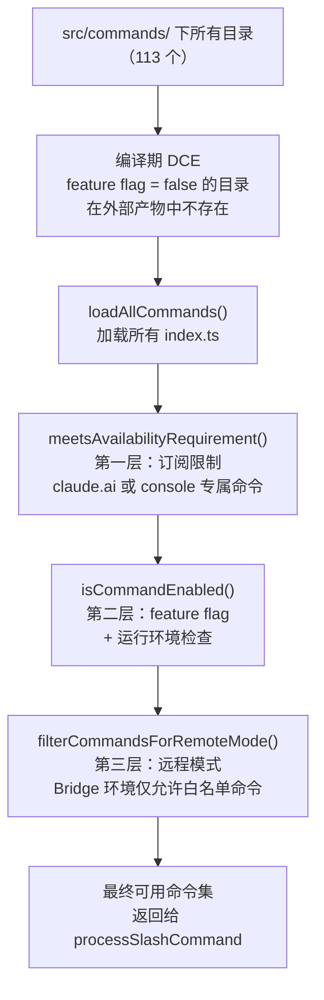
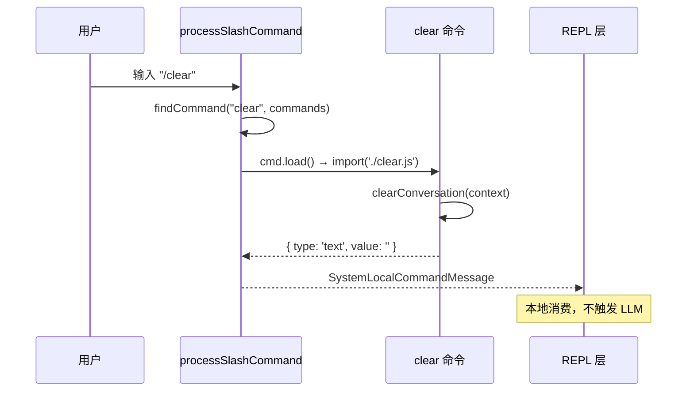

# 第7章：斜杠命令系统——内置命令的注册与执行

> *"Convention is the cheapest registry you'll ever build."*

> Claude Code 有 100+ 个斜杠命令，但不同环境下可用的命令不同：远程模式下不能有本地文件命令，内部用户能看到某些实验命令。命令的"是否可用"不是一个 bool，而是三层过滤。每个命令又是独立目录——添加新命令不需要修改任何现有文件。

`src/commands/` 目录下有 113 个子目录，对应 113 类命令。`getCommands()` 怎么知道它们都存在？

没有注册表文件。没有 `registerCommand('clear', handler)` 这样的调用。答案是**目录约定**：每个 `src/commands/[名称]/` 目录导出一个符合 `Command` 接口的对象，`getCommands()` 加载时自动发现它们。

但"自动发现"并不意味着"全部可用"。`getCommands()` 返回的是经过多层过滤的命令集——feature flag 门控的命令不存在于外部产物，订阅限制的命令普通用户看不到，远程模式下的命令在 Bridge 环境里被过滤掉。这章解析这个过滤链。

## 7.1 目录约定如何注册命令？

看 `src/commands/clear/index.ts` 的完整内容：

```typescript
// src/commands/clear/index.ts
import type { Command } from '../../commands.js'

const clear = {
  type: 'local',
  name: 'clear',
  description: 'Clear conversation history and free up context',
  aliases: ['reset', 'new'],
  supportsNonInteractive: false,
  load: () => import('./clear.js'),   // ← 懒加载实现
} satisfies Command

export default clear
```

**源码参考：** `src/commands/clear/index.ts`

这是 `Command` 对象的标准结构（`src/types/command.ts:74`）：`type`（local/prompt/远程）、`name`、`description`、`aliases`、`load`（返回实现的懒加载函数）。`satisfies Command`（最后一行）让 TypeScript 在编译时验证结构完整性。

**源码参考：** `src/types/command.ts:74`（LocalCommand 类型定义）、`src/commands/clear/index.ts:17`（satisfies Command 类型检查）

注意 `load: () => import('./clear.js')` 这行——命令的**元数据**（名称、描述）在 `index.ts` 里，**实现**（`clear.ts`）只在用户真正执行 `/clear` 时才加载。这与第3章的"轻量预触发"原则一致：启动时只加载元数据，不加载所有命令的实现。

`src/commands/clear/index.ts` 的顶部注释也说明了这个设计：
> "Clear command - minimal metadata only. Implementation is lazy-loaded from clear.ts to reduce startup time."

`getCommands()` 加载所有命令的 `index.ts`，把 `Command` 对象收集到数组后，再进行过滤：

```typescript
// src/commands.ts:476
export async function getCommands(cwd: string): Promise<Command[]> {
  const allCommands = await loadAllCommands(cwd)
  // ...
  const baseCommands = allCommands.filter(
    _ => meetsAvailabilityRequirement(_) && isCommandEnabled(_),
  )
  // ...
}
```

**源码参考：** `src/commands.ts:476,484`

### 为什么不用显式注册表？

显式注册表（`CommandRegistry.register(name, handler)`）更可见——可以在一个地方看到所有注册的命令。目录约定则依靠文件系统结构。

**权衡**：

| 维度 | 目录约定 | 显式注册表 |
|------|---------|-----------|
| 添加新命令 | 创建目录 + 导出，自动发现 | 创建文件 + 注册，两步操作 |
| 删除命令 | 删除目录即可 | 删除文件 + 反注册，两步操作 |
| 查找所有命令 | 需要扫描文件系统 | 查看注册表即可 |
| 条件注册（feature flag）| 需要在 `loadAllCommands` 里写 if | 可在注册时判断 |

**Claude Code 的选择**：目录约定对添加/删除命令更友好（只操作文件），代价是条件注册逻辑集中在 `loadAllCommands` 里。`src/commands.ts` 开头的 50-120 行全是 `feature('X') ? require('./commands/X') : null` 的条件加载。

## 7.2 为什么需要三层独立过滤器，而不是一个条件函数？

一个命令从"存在"到"可见"，需要通过三层检查：

**图 7-1：命令注册与过滤流程**



**第一层：`meetsAvailabilityRequirement`**

```typescript
// src/commands.ts:417
export function meetsAvailabilityRequirement(cmd: Command): boolean {
  if (!cmd.availability) return true    // 无限制，直接通过
  for (const a of cmd.availability) {
    switch (a) {
      case 'claude-ai':
        if (isClaudeAISubscriber()) return true    // claude.ai 用户专属
        break
      case 'console':
        if (!isClaudeAISubscriber() && !isUsing3PServices() && ...) return true
        break
    }
  }
  return false
}
```

**源码参考：** `src/commands.ts:417`

注释（`src/commands.ts:411`）明确说明：`meetsAvailabilityRequirement` 不做 memoize，因为**认证状态可能在会话中途改变**（如 `/login` 后状态切换）。每次 `getCommands()` 调用都重新检查。

**源码参考：** `src/commands.ts:411`（"Not memoized — auth state can change mid-session"注释）

**第二层：`isCommandEnabled`**（包含 feature flag 检查）

在命令的 `Command` 对象中可以声明 `isEnabled()` 方法，或在 `loadAllCommands` 里通过 feature flag 直接决定是否加载：

```typescript
// src/commands.ts:105
const torch = feature('TORCH') ? require('./commands/torch.js').default : null
```

**源码参考：** `src/commands.ts:105`

`feature('TORCH')` 是编译期 flag——外部用户构建中 `torch` 命令不存在于代码，连 `null` 也不是，整个分支被 DCE。

**第三层：远程模式过滤**

```typescript
// src/commands.ts:684
export function filterCommandsForRemoteMode(commands: Command[]): Command[] {
  return commands.filter(cmd => REMOTE_SAFE_COMMANDS.has(cmd))
}
```

**源码参考：** `src/commands.ts:684`

Bridge 模式（远程连接）下只允许白名单命令，防止在远程环境中执行危险操作。

## 7.3 命令执行结果如何在不触发 LLM 的前提下回到对话流？

用户输入 `/clear`，`processSlashCommand` 找到 `clear` 命令，调用 `clear.ts` 的实现（通过 `load()` 懒加载），然后将结果封装为 `SystemLocalCommandMessage`：

**图 7-2：斜杠命令执行消息路径**



`SystemLocalCommandMessage` 在 REPL 层被识别后，直接更新 UI 状态，不传入 `QueryEngine`。这是第6章分析的"本地执行绕过"模式的具体实现。

## 7.4 用户输入不存在的命令时，为什么不报错？

如果用户输入 `/shrug`（不存在的命令），`processSlashCommand` 找不到匹配的命令定义，会返回一个特殊的结果，触发 fallthrough 到文本提示路径（详见第6章 6.4 节）。最终 LLM 会收到 `/shrug` 这个字符串——通常它会尝试理解这是什么意思。

这个宽容失败的设计，和 `src/utils/processUserInput/processUserInput.ts:450` 的注释一致：**移动端用户输入 `/shrug` 不应该看到报错**。

## 模式提炼

### 目录约定注册（Convention-Over-Registration）

**解决的问题**：显式注册大量命令代码冗长，添加/删除命令需要修改两处（文件 + 注册）。

**核心做法**：用目录结构约定代替注册表，每个目录导出标准接口，框架层扫描发现；实现懒加载，启动时只加载元数据。

**前置条件**：命令结构规律，数量多（> 10），且需要经常添加/删除。

**源码证据**：`src/commands/clear/index.ts` — `load: () => import('./clear.js')` 分离元数据和实现，启动时只加载元数据。

### 分层过滤器链（Layered Filter Chain）

**解决的问题**：多维度条件（订阅/feature flag/运行环境）难以在一个函数里管理，且各维度变化频率不同。

**核心做法**：每个维度独立一个过滤函数，组合调用；变化频繁的过滤函数（如认证状态）不做 memoize。

**前置条件**：过滤条件有 ≥ 3 个独立维度，且各维度的变化频率不同。

**源码证据**：`src/commands.ts:484` — `meetsAvailabilityRequirement(_) && isCommandEnabled(_)` 链式调用两个独立过滤器。

### 分层可见性（Tiered Visibility）

**解决的问题**：不同用户（内部/外部/远程）应该看到不同的命令集，但代码在同一个仓库里。

**核心做法**：编译期 DCE 控制代码是否存在，运行期 availability 控制是否可见，远程模式白名单控制第三层。三层递进，从存在性到可见性。

**前置条件**：有明确的用户群体分层，且各层的隔离强度需求不同。

**源码证据**：`src/commands.ts:105`（编译期）、`src/commands.ts:417`（运行期 availability）、`src/commands.ts:684`（远程白名单）。

## 踩坑

### ❌ 把命令逻辑写在 getCommands() 的 switch 里

```typescript
// ❌ 错误：所有命令逻辑集中在一个地方
function getCommands() {
  switch(name) {
    case 'clear': return { run: () => { messages.length = 0 } }
    case 'help':  return { run: () => { printHelp() } }
    // 100个命令 = 500行的 switch
  }
}
```

**正确做法**：每个命令是 `src/commands/` 下的独立目录，包含自己的实现文件，`getCommands()` 只做注册（`src/commands.ts:88`）。添加新命令不需要修改任何现有文件。

### ❌ 忽视 isCommandEnabled 的三层过滤，在不该暴露命令的模式下显示

`isCommandEnabled` 依次检查：feature flag → 用户类型 → 运行模式（本地/远程）。

在远程模式（`src/bootstrap/state.ts:setIsRemoteMode`）下，本地文件相关的命令不应该显示，否则用户会看到命令却无法执行，体验很差。

### ❌ 在命令的 run 函数里直接修改全局 messages 数组

命令应该通过返回值或事件系统通知 REPL 更新状态，直接修改共享状态会让命令的副作用难以追踪和测试。


## 你能做什么

- **目录约定比显式注册表更适合大规模同类对象**：当同类对象（命令/插件/模块）数量超过 20 时，考虑用文件系统约定代替手动注册
- **把元数据和实现分离**：`index.ts` 只有名称/描述/懒加载，`impl.ts` 才是实现——启动时只加载元数据
- **不 memoize 依赖可变状态的过滤函数**：`meetsAvailabilityRequirement` 注释里的原因（认证状态可变）是通用原则
- **设计多层可见性而非单一 flag**：编译期（不存在）、运行期（不可见）、上下文（不可用）是三个不同强度的隔离

---

*第7章完成了对斜杠命令系统的解析。第8章将进入全书最核心的函数：`query.ts`——一次 LLM 调用的完整原子循环，以及它为什么选择 async generator 而非普通 async 函数。*
