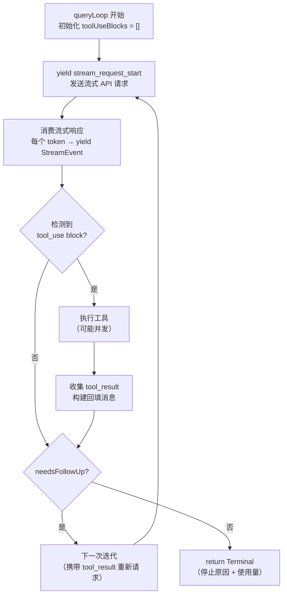
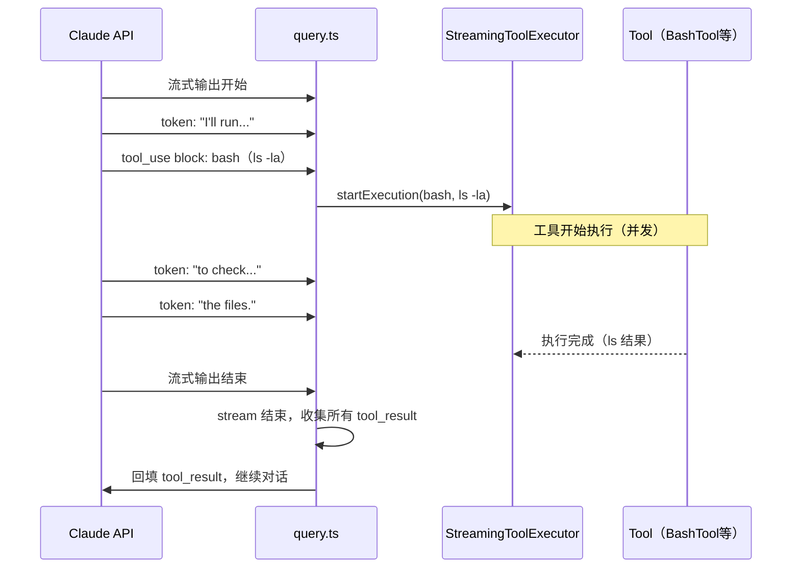

# 第8章：query.ts——单轮对话的原子循环

> *"A generator is not a coroutine. It's a promise that keeps its word."*

> `src/query.ts` 第219行是全书最重要的函数签名：`export async function* query()`——它是 async generator，而不是普通 async 函数。为什么？因为一次 LLM 调用可能产生几十个中间事件（流式 token、工具执行、进度更新），调用方需要逐个处理，而不是等所有事件完成后一次性处理。这个设计决定了整个 Claude Code 的实时交互感。


`src/query.ts` 第 219 行：

```typescript
export async function* query(params: QueryParams): AsyncGenerator<...>
```

**源码参考：** `src/query.ts:219`

这是 `async function*`——异步生成器函数，而不是普通的 `async function`。这个选择不是随意的。理解它，是理解整个 Claude Code 主循环的钥匙。

`query` 是一次 LLM 调用的**原子单元**：接收消息历史，发送流式请求，处理 tool_use block，执行工具，收集结果，回填，循环——直到 LLM 停止输出 tool_use。每次用户输入，`QueryEngine` 调用一次 `query`，等待它完成，再把结果合并到对话历史。

这章解析这个原子单元的内部机制：generator 的设计理由、stop_reason 为什么不可信、streaming 期间工具执行的并发设计、以及降级重试是怎么工作的。

## 8.1 为什么用 async generator 而不是 async 函数？

先看 `query` 的返回类型：

```typescript
// src/query.ts:219
export async function* query(
  params: QueryParams,
): AsyncGenerator<
  | StreamEvent
  | RequestStartEvent
  | Message
  | TombstoneMessage
  | ToolUseSummaryMessage,
  Terminal
>
```

**源码参考：** `src/query.ts:219`

`AsyncGenerator<YieldType, ReturnType>`——它既能 yield 中间值（`StreamEvent`、`Message` 等），最终也能 return 一个值（`Terminal`，包含停止原因和最终使用量统计）。

普通 `async function` 只能在最后 return 一次。如果用它实现 `query`，调用方（`QueryEngine`）要么等整个 LLM 响应完成才能处理（体验差，无法实时显示），要么需要通过 callback 回调中间状态（代码耦合高）。

**generator 的优势**：每次 LLM 流式输出一个 token，或者一个工具执行完成，`query` 就 yield 一个事件。`QueryEngine` 在 `for await` 循环里消费这些事件，立即更新 UI——用户看到实时输出，而不是等待整个响应完成后一次性刷新。

```
stream token → yield StreamEvent → REPL 更新界面
tool 完成 → yield Message → REPL 更新进度
所有工具完成 → LLM 继续 → yield 更多 StreamEvent
LLM 停止 → return Terminal
```

这种"边产生边消费"的模式让 `QueryEngine` 能在不知道 `query` 内部实现的情况下，实时响应每一个事件。

### 为什么不用 Observable（RxJS）？

Observable 能做同样的事，但引入了额外的操作符语义（map/filter/merge 等）和订阅/取消模式。**async generator 是语言内置的，不需要额外依赖，`for await` 语法也更直观**。且 generator 可以用 `yield*` 组合（`query` 内部用 `yield*` 委托给 `queryLoop`），无需订阅-合并的复杂操作。

## 8.2 stop_reason 不可信——query.ts 用什么信号判断工具调用？

`query` 的主体委托给 `queryLoop`（`src/query.ts:241`）——一个可能迭代多次的内部函数：

**源码参考：** `src/query.ts:241`（`async function* queryLoop`）

**图 8-1：单轮循环完整流程**



### stop_reason 为什么不可信？

源码中有一段关键注释：

`needsFollowUp` 标志（`src/query.ts:558`）控制是否需要继续迭代：

```typescript
// src/query.ts:554
// Note: stop_reason === 'tool_use' is unreliable -- it's not always set correctly.
// Set during streaming whenever a tool_use block arrives — the sole
// loop-exit signal. If false after streaming, we're done (modulo stop-hook retry).
const toolUseBlocks: ToolUseBlock[] = []
let needsFollowUp = false      // src/query.ts:558
```

**源码参考：** `src/query.ts:554`（注释）、`src/query.ts:558`（needsFollowUp 初始化）

**设计要点**：`query.ts` 不依赖 API 响应的 `stop_reason === 'tool_use'` 来决定是否有工具调用。它在 streaming 期间**实时检测** `tool_use` block 的到达，把每个 block 追加到 `toolUseBlocks` 数组——这是判断"需要执行工具"的唯一信号。

为什么 `stop_reason` 不可信？注释没有给出具体原因，但结合 API 行为推断（推断）：在极端情况下（响应被截断、streaming 错误恢复等），`stop_reason` 字段可能缺失或不正确。通过在 streaming 中累积 `toolUseBlocks` 数组来判断，比依赖一个可能不准确的字段更可靠。

## 8.3 streaming 期间工具执行——并发还是串行？

这是本章最重要的设计决策：

```typescript
// src/query.ts:561
const useStreamingToolExecution = config.gates.streamingToolExecution
let streamingToolExecutor = useStreamingToolExecution
  ? new StreamingToolExecutor(
      toolUseContext.options.tools,
      canUseTool,
      toolUseContext,
    )
  : null
```

**源码参考：** `src/query.ts:561`

`useStreamingToolExecution` 是一个 feature gate（不是 flag，而是运行时配置项）。当它为 `true` 时，`StreamingToolExecutor` 会在 **streaming 还未结束时**就开始执行已经到达的 `tool_use` block。

**图 8-2：streaming 期间工具执行时序**



**并发执行的收益**：工具执行时间（BashTool 可能需要 2-10 秒）与 LLM 输出后续 token 的时间**并行**，减少端到端延迟。

**并发执行的风险**：如果 LLM 在 streaming 中途发生错误需要重试，已经开始执行的工具结果需要丢弃（`streamingToolExecutor.discard()`），防止旧的 `tool_use_id` 对应的结果"泄漏"到重试请求中。源码在异常处理中有明确的 discard 逻辑（`src/query.ts:731`）。

## 8.4 模型切换重试时，为什么必须清空中间状态？

当主模型失败时，`withRetry` 层会抛出 `FallbackTriggeredError`：

```typescript
// src/services/api/withRetry.ts:160
export class FallbackTriggeredError extends Error {
  constructor(
    public readonly originalModel: string,
    public readonly fallbackModel: string,
  ) {
    super(`Model fallback triggered: ${originalModel} -> ${fallbackModel}`)
    this.name = 'FallbackTriggeredError'
  }
}
```

**源码参考：** `src/services/api/withRetry.ts:160`

`queryLoop` 捕获这个异常，切换模型，重置状态，重新发起请求：

```typescript
// src/query.ts:894
} catch (innerError) {
  if (innerError instanceof FallbackTriggeredError && fallbackModel) {
    currentModel = fallbackModel         // 切换到降级模型
    attemptWithFallback = true
    // 清除所有未完成的工具结果，防止 tool_use_id 不匹配
    assistantMessages.length = 0
    toolResults.length = 0
    toolUseBlocks.length = 0
    needsFollowUp = false
    // 丢弃 streaming 期间已开始执行的工具，防止旧 tool_use_ids 泄漏
    if (streamingToolExecutor) {
      streamingToolExecutor.discard()
      streamingToolExecutor = new StreamingToolExecutor(...)
    }
  }
}
```

**源码参考：** `src/query.ts:894`

关键是 `streamingToolExecutor.discard()`——如果 streaming 期间已经开始执行的工具有结果，这些结果对应的是**失败请求的** `tool_use_id`，在重试请求中不再有效。必须丢弃，否则会产生 "orphan tool_results"（孤立的工具结果，没有对应的 `tool_use` block）。这是 `src/query.ts:731` 注释的原话："This prevents orphan tool_results (with old tool_use_ids) from being yielded after the fallback response arrives."

**源码参考：** `src/query.ts:731`（discard 原因注释）、`src/query.ts:904`（catch 块状态清零：`assistantMessages.length = 0`）

## 模式提炼

### 流式 Generator 编排（Streaming Generator Orchestration）

**解决的问题**：长时间的 LLM 调用需要实时向调用方暴露进度，但调用方不应知道内部实现细节。

**核心做法**：用 async generator yield 每个事件（token、工具结果、状态变化），调用方用 `for await` 逐事件消费；最终 return 汇总结果。

**前置条件**：调用方需要处理中间状态（UI 实时更新、进度显示），且整个调用时间不可预测。

**源码证据**：`src/query.ts:219` — `async function* query()` 返回 `AsyncGenerator<StreamEvent | Message | ..., Terminal>`，每个事件类型对应一种中间状态。

### 基于内容的流终止信号（Content-Based Stream Termination Signal）

**解决的问题**：API 的 `stop_reason` 字段不可靠，但需要准确判断是否有工具调用需要处理。

**核心做法**：在 streaming 期间实时累积 `toolUseBlocks` 数组，用数组长度而非 `stop_reason` 决定是否需要工具调用；streaming 结束后检查数组而非字段。

**前置条件**：依赖的外部信号不可靠，需要从内容本身提取更可靠的信号。

**源码证据**：`src/query.ts:554` — 注释明确说明 `stop_reason === 'tool_use'` 不可靠，使用 `toolUseBlocks` 数组作为"唯一循环退出信号"。

### 降级重试（Fallback Retry）

**解决的问题**：主模型不可用时需要平滑切换到备用模型，但重试时必须清除可能使请求不一致的中间状态。

**核心做法**：通过特殊异常类型（`FallbackTriggeredError`）触发降级；捕获时清除所有依赖旧模型响应的状态（工具结果、孤立消息）；丢弃并发执行中的工具结果。

**前置条件**：有备用模型，且备用模型可以处理相同的请求。

**源码证据**：`src/query.ts:894` — 捕获 `FallbackTriggeredError` 后，`assistantMessages.length = 0`、`streamingToolExecutor.discard()` 确保重试时状态干净。

## 踩坑

### ❌ 以为 generator 可以被随时中断，忘记 abort 信号需要主动检查

```typescript
// ❌ 错误：没有检查 abort 信号，即使用户 Ctrl+C 也继续执行
for await (const event of query(params)) {
  processEvent(event)  // 如果 abort 了，这里仍然在执行
}
```

`query()` 是 async generator，中止必须通过 `params.abortSignal` 主动传入。调用方必须检查 abort 信号：

```typescript
for await (const event of query({...params, signal: abortController.signal})) {
  if (params.signal?.aborted) break
}
```

### ❌ 在降级重试时没有丢弃 streaming 工具执行结果

```typescript
// ❌ 错误：降级切换模型时，旧模型的 tool_use_id 对应的结果还留着
// 这会导致 "orphan tool_results" 错误——工具结果找不到对应的 tool_use 块
catch (err) {
  if (err instanceof FallbackTriggeredError) {
    currentModel = err.fallbackModel
    // 忘记了：streamingToolExecutor.discard()
  }
}
```

**正确做法**：捕获 `FallbackTriggeredError` 时必须清除所有中间状态（`src/query.ts:894`），包括 `assistantMessages.length = 0`、`streamingToolExecutor.discard()`。

### ❌ 依赖 stop_reason === 'tool_use' 来判断是否需要工具执行

```typescript
// ❌ 错误：stop_reason 不可靠
if (response.stop_reason === 'tool_use') {
  executeTools()
}
```

`src/query.ts:554` 有明确注释："stop_reason === 'tool_use' is unreliable"。应该通过 streaming 期间实时累积的 `toolUseBlocks` 数组（`src/query.ts:558`）来判断是否有工具需要执行。


## 你能做什么

- **用 async generator 替代回调**：当函数需要产生多个中间结果时，generator 比 `onProgress` 回调更简洁，且错误处理统一
- **不要依赖外部 API 的状态字段**：从响应内容本身提取可靠信号（如 `toolUseBlocks` 数组），而非依赖可能不准确的元数据字段
- **降级重试时必须清除状态**：切换模型重试前，清除所有依赖旧请求的中间状态——"孤立工具结果"是一类常见的、难以调试的错误
- **并发执行需要对应的取消路径**：`StreamingToolExecutor.discard()` 是必不可少的——任何并发启动的操作都需要一个干净的取消路径

---

*第8章解析了 `query.ts` 的单轮原子循环。第9章将进入 `QueryEngine`——多轮对话的编排层：是什么在跨轮次维护对话历史，abort 信号怎么从 REPL 传到 query.ts 深处？*
