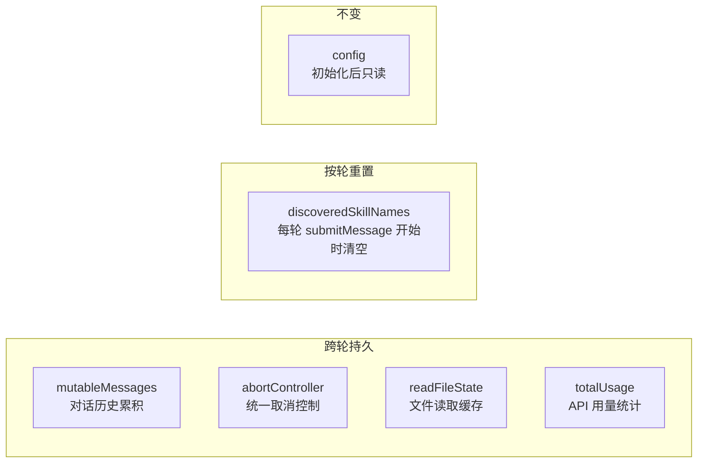
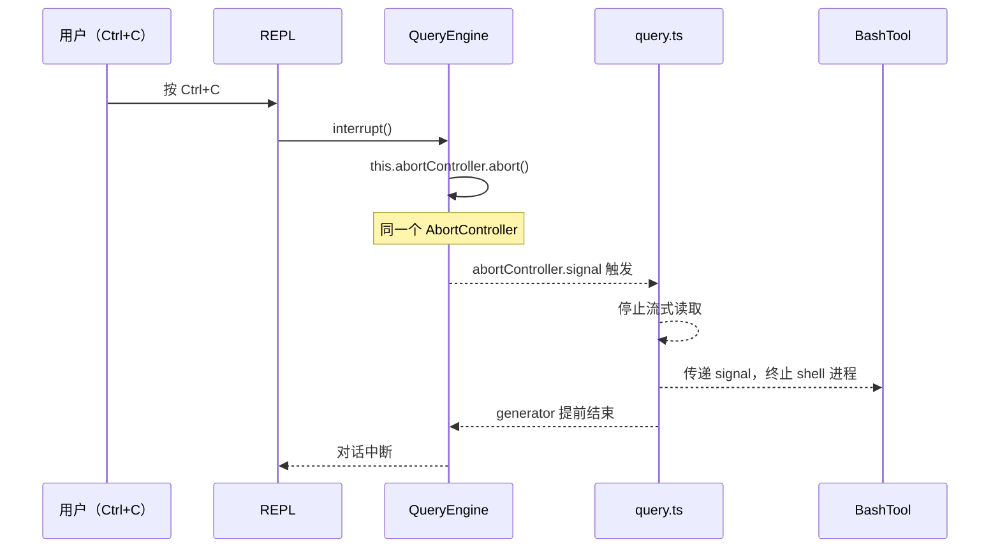

# 第9章：Query Engine——多轮编排与状态管理

> *"Atomicity is for single turns. Coherence is for conversations."*

> `query.ts` 是无状态的单轮原子循环——它不记得上一轮说了什么。那么多轮对话的状态由谁维护？当用户按 Ctrl+C 时，中断信号如何从 REPL 层一路传播到正在流式输出的 API 调用？这是 QueryEngine 要解决的问题：作为 `query.ts` 的有状态包装层，跨轮次维护消息历史、传递 abort 信号、处理压缩边界。


`query.ts` 处理单轮——一次 LLM 调用从开始到结束。但对话不是单轮的。

用户说"帮我分析这个文件"，Claude 读了文件，给出分析。用户再说"帮我修改第3行"——Claude 必须记得刚才读的是什么文件。这就是 `QueryEngine` 的职责：**维护跨轮次的对话状态**，让每一轮 `query.ts` 调用都在正确的上下文中进行。

`src/QueryEngine.ts` 第 180 行的注释直接说明了这一点：

> "One QueryEngine per conversation. Each submitMessage() call starts a new turn within the same conversation. State (messages, file cache, usage, etc.) persists across turns."

**源码参考：** `src/QueryEngine.ts:180`

这章解析三个关键问题：跨轮持久的状态是什么（以及为什么）、abort 信号如何在多轮对话中传播、以及 fileStateCache 为什么需要跨轮传递。

## 9.1 QueryEngine 是有状态的——哪些状态跨轮持久？

```typescript
// src/QueryEngine.ts:184
export class QueryEngine {
  private config: QueryEngineConfig           // 不变：配置
  private mutableMessages: Message[]          // 跨轮累积：对话历史
  private abortController: AbortController    // 跨轮共享：取消控制
  private permissionDenials: SDKPermissionDenial[]  // 跨轮累积：权限拒绝记录
  private totalUsage: NonNullableUsage        // 跨轮累积：API 用量统计
  private readFileState: FileStateCache       // 跨轮共享：文件读取缓存
  private discoveredSkillNames: Set<string>  // 按轮重置：技能发现（每轮清空）
  private loadedNestedMemoryPaths: Set<string> // 跨轮共享：已加载的嵌套记忆路径
```

**源码参考：** `src/QueryEngine.ts:184`

**图 9-1：QueryEngine 状态字段的生命周期**



每次 `submitMessage()` 调用结束后，`mutableMessages` 追加本轮的完整对话（用户消息、助手消息、工具结果）。下一次调用时，这些消息作为历史上下文传入 `query.ts`——这是"记住上下文"的物理实现。

`discoveredSkillNames` 是个例外——它在每轮开始时清空，但在轮内（`submitMessage` 的两次 `processUserInputContext` 构建之间）需要持久。另一个值得注意的字段是 `totalUsage`（`src/QueryEngine.ts:189`），它累积所有轮次的 token 用量，用于会话级成本统计，最终读值在 `src/QueryEngine.ts:629`。

**源码参考：** `src/QueryEngine.ts:189`（totalUsage 字段声明）、`src/QueryEngine.ts:629`（usage 汇总读取）这说明"持久"不是非此即彼的，有些状态需要比单次函数调用更长，但比整个会话更短的生命周期。

## 9.2 abort 信号如何穿透多轮对话？

当用户按 Ctrl+C 中断一个正在运行的对话时，信号需要从 REPL 传到当前正在执行的 `query.ts`，甚至传到正在运行的工具（如 BashTool 正在执行的 shell 命令）。

`AbortController` 贯穿这个信号传播链：

**构造时初始化**：

```typescript
// src/QueryEngine.ts:203
this.abortController = config.abortController ?? createAbortController()
```

**传递给每次 `query()` 调用**：

```typescript
// src/QueryEngine.ts:368
abortController: this.abortController,
```

**REPL 调用 interrupt() 触发 abort**：

```typescript
// src/QueryEngine.ts:1159
interrupt(): void {
  this.abortController.abort()
}
```

**源码参考：** `src/QueryEngine.ts:203,368,1159`

**图 9-2：abort 信号传播路径**



### 为什么是单一 AbortController，而不是每轮新建？

每轮新建 `AbortController` 更"干净"——每次 `submitMessage` 有独立的取消控制，互不干扰。但这会带来一个问题：**如果用户在工具执行过程中输入了新消息，新消息的处理和旧轮次的工具执行用的是不同的 AbortController**，旧轮次无法被新消息的 abort 取消。

**单一 AbortController 的设计**：一次 `interrupt()` 调用能取消当前整个对话（包括所有正在进行的工具执行），而不只是当前轮次。这对于长时间运行的对话特别重要——用户看到 Claude 在错误的方向上执行了很多工具，一次 Ctrl+C 能停止所有操作。

**代价**：每次 `submitMessage` 用的是同一个 AbortController，不能只取消某一轮次而保留其他轮次。但这个场景在实际使用中几乎不存在——用户要么取消整个操作，要么不取消。

## 9.3 fileStateCache 为什么跨轮传递？

```typescript
// src/QueryEngine.ts:191,205
private readFileState: FileStateCache

constructor(config: QueryEngineConfig) {
  // ...
  this.readFileState = config.readFileCache
}

// 传递给每次 query() 调用
// src/QueryEngine.ts:369
readFileState: this.readFileState,
```

**源码参考：** `src/QueryEngine.ts:191,369`

`FileStateCache` 记录的是**工具读取过的文件的当前状态**（内容哈希、修改时间等）。跨轮共享这个缓存有两个目的：

1. **去重读取**：如果 Claude 在第1轮读了 `README.md`，第2轮又要读同一个文件，可以直接用缓存，不需要重新读磁盘
2. **变更检测**：工具（如 `FileEditTool`）在写入文件后更新缓存，后续读取时能感知文件已被修改，而不是用旧的缓存内容

`FileStateCache` 用 `cloneFileStateCache`（`src/utils/fileStateCache.ts:cloneFileStateCache`）在某些场景（如 subagent）创建副本，保证 subagent 对文件的读写不影响主 agent 的视图。传递给每次 `query()` 调用的是同一个引用（`src/QueryEngine.ts:369,517`），而非副本——主 agent 的工具调用会直接更新缓存，多轮共享同一视图：

**源码参考：** `src/QueryEngine.ts:369,517`（readFileState 注入 query()）

```typescript
// src/QueryEngine.ts:1259
readFileCache: cloneFileStateCache(getReadFileCache()),
```

**源码参考：** `src/QueryEngine.ts:1259`

这个机制在第31章（Subagent 生命周期）有详细分析——克隆缓存是 subagent 内存隔离的一部分。

## 9.4 context 溢出时 QueryEngine 如何感知并处理压缩边界？

当对话历史超过 context window 的阈值时，`query.ts` 内部会触发压缩，插入 `SystemCompactBoundaryMessage`。`QueryEngine` 通过 `onSnipBoundary` 回调感知这个事件：

```typescript
// src/QueryEngine.ts:924
// getMessagesAfterCompactBoundary() internally, so only
// messages after the last compact boundary are sent to the API
```

**源码参考：** `src/QueryEngine.ts:924`

具体压缩策略（AutoCompact、MicroCompact 等）在第24-25章详细分析。

## 模式提炼

### 有状态对话编排（Stateful Conversation Orchestration）

**解决的问题**：多轮对话需要跨轮维护消息历史、文件缓存、用量统计等状态，但单轮处理函数（`query.ts`）是无状态的。

**核心做法**：编排层（`QueryEngine`）持有所有跨轮状态，每次调用时将状态注入原子函数（`query.ts`）；原子函数完成后，编排层更新状态。

**前置条件**：有明确的"原子操作"和"跨原子状态"的边界划分。

**源码证据**：`src/QueryEngine.ts:180` — 注释"State (messages, file cache, usage, etc.) persists across turns"，明确说明跨轮状态由编排层管理。

### 穿透式取消（Percolating Cancellation）

**解决的问题**：取消操作需要传播到深层嵌套的异步调用（工具执行、LLM 流式响应），单独在每层处理取消逻辑复杂且易遗漏。

**核心做法**：在最顶层（`QueryEngine`）持有 `AbortController`，通过参数向下传递到每一层；底层异步操作检查 `signal.aborted` 或订阅 `abort` 事件；单次 `interrupt()` 调用传播到所有深层。

**前置条件**：调用链各层都支持 `AbortSignal`，且需要统一取消而非按层取消。

**源码证据**：`src/QueryEngine.ts:1159` — `interrupt()` 调用 `this.abortController.abort()`，同一个 controller 在 `src/QueryEngine.ts:368` 传递给 `query()`。

### 共享状态副本化（Shared State Cloning）

**解决的问题**：并发子操作（如 subagent）需要看到当前状态的快照，同时不影响主操作的状态视图。

**核心做法**：克隆共享状态对象（`cloneFileStateCache`），副本传给子操作；主操作和子操作的修改互不干扰。

**前置条件**：有并发的子操作需要隔离状态，但子操作需要基于当前状态的快照初始化。

**源码证据**：`src/QueryEngine.ts:1259` — `readFileCache: cloneFileStateCache(getReadFileCache())`，subagent 启动时克隆主操作的文件缓存快照。


## REPL 设计的关键权衡

**为什么 REPL 不直接持有消息历史，而是委托给 QueryEngine？**

消息历史的管理比"追加一条消息"复杂得多——涉及 AutoCompact 触发、token 计数、会话持久化。这些逻辑属于"对话引擎"的职责，不是"UI 层"的职责。REPL 如果持有 messages 数组，就把这些复杂性引入了 UI 层，让 REPL 变成一个"胖组件"。

**为什么不用 useState 管理消息列表，而是通过外部存储？**

React 的 state 在组件卸载时消失。REPL 可能因为 Plan 模式切换、后台任务完成等原因重新挂载，如果消息历史是 React state，每次重挂载都会丢失。外部存储（QueryEngine）确保消息历史独立于 REPL 的生命周期。


## 踩坑

### ❌ 直接往 mutableMessages 数组里 push 消息，绕过 QueryEngine 的管理

```typescript
// ❌ 错误：直接修改内部消息数组
queryEngine.mutableMessages.push({role: 'user', content: newMessage})
```

`QueryEngine` 的消息数组跟踪了每条消息的来源和类型，直接 push 会绕过 token 计数、压缩触发逻辑，以及 `fileStateCache` 的同步。应该通过 `queryEngine.addMessage()` 接口（`src/QueryEngine.ts:184`）。

### ❌ 创建多个 AbortController 但只 abort 其中一个

```typescript
// ❌ 错误：创建了新的 controller，但原来的 query 调用用的是旧 controller
const newController = new AbortController()
currentQuery = query({...params, signal: newController.signal})
// 用户 Ctrl+C 时 abort 的是 oldController，新查询继续运行
```

abort 信号必须通过 `createAbortController` 统一管理（`src/utils/abortController.ts`），QueryEngine 维护单一的 abort controller，每次 `submitMessage` 时重置，不能随意创建新的。

### ❌ 压缩边界消息（boundary message）处理为普通 assistant 消息

多轮对话中，AutoCompact 会插入特殊的 boundary message 标记压缩点。如果 QueryEngine 把它当普通消息处理，会导致 token 计数错误，或者把边界消息作为工具结果的参考上下文（`src/QueryEngine.ts` 压缩边界处理逻辑）。


## 你能做什么

- **分离"原子操作"和"编排层"**：`query.ts`（无状态原子循环）+ `QueryEngine`（有状态编排）是一种可复用的架构模式——任何长时间多步操作都可以这样分层
- **用单一 AbortController 管理整个会话的取消**：而不是每个操作独立的取消控制，除非有分段取消的真实需求
- **共享缓存时考虑副本隔离**：当子操作（子线程、subagent）可能修改共享状态时，传递克隆而非引用
- **明确标注按轮重置的状态**：`discoveredSkillNames` 的注释说明了"为什么清空"——这类生命周期文档比代码注释更有价值

---

*第9章完成了对 Agent 主循环的解析（第二篇）。第10章开始第三篇——工具系统：`Tool` 接口的完整契约，以及 `buildTool()` 工厂如何将 60+ 工具的共同模式提取为默认实现。*
