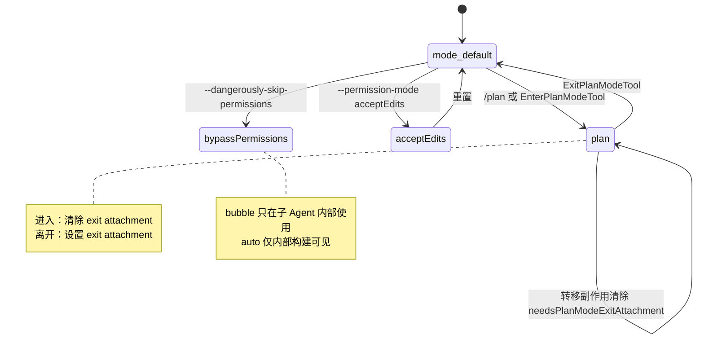
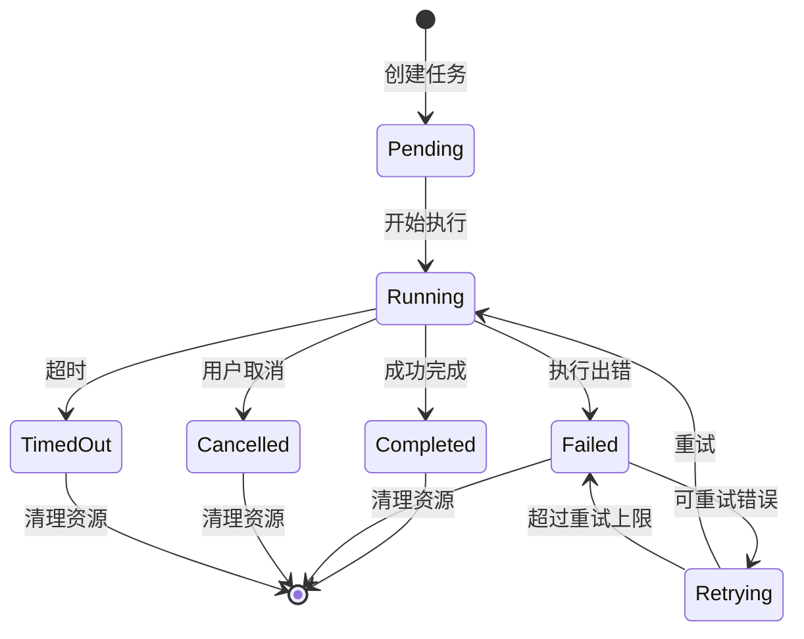
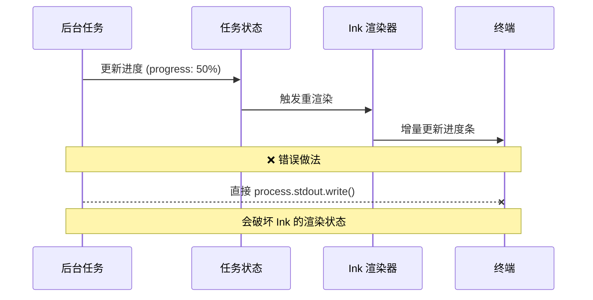

# 第10章：运行模式状态机——Plan、Auto、Worktree 等模式的实现

> *"A mode is not a flag. A mode is a promise about who makes decisions."*

> `claude --plan` 和 `claude --auto` 不只是不同的命令行参数——它们触发完全不同的工具集、权限级别、甚至 Agent 数量。六种模式（default、plan、autoEdit、acceptEdits、bypassPermissions、auto）是如何转换的？为什么 `auto` 模式只对内部用户存在，外部用户的类型系统里这个值根本不存在？

`PermissionMode` 类型的定义在 `src/types/permissions.ts:28`：

```typescript
export type InternalPermissionMode = ExternalPermissionMode | 'auto' | 'bubble'
export type PermissionMode = InternalPermissionMode
```

**源码参考：** `src/types/permissions.ts:28`

六种模式中，有五种可以出现在用户的 `settings.json`（`EXTERNAL_PERMISSION_MODES`），一种只能由代码内部使用（`bubble`），一种对外部用户的产物**类型系统里根本不存在**（`auto`，被编译期 feature flag 门控）。

为什么需要六种模式？为什么同一个 `PermissionMode` 类型在内部构建和外部构建里有不同的成员数量？为什么模式切换不是简单地修改一个字段，而是需要专门的 `handlePlanModeTransition` 函数？

理解这些问题，就理解了 Claude Code 安全边界的设计哲学：**权限决策的粒度是运行时可切换的，但切换本身有副作用，必须被显式管理**。

## 10.1 六种模式各自解决什么问题？

先看五种用户可见模式的完整定义（`src/types/permissions.ts:16`）：

```typescript
export const EXTERNAL_PERMISSION_MODES = [
  'acceptEdits',
  'bypassPermissions',
  'default',
  'dontAsk',
  'plan',
] as const
```

**源码参考：** `src/types/permissions.ts:16`

加上两种内部模式（`auto`/`bubble`），六种模式的对应关系如下：

| 模式 | 决策方 | 适用场景 | UI 标识 |
|------|--------|---------|--------|
| `default` | 用户（逐次确认）| 日常使用，需要人工监督 | 无标识 |
| `plan` | 用户（先规划再执行）| 复杂任务，先审核计划 | ⏸ PAUSE_ICON |
| `acceptEdits` | 自动接受文件编辑 | 信任 Claude 的文件操作 | ⏵⏵ |
| `dontAsk` | 完全自动（宽松）| 无人值守场景 | ⏵⏵ 红色 |
| `bypassPermissions` | 完全绕过权限检查 | 危险：测试/调试专用 | ⏵⏵ 红色 |
| `auto` | AI 分类器决定 | 实验：LLM 判断操作安全性 | ⏵⏵ 绿色（推断）|
| `bubble` | 权限向上冒泡 | 内部：子 Agent 将决策交给父 Agent | 不显示 |

`PERMISSION_MODE_CONFIG`（`src/utils/permissions/PermissionMode.ts:42`）为每种模式定义了 UI 标识和颜色。`plan` 模式使用 `PAUSE_ICON`（`src/utils/permissions/PermissionMode.ts:57`，值为 `⏸`），视觉上就是"暂停执行，等待用户审核计划"。`bypassPermissions` 和 `dontAsk` 使用红色（`error` 色键，`src/utils/permissions/PermissionMode.ts:75`），提醒用户这两种模式跳过了安全检查。

**源码参考：** `src/utils/permissions/PermissionMode.ts:42`（plan 模式的 PAUSE_ICON 配置）

### 为什么需要模式，而不是每次工具调用传一个参数？

如果权限决策每次都通过参数传入，那么系统里每一个工具调用都需要携带"当前决策策略"。这意味着：工具接口要加参数、QueryEngine 要透传、测试要 mock 策略……这是贯穿整个调用链的参数透传问题。

**模式系统的设计**：将"当前决策策略"提升为进程级的全局状态（在 `bootstrap/state.ts` 的 `toolPermissionContext.mode` 中），任何需要做权限判断的地方都可以直接读取，无需透传。**当状态是"当前会话的全局策略"而非"单次操作的参数"时，进程级状态比参数透传更自然**。

## 10.2 `auto` 模式为什么对外部用户类型系统不可见？

这是第4章讲过的类型级 DCE（编译期死代码消除）的具体实践：

```typescript
// src/types/permissions.ts:33
export const INTERNAL_PERMISSION_MODES = [
  ...EXTERNAL_PERMISSION_MODES,
  ...(feature('TRANSCRIPT_CLASSIFIER') ? (['auto'] as const) : ([] as const)),
] as const satisfies readonly PermissionMode[]
```

**源码参考：** `src/types/permissions.ts:33`

当 `feature('TRANSCRIPT_CLASSIFIER')` 在外部构建中被替换为 `false` 时，`(['auto'] as const)` 分支被 DCE 删除，`INTERNAL_PERMISSION_MODES` 等于 `EXTERNAL_PERMISSION_MODES`——**`auto` 不只是运行时不可用，而是在外部用户的类型系统里根本不是一个合法的枚举值**。

这意味着外部用户的 TypeScript 代码里，`const mode: PermissionMode = 'auto'` 会报类型错误。不是运行时抛异常，而是编译时就被拒绝。

对比两种隔离方式的强度：

| 隔离方式 | 能否被绕过 | 类型检查 |
|---------|---------|---------|
| 运行期检查：`if (mode === 'auto') throw new Error()` | ✅ 可以（注释掉代码）| ❌ TypeScript 认为 `'auto'` 是合法值 |
| 编译期 DCE：`feature('TRANSCRIPT_CLASSIFIER')` | ❌ 不能（产物里无此代码）| ✅ `'auto'` 根本不在类型定义里 |

**核心权衡**：类型级 DCE 的代价是只能在支持 `bun:bundle feature()` 的构建环境中实现；收益是"不可见"的保证是类型系统级别的，不依赖运行时检查的正确性。

## 10.3 模式转移副作用——为什么需要 handlePlanModeTransition？

模式不是无状态的标签——切换模式会触发副作用。`handlePlanModeTransition`（`src/bootstrap/state.ts:1349`）是 plan 模式转移的副作用管理器：

```typescript
// src/bootstrap/state.ts:1349
export function handlePlanModeTransition(
  fromMode: string,
  toMode: string,
): void {
  // If switching TO plan mode, clear any pending exit attachment
  // This prevents sending both plan_mode and plan_mode_exit when user toggles quickly
  if (toMode === 'plan' && fromMode !== 'plan') {
    STATE.needsPlanModeExitAttachment = false
  }

  // If switching out of plan mode, trigger the plan_mode_exit attachment
  if (fromMode === 'plan' && toMode !== 'plan') {
    STATE.needsPlanModeExitAttachment = true
  }
}
```

**源码参考：** `src/bootstrap/state.ts:1349`

注释说明了为什么需要清除 `needsPlanModeExitAttachment`：用户快速切换时（plan→default→plan），如果不清除，会同时触发"进入 plan 模式"和"离开 plan 模式"两个通知——这是竞争条件的 UI 层体现。

**图 10-1：Plan 模式转移状态图**



对应地，`handleAutoModeTransition`（`src/bootstrap/state.ts:1367`）处理 auto 模式的转移，但有一个特殊规则（注释在 `src/bootstrap/state.ts:1377`）：**auto ↔ plan 之间的相互转移不由此函数处理**（注释说明由 `prepareContextForPlanMode` 和 `ExitPlanMode` 处理），防止双重触发。

**源码参考：** `src/bootstrap/state.ts:1365`（handleAutoModeTransition 注释）

### 为什么用专门的 handleXModeTransition 而不是 setter？

如果用简单的 setter（`setPermissionMode(newMode: PermissionMode)`），副作用逻辑只能写在 setter 里——一旦有多种副作用（通知、状态清零、附件标记），setter 就会变成一个大杂烩函数。

**专门的 handleXModeTransition 函数**允许将不同模式的转移副作用**分别封装**：`handlePlanModeTransition` 只管 plan 的副作用，`handleAutoModeTransition` 只管 auto 的。这让每个函数保持单一职责，且便于在不同的触发点（`EnterPlanModeTool`/`ExitPlanModeTool`）分别调用。

## 10.4 Plan V2——订阅级别如何影响并行 Agent 数量？

Plan V2 是 Plan 模式的增强版，支持多个 Agent 并行探索方案：

```typescript
// src/utils/planModeV2.ts:5
export function getPlanModeV2AgentCount(): number {
  if (process.env.CLAUDE_CODE_PLAN_V2_AGENT_COUNT) {
    // 环境变量覆盖（上限 10）
    const count = parseInt(process.env.CLAUDE_CODE_PLAN_V2_AGENT_COUNT, 10)
    if (!isNaN(count) && count > 0 && count <= 10) return count
  }

  const subscriptionType = getSubscriptionType()
  const rateLimitTier = getRateLimitTier()

  if (subscriptionType === 'max' && rateLimitTier === 'default_claude_max_20x') {
    return 3    // Max 20x 用户
  }
  if (subscriptionType === 'enterprise' || subscriptionType === 'team') {
    return 3    // Enterprise/Team 用户
  }
  return 1      // 默认：单 Agent
}
```

**源码参考：** `src/utils/planModeV2.ts:5`

| 订阅级别 | 并行 Agent 数 | 优先级 |
|---------|------------|-------|
| 环境变量 `CLAUDE_CODE_PLAN_V2_AGENT_COUNT` | 1-10（自定义）| 最高 |
| Max 20x | 3 | 次高 |
| Enterprise/Team | 3 | 次高 |
| 其他（Pro/PAYG）| 1 | 默认 |

这个设计揭示了一个产品决策：**并行 Agent 数量不只是技术限制，也是区分订阅级别的产品价值点**。Max 20x 和 Enterprise 用户的 Plan V2 可以同时运行 3 个 Agent 并行探索方案，相比 Pro 用户的单 Agent 规划速度显著提升。

## 10.5 Worktree 模式的现状——一个诚实的注释

`src/utils/worktreeModeEnabled.ts` 的全文只有 12 行，但注释说的是一段值得记录的工程决策：

```typescript
/**
 * Worktree mode is now unconditionally enabled for all users.
 *
 * Previously gated by GrowthBook flag 'tengu_worktree_mode', but the
 * CACHED_MAY_BE_STALE pattern returns the default (false) on first launch
 * before the cache is populated, silently swallowing --worktree.
 * See https://github.com/anthropics/claude-code/issues/27044.
 */
export function isWorktreeModeEnabled(): boolean {
  return true
}
```

**源码参考：** `src/utils/worktreeModeEnabled.ts`

`CACHED_MAY_BE_STALE` 模式（第9章提到过）在首次启动时返回缓存默认值 `false`，导致 `--worktree` 参数被静默丢弃。修复方式不是修复缓存逻辑，而是**直接把这个 flag 变成无条件 true**——用注释记录为什么这样决策，而不是只留下 `return true` 让读者困惑。

这个注释是源码第一手文档的完美案例：它不只说明代码做什么，而是说明**为什么这样做、什么时候变成这样、以及指向了 issue 追踪**。

## 模式提炼

### 分层模式枚举（Tiered Mode Enumeration）

**解决的问题**：内部/外部用户需要不同的模式集合，但用枚举字面量管理时类型系统无法区分。

**核心做法**：用 feature flag 条件展开枚举（`[...EXTERNAL, ...(feature('X') ? ['internal'] : [])]`），外部构建产物中内部模式被 DCE 删除，连类型定义里也不存在。

**前置条件**：有内部/外部产物区分，且某些枚举值只应在内部构建中存在。

**源码证据**：`src/types/permissions.ts:33` — `TRANSCRIPT_CLASSIFIER` DCE 让 `auto` 在外部构建的 `PermissionMode` 类型中不存在，TypeScript 会在编译时报错而非运行时抛异常。

### 转移副作用显式化（Explicit Transition Side Effects）

**解决的问题**：状态机的模式切换常常伴随副作用（通知、标记、清零），用 setter 管理时副作用逻辑会积累在单一函数里。

**核心做法**：为每种模式的进入/离开提供专门的 `handleXModeTransition` 函数，在调用处（`EnterPlanModeTool`/`ExitPlanModeTool`）显式调用，而非在 setter 里隐式触发。

**前置条件**：模式切换有可区分的、模式专属的副作用（不同模式副作用不同）。

**源码证据**：`src/bootstrap/state.ts:1349` — `handlePlanModeTransition` 的注释"This prevents sending both plan_mode and plan_mode_exit when user toggles quickly"说明副作用管理是必要的。

### 订阅级别并行扩展（Subscription-Tiered Parallelism）

**解决的问题**：高端用户的工作负载更重，应获得更多计算资源，但计算资源分配不应写死在代码里。

**核心做法**：根据订阅类型和限流层级动态计算并行资源配额，同时提供环境变量覆盖（上限 10），允许内部测试突破默认值。

**前置条件**：有分级订阅产品，且不同订阅的限流层级信息可在运行时获取。

**源码证据**：`src/utils/planModeV2.ts:5` — `getPlanModeV2AgentCount()` 的三层优先级：环境变量覆盖 > 订阅级别路由 > 默认值 1。


## 架构图

**图 10-1：后台任务的生命周期状态机**



**图 10-2：任务输出与 Ink 渲染的正确通信方式**




## 踩坑

### ❌ 在 Plan 模式下误以为只有 isReadOnly=true 的工具才会被拦截

Plan 模式不只是"只读工具才能执行"——`handlePlanModeTransition` 在模式切换时会做完整的状态重置（`src/utils/planModeV2.ts`）。如果手动修改 PermissionMode 而绕过 `handlePlanModeTransition`，会遗留上一个模式的权限记忆，让用户无法感知权限已重置。

### ❌ 假设 auto 模式在所有构建中都存在

```typescript
// ❌ 错误：在 free/pro 用户的构建中，'auto' 根本不在 PermissionMode 枚举里
if (mode === 'auto') { enableAutoClassifier() }
```

`src/types/permissions.ts:33` 用编译期 flag 控制 `auto` 是否进入枚举——外部用户的产物里没有这个值。用字面量 `'auto'` 会导致 TypeScript 编译错误（在内部构建）或运行时行为不一致（在外部构建中永远 false）。

### ❌ 在 Plan V2 中假设所有订阅级别可以启动相同数量的并行 Agent

`getPlanModeV2AgentCount`（`src/utils/planModeV2.ts`）根据订阅级别返回不同的最大 Agent 数。Max 用户可以并行 10 个 Agent，Pro 用户只能并行 3 个。硬编码上限会让 Pro 用户遭遇静默失败（超出限制的 Agent 请求被拒绝）。


## 你能做什么

- **用 feature flag 条件展开枚举而非运行期检查**：当某些枚举值只应对内部用户可见时，类型级 DCE 比运行期 if/else 更彻底
- **为每种状态的转移副作用写专门的函数**：`handlePlanModeTransition` 而不是在 setter 里堆积 if/else——每种模式的副作用独立维护
- **用注释记录"为什么无条件返回 true"**：`isWorktreeModeEnabled` 里的注释是工程决策文档，比只留 `return true` 有价值得多
- **环境变量覆盖 + 上限**：`CLAUDE_CODE_PLAN_V2_AGENT_COUNT` 允许 1-10，上限 10 防止滥用；这是"可配置 + 有边界"的平衡点

---

*第10章完成了对运行模式体系的解析。第11章进入工具系统的核心——`Tool` 接口契约和 `buildTool` 工厂：60 个工具为什么能被 query.ts 统一调用，以及安全三元模型如何捕获工具执行的三个独立安全维度。*
