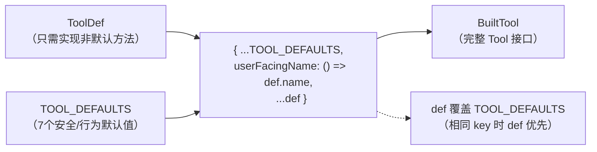
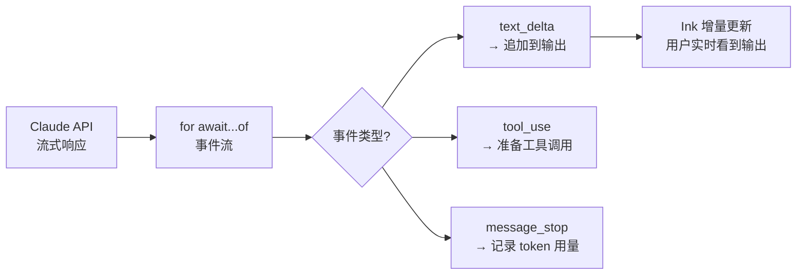
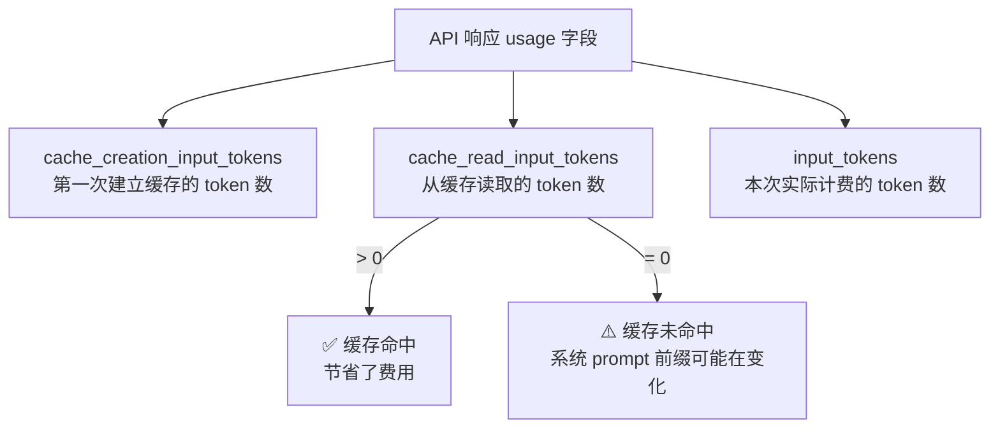

# 第11章：Tool 接口与 buildTool 工厂

> *"An interface is a contract. A factory is an honesty layer that says: here's what you can skip."*

> Claude Code 有 60+ 个工具——BashTool、FileEditTool、MCPTool……它们看起来完全不同，但 `query.ts` 可以用完全相同的方式调用任何一个。这个统一性来自 `src/Tool.ts:362` 的 `Tool` 接口。这个接口定义了什么？每个方法背后的设计意图是什么？为什么用工厂函数 `buildTool` 而不是抽象基类来填充默认实现？

`src/tools/` 目录下有 59 个工具目录：`BashTool`、`FileEditTool`、`AgentTool`、`MCPTool`……每一个的实现方式都不同，但 `query.ts` 用同一段代码调用所有工具：

```typescript
// src/query.ts:130（简化）
const toolUseBlocks = content.filter(c => c.type === 'tool_use')
for (const block of toolUseBlocks) {
  const tool = findToolByName(tools, block.name)
  await tool.call(block.input, context, canUseTool, parentMessage, onProgress)
}
```

**源码参考：** `src/query.ts:130`

这段代码不需要知道 `tool` 是 `BashTool` 还是 `MCPTool`——它只依赖 `tool.call()`。这是 `Tool` 接口的价值：定义一个所有工具必须履行的契约，让调用方与实现完全解耦。

但接口设计有一个经典挑战：**接口越完整，实现越麻烦**。60 个工具里，大多数只有少数几个方法需要自定义逻辑，其余方法的实现都是"合理的默认值"。为什么不能省略它们？这是 `buildTool` 工厂存在的原因。

## 11.1 Tool 接口的三层方法——为什么每层都不可或缺？

`Tool` 类型（`src/Tool.ts:362`）的方法可以分为三组：

```typescript
// src/Tool.ts:362
export type Tool<Input, Output, P> = {
  // === 核心三元组（必须实现）===
  call(args, context, canUseTool, parentMessage, onProgress?): Promise<ToolResult<Output>>
  description(input, options): Promise<string>
  readonly inputSchema: Input

  // === 安全三元模型（可省略，buildTool 提供默认值）===
  isEnabled(): boolean
  isReadOnly(input): boolean
  isDestructive?(input): boolean
  interruptBehavior?(): 'cancel' | 'block'

  // === 可选扩展 ===
  isConcurrencySafe(input): boolean
  isSearchOrReadCommand?(input): { isSearch: boolean; isRead: boolean; isList?: boolean }
  shouldDefer?: boolean
  alwaysLoad?: boolean
  // ...
}
```

**源码参考：** `src/Tool.ts:362`

**表 11-1：Tool 接口方法分组**

| 分组 | 方法 | 是否必须 | 默认值 |
|------|------|---------|-------|
| 核心三元组 | `call` / `description` / `inputSchema` | ✅ 必须 | 无（必须实现）|
| 安全三元模型 | `isReadOnly` / `isDestructive` / `interruptBehavior` | ❌ 可省略 | `false`/`false`/`'block'` |
| 并发安全 | `isConcurrencySafe` | ❌ 可省略 | `false`（保守默认）|
| UI 展示 | `isSearchOrReadCommand` | ❌ 可省略 | `undefined`（不折叠）|
| 延迟加载 | `shouldDefer` / `alwaysLoad` | ❌ 可省略 | `false`（立即加载）|

**`call`/`description`/`inputSchema` 为什么缺一不可？**

- `call`：工具的实际执行逻辑，没有它工具就是壳
- `description`：动态生成工具描述文字，注入到 LLM 的 system prompt——LLM 靠它决定何时调用这个工具
- `inputSchema`：Zod schema 描述参数结构，LLM 按此格式生成工具调用参数

这三者的缺失都会导致工具不可用：没有 `call` 无法执行，没有 `description` LLM 不知道何时调用，没有 `inputSchema` LLM 无法生成合法的参数。

## 11.2 安全三元模型——为什么不是单一的"危险/安全"标志？

`Tool` 接口有三个与安全相关的方法，每个捕获不同维度：

```typescript
// src/Tool.ts:404
isReadOnly(input: z.infer<Input>): boolean
// 语义：此次调用只读取数据，不修改任何状态

// src/Tool.ts:406
/** Defaults to false. Only set when the tool performs irreversible operations (delete, overwrite, send). */
isDestructive?(input: z.infer<Input>): boolean
// 语义：此次调用执行不可逆操作

// src/Tool.ts:407-415
/**
 * What should happen when the user submits a new message while this tool is running.
 * - 'cancel' — stop the tool and discard its result
 * - 'block'  — keep running; the new message waits
 * Defaults to 'block' when not implemented.
 */
interruptBehavior?(): 'cancel' | 'block'
```

**源码参考：** `src/Tool.ts:404,406,416`

为什么是三个独立维度而不是一个"危险级别"枚举？

| 场景 | isReadOnly | isDestructive | interruptBehavior | 解释 |
|------|-----------|--------------|-------------------|------|
| `cat README.md` | `true` | `false` | `'cancel'` | 读取可以随时取消 |
| `git commit -m "..."` | `false` | `false` | `'block'` | 写入但可以撤销，不中断 |
| `rm -rf /tmp/test` | `false` | `true` | `'block'` | 不可逆，但也不应中断（删到一半更危险）|
| 网络请求（发送消息）| `false` | `true` | `'cancel'` | 可以取消（未发出就取消）|

**核心权衡**：三个维度互相独立，无法用单一枚举表示。`isReadOnly=true` 不代表 `isDestructive=false`（理论上），`isDestructive=true` 不代表 `interruptBehavior='cancel'`（`rm -rf` 就不该被中断）。**将三个独立关注点融合为一个维度会丢失信息，导致无法正确处理上述边界情况。**

## 11.3 为什么用工厂函数而不是抽象基类填充默认方法？

`ToolDef` 是 `Tool` 的"可省略默认方法"子集：

```typescript
// src/Tool.ts:703
/**
 * Methods that `buildTool` supplies a default for. A `ToolDef` may omit these;
 * the resulting `Tool` always has them.
 */
type DefaultableToolKeys =
  | 'isEnabled' | 'isConcurrencySafe' | 'isReadOnly'
  | 'isDestructive' | 'checkPermissions' | 'toAutoClassifierInput'
  | 'userFacingName'

export type ToolDef<Input, Output, P> =
  Omit<Tool<Input, Output, P>, DefaultableToolKeys> &
  Partial<Pick<Tool<Input, Output, P>, DefaultableToolKeys>>
```

**源码参考：** `src/Tool.ts:703`

`buildTool` 的实现异常简洁：

```typescript
// src/Tool.ts:783
export function buildTool<D extends AnyToolDef>(def: D): BuiltTool<D> {
  // The runtime spread is straightforward; the `as` bridges the gap between
  // the structural-any constraint and the precise BuiltTool<D> return. The
  // type semantics are proven by the 0-error typecheck across all 60+ tools.
  return {
    ...TOOL_DEFAULTS,
    userFacingName: () => def.name,
    ...def,
  } as BuiltTool<D>
}
```

**源码参考：** `src/Tool.ts:783`

`TOOL_DEFAULTS`（`src/Tool.ts:757`）提供七个方法的默认实现：

```typescript
// src/Tool.ts:757
const TOOL_DEFAULTS = {
  isEnabled: () => true,
  isConcurrencySafe: (_input?) => false,        // 保守：默认不并发安全
  isReadOnly: (_input?) => false,               // 保守：默认视为写入
  isDestructive: (_input?) => false,            // 保守：默认非破坏性
  checkPermissions: (input, _ctx?) =>
    Promise.resolve({ behavior: 'allow', updatedInput: input }),
  toAutoClassifierInput: (_input?) => '',
  userFacingName: (_input?) => '',
}
```

**源码参考：** `src/Tool.ts:757`

默认值的选择体现了**保守安全原则**：`isReadOnly` 默认 `false`（宁可多确认），`isConcurrencySafe` 默认 `false`（宁可串行），`isDestructive` 默认 `false`（宁可不警告，留给显式标注）。这是"显式白名单"而非"显式黑名单"的设计——需要放宽的工具主动声明，而非需要限制的工具主动声明。

**图 11-1：buildTool 工厂工作流**



### 为什么不用抽象基类（abstract class）？

抽象基类是 Java/C++ 的惯用法，TypeScript 中可以用。但它有两个代价：

1. **继承耦合**：所有工具都必须是 `AbstractTool` 的子类，工具实例必须用 `new` 创建
2. **默认值分散**：默认实现在基类里，需要看两个文件才能理解一个工具的完整行为

`buildTool` 工厂选择**函数式组合**：工具就是普通对象，`buildTool` 是一个纯函数（给定同一个 def 永远返回相同结果），所有默认值集中在 `TOOL_DEFAULTS` 里。**工具作者只需要关注"我的工具做什么不同"，不需要了解继承树**。

## 11.4 60 个工具的 schema 全部注入 prompt 会怎样？shouldDefer 解决什么问题？

`Tool` 接口有两个控制工具加载策略的字段：

```
shouldDefer?: boolean
// When true, this tool is deferred — its full schema appears only after
// ToolSearch returns it. Reduces initial prompt token count.

alwaysLoad?: boolean
// When true, this tool's full schema always appears in the initial prompt
// even when ToolSearch is enabled.
```

**源码参考：** `src/Tool.ts:475,484`（shouldDefer/alwaysLoad 注释）

**为什么需要这个机制？** Claude Code 有 60+ 个工具，每个工具的 `description()` 输出可能有几百个 token。如果全部注入 initial system prompt，光工具描述就要消耗数千 token——在一个对话窗口有限的 LLM 里，这是严重的浪费。

`shouldDefer: true` 的工具不在初始 LLM 请求的 system prompt 里（减少 token），需要先通过 `ToolSearchTool` 按关键词找到才能调用。`alwaysLoad: true` 的工具则始终出现（即使在 ToolSearch 模式下），用于 LLM 在第一轮就必须知道的工具。

这是**按需加载**在 prompt 工程层面的实现：常用工具始终可见，专用工具按需检索。

**源码参考：** `src/Tool.ts:475`（shouldDefer 字段注释）、`src/Tool.ts:484`（alwaysLoad 字段注释）

这个机制让大型工具集（60+ 工具）不会在每次请求时把所有工具的 schema 全部注入 prompt，节省了大量 token。

## 模式提炼

### 工厂填充默认值（Factory Default Filling）

**解决的问题**：大量实现类有共同的"保守默认"行为，但每个都显式实现会造成大量重复代码；用继承会引入耦合。

**核心做法**：`buildTool` 工厂将 `TOOL_DEFAULTS` spread 到工具定义对象，工具定义可省略默认方法。工具定义的 key 覆盖默认值，其余沿用。

**前置条件**：多个实现共享相同的默认行为，且默认行为应该是"保守安全"而非"放宽"。

**源码证据**：`src/Tool.ts:783` — `buildTool` 的注释"type semantics are proven by the 0-error typecheck across all 60+ tools"，说明工厂模式在整个工具集上经过了验证。

### 多维安全模型（Multi-Dimensional Safety Model）

**解决的问题**：工具执行的安全性不能用"安全/危险"单轴描述——是否只读、是否不可逆、是否允许中断是三个独立关注点。

**核心做法**：用三个独立的布尔/枚举字段分别建模，允许任意组合，让权限系统和 UI 层根据不同维度做不同决策。

**前置条件**：有多个独立的安全关注点，且这些关注点的组合具有实际意义（不同组合需要不同处理）。

**源码证据**：`src/Tool.ts:404,406,416` — `isReadOnly`/`isDestructive`/`interruptBehavior` 各自的注释说明了独立语义：只读影响权限请求，破坏性触发额外警告，中断行为控制用户中断时的处理方式。


## 架构图

**图 11-1：流式 API 调用的事件处理链**



**图 11-2：Prompt Cache 的 token 用量监控**




## 踩坑

### ❌ 让工具实现直接抛出异常而不是通过 ToolResult 返回错误

```typescript
// ❌ 错误：工具抛出异常，调用方不知道该重试还是放弃
async call(input) {
  if (!fileExists(input.path)) throw new Error('File not found')
}
// ✅ 正确：工具通过 ToolResult 的 error 字段返回错误
async call(input) {
  if (!fileExists(input.path)) return { error: 'File not found' }
}
```

`query.ts` 对工具调用的 `ToolResult` 有完整的错误处理逻辑；如果工具直接抛出异常，这些处理逻辑就绕过了，Claude 看不到正确的工具结果，可能进入错误的推断（`src/Tool.ts:362`）。

### ❌ isDestructive 返回 false 仅因为工具"感觉上可以撤销"

`isDestructive` 影响的是 UI 层的危险警示，不是实际的权限检查。但更关键的是：`interruptBehavior` 决定当用户中途 Ctrl+C 时工具是否强制完成——将 `isDestructive=true` 的工具标记为 `interruptBehavior='hard-stop'`（可以中途停止）会导致文件系统处于不一致状态。

### ❌ 忽略 shouldDefer，让所有 60 个工具的描述都注入系统 prompt

每个工具描述平均占用 50-100 tokens，60 个工具 = 3000-6000 tokens 固定开销。`shouldDefer` 允许将不常用工具的 schema 延迟到第一次使用时注入（`src/Tool.ts`）。忽略这个机制会让系统 prompt 在没有 MCP 工具时也超过 5000 tokens，严重损耗 context window。


## 你能做什么

- **用工厂函数而非抽象基类管理"有默认值的接口"**：`buildTool` 的做法——纯函数 + `TOOL_DEFAULTS` spread——比继承更可组合，测试更容易
- **默认值选择"保守"而非"放宽"**：`isReadOnly` 默认 `false` 而非 `true`——需要特权的操作显式声明，而非需要限制的操作显式声明
- **把安全相关的关注点拆成独立维度**：而不是"危险级别 1-5"——独立维度允许任意组合，每个维度的语义更清晰
- **用 `shouldDefer` 控制大型工具集的 token 使用**：60 个工具全部注入 prompt 会浪费大量 token，按需加载是大型 Agent 系统的必要设计

---

*第11章定义了工具的契约层。第12章将深入代码库中最复杂的工具实现——BashTool：同样是执行命令，为什么 `cat` 和 `rm -rf` 走的是完全不同的处理路径？*
