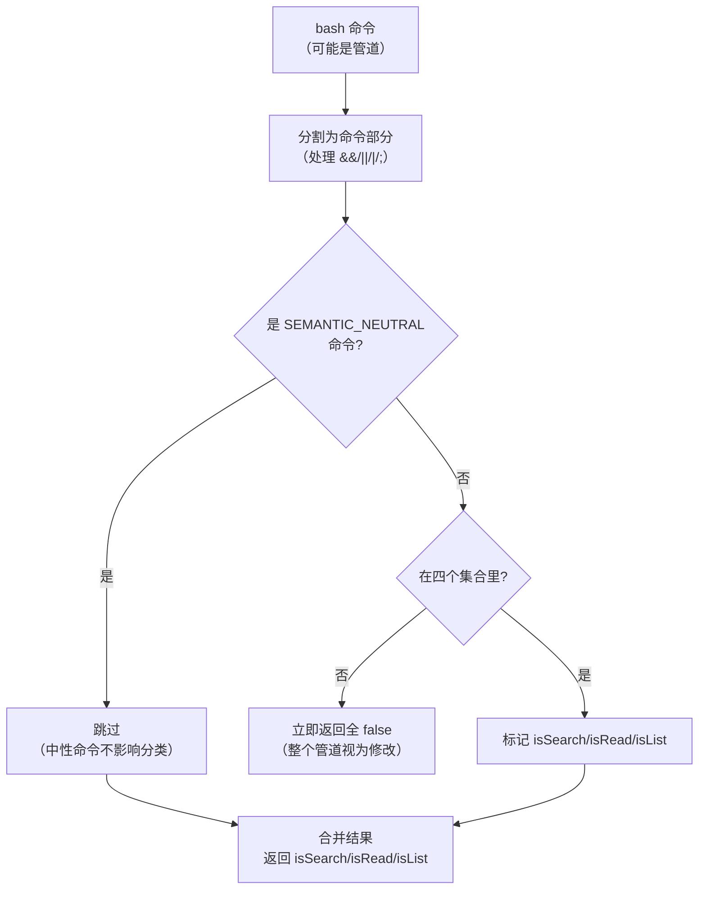
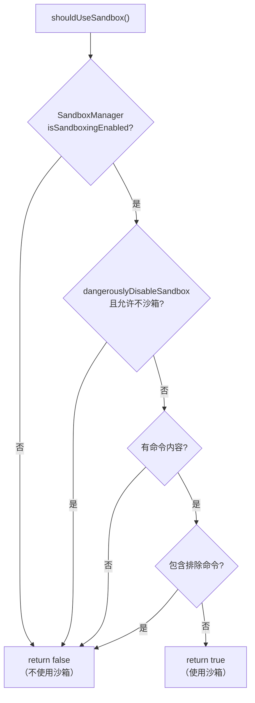
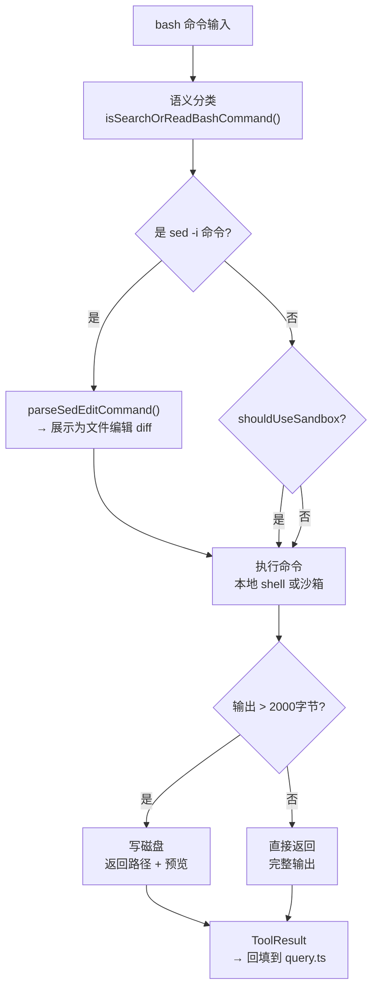

# 第12章：BashTool 解剖——最复杂工具的实现

> *"Every command is a question: read, search, list, or change the world?"*

> `BashTool` 是整个 Claude Code 代码库里**最复杂的单个工具**。一条 `ls -la` 和一条 `rm -rf /` 都是 bash 命令，但处理方式完全不同。命令的语义分类、沙箱路由决策、`sed -i` 的独立解析器、超长输出的磁盘存储——每一个细节背后都有具体的工程原因。

`cat README.md` 在 UI 里折叠显示"读取了文件"。`ls -la` 显示"列出了目录"。`grep -r "TODO" src/` 显示"搜索了文件"。`rm -rf /tmp/test` 触发权限确认。`sed -i 's/foo/bar/g' file.ts` 展示文件 diff。

同样是 bash 命令，五种完全不同的处理路径。这不是偶然——BashTool 在内部对命令做了**语义分类**，根据分类结果决定 UI 展示方式、权限检查级别、特殊解析逻辑。

这是 BashTool 成为代码库中最复杂工具的根本原因：它不只是执行命令的壳，而是一个**命令意图的理解层**。本章按处理流程逐层解剖。

## 12.1 命令语义分类——四个 Set 如何驱动 UI 行为？

BashTool 维护四个静态命令集合：

```typescript
// src/tools/BashTool/BashTool.tsx:60
const BASH_SEARCH_COMMANDS = new Set([
  'find', 'grep', 'rg', 'ag', 'ack', 'locate', 'which', 'whereis'
]);

// src/tools/BashTool/BashTool.tsx:63
const BASH_READ_COMMANDS = new Set([
  'cat', 'head', 'tail', 'less', 'more',
  'wc', 'stat', 'file', 'strings',
  'jq', 'awk', 'cut', 'sort', 'uniq', 'tr'
]);

// src/tools/BashTool/BashTool.tsx:72
// Split from BASH_READ_COMMANDS so the summary says "Listed N directories"
// instead of the misleading "Read N files".
const BASH_LIST_COMMANDS = new Set(['ls', 'tree', 'du']);

// src/tools/BashTool/BashTool.tsx:77
// Commands that are semantic-neutral in any position — pure output/status
const BASH_SEMANTIC_NEUTRAL_COMMANDS = new Set(['echo', 'printf', 'true', 'false', ':']);
```

**源码参考：** `src/tools/BashTool/BashTool.tsx:60,63,72,77`

注意 `BASH_LIST_COMMANDS` 的注释：它**刻意从 `BASH_READ_COMMANDS` 里分离出来**，因为 `ls` 是"列出目录"而非"读取文件"，UI 摘要文字不同。这是"命令语义"而非"命令功能"的分类——`ls` 和 `cat` 都不修改状态，但它们的行为对用户的意义不同。

**语义分类的核心逻辑**（`src/tools/BashTool/BashTool.tsx:95`的 `isSearchOrReadBashCommand` 函数）：

```typescript
// src/tools/BashTool/BashTool.tsx:130-165（简化）
for (const part of commandParts) {
  const baseCommand = part.trim().split(/\s+/)[0]

  if (BASH_SEMANTIC_NEUTRAL_COMMANDS.has(baseCommand)) continue  // 中性命令跳过

  const isPartSearch = BASH_SEARCH_COMMANDS.has(baseCommand)
  const isPartRead = BASH_READ_COMMANDS.has(baseCommand)
  const isPartList = BASH_LIST_COMMANDS.has(baseCommand)

  if (!isPartSearch && !isPartRead && !isPartList) {
    return { isSearch: false, isRead: false, isList: false }  // 任何不认识的命令 → 非只读
  }
}
```

**源码参考：** `src/tools/BashTool/BashTool.tsx:130`

**任何不在四个集合里的命令，整个管道都被视为"可能修改状态"**——这是保守分类原则。`ls dir && echo "---" && cat file.ts` 会被识别为"读取+列表"，但 `ls dir && unknown_cmd` 会被视为未知，因为 `unknown_cmd` 不在任何集合里。

**表 12-1：四种语义分类的 UI 行为**

| 集合 | 代表命令 | UI 摘要 | 权限级别 | 默认折叠 |
|------|---------|---------|---------|---------|
| SEARCH | grep/find/rg | "搜索了 N 个文件" | 低（只读）| ✅ 折叠 |
| READ | cat/head/tail | "读取了 N 个文件" | 低（只读）| ✅ 折叠 |
| LIST | ls/tree/du | "列出了 N 个目录" | 低（只读）| ✅ 折叠 |
| 未分类/修改 | rm/git/编译器 | 完整显示 | 高（写入）| ❌ 展开 |

**图 12-1：命令语义分类决策路径**



## 12.2 shouldUseSandbox 为什么需要四重条件，而不是简单的黑白名单？

并非所有命令都需要沙箱隔离。`shouldUseSandbox`（`src/tools/BashTool/shouldUseSandbox.ts:130`）是**四个条件的 AND**，而不是一个命令黑名单。

为什么不用黑名单？黑名单维护成本高（需要列举所有危险命令），且容易遗漏（`curl | sh` 这类组合命令很难枚举）。四重 AND 的设计是"沙箱功能可用 + 用户未显式禁用 + 有命令内容 + 不在排除列表"——每个条件解决不同场景下的豁免需求：

```typescript
// src/tools/BashTool/shouldUseSandbox.ts:130
export function shouldUseSandbox(input: Partial<SandboxInput>): boolean {
  if (!SandboxManager.isSandboxingEnabled()) {
    return false    // 条件1：全局沙箱功能未开启
  }
  if (input.dangerouslyDisableSandbox &&
      SandboxManager.areUnsandboxedCommandsAllowed()) {
    return false    // 条件2：显式禁用且策略允许
  }
  if (!input.command) {
    return false    // 条件3：无命令内容
  }
  if (containsExcludedCommand(input.command)) {
    return false    // 条件4：包含用户配置的排除命令
  }
  return true
}
```

**源码参考：** `src/tools/BashTool/shouldUseSandbox.ts:130`

**图 12-2：shouldUseSandbox 决策流**



沙箱路由的结果会影响 `userFacingName`：如果进沙箱则显示 `'SandboxedBash'`，否则显示 `'Bash'`（`src/tools/BashTool/BashTool.tsx:502`）。这让用户在 UI 上能直接看到当前命令是否在沙箱中执行，而无需查看设置。

**源码参考：** `src/tools/BashTool/BashTool.tsx:502`

## 12.3 为什么 sed -i 需要独立解析器，而不是当作普通 bash 命令处理？

`sed -i 's/old/new/g' file.ts` 是修改文件的命令，但从 shell 层面看，BashTool 只知道"这是一条 bash 命令"。怎么展示 diff？怎么做针对性的权限检查？

答案是专门的解析器：

```typescript
// src/tools/BashTool/BashTool.tsx:490
if (input.command) {
  const sedInfo = parseSedEditCommand(input.command)
  if (sedInfo) {
    return fileEditUserFacingName({    // 展示为文件编辑，而非 Bash 命令
      file_path: sedInfo.filePath,
      old_string: 'x'
    })
  }
}
```

**源码参考：** `src/tools/BashTool/BashTool.tsx:490`

`parseSedEditCommand`（`src/tools/BashTool/sedEditParser.ts`）将 `sed -i 's/foo/bar/g' file.ts` 解析为结构化的 `SedEditInfo`：

```typescript
// src/tools/BashTool/sedEditParser.ts:25
export type SedEditInfo = {
  filePath: string         // 被编辑的文件路径
  // 替换模式、匹配内容等...
}
```

**源码参考：** `src/tools/BashTool/sedEditParser.ts:25`

解析成功后，`sed` 命令在 UI 里显示的不是"执行了 Bash 命令"，而是"编辑了 file.ts"，并且可以展示修改前后的 diff——这是与 `FileEditTool` 相同的展示路径。

**为什么不直接把 sed 命令转成 FileEditTool 调用？** 因为 sed 的语法非常丰富（正则、范围、多重替换），完全转换需要解析 sed 的完整语法，而 `parseSedEditCommand` 只处理常见的 `-i 's/old/new/'` 形式。对于无法解析的 sed 命令，`parseSedEditCommand` 返回 `null`，fallback 到普通 Bash 展示——这是"尽力解析，失败时降级"的模式。

## 12.4 为什么超长输出写磁盘而不是截断丢弃？

命令输出可以是无限的（`find / -type f` 可能输出数百万行）。如果直接把完整输出塞进 LLM context，会导致 context window 溢出。

`toolResultStorage.ts` 提供了防御机制。但有一个关键设计选择：为什么是"写磁盘 + 路径"而不是"截断丢弃"？

**截断丢弃的问题**：`find / -type f` 输出了 10 万行，截断后 Claude 看到前 2KB，可能误以为"找到了所有结果"，产生错误推断。

**写磁盘的设计**：Claude 知道"有更多内容在这个文件里"，可以主动用 `FileReadTool` 读取——这保留了信息的完整性，只是改变了获取方式。

```typescript
// src/utils/toolResultStorage.ts:109
export const PREVIEW_SIZE_BYTES = 2000

// 当输出超过 PREVIEW_SIZE_BYTES 时
// src/utils/toolResultStorage.ts:175
const { preview, hasMore } = generatePreview(contentStr, PREVIEW_SIZE_BYTES)
```

**源码参考：** `src/utils/toolResultStorage.ts:109,175`

超过 2000 字节的输出会触发**磁盘持久化 + 预览路径**机制：

1. 完整输出写入 `.claude/tool-results/<toolUseId>.txt`
2. LLM 收到的是：`Preview (first 2KB):\n[前2000字节内容]\n[File: .claude/tool-results/xxx.txt]`
3. LLM 如果需要完整内容，可以用 `FileReadTool` 读取该文件

**图 12-3：BashTool 完整处理流程**



这张图揭示了 BashTool 的核心设计：**它在工具接口层和 shell 执行层之间插入了三个理解层**——语义分类层、沙箱路由层、特殊命令解析层——让 LLM 对工具结果有更精确的感知，而不是把原始 shell 输出直接暴露给 LLM。

## 模式提炼

### 行为集合分类（Behavioral Set Classification）

**解决的问题**：命令字符串本身无法直接决定 UI/权限行为，需要语义分类，但全量规则引擎太复杂。

**核心做法**：用 `Set<string>` 维护已知行为类别的命令名，O(1) 查找；任何不在集合里的命令 fallback 到"未知/保守"处理；`SEMANTIC_NEUTRAL` 集合用于跳过不影响分类的命令（`echo`/`printf`）。

**前置条件**：有限的已知命令集，且行为分类足够清晰（不需要按参数分类）。

**源码证据**：`src/tools/BashTool/BashTool.tsx:60,72` — 四个 Set 分类（SEARCH/READ/LIST/NEUTRAL），注释说明 LIST 从 READ 中分离的原因："so the summary says 'Listed N directories' instead of the misleading 'Read N files'"。

### 结构化命令解析（Structured Command Parsing）

**解决的问题**：`sed -i` 等通用文本命令包含结构化的文件修改语义，直接当字符串处理会丢失精度（无法展示 diff、无法做文件级权限检查）。

**核心做法**：为特定命令格式（`sed -i 's/old/new/g' file`）提供专门解析器，提取结构化信息（文件路径、替换模式）；解析失败时降级到通用处理，不抛错。

**前置条件**：命令语法足够规律，值得专门解析器；且降级处理是可接受的（不必100%覆盖）。

**源码证据**：`src/tools/BashTool/BashTool.tsx:490` — `parseSedEditCommand` 返回 `null` 时 fallback 到 `'Bash'` 显示，而非报错。

### 防御性输出截断（Defensive Output Truncation）

**解决的问题**：命令输出大小不可预测，无限输出会导致 context window 溢出，但完整输出可能后续还需要。

**核心做法**：设置固定阈值（2000 字节），超过时写磁盘并返回"路径 + 预览"；LLM 如需完整内容可自主用 FileReadTool 读取；阈值设计为"预览有意义"的大小（2KB 足以看出输出的结构）。

**前置条件**：工具输出大小不可预测，且需要平衡 context window 使用和信息完整性。

**源码证据**：`src/utils/toolResultStorage.ts:109` — `PREVIEW_SIZE_BYTES = 2000`；`src/utils/toolResultStorage.ts:194` — 消息包含"Preview (first 2KB)"说明截断事实，LLM 知道有更多内容可读。

## 踩坑

### ❌ 假设 BASH_SEARCH_COMMANDS 只是"搜索类"命令的语义分类

`BASH_SEARCH_COMMANDS` 影响的不只是语义标签，还影响 UI 层的展示方式——搜索类命令的结果会折叠显示，不占用主要界面空间（`src/tools/BashTool/BashTool.tsx`）。如果把常用的分析命令（如 `cat`）归入搜索类，用户会发现重要输出被自动折叠，需要手动展开。

### ❌ 依赖 shouldUseSandbox 只检查单一条件

```typescript
// ❌ 错误：以为只要有 sandbox 就用 sandbox
const useSandbox = process.env.SANDBOX_ENABLED === 'true'
```

`shouldUseSandbox`（`src/tools/BashTool/shouldUseSandbox.ts`）实际上需要四重条件同时满足：操作系统支持、用户类型、命令类型、目录权限。缺少任何一个检查，要么沙箱在不需要时被使用（性能损耗），要么在需要时被跳过（安全风险）。

### ❌ 把 sed 命令当普通 bash 命令处理，不用 sedEditParser

`sed -i 's/old/new/g' file` 在 Linux 和 macOS 上的语法有兼容性差异，而且 sed 的文件编辑对 Claude 的"文件修改追踪"来说有特殊语义。`parseSedEditCommand`（`src/tools/BashTool/sedEditParser.ts`）负责把 sed 命令转换为 FileEditTool 可理解的格式，绕过这个解析器会导致跨平台兼容问题和编辑追踪失效。


## 你能做什么

- **用 Set 分类已知行为模式**：对命令/API/操作做语义分类时，用 `Set<string>` 比枚举更灵活（可动态添加），比正则更快（O(1) vs O(n)）
- **解析器用"尽力解析，失败降级"**：`parseSedEditCommand` 返回 `null` 而非抛错，让调用方选择降级行为——这比强制解析更健壮
- **输出截断配合"完整内容可获取"**：不只是截断，而是把完整内容存到可访问的位置——这让截断不丢失信息，只是延迟获取
- **保守分类原则**：任何不认识的命令视为"可能修改状态"——宁可多确认，不要误放行

---

*第12章完成了对 BashTool 的完整解剖。第13章将解析 AgentTool——另一个复杂工具，但复杂性来源完全不同：它不是执行 shell 命令，而是启动另一个完整的 Claude 实例。接口层和执行层如何分离？built-in agents 如何注册和选择？*
