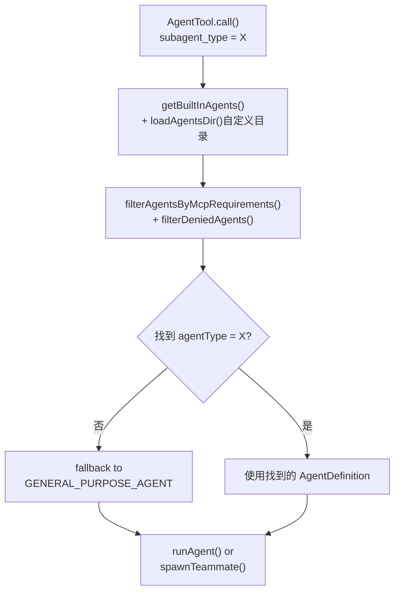
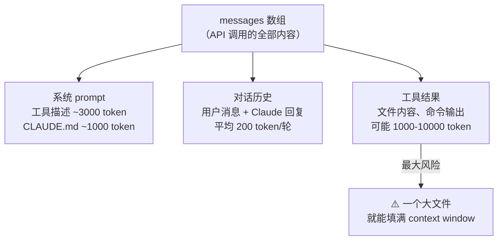
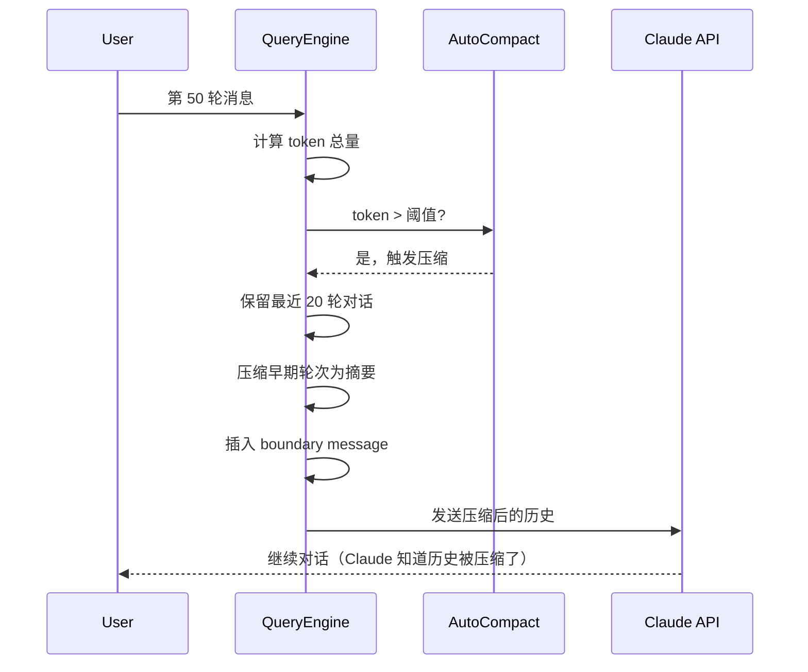

# 第13章：AgentTool——递归智能体的工具接口

> *"A tool that spawns tools. A mind that spawns minds. Where does the abstraction end?"*

> 当 Claude 需要"派出一个子 Agent 去完成任务"时，它调用的是 `AgentTool`——一个工具的输入是另一个对话的起点。这个递归设计带来了有趣的问题：`subagent_type` 为什么是可选的？内置 Agent（如 subagent、summarize）如何以工具的形式注册？AgentTool 的职责边界在哪里——它负责执行 Agent，还是只负责"描述如何启动一个 Agent"？


`AgentTool` 是一个工具——可以被 `query.ts` 调用，有 `call()` 方法，实现了 `Tool` 接口。但它的 `call()` 方法做的事情不是读文件或执行命令，而是**启动另一个完整的 Claude 实例**，那个实例会有自己的 `query.ts` 循环，可以调用自己的 `AgentTool`，再启动另一个实例……

这是递归的智能体系统，而不是无限循环的原因在于：**AgentTool 本身只是接口层**。它负责的是"决定启动什么 Agent、用什么参数、检查哪些权限"，而不是"Agent 如何运行对话循环"。真正的执行循环在 `runAgent.ts`（第31章），两层之间有清晰的职责边界。

## 13.1 AgentTool 的输入 schema——启动一个 Agent 需要告诉它什么？

`AgentTool` 的 `inputSchema` 分为两层（`src/tools/AgentTool/AgentTool.tsx:85`）：

```typescript
// src/tools/AgentTool/AgentTool.tsx:85
const baseInputSchema = lazySchema(() => z.object({
  // 核心参数
  subagent_type: z.string().optional()
    .describe('The type of specialized agent to use for this task'),
  model: z.enum(['sonnet', 'opus', 'haiku']).optional()
    .describe("Optional model override for this agent"),
  run_in_background: z.boolean().optional()
    .describe('Set to true to run this agent in the background'),
}))
```

**源码参考：** `src/tools/AgentTool/AgentTool.tsx:85`

三个关键参数：

| 参数 | 作用 | 可省略？ |
|------|------|---------|
| `subagent_type` | 指定使用哪种内置 Agent（如 `general-purpose`、`plan`） | ✅ 省略时用 `general-purpose` 或触发 fork 机制 |
| `model` | 覆盖 Agent 的默认模型（sonnet/opus/haiku）| ✅ 省略时沿用 Agent 定义里的模型 |
| `run_in_background` | 是否在后台运行（不阻塞主 Agent）| ✅ 省略时同步等待 |

`subagent_type` 可选是关键设计决策——当 `FORK_SUBAGENT` feature flag 开启时，省略 `subagent_type` 意味着"fork"：子 Agent 继承父 Agent 的完整上下文（消息历史和工具池）。这是第31章的主题，此处只需知道"省略 ≠ 错误"。

完整 schema 还包含多 Agent 参数（`name`/`team_name`/`mode`/`isolation`），这些在第29-32章（Swarm 系统）中详细分析。

**源码参考：** `src/tools/AgentTool/AgentTool.tsx:90`（fullInputSchema）

## 13.2 built-in agents——AgentDefinition 如何定义 Agent 行为？

`getBuiltInAgents()`（`src/tools/AgentTool/builtInAgents.ts:22`）返回当前会话可用的内置 Agent 列表：

```typescript
// src/tools/AgentTool/builtInAgents.ts:22
export function getBuiltInAgents(): AgentDefinition[] {
  // SDK 用户可以通过环境变量禁用所有内置 Agent
  if (isEnvTruthy(process.env.CLAUDE_AGENT_SDK_DISABLE_BUILTIN_AGENTS) &&
      getIsNonInteractiveSession()) {
    return []
  }

  const agents: AgentDefinition[] = [
    GENERAL_PURPOSE_AGENT,
    STATUSLINE_SETUP_AGENT,
  ]

  if (areExplorePlanAgentsEnabled()) {
    agents.push(EXPLORE_AGENT, PLAN_AGENT)  // feature flag 门控
  }

  if (isNonSdkEntrypoint) {
    agents.push(CLAUDE_CODE_GUIDE_AGENT)   // 仅 CLI 模式有
  }

  if (feature('VERIFICATION_AGENT') && growthBookGate) {
    agents.push(VERIFICATION_AGENT)         // 双层 flag 门控
  }

  return agents
}
```

**源码参考：** `src/tools/AgentTool/builtInAgents.ts:22`

每个 Agent 是一个 `AgentDefinition` 对象（接口定义在 `src/tools/AgentTool/loadAgentsDir.ts`）。以 `GENERAL_PURPOSE_AGENT` 为例（`src/tools/AgentTool/built-in/generalPurposeAgent.ts`）：

```typescript
export const GENERAL_PURPOSE_AGENT: BuiltInAgentDefinition = {
  agentType: 'general-purpose',
  whenToUse: 'General-purpose agent for researching complex questions...',
  tools: ['*'],        // 工具白名单：'*' 表示继承父 Agent 的所有工具
  source: 'built-in',
  baseDir: 'built-in',
  // model 故意留空——使用 getDefaultSubagentModel()
  getSystemPrompt: getGeneralPurposeSystemPrompt,
}
```

**源码参考：** `src/tools/AgentTool/built-in/generalPurposeAgent.ts`

`AgentDefinition` 的关键字段：

| 字段 | 作用 |
|------|------|
| `agentType` | 唯一标识符，对应 `subagent_type` 参数 |
| `whenToUse` | 注入到 LLM prompt 的使用说明，帮助 LLM 决定何时调用 |
| `tools` | 工具白名单（`['*']` = 继承父工具集，或列举允许的工具名）|
| `getSystemPrompt` | 函数，返回该 Agent 的系统提示 |
| `model` | 可选，省略时用 `getDefaultSubagentModel()` |

颜色字段在 `AgentDefinition` 里可以预设（`agentDef.color`），这样具有品牌色的内置 Agent（如 plan Agent 是蓝色）在每次运行时颜色一致，而非随机分配。

**源码参考：** `src/tools/AgentTool/AgentTool.tsx:288`（setAgentColor 调用时机）

`tools: ['*']` 的设计值得注意：`general-purpose` Agent 继承父 Agent 的完整工具池（因为它的任务范围不确定），而 `plan` Agent 可能只有有限的工具（因为规划阶段不应该执行危险操作）。工具白名单是在注册时（`AgentDefinition`）而非运行时声明的，`filterAgentsByMcpRequirements`（`src/tools/AgentTool/loadAgentsDir.ts:filterAgentsByMcpRequirements`）会在运行时验证所需 MCP 服务器是否已连接。这让权限控制更可预测。

**图 13-1：built-in Agent 注册与选择流程**



## 13.3 AgentTool 接口层 vs runAgent 执行层——职责如何分离？

`AgentTool.call()` 在真正启动 Agent 之前，会做一系列验证和准备：

```typescript
// src/tools/AgentTool/AgentTool.tsx:256（简化）
async call({ prompt, subagent_type, ... }, toolUseContext, ...) {
  // 1. 检查团队功能权限
  if (team_name && !isAgentSwarmsEnabled()) {
    throw new Error('Agent Teams is not yet available on your plan.')
  }

  // 2. 检查 in-process teammate 的限制
  if (isInProcessTeammate() && teamName && run_in_background === true) {
    throw new Error('In-process teammates cannot spawn background agents.')
  }

  // 3. 查找并选择 Agent 定义
  const agentDef = subagent_type
    ? activeAgents.find(a => a.agentType === subagent_type)
    : undefined

  // 4. 分配颜色标识
  if (agentDef?.color) {
    setAgentColor(subagent_type!, agentDef.color)
  }

  // 5. 根据参数选择执行模式（Teammate / LocalAgent / 普通 subagent）
  if (teamName && name) {
    return spawnTeammate(...)    // 多 Agent 团队模式
  }
  // ... 其他路由 ...
}
```

**源码参考：** `src/tools/AgentTool/AgentTool.tsx:256`

这段代码做的事情全是**前置检查和路由决策**，不涉及任何对话循环逻辑。实际的对话执行委托给：
- `spawnTeammate()`（`src/tools/AgentTool/AgentTool.tsx:290`）——多 Agent 团队模式
- `runAgent()`——普通子 Agent 模式（第31章）

**表 13-1：AgentTool 接口层 vs runAgent 执行层职责对比**

| 职责 | AgentTool（接口层）| runAgent（执行层）|
|------|-------------------|-----------------|
| 输入验证 | ✅ 校验 schema | ❌ 不做 |
| 权限检查 | ✅ 检查 agentSwarmsEnabled | ❌ 不做 |
| Agent 定义查找 | ✅ 匹配 subagent_type | ❌ 接收已查找的定义 |
| 颜色分配 | ✅ setAgentColor | ❌ 不做 |
| 执行模式路由 | ✅ 决定用哪种 Task 类型 | ❌ 不做 |
| LLM 对话循环 | ❌ 不做 | ✅ 主责 |
| 工具调用协调 | ❌ 不做 | ✅ 主责 |
| 结果收集 | ❌ 不做 | ✅ 主责 |

这个分离不只是代码组织——它让 `AgentTool` 可以被 `query.ts` 像普通工具一样调用（`tool.call()`），同时让 `runAgent` 可以被不同的入口（AgentTool、resume、fork）复用。

## 13.4 颜色标识系统——八种颜色如何区分并行 Agent？

当多个 Agent 并行执行时，UI 需要区分每个 Agent 的输出。`agentColorManager.ts`（`src/tools/AgentTool/agentColorManager.ts`）维护从 `agentType` 到颜色的映射：

```typescript
// src/tools/AgentTool/agentColorManager.ts
export type AgentColorName = 'red'|'blue'|'green'|'yellow'|'purple'|'orange'|'pink'|'cyan'

export const AGENT_COLORS: readonly AgentColorName[] = [
  'red','blue','green','yellow','purple','orange','pink','cyan'
] as const
```

**源码参考：** `src/tools/AgentTool/agentColorManager.ts`

颜色映射存在 `bootstrap/state.ts` 的 `agentColorMap` 字段（`src/bootstrap/state.ts:111`），`agentColorIndex` 字段（`src/bootstrap/state.ts:112`）追踪下一个可用颜色的索引。颜色分配是循环的——第9个 Agent 会复用第1个 Agent 的颜色（8种颜色循环）。`getAgentColorMap()`（`src/bootstrap/state.ts:1128`）提供只读访问，UI 层根据 `agentType` 查找颜色并渲染。

**源码参考：** `src/bootstrap/state.ts:111`（agentColorMap 字段）、`src/bootstrap/state.ts:1128`（getAgentColorMap）


## 接口层与执行层的分工

### 为什么 AgentTool 不直接执行 Agent？

直觉上，一个叫"AgentTool"的工具应该负责 Agent 的完整生命周期。但 Claude Code 把这件事分成了两层：

- **AgentTool（接口层）**：负责接收 Claude 的工具调用、验证参数、定义 schema（`src/tools/AgentTool/AgentTool.tsx`）
- **runAgent（执行层）**：负责实际运行 Agent 的对话循环（`src/tools/AgentTool/runAgent.ts:248`）

**为什么这样分**：`runAgent` 不只被 AgentTool 调用，还被 `/resume` 命令、Swarm 编排器等多个入口调用。如果把执行逻辑塞进 AgentTool，这些其他入口就无法复用代码，每个地方都要重新实现 Agent 的对话循环。

分层设计的收益：任何需要"启动一个 Agent 对话循环"的代码都调用 `runAgent`，不需要经过工具调用的完整路径。

### 为什么 subagent_type 是可选的？

强制要求调用方指定 `subagent_type` 会让 Claude 在每次调用 AgentTool 时都必须思考"我需要什么类型的 Agent"——这增加了认知负担。

省略时的默认行为（使用通用 Agent）覆盖了大多数场景。`subagent_type` 只在需要特定专业能力（如专门处理代码分析的 Agent）时才需要指定（`src/tools/AgentTool/AgentTool.tsx`）。


## 模式提炼

### 接口执行分离（Interface-Execution Separation）

**解决的问题**：工具的前置处理（验证/路由/颜色分配）与核心执行逻辑（对话循环）耦合，难以独立测试，且执行逻辑无法被多个入口复用。

**核心做法**：AgentTool 只负责前置检查和路由决策，执行逻辑（`runAgent`）作为独立函数，可被 AgentTool/resume/fork 等多个入口复用。

**前置条件**：有复杂的前置处理和可复用的核心执行逻辑两个独立阶段。

**源码证据**：`src/tools/AgentTool/AgentTool.tsx:256` — `call()` 函数做验证和路由，最终调用 `runAgent()` 或 `spawnTeammate()`，自身不包含对话循环逻辑。

### 配置驱动 Agent 行为（Configuration-Driven Agent Behavior）

**解决的问题**：不同类型 Agent 的行为（系统提示/工具集/权限模式）需要灵活配置，但硬编码在 AgentTool 里会造成耦合。

**核心做法**：`AgentDefinition` 结构携带所有行为配置，在注册时（`built-in/` 目录）而非运行时声明；`getBuiltInAgents()` 根据 feature flag 和环境变量动态决定暴露哪些 Agent。

**前置条件**：Agent 类型可枚举，且不同 Agent 的行为差异足够大，值得独立配置文件。

**源码证据**：`src/tools/AgentTool/builtInAgents.ts:22` — `getBuiltInAgents()` 根据 `areExplorePlanAgentsEnabled()`/SDK 模式/feature flag 三重条件动态构建 Agent 列表。


## 架构图

**图 13-1：messages 数组的结构与 token 占比**



**图 13-2：历史压缩的时机与策略**




## 踩坑

### ❌ 认为 AgentTool 负责执行子 Agent 的整个生命周期

AgentTool 是"工具接口层"——它的职责是接收 Claude 的工具调用请求、验证参数、描述输入 schema（`src/tools/AgentTool/AgentTool.tsx`）。实际的执行（`runAgent` 函数，`src/tools/AgentTool/runAgent.ts:248`）是分离的执行层。把生命周期管理逻辑（重试、超时、资源清理）混入 AgentTool 会违反这个分工。

### ❌ 忽略 built-in agents 的颜色标识分配机制

Claude Code 支持最多 8 个并行子 Agent，每个用不同颜色区分（`src/tools/AgentTool/built-in/`）。颜色分配不是随机的——它基于 Agent 在当前会话中的启动顺序。如果在 UI 层硬编码颜色，并发 Agent 多于一个时颜色会冲突，无法区分哪个 Agent 在输出。

### ❌ 假设省略 subagent_type 和指定 subagent_type='subagent' 的行为相同

`subagent_type` 缺省时系统会用默认 Agent 定义（无特殊系统提示），指定 `'subagent'` 时使用 `SubagentDefinition`（带专门为子任务设计的系统提示）。这两种情况下 Claude 的行为会有微妙但重要的差异，尤其是在需要 Agent 理解自己是"工具性执行者"而非"独立思考者"时。


## 你能做什么

- **为复杂的"创建"操作分离接口层和执行层**：AgentTool（验证/路由）+ runAgent（执行）的分离让两者都更简单——AgentTool 不关心如何运行对话，runAgent 不关心如何验证参数
- **用配置结构声明行为，而非在运行时判断**：`AgentDefinition.tools: ['*']` 比在 runAgent 里检查 `if (agentType === 'general-purpose') { allowAllTools = true }` 更清晰
- **颜色/标识系统用全局状态而非参数传递**：多 Agent 并行时颜色需要在整个会话范围内唯一，全局 Map 比每次传参更自然
- **SDK 用户的"空白石板"选项**：`CLAUDE_AGENT_SDK_DISABLE_BUILTIN_AGENTS` 环境变量让 SDK 用户可以从零开始定义 Agent（`src/tools/AgentTool/builtInAgents.ts:31`），不被内置 Agent 干扰

---

*第13章完成了对 AgentTool 接口层的解析。第14章将完成工具系统篇的最后一章——工具注册与条件加载：`tools.ts` 如何根据 feature flag 和 USER_TYPE 动态组装工具集，以及 MCP 工具如何热插入这个集合。*
