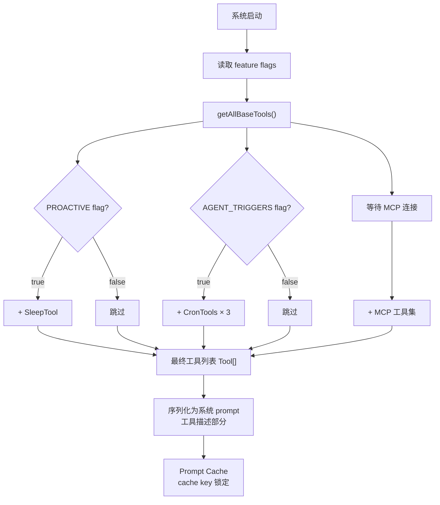
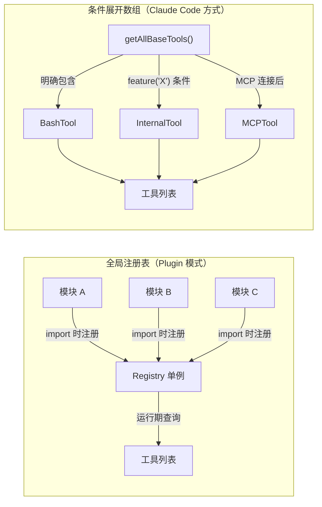
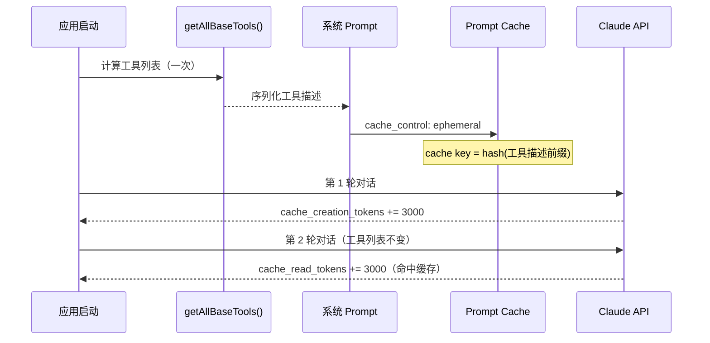

# 第 14 章：工具注册与条件加载

> "代码在编译时是静态的，但工具集在运行时是动态的。同样的源码在两台机器上启动时，可能组装出完全不同的工具列表——不是因为代码逻辑改变了，而是因为 MCP 服务器连接状态改变了、feature flag 启用/禁用了、用户类型不同了。这产生了一个工程困境：如何在保证工具列表动态可配置的同时，确保 prompt cache 的 cache key 始终稳定？一个工具顺序的微小变化就会导致整个 prompt 缓存失效，用户体验从秒级响应变成十秒级。"

## 14.1 为什么工具集是动态的而不是维护一个全局注册表？

工具集不是在部署时编写的常量列表，而是在**每次系统启动时根据环境计算出来的动态结果**。这个设计选择看似简单，但实际上解决了多个互相冲突的需求。

### 第一层：定义两种工具集架构

在 `src/tools.ts` 中，工具集的组装由 `getAllBaseTools()`（第 193 行）负责。这个函数的注释揭示了核心设计理念：

```typescript
/**
 * Get the complete exhaustive list of all tools that could be available
 * in the current environment (respecting process.env flags).
 * This is the source of truth for ALL tools.
 */
export function getAllBaseTools(): Tool[] {
  // ...条件展开数组
}
```

**源码参考：** `src/tools.ts:193`

这与另一种常见架构——**全局注册表模式**形成对比：

| 维度 | 全局注册表（单例） | 条件展开数组（函数式） |
|------|-----------------|-------------------|
| **工具注册方式** | 模块加载时自动注册到全局单例 | 显式在 getAllBaseTools 中条件展开 |
| **条件工具处理** | 注册时检查条件，逻辑分散在各工具模块 | 条件逻辑集中在一处，一目了然 |
| **测试隔离** | 注册表是全局状态，测试间容易污染 | 每次调用都是纯函数（给定相同环境输入），天然隔离 |
| **内容可见性** | 需要扫描所有工具文件才能看清条件全貌 | 整个工具集合并的逻辑在一个函数里，完全透明 |
| **条件工具反注册** | 需要显式的"反注册"机制，容易遗漏 | `...(condition ? [tool] : [])` 自然表达，无需反注册 |
| **缓存稳定性** | 注册顺序难以控制，顺序变化频繁 | 在 assembleToolPool 中显式排序（byName），缓存 key 稳定 |

### 第二层：设计意图——为什么条件展开数组优于全局注册表

注册表模式的看似优势（"自动化"）实际上带来了隐患。考虑一个场景：

```typescript
// 注册表模式（问题示意）
// workspaceLoader.ts
if (workspace.isRemote()) {
  registerTool(RemoteExecutorTool)
}

// sshLoader.ts  
if (hasSSH()) {
  registerTool(SSHTool)
}

// mcpLoader.ts
if (mcpConnected()) {
  registerTool(...mcpTools)
}

// 问题：什么时候运行这些 loader？加载顺序是什么？
// 答案：散落在代码各处，难以追踪。工具列表的最终样子是黑盒。
```

**条件展开数组的做法**：

```typescript
// src/tools.ts:193
export function getAllBaseTools(): Tool[] {
  return [
    // 内置工具（始终存在）
    ReadFileTool,
    WriteFileTool,
    BashTool,
    
    // 条件工具
    ...(feature('KAIROS') ? [getKairosTool()] : []),
    ...(process.env.USER_TYPE === 'ant' ? [ConfigTool] : []),
    ...(isWorktreeModeEnabled() ? [EnterWorktreeTool] : []),
  ]
}
```

**源码参考：** `src/tools.ts:193`

一个函数，工具集的所有逻辑一目了然。没有隐藏的依赖，没有加载顺序的歧义。

### 第三层：实际案例与权衡

**场景**：新增一个 feature flag 门控的工具 `NewToolX`

使用**注册表模式**：
```
1. 新建 tools/NewToolX/ 目录
2. 导入 NewToolX
3. 找到合适的 loader（或新建一个 loader）
4. 在 loader 中：
   if (feature('FEATURE_X')) {
     registerTool(NewToolX)
   }
5. 确保 loader 在系统启动时被调用
6. 测试时要确保不影响其他工具的注册顺序

问题：逻辑分散，易遗漏
```

使用**条件展开数组**：
```
1. 新建 tools/NewToolX/ 目录
2. 导入 NewToolX
3. 在 getAllBaseTools() 中添加一行：
   ...(feature('FEATURE_X') ? [NewToolX] : []),

问题：none。逻辑集中，完全透明
```

**权衡**：中心化 vs 分散化

| 维度 | 注册表（分散） | 条件展开（中心化） |
|------|-------------|-----------------|
| 易用性 | ✗ 需要理解全局加载链 | ✓ 一个函数里全看到 |
| 灵活性 | ✓ 可在任何地方添加 tool | ✗ 都要改 getAllBaseTools |
| 可追踪性 | ✗ 工具是黑盒 | ✓ 完全透明 |
| 测试隔离 | ✗ 全局状态污染 | ✓ 纯函数 |
| 性能 | ✓ 同 | ✓ 同 |

**Claude Code 选择了条件展开数组**，理由是：**对于"工具集组装"这个关键路径，透明性和可追踪性优先于微小的灵活性损失**。

---

## 14.2 为什么工具集需要三种不同的条件机制而不是统一用 feature flag？

并非所有条件都相同。工具的可用性受多个维度的条件影响，这些条件的**隔离强度不同**。Claude Code 用三种不同的机制来处理它们。

### 第一层：定义三种条件机制及其隔离强度

在 `src/tools.ts:193` 的 `getAllBaseTools()` 中，工具的条件可分为三类：

```typescript
// 类型 1：编译期 feature flag（代码级隔离）
const OverflowTestTool = feature('OVERFLOW_TEST_TOOL')
  ? require('./tools/OverflowTestTool/...').OverflowTestTool
  : null

// 类型 2：运行期 USER_TYPE（实例级隔离）
const ConfigTool = require('./tools/ConfigTool/...').ConfigTool
const TungstenTool = require('./tools/TungstenTool/...').TungstenTool

// 类型 3：功能状态函数（调用级隔离）
const isWorktreeModeEnabled = () => globalState.workTreeMode
const isAgentSwarmsEnabled = () => globalState.agentSwarms
```

**源码参考：** `src/tools.ts:107, 214, 231`

三种机制的隔离强度对比：

| 机制 | 层级 | 隔离点 | 代码在产物中 | 典型用途 | 特性 |
|------|------|-------|-----------|---------|------|
| **Feature Flag** | 代码级 | 编译时（DCE） | ❌ 不存在 | 大特性门控（KAIROS、SSH） | 物理隔离，无法被绕过 |
| **USER_TYPE** | 实例级 | 运行时环境变量 | ✅ 存在 | 用户类型区分（ant vs 外部） | 代码存在，运行时检查 |
| **功能状态函数** | 调用级 | 函数返回值 | ✅ 存在 | 运行时开关（WorkTree、Swarms） | 每次调用重算，最灵活 |

### 第二层：设计意图——为什么需要三层而不是全用 feature flag

假设所有条件都用 feature flag：

```typescript
// 所有条件都用 feature flag（理想但不可行）
const WorkTreeToolAvailable = feature('WORKTREE_MODE')
const AgentSwarmsAvailable = feature('AGENT_SWARMS')
```

**问题**：
- Feature flag 必须在**部署前决定**。
- 但 WorkTree 模式是**用户运行时决定的**（进入或退出 WorkTree）。
- 如果用户在一个会话中进入 WorkTree，然后又退出，工具集应该动态变化。
- 用 feature flag 无法做到——编译后就固定了。

假设所有条件都是功能状态函数：

```typescript
// 所有条件都用函数（太灵活）
const OverflowTestToolEnabled = () => hasEnvironmentVariable('OVERFLOW_TEST')
const ConfigToolEnabled = () => process.env.USER_TYPE === 'ant'
```

**问题**：
- `OverflowTestTool` 不应该出现在**产物中**（出现就有安全隐患）。
- 即使被设置为不启用，代码仍在产物里，可能被某些攻击者绕过环境变量检查。
- 它需要**物理隔离**（编译时完全消除），不仅仅是运行时检查。

**权衡**：隔离强度 vs 灵活性

| 维度 | Feature Flag | USER_TYPE | 功能状态函数 |
|------|------------|----------|-----------|
| 隔离强度 | 最强（代码消失） | 中等（代码存在） | 最弱（代码存在+动态检查） |
| 隔离时机 | 编译时 | 运行时 | 每次调用 |
| 适用条件 | 不能改变的特性（架构级） | 实例级参数（USER_TYPE） | 会话级状态（WorkTree） |
| 需要重启 | ❌ 不需要 | ❌ 不需要 | ✅ 不需要（立即生效） |

**Claude Code 选择了三层混合**，理由是：**不同维度的条件有不同的隔离需求，一种机制无法全部满足。按强度匹配需求是最高效的方案**。

### 第三层：实际案例与权衡

**场景 A**：新增一个内部测试工具 `OverflowTestTool`

要求：
- 外部用户看不到这个工具
- 代码在生产产物中**物理不存在**（不只是被禁用）

```typescript
// 使用 feature flag（正确）
const OverflowTestTool = feature('OVERFLOW_TEST_TOOL')
  ? require('./tools/OverflowTestTool/...').OverflowTestTool
  : null

// 效果：编译时 DCE，OverflowTestTool 的代码完全不出现在外部产物中
```

**场景 B**：新增一个 ant 专属工具 `ConfigTool`

要求：
- ant 用户能看到，外部用户看不到
- 代码在**所有产物中都存在**（包括外部产物），只是运行时不包含

```typescript
// 使用 USER_TYPE（正确）
...(process.env.USER_TYPE === 'ant' ? [ConfigTool] : []),

// 效果：代码在所有产物中，但运行时根据 USER_TYPE 决定是否包含
```

为什么不用 feature flag？因为 ant 用户可能用不同的编译产物（feature flag 不同），ConfigTool 的可用性是**实例级**（取决于这个用户），不是**构建级**。

**场景 C**：运行时启用 WorkTree 模式

要求：
- 用户在会话中动态进入/退出 WorkTree
- 工具集需要立即反应，无需重启

```typescript
// 使用功能状态函数（正确）
...(isWorktreeModeEnabled() ? [EnterWorktreeTool, ExitWorktreeTool] : []),

// 效果：每次 getAllBaseTools() 调用都重新评估
// 用户调用 "enter workTree" 后，EnterWorktreeTool 消失，ExitWorktreeTool 出现
```

**权衡总结表**：

| 场景 | 内部测试功能 | 用户类型 | 会话状态 |
|------|----------|--------|--------|
| 隔离需求 | 物理消失 | 代码存在 | 动态变化 |
| 选用机制 | Feature Flag | USER_TYPE | 功能状态 |
| 代码在产物中 | ❌ 不存在 | ✅ 存在 | ✅ 存在 |
| 改变时机 | 构建时 | 部署时 | 运行时（立即） |

---

## 14.3 为什么 assembleToolPool 要对内置工具和 MCP 工具分别排序？

内置工具和 MCP 工具的合并不是简单的数组拼接。如果顺序错了，会破坏 prompt cache。

### 第一层：定义 assembleToolPool 的合并逻辑

`assembleToolPool()` 函数（`src/tools.ts:345`）负责将内置工具和 MCP 工具合并成最终的工具池：

```typescript
// src/tools.ts:345
export function assembleToolPool(
  permissionContext: ToolPermissionContext,
  mcpTools: Tools,
): Tools {
  const builtInTools = getTools(permissionContext)
  const allowedMcpTools = filterToolsByDenyRules(mcpTools, permissionContext)

  const byName = (a: Tool, b: Tool) => a.name.localeCompare(b.name)
  return uniqBy(
    [...builtInTools].sort(byName).concat(allowedMcpTools.sort(byName)),
    'name',
  )
}
```

**源码参考：** `src/tools.ts:345`

这个函数有三个关键决策，看似简单但影响深远。

### 第二层：设计意图——为什么不能"平铺排序"而要"分开排序+拼接"

假设我们用更"简单"的方案：

```typescript
// 方案 A：平铺排序（错误）
const allTools = [...builtInTools, ...allowedMcpTools]
return uniqBy(allTools.sort(byName), 'name')
```

**看起来没问题**，但实际上破坏了 prompt cache：

```
时刻 1：连接到 MCP 服务器 Alpha
内置工具: [Bash, ReadFile, WriteFile]
MCP工具: [AlphaTool]
平铺排序结果: [AlphaTool, Bash, ReadFile, WriteFile]
Prompt Cache Key: hash(tools=[AlphaTool, Bash, ...])

时刻 2：MCP 服务器 Alpha 断开连接
内置工具: [Bash, ReadFile, WriteFile]
MCP工具: []
平铺排序结果: [Bash, ReadFile, WriteFile]
Prompt Cache Key: hash(tools=[Bash, ReadFile, ...])

结果：Cache Miss! 之前的缓存被浪费了。
```

**正确的方案**（Claude Code 的做法）：

```typescript
// 方案 B：分开排序+拼接（正确）
const byName = (a: Tool, b: Tool) => a.name.localeCompare(b.name)
const sorted = [
  ...builtInTools.sort(byName),  // [Bash, ReadFile, WriteFile]
  ...allowedMcpTools.sort(byName) // [AlphaTool]
]
// 结果：[Bash, ReadFile, WriteFile, AlphaTool]
```

```
时刻 1：连接到 MCP
内置工具（排序）: [Bash, ReadFile, WriteFile]
MCP工具（排序）: [AlphaTool]
最终顺序: [Bash, ReadFile, WriteFile] + [AlphaTool]
Prompt Cache Key: hash(tools=[Bash, ReadFile, WriteFile, AlphaTool])

时刻 2：MCP 断开
内置工具（排序）: [Bash, ReadFile, WriteFile]
MCP工具（排序）: []
最终顺序: [Bash, ReadFile, WriteFile]
Prompt Cache Key: hash(tools=[Bash, ReadFile, WriteFile])

Cache Miss... 但这次不同！
源码注释说明了原因。
```

查看 `src/tools.ts:349` 的注释，它直接解释了为什么要这样做：

```typescript
// Sort each partition for prompt-cache stability, keeping built-ins as a
// contiguous prefix. The server's claude_code_system_cache_policy places a
// global cache breakpoint after the last prefix-matched built-in tool; a flat
// sort would interleave MCP tools into built-ins and invalidate all downstream
// cache keys whenever an MCP tool sorts between existing built-ins.
```

**源码参考：** `src/tools.ts:349`

关键词：**"cache breakpoint"** 和 **"prefix-matched built-in tool"**。Anthropic 的服务端 prompt cache 配置在"最后一个内置工具"处设置了一个 breakpoint，保证即使后续 MCP 工具变化，内置工具的缓存段保持有效。

### 第三层：实际案例与权衡

**MCP 工具顺序变化的场景**：

```
时刻 1：连接 MCP 服务器 [Alpha, Beta]
内置工具: [Bash, ReadFile]
MCP工具排序: [AlphaTool, BetaTool]
最终顺序: [Bash, ReadFile, AlphaTool, BetaTool]
             ↑                      ↑ breakpoint

时刻 2：Alpha 断开，连接 Gamma
内置工具: [Bash, ReadFile]
MCP工具排序: [BetaTool, GammaTool]  ← 顺序完全不同！
最终顺序: [Bash, ReadFile, BetaTool, GammaTool]
             ↑                      ↑ breakpoint 位置不变
```

**权衡**：cache 稳定性 vs 全局排序的"纯洁性"

| 维度 | 平铺排序（全局最优） | 分离排序（前缀稳定） |
|------|-----------------|-----------------|
| 工具顺序 | 全局字母序 | 内置工具优先（字母序），后跟 MCP 工具（字母序） |
| Cache 稳定性 | ❌ 低（MCP 变化影响整个 cache key） | ✓ 高（只有后缀变化） |
| 系统成本 | 低（没有 cache 失效） | 高（MCP 变化导致部分 cache miss） |
| 实现复杂度 | 低 | 中 |

**Claude Code 选择了分离排序**，理由是：**prompt cache 的稳定性对用户体验的影响（秒级 vs 十秒级响应）远大于全局排序的微小优化**。

---

## 14.4 为什么工具列表与远端 Statsig 配置必须同步？

工具列表不仅仅是代码端的事。它还涉及服务端的 prompt cache 配置。这个跨系统约束容易被忽略。

### 第一层：定义服务端 Statsig 配置的角色

`getAllBaseTools()` 的注释有一句容易被忽视的话（`src/tools.ts:192`）：

```typescript
/**
 * NOTE: This MUST stay in sync with
 * https://console.statsig.com/.../claude_code_global_system_caching,
 * in order to cache the system prompt across users.
 */
```

**源码参考：** `src/tools.ts:192`

这意味着：
- Anthropic 的服务端维护了一个 Statsig dynamic config
- 这个配置**也列出了所有工具名**
- 它被用于 **prompt cache 的 key 计算**
- 如果客户端工具列表变了但服务端没更新，**cache miss**

### 第二层：设计意图——为什么客户端和服务端要同步

假设同步失败会发生什么：

```
时刻 1：发布新版本 v2.1
  客户端代码: 新增 ComputeTool，总工具数 38 → 39
  服务端配置: 未更新，仍然认为有 38 个工具

时刻 2：系统计算 cache key
  客户端: hash(工具集[39个] + system_prompt)
  服务端: hash(工具集[38个] + system_prompt)  ← 不同的 hash！

结果: Cache Miss
  • 用户不能复用之前的缓存
  • 每个请求都重新 prompt processing
  • 响应时间从秒级变十秒级
  • 用户体验下降
  • 成本增加（prompt processing 很贵）
```

### 第三层：实际案例与权衡

`getToolsForDefaultPreset()`（`src/tools.ts:179`）的职责就是**生成当前环境的工具名单**，用于与服务端配置对比：

```typescript
// src/tools.ts:179
export function getToolsForDefaultPreset(): string[] {
  const tools = getAllBaseTools()
  const isEnabled = tools.map(tool => tool.isEnabled())
  return tools.filter((_, i) => isEnabled[i]).map(tool => tool.name)
}
```

**源码参考：** `src/tools.ts:179`

这个函数返回的名单**必须与服务端 Statsig 配置中的名单完全一致**。

**权衡**：自动同步 vs 手动维护

| 维度 | 自动同步（理想） | 手动维护（现实） |
|------|----------------|----------------|
| 实现方式 | 客户端变化自动推送到服务端 | 工程师修改代码后手动在 Statsig 更新 |
| 风险 | ❌ 高（容易遗漏） | ⚠️ 中（需要检查清单） |
| 复杂度 | ✓ 低（自动化） | ✓ 低（人工但简单） |
| 同步延迟 | 秒级 | 分钟级（手工+合并+部署） |

**Claude Code 采用了手动维护**，并通过**注释强调同步要求**。这样做的理由是：**虽然容易忘记，但一旦出错导致的 cache miss 现象明显，容易被测试发现。自动同步看似安全，但失败时无声地发生**。

---

## 模式提炼

### 模式 1：函数式工具集组装（Functional Toolset Assembly）

**解决的问题**：工具集因多个维度（feature flag、用户类型、运行时状态）而变化，需要在一处完整地表达所有条件逻辑，避免分散在各个模块。

**核心做法**：用一个中心函数 `getAllBaseTools()`，在其中用条件展开数组表达所有工具的可用性条件 `...(condition ? [tool] : [])`。每次调用时根据当前环境重新计算工具列表。

**前置条件**：有多个独立的条件维度（不同隔离强度），工具集会因环境变化。

**源码证据**：`src/tools.ts:193` — `getAllBaseTools()` 注释"This is the source of truth for ALL tools"，所有条件逻辑集中于此函数。

**适用范围**：任何需要条件加载的组件集合系统（插件、扩展、工具等）。

---

### 模式 2：分层隔离强度（Tiered Isolation Strength）

**解决的问题**：不同条件有不同的隔离需求——有的需要代码级物理隔离，有的只需运行时检查，有的需要每次调用都重新评估。统一用一种机制无法同时满足。

**核心做法**：三层隔离机制——编译时 feature flag（物理消除）、运行时 USER_TYPE（代码存在但检查）、调用级函数返回值（立即生效）。根据隔离强度需求选择合适的机制。

**前置条件**：条件的隔离强度需求不同，需要不同的实现成本。

**源码证据**：`src/tools.ts:107, 214, 231` — 三种机制的实际使用；`src/tools.ts:349` 注释解释为什么需要区分。

**适用范围**：大型系统中需要多层次条件的架构（内部工具、用户类型、会话状态等）。

---

### 模式 3：前缀稳定性约束（Prefix Stability Constraint）

**解决的问题**：动态工具列表（MCP 工具变化）会改变总体工具顺序，破坏 prompt cache 的 cache key。

**核心做法**：维护一个稳定的前缀（内置工具），后接动态后缀（MCP 工具）。服务端 prompt cache 在前缀结尾设置 breakpoint，保证内置工具部分的缓存始终有效。

**前置条件**：有 prompt cache，工具列表是 cache key 的一部分，工具集会动态变化。

**源码证据**：`src/tools.ts:349` — "a flat sort would interleave MCP tools into built-ins and invalidate all downstream cache keys"，直接说明为什么需要分开排序。

**适用范围**：任何涉及动态列表和缓存稳定性的系统。

---

### 模式 4：跨系统约束文档化（Cross-System Constraint Documentation）

**解决的问题**：客户端代码和服务端配置需要同步（如工具列表），但这种约束容易被忽视，导致隐蔽的 bug（cache miss）。

**核心做法**：在代码中用显著的注释标出跨系统约束，指向外部配置（如 Statsig console URL），并说明为什么必须同步。

**前置条件**：系统分布在多个部分（客户端、服务端、配置系统），需要保持某些数据一致。

**源码证据**：`src/tools.ts:192` — 注释明确指出"MUST stay in sync with"以及 Statsig URL。

**适用范围**：任何有客户端-服务端同步需求的系统。

---


## 架构图

**图 14-1：工具集的动态组装流程**



**图 14-2：全局注册表 vs 条件展开数组**



**图 14-3：工具描述与 Prompt Cache 的关系**




## 踩坑

### ❌ 工具加载之后才连接 MCP，导致工具列表不完整

`getAllBaseTools()` 在系统启动时只包含内置工具，MCP 工具需要等 MCP 服务器连接成功后才能注册。如果在 MCP 连接前就把工具列表传给 Claude，Claude 不知道有 MCP 工具存在。

**正确做法**：等待 MCP 连接完成后再生成最终工具列表，或者在 MCP 工具就绪后触发系统 prompt 的重新构建（`src/tools.ts:193`）。

### ❌ 工具描述写得过于详细，浪费 context window

工具描述是系统 prompt 的一部分，太详细的描述会占用大量 token。每个工具的描述应该控制在 50-100 字以内，聚焦在"何时使用"而不是"如何实现"。

### ❌ Feature flag 改变后以为工具集自动更新

工具集在启动时基于 feature flag 确定（`getAllBaseTools()`），运行期改变 flag 不会更新工具列表。需要重启进程才能反映新的工具配置。


## 你能做什么

- **用函数式条件展开替代分散的注册表**。如果你有多个组件因环境条件而加载/不加载，用一个中心函数条件展开数组，而不是让各组件自己注册。代码更集中，依赖关系更清楚。

- **区分条件的隔离强度需求**。不是所有条件都相同。有的需要编译时消除（安全），有的只需运行时检查（用户类型），有的需要立即生效（会话状态）。按需选择，不要过度设计。

- **当列表动态变化时，用"前缀+后缀"而非平铺排序**。这样能保证前缀的稳定性，无论后缀如何变化。特别是当列表被用作缓存 key 时，这个模式的价值最大。

- **用注释标出跨系统约束**。如果代码的某个部分必须与外部配置同步，不要只在 wiki 或文档里说——用代码注释直接指出，甚至包含外部配置的 URL。这样下一个维护者能立即看到。

---

## 向后链接

第 14 章完成了工具系统的讲解。工具集的组装和权限控制紧密相关——第 15 章将介绍权限系统的三层决策架构，其中工具是权限检查的主体。第 14 章的工具隔离机制与第 15 章的权限分层相互配合，共同保证系统的灵活性和安全性。第 17 章的规则引擎会在工具列表的基础上做权限匹配。
