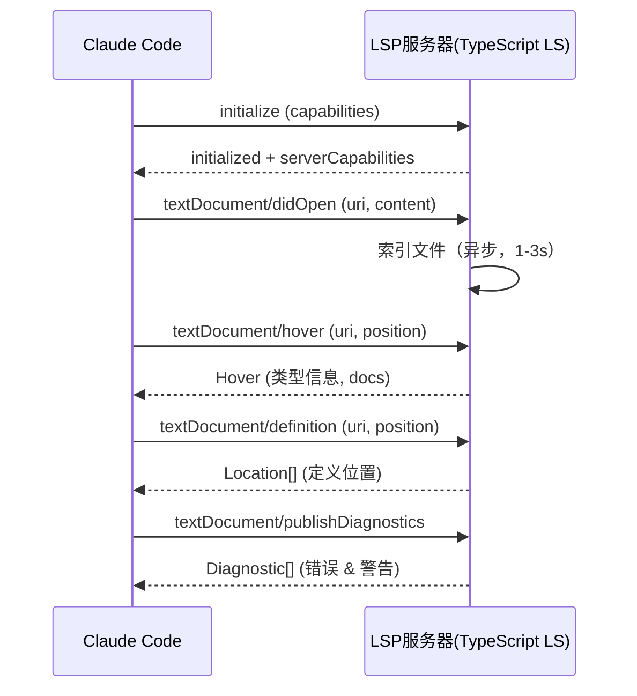
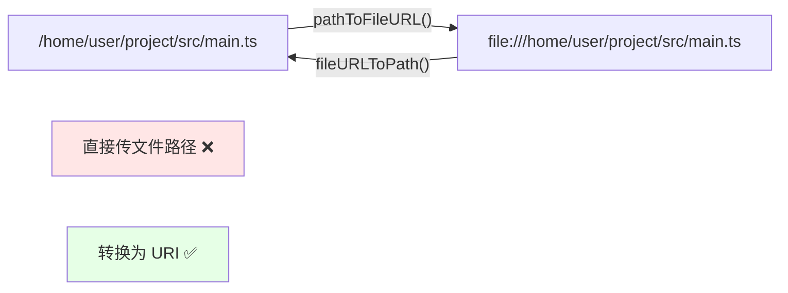
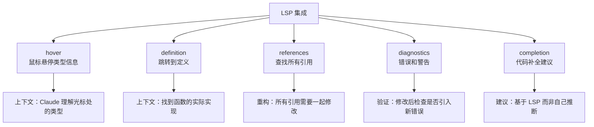

# 第 17 章：PermissionRule 与规则引擎

> "用户在 CLAUDE.md 里写一条规则：`'allowedTools': ['Bash(git *)']`。这条字符串什么时候被解析成权限检查能理解的形式？如果公司的企业管控策略也有关于 Bash 的规则，谁说了算？这不只是优先级问题——这涉及到规则加载、解析、冲突检测、乃至'用户以为自己的规则生效，其实被企业管控无声地覆盖了'这种隐藏的用户体验陷阱。"

## 17.1 权限规则为什么需要显式的来源字段？

一个规则不仅仅是"允许 Bash 的 git 命令"，它还需要记住自己从何而来。为什么？因为这决定了它的优先级。

### 第一层：定义规则的数据模型

规则的完整数据结构在 `src/types/permissions.ts` 中定义，并在 `src/utils/permissions/PermissionRule.ts` 中重新导出。源码中的注释（第 20-28 行）清晰表达了结构：

```typescript
/**
 * ToolPermissionBehavior is the behavior associated with a permission rule.
 * 'allow' means the rule allows the tool to run.
 * 'deny' means the rule denies the tool from running.
 * 'ask' means the rule forces a prompt to be shown to the user.
 */
export const permissionBehaviorSchema = lazySchema(() =>
  z.enum(['allow', 'deny', 'ask']),
)
```

一条完整的 `PermissionRule` 包含：

| 字段 | 类型 | 意义 | 示例 |
|------|------|------|------|
| **ruleContent** | string | 规则的具体内容 | `"Bash(git *)"` |
| **behavior** | 'allow' \| 'deny' \| 'ask' | 规则的行为 | `'allow'` |
| **source** | 'local' \| 'global' \| 'managed' | 规则的来源 | `'local'` |

关键是 `source` 字段。它不是"解析时的临时信息"，而是**规则的永久身份标签**。

### 第二层：设计意图——为什么规则需要记住自己的来源

规则来源的三个等级各有不同的权力级别：

- **`local`（项目本地）**：开发者在当前项目的 CLAUDE.md 中定义的规则。权力最小。
- **`global`（用户全局）**：开发者在全局的 `~/.claude/settings.json` 中定义的规则。权力中等。
- **`managed`（企业管控）**：公司通过 MDM（移动设备管理）或 IT 策略下发的规则。权力最大。

这个三层结构反映的是**信任链的不同层次**。企业有权限覆盖个人开发者的选择，因为企业要承担安全责任。

如果规则不记录来源，系统就无法区分"开发者想要的规则"和"企业强制的规则"，无法实现这种**信任的阶层性**。

### 第三层：实际案例与权衡

**场景**：开发者在项目 CLAUDE.md 中写了 `"allowedTools": ["Bash(rm *)"]`（允许所有 rm 命令）。

如果没有 `source` 字段记录，系统只知道"允许 rm"。但实际发生的是：

1. 项目本地规则加载：`Bash(rm *)` → `{ behavior: 'allow', ruleContent: 'Bash(rm *)' }`
2. 企业管控规则加载：`Bash(rm *)` → `{ behavior: 'deny', ruleContent: 'Bash(rm *)' }`
3. 系统合并：**哪一个胜出？**

有了 `source` 字段：

```typescript
// 项目本地
{ ruleContent: 'Bash(rm *)', behavior: 'allow', source: 'local' }

// 企业管控
{ ruleContent: 'Bash(rm *)', behavior: 'deny', source: 'managed' }

// 规则引擎的决策
if (managedRule && managedRule.behavior === 'deny') {
  return deny  // ✓ 企业管控优先
}
```

**权衡**：`source` 字段的代价与收益

| 维度 | 无 source 字段 | 有 source 字段 |
|------|---------------|----------------|
| 规则冲突处理 | 后加载覆盖（不可控） | 按优先级确定（可控） |
| 用户体验 | 用户不知道自己的规则被覆盖了 | 可以检测并告知用户 |
| 企业管控能力 | 无法强制覆盖用户规则 | 可以明确覆盖（满足合规需求） |
| 实现复杂度 | 低 | 中等 |

**Claude Code 选择了有 source 字段**，理由是**管理复杂度适中，但解锁了企业级的可管理性**。

## 17.2 规则字符串的解析为什么需要嵌套括号处理？

用户写的规则是字符串格式：`"Bash(git *)"` 或 `"Bash(python -c \"print(1)\")"` 或 `"PowerShell(pip install -e .)"` 。系统需要解析这些字符串，提取工具名和规则内容。

### 第一层：定义解析函数

`permissionRuleValueFromString`（`src/utils/permissions/permissionRuleParser.ts:93`）是解析的核心。源码的注释直接给出了三个解析示例（第 89-91 行）：

```typescript
/**
 * 解析示例：
 * permissionRuleValueFromString('Bash') // => { toolName: 'Bash' }
 * permissionRuleValueFromString('Bash(npm install)') // => { toolName: 'Bash', ruleContent: 'npm install' }
 * permissionRuleValueFromString('Bash(python -c "print\\(1\\)")') // => { toolName: 'Bash', ruleContent: 'python -c "print(1)"' }
 */
export function permissionRuleValueFromString(
  ruleString: string,
): PermissionRuleValue {
  // 实现：在第一个 '(' 处分割，提取工具名和内容
}
```

解析的格式非常精简：**工具名 + 可选的括号内容**。但这个"可选内容"可能包含转义括号、引号、空格等，增加了复杂性。

### 第二层：设计意图——为什么不用 JSON 而用括号格式

如果用 JSON 格式：`{ "tool": "Bash", "rule": "git *" }` 会怎样？

- ✓ 优点：解析简单、无歧义
- ✗ 缺点：用户写起来麻烦、CLAUDE.md 中难以阅读

Claude Code 的做法：
- ✓ 用户写 `Bash(git *)`，简洁且直观
- ✗ 但解析器需要处理括号嵌套和转义

这是**人类可读性 vs 机器解析复杂度**的权衡。Claude Code 选择了**优化用户体验**。

解析的三种典型情况对比（根据注释示例）：

| 规则字符串 | 解析结果 | 复杂性 |
|-----------|--------|------|
| `Bash` | `{ toolName: 'Bash' }` | 无 |
| `Bash(npm install)` | `{ toolName: 'Bash', ruleContent: 'npm install' }` | 中（需要找第一个括号） |
| `Bash(python -c "print\\(1\\)")` | `{ toolName: 'Bash', ruleContent: 'python -c "print(1)"' }` | 高（需要处理转义） |

### 第三层：实际案例与权衡

用户输入了一条复杂规则：

```
"Bash(curl https://api.example.com -d \"data=\$(whoami)\")"
```

解析流程：
1. 找第一个 `(` 的位置 → 前面是 `Bash`
2. 匹配对应的 `)` → 中间的内容是 rule content
3. 处理转义 → `\"` 变成 `"`

结果：
```typescript
{
  toolName: 'Bash',
  ruleContent: 'curl https://api.example.com -d "data=$(whoami)"'
}
```

**权衡**：简洁格式 vs 解析复杂度

| 维度 | JSON 格式 | 括号格式 |
|------|---------|--------|
| 用户输入负担 | 高（需要引号和逗号） | 低（自然语言风格） |
| 解析实现 | 简单（用 JSON.parse） | 复杂（自定义括号匹配） |
| CLAUDE.md 可读性 | 差（JSON 格式笨重） | 好（接近伪代码） |
| 错误提示 | 明确（JSON 语法错误） | 需要自定义错误处理 |

**Claude Code 选择了括号格式**，理由是**CLAUDE.md 是开发者频繁编辑的配置，可读性优先于解析便利**。

## 17.3 三层规则来源的优先级为什么是这样的顺序？

系统加载规则时会从三个来源读取。当同一条规则（比如都关于 `Bash` 的）在多个来源中出现时，谁说了算？

### 第一层：定义优先级链

标准的优先级顺序硬编码在系统中：

```
managed（企业管控）> global（用户全局）> local（项目本地）
```

即 **managed 最高优先级，local 最低**。更强的来源可以完全覆盖更弱的来源。

这个顺序不是对称的。它体现了**组织信任的单向性**：企业有权覆盖开发者，但开发者无权覆盖企业。

在 `src/utils/permissions/permissionsLoader.ts` 中有一个关键函数 `shouldAllowManagedPermissionRulesOnly`，这个名字本身就暗示了企业管控的强制能力。

### 第二层：设计意图——为什么企业管控要高于个人规则

这不只是技术设计，而是**安全责任的划分**。

- **Local（项目本地）**：开发者对单个项目的权限配置。影响最小。
- **Global（用户全局）**：开发者对自己所有项目的权限配置。影响中等。
- **Managed（企业管控）**：公司对所有员工工作机器的统一权限策略。影响最大，安全责任最大。

如果企业无法强制自己的策略，就无法对员工的操作承担安全责任。法规合规性（如 SOC 2）也要求企业 IT 有能力强制执行安全策略。

因此这个优先级顺序是**安全治理的必然结果**。

### 第三层：实际案例与权衡

**场景**：

1. 项目本地规则（local）：允许 Bash(curl *)
2. 用户全局规则（global）：拒绝 Bash(curl *)
3. 企业管控规则（managed）：允许 Bash(curl https://trusted-api.*)

系统如何处理？

```typescript
const localRule = { behavior: 'allow', ruleContent: 'Bash(curl *)' }
const globalRule = { behavior: 'deny', ruleContent: 'Bash(curl *)' }
const managedRule = { behavior: 'allow', ruleContent: 'Bash(curl https://trusted-api.*)' }

// 决策流程
if (managedRule) {
  return managedRule.behavior  // ✓ managed 优先（allow）
} else if (globalRule) {
  return globalRule.behavior   // global 其次（deny）
} else if (localRule) {
  return localRule.behavior    // local 最后（allow）
}
```

最终结果：**managed 的规则胜出，允许 curl 到可信 API**。

**权衡**：严格的单向优先级 vs 灵活的规则冲突处理

| 维度 | 单向优先级（managed > global > local） | 灵活合并策略 |
|------|-------------------------------------|-----------|
| 企业管控能力 | 强（无法被绕过） | 弱（可能被个人规则干扰） |
| 开发者自主性 | 低（受企业限制） | 高（可自由配置） |
| 冲突时的预可测性 | 高（规则清晰） | 低（需要复杂的合并逻辑） |
| 用户体验 | 可能困惑（不知道自己的规则为什么无效） | 可能混乱（多个规则冲突很复杂） |

**Claude Code 选择了严格的单向优先级**，理由是**安全可管理性优先于灵活性。企业需要能够确保自己的策略被执行**。

## 17.4 被遮蔽的规则如何被检测并报告给用户？

有时开发者写的规则看起来合理，但其实被更高优先级的规则完全覆盖了，无效化了。系统应该如何处理这种"无声的失效"？

### 第一层：定义遮蔽检测的机制

`detectUnreachableRules`（`src/utils/permissions/shadowedRuleDetection.ts:193`）的职责是找出那些被覆盖的规则。源码附近定义了一个关键类型（约第 80-85 行）：

```typescript
export type UnreachableRule = {
  rule: PermissionRule
  unreachableReason: 'shadowed_by_higher_priority' | 'contradicted_by_tool_block'
  shadowingRule?: PermissionRule
}
```

一条规则可能因为两个原因无法到达：
1. **被高优先级规则遮蔽**：同一个操作被 managed 规则拒绝，而你的 local 规则允许它
2. **被工具级的黑名单阻止**：你允许 `Bash(eval)` 但系统黑名单禁止它

### 第二层：设计意图——为什么需要明确地检测而不是默默忽略

如果系统默默地覆盖用户的规则（"我加载了你的规则，但没用"），用户会陷入困境：

- "为什么我允许的操作还是被拒绝了？"
- "我改配置好几次，还是不工作"
- "系统真的读了我的配置吗？"

显式的遮蔽检测解决了这个**用户体验陷阱**。系统可以在规则加载时就告诉用户："你的规则 X 被企业管控覆盖了，这是为什么"。

### 第三层：实际案例与权衡

**场景**：

```json
// 项目本地 CLAUDE.md
{
  "allowedTools": [
    "Bash(rm -rf /)",
    "PowerShell(Remove-Item -Recurse)"
  ]
}

// 企业管控（通过 MDM 下发）
{
  "deniedTools": ["Bash(*)", "PowerShell(*)"]
}
```

检测流程：

```typescript
const localRules = [
  { source: 'local', behavior: 'allow', ruleContent: 'Bash(rm -rf /)' },
  { source: 'local', behavior: 'allow', ruleContent: 'PowerShell(Remove-Item ...)' }
]

const managedRules = [
  { source: 'managed', behavior: 'deny', ruleContent: 'Bash(*)' },
  { source: 'managed', behavior: 'deny', ruleContent: 'PowerShell(*)' }
]

const unreachable = detectUnreachableRules(context)
// 结果：
// [
//   { rule: localRules[0], unreachableReason: 'shadowed_by_higher_priority', 
//     shadowingRule: managedRules[0] },
//   { rule: localRules[1], unreachableReason: 'shadowed_by_higher_priority',
//     shadowingRule: managedRules[1] }
// ]

// 系统向用户报告：
// "⚠️ 你的规则 'Bash(rm -rf /)' 被企业管控策略覆盖了（deniedTools: Bash(*))。
//   如需修改此规则，请联系 IT 部门。"
```

**权衡**：显式检测 vs 性能开销

| 维度 | 显式检测 | 默默忽略 |
|------|--------|--------|
| 用户体验 | 好（理解发生了什么） | 差（困惑、挫折） |
| 性能开销 | 有（需要扫描所有规则组合） | 无 |
| 调试难度 | 低（问题明确） | 高（"为什么配置不生效？"） |
| 企业可见性 | 高（可审计） | 低 |

**Claude Code 选择了显式检测**，理由是**用户体验和可审计性优先于微小的性能成本**。规则加载只在系统启动时发生一次，性能成本可接受。

---


## 规则系统的设计决策

### 为什么规则用字符串格式而不是结构化数据？

```yaml
# 结构化方案（看似更清晰）
rules:
  - type: allow
    path: /project/src/**
    operations: [read, write]
  - type: deny
    path: /project/.env
```

```
# Claude Code 的字符串方案
allow: /project/src/**
deny: /project/.env
```

字符串格式的优势：
1. **人类可读性**：用户在 CLAUDE.md 里手写，字符串比 YAML 嵌套更直观
2. **版本控制友好**：每条规则一行，diff 清晰
3. **兼容性**：字符串可以在不同语言/工具间直接传递

代价：需要专门的解析器处理嵌套括号等特殊语法（`src/utils/permissions/permissionRules.ts`）。

### 为什么规则来源优先级是 managed > global > local，而不是反过来？

这和 CLAUDE.md 的优先级正好相反（CLAUDE.md 是 local > global > managed）。

**原因**：权限规则是安全约束，越高权限的实体（系统管理员）的约束应该越不可覆盖。如果 local 规则能覆盖 managed 规则，管理员配置的安全策略就失去了意义。

相比之下，CLAUDE.md 是提示词增强，项目级定制优先于全局默认是合理的——你希望项目特定的规范覆盖通用规范（`src/utils/permissions/permissionRules.ts`）。


## 模式提炼

### 模式 1：来源层级化（Source-Based Hierarchy）

**解决的问题**：多个权限来源存在冲突时，需要一个不可反驳的优先级决策机制。简单的"后加载优先"无法满足企业管控的需求。

**核心做法**：给每条规则标记来源（local/global/managed），系统按单向的优先级链处理冲突（managed > global > local）。

**前置条件**：存在多个权限配置来源（用户、企业等），且不同来源有不同的权力等级。

**源码证据**：`src/types/permissions.ts` — `PermissionRuleSource` 枚举；`src/utils/permissions/permissionsLoader.ts` — 三层来源的加载和优先级处理。

**适用范围**：任何多租户或多层次权限系统（云平台、企业工具等）。

---

### 模式 2：用户友好的格式解析（User-Friendly Format Parsing）

**解决的问题**：权限规则需要用户可以编辑，但完全自由的格式（JSON、YAML）对非程序员不友好。

**核心做法**：设计一个简洁的语法（`ToolName(pattern)`），解析器处理复杂性，用户享受简洁性。

**前置条件**：配置主要由最终用户编辑，且需要被频繁修改。

**源码证据**：`src/utils/permissions/permissionRuleParser.ts:93` — `permissionRuleValueFromString` 及其注释中的三个解析示例。

**适用范围**：任何需要用户频繁编辑的配置系统（特别是 CLAUDE.md 这样的开发文档）。

---

### 模式 3：可达性验证（Reachability Validation）

**解决的问题**：用户写的规则看起来合理，但其实被高优先级规则无声地覆盖了。用户陷入"配置为什么不生效"的困境。

**核心做法**：在规则加载时检测所有被覆盖的规则，向用户明确报告为什么它们无效。

**前置条件**：规则系统有多个来源且存在优先级，用户可能创建被覆盖的规则。

**源码证据**：`src/utils/permissions/shadowedRuleDetection.ts:193` — `detectUnreachableRules` 函数，返回 `UnreachableRule[]` 数组。

**适用范围**：复杂的权限或配置系统，其中规则可能被更高优先级的规则覆盖。

---

### 模式 4：安全责任的参数化（Parameterized Trust Hierarchy）

**解决的问题**：权限系统需要支持多个管理主体（用户、企业），但不能让低权限主体覆盖高权限主体的决策。

**核心做法**：将信任等级参数化为优先级链。企业的规则总是优先，无需特殊处理。

**前置条件**：权限系统需要满足法规合规性（如 SOC 2），要求企业能强制执行安全策略。

**源码证据**：`src/utils/permissions/permissionsLoader.ts` — `shouldAllowManagedPermissionRulesOnly` 等函数，显示企业管控的强制能力。

**适用范围**：需要支持企业合规性的系统（Cloud IDE、企业工具等）。

---


## 架构图

**图 17-1：LSP 协议的请求-响应模型**



**图 17-2：文件路径 vs LSP URI 格式**



**图 17-3：LSP 特性在 Claude Code 中的用途**




## 踩坑

### ❌ 把规则来源（managed/global/local）理解为"强制程度"，而非"来源位置"

来源字段决定**哪一方写的规则**：
- `managed`：系统管理员配置（最高信任，不可被用户覆盖）
- `global`：用户全局配置（`~/.claude/config.json`）
- `local`：项目级配置（`.claude/config.json`）

这不是强制程度的排序——local 规则**优先级更高**（因为最具体），但 managed 规则**不可被覆盖**（因为来自系统级）。混淆来源和优先级会导致"本地规则覆盖了应该不可更改的管理员策略"的安全漏洞（`src/utils/permissions/permissionRules.ts`）。

### ❌ 在通配符规则里混用 `*` 和 `**`

`/project/*` 只匹配一层（`/project/src` 是路径，不含子目录下的文件）；`/project/**` 匹配所有层级。Claude Code 的通配符遵循 glob 语义，不是正则表达式语义。错误使用会导致规则比预期更宽松或更严格，用户报告"我设置了允许读取 /project，但 Claude 无法读取 /project/src/main.ts"。

### ❌ 忽略 shadowedRuleDetection 的警告，以为规则"叠加"而非"遮蔽"

如果全局规则 `allow: /project/src` 和本地规则 `allow: /project` 同时存在，本地规则更宽，全局规则被"遮蔽"（shadowed）——即全局规则永远不会被单独命中。`shadowedRuleDetection`（`src/utils/permissions/shadowedRuleDetection.ts`）会报告这种情况，忽略警告会积累越来越宽松的规则，最终让用户不知道实际生效的是哪条规则。


## 你能做什么

- **设计多来源配置时明确优先级**。如果你的系统支持来自不同管理主体的配置（用户、企业、全局默认），不要让它们模糊地"自动合并"。定义一个清晰的单向优先级链，文档化这个决策。

- **为用户提供配置有效性反馈**。当用户的配置被更高优先级的配置覆盖时，显式地告诉他们。不要让他们改配置了半天还不知道为什么不生效。

- **用简洁的格式而不是 JSON**。如果配置需要频繁被非程序员用户编辑，投入时间设计一个用户友好的格式（即使解析器更复杂）。`Bash(git *)` 比 `{"tool": "Bash", "pattern": "git *"}` 更容易记住。

- **验证规则的可达性**。在规则加载时扫描一遍，找出所有被遮蔽的规则。这个一次性的成本（加载时）换来的是大幅降低用户的配置调试成本。

---

## 向后链接

规则的执行和权限检查发生在工具调用的关键路径上（第 11-14 章详细讨论）。Hooks 系统（第 18 章）可以在规则加载时注入自定义检查。第 15 章的三层权限决策架构中，规则引擎是第一层（最快的路径）。
