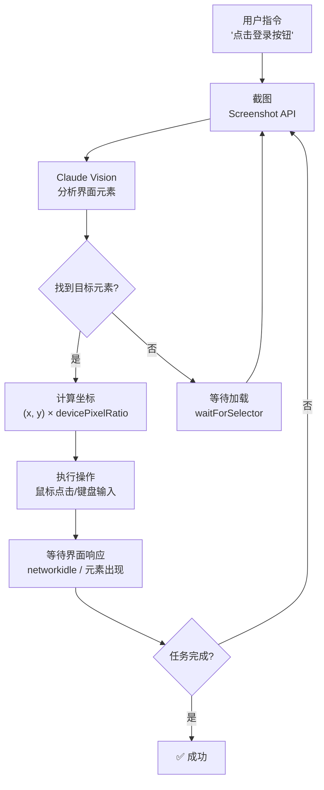
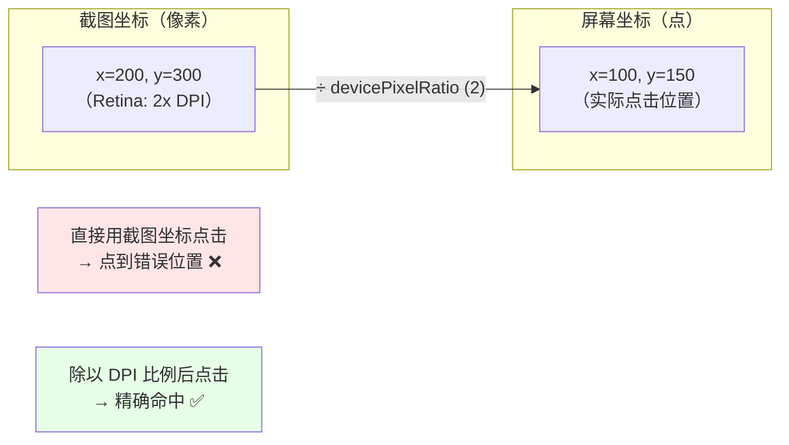
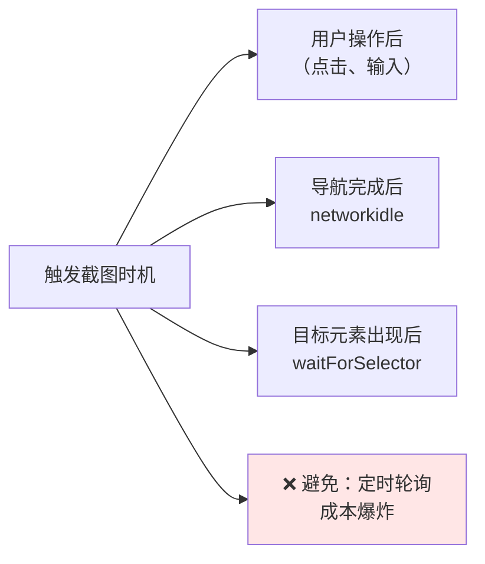
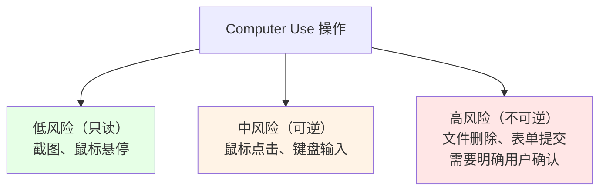

# 第 18 章：Hooks 系统——生命周期拦截点

> "Claude 执行完一个工具后，返回结果前，有没有机会让你的代码'钩住'这个结果做后处理？能否在 LLM 采样前插入一个 Hook 来审计/修改输出？Hooks 系统的设计让生命周期的每个关键点都可以被拦截。但这种高度的可扩展性也带来了新的安全挑战：一个恶意的 Hook 脚本可以悄悄地向内网发起 SSRF 攻击。系统如何在保持灵活性的同时防止这类攻击？"

## 18.1 为什么权限系统需要一个显式的生命周期拦截层？

权限检查是被动的：工具要执行时，权限系统说"可以"或"不可以"。但有时我们需要更主动的控制——不只决定能否执行，而是**在执行前后做自定义的逻辑注入**。

### 第一层：定义 Hook 事件的类型体系

`src/utils/hooks/hookEvents.ts` 中定义了系统的所有拦截点。这个文件列出了每个生命周期关键时刻：

```typescript
/**
 * Hook event system for broadcasting hook execution events.
 * 
 * This module provides a generic event system that is separate from the
 * main message stream. Handlers can register to receive events and decide
 * what to do with them (e.g., convert to SDK messages, log, etc.).
 */

import { HOOK_EVENTS } from 'src/entrypoints/sdk/coreTypes.js'

/**
 * Hook events that are always emitted regardless of the includeHookEvents
 * option. These are low-noise lifecycle events that were in the original
 * allowlist and are backwards-compatible.
 */
const ALWAYS_EMITTED_HOOK_EVENTS = ['SessionStart', 'Setup'] as const
```

这个注释揭示了一个设计决策："**有些 Hook 事件总是被触发**"。为什么？因为这些事件太重要了——用户初始化会话时、系统启动时，必须要有 Hook 的机会。

标准的 Hook 事件类型包括但不限于：

| Hook 类型 | 触发时机 | 用处 | 可用信息 |
|----------|--------|------|--------|
| **PreToolUse** | 工具执行前 | 审计即将执行的工具 | 工具名、参数 |
| **PostToolUse** | 工具执行后 | 审计/修改工具结果 | 工具名、参数、结果 |
| **PreSampling** | LLM 推理前 | 审计/修改 prompt | 消息历史 |
| **PostSampling** | LLM 推理后 | 审计/修改 LLM 输出 | 完整响应 |
| **SessionStart** | 会话开始 | 初始化会话级资源 | 会话信息 |
| **Setup** | 系统启动 | 初始化系统级资源 | 环境配置 |

### 第二层：设计意图——为什么 Hook 需要异步轮询而不是直接回调

一个直观的想法：Hook 就是一个回调函数。当事件发生时，调用 Hook 函数，拿到返回值，继续。

但 Claude Code 的 Hook 系统（`src/utils/hooks/AsyncHookRegistry.ts`）使用了**异步轮询**，而不是同步回调。为什么？

因为 **Hook 可能是外部进程**。`CLAUDE.md` 中定义的 Hook 可能是：
- 一个外部的 Python 脚本
- 一个远程的 Web 服务
- 一个需要用户交互的对话框

这些都不能用同步回调表达。你不能"调用一个远程进程，然后阻塞主线程等它返回"。

### 第三层：实际案例与权衡

**场景**：用户在 CLAUDE.md 中注册了一个 PostToolUse Hook，指向一个外部脚本。

```bash
# CLAUDE.md 中
hooks:
  - event: PostToolUse
    command: /usr/local/bin/audit-tool-result.sh
```

**同步回调的做法**（❌ 不行）：
```
工具执行完毕 → 调用 audit-tool-result.sh → 阻塞等待返回
    如果脚本卡住？→ 整个 Claude Code 卡住
    如果脚本网络超时？ → 用户体验糟糕
    如果脚本提示用户？ → 无法交互
```

**异步轮询的做法**（✓ 正确）：
```
工具执行完毕 → 注册 Hook 任务（异步）→ 主线程继续工作
    Hook 执行在后台
    主线程定期轮询 Hook 状态
    Hook 完成后继续
    即使 Hook 超时，主线程也不被阻塞（可以中止 Hook）
```

**权衡**：异步轮询 vs 同步回调

| 维度 | 同步回调 | 异步轮询 |
|------|--------|--------|
| 实现复杂度 | 低 | 高（需要状态管理） |
| 用户体验 | 差（容易卡住） | 好（响应快） |
| Hook 灵活性 | 低（只能同步函数） | 高（可以是任何进程） |
| 超时处理 | 困难（无法中止） | 自然（轮询超时可中止） |

**Claude Code 选择了异步轮询**，理由是**Hook 需要支持外部进程的灵活性，这比简单的实现更重要**。

## 18.2 异步 Hook 的注册、轮询、响应流程如何协调？

异步轮询看起来简单，但实现上需要精妙的状态管理。

### 第一层：定义 Hook 的生命周期数据结构

`src/utils/hooks/AsyncHookRegistry.ts:12` 定义了 `PendingAsyncHook` 类型：

```typescript
export type PendingAsyncHook = {
  processId: string           // 进程 ID
  hookId: string              // Hook 唯一 ID
  hookName: string            // Hook 名称
  hookEvent: HookEvent | 'StatusLine' | 'FileSuggestion'  // 事件类型
  toolName?: string           // 触发 Hook 的工具名（可选）
  pluginId?: string           // 所属插件 ID（可选）
  startTime: number           // Hook 启动时间（用于超时检测）
  timeout: number             // 超时时间
  command: string             // 要执行的命令
  responseAttachmentSent: boolean  // 响应是否已发送
  shellCommand?: ShellCommand // Shell 命令对象
  stopProgressInterval: () => void // 停止进度指示器的函数
}
```

这个数据结构不只是"记录 Hook 的参数"，而是**Hook 的完整生命周期快照**。注意几个关键字段：

- `startTime` + `timeout`：用于检测超时和超期的 Hook
- `responseAttachmentSent`：标记响应是否已被主线程消费，防止重复处理
- `stopProgressInterval`：主线程可以通过这个函数停止 Hook 的进度指示

### 第二层：设计意图——为什么需要 responseAttachmentSent 这样的状态标记

假设 Hook 注册了，主线程开始轮询。如果没有 `responseAttachmentSent` 标记，会发生什么？

```typescript
// 轮询循环（错误做法）
while (true) {
  for (const hook of pendingHooks) {
    if (hook.completed) {
      // 处理 Hook 结果
      processHookResponse(hook)
    }
  }
  await sleep(100)  // 100ms 轮询一次
}

// 问题：processHookResponse 可能被调用多次！
// 第 1 次轮询：processHookResponse(hook) ✓
// 第 2 次轮询（100ms 后）：processHookResponse(hook) ✗ 重复了
// 第 3 次轮询：processHookResponse(hook) ✗ 又重复了
```

加入 `responseAttachmentSent` 后：

```typescript
if (hook.completed && !hook.responseAttachmentSent) {
  processHookResponse(hook)
  hook.responseAttachmentSent = true  // ✓ 标记已处理，避免重复
}
```

### 第三层：实际案例与权衡

完整的异步 Hook 流程：

```typescript
// 第 1 步：注册 Hook（由 PostToolUse 事件触发）
registerPendingAsyncHook({
  processId: 'proc_12345',
  hookId: generateId(),
  hookEvent: 'PostToolUse',
  command: '/usr/local/bin/audit.sh',
  timeout: 5000,
  // ...其他字段
})
// → Hook 被加入 pendingHooks Map

// 第 2 步：主线程继续工作，定期轮询（checkForAsyncHookResponses，第 113 行）
for (const [hookId, hook] of pendingHooks) {
  if (hook.completed && !hook.responseAttachmentSent) {
    // 处理结果
    hook.responseAttachmentSent = true
    yield { type: 'hook_response', data: hook.result }
  }
  
  if (Date.now() - hook.startTime > hook.timeout) {
    // 超时处理
    console.warn(`Hook ${hookId} timeout after ${hook.timeout}ms`)
    pendingHooks.delete(hookId)
  }
}

// 第 3 步：Hook 完成后，更新状态
hook.completed = true
hook.result = { ...response }
```

时序图（概念）：

```
主线程      Hook 进程
  |           |
  +---------->| 注册 Hook（pushHookTask）
  |           | 执行中…
  | 轮询检查  |
  +---------->| 状态？
  |<----------+ 还在运行
  | (继续处理其他工作)
  |           | 执行完成
  | 轮询检查  |
  +---------->| 状态？
  |<----------+ 完成！返回结果
  +--处理结果-|
```

**权衡**：异步轮询的性能 vs 实时性

| 维度 | 轮询间隔 100ms | 轮询间隔 1s |
|------|-------------|----------|
| 平均延迟 | ~50ms | ~500ms |
| CPU 占用 | 较高（频繁轮询） | 较低 |
| 超时检测精度 | 高（±100ms） | 低（±1s） |

**Claude Code 使用了 100ms 的轮询间隔**（推断），平衡了响应速度和 CPU 开销。

## 18.3 Post-Sampling Hook 在完整的推理流程中处于什么位置？

"Sampling" 是指 LLM 生成输出的过程。Post-sampling Hook 在 LLM 响应完全接收后、写入对话历史前触发。

### 第一层：定义 Post-Sampling 的触发位置

在 `src/utils/hooks/postSamplingHooks.ts` 中，Hook 被触发的时机是：

```
[LLM 接收 → 流式 token 处理完毕 → Post-Sampling Hook 触发] 
→ [工具调用解析 → 权限检查 → 工具执行]
→ [添加到对话历史]
```

这个位置很关键。它在"已经有了完整的 LLM 响应"之后，但"还没有生效"之前。

### 第二层：设计意图——为什么 Post-Sampling Hook 是执行流程中最有权力的位置

Post-Sampling Hook 可以：
1. **审计**：看到完整的 LLM 输出，决定是否允许
2. **修改**：改动 LLM 的输出（例如，删除不安全的代码块）
3. **阻止**：直接中止执行（返回 null）
4. **记录**：将输出写到审计日志

相比之下：
- **PreSampling Hook**：只能看到 prompt，无法改 LLM 的输出
- **PostToolUse Hook**：只能改工具执行结果，无法改 LLM 的"决定"

因此 Post-Sampling Hook 是**仅次于权限检查的最强控制点**。

### 第三层：实际案例与权衡

**场景**：公司想要审计所有 LLM 输出，确保不包含敏感信息。

```typescript
// Post-Sampling Hook 的实现
function auditLLMOutput(response) {
  // 扫描是否包含 PII（个人身份信息）
  if (containsPII(response.text)) {
    return {
      allowed: false,
      reason: 'Output contains PII (email addresses, phone numbers)'
    }
  }
  
  // 扫描是否包含未授权的 API 密钥暴露
  if (containsAPIKeys(response.text)) {
    return {
      allowed: false,
      reason: 'Output contains exposed API keys'
    }
  }
  
  return { allowed: true }
}
```

**权衡**：Post-Sampling Hook 的强大能力 vs 性能开销

| 维度 | 有 Hook | 无 Hook |
|------|-------|-------|
| 控制粒度 | 极细（可以改任何输出） | 粗（只能接受/拒绝） |
| 性能开销 | 有（每次 LLM 调用都要检查） | 无 |
| 审计能力 | 强（完整可见） | 弱 |
| 安全边界 | 宽松（Hook 代码可能有漏洞） | 严格 |

**Claude Code 允许 Post-Sampling Hook**，理由是**审计和定制的需求优先于微小的性能成本**。

## 18.4 为什么 Hook 需要 SSRF 防护？

Hook 可以执行任意脚本，脚本可以发起网络请求。这就带来了一个安全问题。

### 第一层：定义 SSRF 攻击场景

SSRF（Server-Side Request Forgery）在这个场景中是指：

一个恶意的 MCP 服务器在工具执行过程中触发了一个 Hook。Hook 脚本向 Claude 运行所在机器的私有网络发起请求（例如 `http://192.168.1.1/admin`）。

`src/utils/hooks/ssrfGuard.ts:42` 定义了检测函数：

```typescript
export function isBlockedAddress(address: string): boolean {
  const v = isIP(address)
  if (v === 4) {
    return isBlockedV4(address)
  }
  if (v === 6) {
    return isBlockedV6(address)
  }
  // Not a valid IP literal
  return false
}

function isBlockedV4(address: string): boolean {
  // 检查是否是私有地址范围
  // 127.0.0.0/8 (localhost)
  // 10.0.0.0/8 (私有网络)
  // 172.16.0.0/12 (私有网络)
  // 192.168.0.0/16 (私有网络)
  // ...
}
```

### 第二层：设计意图——为什么需要地址级别的防护而不是 Hook 级别的信任

一个错误的做法是："只允许我们信任的 Hook"。问题是：

1. **信任的 Hook 可能有漏洞**。一个看起来安全的脚本可能在某个条件下被利用。
2. **用户可能无意中写出不安全的 Hook**。
3. **MCP 服务器可能被中间人攻击**，变成恶意的。

因此防护不能依赖"Hook 是否可信"，而应该在**执行层**就切断 SSRF 的可能性：禁止所有从 Hook 发起的私有网络请求。

### 第三层：实际案例与权衡

**攻击路径**（不带防护）：

```
用户注册了一个 MCP 服务 → MCP 服务有一个恶意 Hook → Hook 脚本：
    curl http://192.168.1.1/admin/panel
    # 或 curl http://169.254.169.254/latest/meta-data/
    # （AWS 元数据服务，可能暴露 IAM 凭证）
```

**带 SSRF 防护的流程**：

```typescript
// Hook 尝试向私有地址请求
await fetch('http://192.168.1.1/admin')

// 防护层检查
if (isBlockedAddress('192.168.1.1')) {
  throw new Error('SSRF protection: Private address blocked')
}
```

**权衡**：默认允许所有地址 vs 默认阻止私有地址

| 维度 | 允许所有 | 阻止私有地址 |
|------|--------|-----------|
| Hook 灵活性 | 高（可以访问任何资源） | 低（受限于公网） |
| 安全性 | 低（容易被 SSRF） | 高 |
| 误操作风险 | 低（用户意图是啥就是啥） | 高（用户写的正常脚本可能被阻止） |
| 恢复成本 | 高（SSRF 被利用后很难追踪） | 低（用户可以明确配置白名单） |

**Claude Code 选择了默认阻止私有地址**。理由是**SSRF 的危害（暴露内网资源、凭证泄露）远大于限制 Hook 灵活性的代价**。如果用户确实需要访问私有网络，可以在配置中明确白名单。

---

## 模式提炼

### 模式 1：异步轮询的生命周期管理（Async Polling Lifecycle）

**解决的问题**：外部进程 Hook 不能用同步回调表达。主线程也不能无限期地等待 Hook 返回。需要一个机制让异步任务与主线程协调。

**核心做法**：维护一个 `PendingAsyncHook` 的全局 Map。注册时将 Hook 加入 Map，主线程定期轮询 Hook 状态。Hook 完成后，主线程消费结果并从 Map 移除。用 `responseAttachmentSent` 标记防止重复处理。

**前置条件**：Hook 可能是外部进程或耗时操作，主线程不能阻塞。

**源码证据**：`src/utils/hooks/AsyncHookRegistry.ts:30` — `registerPendingAsyncHook`；第 113 行 — `checkForAsyncHookResponses`。

**适用范围**：任何需要与外部进程通信且不能阻塞主流程的系统。

---

### 模式 2：响应去重（Response Deduplication）

**解决的问题**：轮询机制可能在同一个 Hook 完成后多次处理结果，导致重复执行。

**核心做法**：给每个 Hook 加一个 `responseAttachmentSent` 标记。处理结果后立即标记，下次轮询时跳过。

**前置条件**：使用轮询机制处理异步任务。

**源码证据**：`src/utils/hooks/AsyncHookRegistry.ts:12` — `PendingAsyncHook` 类型的 `responseAttachmentSent` 字段。

**适用范围**：任何轮询-处理循环，其中任务可能跨越多个轮询周期。

---

### 模式 3：生命周期控制权的递阶（Hierarchical Lifecycle Control）

**解决的问题**：不同的 Hook 类型（Pre/Post sampling/tooluse）需要对执行流程有不同级别的控制权。需要清晰地定义各自的权限边界。

**核心做法**：明确定义每个 Hook 类型的触发时机和可改变的范围。Post-Sampling Hook 最强（可以改 LLM 输出），PostToolUse Hook 次之（只能改工具结果），PreToolUse Hook 最弱（只能审计）。

**前置条件**：系统有多个不同类型的扩展点，需要不同的权限级别。

**源码证据**：`src/utils/hooks/hookEvents.ts` — 完整的 HookEvent 枚举；`src/utils/hooks/postSamplingHooks.ts` — Post-Sampling 的特殊位置。

**适用范围**：有多层次扩展需求的系统（执行前检查、执行中修改、执行后审计等）。

---

### 模式 4：出口防护（Egress Protection）

**解决的问题**：Hook 可能发起网络请求。如果不加限制，可能被利用进行 SSRF 攻击，向内网发送恶意请求。

**核心做法**：所有 Hook 发起的网络请求先经过地址检查。阻止所有私有 IP 范围（127.0.0.0/8、10.0.0.0/8、192.168.0.0/16 等）。如果用户需要访问私有网络，明确白名单。

**前置条件**：Hook 可以执行任意代码并发起网络请求，有潜在的恶意输入源。

**源码证据**：`src/utils/hooks/ssrfGuard.ts:42` — `isBlockedAddress` 函数；第 216 行 — `ssrfGuardedLookup`。

**适用范围**：允许用户 Hook/插件的系统，特别是涉及网络访问的场景。

---


## 架构图

**图 18-1：Computer Use 的截图-分析-操作循环**



**图 18-2：DPI 缩放的坐标转换**



**图 18-3：截图时机的选择策略**



**图 18-4：Computer Use 的工具权限分级**




## 踩坑

### ❌ 在 pre-sampling hook 里做耗时操作，阻塞 Claude 的推理

Pre-sampling hook 在 Claude 生成每个回答**之前**同步执行。如果 hook 调用外部服务且有 500ms+ 延迟，每次对话都会增加明显的延迟。Hook 的执行应该是低延迟的（本地检查、日志记录），耗时操作应该放在 post-sampling hook 的异步路径里（`src/utils/hooks/`）。

### ❌ 假设 ssrfGuard 只防止外部网络请求

`ssrfGuard`（`src/utils/hooks/ssrfGuard.ts:216`）防止的是**内网地址攻击**（Server-Side Request Forgery）：攻击者通过 Hook 的外部 URL 配置，让 Claude 访问 `169.254.169.254`（云服务实例元数据）或 `localhost:9200`（本地 Elasticsearch）等内网服务。即使是"只读的" GET 请求也需要 SSRF 防护，因为读取到的内网数据可能包含 credentials。

### ❌ Post-sampling hook 异常时导致整个工具调用失败

```typescript
// ❌ 错误：hook 异常传播到主流程
async function postSamplingHook(result) {
  await externalLogging(result)  // 如果这里失败，工具调用也失败了
}
```

Post-sampling hook 是"旁路"（side effect），不应该影响主流程的成功/失败。Hook 的异常必须被捕获并记录，但不应该 rethrow 到主流程（`src/utils/hooks/AsyncHookRegistry.ts`）。


## 你能做什么

- **为扩展系统设计多层次的 Hook**。如果你的系统允许用户扩展，不要只有一个"插件运行点"。设计 pre/post/error 等多个 Hook 点，让用户可以在不同阶段介入。参考本章的 PreSampling/PostSampling 这样的细粒度设计。

- **显式定义每个 Hook 的能力边界**。明确告诉用户：这个 Hook 能改什么、不能改什么、是同步还是异步。不要让用户猜测。

- **如果 Hook 是异步的，设计超时和中止机制**。外部进程可能卡住。系统需要能够检测超期 Hook（超时多久后中止？）并从中恢复（如何清理资源？）。

- **对出口流量加防护**。如果 Hook 可以进行网络操作，默认阻止私有网络访问。除非用户明确配置了白名单。这是"安全优先"的正确做法。

---

## 向后链接

Hook 系统的权限检查遵循第 15 章介绍的三层决策模型。Hook 脚本可以通过 Plugin 系统（第 35 章）打包和分发。Skill 系统（第 36 章）也使用 Hook 机制来注入 AI 能力。
