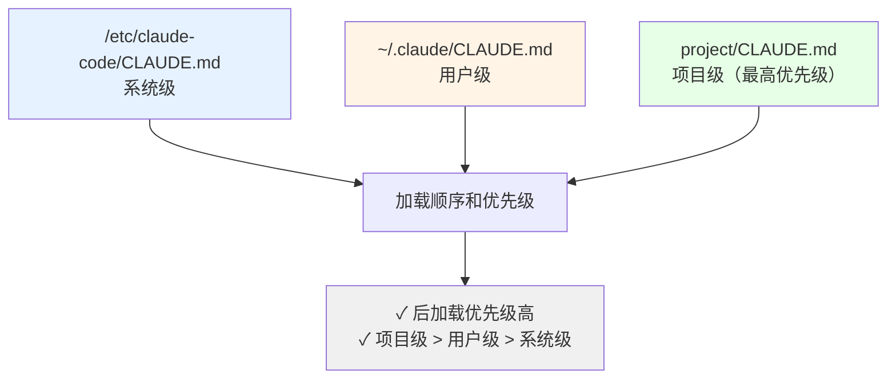
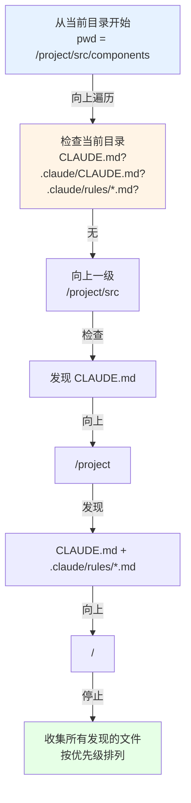

# 第 20 章：CLAUDE.md 的发现、解析与注入

> 一个项目有三个 CLAUDE.md：`/etc/claude-code/CLAUDE.md`（系统级）、`~/.claude/CLAUDE.md`（用户级）、`project/.claude/CLAUDE.md`（项目级）。运行 `claude` 时，系统怎样发现它们？如果三个文件对"代码风格"有矛盾指令，优先遵循哪一个？更棘手的是：用 `getMemoryFiles()` 遍历目录时，每轮对话都重新扫描磁盘会严重拖慢响应——但如果缓存，用户修改 CLAUDE.md 后何时生效？

这是**配置系统的经典三角矛盾**：层级化优先级 vs 动态感知变更 vs 读取性能。本章解析 Claude Code 的解法——`memoize` 缓存 + 显式失效触发，以及为什么不用文件 watcher。

---
项目根目录放了一个 CLAUDE.md 文件。同时，你的个人目录 ~/.claude/ 也有一个 CLAUDE.md。系统级的 /etc/claude-code/ 还有一个。当你运行 Claude Code 时，系统用的是哪一个？如果它们都有关于"代码格式化"的相互矛盾的指令，怎么调和？
这不仅是文件发现的问题，也是**权限管理的问题**。系统管理员的全局策略、个人开发者的偏好、项目团队的规范——它们需要在一个清晰的优先级链中共存。本章解析了 Claude Code 如何通过向上目录遍历、三层记忆分离、blacklist 排除等机制，构建了一个灵活且可预测的规则加载系统。

## 20.1 三种记忆路径与优先级
### 定义
CLAUDE.md 文件有三个来源，在 `src/utils/claudemd.ts:1-25` 的文件头注释中清晰标注：
```
 * 1. Managed memory (eg. /etc/claude-code/CLAUDE.md) - Global instructions
 * 2. User memory (~/.claude/CLAUDE.md) - Private global instructions
 * 3. Project memory (CLAUDE.md, .claude/CLAUDE.md, .claude/rules/*.md) - Instructions checked into codebase
 * 4. Local memory (CLAUDE.local.md in project roots) - Private project-specific
```
加载顺序是**反向**的：Managed → User → Project → Local，后加载的优先级更高。这意味着 Project 级的 CLAUDE.md 会覆盖 User 级的，而 User 级会覆盖 Managed 级的。
### 设计意图
为什么用反向加载而不是正向加载？这是对"优先级"的语义理解。后加载的内容"最后被看到"，LLM 对最后看到的内容关注度更高。这符合了 19 章中讲的"追加内容在末尾被重视"的原理。
这个设计还体现了一个层级哲学：系统级 < 用户级 < 项目级。系统级是全局默认，用户级是个人偏好，项目级是最具体的上下文。越具体的指令越应该优先。
### 实际案例与权衡
**案例：三层规则同时存在**
```
/etc/claude-code/CLAUDE.md（系统级，对所有用户生效）：
  "所有代码审查必须检查安全问题"
~/.claude/CLAUDE.md（用户级，对该用户所有项目生效）：
  "Python 项目使用 Black 格式化"
project/CLAUDE.md（项目级，仅对该项目生效）：
  "这个项目的 Python 代码禁用某个特定的 Black 规则"
```
最终 Claude 看到的组合是：系统级 + 用户级 + 项目级，但当有冲突时，项目级覆盖用户级，用户级覆盖系统级。
---
## 20.2 目录层级遍历
### 定义
Project 记忆的发现不是一次性的"从根目录查找"，而是**向上递归遍历**。从当前工作目录开始，逐个检查当前目录和上级目录，直到到达项目根或文件系统根。
`src/utils/claudemd.ts:790` 中的 `getMemoryFiles = memoize(...)` 实现了这个遍历：
```typescript
export const getMemoryFiles = memoize(async () => {
  // 从当前工作目录开始
  let currentDir = process.cwd();
  const discoveredFiles: string[] = [];
  while (currentDir !== '/') {
    // 检查 CLAUDE.md、.claude/CLAUDE.md、.claude/rules/*.md
    // ...
    // 向上一级
    currentDir = dirname(currentDir);
  }
  return discoveredFiles;
});
```
### 设计意图
为什么向上而不是向下？因为 CLI 工具的典型工作流是"从当前目录开始"。Git 的 `.git` 目录查找也是同样的模式——从当前目录向上找，直到找到项目根。
向上遍历的优点是：**离当前目录越近的规则优先级越高**。你在 `src/components/` 下发现的 CLAUDE.md 比在项目根的优先级更高。这支持了"细粒度、逐层覆盖"的配置模式。
### 实际案例
**项目结构与规则发现**
```
/home/user/projects/myapp/
  ├── CLAUDE.md (项目根规则)
  ├── src/
  │   ├── CLAUDE.md (src层规则，更高优先级)
  │   └── components/
  │       └── .claude/rules/react.md
  └── tests/
      └── CLAUDE.md (测试层规则)
当在 src/components 工作时：
遍历顺序 = src/components → src/ → /home/user/projects/myapp/ → /home/user → /
最终加载的 CLAUDE.md 优先级顺序（从高到低）：
1. src/components/.claude/rules/react.md
2. src/CLAUDE.md
3. /home/user/projects/myapp/CLAUDE.md
```
---
## 20.3 排除机制
### 定义
不是所有发现的 CLAUDE.md 都被加载。通过 `claudeMdExcludes` 配置（通常在 ~/.claude/config.yaml 或环境变量），可以维护一个黑名单。
`src/utils/claudemd.ts:540-560` 中的 `isClaudeMdExcluded()` 在加载前检查：
```typescript
function isClaudeMdExcluded(filePath: string, type: MemoryType): boolean {
  // 检查用户配置的 excludes 列表
  // 返回 true 时该文件被跳过
}
```
### 设计意图
为什么需要排除机制？因为某个 CLAUDE.md 文件可能：
- 包含过时的指令（项目已迁移但旧文件还在）
- 有害或测试数据（开发者的实验性提示）
- 来自子模块或依赖（不该应用到主项目）
排除机制允许用户"无需删除文件，直接跳过"。这对版本控制友好——不用为了禁用某个规则而删除或修改文件。
### 实际案例
```yaml
# ~/.claude/config.yaml
claudeMdExcludes:
  - "node_modules/**/CLAUDE.md"  # 排除依赖的规则
  - "legacy/CLAUDE.md"           # 排除已弃用的目录
  - "**/experimental/*.md"       # 排除实验性规则
```
---
## 20.4 缓存与失效策略
### 定义
`getMemoryFiles` 使用 `memoize` 缓存结果。在 REPL 会话中，第一次调用时执行完整的目录遍历和文件加载，后续调用直接返回缓存的结果。
缓存何时失效？当调用 `setSystemPromptInjection()` 时，缓存被清除（`cache.clear()`）。这个机制确保了用户修改 CLAUDE.md 后的显式更新能被感知。
### 设计意图
系统提示的计算代价高：
- 目录遍历（多个 `readdir` / `stat` 调用）：50ms
- 文件读取（多个 `readFile` 调用）：10ms  
- 文本解析（支持 @ 引用的递归解析）：20ms
在一个 50 轮的 REPL 会话中，如果每次都重新计算，会浪费 **4 秒**的时间。缓存避免了这个浪费。
缓存失效条件是"用户修改了系统提示"（显式调用 `setSystemPromptInjection`），这时需要清除旧的缓存。
### 缓存失效的具体场景
**场景一：用户修改 CLAUDE.md**
```bash
# REPL 运行中...
用户用编辑器修改 project/CLAUDE.md
# 但缓存不会自动感知！
# 需要显式操作触发更新
/set system-prompt-injection-refresh  # 触发 setSystemPromptInjection
或
/resume  # 恢复会话时自动清除旧缓存
或  
退出重启 REPL  # 新会话自动重新计算
```
**场景二：在多个项目间切换**
如果用户用 `cd` 切换到另一个项目后继续使用 REPL，缓存会保留旧项目的 CLAUDE.md。需要通过 `/set` 命令或重启来更新。
### 性能数据对比
```
首次调用 getMemoryFiles()：
  - 遍历 10 级目录：10 × readdir ≈ 50ms
  - 读取 5 个 CLAUDE.md 文件：5 × readFile ≈ 10ms
  - 解析和合并：≈ 20ms
  - 总计：≈ 80ms
后续调用（缓存命中）：
  - 直接返回内存中的结果：≈ 1ms
50 轮对话，每轮调用一次：
  - 无缓存：80ms × 50 = 4 秒
  - 有缓存：80ms + 1ms × 49 = 129ms
  - 节省：**96.8% 的时间**
```
这个节省对长时间运行的 REPL 特别重要。如果没有缓存，50 轮对话会额外消耗 4 秒的延迟，累积到会话中期会变成明显的性能问题。
---
## 增补：最佳实践与组织策略
### .claude/rules 与 @ 引用的组织最佳实践
当项目的规则变得复杂时，应该如何组织？
**反面例子：单个巨大的 CLAUDE.md**
```markdown
# CLAUDE.md (2000+ 行)
## 代码风格
- 使用 Prettier...
- 最大行长...
## 测试规范  
- 所有新功能需要测试...
- 测试覆盖率 > 80%...
## 性能要求
- API 响应时间 < 100ms...
## 安全审计
- 所有用户输入必须验证...
```
这种单文件方式的问题：
- 难以版本控制（文件太大，每个修改都包含整个文件）
- 难以所有权分配（谁负责维护哪部分规则不清晰）
- 难以审查（PR 包含大量无关内容）
**正面例子：模块化规则**
```
.claude/
  ├── CLAUDE.md (主入口，简短)
  │   @./rules/code-style.md
  │   @./rules/testing.md
  │   @./rules/security.md
  ├── rules/
  │   ├── code-style.md      (前端负责)
  │   ├── testing.md         (QA 负责)
  │   ├── security.md        (安全团队负责)
  │   └── performance.md     (后端负责)
```
优点：
- 每个文件小而专注（100-500 行）
- 可以分配不同的所有权
- PR 审查更清晰（只看相关文件的变化）
- 缓存失效时间更短（修改一个文件，不会导致整个规则重新加载）
### 三种排除机制的使用场景对比
| 排除机制 | 触发时机 | 修改位置 | 作用范围 | 何时使用 |
|---------|---------|---------|---------|---------|
| .claude/rules 文件不加 @ 引用 | 默认 | 编辑 CLAUDE.md | 仅影响当前引用位置 | 想完全禁用某个规则文件 |
| claudeMdExcludes 配置 | 启动时加载 | ~/.claude/config.yaml | 全局或用户级 | 想跨项目地排除某些规则 |
| isClaudeMdExcluded 函数过滤 | 运行时检查 | 代码逻辑（需修改源码） | 系统级 | 系统开发者需要的细粒度控制 |
大多数场景下，使用 **claudeMdExcludes 配置**就足够了。
---
## 20.5 文件解析与合并
### 定义
每个发现的 CLAUDE.md 都通过 `parseMemoryFile()` 解析。该函数支持 @ 引用语法，允许一个 CLAUDE.md 包含（include）其他文件。
所有已解析的文件最后合并成一个大字符串，作为系统提示的一部分。
### 设计意图
@ 引用语法允许**模块化的规则管理**。一个大的 CLAUDE.md 可以被拆分为多个小文件：
```markdown
# 项目主规则 (CLAUDE.md)
## 代码风格
@./rules/code-style.md
## 测试规范
@./rules/testing.md
## 安全要求
@./rules/security.md
```
这样，不同团队成员可以各自维护自己的规则文件（如前端维护 code-style.md，测试团队维护 testing.md），而不是在一个大文件中冲突。
### 实际案例
```markdown
# .claude/CLAUDE.md
@./rules/python-style.md
@./rules/testing.md
@~/shared-rules/security.md  # ~/ 表示主目录
@/absolute/path/rules.md      # 绝对路径
# .claude/rules/python-style.md
- 使用 Black 格式化
- 最大行长 88 字符
```
---
## 20.6 .claude/rules 目录的自动扫描
### 定义
除了 CLAUDE.md 和 .claude/CLAUDE.md，系统还自动扫描 `.claude/rules/` 目录中的所有 `*.md` 文件。这些文件被自动加载和合并，无需在 CLAUDE.md 中显式 include。
### 设计意图
.claude/rules 目录是**细粒度规则组织的约定**。不需要在主 CLAUDE.md 中维护 @ 引用列表，所有 rules 下的文件自动被发现。这支持了"添加新规则文件时无需修改主文件"的工作流。
### 文件加载顺序
```
按字母顺序加载：
.claude/rules/a-setup.md
.claude/rules/b-styles.md
.claude/rules/c-testing.md
```
通过文件名前缀可以控制加载顺序（如 `a-`, `b-`, `c-`）。
---
## 图解

**图 20-1：三层记忆路径的优先级**

**图 20-2：目录遍历与规则发现**

---

## 模式提炼
### 模式一：三层记忆分离
**解决的问题**：系统级、用户级、项目级的规则需要独立管理，但优先级关系必须清晰。
**核心做法**：维护三个路径（/etc/claude-code、~/.claude、project/.claude），反向加载以实现"后加载优先级高"。
**前置条件**：多层级管理需求，需要全局、个人、项目级的配置分离。
**源码证据**：`src/utils/claudemd.ts:1-25` — 文件头的三种记忆类型注释。
---
### 模式二：向上目录遍历
**解决的问题**：项目中多个层级都可能有规则文件，需要自动发现且优先级"离当前目录越近越高"。
**核心做法**：从当前工作目录向上遍历到项目根或文件系统根，在每个目录中检查 CLAUDE.md、.claude/CLAUDE.md、.claude/rules/*.md。
**前置条件**：项目嵌套结构，想要细粒度的层级化规则。
**源码证据**：`src/utils/claudemd.ts:790-850` — getMemoryFiles 的遍历逻辑。
---
### 模式三：Blacklist 排除
**解决的问题**：某些规则文件需要被跳过但不能删除（版本控制原因或来自依赖）。
**核心做法**：通过 claudeMdExcludes 配置维护黑名单，isClaudeMdExcluded 在加载前检查。
**前置条件**：规则文件过时或有害，但无法直接删除。
**源码证据**：`src/utils/claudemd.ts:540-560` — isClaudeMdExcluded 函数。
---
### 模式四：memoize 缓存
**解决的问题**：频繁查找 CLAUDE.md 会耗尽磁盘 I/O 和 CPU，尤其在大型项目中。
**核心做法**：使用 memoize 缓存 getMemoryFiles 结果，setSystemPromptInjection 触发失效。
**前置条件**：高频访问的特性，需要性能优化。
**源码证据**：`src/utils/claudemd.ts:790` — memoize 包装。
---
### 模式五：@ 引用语法
**解决的问题**：大的 CLAUDE.md 难以维护，需要拆分为多个主题文件。
**核心做法**：在 CLAUDE.md 中支持 @path 语法 include 其他文件，支持相对路径、~/ 主目录、绝对路径。
**前置条件**：需要模块化规则，多个文件各自维护。
**源码证据**：`src/utils/claudemd.ts:600-700` — parseMemoryFile 和引用解析。
---
## 模式提炼

### 分层记忆覆盖（Layered Memory Override）

**解决的问题**：系统级规则、用户级偏好、项目级规范三者之间有优先级关系，但三者都需要生效——不是"最高优先级胜者全得"。

**核心做法**：反向加载——先加载最低优先级（系统级），再加载更高优先级（用户级），最后加载最高优先级（项目级）。LLM 对后加载的内容更敏感（"最后看到的"），自然形成"后加载优先"的效果。

**源码证据**：`src/utils/claudemd.ts:1-25` — 文件头注释明确了四种记忆类型及其加载顺序。

### 记忆化遍历（Memoized Traversal）

**解决的问题**：向上递归遍历目录（10+ 层）涉及大量 `readdir`/`stat` 系统调用，如果每轮对话都重新执行，50 轮对话会累积 4 秒的不必要延迟。

**核心做法**：用 `memoize` 缓存 `getMemoryFiles()` 的结果，同一会话中后续调用直接返回内存缓存，只有显式触发（`setSystemPromptInjection`）才清除缓存重新扫描。

**源码证据**：`src/utils/claudemd.ts:790` — `export const getMemoryFiles = memoize(async () => { ... })`，缓存整个目录遍历结果。

## 踩坑

### ❌ 在高频对话中依赖会话内 CLAUDE.md 缓存，修改后不知道何时生效

`getMemoryFiles` 用 `memoize` 缓存，一旦缓存命中就不再读磁盘。用户在编辑器里改了 CLAUDE.md，当前会话里的 Claude 看到的还是旧内容（`src/utils/claudemd.ts:790`）。

**解决方法**：修改 CLAUDE.md 后，用 `/memory refresh` 命令触发缓存失效，或者重启 REPL 会话。

### ❌ 把团队规则和个人偏好写在同一个文件里

```markdown
# project/CLAUDE.md（❌ 个人偏好和团队规则混在一起）
- 代码格式化用 Prettier（团队规则）
- 我喜欢函数式风格（个人偏好）
- API 密钥前缀 sk-（安全规则，不应在此）
```

团队规则放 `project/.claude/CLAUDE.md`（提交到 git），个人偏好放 `~/.claude/CLAUDE.md`（不提交），涉密信息不应出现在 CLAUDE.md 里。

### ❌ 用绝对路径写 @ 引用，在其他开发者的机器上失效

```markdown
# ❌ 错误：绝对路径只在你的机器上有效
@/home/alice/company-rules.md
```

使用相对路径或 `~/` 主目录前缀，并确保被引用的文件也在版本控制中。

## 你能做什么

- **用 `.claude/rules/` 模块化管理规则**：把大的 CLAUDE.md 拆分成按主题分类的小文件，用 `@./rules/code-style.md` 引用
- **区分团队规则和个人偏好**：团队规则提交到 `project/.claude/CLAUDE.md`，个人习惯放 `~/.claude/CLAUDE.md`，不要混在一起
- **了解缓存失效的触发方式**：修改 CLAUDE.md 后，需要明确触发缓存刷新（重启 REPL 或用 `/memory refresh`）
- **用 `claudeMdExcludes` 跳过不需要的规则文件**：比如排除 `node_modules/**/CLAUDE.md`，避免意外加载依赖里的规则
