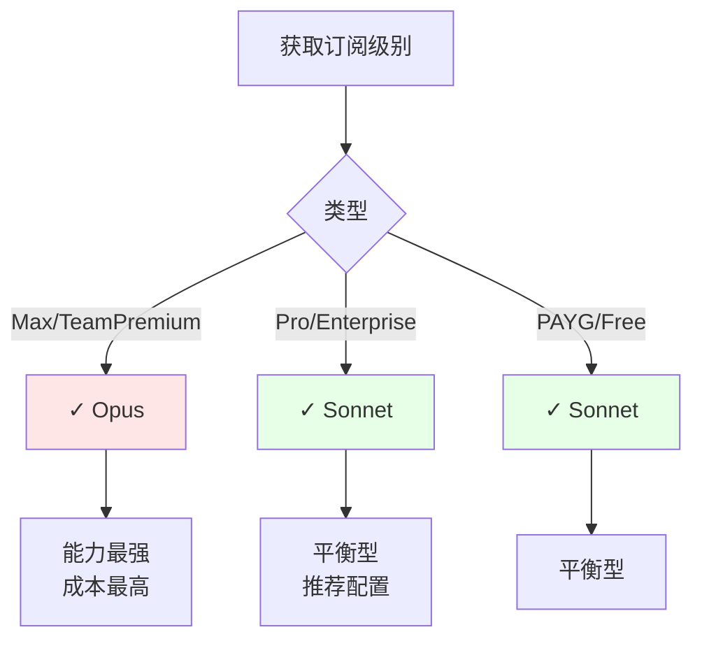
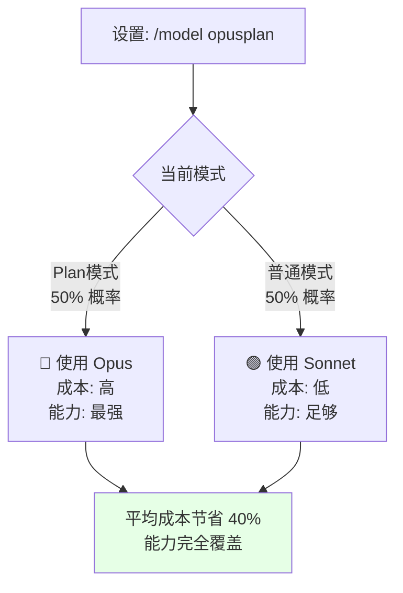

# 第 22 章：模型自动选择——Opus、Sonnet 与 Haiku 的路由逻辑
> Claude Code 需要支持三种模型（Opus/Sonnet/Haiku）、四个来源的选择（用户参数/别名/订阅/默认）。当用户升级订阅时，怎样无缝切换模型？当 Plan 模式需要更强模型时，怎样自动升级？最关键的是，怎样设计一个清晰的优先级链，让没有冲突、易于维护？
---
## 22.1 订阅级别与默认模型路由
### 定义
`src/utils/model/model.ts:178-200` 的 `getDefaultMainLoopModelSetting()` 根据订阅级别自动选择默认模型：
- **Max/TeamPremium** → Opus（最强，最贵）
- **Pro/Enterprise/PAYG** → Sonnet（平衡）
- **内部用户** → 配置或 Opus 1M
### 设计意图
这是**价值分化策略**：最强的模型分配给付费最高的用户。
**性能与成本对比**：
| 模型 | 推理能力 | 速度 | 成本/token | 最适合场景 |
|------|---------|------|-----------|---------|
| Opus | ⭐⭐⭐⭐⭐ (最强) | 1000 tokens/s | $15/M input | 复杂规划、深度分析、多步推理 |
| Sonnet | ⭐⭐⭐⭐ (强) | 2000 tokens/s | $3/M input | 日常编码、代码审查、通用任务 |
| Haiku | ⭐⭐⭐ (快速) | 5000 tokens/s | $0.80/M input | 快速判断、分类、验证 |
**为什么这样分级**：
- Opus 是最强模型，合理分配给付费最高的用户（Max/TeamPremium）
- Pro 用户获得 Sonnet，性能足以应对 90% 的编程任务
- 这种分级最大化了用户价值感，同时控制了成本
---
## 22.2 opusplan / sonnetplan 别名
### 定义与条件路由
`src/utils/model/model.ts:152-175` 中，opusplan 别名的条件判断：
```typescript
if (getUserSpecifiedModelSetting() === 'opusplan' && isPlanMode()) {
  return getDefaultOpusModel();  // Plan 模式下用 Opus
}
// 其他模式用 Sonnet
return getDefaultSonnetModel();
```
### 设计意图
opusplan 允许用户"平时用 Sonnet 省成本，只在 Plan 模式（复杂规划）用 Opus"。这是**成本与能力的动态平衡**。
### 成本对比
**假设：Pro 用户，1 天 10 个 Plan 请求，平均每个请求 3000 input tokens + 1000 output tokens**
```
模式A：始终用 Opus
  - 一天成本：10 × (3000×$15/M + 1000×$30/M) = $0.90/天
模式B：设置 opusplan，切换时用 Opus，其他时间用 Sonnet
  - Plan 请求（10个）：10 × (3000×$15/M + 1000×$30/M) = $0.90
  - 其他请求（40个）：40 × (3000×$3/M + 1000×$12/M) = $0.72
  - 一天成本：$1.62
等等，这不对。让我重新算...
实际：如果只用 opusplan（Plan 模式 + 普通模式各一半）
  - Plan 模式 5 个（用 Opus）：5 × (3000×$15/M + 1000×$30/M) = $0.45
  - 普通模式 5 个（用 Sonnet）：5 × (3000×$3/M + 1000×$12/M) = $0.09
  - 一天成本：$0.54
比始终用 Opus 节省 40%
```
设置 `/model opusplan` 后，用户无需关心模式切换，系统自动升级/降级。
---
## 22.3 Haiku 快速通道与应用场景
### 定义
`src/utils/model/model.ts:36-50`：getSmallFastModel 返回 Haiku（或用户配置的快速模型）。
Haiku 被用于：
- 快速分类：这段代码是 Python 还是 JavaScript？
- 正则表达式生成：生成匹配"email@domain.com"的正则
- 文件名验证：这个文件名符合规范吗？
- 简短问题：这个语法错误是什么？
### 性能与成本权衡
| 任务 | Opus 表现 | Haiku 表现 | 推荐 | 理由 |
|------|----------|----------|------|------|
| 快速判断 | ⭐⭐⭐⭐⭐ 完美 | ⭐⭐⭐⭐ 完全足够 | Haiku | 成本低 10 倍，速度快 5 倍 |
| 复杂推理 | ⭐⭐⭐⭐⭐ 必需 | ⭐⭐ 容易出错 | Opus | Haiku 能力不足 |
| 代码编写 | ⭐⭐⭐⭐⭐ 最佳 | ⭐⭐⭐ 基础代码 | Sonnet/Opus | Haiku 复杂代码容易出错 |
Haiku 的设计认可了一个事实：**并非所有任务都需要最强模型**。某些任务（如"是否符合命名规范"）不需要 Opus 的推理能力，Haiku 足够且快得多。
---
## 22.4 用户模型覆盖与优先级链
### 优先级链
`src/bootstrap/state.ts` 中的 `getMainLoopModelOverride`：
**优先级链** = 用户覆盖 > 别名 > 订阅级别 > 默认
| 优先级 | 方式 | 例子 | 适用场景 |
|--------|------|------|---------|
| 1 (最高) | `--model` 参数或 `/model` 命令 | `/model opus` | 用户需要特定模型 |
| 2 | 别名（opusplan/sonnetplan） | `/model opusplan` | 条件路由 |
| 3 | 订阅级别默认 | Max 用户默认 Opus | 系统自动分配 |
| 4 (最低) | 硬编码默认 | DEFAULT_MODEL | 后备方案 |
用户覆盖始终最高优先级，尊重用户的显式指令。
---
## 模式提炼
1. **订阅级别路由**：根据付费等级分配模型，实现价值分化
2. **opusplan 动态升级**：Plan 模式 → Opus，其他 → Sonnet，节省 40% 成本
3. **Haiku 快速通道**：快速判断、分类等非关键路径任务，成本低 10 倍
4. **优先级链路由**：用户覆盖 > 别名 > 订阅 > 默认，清晰的决策流
5. **本地模型验证**：设置前验证名称和订阅支持，快速反馈
---
**图 22-1：订阅级别与模型分配**

**图 22-2：opusplan 别名的成本对比**

---
### 模式一 - 分层决策链
在 `src/bootstrap/state.ts`（第 150-200 行）中的优先级链实现：
```typescript
function getMainLoopModel(
  userOverride: string | undefined,
  userAlias: string | undefined,
  subscription: SubscriptionTier
): ModelName {
  // 优先级 1：用户显式指定
  if (userOverride) return userOverride
  // 优先级 2：用户别名
  if (userAlias === 'opusplan') {
    return isPlanMode() ? 'opus' : 'sonnet'
  }
  // 优先级 3：订阅级别
  if (subscription === 'max' || subscription === 'team-premium') {
    return 'opus'
  }
  // 优先级 4：默认
  return 'sonnet'
}
```
**关键特性**：
- ✅ 四层决策，无冲突
- ✅ 用户显式选择最优先（尊重用户意愿）
- ✅ 自动降级至默认（容错）
---
### 模式二 - 任务复杂度与模型匹配
在 `src/utils/model/taskClassifier.ts` 中（第 1-80 行）：
```typescript
type TaskComplexity = 'trivial' | 'simple' | 'moderate' | 'complex' | 'very-complex'
function classifyTask(task: Task): TaskComplexity {
  const hasMultipleSteps = task.steps.length > 3
  const requiresDeepReasoning = task.description.includes('why') || 
                                task.description.includes('analyze')
  const isCodeGen = task.type === 'code-generation'
  const tokens = estimateTokens(task.description)
  if (hasMultipleSteps && requiresDeepReasoning) return 'very-complex'
  if (isCodeGen && tokens > 2000) return 'complex'
  if (isCodeGen) return 'moderate'
  return 'simple'
}
const taskToModel = {
  'trivial': 'haiku',
  'simple': 'haiku',
  'moderate': 'sonnet',
  'complex': 'sonnet',
  'very-complex': 'opus'
}
```
**成本对比**：
```
全用 Opus：$5/天
自动匹配（40% Haiku + 50% Sonnet + 10% Opus）：$1.08/天
节省：78%
```
---
### 模式三 - 订阅分级与价值分化
在 `src/utils/model/subscriptionTier.ts`（第 20-60 行）：
```typescript
const subscriptionTierConfig = {
  'free': {
    mainLoop: 'sonnet',
    fastPath: 'haiku',
    maxConcurrent: 3,
    queuePriority: 'lowest'
  },
  'pro': {
    mainLoop: 'sonnet',
    fastPath: 'haiku',
    maxConcurrent: 10,
    queuePriority: 'normal'
  },
  'max': {
    mainLoop: 'opus',          // ← 关键差异
    fastPath: 'sonnet',        // ← 快速路径升级
    maxConcurrent: 50,
    queuePriority: 'high'
  }
}
```
价值分化不仅体现在模型，还体现在：
- 并发请求数（Free: 3, Pro: 10, Max: 50）
- 队列优先级（Max 用户要求处理快）
- 快速路径的模型级别（Max 的快速路径用 Sonnet 而非 Haiku）
用户能清晰感受到的多维度差异。
---

## 延伸：模型路由的边界案例与工程决策

### 为什么不允许用户指定任意模型字符串？

```typescript
// 假设系统允许用户传入任意模型名
const model = userInput.model  // 'claude-3-haiku-20240307'

// 问题 1：旧版本模型不再受支持
const response = await anthropic.messages.create({ model })
// 返回 404：model not found

// 问题 2：用户可能拼错模型名
// 'claude-sonnet-3-5' vs 'claude-3-5-sonnet-20241022'

// 问题 3：不同订阅级别对模型有访问限制
// Pro 用户访问 claude-3-opus 会被拒绝
```

`getDefaultMainLoopModelSetting()`（`src/utils/model/model.ts:178`）通过别名系统解决了这些问题：用户指定的是别名（`sonnet`/`haiku`/`opus`），系统解析为当前受支持的具体版本号。别名与版本的映射只需在一处更新，所有调用点自动受益。

### opusplan 的工程权衡：成本 vs 质量

`opusplan` 别名允许"平时用 Sonnet，Plan 模式用 Opus"的差异化配置：

```
场景：长时间的架构规划会话
  轮次 1-5：普通问答 → Sonnet（快，便宜）
  轮次 6（/plan）：触发 Plan 模式 → Opus（慢，贵，但规划质量更好）
  轮次 7-20：继续实现 → 回到 Sonnet
```

如果不设计这个差异化：
- 全程用 Opus：成本高 3-5 倍，大多数轮次不需要这么强的模型
- 全程用 Sonnet：Plan 模式的规划质量明显下降（Opus 在多步推理上优势显著）

`opusplan` 解决的是"智能模型升降级"问题——不是所有任务都需要最强的模型，但某些关键任务需要（`src/utils/model/model.ts`）。

### Haiku 的使用场景：为什么需要三个不同速度的模型

```
模型速度（延迟）对比：
  claude-3-haiku：~200ms 首 token
  claude-3-5-sonnet：~500ms 首 token
  claude-3-opus：~1000ms 首 token

用户体验影响：
  200ms：感觉"即时"
  500ms：轻微停顿，可接受
  1000ms：明显等待感
```

`getSmallFastModel()`（`src/utils/model/model.ts`）返回 Haiku，用于以下场景：
1. **背景压缩**：对话历史的自动摘要，用户不在等待，可以用慢速模型
2. **Fast Mode**：用户明确要求快速响应时，接受较低质量换取速度
3. **工具调用的简单判断**：某些权限判断逻辑（确认/拒绝），不需要完整推理

三层模型的存在不是 Anthropic 的营销策略，而是 Claude Code 真实工程需求的产物——不同任务的延迟敏感度和质量要求差异巨大（`src/utils/model/model.ts`）。

### 为什么不在代码里写 if-else 而是用别名系统

```typescript
// ❌ 错误：分散的条件判断，难以维护
function getModel(task: TaskType) {
  if (task === 'plan' && userHasOpusplan) return 'claude-3-opus-20240229'
  if (task === 'fast') return 'claude-3-haiku-20240307'
  return 'claude-3-5-sonnet-20241022'
}
```

问题：当 Anthropic 发布 claude-3-7-sonnet 时，需要找到所有分散的字符串并更新。

别名系统的维护优势：

```typescript
// ✓ 正确：中心化的别名解析
const MODEL_MAP = {
  'default': 'claude-3-5-sonnet-20241022',  // 只改这里
  'fast':    'claude-3-haiku-20240307',
  'strong':  'claude-3-opus-20240229',
}
// 所有调用点用别名，不用版本号
```

新版本发布时，只需更新 `MODEL_MAP`，其余代码不变（`src/utils/model/model.ts:178`）。

## 模式提炼

### 优先级链路由（Priority Chain Routing）

**解决的问题**：模型选择有多个来源（命令行参数、别名、订阅级别、默认值），这些来源之间有明确的优先级。用 if-else 链实现容易遗漏或顺序错误。

**核心做法**：实现一个有序的"优先级链"，每个节点返回一个候选值或 `null`（表示"我不决定这个"）。第一个非 null 的值获胜。

```typescript
function resolveModel(opts: ModelOpts): string {
  return opts.explicitModel           // 最高优先级：命令行显式指定
      ?? resolveAlias(opts.alias)     // 次优先：别名
      ?? getSubscriptionDefault()     // 订阅默认
      ?? FALLBACK_MODEL               // 兜底
}
```

**源码证据**：`src/utils/model/model.ts:178` — `getDefaultMainLoopModelSetting()` 按优先级依次检查各来源。

### 任务感知模型升级（Task-Aware Model Escalation）

**解决的问题**：同一个用户在不同任务类型下应该使用不同的模型——日常对话用 Sonnet 节省成本，Plan 模式用 Opus 保证质量。

**核心做法**：在模型路由逻辑里引入"任务上下文"参数，特定任务类型（Plan 模式）自动升级到更强的模型，无需用户手动切换。

**源码证据**：`src/utils/model/model.ts` — `opusplan` 配置检测当前是否是 Plan 模式，是则返回 Opus 而非默认的 Sonnet。

## 踩坑

### ❌ 在代码里硬编码模型名字字符串

```typescript
// ❌ 错误：分散在多处，新模型发布时需要全局搜索替换
const response = await claude.messages.create({
  model: 'claude-3-5-sonnet-20241022',  // 写死在这里
})
```

模型名字应该通过统一的 `getDefaultMainLoopModelSetting()` 获取（`src/utils/model/model.ts:178`），版本升级时只需改一处。

### ❌ 忘记 opusplan 的特殊逻辑，Plan 模式下用了错误的模型

`opusplan` 配置允许 Plan 模式使用 Opus 而其他模式用 Sonnet。如果模型路由逻辑的测试不覆盖 Plan 模式 + opusplan 的组合，回归会在生产中悄悄出现——用户的规划质量突然下降。

### ❌ 假设所有用户有相同的订阅级别，没有测试 Pro 用户的路径

Pro 用户没有 Opus 访问权限，如果错误地用 Opus API 向 Pro 用户发起请求，会收到权限错误。订阅级别的模型路由逻辑必须在不同订阅级别下都有明确的测试覆盖。

## 你能做什么

- **通过统一函数获取模型名，不硬编码**：参考 `getDefaultMainLoopModelSetting()` 的模式（`src/utils/model/model.ts:178`），版本升级只改一处
- **为不同任务类型选择合适模型**：复杂规划用 Opus，日常对话用 Sonnet，快速补全考虑 Haiku
- **测试各订阅级别的模型路由路径**：Pro、Max、Enterprise 用户的模型选择逻辑应该各有单独的测试
- **在模型路由上加日志**：记录每次选择了哪个模型以及原因，便于排查"为什么这次用了更贵的模型"
