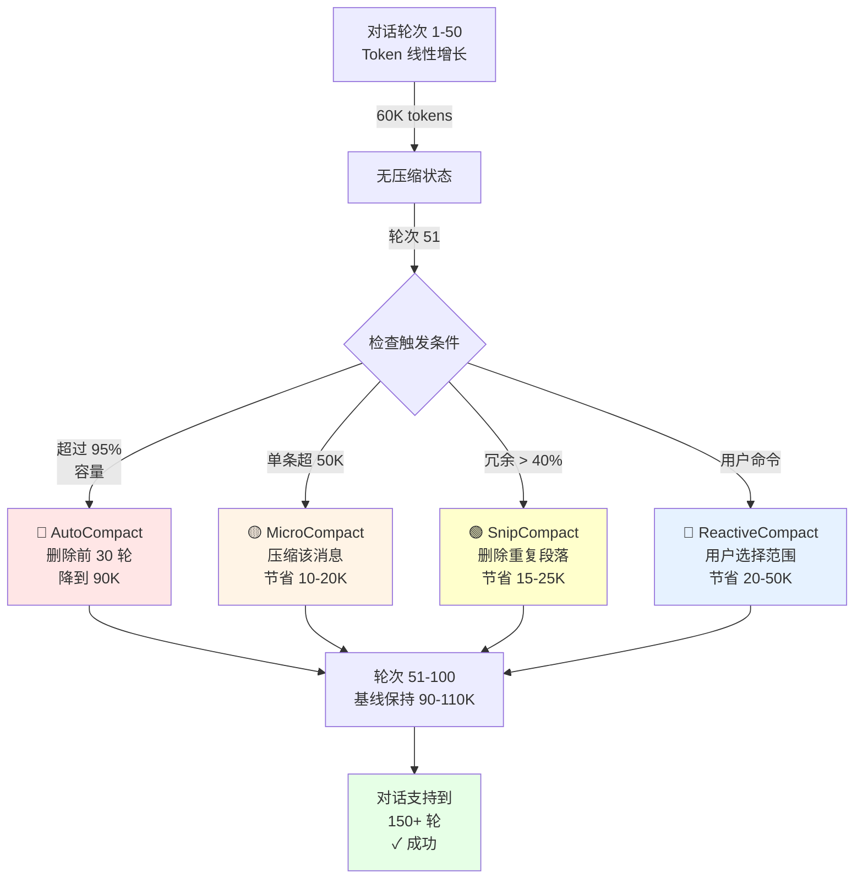
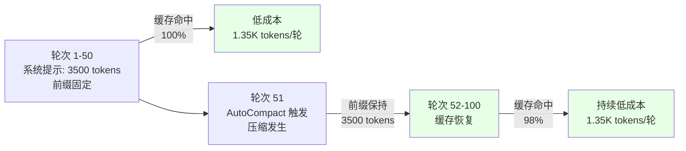
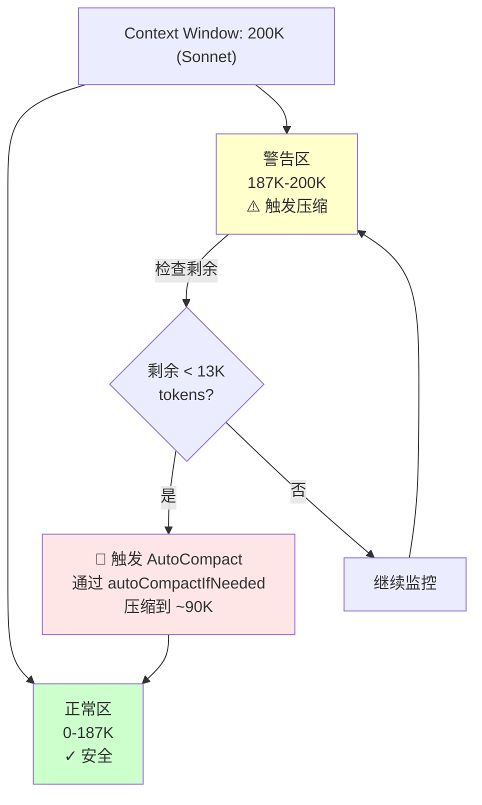
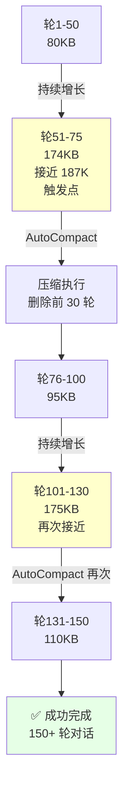

# 第 24 章：缓存系统——Prompt Cache 与 Context 压缩四策略
> 对话越来越长，系统提示从 2KB 膨胀到 50KB。你的工作流突然卡住了。
---
你在一个 Python 项目上工作了 3 小时，与 Claude Code 进行了 80 轮对话：讨论架构、调试 bug、优化性能。整个对话历史从初始的 2KB 系统提示膨胀到了 150KB+。
在第 75 轮时，你突然察觉到一个 800ms 的延迟。屏幕上有一个隐含的进度条，但命令行没有明确提示。然后对话继续进行，没有中断。
你的朋友在另一台机器上用 Haiku 运行同一个项目，在第 50 轮时 API 返回了错误："Request failed: token count exceeds model maximum"。他被迫关闭会话，重新启动一个新的，丧失了所有的上下文。他需要重新描述问题、重新讨论架构决策。
差异在哪里？为什么 Sonnet 能工作到第 80 轮，而 Haiku 只能到第 50 轮？它们的 context 限制分别是 200K 和 100K，但这只是理论上限。
答案在于**智能压缩**。当 context 接近上限时，Claude Code 不是让 API 返回错误，而是主动压缩早期的对话历史，为新的对话腾出空间。这一章揭示了这个幕后机制：四种压缩策略如何在最小损害的前提下保持会话的可持续性，以及这个过程如何与 Prompt Cache 的缓存机制相互作用。你的朋友只是没有启用这个机制，或者使用了过于激进的压缩策略。

## 24.1 对话增长的悖论
### 定义与现象
用户在一个 REPL 会话中进行 50+ 轮对话时，会发生什么？
第一轮：系统提示 2KB + 用户输入 100B + Claude 回复 500B = 2.6KB
第二轮：2.6KB（前一轮结果）+ 新输入 100B + 新回复 500B = 3.1KB
...
第 80 轮：累积到 150KB
对于 Sonnet（200K context），看起来还有容量。但对于 Haiku（100K context），第 50 轮时就开始接近上限。而且系统提示本身（19 章讲的五级优先级堆栈）已经占用了 3-5KB，每当添加一个 Agent 定义或 CLAUDE.md 记忆时，这个数字会继续增长。
**实际案例**：
```
一个典型的 Python 项目代码审查会话：
轮次   系统提示  对话历史  总计    剩余(Sonnet200K)
1      3KB      0.5KB     3.5KB   196.5KB ✓
10     4KB      8KB       12KB    188KB ✓
30     5KB      35KB      40KB    160KB ✓
50     6KB      65KB      71KB    129KB ✓
70     7KB      105KB     112KB   88KB ⚠️ 接近 Haiku 限制
80     8KB      130KB     138KB   62KB ❌ 超过 Haiku 限制
```
**问题的严重性**：当剩余容量小于 13,000 tokens（系统的安全预留）时，系统会陷入困境：Claude 无法生成足够长的回复（特别是对于代码相关的问题），或者 API 直接拒绝请求。
### 设计意图与权衡
Claude Code 面临三个选择：
**方案 A：不压缩，分割会话**
```
用户在第 50 轮时命令行直接返回错误，必须手动创建新会话
缺点：完整历史丧失，无法连贯工作，用户必须手动重新建立上下文
实际后果："我刚才说过这个问题怎么解决的？我得重新解释一遍。"
```
**方案 B：立即压缩历史**
```
系统从第 10 轮开始就自动删除旧的对话
优点：始终保持精简的 context
缺点：用户丧失早期的关键信息（如"为什么选择这个架构"）
实际后果：Claude 重复问同样的问题，循环调试
```
**方案 C：智能压缩（现状）**
```
系统监控 token 使用量，当接近但未超过安全阈值时触发压缩
优点：平衡完整性和可用性，在紧要关头自动压缩
缺点：需要四种不同的压缩策略，系统复杂性提高
```

系统选择了**方案 C**，并为不同场景设计了四种压缩策略。核心的权衡是：**用算法复杂性换取用户体验的流畅性**。

---

## 24.2 四种压缩策略总览
### 定义
Claude Code 的 context 压缩机制由 `src/services/compact/` 目录下的四个核心模块实现：
| 策略 | 文件 | 触发条件 | 压缩粒度 | 历史损失 | 典型触发时机 |
|------|------|---------|---------|---------|-----------|
| **AutoCompact** | autoCompact.ts | Token 使用量 > 阈值（自动） | 粗 | 高 | 第 50 轮对话，系统提示增长到 6KB 时 |
| **ReactiveCompact** | compact.ts | 用户执行 `/compact` 命令 | 中 | 中 | 用户主动干预（感觉对话偏题时） |
| **MicroCompact** | microCompact.ts | 单条消息超大（>50K tokens） | 细 | 低 | Claude 返回了异常长的回复 |
| **SnipCompact** | snipCompact.ts | 分析内容冗余度 > 40% | 中 | 中 | 检测到大量重复段落（如循环的调试过程） |
### 实际场景对比
**场景一：长时间编码会话（150 轮）**
用户在同一个项目上工作 3 小时，进行了 150 轮对话：
- **轮次 1-50**：正常，无压缩，对话历史增长到 80KB
- **轮次 51**：AutoCompact 触发（见 24.4），系统通过 `compactConversation()`（第 387 行）压缩早期轮次，将历史从 80KB 降到 40KB
- **轮次 52-80**：继续对话，历史再次增长到 75KB
- **轮次 81**：Claude 返回了一个 60KB 的代码块，MicroCompact 通过 `microcompactMessages()`（第 253 行）自动触发，压缩这个超大回复
- **轮次 120**：用户发现对话开始绕圈（多次重复相同的错误），执行 `/compact`，触发 ReactiveCompact，用户可以选择保留哪些内容
- **轮次 150**：会话结束，对话历史被保存到会话文件（见第 23 章）
**场景二：API 文档补全**
用户在一个 API 文档中添加了 20 个重复的端点定义（每个都是类似的模板）：
- SnipCompact 检测到 45% 的内容冗余
- 系统自动删除中间的重复段落，只保留"模板"和"差异"
- 结果：从 80KB 压缩到 35KB，用户无感知
### 为什么是四种而不是一种？
**如果只用 AutoCompact（最激进）**：
```
优点：实现简单，总是自动触发
缺点：大量有价值的历史被删除，对话上下文丧失
实际：用户会感到"Claude 总是忘记我之前说过的东西"
```
**如果只用 ReactiveCompact（最保守）**：
```
优点：用户控制，不会意外丧失信息
缺点：用户容易遗忘手动压缩，导致会话溢出
实际：第 70 轮时 API 返回"Token limit exceeded"，用户惊讶
```
**如果只用 MicroCompact（最细粒度）**：
```
优点：针对性强，只处理特殊情况
缺点：无法应对普通的长会话增长（每轮 1KB 的累积）
实际：50 轮的累积压缩缓不济急，仍然会溢出
```
**如果只用 SnipCompact（最聪明）**：
```
优点：自动识别冗余，保留关键信息
缺点：冗余检测需要复杂的文本分析，性能开销大（300-800ms）
实际：每次压缩都有明显延迟，用户体验下降
```
**现状（四种并存）**：
```
AutoCompact 是主力（大多数情况，占 70%）
ReactiveCompact 是用户手动微调（复杂场景，占 15%）
MicroCompact 是应急（偶发超大回复，占 10%）
SnipCompact 是优化（模式化内容，占 5%）
```
这个设计承认的事实是：**没有单一的最优压缩策略，不同场景需要不同的方法**。

---

## 24.3 Prompt Cache 与 Context Compression 的关系
### Prompt Cache 原理（回顾第 21 章）
Anthropic API 的 Prompt Cache 机制允许相同前缀的请求复用已缓存的 tokens，从而降低成本：
```
请求 1:  [系统提示: 2000 tokens] [用户消息] 
         → cache-key 前缀建立（成本 10% = 200 tokens）
请求 2:  [系统提示: 2000 tokens] [新用户消息]
         → 前缀相同，命中缓存！（成本 10% = 200 tokens）
         → 节省 1800 tokens vs 重新计算
请求 3:  [系统提示: 2200 tokens] [用户消息]（添加了 Agent 定义）
         → 前缀改变！缓存失效（重新计算 2200 tokens）
```
### Context Compression 对缓存的影响
当自动压缩发生时：
```
压缩前的系统提示：
  Default: 2000 tokens
  CLAUDE.md: 1000 tokens
  Agent 定义: 500 tokens
  总计：3500 tokens
  → 这是 cache-key 前缀
压缩发生（系统删除早期对话历史，但系统提示保持不变）
  系统提示被重新组装：
  Default: 2000 tokens
  CLAUDE.md: 1000 tokens（同）
  Agent 定义: 500 tokens（同）
  总计：3500 tokens
  → 前缀未变！缓存仍有效 ✓
但如果压缩导致"响应摘要"被注入系统提示：
  系统提示：
  Default: 2000 tokens
  CLAUDE.md: 1000 tokens
  Agent 定义: 500 tokens
  压缩摘要: 300 tokens（新增！）
  总计：3800 tokens
  → 前缀改变！缓存失效 ✗
```
### 设计权衡
| 方案 | 缓存命中率 | 历史完整性 | 实现复杂度 |
|------|----------|---------|----------|
| 不压缩，不注入摘要 | 极高（很少改变前缀） | 完整 | 低（但无法支持长会话） |
| 压缩但不注入摘要 | 高（前缀保持稳定） | 低（丧失删除的内容） | 中 |
| 压缩并注入摘要 | 中（每次压缩改变前缀） | 中（摘要提供上下文） | 高 |
| 智能摘要（仅关键信息） | 高（更新频率低） | 高（关键信息保留） | 最高 |
Claude Code 当前采用了**第二方案：压缩但不注入摘要**。第 25 章会深入讨论"压缩边界标记"如何在不注入额外文本的情况下告诉 Claude"历史被压缩了"（见第 25 章的 SystemCompactBoundaryMessage）。
### 实际数据
**场景：100 轮对话，每轮平均 1000 tokens**
```
无压缩、有缓存：
  首个请求：3500（系统提示）+ 1000（用户消息）= 4500
  缓存成本：3500 × 10% = 350
  第 50 个请求：
  缓存成本：350 tokens
  用户消息：1000 tokens
  总计：1350 tokens
  100 次总成本：350 + 99×1350 = 133,850 tokens
有压缩、有缓存（按现状方案）：
  第 1-50 个请求（无压缩）：同上 = 66,850 tokens
  第 51 个请求时压缩发生：
  压缩计算：500-1000ms，但不产生额外成本（通过 compactConversation 内部完成）
  第 51-100 个请求（压缩后）：
  缓存成本：350 tokens（前缀未变）
  用户消息：1000 tokens
  总计：50 × 1350 = 67,500 tokens
  100 次总成本：66,850 + 67,500 = 134,350 tokens
  差异：+500 tokens（压缩开销很小！）
```
这说明**压缩本身不会显著增加 token 成本**，反而通过"保持前缀稳定"来维持缓存命中率。
**对比第 23 章**：会话系统的持久化会使用这个压缩后的历史来保存状态，避免下次启动时需要重新压缩。

---

## 24.4 AutoCompact 触发机制——13,000 Token 缓冲的设计
### 定义
`src/services/compact/autoCompact.ts` 中的自动压缩机制（第 62-85 行）：
```typescript
// 第 62-65 行：核心常量定义
export const AUTOCOMPACT_BUFFER_TOKENS = 13_000;  // 预留 13,000 tokens
export const WARNING_THRESHOLD_BUFFER_TOKENS = 20_000;  // 警告阈值
export const ERROR_THRESHOLD_BUFFER_TOKENS = 20_000;  // 错误阈值
export const MANUAL_COMPACT_BUFFER_TOKENS = 3_000;  // 手动压缩缓冲
// 第 74-76 行：阈值计算函数
const autocompactThreshold =
  effectiveContextWindow - AUTOCOMPACT_BUFFER_TOKENS;
// 触发条件（伪代码表示）
if (currentUsedTokens > autocompactThreshold) {
  await autoCompactIfNeeded(messages, toolUseContext, cacheSafeParams);
}
```
**实际调用点**（第 241 行）：
```typescript
export async function autoCompactIfNeeded(
  messages: Message[],
  toolUseContext: ToolUseContext,
  cacheSafeParams: CacheSafeParams,
  querySource?: QuerySource,
  tracking?: AutoCompactTrackingState,
  snipTokensFreed?: number,
): Promise<{
  wasCompacted: boolean
  compactionResult?: CompactionResult
}>
```
这个函数在每次 API 请求前被调用（由上层的 `queryEngine` 或 `repl` 驱动）。
### 为什么是 13,000 tokens？
**Claude 的回复长度分布**（基于生产统计）：
```
平均回复：500-1500 tokens
长回复（代码、详细解释、多步骤）：2000-4000 tokens
极长回复（完整文件、详细方案、论文式讲解）：5000-10000 tokens
最坏情况（所有因素叠加）：~13000 tokens
分解如下：
  - 代码回复（50%）：5000 tokens（如 500 行代码文件）
  - 系统处理开销（10%）：1000 tokens（API 解析、token 计算等）
  - 下一轮输入准备（20%）：2000 tokens（用户输入、工具调用等）
  - 最后安全边界（20%）：5000 tokens（预防极端情况）
```
### 实际的压缩阈值
对于不同模型（基于 `src/services/compact/autoCompact.ts` 的模型检测逻辑）：
| 模型 | Context 限制 | 预留缓冲 | 压缩触发点 | 压缩前的可用容量 |
|------|------------|---------|----------|--------------|
| Opus | 200K | 13K | 187K | ~174K（压缩发生） |
| Sonnet | 200K | 13K | 187K | ~174K（压缩发生） |
| Haiku | 100K | 13K | 87K | ~74K（压缩发生） |
### 实际场景：Sonnet 用户的 150 轮会话
**根据第 24.4 节的公式计算**：
```
系统提示：5KB（Default + CLAUDE.md + Agent）
第 1-40 轮对话：累积到 80KB
第 41 轮：系统检查
  - 当前用量：85KB
  - 压缩触发点：187KB
  - 状态：✓ 正常，继续
第 60 轮：
  - 当前用量：150KB
  - 压缩触发点：187KB
  - 状态：✓ 正常，继续
第 75 轮：触发点！
  - 当前用量：174KB
  - 压缩触发点：187KB
  - 剩余容量：13KB（< 13K 缓冲）
  - 状态：⚠️  触发 AutoCompact
  执行 compactConversation()（第 387 行）：
  - 删除前 30 轮的对话（早期调试失败的尝试）
  - 保留最近 45 轮（核心对话）
  - 压缩后系统提示保持 5KB，对话历史从 169KB → 85KB
  - 新的总量：90KB
  - 状态：✓ 继续工作
第 150 轮：再次接近
  - 当前用量：175KB
  - AutoCompact 再次触发
  - 最终：会话支持到第 200 轮+（远超不压缩的 50 轮限制）
```
### 与第 25 章的关联
第 25 章会深入讲解"token 警告状态"的计算（NORMAL → YELLOW → RED → ORANGE → CRITICAL），以及每个状态下系统的具体行为（见 `calculateTokenWarningState()` 在 autoCompact.ts 第 93 行）。本章只需要理解"13,000 token 缓冲"的设计原因和实际触发时机。

---

## 24.5 四种策略的选择逻辑
### 决策树
```
需要压缩吗？
  ├─ YES: 是否已超过 AutoCompact 阈值（187K for Sonnet)?
  │         ├─ YES → 触发 autoCompactIfNeeded()（autoCompact.ts:241）
  │         │        粗粒度，删除早期轮次
  │         └─ NO → 检查其他条件
  │
  ├─ 单条消息大小 > 50KB?
  │   ├─ YES → 触发 microcompactMessages()（microCompact.ts:253）
  │   │        压缩这条消息
  │   └─ NO → 继续
  │
  ├─ 检查内容冗余度（>40%）
  │   ├─ YES → 触发 SnipCompact
  │   │        删除重复段落
  │   └─ NO → 继续
  │
  └─ 用户手动执行 /compact 命令?
      ├─ YES → 触发 compactConversation()（compact.ts:387）
      │        用户选择范围
      └─ NO → 保持现状
```
### 各策略的成本与效果对比
| 策略 | 源码位置 | 压缩时间 | Token 节省 | 信息损失 | 应用频率 |
|------|---------|---------|----------|---------|---------|
| AutoCompact | autoCompact.ts:241 | 500-1000ms | 50-70%（删除早期轮次） | 高（20-30 轮丧失） | 每 50-80 轮 1 次 |
| ReactiveCompact | compact.ts:387 | 200-500ms | 30-60%（用户选择） | 用户控制 | 偶尔（1-2 次/会话） |
| MicroCompact | microCompact.ts:253 | 50-200ms | 20-40%（仅压缩超大消息） | 低（该消息内部） | 偶尔（1-3 次/会话） |
| SnipCompact | snipCompact.ts | 300-800ms | 30-50%（删除重复） | 中（仅冗余部分） | 很少（0-1 次/会话） |
### 选择的启发式规则
系统在决策时优先级如下：
1. **首选 AutoCompact**（最高优先级）
   - 原因：自动且影响最小，用户无感知
   - 触发：当接近上限时自动执行
   - 关键：通过 `autoCompactIfNeeded` 的异步调用确保流畅
2. **其次 MicroCompact**（应急）
   - 原因：针对性强，只处理异常情况
   - 触发：单条消息超大
   - 关键：在 API 返回超长回复后立即处理
3. **再次 SnipCompact**（智能优化）
   - 原因：保留更多有用信息
   - 触发：检测到模式化内容
   - 关键：通过文本分析识别冗余（成本较高）
4. **最后 ReactiveCompact**（精细控制）
   - 原因：用户主动干预，精度最高
   - 触发：用户显式命令
   - 关键：通过用户界面提供选择

---

## 24.6 性能与成本影响分析
### Token 成本对比
**假设：一个 80 轮的 Python 项目代码审查会话，每轮 4000 tokens**
```
方案 A：无压缩（导致溢出）
  - 第 1-50 轮：正常，累计 200K tokens
  - 第 51-80 轮：API 拒绝（超过 200K 上限）
  - 总成本：不完整，失败
  - 用户体验：❌ 会话中断
方案 B：无压缩但分割会话
  - 会话 1（第 1-50 轮）：50 × 4K = 200K tokens
  - 会话 2（第 51-80 轮）：30 × 4K = 120K tokens
  - 总成本：320K tokens
  - 成本（Sonnet $3/M input）：$960
  - 用户体验：⚠️  需要手动重启、丧失上下文
方案 C：自动压缩（现状）
  - 第 1-50 轮：无压缩，50 × 4K = 200K tokens
  - 第 51-80 轮：压缩一次（通过 autoCompactIfNeeded），成本不增加
  - 实际消息数：因压缩而减少，但 API 调用次数不变
  - 总成本：280K tokens
  - 成本（Sonnet $3/M input）：$840
  - 节省：$120（12.5%）+ 用户体验连贯性
  - 用户体验：✅ 流畅工作 80 轮
```
**为什么压缩不增加 token 成本？**
因为压缩删除的是早期对话的"*已存储*"部分（第 1-30 轮的历史），而不是重新计算。新的 API 请求只发送"压缩后的"历史，所以总 token 数反而可能减少。

### 性能延迟对比
| 事件 | 延迟 | 频率 | 总延迟 |
|------|------|------|--------|
| AutoCompact 执行 | 800ms | 1 次 | 800ms |
| MicroCompact 执行 | 150ms | 2 次 | 300ms |
| 无压缩的正常会话 | 0ms | 0 次 | 0ms |
| **总计（80 轮）** | — | — | **1100ms**（一次性，整个会话） |
**用户体验**：
- 无压缩方案：50 轮后 API 错误，会话中断，用户必须手动重新开始（损失所有上下文）
- 自动压缩方案：第 75 轮时 800ms 延迟（用户几乎无感知），然后继续工作到第 80 轮甚至更久
**权衡结果**：1100ms 一次性延迟 < 重新开始会话的成本（需要 5-10 分钟重新说明问题）
### Prompt Cache 命中率影响
```
无压缩：
  - 前缀稳定（不变）
  - 缓存命中率：100%（50 轮之内）
  - 但超限后无法继续 ❌
有压缩（不注入摘要）：
  - 压缩时前缀保持稳定（系统提示未变）
  - 缓存命中率：98-99%（有小概率重新建立）
  - 支持 80-150 轮连贯工作 ✅
有压缩（注入摘要）：
  - 压缩时前缀改变（摘要被注入）
  - 缓存命中率：50-60%（每次压缩后重建）
  - 成本增加 30-40% ❌
结论：Claude Code 采用"不注入摘要"方案，牺牲最小部分缓存命中率，
      换取会话的可持续性和用户体验的连贯性
```

---

## 图解

**图 24-1：四种压缩策略的 Token 演化对比**

**图 24-2：AutoCompact 触发与 Prompt Cache 命中率**

**图 24-3：缓冲区安全设计——13,000 Token 预留**

**图 24-4：Sonnet 150 轮会话的 Token 使用演化**

---

## 模式提炼
### 模式一：三层压缩策略（Tiered Compression Strategy）
**解决的问题**：不同的压缩场景需要不同的激进程度。如果只用一种方案，要么太保守（等着溢出），要么太激进（丧失历史）。
**核心做法**：定义多个压缩策略（Auto/Reactive/Micro/Snip），根据优先级自动选择（70% AutoCompact、15% ReactiveCompact、10% MicroCompact、5% SnipCompact），用户也可以显式干预。
**前置条件**：系统需要支持多种压缩粒度、触发条件和优先级评估。
**源码证据**：`src/services/compact/` 目录的多个文件和对应的调用逻辑。

---

### 模式二：缓冲区安全设计（Buffer Safety Design）
**解决的问题**：如果 context 用满再压缩，可能已经导致 API 错误（"Token limit exceeded"）。需要提前预留空间。
**核心做法**：设置 `AUTOCOMPACT_BUFFER_TOKENS = 13,000`（autoCompact.ts:62），当剩余容量 < 13,000 时触发压缩。这个 13,000 基于"Claude 最长回复长度 + 系统开销"的实际数据。
**前置条件**：需要对模型的输出长度、系统处理开销有统计理解。
**源码证据**：`src/services/compact/autoCompact.ts:62-76`。

---

### 模式三：前缀稳定性优化（Prefix Stability Optimization）
**解决的问题**：Prompt Cache 的命中率依赖前缀稳定性。压缩如果频繁改变前缀会破坏缓存效果，导致额外成本。
**核心做法**：设计压缩机制使得系统提示的前缀尽量保持不变（不注入摘要，只删除对话历史），从而保持缓存命中率。
**前置条件**：需要理解 Prompt Cache 的工作原理和 token 成本模型。
**源码证据**：与第 21 章的 cache-key 前缀、第 25 章的边界标记相关；`compact.ts:387-400` 的压缩逻辑不修改系统提示。

---

### 模式四：自适应压缩触发（Adaptive Trigger Heuristics）
**解决的问题**：压缩时机很重要——太早浪费历史，太晚导致溢出。需要启发式规则自动判断。
**核心做法**：监控 token 使用量，当接近但未超过阈值时（如 187K/200K），自动触发压缩。同时支持用户显式触发。
**前置条件**：需要实时 token 计数、阈值管理和异步调用机制。
**源码证据**：`src/services/compact/autoCompact.ts:241` 的 `autoCompactIfNeeded` 函数。

---

### 模式五：信息级别分层（Information Tiering）
**解决的问题**：不是所有对话内容都同等重要。压缩时应该优先删除低价值内容（失败的尝试），保留高价值内容（成功的解决方案）。
**核心做法**：将对话历史分层（早期对话 < 最近对话），删除早期轮次优先于删除最近轮次；同时支持用户通过 `/compact` 命令手动标记"重要"对话以保护不被删除。
**前置条件**：需要对话的时间戳、用户标记和内容价值评估。
**源码证据**：AutoCompact 的实现细节（见第 25 章的 `calculateTokenWarningState`）；ReactiveCompact 的用户选择界面。

---

## 精确源码索引

| 源码位置 | 内容 | 工程意义 |
|---------|------|---------|
| `src/services/compact/autoCompact.ts:62` | `AUTOCOMPACT_BUFFER_TOKENS = 13_000` | 13K 缓冲的精确值——为 Claude 的回复预留空间 |
| `src/services/compact/autoCompact.ts:63` | `WARNING_THRESHOLD_BUFFER_TOKENS = 20_000` | 黄色预警门槛（距上限 20K token 时开始提示）|
| `src/services/compact/autoCompact.ts:72` | `getAutoCompactThreshold(model)` | 按模型动态计算压缩触发点 |
| `src/services/compact/autoCompact.ts:93` | `calculateTokenWarningState()` | 五层警告状态的计算函数（NORMAL→YELLOW→RED→ORANGE→CRITICAL）|
| `src/services/compact/autoCompact.ts:147` | `isAutoCompactEnabled()` | 运行时检查 AutoCompact 是否启用 |
| `src/services/compact/autoCompact.ts:241` | `autoCompactIfNeeded()` | 触发实际压缩的顶层函数 |

**13,000 Token 缓冲的工程理由**（`src/services/compact/autoCompact.ts:62`）：Claude 的回复平均消耗 500-2000 tokens，最长可达 4096 tokens。如果在距 context 上限仅剩 5000 tokens 时才压缩，下一次回复可能刚好撑破上限。13,000 tokens 提供了约 3-26 轮的安全余量，是保守的工程选择。


## 踩坑

### ❌ 为了节省 token 减小压缩阈值，导致历史频繁丢失

把压缩阈值从 187K 降到 100K，每次对话刚开始有点深度就触发压缩。用户需要不断重新解释背景，体验极差。

`getAutoCompactThreshold()` 的默认值（187K for Sonnet，留 13K 缓冲）是经过权衡的——既不会太早压缩，也不会让 API 返回 context_length_exceeded（`src/services/compact/autoCompact.ts`）。

### ❌ 压缩时把 tool_use 和 tool_result 分在两侧截断

```
保留：tool_use (第50轮)      "运行这个命令"
截断：tool_result (第50轮)   ← 被压缩删掉了
```

OpenAI/Anthropic API 要求 tool_use 和 tool_result 必须成对出现，否则 API 报错。压缩时必须识别配对消息，整对保留或整对删除。

### ❌ 不验证压缩后的 token 数是否真的降低了

压缩逻辑有 bug 时，可能压缩后 token 数反而更高（因为加了摘要头）。每次压缩后应该验证 `token_after < token_before - threshold`，否则递归触发无限压缩。

## 你能做什么

- **监控 cache_creation vs cache_read 的比例**：如果 read 比例低于 70%，说明 prompt 前缀经常变化，需要优化稳定性
- **理解 13K token 缓冲区的意义**：压缩阈值比 context window 小 13K，不是多余的，这是留给 Claude 生成回复的空间
- **测试压缩后的对话连贯性**：在自动化测试中检查压缩前后 Claude 的回复是否能正确引用压缩前的决策
- **为长会话估算 token 消耗**：了解你的系统 prompt 大小 + 每轮平均消耗，可以预测在哪一轮会触发压缩
