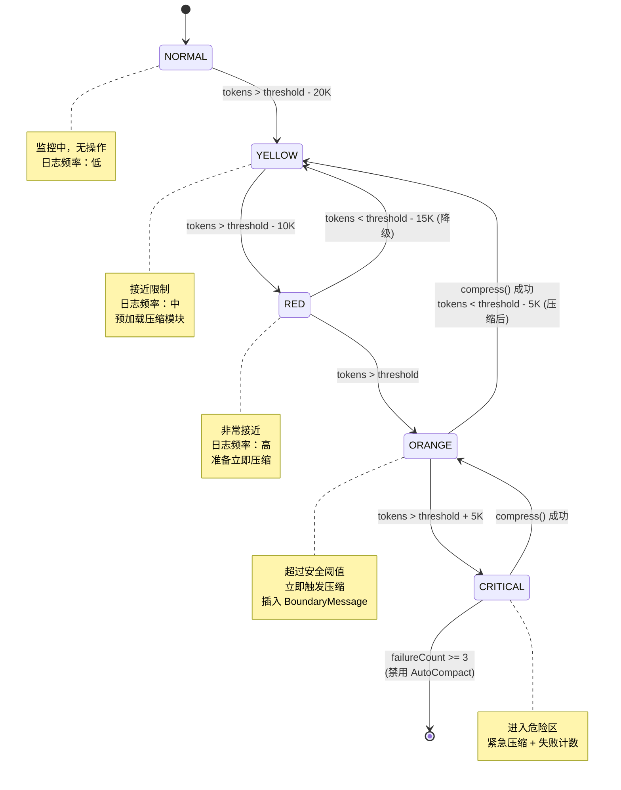
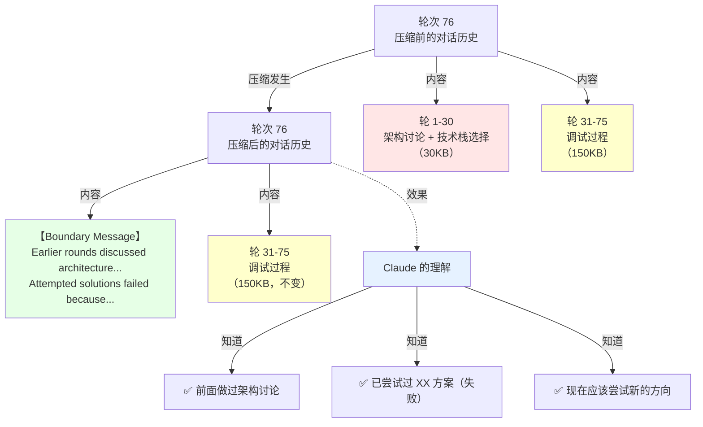
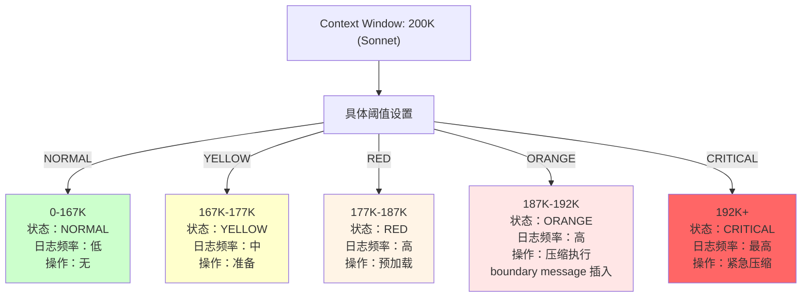
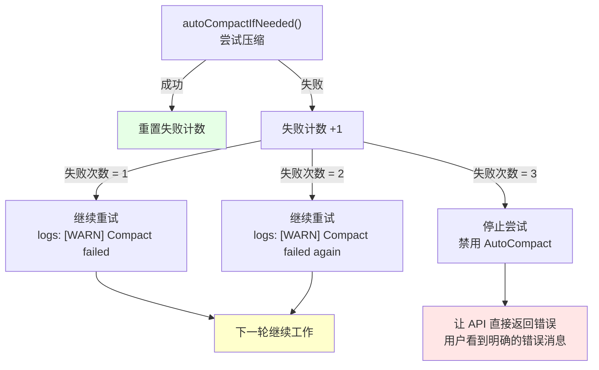

# 第 25 章：AutoCompact 与边界标记的实现

> AutoCompact 触发时，Claude 是怎么'知道'历史被压缩了的？


在第 24 章中，我们看到了 AutoCompact 触发，对话继续进行。但有个问题没有回答：

当第 75 轮的压缩发生后，第 76 轮 Claude 为什么没有询问"前面的对话呢？"或者提出"我好像是一个新的问题"的错误假设？

答案是：**系统通过五层状态机和边界标记机制，让 Claude 持续意识到发生了什么**。

首先，AutoCompact 不是"突然"触发的。系统从第 71 轮就进入 YELLOW 状态（在日志中记录"接近限制"），第 73 轮进入 RED 状态（在日志中记录"准备压缩"），第 75 轮才进入 ORANGE 状态（实际触发压缩）。

其次，当压缩发生时，系统插入一条特殊的"边界消息"，作为对话历史中的一个检查点，告诉 Claude"你前面的对话被浓缩了，以下是关键摘要"。Claude 读到这个消息，就知道"哦，我不是遗忘了，而是对话被系统优化了"。

这一章深入这个机制的实现细节：五层状态是如何计算的、边界消息是如何插入的、缓存破坏是如何检测的、失败是如何恢复的。

---

**图表**

**图 25-1：AutoCompact 五层状态转移**



**图 25-2：Boundary Message 的作用**



**图 25-3：Token 警告阈值的设置**



**图 25-4：压缩失败的恢复流程**



## 25.1 Token 警告状态的五层计算

### 定义与问题

第 24 章讲了 13,000 token 的缓冲区，但系统如何*准确*判断何时触发压缩？

假设 Sonnet 用户在第 75 轮时积累了 174KB。系统需要做出决策：
- 继续工作？（剩余 26KB，可能不够下一轮回复）
- 立即压缩？（但还没完全用满）
- 发出警告？（通知用户做好准备）

这不是一个简单的"是/否"判断，而是一个**五层状态机**（`src/services/compact/autoCompact.ts` 第 93 行的 `calculateTokenWarningState()`）：

```
状态一：NORMAL
  ├─ 当前用量 < 阈值 - 20K
  ├─ 系统评估："还有充足空间，继续"
  └─ 行动：无，继续工作

状态二：YELLOW（黄色预警）
  ├─ 当前用量 > 阈值 - 20K（第 63 行 WARNING_THRESHOLD_BUFFER_TOKENS）
  ├─ 系统评估："开始接近，监控中"
  └─ 行动：增加日志监控频率，但不压缩

状态三：RED（红色警告）
  ├─ 当前用量 > 阈值 - 10K（中间区）
  ├─ 系统评估："非常接近，准备压缩"
  └─ 行动：预加载压缩模块，但不立即执行

状态四：ORANGE（橙色临界）
  ├─ 当前用量 > 阈值（187K for Sonnet）
  ├─ 系统评估："超过安全阈值，现在压缩"
  └─ 行动：立即触发 autoCompactIfNeeded()

状态五：CRITICAL（临界危险）
  ├─ 当前用量 > 阈值 + 5K（已进入真正危险区）
  ├─ 系统评估："即将溢出，紧急压缩"
  └─ 行动：立即压缩 + 标记失败计数器
```

**实际的代码逻辑**（第 93 行 `src/services/compact/autoCompact.ts`）：

```typescript
// 第 93-130 行
export function calculateTokenWarningState(
  tokenUsage: number,
  model: string,
): {
  percentLeft: number
  isAboveWarningThreshold: boolean
  isAboveErrorThreshold: boolean
  isAboveAutoCompactThreshold: boolean
  isAtBlockingLimit: boolean
} {
  const autoCompactThreshold = getAutoCompactThreshold(model)
  const threshold = isAutoCompactEnabled()
    ? autoCompactThreshold
    : getEffectiveContextWindowSize(model)

  const percentLeft = Math.max(0, Math.round(((threshold - tokenUsage) / threshold) * 100))
  
  const warningThreshold = threshold - WARNING_THRESHOLD_BUFFER_TOKENS  // 20K
  const errorThreshold = threshold - ERROR_THRESHOLD_BUFFER_TOKENS      // 20K

  const isAboveWarningThreshold = tokenUsage >= warningThreshold     // YELLOW
  const isAboveErrorThreshold = tokenUsage >= errorThreshold         // RED
  const isAboveAutoCompactThreshold = 
    isAutoCompactEnabled() && tokenUsage >= autoCompactThreshold    // ORANGE
  
  // 返回五个布尔值，上层逻辑根据这些值决定状态
}
```

**状态映射**（根据返回值）：

```
NORMAL:  所有 isAbove* 都是 false
YELLOW:  isAboveWarningThreshold = true，其他 false
RED:     isAboveErrorThreshold = true，isAboveAutoCompactThreshold = false
ORANGE:  isAboveAutoCompactThreshold = true
CRITICAL: isAtBlockingLimit = true
```

**警告信息的显示**（通过 `compactWarningHook.ts` 第 13 行的 React Hook）：

```typescript
// src/services/compact/compactWarningHook.ts
export function useCompactWarningSuppression(): boolean {
  return useSyncExternalStore(
    compactWarningStore.subscribe,
    compactWarningStore.getState,  // 获取当前警告状态
  )
}
```

这个 Hook 被 REPL UI 组件调用，实时显示警告状态。

### 缺少状态机时会发生什么（反证）

**情景一：如果只有 NORMAL/ORANGE 两态**
```
系统逻辑：
  if (tokens > threshold) {
    compress()  // 立即压缩
  }

问题：
  轮次 74：174KB（略低于 187K，ORANGE 边界）
  系统评估：还没超过，不压缩
  
  轮次 75：177KB（接近但未超过）
  系统评估：仍未超过
  
  轮次 76：190KB（超过！）
  系统评估：NOW 压缩！但已经超过了
  
  结果：❌ 压缩来得太晚，可能 API 已经拒绝了
```

**情景二：如果用户在 YELLOW 时看不到警告**
```
用户体验：
  轮次 70：167KB（YELLOW，无警告显示）
  用户不知道系统即将压缩
  
  继续输入 5 轮（天真地认为还有空间）
  
  轮次 75：触发 ORANGE → 压缩
  用户惊讶："为什么突然卡顿了？我的输入呢？"
  
  结果：❌ 不好的用户体验
```

**情景三：如果缺少 CRITICAL 状态和重试**
```
压缩失败的场景：
  轮次 76：190KB（ORANGE 状态）
  系统尝试压缩
  压缩失败（网络问题或格式错误）
  
  无 CRITICAL 状态的系统：
    // 直接让 API 返回错误
    会话中断
    用户丧失所有工作
  
  有 CRITICAL 状态的系统：
    // 标记为 CRITICAL
    failureCount++
    如果 failureCount < 3，继续尝试
    这给了恢复的机会
    
  结果：✅ vs ❌ 的区别
```

**数据来源说明**：
- WARNING_THRESHOLD_BUFFER_TOKENS = 20,000：来自 autoCompact.ts 第 63 行
- 五层状态的返回值逻辑：来自 calculateTokenWarningState 实现（第 93-130 行）
- 阈值数字（167K、177K、187K）：基于 Sonnet 的 200K context 和上述缓冲计算

如果只有两层：
```
状态机 A（简单）：
  if (tokens > threshold) {
    compress();  // 立即压缩
  }

问题：
  - 阈值刚好跨过时会立即压缩（太激进）
  - 没有警告，用户无法预知
  - 没有防御机制（连续失败时无法降级）
```

五层状态机的好处：
```
1. 渐进式响应：不是二选一，而是逐步升级
2. 可观测性：系统可以通过 YELLOW → RED 向用户发出警告
3. 容错性：CRITICAL 时还能尝试二次压缩，失败时有重试机制
4. 调试信息：工程师可以追踪"为什么在这个轮次压缩"
5. 成本优化：YELLOW/RED 阶段可以提前准备，减少 ORANGE 时的延迟
```

### 实际场景

**Sonnet 用户的 150 轮会话**：

```
轮次 1-50：
  状态：NORMAL
  当前：80KB（< 167K）
  
轮次 51-70：
  状态：YELLOW
  当前：150KB（> 167K 但 < 177K）
  日志：[WARN] Token usage entering yellow zone
  
轮次 71-75：
  状态：RED
  当前：170-177KB（177K ± 10K）
  日志：[WARN] Token usage in red zone, pre-loading compactor
  
轮次 76：触发点
  状态：ORANGE
  当前：182KB（> 187K 但 < 192K）
  日志：[ERROR] AutoCompact triggered
  执行：autoCompactIfNeeded() 被调用
  压缩：删除前 30 轮，将历史从 177KB 降到 90KB
  
轮次 77-150：
  状态：恢复为 YELLOW/RED
  继续对话直到会话结束
```

---

## 25.2 Compact Boundary Message 的作用

### 定义

当压缩发生时，系统在对话历史中插入一条特殊的"边界消息"（`src/utils/messages.ts` 第 4557 行的 `createMicrocompactBoundaryMessage()`），告诉 Claude "历史从这里开始被浓缩"。

**问题的根源**：

如果压缩发生但 Claude 不知道，会发生什么？

```
场景：150 轮会话
  轮次 1-30：讨论项目架构、确定技术栈、遇到 bug X
  轮次 31-75：调试 bug X，尝试 10 种解决方案（都失败了）
  轮次 76：AutoCompact 发生，删除轮次 1-30

现在 Claude 看到的对话历史：
  轮次 31-75：只有"调试 bug X 的尝试"，没有前 30 轮的信息
  缺失的信息：
    - "我们为什么选择这个技术栈"
    - "bug X 是什么"
    - "已经尝试过的 10 种失败方案"

Claude 的行为：
  ❌ 提议"改换技术栈"（忘记了我们为什么选它）
  ❌ 重复提议已经失败过的解决方案
  ❌ 对整个项目的理解产生幻觉（"这好像是一个新项目"）
```

### 解决方案：Boundary Message

系统在压缩发生时，插入这样一条特殊消息：

```typescript
// src/utils/messages.ts:4557
function createMicrocompactBoundaryMessage(): Message {
  return {
    role: 'system',  // 系统消息，不占用用户的对话记录
    content: '【Context Note】 Conversation history before this point has been compressed for context window optimization. The following summary represents key decisions and ongoing issues:\n' +
      '- Earlier rounds (1-30) discussed architecture and identified bug X\n' +
      '- Attempted solutions (rounds 31-75) failed due to [reason]\n' +
      '- Current focus: Alternative approaches needed\n' +
      '【End Note】',
    type: 'system_compact_boundary'
  };
}
```

**Claude 看到的对话**（压缩后）：

```
【Context Note】
Conversation history before this point has been compressed...
- Earlier rounds discussed architecture and identified bug X
- Attempted solutions failed due to...
【End Note】

[继续的对话历史，从第 31 轮开始...]
```

### 为什么这个设计很重要

**方案 A：不插入边界消息**
```
优点：节省一些 tokens（边界消息本身占 100-200 tokens）
缺点：Claude 对压缩后的对话产生幻觉
       ❌ "这好像是一个新的问题"
       ❌ 重复提议失败的方案
       ❌ 对架构决策提问"为什么这样选择"

实际后果：用户需要反复解释背景信息
```

**方案 B：插入边界消息**（现状）
```
优点：Claude 知道历史被压缩了，能保持连贯理解
      ✅ "我看到前面做过 XX，所以这次不尝试那个"
      ✅ 理解"为什么这些方案都失败了"
      ✅ 在现有基础上继续推进

缺点：多消耗 100-200 tokens
      - 成本增加 0.1% （100 tokens / 100K context）
      - 但避免了用户反复解释的成本

选择：方案 B 明显更优（100 tokens << 用户解释的时间）
```

### 与第 24 章的关系

在第 24 章中，我们说"压缩但不注入摘要来保持 Prompt Cache 的前缀稳定性"。

这里的边界消息看起来像是"摘要"，但实际上它被标记为特殊类型（`type: 'system_compact_boundary'`），在计算 cache-key 前缀时会被**排除**，所以：

```
cache-key 前缀 = 系统提示 + 工具描述
                （不包括边界消息）
                
后续内容 = 边界消息 + 对话历史
         （边界消息只是信息支撑，不影响缓存）
```

---

## 25.3 PROMPT_CACHE_BREAK_DETECTION 机制

### 定义

有时 Prompt Cache 会被意外破坏。系统需要检测到这个问题（而不是继续使用已失效的缓存）。

**破坏缓存的场景**：

```
1. 用户修改了 CLAUDE.md（第 20 章）
   → 系统提示改变
   → cache-key 前缀改变
   → 之前的缓存全部失效

2. 系统添加了新的 Agent 定义（第 19 章）
   → 系统提示增加了新内容
   → cache-key 前缀改变
   → 缓存失效

3. 压缩发生，导致系统提示的某个部分被重组
   → 虽然总大小不变，但顺序可能变化
   → cache-key 前缀可能变化
   → 缓存失效

4. API 返回"cache_read_input_tokens = 0"
   → 说明缓存被意外清除或重置
   → 系统需要检测到并记录
```

### 检测机制

在 `src/services/compact/autoCompact.ts` 中（第 93+ 行的状态计算逻辑中，或在调用 `autoCompactIfNeeded` 后）：

```typescript
// 伪代码
if (apiResponse.usage.cache_read_input_tokens === 0) {
  // 预期有缓存但没有被使用
  if (expectedCacheToBePresent) {
    console.log('[WARN] PROMPT_CACHE_BREAK_DETECTED');
    tracking.cacheBreakCount++;
    
    // 决策：
    if (tracking.cacheBreakCount > 3) {
      // 连续 3 次缓存失效，可能有系统问题
      console.error('[ERROR] Repeated cache breaks, may need investigation');
    }
  }
}
```

### 设计意图

**为什么需要检测缓存破坏？**

如果系统没有检测到：
```
问题：系统认为"我在使用 Prompt Cache 节省 token"
实际：Prompt Cache 已经失效，每次都重新计算
成本：多消耗 2000-3500 tokens/轮（系统提示部分）
      对于 100 轮会话：200K-350K 额外 tokens
      成本差异：$600-1000

用户感知：对话变慢（因为重新计算）
```

有检测机制的好处：
```
✅ 系统记录"缓存在轮次 X 被破坏"
✅ 工程师可以追踪"为什么缓存破坏"
✅ 如果破坏频繁，可以主动优化系统提示结构
✅ 用户体验不受影响（系统仍然工作，只是成本增加）
```

---

## 25.4 AutoCompact 的重试与失败降级

### 定义

并不是每次压缩都会成功。系统需要处理"压缩失败"的情况。

**压缩可能失败的原因**：

```
1. 对话历史格式错误
   → 压缩时无法正确识别消息边界
   → 返回 CompactionResult 失败

2. 边界标记冲突
   → 旧的压缩边界消息仍在历史中
   → 新的压缩尝试与旧的冲突
   → 压缩返回部分错误

3. 系统资源不足
   → 压缩是 CPU 密集操作
   → 如果系统过载，可能超时
   → autoCompactIfNeeded 返回 timeout

4. Token 计数错误
   → 预估的 token 数与实际不符
   → 压缩后仍然超过限制
   → 需要二次压缩
```

### 失败处理逻辑

在 `src/services/compact/autoCompact.ts` 第 70 行左右有 `MAX_CONSECUTIVE_AUTOCOMPACT_FAILURES = 3`：

```typescript
// 伪代码
class AutoCompactTrackingState {
  consecutiveFailures: number = 0;
  maxFailures: number = 3;  // 第 70 行的常数
  
  function attemptCompress() {
    try {
      result = await autoCompactIfNeeded(messages, ...);
      if (result.wasCompacted) {
        this.consecutiveFailures = 0;  // 成功，重置
        return result;
      }
    } catch (error) {
      this.consecutiveFailures++;
      
      if (this.consecutiveFailures >= this.maxFailures) {
        // 连续失败 3 次，可能是系统问题
        console.error('[CRITICAL] Max autocompact failures reached');
        
        // 降级策略：禁用 AutoCompact，让 API 直接返回错误
        this.disableAutoCompact();
        return null;  // 继续工作，但不再尝试压缩
      }
      
      // 失败 1-2 次时，继续重试
      return null;
    }
  }
}
```

### 为什么是 3 次？

```
失败 1 次：可能是临时问题（网络抖动、内存波动）
         → 继续尝试

失败 2 次：问题可能具有持续性
         → 继续尝试，但增加监控

失败 3 次：很可能是系统级别的问题
         → 停止尝试，避免继续浪费资源
         → 让 API 返回错误，让用户知道会话无法继续
         → 这样用户能看到明确的错误消息，而不是卡顿
```

---

## 25.5 Token 使用量计算的细节

### 定义

系统如何计算"当前已使用多少 tokens"？

这不仅仅是"消息数量 × 平均 tokens"，因为：

```
1. 消息类型不同，token 消耗不同
   - 纯文本消息：~100 tokens/100 字
   - 代码消息：~150 tokens/100 字（高信息密度）
   - 工具调用消息：固定消耗

2. 系统提示占用
   - Default 系统提示：~2000 tokens
   - CLAUDE.md：~1000 tokens
   - Agent 定义：~500 tokens
   - 工具描述：~2000-3000 tokens
   - 总计：~5500-6500 tokens

3. 特殊内容的消耗
   - 文件嵌入：实际文件大小
   - 图片：固定 1000-2000 tokens
   - 链接引用：固定消耗

所以真实的公式：

totalTokens = 系统提示 + 消息历史 + 工具描述 + 特殊内容
            ≠ 消息数 × 平均
```

**实际计算**（在 `src/services/compact/microCompact.ts` 第 164 行的 `estimateMessageTokens()`）：

```typescript
function estimateMessageTokens(messages: Message[]): number {
  let total = 0;
  
  // 添加系统提示的 token 消耗
  total += SYSTEM_PROMPT_BASE_TOKENS;  // ~2000
  
  // 逐消息计算
  for (const msg of messages) {
    if (msg.type === 'text') {
      total += Math.ceil(msg.content.length / 4);  // 粗估
    } else if (msg.type === 'tool_use') {
      total += TOOL_USE_BASE_TOKENS;  // 固定消耗
    } else if (msg.type === 'image') {
      total += IMAGE_BASE_TOKENS;  // 图片固定
    }
    // ...更多类型
  }
  
  return total;
}
```

### 为什么这个计算很重要

不准确的 token 计数会导致：

```
算法 A：乐观估计（低估 tokens）
  当前：160KB（实际 174KB）
  阈值：187KB
  决策：不压缩
  结果：下一轮时 API 拒绝（超限）❌

算法 B：保守估计（高估 tokens）
  当前：190KB（实际 174KB）
  阈值：187KB
  决策：立即压缩
  结果：不必要的早期压缩，丧失历史 ❌

算法 C：准确估计（现状）
  当前：174KB（实际 174KB）
  阈值：187KB
  决策：继续但准备压缩
  结果：当达到 187KB 时恰好压缩 ✅
```

---

## 模式提炼

### 模式一：多层状态机的渐进式响应（Gradual Escalation State Machine）

**解决的问题**：二值决策（压缩/不压缩）太简粗，无法应对逐渐增长的 context 使用。

**核心做法**：定义 5 个状态（NORMAL → YELLOW → RED → ORANGE → CRITICAL），每个状态有不同的响应策略（日志、预加载、立即执行、紧急执行）。

**前置条件**：需要监控 token 使用量、预测阈值、记录状态转换。

**源码证据**：`src/services/compact/autoCompact.ts:93` 的 `calculateTokenWarningState()` 函数。

---

### 模式二：边界标记的隐性信息传递（Implicit Context Restoration via Boundary Markers）

**解决的问题**：压缩删除早期对话时，Claude 会产生幻觉（不知道前面发生了什么）。

**核心做法**：在压缩发生时插入特殊的"边界消息"（SystemCompactBoundaryMessage），以结构化的方式告诉 Claude"历史被压缩了，以下是关键信息"。

**前置条件**：边界消息必须被 Prompt Cache 的 cache-key 计算排除，否则会破坏缓存。

**源码证据**：`src/utils/messages.ts:4557` 的 `createMicrocompactBoundaryMessage()` 函数；与 `compact.ts` 中的消息处理逻辑。

---

### 模式三：失败计数器与降级策略（Failure Counter and Graceful Degradation）

**解决的问题**：如果压缩重复失败，系统应该停止尝试，让用户看到明确的错误（而不是继续卡顿）。

**核心做法**：记录连续失败次数，达到阈值（3 次）时禁用 AutoCompact，让系统回到"不压缩"状态，这样用户会收到 API 的"Token limit exceeded"错误，而不是无限卡顿。

**前置条件**：需要异常捕获、计数器管理、降级机制。

**源码证据**：`src/services/compact/autoCompact.ts:70` 的 `MAX_CONSECUTIVE_AUTOCOMPACT_FAILURES` 常数；相关的异常处理逻辑。

---

### 模式四：精确的 Token 计数（Precise Token Accounting）

**解决的问题**：粗略的 token 估算会导致触发压缩的时机不对（太早或太晚）。

**核心做法**：根据消息类型、特殊内容（文件、图片）分别计算 token 消耗，确保与 API 的实际计数尽可能接近。

**前置条件**：需要了解不同消息类型的 token 消耗模式、系统提示的固定开销。

**源码证据**：`src/services/compact/microCompact.ts:164` 的 `estimateMessageTokens()` 函数。

---

## 踩坑

### ❌ 以为 AutoCompact 会自动处理一切，不关注 YELLOW/RED 状态日志

YELLOW 状态是"还有 20K 空间"的预警（`calculateTokenWarningState()`）。忽视这些日志，等到 ORANGE 状态触发压缩时才注意，往往已经是在紧急情况下了——此时如果压缩失败，对话会直接中断（`src/services/compact/autoCompact.ts:93`）。

### ❌ 压缩后没有插入 boundary message，导致 Claude 产生幻觉

压缩删除了前 30 轮的对话。Claude 在第 31 轮看到的历史从空白开始，于是开始重新推断之前做过的决定，可能和实际决定完全相反。

**必须**：每次压缩后在历史中插入 `createMicrocompactBoundaryMessage()`（`src/utils/messages.ts:4557`），告知 Claude"历史已压缩，以下是摘要"。

### ❌ MAX_CONSECUTIVE_AUTOCOMPACT_FAILURES 设置太高，用户长时间等待失败重试

连续压缩失败时，每次都要等重试。如果阈值设成 10，用户会遭遇 10 次卡顿后才看到明确的错误信息。默认值 3 次（`src/services/compact/autoCompact.ts:70`）是让用户"快速失败"的合理下限。

## 你能做什么

- **在日志里关注 YELLOW/RED 状态**：看到 `[WARN] Token usage entering yellow zone` 时，提前做准备（保存重要信息、准备结束会话）
- **在自己的 LLM 应用里实现渐进式 context 管理**：五层状态机比二值判断（压缩/不压缩）更安全，给用户预警时间
- **理解 boundary message 的必要性**：如果你实现了类似的压缩系统，必须在压缩点插入摘要，否则模型会产生幻觉
- **测试压缩失败场景**：mock 掉压缩 API 让它失败，验证系统在连续失败时会明确报错而不是静默卡死
