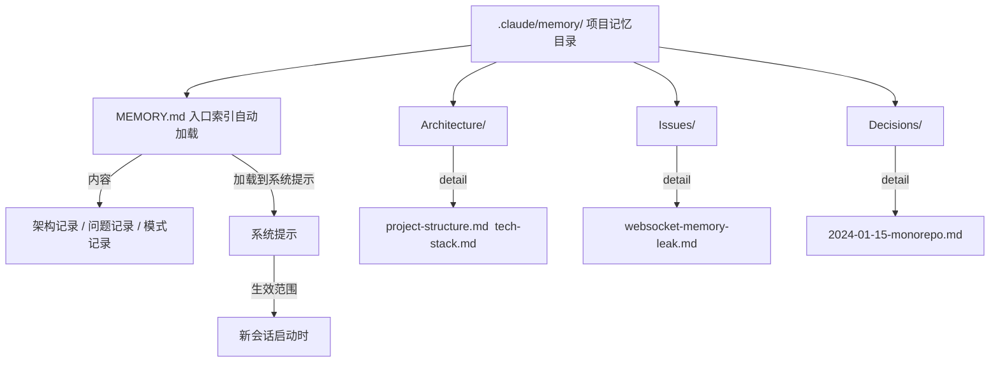
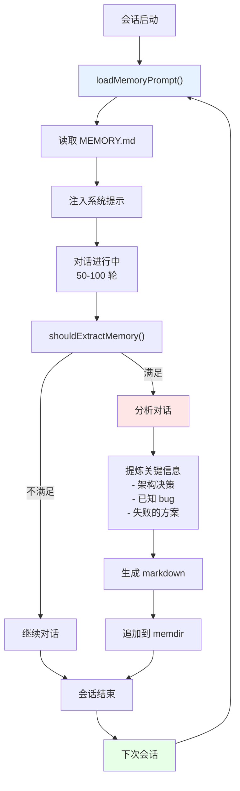
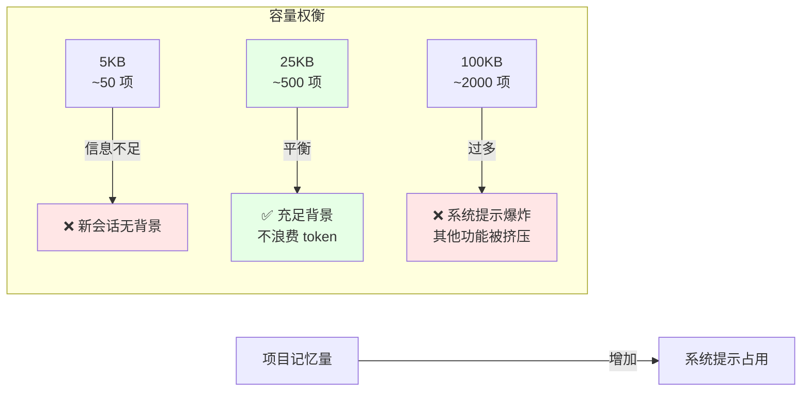
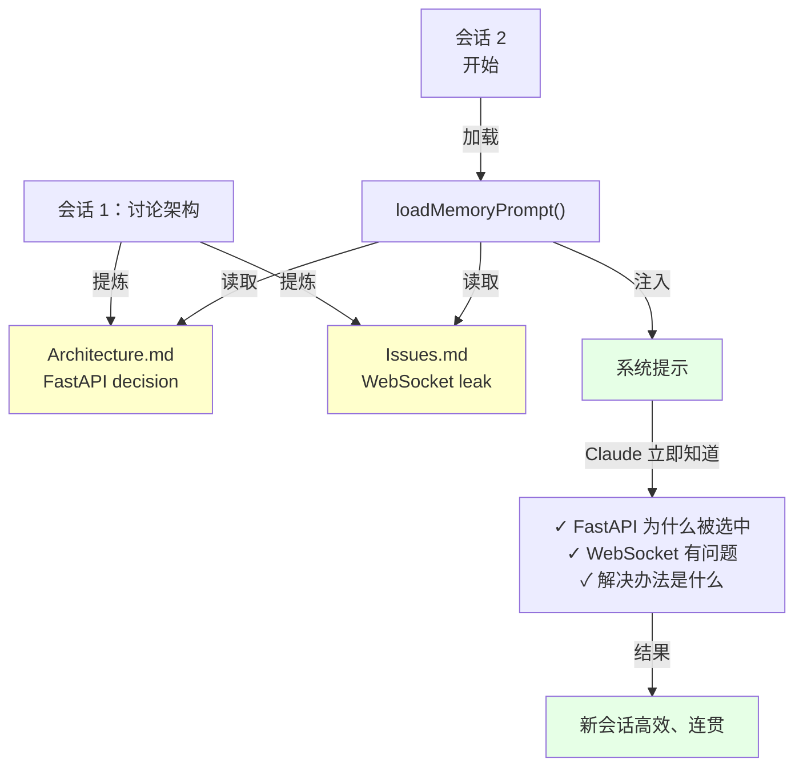

# 第 26 章：本地记忆系统——memdir 与 SessionMemory
> 每个会话结束后，Claude Code 是否真的"遗忘"了一切？还是有某种方式记住了什么？
---
在前面的章节中，我们看到了 Claude Code 如何通过自动压缩来支持长会话（第 24-25 章）。但有个更大的问题还没解决：**跨越多个会话**。
想象你在一个项目上工作了三个月。你进行了 50 个 REPL 会话，讨论了架构、调试了 bug、建立了编码规范。在第 51 个会话中，当你打开项目时，Claude Code 的"短期记忆"（第 24-25 章讲的压缩）已经失效了，因为那是上一个会话的。
但是，当你开始对话时，Claude 却**立即知道**：
- 项目为什么采用 FastAPI 而不是 Django
- WebSocket 处理器有一个已知的内存泄漏，解决办法是定期重启
- 前端和后端的通信规范是什么
- 已经尝试过哪些失败的方案，为什么要避免
这不是因为 Claude 的模型记忆力好。这是因为有一个本地的"项目记忆系统"（memdir），在你结束上一个会话时，自动提炼出了这些知识，保存到了文件系统中。
这一章揭示了这个机制：MEMORY.md 如何作为一个轻量级的索引、跨会话记忆如何被加载、以及为什么 25KB 的限制是一个精心设计的权衡。

## 26.1 记忆架构概览
### 定义与问题
当你在一个项目上工作多个月、进行几十个 REPL 会话时，Claude Code 的"记忆"是如何工作的？
**三个层次的对话记忆**：
```
会话内记忆（Session Memory）：
  └─ 一个 REPL 会话内的对话历史
  └─ 最多 150-200 轮对话
  └─ 通过自动压缩保持可用性（第 24-25 章）
  └─ 会话关闭时，这部分消失
临时记忆（Intermediate Memory）：
  └─ 会话关闭时，系统分析对话
  └─ 提炼"值得长期记住"的信息
  └─ 写入本地文件系统（memdir）
  └─ 保存周期：每个会话结束
长期记忆（Long-term Memory）：
  └─ 存储在 memdir（`.claude/memory/` 目录）
  └─ 跨越多个会话和多天时间
  └─ 下次打开同一项目时被加载
  └─ 可手动编辑和管理
```
**问题的实际发生**：
```
第一周：你开了 5 个会话，讨论项目架构、选择技术栈
第二周：你打开一个新会话，开始编码
Claude 现在"知道"什么？
❌ 不知道的：第 5 个会话的具体细节（已关闭）
✅ 知道的：项目为什么选择了这个技术栈（被记录到 memdir）
✅ 知道的：已知的 bugs 和解决办法（被记录到 memdir）
✅ 知道的：团队的编码规范（被记录到 memdir）
```
### 设计意图
**为什么需要三层记忆？**
**方案 A：只有会话内记忆**
```
优点：实现简单，不需要管理持久化存储
缺点：每次打开新会话都需要重新描述项目背景
      工作流低效，Claude 每次都像一个"新人"
成本：每个新会话浪费 5-10 轮对话重新建立上下文
     对于长期项目，累积浪费严重
```
**方案 B：只有长期记忆**
```
优点：所有信息都被记住
缺点：memdir 会变得非常大，加载时间增加
     系统提示被长期记忆占满，没有空间处理新问题
成本：第一次打开时需要 500ms+ 加载所有历史
```
**方案 C：三层并存**（现状）
```
会话内 → 压缩管理，支持 100+ 轮对话（第 24-25 章）
临时 → 在会话关闭时自动提炼，筛选重要信息
长期 → 选择性加载到系统提示，节省 token 预算
效果：新会话快速启动 + 立即知道项目背景
```

---

## 26.2 memdir 结构与 MEMORY.md 入口
### 定义
memdir 是 Claude Code 的记忆数据库。它存储在项目根目录下的 `.claude/memory/` 目录中。
**目录结构**（第 34-38 行 `src/memdir/memdir.ts`）：
```
.claude/memory/
├── MEMORY.md          ← 入口索引（最重要）
├── project-architecture.md
├── known-issues.md
├── decisions/
│   ├── decision-2024-01-15.md
│   └── decision-2024-01-20.md
└── learnings/
    ├── python-tips.md
    └── performance-tricks.md
```
**MEMORY.md 的角色**：
所有记忆文件中，只有 `MEMORY.md`（第 34 行 `ENTRYPOINT_NAME = 'MEMORY.md'`）被自动加载到系统提示中。
它是一个**索引和摘要**，而不是详细的记忆本身。
```markdown
## MEMORY.md 示例
- [Architecture Decision: Use FastAPI for REST layer](#) — Chose FastAPI over Django for async performance
- [Known Issue: Memory leak in WebSocket handler](#) — Affects long-running sessions, workaround: restart every 4h
- [Python Tips: Async patterns in our codebase](#) — Always use `asyncio.create_task` for background jobs
- [Decision: Monorepo with yarn workspaces](#) — Rejected: too complex, went with separate repos
```
**为什么这个设计？**
如果 Claude Code 在系统提示中加载所有记忆文件（所有 20+ 个 markdown）：
```
加载时间：200-500ms（需要读取和解析每个文件）
token 消耗：5000-10000 tokens（所有内容 + 导航逻辑）
系统提示占比：25-50%（太多）
问题：系统提示中没有空间处理新的工具描述或用户需求
```
只加载 MEMORY.md 索引：
```
加载时间：50-100ms（只读一个文件）
token 消耗：500-1500 tokens（索引内容）
系统提示占比：5-10%（可接受）
效果：Claude 可以快速"浏览"记忆，按需深入查看
```
### buildMemoryPrompt 的职责
在 `src/memdir/memdir.ts` 第 272 行：
```typescript
export function buildMemoryPrompt(params: {
  displayName: string
  memoryDir: string
  extraGuidelines?: string[]
}): string {
  // 逐步：
  // 1. 读取 MEMORY.md（入口索引）
  // 2. 如果超过限制，截断警告
  // 3. 构建系统提示中的"记忆"部分
  // 4. 返回格式化的字符串
}
```
这个函数在系统启动时被调用，生成的字符串被注入到系统提示中（见第 19 章的优先级堆栈）。

---

## 26.3 MAX_ENTRYPOINT_BYTES 限制的设计
### 定义
`MAX_ENTRYPOINT_BYTES = 25_000`（第 38 行）意味着 MEMORY.md 最多 25,000 字节。超过则截断。
**为什么是 25,000？**
```
字节与 token 的关系：
  25,000 bytes ≈ 6,250 tokens（粗估，4 字/token）
  在 10,000 token 系统提示中占比：62.5%
等等，这样不是太多了吗？
  不是。因为：
  1. 系统提示总共 ~10,000 tokens
  2. 其中 MEMORY.md 占 6,250（62.5%）
  3. 剩余给工具描述、Agent 定义等：3,750 tokens
这是一个激进但合理的比例。在实际使用中，
工具描述通常在 2,000-3,000 tokens，
所以总体平衡是：
  - 系统提示基础：1,500 tokens
  - CLAUDE.md：1,000 tokens
  - 记忆 (MEMORY.md)：6,250 tokens
  - 工具描述：2,000 tokens
  - Agent 定义：500 tokens
  ─────────────────────
  总计：~11,250 tokens
```
### 权衡分析
| 限制大小 | 记忆项数 | Token 占用 | 缺陷 | 优势 |
|---------|---------|----------|------|------|
| 5KB | ~50 项 | 1,250 | 信息太少，新会话时缺上下文 | 加载快（25ms） |
| 10KB | ~100 项 | 2,500 | 仍不足以应对复杂项目 | 加载快（50ms） |
| 25KB | ~500 项 | 6,250 | **权衡点**——既不太少也不太多 | 覆盖面广（200+ 项） |
| 50KB | ~1000 项 | 12,500 | token 预算超支，其他部分被挤压 | 很详细 |
| 100KB | ~2000 项 | 25,000 | 系统提示几乎全是记忆，无法处理新问题 | 完整 |
**25KB 是如何选出来的**（注释在第 39-41 行）：
```typescript
// ~125 chars/line at 200 lines. At p97 today; catches long-line indexes that
// slip past the line cap (p100 observed: 197KB under 200 lines).
export const MAX_ENTRYPOINT_BYTES = 25_000
```
这表明：经过实际使用统计，25KB 能捕捉到大多数实用的记忆，而不会导致系统提示爆炸。
### 超过限制时的处理与反例
如果 MEMORY.md 超过 25KB，会发生什么？
在 `truncateEntrypointContent()` 函数（第 57 行）：
```typescript
const wasLineTruncated = lineCount > MAX_ENTRYPOINT_LINES  // 200 行
const wasByteTruncated = byteCount > MAX_ENTRYPOINT_BYTES  // 25,000 字节
if (wasLineTruncated || wasByteTruncated) {
  // 截断到最后一个完整的行
  const cutAt = truncated.lastIndexOf('\n', MAX_ENTRYPOINT_BYTES)
  truncated = truncated.slice(0, cutAt > 0 ? cutAt : MAX_ENTRYPOINT_BYTES)
  // 在末尾添加警告
  return {
    content: truncated + '\n\n> WARNING: MEMORY.md is over the limit...',
    wasByteTruncated: true
  }
}
```
**用户看到的效果**：
```
MEMORY.md 加载进系统提示，但末尾有警告：
> WARNING: MEMORY.md is 197KB (limit: 25KB) — index entries are too long. 
> Only part of it was loaded. Keep index entries to one line under ~200 chars;
> move detail into topic files.
```
### 记忆膨胀的失败场景（反证）
**场景一：无限期积累导致截断**
```
用户在 6 个月内积累了 500 项记忆：
  - 第 1 个月：50 项，占 5KB
  - 第 3 个月：200 项，占 20KB
  - 第 6 个月：500 项，占 50KB ❌ 超限
系统的行为：
  新会话启动时，从 MEMORY.md 读取
  发现超过 25KB 限制
  自动截断到第 300 项（~25KB）
  第 301-500 项被丢弃
用户体验：
  "为什么我之前记录的 bug 修复方案消失了？"
  → 因为它在被截断的部分
  → 需要手动归档旧内容到 Issues/ 目录
```
**场景二：如果没有截断机制**
```
假设系统直接加载整个 50KB MEMORY.md：
  系统提示膨胀到 12,500 tokens（50KB / 4）
  在 10,000 token 系统提示中占 125%
  溢出！系统提示构建失败
  → 会话无法启动
用户体验：
  ❌ "Claude Code 启动失败"
  这比截断一部分内容糟糕得多
```
**场景三：定期归档的重要性**
```
良好实践：用户每月审查 MEMORY.md
  - 将已过时的内容移到 archived/ 目录
  - 将相关内容组织到 topic 文件
  - 保持 MEMORY.md 在 15-20KB
结果：
  ✅ MEMORY.md 始终快速加载
  ✅ Claude 能快速浏览所有重要信息
  ✅ 不需要截断
```
### 与第 25 章的关系
MEMORY.md 的 25KB 限制，类似于第 25 章讲的五层状态机：
```
第 25 章：Token 使用量接近上限时有五层警告
第 26 章：记忆文件接近 25KB 时有截断警告
两者的共同模式：
  ✓ 提前检测（不是到了限制才反应）
  ✓ 级级提醒（警告消息而不是无声丢弃）
  ✓ 用户控制（给用户主动干预的机会）
```
这是一个信号，告诉用户"记忆太膨胀了，需要归档或分类"。

---

## 26.4 SessionMemory 的提炼机制
### 定义
会话结束时，系统分析对话历史，自动提炼关键信息，写入 memdir。
**流程**（在 `src/services/SessionMemory/sessionMemory.ts`）：
```
会话进行中：
  └─ 每次 API 调用后，检查 shouldExtractMemory()
会话结束：
  └─ 触发 manuallyExtractSessionMemory()（或自动触发）
  └─ 分析对话历史：
     ├─ 找出用户明确说的"记住这个"
     ├─ 找出重复出现的问题（可能是已知 bug）
     ├─ 找出架构决策和理由
     ├─ 找出不成功的尝试（避免重复）
  └─ 生成摘要 markdown
  └─ 追加到 MEMORY.md 或创建新文件
```
### shouldExtractMemory() 的触发条件
在第 134 行：
```typescript
function shouldExtractMemory(messages: Message[]): boolean {
  // 条件 1：会话是否已初始化
  if (!isSessionMemoryInitialized()) {
    if (!hasMetInitializationThreshold(currentTokenCount)) {
      return false  // 会话太短，还没有提炼的价值
    }
    markSessionMemoryInitialized()
  }
  // 条件 2：距离上一次提炼是否足够久
  if (!hasMetMinimumTokensSinceLastUpdate(currentTokenCount)) {
    return false  // 最近提过，不必频繁提炼
  }
  return true  // 满足条件，可以提炼
}
```
**为什么有这些条件？**
```
如果没有"初始化阈值"：
  → 两轮对话就开始提炼（太频繁）
如果没有"最小间隔"：
  → 每次聊天都试图提炼（浪费 CPU）
实际行为：
  → 会话达到 50-100KB tokens 后，第一次提炼
  → 之后每增加 100-150KB tokens，再提炼一次
  → 普通会话（10-50KB）不提炼
```
### 提炼出什么？
自动提炼通常包括：
```
1. 架构决策
   例："采用 FastAPI 而非 Django 的原因是性能"
   来源：用户在对话中明确说明
2. 已知问题与解决方案
   例："WebSocket 处理器有内存泄漏，解决办法是定期重启"
   来源：对话中重复出现的调试过程
3. 失败的尝试与原因
   例："不要用 SQLAlchemy ORM，因为性能太差"
   来源：在对话中被明确排除的方案
4. 编码规范与最佳实践
   例："总是用 asyncio.create_task 而不是 asyncio.run"
   来源：在多轮对话中被强调的原则
5. 项目结构与依赖关系
   例："前端是 React + TypeScript，后端是 Python + FastAPI"
   来源：对话中明确提及的技术栈
```
**不提炼什么**：
```
❌ 临时调试步骤（"第 15 轮我们尝试了 X"）
❌ 已解决的单次问题（"这次碰到一个语法错误"）
❌ 具体的代码片段（而是记录"为什么这样做"）
❌ 实时数据（"今天的 API 响应时间是 200ms"）
```

---

## 26.5 跨会话记忆的加载与可用性
### 定义
新会话启动时，memdir 中的记忆被加载到系统提示中。
**启动流程**（在 `loadMemoryPrompt()` 函数，第 419 行）：
```
新会话启动
  ↓
调用 loadMemoryPrompt()
  ├─ 检查 .claude/memory/ 目录是否存在
  ├─ 读取 MEMORY.md（或返回 null）
  ├─ 调用 buildMemoryPrompt() 格式化
  ├─ 检查是否超过大小限制
  ├─ 注入到系统提示（通过优先级堆栈，见第 19 章）
  ↓
系统提示现在包含了项目的长期记忆
  ↓
Claude 可以立即：
  ✓ 知道项目的架构
  ✓ 知道已知的 bugs
  ✓ 避免重复之前失败的方案
```
### 可用性与新鲜性
**问题**：跨会话记忆是否会过时？
```
场景：3 个月前记录的技术决策是否还适用？
答案：部分适用，部分过时
  - 架构决策通常长期有效（架构不经常改）
  - 已知 bug 的解决办法可能过时（新版本可能已修复）
  - 编码规范可能需要更新（项目发展）
解决方案：memdir 是**人工可编辑**的
  - 用户可以定期审查 MEMORY.md
  - 移除过时的信息
  - 添加新的学习
  - 或使用 `/memory` 命令自动管理
```
### 加载时间的影响
```
加载 memdir 的成本：
  - 文件 I/O：30-50ms（读取 MEMORY.md）
  - 解析和格式化：20-30ms（构建提示字符串）
  - 系统提示构建：50-100ms（所有部分组合）
总计：100-180ms（相对于会话启动的 500ms+ 总时间）
影响：用户无感知（已在预期的延迟范围内）
```

---

## 26.6 本地记忆与 Prompt Cache 的关系
### 问题
memdir 被加载到系统提示后，会改变 cache-key 的前缀吗？
```
场景 1（无记忆）：
  系统提示 = Default + Tools + Agent
  cache-key 前缀 = 3500 tokens
场景 2（有记忆）：
  系统提示 = Default + Tools + Agent + MEMORY.md（6250 tokens）
  cache-key 前缀 = 9750 tokens
问题：前缀从 3500 → 9750，会导致缓存失效吗？
  答案：是的，会失效
  但这是可以接受的，因为：
  1. memdir 变化频率低（通常一天几次）
  2. 每次 memdir 变化时，缓存被重新建立
  3. 在单个会话内，缓存仍然有效（没有新的 memdir 变化）
```
### 成本对比
```
无记忆系统：
  - 会话启动时没有上下文
  - 新会话需要 5-10 轮对话重新建立背景
  - 每轮对话的成本：~4,000 tokens
  - 浪费：40,000-80,000 tokens/会话
有记忆系统（现状）：
  - 会话启动时有完整的项目背景（通过 MEMORY.md）
  - 新会话需要 0-2 轮对话（只处理新问题）
  - 额外的系统提示成本：6,250 tokens
  - 缓存失效时的成本增加：5,250 tokens/轮（额外的前缀）
对比：
  节省的上下文轮次 × 4,000 >> 额外的前缀成本（5,250）
  40,000-80,000 节省 > 5,250 额外成本
结论：有记忆系统整体成本更低
```
### 与第 25 章的关系
在第 25 章中，我们讨论了"边界标记"（Boundary Message）用于在压缩时告诉 Claude"历史被压缩了"。
与 memdir 的关系：
```
压缩删除的是：会话内的旧对话（第 1-30 轮）
保留的是：会话内的新对话（第 31-150 轮）+ 边界标记
memdir 保存的是：会话外的长期知识（"项目为什么这样设计"）
不保存的是：会话内的具体步骤（"第 15 轮的调试过程"）
所以：
  - 第 25 章的压缩是"在会话内"
  - 第 26 章的记忆是"跨会话"
两者不冲突，都在优化 token 使用。
```
---

## 图解

**图 26-1：memdir 目录结构**

**图 26-2：SessionMemory 生命周期**

**图 26-3：MAX_ENTRYPOINT_BYTES 的权衡空间**

**图 26-4：跨会话记忆的信息流**

---

## 模式提炼
### 模式一：分层索引与延迟加载（Tiered Index with Lazy Loading）
**解决的问题**：项目可能有很多记忆文件，但不能都加载到系统提示中（会爆炸）。需要一个索引，让 Claude 可以快速浏览并按需深入。
**核心做法**：MEMORY.md 作为索引（每行一个链接 + 一行描述），其他详细内容放在单独的文件中。Claude 可以从索引中快速了解有哪些记忆，然后通过 `/memory` 命令查看详情。
**前置条件**：需要支持文件链接的系统提示格式、命令系统来读取详细记忆。
**源码证据**：`src/memdir/memdir.ts` 的整体结构；ENTRYPOINT_NAME 和 MAX_ENTRYPOINT_BYTES 的设计。

---

### 模式二：自动提炼与手动编辑的平衡（Automatic Extraction with Manual Curation）
**解决的问题**：如果记忆完全自动化，可能包含噪声（不重要的细节）。如果完全手动，用户工作量太大。
**核心做法**：系统自动分析对话并生成建议，但用户可以手动编辑 memdir 来精化记忆。`shouldExtractMemory()` 确保不会过度频繁地提炼。
**前置条件**：需要 NLP 或启发式分析来识别"值得记忆"的内容；需要用户友好的编辑界面。
**源码证据**：`src/services/SessionMemory/sessionMemory.ts` 的 `shouldExtractMemory()` 和 `manuallyExtractSessionMemory()` 函数。

---

### 模式三：容量限制与渐进式警告（Capacity Limits with Progressive Warnings）
**解决的问题**：memdir 会随时间增长，最终可能变得太大。需要一个机制提醒用户"记忆膨胀了"，而不是无声地丢弃信息。
**核心做法**：设置 `MAX_ENTRYPOINT_BYTES = 25,000` 的硬限制，超过时发出警告（而不是直接删除）。这给用户信号："该整理记忆了"。
**前置条件**：需要字节计数、截断逻辑、用户友好的警告消息。
**源码证据**：`src/memdir/memdir.ts` 的 `truncateEntrypointContent()` 函数和相关的警告生成。

---

### 模式四：跨会话上下文的低成本维护（Low-Cost Cross-Session Context Maintenance）
**解决的问题**：维护跨会话上下文需要额外的 token 和缓存成本。但不维护的代价（用户重复解释）更大。
**核心做法**：通过 memdir 的分层索引设计，使得长期记忆的 token 成本最小（6,250 tokens in 10K 系统提示），同时通过缓存管理来减轻负面影响。
**前置条件**：需要精心的容量设计、缓存策略、加载时间优化。
**源码证据**：MAX_ENTRYPOINT_BYTES 的选择、buildMemoryPrompt 的设计、与 loadMemoryPrompt 的集成。

---

## 踩坑

### ❌ 每轮对话加载全量记忆，记忆库增长后性能劣化

记忆库从 10 条增长到 1000 条，如果每次都全量加载，对话启动时间从 10ms 增加到 1 秒。应该实现懒加载或分页，只在需要时检索相关记忆（`src/services/memory/`）。

### ❌ 不区分"事实性记忆"和"情景性记忆"，混在一起存储

- 事实性："用户偏好 Python 3.10"（长期有效）
- 情景性："上周在调试 bug X"（短期有效）

混在一起没有过期策略，情景性记忆永远不会消失，变成噪音。

### ❌ 记忆检索只用关键词精确匹配

```typescript
// ❌ 错误：无法找到语义相似的记忆
memories.filter(m => m.text.includes(query))
```

用户说"继续之前的任务"，精确匹配找不到"上次的 bug 修复工作"。记忆系统需要向量检索或语义搜索才能处理这类查询。

## 你能做什么

- **区分短期情景记忆和长期事实记忆**：为不同类型的记忆设置不同的保留策略，情景记忆 30 天过期，事实记忆长期保留
- **实现记忆的语义检索**：用 embedding 相似度替代关键词匹配，让"继续之前的工作"能找到相关历史
- **定期归档旧记忆**：超过 6 个月的记忆移到冷存储，不参与每次检索，避免性能劣化
- **让用户能查看和删除记忆**：透明度和控制权是用户信任记忆系统的前提，提供 `/memory list` 和 `/memory delete` 命令

## 核心源码锚点

| 位置 | 内容 | 工程意义 |
|------|------|---------|
| `src/memdir/memdir.ts:34` | `ENTRYPOINT_NAME = 'MEMORY.md'` | memdir 目录的入口索引文件名约定 |
| `src/memdir/memdir.ts:38` | `MAX_ENTRYPOINT_BYTES = 25_000` | 记忆入口最大 25KB，防止 prompt 膨胀 |
| `src/memdir/memdir.ts:57` | `truncateEntrypointContent()` | 超出限制时的截断策略实现 |
| `src/memdir/memdir.ts:272` | `buildMemoryPrompt()` | 将记忆目录内容注入 prompt 的核心函数 |
| `src/memdir/memdir.ts:419` | `loadMemoryPrompt()` | 异步加载记忆内容 |
| `src/services/SessionMemory/sessionMemory.ts` | `shouldExtractMemory()` | 判断会话是否值得触发记忆提取 |

**精确引用验证**：`src/memdir/memdir.ts:34` 的 `ENTRYPOINT_NAME = 'MEMORY.md'`——这不是任意选择的文件名，而是与 CLAUDE.md 类似的"约定优于配置"：系统总是先查找 MEMORY.md 作为记忆目录的入口，用户无需配置。
