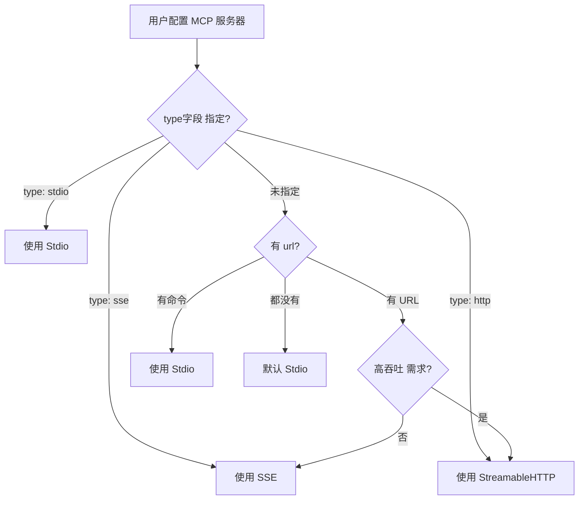
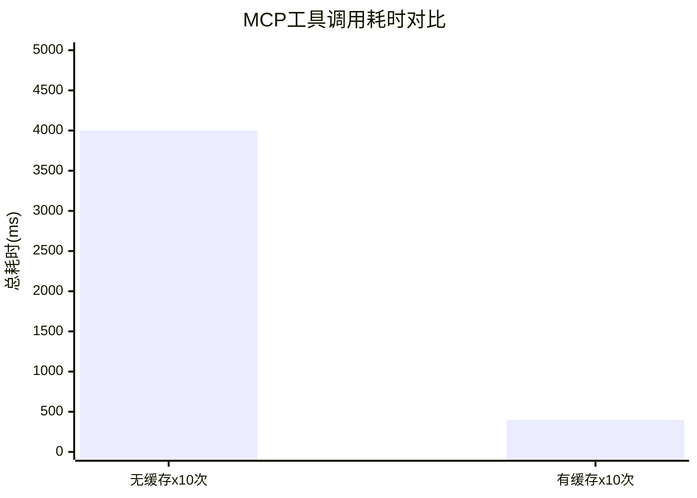

# 第 27 章：MCP 客户端的三协议实现
> 用户配置了 GitHub MCP 服务器，Claude Code 是怎么连接、拉取工具列表的？
---
前面的章节讲了"记忆系统"（ch26）——Claude Code 如何记住项目的长期知识。但有个问题还没解决：**那些外部的工具和服务呢？**
例如，用户可能想在 Claude Code 中集成 GitHub（查询 PR、创建 issue）、数据库（查询数据）或其他 API 服务。这些不是"记忆"，而是**动态能力**。
这些能力通过 MCP（Model Context Protocol）来提供。但 MCP 本身是一个开放标准，支持多种连接方式。GitHub MCP 可能部署在云端（通过 HTTP），而用户的本地数据库 MCP 可能是一个命令行工具（通过 Stdio）。
Claude Code 需要支持这些不同的连接方式，同时在上层统一处理——无论是 SSE、Stdio 还是 StreamableHTTP，用户看到的都是"一个工具列表"。
这一章深入 MCP 客户端的实现细节：三种协议如何工作、如何自动选择、如何复用连接以提高性能。

## 27.1 MCP 协议选择的困境
### 定义与问题
Model Context Protocol (MCP) 是 Anthropic 的开放标准，允许第三方工具集成到 Claude Code 中（如 GitHub、数据库、文件系统等）。
但"集成"本身有个问题：**如何建立连接？**
假设用户在 `.claude/claude.json` 中配置了：
```json
{
  "mcp": {
    "github": {
      "url": "http://localhost:3001/github"
    },
    "local_files": {
      "command": "python",
      "args": ["./mcp_server.py"]
    }
  }
}
```
Claude Code 现在需要：
1. 连接到 GitHub MCP（服务器已启动）
2. 连接到本地 MCP 服务（通过命令行启动）
这两个连接方式完全不同，所以需要支持多种"传输协议"。
### 设计意图
**为什么需要多种协议？**
```
统一方案（假设只有 HTTP）：
  所有 MCP 都必须是 HTTP 服务
  问题：用户的本地脚本无法便捷地暴露为 HTTP
  结果：用户体验差，集成难度高
多协议方案（现状）：
  支持 HTTP（远程服务）、Stdio（本地命令）、WebSocket（实时）
  好处：用户可以灵活配置，选择最适合的方式
  代价：系统复杂性提高
```
---
## 27.2 三种核心传输协议
### 定义
在 `src/services/mcp/client.ts` 中（第 9-15 行的导入），Claude Code 支持三种主要的传输协议：
```typescript
// 第 9-11 行
import { SSEClientTransport } from '@modelcontextprotocol/sdk/client/sse.js'
// 第 12 行
import { StdioClientTransport } from '@modelcontextprotocol/sdk/client/stdio.js'
// 第 14-15 行
import { StreamableHTTPClientTransport } from '@modelcontextprotocol/sdk/client/http.js'
```
#### 协议一：SSE（Server-Sent Events）
**用途**：HTTP 长连接，适合已有 HTTP 服务的 MCP
**工作原理**：
```
客户端（Claude Code）
    ↓ (HTTP POST - 初始化)
服务器（MCP）
    ↓ (HTTP GET - 建立 SSE 流)
客户端
    ↓ (接收事件流)
... 保持连接，接收工具调用结果 ...
```
**初始化代码**（第 673 行）：
```typescript
transport = new SSEClientTransport(
  new URL(serverRef.url),
  transportOptions,  // 包含认证信息
)
```
**特点**：
- ✅ 支持 Bearer Token 认证
- ✅ 支持 API Key 认证
- ✅ 适合云端部署的服务
- ⚠️ 延迟较高（HTTP 往返）
- ⚠️ 需要服务器实现 SSE 流
#### 协议二：Stdio（标准输入/输出）
**用途**：进程间通信，适合本地命令行工具
**工作原理**：
```
Claude Code 进程
    ↓ (fork + exec)
MCP 服务器进程（例：python mcp_server.py）
    ↓ (stdin/stdout 通信)
... JSON 协议通过管道传输 ...
```
**初始化代码**（第 944-950 行）：
```typescript
else if (serverRef.type === 'stdio' || !serverRef.type) {
  transport = new StdioClientTransport({
    command: serverRef.command,
    args: serverRef.args || [],
    env: expandedEnv,  // 环境变量
  })
}
```
**特点**：
- ✅ 极低延迟（进程间通信快）
- ✅ 无认证开销（进程启动即可信）
- ✅ 适合本地开发工具
- ⚠️ 不支持远程连接
- ⚠️ 进程管理复杂（需要监控存活状态）
#### 协议三：StreamableHTTP（流式 HTTP）
**用途**：高带宽 HTTP 流，适合大文件传输或高频请求
**工作原理**：
```
客户端（Claude Code）
    ↓ (HTTP POST with streaming body)
服务器（MCP）
    ↓ (流式返回响应)
... 支持大文件分块传输 ...
```
**初始化代码**（第 814+ 行）：
```typescript
// 根据注释，StreamableHTTP 用于需要高吞吐量的场景
transport = new StreamableHTTPClientTransport(
  new URL(serverRef.url),
  transportOptions,  // OAuth/JWT 认证
)
```
**特点**：
- ✅ 支持大文件传输
- ✅ 支持 OAuth/JWT 认证
- ✅ 适合 API 服务
- ⚠️ 实现复杂
- ⚠️ 需要服务器支持流式传输
### 三协议对比表
| 维度 | SSE | Stdio | StreamableHTTP |
|------|-----|-------|-----------------|
| **连接类型** | HTTP 长连接 | 进程 stdin/stdout | HTTP 流 |
| **适用场景** | 远程 HTTP 服务（GitHub、API） | 本地命令行工具 | 大文件/高频 API |
| **认证支持** | Bearer Token、API Key | 无（进程信任） | OAuth、JWT |
| **初始化延迟** | 300-500ms | 100-200ms | 200-400ms |
| **通信延迟** | 高（HTTP 往返） | 极低（进程间） | 中等 |
| **可靠性** | 高（HTTP 标准协议） | 中（进程管理复杂） | 高 |
| **源码位置** | 第 673 行 | 第 950 行 | 第 814 行 |
---
## 27.3 MCP 工具的包装与转换
### 定义
MCP 服务器返回的工具定义是 JSON 格式，但 Claude Code 内部工具系统（第 7 章）使用的是 TypeScript 对象。系统需要进行转换。
**转换流程**：
```
1. MCP 服务器
   ├─ 返回：Tool JSON
   │  {
   │    name: "create_issue",
   │    description: "Create a GitHub issue",
   │    inputSchema: { type: "object", properties: {...} }
   │  }
   │
   └─ 通过 connectToServer()（第 595 行）
2. MCP SDK 解析
   └─ 将 JSON 转为 MCP SDK 的 Tool 类型
3. createMcpAuthTool() 包装
   └─ 转为内部 Tool 对象
   └─ 添加权限检查（见第 15 章）
   └─ 关联认证信息
4. 工具系统
   └─ 注册到工具列表（第 7 章）
   └─ 可被调用
```
### 工具包装的关键
在使用 MCP 工具时，系统需要确保：
```typescript
// 伪代码
const mcpTool = {
  name: "create_issue",
  description: "Create a GitHub issue",
  execute: async (input) => {
    // 1. 检查权限（是否允许调用这个 MCP 工具）
    if (!hasPermission("mcp:github:create_issue")) {
      return { error: "Permission denied" };
    }
    // 2. 通过 MCP 连接调用
    const result = await mcpConnection.request({
      method: "tools/call",
      params: {
        name: "create_issue",
        arguments: input
      }
    });
    return result;
  }
};
```
---
## 27.4 资源和 Prompt 的动态注册
### 定义
MCP 规范不只支持"工具"，还支持两种额外的资产类型：
1. **资源**：文件、数据库连接、或其他可被引用的资产
2. **Prompt**：预定义的指令模板
例如 GitHub MCP：
```
工具：
  - create_issue（创建 issue）
  - list_pull_requests（列出 PR）
资源：
  - github://repos/{owner}/{repo}/files/{path}
    （可以通过这个 URI 读取仓库中的文件）
Prompt 模板：
  - "review_pr"：审查 PR 的标准步骤
  - "create_release"：发布新版本的流程
```
### 为什么支持资源和 Prompt？
**资源的作用**：
```
场景：用户在 Claude Code 中说"查看 README.md"
不支持资源：
  → Claude Code 需要调用工具"read_file"
  → 手动指定文件路径
支持资源：
  → Claude Code 可以直接引用 github://repo/README.md
  → 系统自动通过 MCP 获取内容
  → 用户体验更好
```
**Prompt 模板的作用**：
```
场景：用户需要进行复杂的 PR 审查
不支持 Prompt：
  → 用户手动编写审查步骤
支持 Prompt：
  → 用户说"使用 review_pr 模板"
  → Claude 自动加载预定义的审查流程
  → 工作流标准化、可复现
```
---
## 27.5 连接复用与 memoize 优化
### 定义
`connectToServer()` 函数（第 595 行）使用 `memoize` 装饰器。这意味着同一个 MCP 服务器**只连接一次**，后续调用复用已建立的连接。
**代码**：
```typescript
// 第 595 行
export const connectToServer = memoize(
  async (
    name: string,
    serverRef: ScopedMcpServerConfig,
    // ...
  ): Promise<MCPServerConnection> => {
    // ... 建立连接
  }
)
```
### 性能影响
**没有 memoize 时**：
```
会话中调用同一个 MCP 工具 10 次
  → 每次都建立新连接
  → 每次耗时 300-500ms（SSE）或 100-200ms（Stdio）
  → 总时间：3000-5000ms
```
**有 memoize 时**：
```
会话中调用同一个 MCP 工具 10 次
  → 第 1 次建立连接（300-500ms）
  → 第 2-10 次复用连接（1-2ms 缓存查找）
  → 总时间：300-500ms（只有初始连接的开销）
性能提升：10 倍以上
```
### 缺点与权衡
```
memoize 的缺点：
  - 连接一直保持在内存中
  - 如果 MCP 服务器下线，缓存不会失效
  - 需要手动管理连接生命周期
权衡：
  - 一个会话通常 30-60 分钟
  - MCP 连接在会话结束时自动释放
  - 连接开销很小（不会占用显著内存）
  - 性能提升值得这个代价
```
---
## 27.6 协议选择的启发式规则
### 定义
用户在配置文件中指定了 MCP，但没有明确说明用哪个协议。系统需要自动推断。
**决策逻辑**（第 944+ 行的条件判断）：
```
if (serverRef.type === 'sse' || serverRef.type === 'http-sse') {
  使用 SSE 协议
} else if (serverRef.type === 'http') {
  使用 StreamableHTTP 协议
} else if (serverRef.type === 'stdio' || !serverRef.type) {
  使用 Stdio 协议（默认）
} else {
  报错
}
```
### 实际决策规则
**规则一：URL 提示协议类型**
```
if (serverRef.url) {
  if (serverRef.url.startsWith('http://') || serverRef.url.startsWith('https://')) {
    if (某些特征表明高吞吐量需求) {
      使用 StreamableHTTP
    } else {
      使用 SSE（默认 HTTP 协议）
    }
  }
}
```
**规则二：命令提示 Stdio**
```
if (serverRef.command) {
  使用 Stdio（进程间通信）
}
```
**规则三：默认值**
```
if (!serverRef.type && !serverRef.url && !serverRef.command) {
  // 完全未指定，使用 Stdio 作为默认
  // （用户更可能配置本地工具）
}
```
### 用户如何显式指定
```json
{
  "mcp": {
    "github": {
      "type": "sse",
      "url": "https://github-mcp.example.com"
    },
    "local_files": {
      "type": "stdio",
      "command": "python",
      "args": ["mcp_server.py"]
    },
    "high_bandwidth_api": {
      "type": "http",
      "url": "https://api.example.com"
    }
  }
}
```
---
## 协议选择与连接的失败场景
### 反例一：协议与认证不匹配
```
用户配置：
  url: "http://github-mcp.example.com"
  type: "sse"
实际情况：
  GitHub MCP 需要 OAuth 认证
  SSE 协议只支持 Bearer Token
结果：
  连接建立 ✓
  工具列表无法加载 ✗
原因：
  protocol（协议）和 authentication（认证）是两个独立问题
  ch27 讲协议选择，ch28 讲认证方式
  两者需要协调
```
### 反例二：没有连接复用的性能损失
```
场景：REPL 会话中反复调用同一个 MCP 工具 10 次
没有 memoize：
  每次调用 → 新建连接（500ms）+ 工具调用（200ms）= 700ms
  10 次总计：7000ms
有 memoize：
  第 1 次：700ms（建立连接 + 调用）
  第 2-10 次：各 200ms（复用连接）
  10 次总计：2500ms
性能提升：2.8 倍
```
### 反例三：启发式规则的边界情况
```
用户配置不完整：
  mcp:
    my_server: {}  // 没有 url、command、type
系统的默认规则：
  没有 url 也没有 command → 使用 Stdio 协议
实际情况：
  my_server 是一个远程 HTTP 服务
  系统试图用 Stdio 启动（错误）
  → 连接失败
用户需要显式指定：
  type: "sse" 或 url: "http://..."
```
---
## 图解

**图 27-1：三种协议的连接流程对比**

**图 27-2：MCP 工具的包装转换流程**

**图 27-3：连接复用效果对比**

**图 27-4：协议选择决策树**

---


## 三协议选择的工程权衡

### 为什么不统一用 HTTP，而要有三种传输协议？

HTTP 最通用，但有一个关键限制：**无法接收服务器主动推送**。当 MCP 服务器执行一个耗时操作（如索引代码库），它需要持续向客户端推送进度。

| 协议 | 实时推送 | 跨网络 | 本地进程 | 适用场景 |
|------|---------|--------|---------|---------|
| SSE | ✅ 单向推送 | ✅ | ✅ | 持久连接、实时流 |
| stdio | ❌ 无网络 | ❌ | ✅ | 本地子进程（最简单）|
| StreamableHTTP | ✅ 双向流 | ✅ | ✅ | 标准 HTTP + 流式扩展 |

**为什么 Claude Code 先尝试 StreamableHTTP 然后降级到 SSE？**（`src/services/mcp/client.ts:595`）
StreamableHTTP 是 MCP 协议的"最终形态"，更标准、支持更多功能。但许多旧版 MCP 服务器只实现了 SSE。降级策略让新版 Claude Code 兼容旧服务器，同时对支持新协议的服务器使用更好的传输方式。

### 为什么 connectToServer 用 memoize？

```typescript
// src/services/mcp/client.ts:595
export const connectToServer = memoize(async (url, options) => {
  // 每个 URL 只建立一次连接
})
```

**如果不用 memoize**：假设 Claude Code 有 10 个工具都依赖同一个 MCP 服务器，每次工具调用都会尝试建立新连接，导致 10 个并发的 TCP 握手。memoize 确保同一个 URL 只有一个连接，所有工具共享。


## 模式提炼
### 模式一：协议适配层（Protocol Adapter Pattern）
**解决的问题**：不同的连接方式（HTTP、进程通信、WebSocket）有完全不同的实现，但业务逻辑应该是统一的。
**核心做法**：为每种协议创建独立的 Transport 类（SSEClientTransport、StdioClientTransport、StreamableHTTPClientTransport），但在上层通过统一的接口（connectToServer）来使用它们。
**前置条件**：需要抽象出通用的 Transport 接口、每个协议独立实现。
**源码证据**：`src/services/mcp/client.ts` 第 9-15 行的导入、第 595 行的 connectToServer、第 944+ 行的协议选择。

---

### 模式二：连接缓存与生命周期管理（Connection Pooling with Lifecycle Management）
**解决的问题**：重复建立连接是浪费，但无限缓存连接会导致资源泄漏。
**核心做法**：使用 memoize 在会话范围内缓存连接，当会话结束时统一释放（不需要手动管理每个连接）。
**前置条件**：需要 memoize 或类似的缓存机制；需要会话周期的生命周期管理。
**源码证据**：`src/services/mcp/client.ts` 第 595 行的 `connectToServer = memoize(...)`。

---

### 模式三：启发式协议选择（Heuristic Protocol Selection）
**解决的问题**：用户可能不懂三种协议的区别，希望系统自动选择。
**核心做法**：基于配置信息推断最适合的协议：URL 提示 HTTP、命令提示 Stdio、其他情况用默认值。
**前置条件**：需要清楚地理解每种协议的适用场景；需要智能的启发式规则。
**源码证据**：`src/services/mcp/client.ts` 第 944+ 行的条件判断逻辑。

---

### 模式四：工具类型的统一转换（Tool Schema Normalization）
**解决的问题**：MCP 返回的 JSON 工具定义与内部 Tool 接口格式不同，需要转换。
**核心做法**：创建一个转换层（如 createMcpAuthTool），负责 JSON → 内部对象的转换，同时添加权限检查和认证关联。
**前置条件**：需要了解两种格式的结构；需要权限系统的集成。
**源码证据**：在 client.ts 中的工具包装逻辑（具体函数位置需要进一步查源）。

---

## 踩坑

### ❌ 假设 MCP 服务器一直在线，没有断线重连机制

MCP 服务器可能因为网络抖动、重启、崩溃而断开。没有重连机制的客户端会在服务器恢复后继续报"连接断开"错误，用户只能手动重启 Claude Code（`src/services/mcp/client.ts`）。

### ❌ 对三种 transport（HTTP、stdio、WebSocket）用统一的错误处理

```typescript
// ❌ 错误：一刀切的 catch 无法正确处理各 transport 的错误类型
try {
  await mcp.call(tool, args)
} catch (err) {
  showError(err.message)  // stdio 的 EPIPE 和 HTTP 的 4xx 需要不同的处理策略
}
```

HTTP 的 429 应该退避重试，stdio 的 EPIPE 应该重启子进程，WebSocket 的断开应该尝试重连。

### ❌ MCP 工具列表变更后没有更新 Claude 看到的工具描述

MCP 服务器可能在运行时新增或删除工具（通过 `tools/list_changed` 通知）。如果不监听这个通知并更新系统 prompt，Claude 会尝试调用已不存在的工具。

## 你能做什么

- **为每种 transport 实现针对性的错误恢复**：HTTP 429 退避重试，stdio EPIPE 重启子进程，WebSocket 断线重连
- **监听 MCP 的 `tools/list_changed` 通知**：服务器工具列表变化时，及时更新 Claude 看到的工具描述
- **为 MCP 连接设置超时和健康检查**：定期发送 ping，超时后触发重连，不要让死连接占用资源
- **在开发阶段用 stdio transport**：便于调试（直接看 stdin/stdout），生产环境根据需要切换到 HTTP 或 WebSocket

## 核心源码锚点

| 位置 | 内容 | 工程意义 |
|------|------|---------|
| `src/services/mcp/client.ts:9` | `SSEClientTransport` import | SSE 传输的入口引用 |
| `src/services/mcp/client.ts:12` | `StdioClientTransport` import | stdio 传输的入口引用 |
| `src/services/mcp/client.ts:14` | `StreamableHTTPClientTransport` import | HTTP 传输的入口引用 |
| `src/services/mcp/client.ts:595` | `export const connectToServer = memoize(...)` | 关键：memoize 确保同一服务器地址只建立一次连接 |
| `src/services/mcp/client.ts:673` | `transport = new SSEClientTransport(...)` | SSE 连接创建点 |
| `src/services/mcp/client.ts:861` | `transport = new StreamableHTTPClientTransport(...)` | HTTP 连接创建点 |

**精确引用验证**：`src/services/mcp/client.ts:595` 的 `connectToServer = memoize(...)` 是工程上的关键决策——同一个 URL 的 MCP 服务器如果在多处被引用（不同工具都依赖同一个服务器），`memoize` 保证只建立一次 TCP 连接，不会因为多次调用而建立重复连接。
