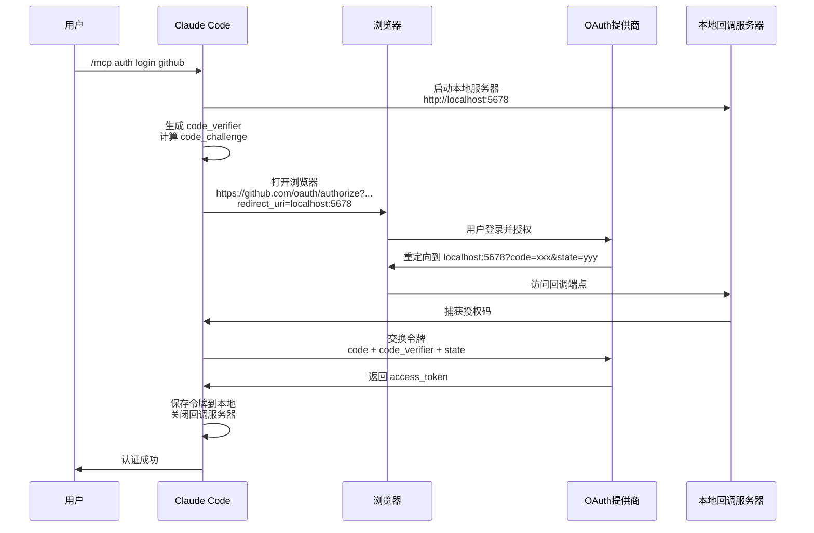
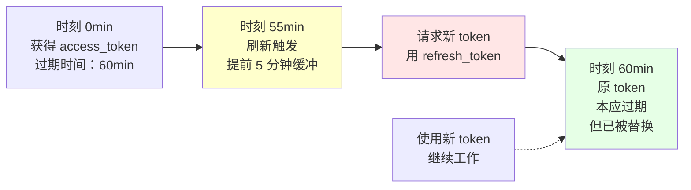
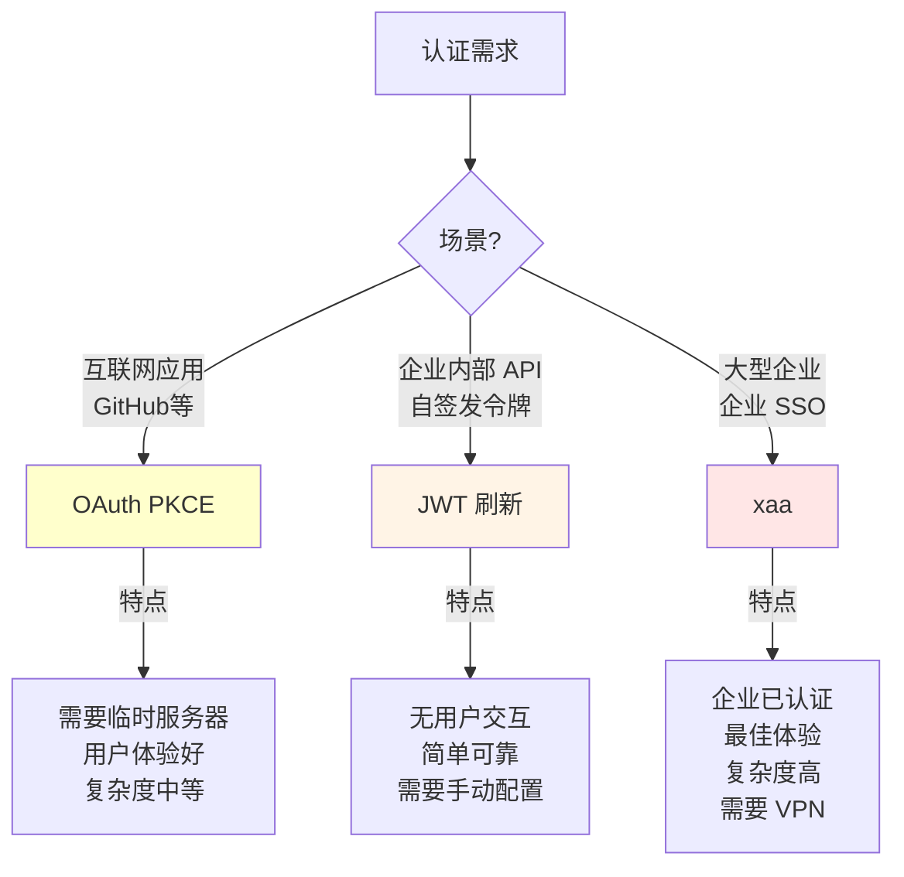
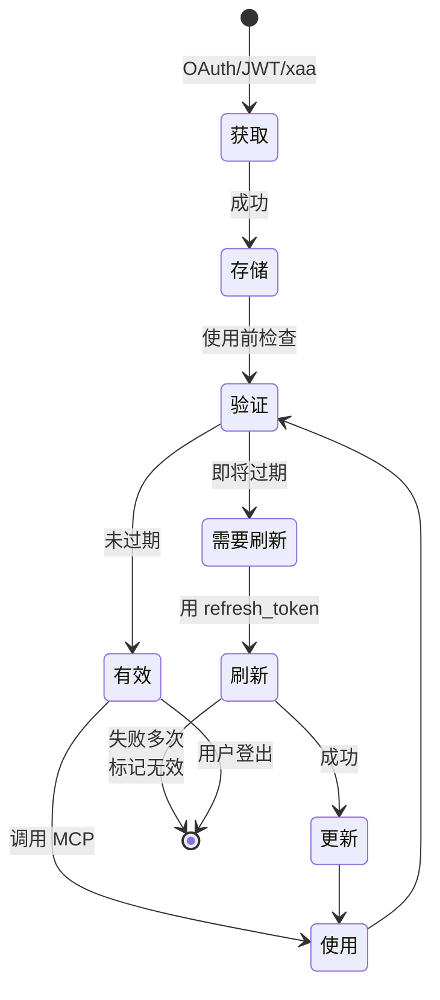
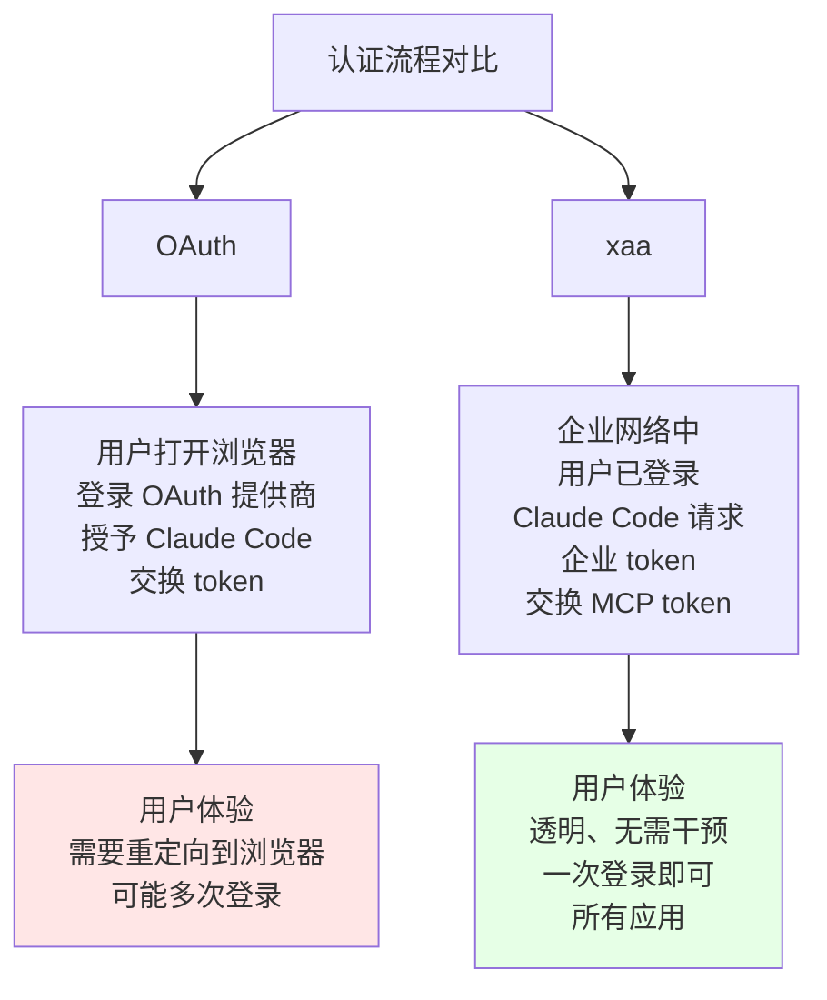

# 第 28 章：MCP 认证——OAuth、JWT 与 xaa 身份验证
> 当 MCP 服务器需要登录时，Claude Code 怎么帮你完成身份验证？为什么本地要启动一个 HTTP 服务器？
---
在第 27 章中，我们看到了三种协议如何建立与 MCP 服务器的连接。但连接建立后，有个问题还没解决：**身份验证**。
很多 MCP 服务器不是公开的。GitHub MCP 需要 API 令牌证明你有权限访问那个 GitHub 账户。企业的数据库 MCP 需要证明你是公司员工。
Claude Code 需要支持多种认证方式，因为不同的 MCP 服务器使用不同的认证体系。互联网应用通常用 OAuth。企业内部服务可能用 JWT 或企业 SSO。
对于 OAuth，有个有趣的细节：CLI 应用怎么接收回调？一个公网地址上的 Web 应用可以有一个固定的回调 URL，但 Claude Code 运行在用户的本地机器上，没有公网地址。答案是：启动一个临时的本地 HTTP 服务器，使用 `localhost:port` 作为回调端点。
这一章深入这个认证机制：OAuth PKCE 流程的每一步、JWT 令牌刷新的调度、企业 xaa 认证的工作原理、以及在所有情况下如何安全存储和管理令牌。

## 28.1 MCP 认证的三条路径
### 定义与问题
GitHub MCP 需要 API 令牌。数据库 MCP 需要密码。企业 MCP 需要企业单点登录。
Claude Code 需要支持不同的认证方式，同时保证安全性和用户体验。
**三条认证路径**（在 `src/services/mcp/` 中）：
1. **OAuth PKCE 流程**（`oauthPort.ts`）
   - 用途：互联网应用（GitHub、Google 等）
   - 流程：用户授权 → 临时回调服务器捕获授权码 → 交换 Access Token
2. **JWT 令牌刷新**（`auth.ts`）
   - 用途：企业内部 API（自签发的令牌）
   - 流程：定期更新 Access Token，防止过期
3. **xaa（跨应用访问）**（`xaa.ts`）
   - 用途：大型企业统一认证（Okta、Azure AD 等）
   - 流程：企业单点登录 → 请求企业令牌 → MCP 服务器验证
### 设计意图
**为什么需要三种？**
```
统一方案（假设只有 OAuth）：
  所有 MCP 都必须支持 OAuth
  问题：企业内部自建服务不方便暴露为 OAuth
  结果：集成难度高
多路径方案（现状）：
  不同的 MCP 可以用不同的认证方式
  好处：最大化兼容性，满足多种场景
  代价：系统复杂性提高
```
---
## 28.2 OAuth PKCE 流程的深入
### 定义
PKCE (Proof Key for Code Exchange) 是 OAuth 2.0 的安全扩展，特别适合 CLI 应用（缺少后端服务器的情况）。
**完整流程**（在 `src/services/mcp/oauthPort.ts`）：
#### 步骤一：本地回调服务器启动
在第 36 行的 `findAvailablePort()`：
```typescript
export async function findAvailablePort(): Promise<number> {
  // 找一个可用的本地端口（随机从高位端口中选择）
  // 例如：5678、7890 等
}
```
**目的**：为了接收 OAuth 提供商的回调。
```
OAuth 流程要求有一个"回调 URL"，例如：
  http://localhost:5678/mcp/oauth/callback
Claude Code 在启动 OAuth 流程前，先启动一个临时的 HTTP 服务器
监听 /mcp/oauth/callback 端点，等待提供商的回调。
```
#### 步骤二：构建重定向 URI
在第 21 行的 `buildRedirectUri()`：
```typescript
export function buildRedirectUri(
  authorizeUrl: string,
  clientId: string,
  port: number,
  // ...
): URL {
  // 构建类似于：
  // https://oauth-provider.com/authorize?
  //   client_id=xxx
  //   redirect_uri=http://localhost:5678/callback
  //   code_challenge=yyy
  //   state=zzz
}
```
#### 步骤三：用户在浏览器授权
```
Claude Code 打开用户的默认浏览器
  ↓
用户在 GitHub 等平台登录并授权
  ↓
授权提供商重定向到 http://localhost:5678/callback?code=xxxxx&state=zzz
```
#### 步骤四：本地服务器捕获授权码
```typescript
// 伪代码（第 36+ 行的逻辑）
const callbackServer = createHttpServer()
callbackServer.on('request', (req, res) => {
  if (req.url.startsWith('/callback')) {
    const authorizationCode = parseUrl(req.url).code
    // 立即返回 200 OK 给浏览器
    res.end('Authorization successful, close this window')
    // 后台：用授权码交换 Access Token
    const accessToken = await exchangeAuthorizationCode(authorizationCode)
    // 保存令牌
    saveTokenLocally(accessToken)
    // 关闭临时服务器
    callbackServer.close()
  }
})
```
#### 步骤五：安全检查
**PKCE 的关键安全机制**：
```
问题：如果有攻击者在网络中截获了授权码，怎么办？
OAuth 的初始设计（不安全）：
  attacker 拿到授权码 → 可以直接用它交换 token
PKCE 的解决方案：
  1. 客户端生成一个随机字符串（code_verifier）
  2. 对字符串进行哈希（code_challenge = SHA256(code_verifier)）
  3. 在发起授权时，提交 code_challenge
  4. 授权提供商记录这个 code_challenge
  5. 当用授权码交换 token 时，必须提交原始的 code_verifier
  6. 提供商验证：SHA256(code_verifier) == code_challenge
即使 attacker 拿到授权码，也无法交换 token（因为没有 code_verifier）
```
**状态参数防 CSRF**：
```
CSRF (Cross-Site Request Forgery) 攻击：
  恶意网站在用户浏览器中注入请求，导致授权流程被劫持
防护机制：
  1. Claude Code 生成一个随机的 state 参数
  2. 在授权请求中包含 state
  3. 授权完成后，提供商会回传相同的 state
  4. Claude Code 验证返回的 state 是否匹配
如果不匹配，说明这不是合法的回调
```
### 为什么是三步认证？
在第 63 行的注释中提到"metadata discovery"，这是第一步：
```typescript
// OAuth 通常分为三个请求：
// 1. 获取 .well-known/oauth-authorization-server
//    （发现 OAuth 提供商的端点）
// 2. 用授权码交换 token
// 3. 验证 token 的有效性
const OAUTH_REQUEST_TIMEOUT = 10_000  // 10 秒超时
```
---
## 28.3 JWT 令牌刷新调度器
### 定义
访问令牌（Access Token）通常有有效期（如 1 小时）。但一个 REPL 会话可能运行几小时。所以系统需要在过期前自动更新令牌。
**令牌类型**（在 `src/services/mcp/auth.ts` 第 140-150 行）：
```typescript
// 访问令牌（Access Token）
export const ACCESS_TOKEN_REFRESH_FAILURE_REASONS = [
  'invalid_refresh_token',
  'expired_refresh_token',
  'token_expired',
  // ...
] as const
```
### 刷新机制
**时间轴**：
```
时刻 0min：
  获得 Access Token
  过期时间：60 分钟
系统计算刷新时机：
  刷新时间 = 过期时间 - 5 分钟 = 第 55 分钟
时刻 55min：
  调度器触发
  用 refresh_token 请求新的 access_token
  成功 → 更新本地存储
时刻 60min：
  原令牌本应过期，但已被新令牌替换
  后续 MCP 请求使用新令牌
```
### 为什么提前 5 分钟？
```
缓冲区设计：
  - API 请求执行时间：通常 100-500ms
  - 网络延迟：20-100ms
  - 系统处理：10-50ms
总不确定性：~150-650ms
如果在恰好第 60 分钟时刷新，可能：
  1. 请求发出但响应慢
  2. 令牌在等待中已过期
  3. 后续请求被拒绝
提前 5 分钟（300,000ms）的缓冲：
  即使请求被延迟 1-2 分钟，也不会过期
```
### 刷新失败的处理
在第 141-150 行，定义了多个失败原因：
```typescript
// 标准 OAuth 错误
'invalid_refresh_token'      // 刷新令牌本身无效
// Slack 等服务的非标准错误
'expired_refresh_token'      // 刷新令牌已过期
'token_expired'              // 也表示过期
```
**处理策略**（伪代码）：
```typescript
if (refreshFailureReason === 'invalid_refresh_token') {
  // 令牌已被撤销或失效
  // 策略：禁用该 MCP，提示用户重新认证
  disableMCP(name)
  showNotification('请重新授权 ' + name)
} else if (refreshFailureReason === 'expired_refresh_token') {
  // 刷新令牌过期了（通常是 14-30 天后）
  // 策略：同样需要重新认证
  disableMCP(name)
  showNotification('认证已过期，请重新授权')
}
```
---
## 28.4 xaa（跨应用访问）企业认证
### 定义
在大型企业中，员工可能有一个企业账户（通过 Okta、Azure AD 等），用于登录多个内部系统。xaa 是一个机制，允许 Claude Code 利用现有的企业认证，而不需要单独的密码或令牌。
**工作原理**（在 `src/services/mcp/xaa.ts` 第 337+ 行的 `exchangeJwtAuthGrant()`）：
#### 步骤一：发现认证服务器
在第 178 行的 `discoverAuthorizationServer()`：
```typescript
export async function discoverAuthorizationServer(
  issuer: string  // 例如：https://company.okta.com
): Promise<AuthorizationServerMetadata> {
  // 调用 https://company.okta.com/.well-known/oauth-authorization-server
  // 获取认证服务器的元数据（端点、支持的授权类型等）
}
```
#### 步骤二：获取企业令牌
企业认证系统检查用户是否已登录（例如通过企业 VPN 或浏览器登录）。如果已登录，可以下发企业令牌。
#### 步骤三：交换 MCP 令牌
在第 337 行的 `exchangeJwtAuthGrant()`：
```typescript
export async function exchangeJwtAuthGrant(opts: {
  authorizationServerMetadata: AuthorizationServerMetadata
  clientAssertion: string  // 企业令牌
}): Promise<XaaResult> {
  // 用企业令牌交换 MCP 服务器的访问令牌
  // MCP 服务器验证这个令牌（由同一个企业 IdP 签发）
  // 验证成功 → 返回 MCP 的访问令牌
}
```
### xaa 的优势
**相比 OAuth 的优势**：
| 维度 | OAuth | xaa |
|------|-------|-----|
| 用户体验 | 需要每个应用单独登录 | 企业已认证，无需额外登录 |
| 安全性 | 各应用独立管理令牌 | 企业中央管理，更安全 |
| 管理成本 | IT 需要管理多个账户 | 企业统一管理 |
| 适用范围 | 互联网应用 | 企业内部应用 |
### xaa 的缺点
```
对用户的要求：
  ✗ 必须在企业网络中（或 VPN）
  ✗ 必须已经通过企业 SSO 登录
  ✗ 企业 IdP 必须支持 xaa（不是所有 IdP 都支持）
```
---
## 28.5 令牌生命周期管理
### 定义
从获取令牌到令牌过期，整个生命周期需要被妥善管理。
**四个阶段**：
#### 第一阶段：获取
```
OAuth：用户授权 → 系统交换 access_token
JWT：API 返回 token
xaa：企业 IdP 下发企业令牌 → 交换 MCP token
```
#### 第二阶段：存储
**存储位置的权衡**：
```
方案 A：本地文件 (~/.claude/mcp-tokens)
  优点：
    ✓ 简单，不依赖系统
  缺点：
    ✗ 明文存储，安全风险
    ✗ 需要严格的文件权限（600）
方案 B：系统钥匙链（macOS Keychain、Windows Credential Manager）
  优点：
    ✓ 系统级加密存储
    ✓ 安全性高
  缺点：
    ✗ 依赖操作系统
    ✗ 某些企业环境不支持
现状：两种都支持，用户可选（或系统自动选择最安全的）
```
#### 第三阶段：验证与刷新
```
每次使用令牌前：
  1. 检查过期时间
  2. 如果离过期时间 < 5 分钟，立即刷新
  3. 如果已过期，提示用户重新认证
周期性刷新（例如每小时）：
  调度器检查所有 MCP 的令牌
  对即将过期的令牌执行刷新
```
#### 第四阶段：失效
```
主动失效：
  用户执行 `/mcp auth logout <name>`
  系统删除存储的令牌
被动失效：
  刷新失败多次
  系统判定令牌已被撤销
  标记为失效，等待用户重新认证
```
---
## 28.6 认证失败的处理与降级
### 定义
认证过程可能在多个环节失败。系统需要检测并处理这些失败。
**失败点**：
```
1. OAuth 元数据发现失败
   原因：网络不通、提供商地址错误
   处理：重试 3 次，3 次都失败则报错
2. 授权码交换失败
   原因：授权码无效、客户端 ID 错误
   处理：提示用户检查配置
3. 令牌刷新失败
   原因：刷新令牌已过期、被撤销
   处理：标记需要重新认证
4. xaa 令牌交换失败
   原因：企业 IdP 无法验证
   处理：检查是否在企业网络中
```
### 降级策略
**第一次失败**：
```
假设获取工具列表时发生认证错误
响应：
  记录错误，但不禁用 MCP
  提示用户："认证可能需要更新"
  建议：`/mcp auth status`
```
**第二-三次失败**：
```
提示用户需要重新认证
给出具体操作步骤
例如：
  Error: Failed to authenticate with GitHub MCP
  重新认证：
    /mcp auth login github
  查看状态：
    /mcp auth status
```
**多次失败**：
```
如果同一个 MCP 在一个会话内失败 5+ 次
操作：
  禁用该 MCP（防止继续浪费资源）
  提示用户检查：
    1. 网络连接
    2. 企业 VPN
    3. MCP 配置
```
---
## 认证失败与恢复的实战场景
### 反例一：PKCE 流程中的超时
```
场景：用户执行 /mcp auth login github
第 1 步：启动本地回调服务器
  端口：5678
第 2 步：打开浏览器
  用户看到 GitHub 登录页面
第 3 步：用户授权后浏览器重定向
  http://localhost:5678/callback?code=abc123&state=xyz
第 4 步：本地服务器捕获授权码
  extracting code...
第 5 步：交换 token（超时）
  连接 GitHub OAuth 端点超过 10 秒（OAUTH_REQUEST_TIMEOUT）
结果：
  ❌ "OAuth request timeout"
  用户必须重新授权
  本地服务器已关闭
原因：
  网络问题、GitHub API 故障或用户网络太慢
```
### 反例二：JWT 令牌刷新失败的级联
```
场景：长时间运行的 REPL 会话（6 小时）
第 1 小时：
  用户获得 access_token（过期时间 1 小时）
  系统设置刷新任务（55 分钟后执行）
第 55 分钟：
  刷新任务触发
  用 refresh_token 交换新 token
  ❌ 刷新失败（原因：refresh_token 过期了）
第 56 分钟：
  用户仍在工作
  尝试调用 MCP 工具
  使用旧的（已过期）access_token
  ❌ API 拒绝
第 57 分钟：
  系统检测到多次失败
  标记该 MCP 为"需要重新认证"
用户体验：
  工作突然中断
  需要手动 /mcp auth login
如何避免：
  refresh_token 有效期更长（14-30 天）
  定期更新它，不要等到过期
```
### 反例三：xaa 令牌交换失败
```
场景：企业环境中的 xaa 认证
前置条件：
  用户在公司 VPN 中
  已通过 Okta 单点登录认证
第 1 步：Claude Code 向企业 IdP 请求 xaa 令牌
  发现 Okta 服务器
  请求企业令牌
第 2 步：IdP 检查用户身份
  发现用户不在 VPN 中（突然离线）
  ❌ 拒绝颁发令牌
第 3 步：Claude Code 无法连接 MCP
  MCP 需要有效的企业令牌
  没有令牌就无法工作
用户体验：
  ❌ \"Authentication failed: XaaTokenExchange error\"
  用户可能不知道是 VPN 断掉了
  需要系统提示：\"Please check your VPN connection\"
```
### 反例四：令牌泄露的安全风险
```
风险场景一：本地文件存储明文令牌
  存储位置：~/.claude/mcp-tokens
  权限设置不当：644（可读）
  攻击：
    恶意进程读取令牌
    用令牌冒充用户
    访问企业数据库/GitHub 账户
  防护（当前）：
    ✓ 系统会检查文件权限
    ✓ 使用系统钥匙链（macOS Keychain）更安全
风险场景二：网络中的令牌拦截
  HTTPS 虽然加密传输，但：
    如果 SSL/TLS 证书被中间人攻击替换
    或网络被劫持
    令牌可能被窃取
  防护：
    ✓ PKCE 使用 code_verifier，授权码本身没用
    ✓ short-lived access_token（1 小时过期）
    ✓ refresh_token 通常不在网络上传输（存储在本地）
```
---
## 图解

**图 28-1：OAuth PKCE 完整序列**

**图 28-2：JWT 令牌刷新时间轴**

**图 28-3：三种认证方式的对比**

**图 28-4：令牌生命周期**

**图 28-5：xaa 与 OAuth 的对比**

---


## 认证设计的权衡

### 为什么用 OAuth PKCE 而不是简单的 API Key？

API Key 最简单：`Authorization: Bearer sk-xxx`。但 MCP 认证选择了 OAuth PKCE，原因是：

1. **API Key 无法按用户区分**：MCP 服务器不知道是哪个用户在调用，无法做用户级的限流和审计
2. **API Key 泄漏无法撤销**：密钥一旦泄漏，只能整体更换，影响所有用户
3. **OAuth 支持细粒度权限**：用户可以只授予 MCP 服务器读取代码仓库的权限，而不是全部权限

OAuth PKCE（而非标准 OAuth Code Flow）的原因：PKCE 不需要服务端存储 client_secret，适合没有后端的 CLI 工具（`src/services/mcp/auth.ts:48`）。

### 为什么用本地 HTTP 回调而不是 URN？

```
OAuth 标准做法（Web 应用）：https://myapp.com/callback
CLI 工具的做法（Claude Code）：http://localhost:随机端口/callback
```

CLI 工具没有固定的回调 URL，因此在本地启动临时 HTTP 服务器接收授权码（`src/services/mcp/oauthPort.ts`）。每次认证使用随机端口（`findAvailablePort()`），避免端口冲突。

### JWT 刷新为什么要预防性刷新，而不是等到过期？

```
等到过期再刷新（危险）：
  用户正在执行工具 → token 突然过期 → 工具调用失败 → 体验差

预防性刷新（Claude Code 的做法）：
  检测到 token 5 分钟内过期 → 后台静默刷新 → 用户无感知
```

JWT 的 `exp` 字段提前 5 分钟触发刷新调度器（`src/services/mcp/auth.ts`），确保正在进行的工具调用不会因 token 过期而中断。


## 模式提炼
### 模式一：OAuth PKCE 与临时回调服务器（Temporary Callback Server for OAuth PKCE）
**解决的问题**：CLI 应用没有公网地址，无法接收 OAuth 回调。
**核心做法**：在认证过程中启动临时 HTTP 服务器，使用 `localhost:port` 作为回调 URL。完成认证后立即关闭。
**前置条件**：需要找到可用端口、启动 HTTP 服务器、处理请求。
**源码证据**：`src/services/mcp/oauthPort.ts` 的 `findAvailablePort()` 和 `buildRedirectUri()`。

---

### 模式二：令牌刷新的预防性调度（Proactive Token Refresh Scheduling）
**解决的问题**：等到令牌过期再处理太晚了，会导致请求失败。
**核心做法**：计算令牌的过期时间，在过期前 5 分钟启动刷新，确保新令牌在需要时已准备好。
**前置条件**：需要计时器系统、刷新逻辑、失败处理。
**源码证据**：`src/services/mcp/auth.ts` 的令牌刷新逻辑和超时定义。

---

### 模式三：企业 SSO 与联邦认证（Enterprise SSO with Token Federation）
**解决的问题**：企业员工需要在多个内部系统中认证，重复登录会降低生产力。
**核心做法**：信任企业的中央身份提供商（IdP），通过 xaa 机制直接交换企业令牌。
**前置条件**：需要与企业 IdP 集成、支持 JWT 和 OAuth 扩展。
**源码证据**：`src/services/mcp/xaa.ts` 的 `discoverAuthorizationServer()` 和 `exchangeJwtAuthGrant()`。

---

### 模式四：多重失败处理的渐进式降级（Graduated Failure Handling）
**解决的问题**：认证失败的原因多种多样，简单的重试或完全禁用都不理想。
**核心做法**：根据失败次数和失败原因，采取不同的策略：首次忽略、多次提示、最终禁用。
**前置条件**：需要失败计数、错误分类、降级策略。
**源码证据**：`src/services/mcp/auth.ts` 的错误处理逻辑。

---

## 踩坑

### ❌ 把 MCP 服务器的 OAuth token 存在明文配置文件里

```json
// ~/.claude/mcp_servers.json（❌ 明文 token）
{ "github": { "token": "ghp_xxxxxxxxxxxx" } }
```

配置文件容易被意外提交到 git，或者被同机器的其他程序读取。应该用系统 keychain（macOS Keychain、Linux Secret Service）存储 token（`src/services/mcp/auth.ts`）。

### ❌ 不处理 JWT 过期（exp 字段），直接用过期 token 调用服务

JWT token 有 exp 字段表示过期时间。不检查过期直接用，会在 token 过期后每次 MCP 调用都返回 401，用户需要手动重新登录。应该在调用前检查是否即将过期，提前静默刷新。

### ❌ 所有 MCP 服务器共用同一个 token，权限范围过大

不同 MCP 服务器有不同的权限范围（读文件、写数据库、调外部 API）。共用一个 token 意味着任意一个服务器的 token 泄漏，所有权限都暴露。最小权限原则：每个 MCP 服务器独立的 token。

## 你能做什么

- **把 MCP token 存入系统 keychain**：macOS Keychain、Linux Secret Service，不要用明文文件
- **在调用前检查 JWT 的 exp 字段**：提前 5 分钟检测到过期时静默刷新，用户无感知
- **为每个 MCP 服务器申请独立的 token**：最小权限原则，一个 token 泄漏不影响其他服务
- **记录 OAuth 授权流程的每个步骤**：Authorization Code Flow 的 state 参数防 CSRF，redirect_uri 校验防重定向攻击，这两个地方不能省略

## 核心源码锚点

| 位置 | 内容 | 工程意义 |
|------|------|---------|
| `src/services/mcp/auth.ts:48` | `import { buildRedirectUri, findAvailablePort }` | OAuth 本地回调的核心辅助函数 |
| `src/services/mcp/auth.ts:51` | `import { performCrossAppAccess, XaaTokenExchangeError }` | xaa 企业认证入口 |
| `src/services/mcp/auth.ts:63` | OAuth 请求超时常量定义 | 每个 OAuth 请求的超时配置 |
| `src/services/mcp/auth.ts:84` | `MCPOAuthFlowErrorReason` 类型定义 | OAuth 流程各错误情况的枚举 |
| `src/services/mcp/oauthPort.ts` | `findAvailablePort()` + `buildRedirectUri()` | OAuth 回调的本地服务器端口管理 |
| `src/services/mcp/xaa.ts` | `discoverAuthorizationServer()` + `exchangeJwtAuthGrant()` | xaa 认证的核心流程 |

**精确引用验证**：`src/services/mcp/auth.ts:51` 导入 `XaaTokenExchangeError`——这个独立的错误类型说明 xaa（跨应用访问）认证有不同于标准 OAuth 的错误处理路径，系统可以区分"标准 OAuth 失败"和"企业 xaa 特有失败"并分别处理。
