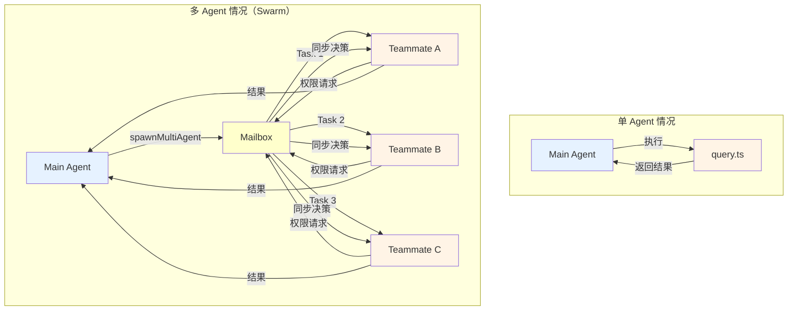
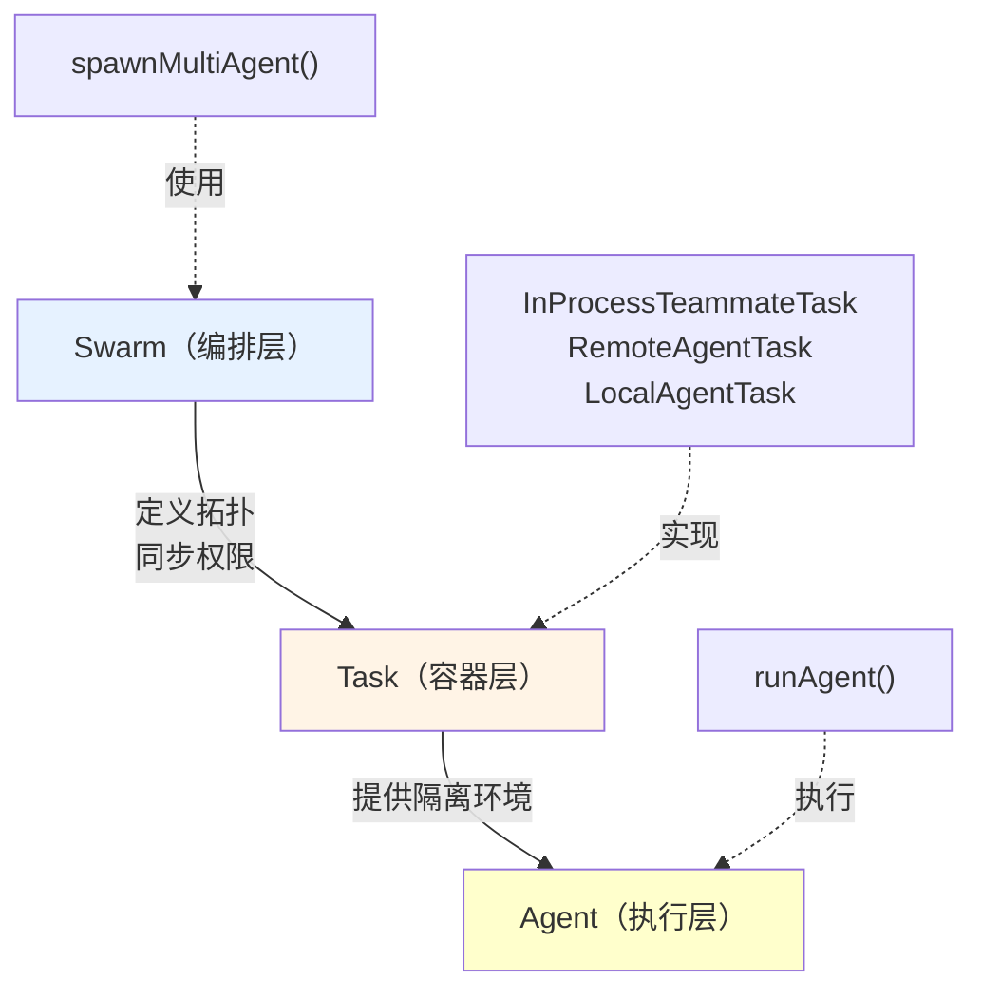
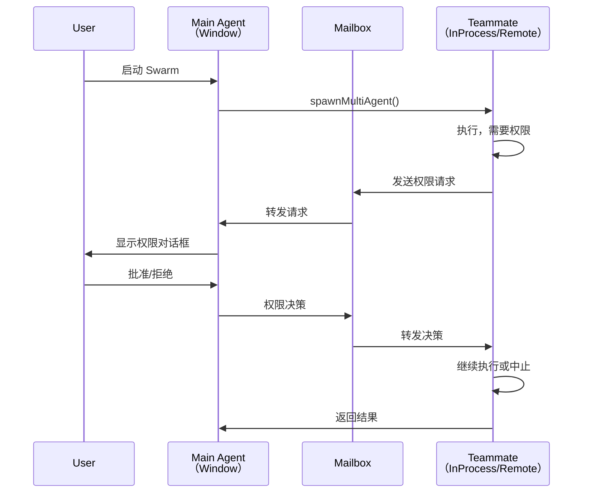
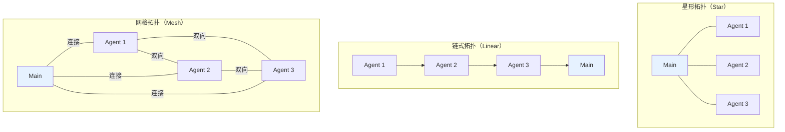

# 第 29 章：多智能体系统的三层模型
> 当你在 Claude Code 中调用一个"研究员代理"去搜集信息，同时另一个"验证代理"在验证方案时，这两个 Agent 之间是如何协作的？为什么不直接并行运行，而是需要一个"Swarm"来编排它们？
---
前面的章节讲的都是单个 Agent 的运行逻辑。但在实际的工作流中，有时候需要多个 Agent 同时工作——研究员搜集信息、编码者写代码、验证者检查质量。
这样的多 Agent 系统有三个难点：
1. **隔离性**：每个 Agent 的上下文、权限、内存必须独立，否则会互相污染。
2. **协调性**：权限决策、结果合并需要一个中心枢纽（Swarm）来协调。
3. **可扩展性**：有时候 Agent 需要运行在不同的机器或容器中，不能只在单进程内执行。
Claude Code 的解决方案是一个优雅的三层设计：
- **Swarm** 负责全局编排和权限同步
- **Task** 根据需要选择合适的隔离策略
- **Agent** 核心逻辑保持不变，无需感知多 Agent 的存在
这一章先讲三层模型的整体架构，后续几章会深入每一层的实现细节。

## 29.1 多智能体协作的困难
### 定义与问题
在第 13 章，我们看到了 AgentTool——一个工具可以调用另一个 Agent，形成递归智能体。但这有个本质的限制：**同一时刻只能有一个 Agent 在执行**。当用户想要多个 Agent 同时工作（如"研究员"搜集信息，"编码者"开始写代码），系统需要什么？
**三个并发问题**：
```
问题 1：隔离性
  两个 Agent 同时运行，但它们各自需要：
  - 独立的上下文累积（不互相污染）
  - 独立的工具操作权限检查
  - 独立的记忆快照（便于回滚或对比）
  如何在共享底层的 Claude Code 运行时中实现隔离？
问题 2：协调性
  当 Agent A 申请权限时（如"允许删除文件"），
  这个权限请求在 Agent A 自己的进程内部无法显示给用户
  （用户也许正在与主 Agent 交互）。
  如何在独立的子 Process/Thread 中通知主进程用户的决策？
问题 3：资源消耗
  两个 Agent 同时运行意味着两倍的 API 调用成本。
  有时用户想要"快速模式"：
  - 一个 Agent 用快速的 Haiku 模型
  - 另一个用更强的 Opus 模型
  系统如何管理这种异构的计算资源？
```
### 设计意图
Claude Code 引入**三层模型**来解决这些问题：
```
第一层：Swarm（群）
  职责：编排多个 Agent 的生命周期
  特点：负责启停、权限同步、记忆合并
  位置：`src/tools/shared/spawnMultiAgent.ts`
第二层：Task（任务）
  职责：Agent 的执行容器（InProcess/Remote/等）
  特点：决定 Agent 如何隔离和执行
  位置：`src/tasks/`
第三层：Agent（代理）
  职责：单个 Agent 的核心循环逻辑
  特点：与单 Agent 情况完全相同，无需改动
  位置：`src/tools/AgentTool/runAgent.ts`
```
---
## 29.2 三层模型的架构
### 定义
**Swarm**（群）是多个 Agent 的集合。它不是一个单一的概念，而是通过 Task 的组合来实现：
```
Swarm 的结构（在应用状态中）：
  - leaderId：主 Agent 的 ID（通常是 "main"）
  - teammates：list of TeammateIdentity
    {
      agentId: "researcher@my-team"
      agentName: "researcher"
      teamName: "my-team"
      parentSessionId: "session-123"  // 指向主 Agent 的会话
      planModeRequired: false
    }
  - mailbox：权限请求/决策的通道
```
### 三种 Task 类型
在 `src/tasks/` 中，Claude Code 定义了多种 Task：
| Task 类型 | 位置 | 执行模式 | 隔离性 | 权限同步 |
|---------|------|--------|--------|---------|
| **InProcessTeammateTask** | `src/tasks/InProcessTeammateTask/` | 同进程，不同 AsyncLocalStorage | 中等 | 通过 Mailbox 异步 |
| **RemoteAgentTask** | `src/tasks/RemoteAgentTask/` | 子进程或远程 | 高 | 通过 IPC/网络 |
| **LocalAgentTask** | `src/tasks/LocalAgentTask/` | 同进程但不同栈帧 | 低 | 直接共享 |
**为什么需要三种？**
```
统一方案（假设只用 InProcessTeammateTask）：
  所有 Agent 都在同一进程中
  优点：快速、无 IPC 开销
  缺点：
    ✗ 上下文污染（全局状态修改互相影响）
    ✗ 权限请求难以隔离
    ✗ 无法在不同机器上运行 Agent
多 Task 方案（现状）：
  开发者可以根据场景选择
  优点：
    ✓ 同进程快速模式
    ✓ 子进程隔离模式
    ✓ 分布式模式
```
### TeammateIdentity 的设计
在 `src/tasks/InProcessTeammateTask/types.ts` 第 6-15 行：
```typescript
export type TeammateIdentity = {
  agentId: string                    // 唯一标识："researcher@my-team"
  agentName: string                  // 显示名："researcher"
  teamName: string                   // 团队名："my-team"
  color?: string                     // UI 展示颜色
  planModeRequired: boolean          // 是否需要显式计划批准
  parentSessionId: string            // 指向主 Agent 的会话
}
```
**字段的工程意义**：
- `agentId`：全局唯一，便于追踪和调试
- `parentSessionId`：建立 Teammate 与主 Agent 的隶属关系，权限决策时向主窗口展示
- `planModeRequired`：如果 true，该 Teammate 的每个 Planning 阶段需要人工审批
---
## 29.3 从单 Agent 到多 Agent 的变化
### 定义与对比
**单 Agent 情况**（第 8 章讲的 query.ts）：
```
用户输入
  ↓
Query Engine
  ↓
query.ts（单轮循环）
  ↓
返回结果给用户
```
**多 Agent 情况**（Swarm）：
```
用户输入给 Main Agent
  ↓
Main Agent 决定启动多个 Teammate
  ↓
spawnMultiAgent()（第 1093 行 src/tools/shared/spawnMultiAgent.ts）
  ├─ Teammate 1（Task 1）
  ├─ Teammate 2（Task 2）
  └─ Teammate 3（Task 3）
      都执行各自的 Query Engine
  ↓
权限请求通过 Mailbox 汇聚到 Main
  ↓
用户在 Main 窗口中一次性审批所有权限
  ↓
结果汇总，返回给用户
```
### 设计意图对比
**为什么是 spawnMultiAgent 而不是直接启动 runAgent？**
```
方案 A（直接 runAgent）：
  Agent A 调用 runAgent(Agent B)
  Agent B 执行完毕返回结果
  线性执行，没有并发
方案 B（spawnMultiAgent + Task）：
  Agent A 调用 spawnMultiAgent([Agent B, Agent C])
  返回立即执行（不等待 B、C 完成）
  B、C 并发运行
  结果通过 Promise/callback 异步收集
选择 B 的理由：
  ✓ 支持真正的并发（多个 Agent 同时工作）
  ✓ 资源高效（不阻塞主线程等待）
  ✓ 扩展性（可轻松添加 Task 类型）
```
---
## 29.4 Swarm 中的权限决策流
### 定义
当一个 Teammate 需要执行"删除文件"操作时，系统需要向用户请求批准。但 Teammate 可能运行在不同的 Task 容器中，权限对话框该如何显示？
**解决方案：Mailbox 机制**（详见第 32 章）
在 `src/utils/swarm/permissionSync.ts` 第 928 行：
```typescript
// 伪代码表示流程
function onTeammatePermissionRequest(request: PermissionRequest) {
  // 1. Teammate 发出权限请求
  // 2. 通过 Mailbox 发送到主 Agent
  mailbox.send({
    from: "researcher@my-team",
    type: "permission_request",
    action: "execute_bash",
    command: "rm -rf /tmp/old_build",
    timestamp: Date.now()
  })
  // 3. 主 Agent 窗口显示对话框
  // 4. 用户批准或拒绝
  // 5. 决策通过 Mailbox 返回给 Teammate
  // 6. Teammate 继续执行或中止
}
```
### 权限同步的三个关键步骤
**步骤 1：权限提升（Permission Promotion）**
当 Teammate 访问某个权限时，需要向上报告给主 Agent：
```
Teammate 申请执行 Bash
  → 检查本地权限规则（严格）
  → 如果本地拒绝，返回立即拒绝
  → 如果本地允许，转发给主 Agent 验证
  → 主 Agent 根据全局规则再次决策
```
**步骤 2：权限缓存（Permission Cache）**
为了避免重复问用户，系统缓存决策：
```
用户第 1 次批准 "bash for research"
  → 决策存储到本地权限规则
  → 后续 Teammate 的相同请求不再打扰用户
```
**步骤 3：权限回滚（Permission Rollback）**
当 Teammate 任务失败或用户取消时，之前的权限提升应被撤销：
```
Teammate 失败
  → 删除临时权限提升
  → 恢复到初始状态
```
---
## 29.5 多 Agent 的内存管理
### 定义
每个 Agent 维护自己的"思考历史"（对话轮次）。但在 Swarm 中，多个 Agent 的内存如何合并？
**场景**：
```
Main Agent（5 轮对话） + Research Agent（3 轮对话）
  → 合并后是 8 轮吗？还是分开保存？
答案：分开保存，但会相互引用
```
### 内存快照机制（agentMemorySnapshot）
在 `src/tools/AgentTool/agentMemorySnapshot.ts`：
```
Main Agent 内存：
  [
    {role: "user", content: "研究 X"},
    {role: "assistant", content: "我会..."},
    {role: "user", content: "调用 Research Agent"},
  ]
Research Agent 的快照：
  [
    {role: "system", content: "You are research expert"},
    {role: "user", content: "研究 X 详情"},
    {role: "assistant", content: "我发现..."},
  ]
Main Agent 收到结果后：
  [
    ...之前的 3 条,
    {
      role: "tool",
      type: "teammate_result",
      content: {
        agent: "researcher",
        result: "...Research Agent 的完整内存...",
      }
    }
  ]
```
### 为什么要分开保存？
```
优点：
  ✓ 内存不会无限增长（每个 Agent 独立的 context 上限）
  ✓ 便于调试（可单独查看每个 Agent 的思考过程）
  ✓ 便于重用（Research Agent 的结果可复用给其他 Main Agent）
缺点：
  ✗ 合并结果时需要"翻译"（将 Research Agent 的 message 转为 Main 可理解的格式）
  ✗ 总的对话轮数增加，可能导致 context 溢出
```
---
## 29.6 三种协作拓扑
### 定义
根据 Swarm 中 Agent 之间的关系，有三种主要的协作拓扑：
#### 拓扑一：星形（Star Topology）
**结构**：
```
       Main Agent
      /   |   \
  Agent1 Agent2 Agent3
```
**特点**：
- 所有通信通过 Main Agent 中转
- 最简单，最容易实现
- 如果 Main Agent 出错，所有通信中断
**代码位置**：这是默认的 Swarm 拓扑
**适用场景**：
- 主要工作由 Main Agent 驱动
- Teammates 是辅助角色
#### 拓扑二：链式（Linear Topology）
**结构**：
```
Agent1 → Agent2 → Agent3 → Main
```
**特点**：
- Agent 1 的输出是 Agent 2 的输入
- 管道式处理
- 如果中间某个 Agent 出错，整条链断裂
**适用场景**：
- ETL 流程（Extract、Transform、Load）
- 数据处理流水线
#### 拓扑三：网格（Mesh Topology）
**结构**：
```
Agent1 ←→ Agent2
  ↕       ↕
Agent3 ←→ Agent4
```
**特点**：
- 任意两个 Agent 都可以通信
- 最灵活但最复杂
- 需要防止循环通信
**适用场景**：
- 复杂的团队协作（如代码审查 + 测试并行执行）
**当前限制**：第 32 章会讲，目前只支持星形和链式。网格拓扑通过 Mailbox 的消息路由可以部分模拟。
---
## 图解

**图 29-1：单 Agent 与多 Agent 的对比**

**图 29-2：Swarm 的三层模型**

**图 29-3：权限决策流**

**图 29-4：三种协作拓扑**

**表格 29-1：Task 类型对比**
| Task 类型 | 执行模式 | 隔离性 | 性能 | 权限同步 | 适用场景 |
|---------|---------|--------|------|---------|---------|
| InProcessTeammateTask | 同进程 | 中等（AsyncLocalStorage） | 高 | Mailbox | 快速、低开销 |
| RemoteAgentTask | 子进程 | 高（完全隔离） | 中等（IPC） | Mailbox + IPC | 高隔离需求 |
| LocalAgentTask | 同进程栈帧 | 低（共享全局状态） | 高 | 直接共享 | 快速原型 |
---


## 关键源码索引

| 位置 | 内容 | 意义 |
|------|------|------|
| `src/utils/swarm/teamHelpers.ts:45` | `SpawnTeamOutput` 类型 | 团队启动结果，包含 teamName 和 agentId |
| `src/utils/swarm/teamHelpers.ts:57` | `TeamAllowedPath` 类型 | 所有 Teammate 共享的可编辑路径列表 |
| `src/tools/AgentTool/AgentTool.tsx:195` | `Progress` 类型 | Agent 执行进度的实时传递 |
| `src/tools/AgentTool/AgentTool.tsx:196` | `AgentTool = buildTool(...)` | AgentTool 的构建入口 |
| `src/tools/AgentTool/runAgent.ts:248` | `runAgent()` 函数 | 子 Agent 的完整执行循环 |
| `src/utils/swarm/permissionSync.ts:49` | `SwarmPermissionRequestSchema` | 跨进程权限请求的数据结构定义 |

### 为什么 Swarm/Task/Agent 要分三层，而不是合并成一层？

每层解决不同粒度的问题：

- **Swarm 层**：解决"多个 Agent 如何协调"——路由策略、结果聚合、全局超时
  - 为什么不合并到 Agent：Agent 是无状态的对话循环，不应关心"其他 Agent 在做什么"
  
- **Task 层**：解决"Agent 如何执行"——进程隔离级别、通信方式、生命周期管理
  - 为什么不合并到 Swarm：Swarm 不知道也不应该知道 Agent 是同进程还是子进程
  
- **Agent 层**：解决"对话循环如何进行"——LLM 调用、工具执行、消息历史
  - 为什么不合并到 Task：对话逻辑与运行时隔离机制正交，分离让二者可以独立测试

**三层分离的核心价值**：Swarm 策略变化不影响 Task 实现；Task 实现变化不影响 Agent 逻辑。


## 模式提炼
### 模式一：分层隔离与代理模式（Hierarchical Isolation with Proxy）
**解决的问题**：多个 Agent 需要并发执行，但又需要在权限和资源上被统一管理。
**核心做法**：引入 Swarm 和 Task 的抽象层。Swarm 负责编排和权限同步，Task 负责执行隔离。每个 Teammate 通过 Task 容器隔离，但权限决策通过 Swarm 的 Mailbox 中转到主 Agent。
**前置条件**：需要抽象出 Task 接口、权限同步机制、AsyncLocalStorage 来存储上下文。
**源码证据**：`src/tools/shared/spawnMultiAgent.ts`、`src/tasks/InProcessTeammateTask/`、`src/utils/swarm/permissionSync.ts`

---

### 模式二：内存快照与上下文隔离（Memory Snapshot Isolation）
**解决的问题**：多个 Agent 的对话历史如何在不污染的前提下共存？
**核心做法**：每个 Agent 维护独立的内存（消息历史），当合并到主 Agent 时，用一个特殊的 `teammate_result` 消息来包装，而不是直接拼接。
**前置条件**：需要定义标准的消息类型、支持嵌套的消息结构。
**源码证据**：`src/tools/AgentTool/agentMemorySnapshot.ts`

---

### 模式三：三层解耦与扩展点（Three-Layer Decoupling）
**解决的问题**：如何在不修改 Agent 核心逻辑的前提下，支持多个执行模式（同进程、子进程、远程）？
**核心做法**：通过 Swarm → Task → Agent 的三层设计，使得不同的 Task 类型可以提供不同的隔离策略，而 Agent 层始终保持不变。
**前置条件**：需要定义 Task 的统一接口、支持可插拔的 Task 类型。
**源码证据**：`src/tasks/` 目录下的多种 Task 实现

---

## 延伸：SpawnTeamOutput 与 AgentTool 的连接点

多智能体系统的团队结构定义在 `src/utils/swarm/teamHelpers.ts`：

```typescript
// src/utils/swarm/teamHelpers.ts:45
export type SpawnTeamOutput = {
  teamName: string
  agentId: AgentId
  // 其他团队元数据
}

// src/utils/swarm/teamHelpers.ts:57
export type TeamAllowedPath = {
  path: string
  recursive: boolean
}
// 所有团队成员可以无需询问就编辑的路径列表
```

`TeamAllowedPath` 是多智能体系统的权限共享机制——主 Agent 把允许的路径列表传给子 Agent，子 Agent 在这些路径上操作不需要每次触发权限确认。这避免了多 Agent 并行工作时频繁弹出权限对话框的体验问题。

`AgentTool` 连接层的 Progress 类型（`src/tools/AgentTool/AgentTool.tsx`）展示了 AgentTool 如何把子 Agent 的执行状态实时传递给 UI 层：

```typescript
// src/tools/AgentTool/AgentTool.tsx（Progress 类型）
type Progress = {
  type: 'progress'
  agentId: AgentId
  status: 'running' | 'done' | 'error'
  // 实时进度信息
}
```

**AgentTool 与 Task 的连接**：AgentTool 的 `call()` 方法创建 Task（`InProcessTeammateTask` 或 `LocalAgentTask`），Task 负责实际执行，AgentTool 负责把 Task 的 Progress 事件 yield 给 `query.ts`，最终展示在 UI 上（`src/tools/AgentTool/AgentTool.tsx`）。

## 踩坑

### ❌ 主 Agent 同步等待所有子 Agent 完成，失去并行优势

```typescript
// ❌ 错误：串行等待，和单 Agent 没区别
for (const subAgent of subAgents) {
  const result = await subAgent.run()  // 每个串行等待
  results.push(result)
}
```

子 Agent 的核心价值是并行执行。应该用 `Promise.all()` 或轮询机制并发启动所有子 Agent（`src/agents/`）。

### ❌ 子 Agent 之间直接通信，形成复杂的通信图

子 Agent A 直接调用子 Agent B 的 API，绕过主 Agent 的协调。当 A 和 B 之间产生循环依赖，或者 B crash 而 A 在等待时，整个系统会陷入死锁。所有子 Agent 间的通信都应该通过主 Agent 路由。

### ❌ 没有设置子 Agent 的最大执行时间

某个子 Agent 陷入工具调用的无限循环，主 Agent 的 `Promise.all` 永远不会 resolve。所有子 Agent 都应该有超时限制，超时后强制终止并报告超时原因。

## 你能做什么

- **用 Promise.all 并发启动子 Agent**：不要串行等待，让子 Agent 真正并行执行
- **通过主 Agent 路由所有子 Agent 间通信**：避免形成难以追踪的 peer-to-peer 通信网格
- **为每个子 Agent 设置超时**：防止单个子 Agent 的 hang 拖垮整个系统
- **汇总子 Agent 的执行轨迹**：记录每个子 Agent 执行了什么工具、用了多少 token，便于调试和成本分析
