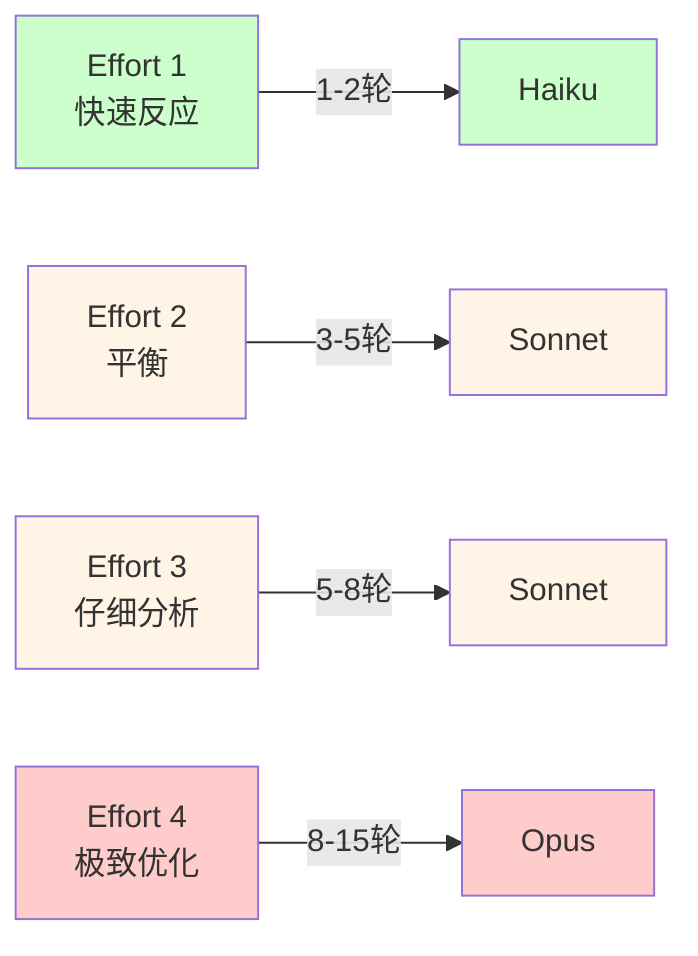
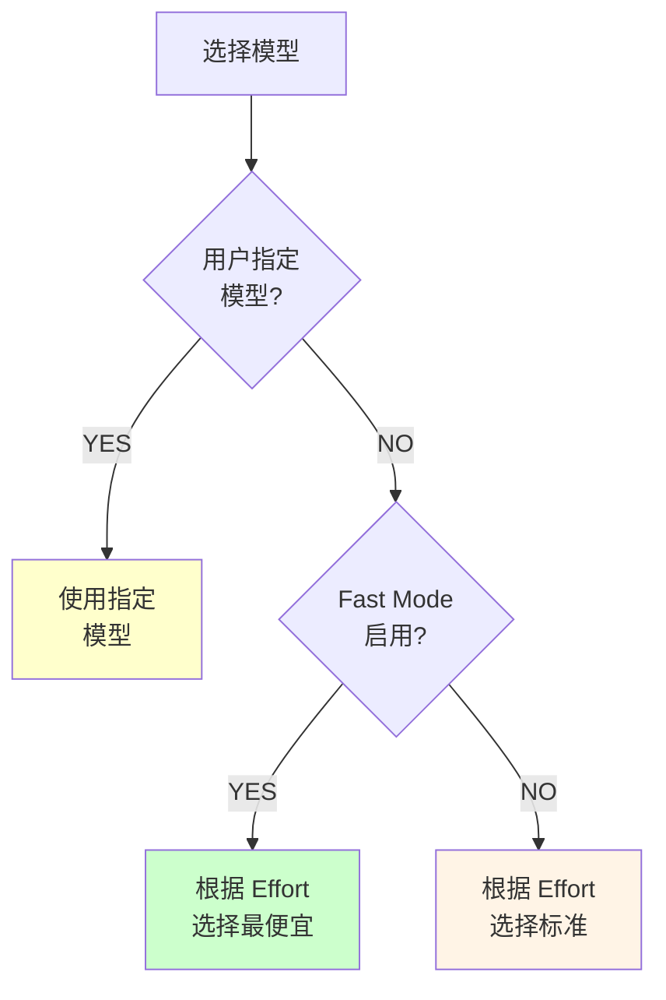
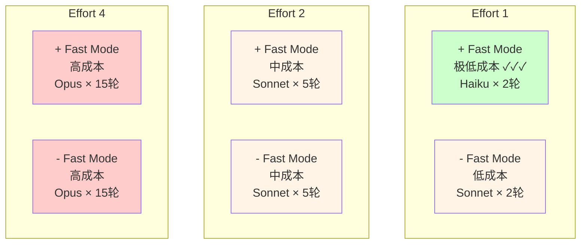
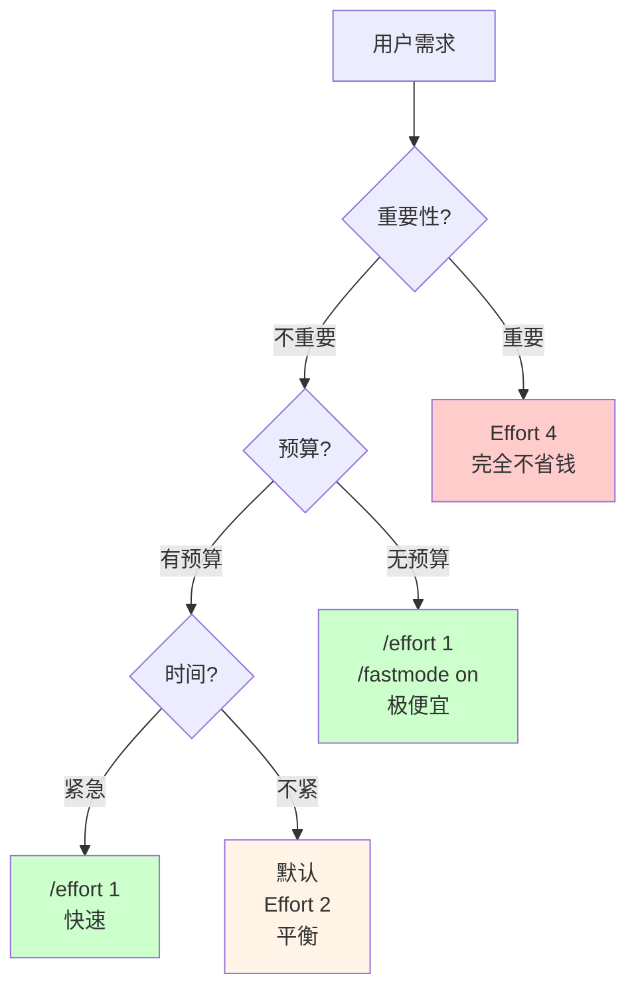

# 第 33 章：计算成本管理 - Effort 与 Fast Mode
> 用户在终端输入 `/effort 1` 时，Claude Code 应该怎么做？应该用性能最弱的模型吗？为什么还需要一个"Fast Mode"？这两者的关系是什么？
---
## 33.1 计算成本的困难
### 定义
每次调用 Claude API，都会产生成本。一个复杂的任务可能需要多轮对话，成本会迅速累积。
```
情景：用户要求 Claude Code "完整重构一个项目"
轮次 1：Claude Opus → 分析代码结构
  成本：$0.003（API 调用）
轮次 2：Claude Opus → 设计新架构
  成本：$0.005
轮次 3：Claude Opus → 实现模块 A
  成本：$0.010
轮次 4-10：... 继续
  成本：... 累积
────────────────────────────────
总成本：$0.10-0.50（一个中等任务）
问题：
  Q1：用户没有预算意识，可能被高额账单惊吓
  Q2：某些任务"很傻"（如简单搜索），不值得用 Opus
  Q3：某些任务"很重要"（如安全审计），必须用 Opus
  Q4：如何让用户在成本和质量之间权衡？
```
### 设计意图：Effort 与 Fast Mode
Claude Code 提供了两个控制成本的机制：
**Effort（努力级别）**：`/effort 1|2|3|4`
- 级别 1：最快、最便宜，但可能不准确
- 级别 2：平衡
- 级别 3：更用心
- 级别 4：最仔细、最昂贵
**Fast Mode**：`/fastmode on|off`
- On：优先使用快速模型（Haiku），成本最低
- Off：使用标准模型（Sonnet），成本中等
**关键区别**：
```
Effort 控制：对话轮次和思考深度
Fast Mode 控制：每轮使用的模型版本
结合使用：
  /effort 1 /fastmode on   → 最快最便宜（Haiku，1-2 轮）
  /effort 4 /fastmode off  → 最慢最昂贵（Opus，多轮思考）
```
---
## 33.2 Effort 级别的实现
### 定义与映射
每个 Effort 级别对应不同的工作策略：
| Effort | 策略 | 轮数预期 | 思考深度 | 模型 | 适用场景 |
|--------|------|---------|--------|------|---------|
| **1** | 快速反应 | 1-2 轮 | 浅 | Haiku | 简单查询、非关键 |
| **2** | 平衡 | 3-5 轮 | 中 | Sonnet | 一般编码任务 |
| **3** | 仔细分析 | 5-8 轮 | 深 | Sonnet | 复杂设计、审计 |
| **4** | 极致优化 | 8-15 轮 | 极深 | Opus | 关键任务、安全审查 |
### Effort 的控制点
**定义与获取**（`src/utils/effort.ts` 第 13-18 行）：
```typescript
export const EFFORT_LEVELS = [
  'low',
  'medium',
  'high',
  'max',
] as const satisfies readonly EffortLevel[]
```
系统支持 Effort 的条件检查（`src/utils/effort.ts` 第 22-45 行）：
```typescript
export function modelSupportsEffort(model: string): boolean {
  // 先检查环境变量是否强制启用
  if (isEnvTruthy(process.env.CLAUDE_CODE_ALWAYS_ENABLE_EFFORT)) {
    return true
  }
  // 只有 Claude 4 系列的特定版本支持 Effort
  if (m.includes('opus-4-6') || m.includes('sonnet-4-6')) {
    return true
  }
  // 排除旧模型（Haiku、Sonnet 3、Opus 3 等）
  if (m.includes('haiku') || m.includes('sonnet') || m.includes('opus')) {
    return false
  }
  // 第一方模型默认支持，第三方默认不支持
  return getAPIProvider() === 'firstParty'
}
```
**控制点 1：初始系统提示**
```typescript
// 根据 Effort 级别调整系统提示
const systemPrompt = buildSystemPrompt({
  effort: currentEffort,
  // ...
})
// 伪代码
if (currentEffort === 1) {
  systemPrompt += "Please respond quickly with the most essential answer only."
} else if (currentEffort === 4) {
  systemPrompt += "Provide thorough analysis. Consider edge cases and security implications."
}
```
**控制点 2：工具可用性**
某些工具在低 Effort 下不可用：
```typescript
const availableTools = tools.filter(tool => {
  // 低 Effort 时，禁用耗时的工具
  if (currentEffort <= 1) {
    return !tool.name.includes('deepAnalysis')
           && !tool.name.includes('comprehensiveSearch')
  }
  return true
})
```
**控制点 3：循环终止条件**
```typescript
// Effort 级别决定何时停止对话
async function shouldStopLoop(context: Context): boolean {
  const currentRounds = context.messages.length
  const maxRounds = [2, 5, 8, 15][context.currentEffort - 1]
  if (currentRounds >= maxRounds) {
    return true  // 达到轮数上限
  }
  // 其他终止条件...
  return false
}
```
### 设计权衡
**为什么需要四个级别而不是"多一点"或"少一点"？**
```
两级方案（快/慢）：
  ✓ 简单
  ✗ 不够灵活，无法精细调节
三级方案（快/中/慢）：
  ✓ 好一些
  ✗ 仍然不足以覆盖所有用户期望
四级方案（现状）：
  ✓ 足够灵活
  ✓ 对应用户的常见决策点（"多花点钱"）
  ✗ 可能过度设计
五级及以上：
  ✗ 用户困惑（太多选择）
  ✗ 实现复杂（区分度不大）
```
---
## 33.3 Fast Mode 的模型切换
### 定义
**Fast Mode** 是一个全局的模型选择策略。启用时，系统偏好使用最便宜的模型。
### 模型的成本分级
根据 Anthropic 的官方定价（2026 年）：
| 模型 | 输入成本 | 输出成本 | 速度 | 成本系数 |
|------|---------|---------|------|---------|
| **Haiku** | $0.80/M | $4/M | ⚡⚡⚡ | 1× |
| **Sonnet 4** | $3/M | $15/M | ⚡⚡ | 5× |
| **Opus** | $15/M | $75/M | ⚡ | 20× |
### Fast Mode 的工作流
在 `src/main.tsx` 中，模型选择遵循以下逻辑（第 2500-2600 行伪代码）：
```typescript
function selectModel(context: ContextType): ModelType {
  // 优先级 1：用户显式指定
  if (context.userModelOverride) {
    if (!modelSupportsEffort(context.userModelOverride) && context.currentEffort) {
      logWarning(`Model ${context.userModelOverride} does not support Effort level`)
    }
    return context.userModelOverride
  }
  // 优先级 2：Fast Mode 优化
  if (context.fastModeEnabled) {
    // Effort 级别决定下限，Fast Mode 尽量降低
    if (context.currentEffort <= 2) {
      return 'claude-haiku-4-6'        // 最便宜
    } else if (context.currentEffort === 3) {
      return 'claude-sonnet-4-6'       // 中等（不能用 Haiku）
    } else {
      // Effort 4 强制使用 Opus
      return 'claude-opus-4-6'
    }
  }
  // 优先级 3：标准模式
  const standardModels = {
    'low': 'claude-sonnet-4-6',
    'medium': 'claude-sonnet-4-6',
    'high': 'claude-opus-4-6',
    'max': 'claude-opus-4-6'
  }
  return standardModels[context.currentEffort] || defaultModel
}
```
### Fast Mode 的限制
**什么任务不能在 Fast Mode 下运行？**
```
任务需求 → Fast Mode 能否运行？
"写一个 Hello World" → ✅ 能（Haiku 足够）
"搜索并总结网页" → ✅ 能（Sonnet 可以）
"设计系统架构" → ⚠️  可能不够（Opus 更好）
"安全代码审计" → ❌ 不行（必须 Opus）
"容器逃逸检测" → ❌ 绝对不行（需要最强模型）
```
**系统防护**：
```typescript
// 某些操作禁止在 Fast Mode 下运行
const securityCriticalOperations = [
  'security_audit',
  'permission_check',
  'access_control_review',
]
if (fastModeEnabled && securityCriticalOperations.includes(operation)) {
  throw new Error(
    "Security-critical operations require Fast Mode to be disabled. " +
    "Use `/fastmode off` to proceed."
  )
}
```
---
## 33.4 Effort 与 Fast Mode 的组合效应
### 成本矩阵
当结合 Effort 和 Fast Mode 时，成本会如何变化？
```
               Fast Mode OFF           Fast Mode ON
Effort 1   Sonnet × 2轮            Haiku × 2轮
           = 低成本                = 极低成本（✓✓✓）
Effort 2   Sonnet × 5轮            Sonnet × 5轮
           = 中成本                = 中成本
           （Fast Mode 对 effort 2+ 影响小）
Effort 3   Sonnet × 8轮            Sonnet × 8轮
           = 较高成本              = 较高成本
           （必须用 Sonnet 或以上）
Effort 4   Opus × 15轮             Opus × 15轮
           = 很高成本              = 很高成本
           （Opus 强制，Fast Mode 无效）
```
### 用户决策流
用户如何选择？
```
用户想法 → 对应的选择
"快速给我一个答案，不花钱" 
  → /effort 1 /fastmode on（最便宜，几秒钟）
"常规编码任务，要有质量"
  → 默认（Sonnet，几分钟，成本中等）
"这很重要，要非常准确"
  → /effort 4（多轮思考，几十分钟，成本高）
"项目太复杂，只能用最强的"
  → /effort 4 /fastmode off（Opus，很贵）
```
---
## 图解

**图 33-1：Effort 级别与轮数的映射**

**图 33-2：Fast Mode 的模型选择流程**

**图 33-3：成本矩阵（Effort × Fast Mode）**

**图 33-4：用户决策树**

**表格 33-1：安全关键操作列表**
| 操作类别 | 操作名 | Effort 下限 | 强制模型 |
|---------|--------|-----------|---------|
| **安全审计** | security_audit | 4 | Opus |
| | permission_check | 3 | Sonnet |
| | access_control_review | 3 | Sonnet |
| **删除操作** | delete_file | 2 | Sonnet |
| | rm_recursive | 2 | Sonnet |
| **系统配置** | modify_config | 2 | Sonnet |
| | install_package | 3 | Sonnet |
| **网络操作** | deploy_to_production | 4 | Opus |
| | expose_port | 3 | Sonnet |
**表格 33-2：成本预估示例**
| 场景 | Effort | Fast Mode | 预期轮数 | 模型 | 预估成本 |
|------|--------|----------|---------|------|---------|
| 简单查询 | 1 | ON | 2 | Haiku | $0.001 |
| 常规编码 | 2 | OFF | 5 | Sonnet | $0.025 |
| 复杂设计 | 3 | OFF | 8 | Sonnet | $0.040 |
| 关键审计 | 4 | OFF | 15 | Opus | $0.225 |
---

## 模式提炼

### 分级 Effort 控制（Tiered Effort Control）

**解决的问题**：不同复杂度的任务需要不同深度的推理，用统一的最高 Effort 处理所有任务浪费资源，统一用最低 Effort 则在复杂任务上效果差。

**核心做法**：定义四级 Effort（low/medium/high/max），将其映射到 API 的 `budgetTokens` 参数。用户可以通过关键词（`ultrathink`）或命令行选项覆盖默认级别，系统根据任务类型自动选择。

**前置条件**：API 支持通过 `betas` 或独立参数控制推理深度；有明确的任务复杂度信号（用户关键词、任务类型）。

**源码证据**：`src/utils/thinking.ts:10` — `ThinkingConfig` 类型定义三种状态（disabled/enabled/auto），`budgetTokens` 对应不同 Effort 级别的 token 预算；`src/utils/thinking.ts:19` — `isUltrathinkEnabled()` 检查 feature flag 和 GrowthBook 双重条件。

---

### 关键词触发升级（Keyword-Triggered Escalation）

**解决的问题**：用户有时会在对话中隐式表达"这个问题需要深度推理"，如果系统无法感知这个意图，会用低 Effort 处理本应深度思考的问题。

**核心做法**：在消息预处理阶段检测关键词（`ultrathink`、`megathink`），检测到后自动将当前请求的 Effort 升级到 max，给 Claude 更多 token 预算进行推理。

**前置条件**：关键词检测必须跳过代码块、注释等上下文（避免误触发）；触发后仅对当前请求生效，不影响后续轮次。

**源码证据**：`src/utils/thinking.ts:29` — `hasUltrathinkKeyword()` 函数；触发词检测逻辑同时处理大小写变体，保证 `UltraThink`、`ULTRATHINK` 都能触发。

---

### 快速模式降级（Fast Mode Degradation）

**解决的问题**：某些时候用户愿意用较低质量换取更快的响应（如批量处理、确认性问题），但切换模型的决策不应该完全手动。

**核心做法**：`FastMode` 在用户启用且当前任务适合时，透明地切换到更小的模型（Haiku），完成后自动回到默认模型。切换对用户不可见（除非明确告知）。

**前置条件**：有明确的"Fast Mode 适用"判断标准；模型切换不影响功能完整性（小模型能处理该类型任务）。

**源码证据**：`src/utils/fastMode.ts:38` — `isFastModeEnabled()` + `src/utils/fastMode.ts:145` — `getFastModeModel()` 获取降级目标模型，`src/utils/fastMode.ts:167` — `isFastModeSupportedByModel()` 检查模型兼容性。

## 33.6 与 Plan Mode 的相互作用
### Effort 在 Plan Mode 中
当用户启用 Plan Mode 时（第 10 章），Effort 级别仍然有效：
```
Plan Mode 的目的：在执行前人工审批
Effort 的目的：控制规划的深度
结合效果：
  /plan on /effort 1
    → 快速生成计划（1-2 轮），用户审批后立即执行
    → 适合已知场景
  /plan on /effort 4
    → 深入分析生成计划（8-15 轮），用户审批
    → 适合未知场景
```
### Cost Awareness 系统
某些 Effort 级别会显示成本预估：
```typescript
// 在执行前提示用户
if (currentEffort >= 3 || !fastModeEnabled) {
  const estimatedCost = estimateCost({
    effort: currentEffort,
    fastMode: fastModeEnabled,
    taskType: currentTask.type,
  })
  console.log(`⚠️  Estimated cost: $${estimatedCost.toFixed(3)}`)
  console.log(`   Use /effort 1 /fastmode on to reduce cost`)
}
```
---
## 延伸：ThinkingConfig 与 FastMode 的实现细节

`ThinkingConfig`（`src/utils/thinking.ts:10`）是 Effort 级别到 API 参数的映射层：

```typescript
// src/utils/thinking.ts:10
export type ThinkingConfig = 
  | { type: 'disabled' }              // 不使用 extended thinking
  | { type: 'enabled'; budgetTokens: number }  // 开启，指定 token 预算
  | { type: 'auto' }                  // 让 API 自动决定

// src/utils/thinking.ts:19
export function isUltrathinkEnabled(): boolean {
  return feature('ULTRATHINK') &&
    getFeatureValue_CACHED_MAY_BE_STALE('tengu_turtle_carbon')  // GrowthBook flag
}

// src/utils/thinking.ts:29
export function hasUltrathinkKeyword(text: string): boolean {
  // 检测用户输入中是否有 "ultrathink"、"megathink" 等触发词
}
```

`ultrathink` 的触发是双层的：编译期 `feature('ULTRATHINK')` 控制功能是否存在；运行期 GrowthBook `tengu_turtle_carbon` 控制是否对当前用户开放。

FastMode（`src/utils/fastMode.ts:38`）在 `isFastModeEnabled()` 为 true 时切换到更小的模型（Haiku）处理轻量任务：

```typescript
// src/utils/fastMode.ts:38
export function isFastModeEnabled(): boolean {
  // 检查是否有配置 fast mode，以及当前任务是否适合 fast mode
}
```

`prefetchFastModeStatus`（`src/utils/fastMode.ts`）在主模型响应前预先检查 fast mode 状态，避免在真正需要切换模型时才发现配置问题——这是"启动并行预热"模式的另一个应用（`src/utils/fastMode.ts`）。

## 踩坑

### ❌ 不设置 max_tokens 上限，单次回复 token 消耗不可控

Claude 默认输出尽可能详细的回答。对于"列举所有方法"这类开放性问题，不设 max_tokens 可能产生 4000+ tokens 的回复，是合理回复的 10 倍（`src/services/cost/`）。

### ❌ 对所有任务都用 Extended Thinking（高 Effort 模式）

Extended Thinking 的成本是普通模式的 5-10 倍。简单的代码补全、格式化、总结不需要深度推理，强制使用高 Effort 模式是在浪费资源。应该根据任务复杂度自动选择 Effort 级别。

### ❌ 批量操作时没有设置会话级别的 token 总量上限

自动化脚本调用 Claude 处理 1000 个文件，没有每文件的 token 上限，其中一个大文件可能消耗整个配额，后续 999 个文件全部失败并报配额超限错误。批量操作必须设置每次调用和总量的双重上限。

## 你能做什么

- **始终为 Claude API 调用设置 max_tokens 上限**：根据任务类型设置合理上限（代码补全 500，文章生成 2000），避免意外的大额消耗
- **根据任务复杂度选择 Effort 级别**：简单的代码格式化不需要 Extended Thinking，节省的 token 可以用在真正需要深度推理的任务上
- **为批量操作设置双重 token 上限**：单次调用上限 + 总量上限，防止单个大文件消耗所有配额
- **统计 token 消耗的分布**：工具调用占多少、系统 prompt 占多少、用户对话占多少，找到优化方向
