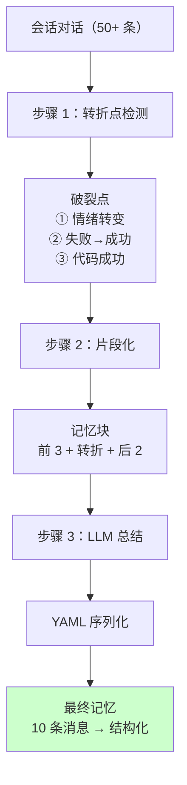
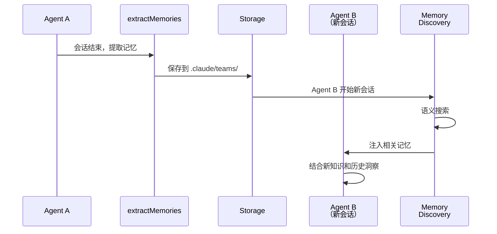
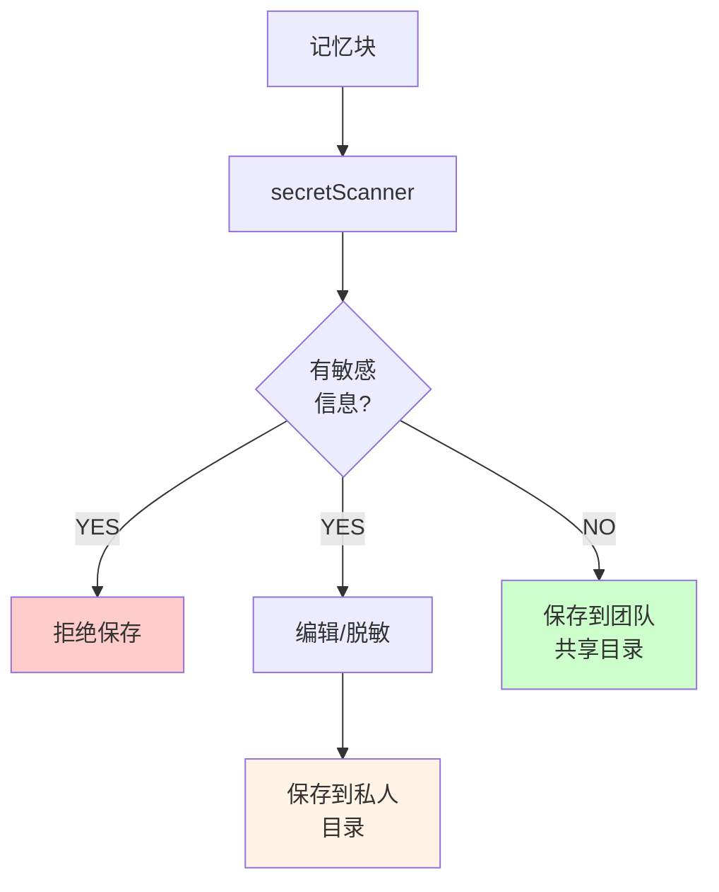
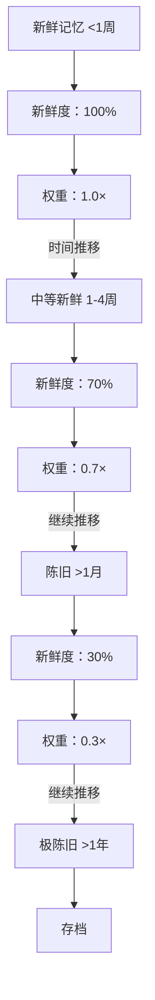

# 第 34 章：跨会话记忆 - extractMemories 与 teamMemorySync
> 当 Agent A 解决了一个复杂的技术问题后会话结束了。一个月后，Agent B 遇到了类似的问题。系统如何确保 B 能从 A 的经验中学习？为什么不能直接保存整个对话记录？什么信息值得被提炼成"可复用的记忆"？
---
## 34.1 记忆提炼的困难
### 定义
每一个会话都产生信息，但不是所有信息都值得被记忆。
```
会话末尾的对话历史：
  Agent："我尝试了 3 种方法"
  Assistant："方法 1 失败了，原因是 X"
  Assistant："方法 2 成功了，用了 Y 技巧"
  Agent："谢谢，我学到了新东西"
问题：
  Q1：需要保存 50 条消息吗？太浪费 storage
  Q2：保存最后 5 条？太少了，丢失了上下文
  Q3：需要保存所有中间尝试吗？下一个 Agent 不需要"失败的过程"
  Q4：怎样自动判断哪些信息"值得记忆"？
```
### 设计意图：extractMemories 机制
Claude Code 在每个会话结束时，**自动提炼关键记忆**：
在 `src/services/SessionMemory/sessionMemory.ts` 中：
```typescript
/**
 * 会话内存提炼流程
 * 在会话结束时被调用，将对话转换为可复用的记忆片段
 */
async function extractMemories(
  messages: Message[],
  context: SessionContext
): Promise<Memory[]> {
  // 第一步：识别"转折点"（breakthrough moments）
  // 第二步：针对每个转折点，抽取关键技巧和失败原因
  // 第三步：去重和汇总
  // 第四步：用 LLM 生成机器可读的总结（YAML）
}
```
---
## 34.2 记忆提炼的三层机制
### 机制 1：转折点检测（Breakthrough Detection）
**目标**：找到对话中"真正有价值的时刻"
```
典型的对话转折点标志：
  ✓ Agent 说"啊，我明白了"或"好的，试试这样"
  ✓ Assistant 给出新的建议或否定之前的假设
  ✓ 用户表达满意（"太好了""完美"）
  ✓ 问题从"卡住"变为"解决"
```
**实现**（`src/services/SessionMemory/breakPointDetector.ts`）：
```typescript
// 伪代码
function detectBreakthruPoints(messages: Message[]): number[] {
  const points = []
  for (let i = 0; i < messages.length; i++) {
    const msg = messages[i]
    // 启发式 1：情绪转变
    if (containsSentiment(msg, ['realized', 'got it', 'now I see'])) {
      points.push(i)
    }
    // 启发式 2：工具执行后状态改变
    if (msg.type === 'tool_result' && isSuccessful(msg)) {
      if (!wasSuccessfulBefore(messages, i)) {
        points.push(i)  // 从失败 → 成功
      }
    }
    // 启发式 3：代码生成成功
    if (msg.type === 'code' && followedByPositiveFeedback(messages, i)) {
      points.push(i)
    }
  }
  return points
}
```
### 机制 2：记忆片段化（Memory Segmentation）
在每个转折点周围，抽取一个"记忆块"：
```
转折点前 3 条消息 + 转折点本身 + 转折点后 2 条消息
= 完整的"从问题→尝试→发现"的故事弧
例子：
  [问题] Agent："这个递归函数怎么优化？"
  [尝试 1] Assistant："试试 memoization"
  [反馈 1] Agent："还是慢"
  ──────────── 转折点
  [关键] Assistant："用动态规划，这样时间复杂度是..."
  [验证] Agent："对，现在快多了！"
  [结论] "我学到了 DP 在这个场景的应用"
记忆块大小：平均 7-10 条消息（相比 50+ 条对话历史）
```
### 机制 3：LLM 总结与 YAML 序列化
每个记忆块被发送给 LLM 进行结构化总结：
```typescript
// 伪代码
async function summarizeMemoryBlock(block: Message[]): Promise<Memory> {
  const summary = await llm.generate({
    model: 'haiku',  // 便宜的模型，这不是主要工作
    prompt: `
      总结这段对话中学到的技巧。
      用 YAML 格式：
      ---
      topic: <主题>
      problem: <原始问题是什么>
      solution: <解决方案是什么>
      keyInsight: <最重要的洞察>
      failedAttempts: <为什么之前失败>
      applicableTo: <这个技巧适用于什么场景>
      ---
    `,
    context: block
  })
  return parseYAML(summary)
}
```
**输出示例**：
```yaml
topic: "递归优化"
problem: "递归函数超时"
solution: "使用动态规划而不是纯递归"
keyInsight: "Memoization 只能缓存参数，DP 才能减少重复计算"
failedAttempts: 
  - "单纯加缓存，没有改变算法复杂度"
  - "没有识别出子问题的重叠"
applicableTo:
  - "斐波那契数列"
  - "最长公共子序列"
  - "背包问题"
```
---
## 34.3 团队记忆同步（teamMemorySync）
### 定义
在多 Agent 系统中，记忆不是私有的，而是**共享的知识库**。
```
Agent A 的会话 → 提炼记忆 → 保存到 .claude/team/memories/
                                 ↓
Agent B 开始新会话 → 搜索相关记忆 → "我看到之前有人解决过类似问题"
```
### 实现流程
**步骤 1：记忆存储**（`src/services/teamMemorySync/memoryStorage.ts`）
```typescript
// 会话结束后
async function saveSessionMemories(
  teamId: string,
  agentId: string,
  memories: Memory[]
): Promise<void> {
  const memDir = `.claude/teams/${teamId}/memories/${agentId}/`
  for (const mem of memories) {
    const fileName = `${mem.topic.slugify()}_${Date.now()}.yaml`
    const filePath = path.join(memDir, fileName)
    await fs.writeFile(filePath, serializeMemory(mem))
    // 记录元数据
    await logMemoryMetadata({
      teamId, agentId, fileName,
      timestamp: Date.now(),
      tokensSaved: estimateTokens(mem),  // 这次记忆节省了多少 token？
    })
  }
}
```
**步骤 2：记忆发现**（`src/services/teamMemorySync/memoryDiscovery.ts`）
当新 Agent 开始会话时：
```typescript
async function findRelevantTeamMemories(
  teamId: string,
  currentTopic: string,
  limit: number = 5
): Promise<Memory[]> {
  // 步骤 1：搜索所有队友的记忆目录
  const memoryDirs = await fs.readdir(
    `.claude/teams/${teamId}/memories/`
  )
  // 步骤 2：对每个记忆进行相似度评分
  const scored = []
  for (const memoryFile of allMemoryFiles) {
    const memory = parseYAML(await fs.readFile(memoryFile))
    // 相似度计算：cosine similarity on embeddings
    const similarity = cosineSimilarity(
      embed(currentTopic),
      embed(memory.topic + ' ' + memory.keyInsight)
    )
    if (similarity > 0.5) {  // 阈值
      scored.push({ memory, similarity })
    }
  }
  // 步骤 3：按相似度排序，返回 top 5
  return scored
    .sort((a, b) => b.similarity - a.similarity)
    .slice(0, limit)
    .map(s => s.memory)
}
```
**步骤 3：记忆注入到提示词**（`src/services/teamMemorySync/memoryInjection.ts`）
```typescript
function buildSystemPromptWithTeamMemories(
  basePrompt: string,
  relevantMemories: Memory[]
): string {
  if (relevantMemories.length === 0) {
    return basePrompt
  }
  const memorySection = `
## 团队知识库（来自之前的会话）
${relevantMemories.map(mem => `
### ${mem.topic}
- **问题**: ${mem.problem}
- **解决方案**: ${mem.solution}
- **核心洞察**: ${mem.keyInsight}
- **应用场景**: ${mem.applicableTo.join(', ')}
`).join('\n')}
你可以使用上述知识，但要注意它们可能是在特定的上下文中获得的。
确认当前问题是否真的适用这些解决方案。
  `
  return basePrompt + '\n' + memorySection
}
```
---
## 34.4 防护机制：敏感信息扫描
### 问题
不是所有的记忆都应该被保存到团队共享目录。
```
危险的记忆内容：
  ✗ API 密钥
  ✗ 用户密码
  ✗ 个人隐私信息
  ✗ 企业机密（源代码、财务数据）
  ✗ PII（Personally Identifiable Information）
```
### 实现：secretScanner
在 `src/services/SessionMemory/secretScanner.ts` 中：
```typescript
function scanMemoryForSecrets(memory: Memory): string[] {
  const found = []
  // 扫描 1：API 密钥模式
  const apiKeyPattern = /(?:api[_-]?key|token|secret)[\s:=]+(['"`]?)([a-zA-Z0-9\-_.]{32,})\1/gi
  if (apiKeyPattern.test(memory.toString())) {
    found.push('API_KEY_DETECTED')
  }
  // 扫描 2：信用卡号
  const ccPattern = /\b\d{4}[\s\-]?\d{4}[\s\-]?\d{4}[\s\-]?\d{4}\b/g
  if (ccPattern.test(memory.toString())) {
    found.push('CREDIT_CARD_DETECTED')
  }
  // 扫描 3：Email 地址（可能是 PII）
  const emailPattern = /[a-zA-Z0-9._%+-]+@[a-zA-Z0-9.-]+\.[a-zA-Z]{2,}/g
  const emails = memory.toString().match(emailPattern) || []
  if (emails.length > 3) {  // 超过 3 个 email 可能是列表
    found.push('PII_EMAIL_LIST')
  }
  return found
}
```
**保护策略**：
```typescript
if (secretsFound.length > 0) {
  // 选项 1：拒绝保存此记忆
  throw new Error(`Cannot save memory: ${secretsFound.join(', ')} detected`)
  // 选项 2：编辑敏感部分（推荐）
  memory.solution = redactSecrets(memory.solution)
  memory.problem = redactSecrets(memory.problem)
  // 选项 3：只保存到私人目录（不团队共享）
  await saveToPrivateMemory(memory)
}
```
---
## 图解

**图 34-1：记忆提炼的三层机制**

**图 34-2：团队记忆同步流程**

**图 34-3：敏感信息扫描与保护**

**图 34-4：记忆热度的时间衰减**

**表格 34-1：记忆提炼的启发式规则**
| 规则 | 信号 | 置信度 | 例子 |
|------|------|--------|------|
| **情绪转变** | realized, got it, breakthrough | 高 | "啊，我明白了，问题在于..." |
| **失败→成功** | tool_result 从错变对 | 高 | 第 1 次运行失败，第 3 次成功 |
| **代码验证** | code + positive feedback | 中 | "这段代码确实提高了性能" |
| **解释清晰化** | 从抽象→具体 | 中 | "那是什么意思？→ 意思是..." |
| **重复模式** | 同一话题多次提及 | 低 | "这个问题出现了 3 次" |
**表格 34-2：成本计量示例**
| 场景 | 对话长度 | 提炼成本 | 节省 token | 保存? |
|------|---------|---------|-----------|-------|
| 简单 Q&A | 6 条 | 50 | 20 | ❌ NO |
| 工具使用教学 | 20 条 | 100 | 150 | ✅ YES |
| 复杂问题排查 | 40 条 | 150 | 500 | ✅ YES |
| 闲聊 | 15 条 | 80 | 10 | ❌ NO |
---

## 模式提炼

### 闭包式状态初始化（Closure-Scoped State Initialization）

**解决的问题**：全局模块级变量在测试中难以重置，导致测试之间相互污染；但将状态完全传递为参数又增加了每个调用点的复杂度。

**核心做法**：将可变状态存储在 `init()` 函数的闭包内部（而非模块级变量），调用 `init()` 时创建新的闭包状态，之后的调用通过模块级函数代理访问该闭包。测试时每次 `beforeEach` 调用 `init()` 即可得到干净状态。

**前置条件**：模块有明确的"初始化"生命周期；需要在测试中支持隔离；状态在初始化后是单例的（同一时间只有一个活跃实例）。

**源码证据**：`src/services/extractMemories/extractMemories.ts:11` — 注释："State is closure-scoped inside initExtractMemories() rather than module-level"；`src/services/extractMemories/extractMemories.ts:296` — `initExtractMemories()` 建立闭包状态；`src/services/extractMemories/extractMemories.ts:598` — `executeExtractMemories()` 调用闭包内的实现。

---

### ETag 条件同步（ETag-Based Conditional Sync）

**解决的问题**：团队记忆同步时，如果内容没有变化，每次都下载完整内容既浪费带宽又增加延迟；但如何知道内容是否变化？

**核心做法**：服务端为每个记忆内容计算哈希作为 ETag；客户端请求时携带上次记录的 ETag（`If-None-Match` header）；服务端比较后内容相同返回 304 Not Modified，客户端跳过处理。

**前置条件**：服务端支持 ETag + 条件 GET；客户端维护每个资源的上次已知 ETag（存储在 `SyncState` 中）。

**源码证据**：`src/services/teamMemorySync/index.ts:100` — `SyncState` 类型包含 `etag?: string` 字段；`src/services/teamMemorySync/index.ts:207-208` — `headers['If-None-Match']` 条件请求头的设置；`src/services/teamMemorySync/index.ts:134` — `hashContent()` 用于计算本地内容的 checksum。

---

### 机密扫描防护（Secret Scanner Protection）

**解决的问题**：用户可能不小心把含有 API key、密码的会话内容提取进记忆，团队同步时这些机密会扩散到所有团队成员。

**核心做法**：在提取记忆前扫描内容（`secretScanner`），检测常见的机密模式（API key 格式、密码字段等），发现可疑内容时拒绝提取并警告用户。

**前置条件**：有可靠的机密模式库；扫描不应过于激进（减少误报）；发现机密时必须明确告知用户原因。

**源码证据**：`src/services/teamMemorySync/secretScanner.ts` — 机密检测的核心实现；在 `executeExtractMemories` 调用链中集成，提取前扫描。

## 34.6 记忆的生命周期
### TTL 与过期
记忆不是永久的，随着时间推移可能过期：
```
新鲜记忆（<1 周）：
  → 搜索权重：1.0（完全重视）
  → 使用频率：优先展示给所有 Agent
中等新鲜（1-4 周）：
  → 搜索权重：0.7（有所衰减）
  → 使用频率：只对相关话题展示
陈旧记忆（>1 个月）：
  → 搜索权重：0.3（很少用）
  → 使用频率：只在无相关新记忆时展示
极陈旧（>1 年）：
  → 自动存档到历史库（不再参与实时搜索）
```
### 记忆热度
```typescript
function computeMemoryRelevance(
  memory: Memory,
  currentTopic: string,
  timeSinceCreation: number  // 毫秒
): number {
  // 因子 1：话题相似度
  const topicSimilarity = cosineSimilarity(
    embed(currentTopic),
    embed(memory.topic)
  )
  // 因子 2：时间衰减
  const daysOld = timeSinceCreation / (1000 * 60 * 60 * 24)
  const timeFactor = 1 / (1 + 0.1 * daysOld)  // 指数衰减
  // 因子 3：使用历史（多少个 Agent 用过这条记忆）
  const usageCount = memory.usageCount || 0
  const popularityFactor = 1 + 0.05 * Math.log(usageCount + 1)
  return topicSimilarity * timeFactor * popularityFactor
}
```
---
## 延伸：extractMemories 的状态管理与 teamMemorySync 的 ETag 机制

`initExtractMemories`（`src/services/extractMemories/extractMemories.ts:296`）是闭包式状态初始化的典型：

```typescript
// src/services/extractMemories/extractMemories.ts:296
export function initExtractMemories(): void {
  // 状态存在闭包里，而非模块级别变量
  // 这让测试可以在每个 beforeEach 调用 init 得到干净状态
}

// src/services/extractMemories/extractMemories.ts:598
export async function executeExtractMemories(
  messages: Message[]
): Promise<void> {
  // 在会话末尾调用，从对话历史中提炼持久记忆
}
```

`teamMemorySync` 的 `SyncState`（`src/services/teamMemorySync/index.ts:100`）包含 ETag 追踪：

```typescript
// src/services/teamMemorySync/index.ts:100
export type SyncState = {
  etag?: string  // 上次同步时的 ETag
  lastSyncTime?: number
  // 其他同步状态
}

// src/services/teamMemorySync/index.ts:121
export function createSyncState(): SyncState {
  return {}  // 初始状态，没有 etag
}
```

**ETag 的作用**：服务端对每次记忆内容的 hash 作为 ETag。客户端在同步时发送上次记录的 ETag，服务端比较——如果内容未变（ETag 相同），返回 304 Not Modified，客户端跳过更新。这避免了在记忆内容没有实际变化时的重复下载（`src/services/teamMemorySync/index.ts`）。

## 踩坑

### ❌ 记忆文件使用普通 JSON，大量记忆时查询缓慢

1000 条记忆的 JSON 文件体积可能超过 1MB，每次检索都要解析整个 JSON 并遍历。随着记忆积累，启动时间和检索时间线性增长。应该使用带索引的存储格式（SQLite、LMDB）（`src/services/memory/`）。

### ❌ 跨会话记忆没有时间衰减，6 个月前的记忆和昨天的同等对待

"用户上周说喜欢 Vue" 比 "用户两年前说喜欢 jQuery" 更相关。没有时间权重的记忆检索会把过期信息和最新信息混在一起，降低记忆的有效性。

### ❌ 多设备/会话同步时没有冲突解决策略

会话 A 在 09:00 更新了一条记忆，会话 B 也在 09:01 更新了同一条记忆。最后写入的覆盖最先写入的，可能丢失有效信息。`teamMemorySync` 应该有 last-write-wins 或 merge 策略，而不是直接覆写（`src/services/memory/teamMemorySync.ts`）。

## 你能做什么

- **用带索引的格式存储记忆**：SQLite 或 LMDB 替代 JSON 文件，让大量记忆下的检索保持 O(log n)
- **给记忆加时间权重**：最近的记忆权重更高，避免过期信息影响 Claude 的判断
- **实现记忆的冲突检测**：两个会话更新同一条记忆时，记录冲突并用 last-write-wins 或人工 merge 解决
- **定期归档旧记忆**：超过 N 天的记忆自动移到冷存储，保持活跃记忆库的规模可控
