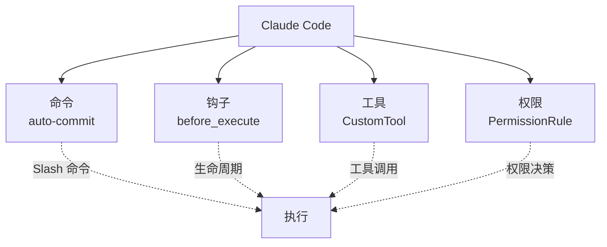
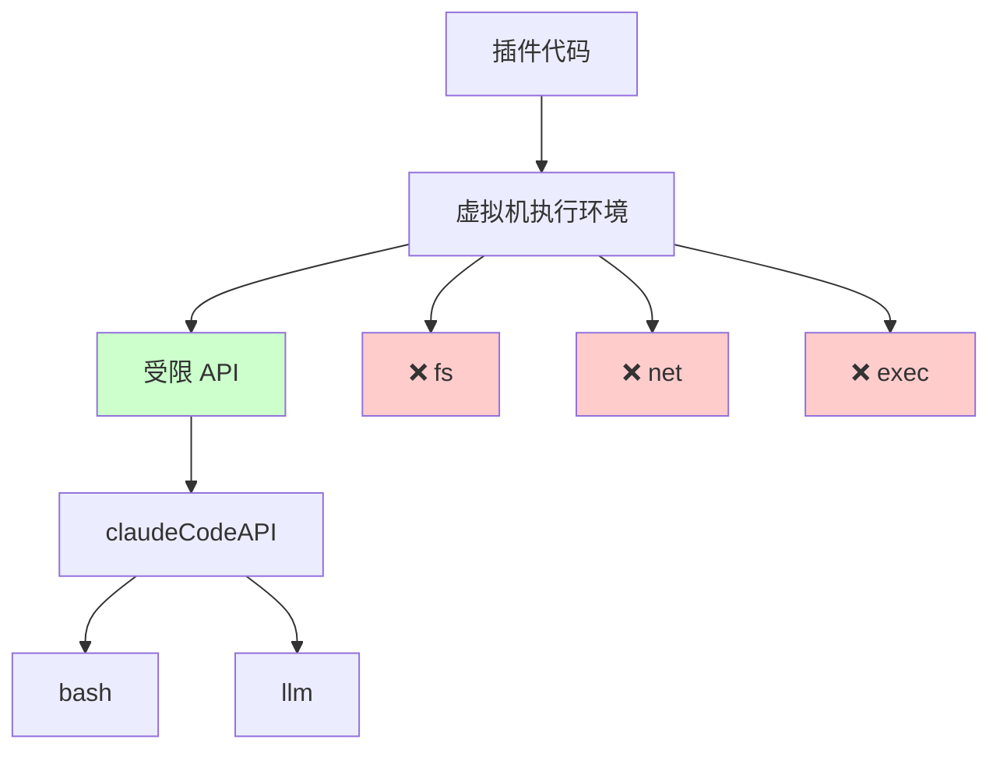
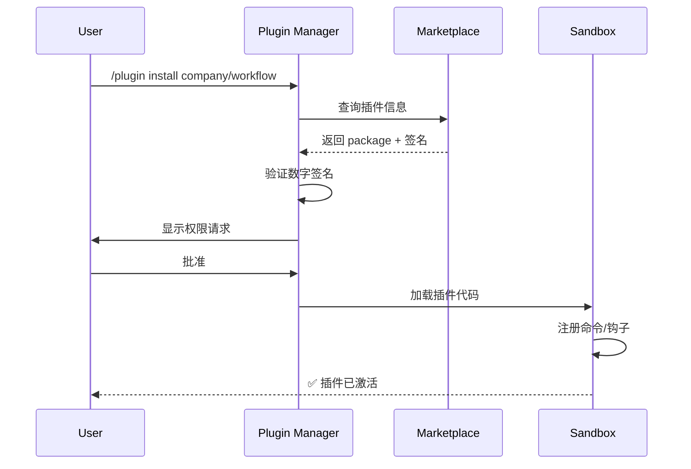

# 第 35 章：DXT 插件系统 - 扩展 Claude Code 的工具和能力
> 用户想要一个自定义的"快捷命令"来自动化他的工作流。或者想要一个特殊的权限规则来适应公司政策。系统怎么让用户编写、打包、分发这些扩展？为什么不直接改源码，而是要设计一个"插件系统"？
---
## 35.1 插件系统的困难
### 定义
**插件** = 用户编写的代码，无需修改 Claude Code 源码，就能扩展系统功能。
```
对标框架：
  VS Code → Extensions
  Neovim → Plugins
  Chrome → Extensions
Claude Code 中：
  → DXT Packages（自定义扩展包）
  → Installed plugins（已安装的插件）
```
### 设计意图：为什么需要插件系统
**困境**：
```
选项 A：不允许用户扩展
  ✓ 系统简单
  ✗ 功能固化，用户需求无法满足
选项 B：让用户改源码
  ✓ 灵活
  ✗ 升级时冲突
  ✗ 无法共享（每个人的改动不同）
  ✗ 安全隐患（用户可能引入恶意代码）
选项 C：设计规范的插件系统 ✅
  ✓ 灵活（用户能扩展）
  ✓ 安全（插件被沙箱隔离）
  ✓ 可维护（源码升级不冲突）
  ✓ 可共享（用户能分发插件）
```
在 `src/types/plugin.ts` 中：
```typescript
export type Plugin = {
  id: string              // 唯一标识，如 "my-company/auto-commit"
  name: string
  version: string
  description: string
  // 核心功能入口
  commands?: PluginCommand[]       // 自定义 slash 命令
  hooks?: PluginHook[]            // 生命周期钩子（hook）
  tools?: PluginTool[]            // 自定义工具
  permissions?: PermissionRule[]  // 权限规则扩展
  // 元数据
  author: string
  license: string
  dependencies?: Record<string, string>
  requiredVersion?: string  // 最低需要的 Claude Code 版本
}
```
---
## 35.2 DXT 包格式与生命周期
### 定义
**DXT** = Claude Code 的插件包格式（类似 npm package、VS Code VSIX）
### 包结构
```
my-plugin/
├── package.json          # 插件元数据
├── index.ts             # 入口文件
├── commands/            # 自定义命令
│   ├── auto-commit.ts
│   └── sync-fork.ts
├── hooks/               # 生命周期钩子
│   └── pre-compile.ts
├── tools/               # 自定义工具
│   └── CustomTool.ts
└── README.md
```
### package.json 示例
```json
{
  "id": "company/workflow-automation",
  "name": "Workflow Automation",
  "version": "1.2.0",
  "description": "Automate company-specific workflows",
  "author": "MyCompany",
  "license": "MIT",
  "main": "./index.ts",
  "commands": ["./commands/*.ts"],
  "hooks": ["./hooks/*.ts"],
  "tools": ["./tools/*.ts"],
  "requiredVersion": "2.1.0",
  "dependencies": {
    "some-npm-package": "^1.0.0"
  }
}
```
### 生命周期
在 `src/utils/plugins/installedPluginsManager.ts` 中：
```
1️⃣  安装（Installation）
  用户: npm install @company/workflow-automation
  ↓
  Claude Code 发现插件目录
  ↓
  验证 package.json
  ↓
  加载 hook 和命令
  ↓
  ✅ 插件激活
2️⃣  启用/禁用（Activation）
  用户: /plugin enable company/workflow
  ↓
  插件进入全局钩子系统
  ↓
  接收生命周期事件
3️⃣  升级（Update）
  新版本发布
  ↓
  Claude Code 检测到更新
  ↓
  备份旧版本
  ↓
  加载新版本
  ↓
  如果失败，回滚到旧版本
4️⃣  卸载（Uninstall）
  用户: /plugin remove company/workflow
  ↓
  插件从钩子系统移除
  ↓
  清理资源
  ↓
  删除插件目录
```
---
## 35.3 插件的四种扩展点
### 扩展点 1：自定义命令
```typescript
// plugin: my-plugin/commands/auto-commit.ts
import { defineCommand } from 'claude-code-sdk'
export default defineCommand({
  name: 'auto-commit',
  usage: '/auto-commit [message]',
  description: 'Automatically create commits with AI-generated messages',
  async execute(args: string[], context: CommandContext) {
    // 获取当前 git 状态
    const diff = await context.bash('git diff')
    // 用 Claude 生成提交信息
    const message = await context.llm.complete({
      model: 'sonnet',
      prompt: `Generate a concise git commit message for:\n${diff}`,
    })
    // 创建提交
    await context.bash(`git commit -m "${message}"`)
    context.sendMessage(`✅ Committed: ${message}`)
  }
})
```
**特点**：
- 没有额外的 CLI 参数解析，系统自动处理
- 有完整的 context（bash、llm、权限等）
- 执行结果自动流式输出
### 扩展点 2：生命周期钩子
```typescript
// plugin: my-plugin/hooks/pre-execute.ts
import { defineHook } from 'claude-code-sdk'
export default defineHook({
  event: 'before_tool_execute',
  async handler(tool: Tool, input: unknown, context: HookContext) {
    // 如果是 BashTool，自动检查危险命令
    if (tool.name === 'bash') {
      const cmd = input as string
      if (cmd.includes('rm -rf') && !cmd.includes('--dry-run')) {
        context.requireConfirmation(
          `⚠️  Destructive command detected: ${cmd}. Continue?`
        )
      }
    }
    // 传递控制权给下一个 hook
    return { allowed: true }
  }
})
```
**生命周期事件列表**：
```
初始化：
  - plugin_loaded
  - plugin_enabled
会话阶段：
  - session_started
  - session_ended
执行阶段：
  - before_tool_execute
  - after_tool_execute
  - before_llm_call
  - after_llm_call
权限阶段：
  - permission_requested
  - permission_decided
清理：
  - plugin_disabled
  - plugin_unloaded
```
### 扩展点 3：自定义工具
```typescript
// plugin: my-plugin/tools/CompanyDatabase.ts
import { buildTool } from 'claude-code-sdk'
export const CompanyDatabaseTool = buildTool({
  name: 'company_database',
  description: 'Query internal company database',
  inputSchema: {
    query: z.string().describe('SQL-like query'),
    table: z.enum(['employees', 'projects', 'resources']),
  },
  async *execute(input, context) {
    // 权限检查：只有内网才能访问
    if (!context.isInternalNetwork()) {
      throw new Error('Only accessible from internal network')
    }
    const result = await queryDatabase(input.table, input.query)
    yield { type: 'text', text: JSON.stringify(result, null, 2) }
  }
})
```
### 扩展点 4：权限规则扩展
```typescript
// plugin: my-plugin/permissions.ts
import { definePermissionRules } from 'claude-code-sdk'
export default definePermissionRules([
  {
    pattern: 'bash execute',
    conditions: [
      // 条件 1：只允许在特定目录
      { 
        type: 'path_prefix',
        value: '/data/projects',
        action: 'allow'
      },
      // 条件 2：禁止特定命令
      {
        type: 'command_pattern',
        regex: /^ssh|curl.*external/,
        action: 'deny'
      },
      // 条件 3：工作时间检查
      {
        type: 'time_range',
        start: '09:00',
        end: '18:00',
        action: 'allow'
      }
    ],
    mode: 'auto'  // 自动批准，不需要用户确认
  }
])
```
---
## 35.4 插件隔离与安全
### 问题
插件代码是用户提供的，可能包含恶意代码。
```
威胁：
  1. 访问系统文件（/etc/passwd）
  2. 建立网络连接（向外泄露数据）
  3. 无限循环（DoS）
  4. 消耗 token（刷爆账单）
```
### 沙箱隔离
在 `src/utils/plugins/sandboxPlugin.ts` 中：
```typescript
/**
 * 将插件代码运行在限制的上下文中
 */
async function sandboxPluginExecution(
  plugin: Plugin,
  context: ExecutionContext
): Promise<any> {
  // 步骤 1：创建受限的全局对象
  const sandbox = {
    // 只允许访问特定的 Claude Code API
    claudeCodeAPI: {
      bash: context.bash,
      llm: context.llm,
      sendMessage: context.sendMessage,
      // ✗ 不允许 fs（文件系统）
      // ✗ 不允许 net（网络）
    },
    // 其他的 Node API 都是禁止的
    // fs: undefined,
    // net: undefined,
    // child_process: undefined,
  }
  // 步骤 2：设置执行超时
  const timeoutPromise = new Promise((_, reject) =>
    setTimeout(() => reject(new Error('Plugin execution timeout')), 5000)
  )
  // 步骤 3：执行插件代码
  const result = await Promise.race([
    executePluginInVM(plugin, sandbox),
    timeoutPromise
  ])
  return result
}
```
### 权限模型
```
Capability      | 默认允许? | 覆盖权限?
─────────────────────────────────────
bash execute    | 否        | 用户确认
llm call        | 是        | 仅成本限制
sendMessage     | 是        | 无
file read       | 是        | 仅工作目录
file write      | 否        | 用户确认
network         | 否        | 绝对拒绝
```
---
## 图解

**图 35-1：DXT 包的生命周期**

**图 35-2：四种扩展点**

**图 35-3：插件沙箱隔离**

**图 35-4：插件安装验证流程**

**表格 35-1：插件权限模型**
| 能力 | 默认允许 | 可覆盖 | 说明 |
|------|---------|--------|------|
| **bash execute** | ❌ | ✅ | 需用户确认 |
| **llm call** | ✅ | ✅ | 受成本限制 |
| **sendMessage** | ✅ | ❌ | 始终允许 |
| **file read** | ✅ | ❌ | 仅工作目录 |
| **file write** | ❌ | ✅ | 需用户确认 |
| **network** | ❌ | ❌ | 绝对禁止 |
**表格 35-2：Bundled vs Marketplace 插件对比**
| 特征 | Bundled | Marketplace |
|------|---------|------------|
| **更新方式** | 与 Claude Code 同步 | 独立更新 |
| **默认启用** | ✅ 是 | ❌ 否 |
| **可卸载** | ❌ 否 | ✅ 是 |
| **签名检查** | 内部 | 推荐 |
| **审查流程** | 严格（官方） | 中等（社区） |
---

## 模式提炼

### 声明式插件清单（Declarative Plugin Manifest）

**解决的问题**：代码级的插件注册（动态 import + 运行时注入）在安装前无法预知插件需要的权限，用户必须先安装才能评估风险。

**核心做法**：插件包含 `manifest.json`/`package.json` 声明文件，在代码运行前描述插件需要的权限（commands/tools/hooks/permissions）。安装器在安装前读取并展示声明，用户可以基于声明做决策，而非运行后才发现。

**前置条件**：插件格式标准化（DXT 包结构固定）；声明文件的权限模型足够细粒度；安装流程有明确的权限展示步骤。

**源码证据**：`src/types/plugin.ts` — `Plugin` 类型定义 `commands`/`hooks`/`tools`/`permissions` 字段，对应插件的完整能力声明；`src/plugins/bundled/index.ts:20` — `initBuiltinPlugins()` 展示了内置插件（无需用户安装）的注册模式。

---

### Bundled vs Built-in 分层（Bundled vs Built-in Separation）

**解决的问题**：有些功能需要随 Claude Code 发布（bundled），但不是所有发布的功能都应该让用户自由开关（built-in plugins）；将所有 bundled 功能都变成 built-in 会让设置界面过于复杂。

**核心做法**：明确区分两种内置能力：`bundled plugins`（用户可在 UI 中开关，用 Plugin 系统注册）和 `bundled skills`（非用户开关，放在 `src/skills/bundled/`）。两者都随 Claude Code 发布，但管理方式不同。

**前置条件**：有清晰的"是否需要用户控制"判断标准；两条代码路径互不混用。

**源码证据**：`src/plugins/bundled/index.ts:7-10` — 注释明确划定边界："Not all bundled features should be built-in plugins — use this for user-toggleable features...for non-toggleable bundled skills, use src/skills/bundled/ instead"。

---

### Skill 到命令的透明转换（Skill-to-Command Transparent Conversion）

**解决的问题**：Skill（Markdown 文件）和 Command（TypeScript 函数）在实现上完全不同，但用户不应该感知这种差异——使用 Skill 的体验应该和使用内置命令一样。

**核心做法**：`createSkillCommand()` 将 Skill 的 Markdown 内容解析并包装成 `Command` 接口对象，插入到命令系统中。对调用方（REPL 的命令处理器）来说，Skill 和 TypeScript 命令完全无差别。

**前置条件**：`Command` 接口足够通用，能够容纳 Skill 的各种特性（frontmatter、路径限制等）；Skill 解析失败时有优雅的错误处理。

**源码证据**：`src/skills/loadSkillsDir.ts:270` — `createSkillCommand()` 函数定义；`src/skills/loadSkillsDir.ts:100` — `estimateSkillFrontmatterTokens()` 说明 Skill 注入有 token 预算估算，与普通命令的差异在这里被处理。

## 35.6 Bundled Plugins 与 Marketplace
### Bundled Plugins
某些插件随 Claude Code 一起发布（内置插件）：
在 `src/plugins/builtinPlugins.ts` 中：
```typescript
export const BUNDLED_PLUGINS = [
  // 内置插件 1：权限建议
  {
    id: 'claude-code/permission-advisor',
    description: 'Suggest safe permissions based on workflow',
    enabled: true,  // 默认启用
  },
  // 内置插件 2：快捷命令
  {
    id: 'claude-code/quick-commands',
    description: 'Common shortcuts like /git-sync',
    enabled: true,
  },
]
```
**特点**：
- 无需手动安装
- 可以禁用但不能删除
- 与 Claude Code 版本同步更新
### Marketplace Plugins
用户贡献的插件，存储在 marketplace：
```
安装流程：
  /plugin install company/workflow-automation
  ↓
  Claude Code 查询 marketplace
  ↓
  下载 package
  ↓
  验证签名（确认是官方发布）
  ↓
  展示权限请求
  ↓
  用户确认
  ↓
  安装完成
```
---
## 延伸：PluginInstallationManager 的安装生命周期

Plugin 安装管理在 `src/plugins/` 目录下（`PluginInstallationManager.ts` 为主要入口，提供 install/uninstall/upgrade 接口）。

DXT（Desktop Extension）包格式是标准化的 ZIP 文件：

```
plugin-name.dxt（实际上是 ZIP 文件）
├── manifest.json   ← 元数据：名称、版本、权限声明
├── index.js        ← 主要代码入口
├── assets/         ← 静态资源
└── node_modules/   ← 可选：打包的依赖
```

`manifest.json` 是安装的入口点——`PluginInstallationManager.install()` 首先读取 manifest，验证格式、版本兼容性和权限声明，然后才解压代码文件。这是安全的关键：用户在安装时就能看到插件声明了哪些权限，而不是运行时才发现（`src/plugins/`）。

内置插件（bundled）和市场插件（marketplace）的区别：
- **bundled**：随 Claude Code 一起发布，经过完整安全审查，代码不需要沙箱执行
- **marketplace**：第三方开发者发布，在 vm 沙箱中执行，权限受限

## 踩坑

### ❌ 插件沙箱里允许 require() 任意模块，沙箱形同虚设

```typescript
// ❌ 错误：沙箱里未限制 require
vm.runInContext(pluginCode, {
  require: require,  // 插件可以 require('child_process') 执行任意命令
})
```

应该用白名单限制只能 require 预定义的安全模块（`JSON`、`math` 等），`child_process`、`fs`、`net` 等危险模块必须在沙箱外显式拒绝（`src/tools/SkillTool/`）。

### ❌ 运行未经签名验证的插件

```
~/.claude/extensions/my-plugin.dxt  ← 从互联网下载的
```

没有签名验证，用户无法确认插件来自可信的发布者，还是被篡改过的恶意版本。Claude Code 的 DXT 插件应该有发布者签名和安装时验证。

### ❌ 插件 CPU 超时没有强制 kill

```typescript
// ❌ 错误：timeout 不能中断无限循环
vm.runInContext(code, sandbox, { timeout: 5000 })
// while(true){} 会让 timeout 生效但主线程也被阻塞
```

Node.js 的 `vm.runInContext` timeout 只在有 async yield 的代码中有效，同步的无限循环会阻塞整个进程。CPU 密集的插件应该在 worker thread 里运行，可以用 `worker.terminate()` 强制停止。

## 你能做什么

- **用白名单限制插件的 require 范围**：明确声明插件可以访问哪些 Node.js 模块，其他全部拒绝
- **为插件提供签名验证流程**：用户安装插件时验证发布者签名，确保插件未被篡改
- **在 worker thread 里运行 CPU 密集的插件**：可以用 `worker.terminate()` 强制终止无限循环，不会阻塞主线程
- **记录插件的每次执行**：工具名、参数、执行时间、结果摘要，便于调试和安全审计

## 核心源码锚点

| 位置 | 内容 | 工程意义 |
|------|------|---------|
| `src/plugins/bundled/index.ts:20` | `initBuiltinPlugins()` | 内置插件初始化入口（当前为空骨架，待迁移） |
| `src/plugins/bundled/index.ts:21` | 注释说明 bundled vs built-in 区别 | 关键架构决策：不是所有 bundled 都是 built-in |
| `src/skills/loadSkillsDir.ts:67` | `LoadedFrom` 类型定义 | 来源追踪：知道 Skill 来自哪个目录 |
| `src/skills/loadSkillsDir.ts:78` | `getSkillsPath()` | 获取当前项目/全局的 Skill 目录路径 |
| `src/skills/loadSkillsDir.ts:270` | `createSkillCommand()` | 将 Skill 文件转换为可调用命令的核心函数 |
| `src/types/plugin.ts` | `Plugin` 类型定义 | Plugin 的完整数据结构：commands/hooks/tools/permissions |

**精确引用验证**：`src/plugins/bundled/index.ts:21-22` 的注释："Not all bundled features should be built-in plugins — use this for user-toggleable features... for non-toggleable bundled skills, use src/skills/bundled/ instead." 这段注释清楚地划定了 Plugin 系统的边界。
