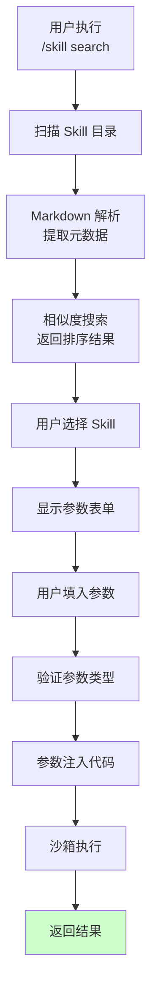
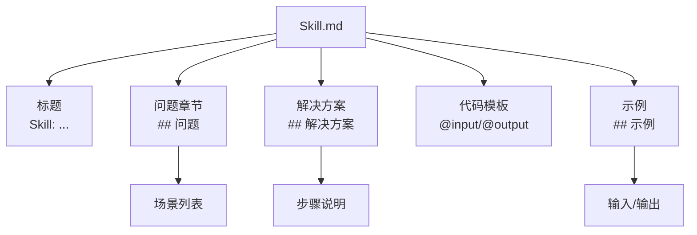
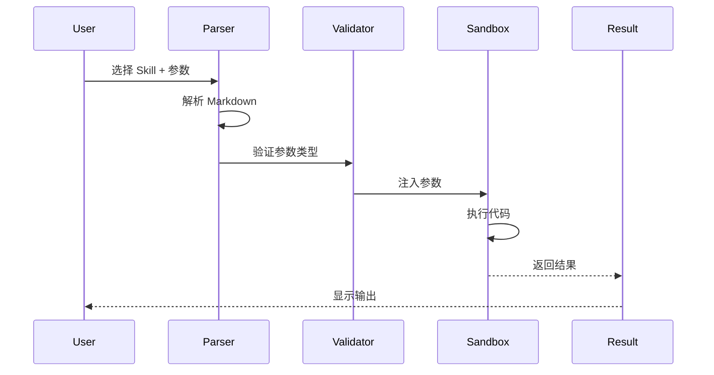
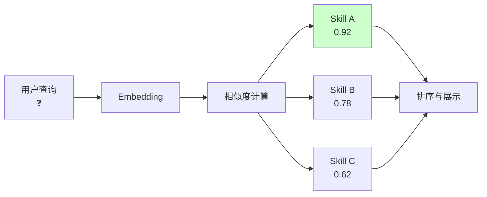

# 第 36 章：Skill 系统 - 用 Markdown 定义 AI 能力
> 一个用户想分享一个"重复的工作流程"（比如"从 JIRA ticket 生成代码框架"）。与其写成插件发布，为什么不用简单的 Markdown 文件来定义？系统怎样自动发现、解析、执行这些 Skill？
---
## 36.1 Skill 的设计意图
### 定义
**Skill** = 一个 Markdown 文档，包含：
- 问题描述（什么情况下用这个 Skill）
- 解决方案（具体的代码/步骤）
- 可选的执行参数
```
对标参考：
  GitHub Copilot Chat → Slash Commands
  ChatGPT → Custom Instructions
  Vercel v0 → Prompt Templates
Claude Code 中：
  → Skill（可发现、可复用、可分享）
```
### 为什么用 Markdown
**对比**：
```
选项 A：JSON 配置
  {
    "name": "Generate from JIRA",
    "description": "...",
    "template": "..."
  }
  ✗ 不易读
  ✗ 难以嵌入代码
选项 B：插件代码（ch35）
  export const MySkill = buildSkill({...})
  ✓ 灵活
  ✗ 需要编程知识
  ✗ 发布复杂
选项 C：Markdown ✅
  # Skill: Generate from JIRA
  ## 问题
  ...
  ## 解决方案
  ...
  ## 示例
  \`\`\`bash
  ...
  \`\`\`
  ✓ 易读易写
  ✓ 非编程用户也能用
  ✓ 自动发现
```
---
## 36.2 Skill 的文件格式
### 结构
在 `src/utils/skills/skillParser.ts` 中定义的格式：
```markdown
# Skill: <Skill 名称>
## 问题（Problem）
<描述这个 Skill 解决什么问题>
通常用在什么场景：
- 场景 1
- 场景 2
## 解决方案（Solution）
<高层描述方案>
### 步骤
1. <步骤 1>
2. <步骤 2>
...
## 代码模板（Code Template）
\`\`\`typescript
// @input: parameter-name (type) - description
// @output: result-description
// 实现代码
\`\`\`
## 示例（Example）
### 输入
\`\`\`json
{
  "jiraId": "PROJ-123"
}
\`\`\`
### 输出
\`\`\`
Generated code structure...
\`\`\`
## 备注（Notes）
- 限制 1
- 适用场景 1
```
### 具体示例
```markdown
# Skill: Generate TypeScript Interface from JSON
## 问题
给定一个 JSON 数据样本，需要快速生成对应的 TypeScript 类型定义。
常见场景：
- API 返回格式逆向工程
- 数据库记录型态定义
- 配置文件结构化
## 解决方案
用 TypeScript `type` 关键字自动生成接口。
### 步骤
1. 解析 JSON 结构
2. 识别各字段的类型（string, number, object）
3. 生成递归类型定义
## 代码模板
\`\`\`typescript
// @input: jsonData (string) - JSON 对象的字符串
// @output: TypeScript 类型定义
import Ajv from 'ajv'
function generateTypeScript(jsonData: string): string {
  const obj = JSON.parse(jsonData)
  const schema = inferSchema(obj)
  return generateFromSchema(schema)
}
\`\`\`
## 示例
### 输入
\`\`\`json
{
  "id": 123,
  "name": "Alice",
  "email": "alice@example.com",
  "profile": {
    "age": 30,
    "city": "NYC"
  }
}
\`\`\`
### 输出
\`\`\`typescript
interface Root {
  id: number
  name: string
  email: string
  profile: Profile
}
interface Profile {
  age: number
  city: string
}
\`\`\`
## 备注
- 不支持递归引用（但可以手动修改）
- 可选字段需要手动添加 `?`
```
---
## 36.3 Skill 的发现与加载
### 发现机制
在 `src/utils/skills/skillDiscovery.ts` 中：
```typescript
async function discoverSkills(options: {
  searchPaths?: string[]    // 从这些目录查找
  recursive?: boolean       // 是否递归搜索
  filter?: string          // 正则表达式过滤
}): Promise<Skill[]> {
  const searchDirs = options.searchPaths || [
    '.claude/skills',        // 用户自定义
    process.cwd(),          // 当前工作目录
    NODE_MODULES,           // npm 包中的 skills
  ]
  const skills = []
  for (const dir of searchDirs) {
    // 查找所有 .md 文件
    const mdFiles = await glob(
      path.join(dir, '**/*.md'),
      { ignore: 'node_modules/**' }
    )
    for (const file of mdFiles) {
      try {
        const skill = parseSkillFile(file)
        // 过滤
        if (options.filter && !skill.name.match(options.filter)) {
          continue
        }
        skills.push(skill)
      } catch (err) {
        // 解析失败的 .md 文件会被忽略
        logDebug(`Failed to parse skill from ${file}: ${err.message}`)
      }
    }
  }
  return skills
}
```
### 解析机制
```typescript
function parseSkillFile(filePath: string): Skill {
  const content = fs.readFileSync(filePath, 'utf-8')
  // 步骤 1：分割 Markdown 章节
  const sections = content.split(/^## /m)
  // 步骤 2：提取各部分
  const problem = sections[1]?.split('\n').slice(1).join('\n') || ''
  const solution = sections[2]?.split('\n').slice(1).join('\n') || ''
  const codeMatch = sections[3]?.match(/\`\`\`([\s\S]*?)\`\`\`/)
  const codeTemplate = codeMatch?.[1] || ''
  const example = sections[4] || ''
  // 步骤 3：提取元数据（从代码模板的注释）
  const inputMatch = codeTemplate.match(/@input:\s*(\w+)\s*\(([^)]+)\)/)
  const outputMatch = codeTemplate.match(/@output:\s*(.+)/)
  return {
    name: extractTitle(content),
    path: filePath,
    problem,
    solution,
    codeTemplate,
    example,
    input: {
      name: inputMatch?.[1] || 'input',
      type: inputMatch?.[2] || 'string'
    },
    output: {
      description: outputMatch?.[1] || 'result'
    }
  }
}
```
---
## 36.4 Skill 的调用与执行
### 调用方式
用户可以通过多种方式调用 Skill：
**方式 1：Slash 命令**
```
/skill search "typescript interface"
  ↓ 显示匹配的 Skill
  ↓ 用户选择
  ↓ 显示参数表单
  ↓ 用户填入 JSON
  ↓ 执行
/skill run "Generate TypeScript Interface from JSON" '{"jsonData": "..."}'
```
**方式 2：Agent 自动触发**（EXPERIMENTAL_SKILL_SEARCH）
如果启用了实验标志，Agent 可以在需要时自动发现和调用 Skill：
```typescript
// Agent 思考过程
if (needsCommonTask() && !builtinToolSupports()) {
  // 搜索 Skill
  const relevantSkills = await semanticSearchSkills(task)
  if (relevantSkills.length > 0) {
    const skill = relevantSkills[0]
    sendMessage(
      `💡 I found a skill that might help: "${skill.name}". ` +
      `Should I use it?`
    )
  }
}
```
### 执行流程
在 `src/tools/SkillTool/SkillTool.ts` 中：
```typescript
async function executeSkill(
  skill: Skill,
  parameters: Record<string, unknown>
): Promise<SkillResult> {
  // 步骤 1：参数验证
  if (!parameters[skill.input.name]) {
    throw new Error(
      `Missing required input: ${skill.input.name}`
    )
  }
  // 步骤 2：提取代码模板
  const code = skill.codeTemplate
  // 步骤 3：注入参数
  const injectedCode = code.replace(
    new RegExp(`\\b${skill.input.name}\\b`, 'g'),
    JSON.stringify(parameters[skill.input.name])
  )
  // 步骤 4：在沙箱中执行（类似插件的沙箱）
  const result = await evaluateInSandbox(injectedCode, {
    require: filterRequires,  // 只允许特定模块
    console,
    Buffer,
    // ...其他安全的全局对象
  })
  return {
    skillName: skill.name,
    success: true,
    output: result,
  }
}
```
---
## 36.5 Skill 的语义搜索
### 问题
有 100+ 个 Skill，用户怎么快速找到需要的那个？
### 解决方案：Embedding + 相似度搜索
在 `src/utils/skills/semanticSearch.ts` 中（EXPERIMENTAL）：
```typescript
async function semanticSearchSkills(
  query: string,
  topK: number = 5
): Promise<Skill[]> {
  // 步骤 1：对查询进行 embedding
  const queryEmbedding = await getEmbedding(query)
  // 步骤 2：加载所有 Skill 的 embedding（缓存）
  const skillEmbeddings = await loadSkillEmbeddings()
  // 步骤 3：计算相似度
  const scored = skillEmbeddings.map(s => ({
    skill: s,
    score: cosineSimilarity(queryEmbedding, s.embedding)
  }))
  // 步骤 4：按分数排序
  return scored
    .sort((a, b) => b.score - a.score)
    .slice(0, topK)
    .map(s => s.skill)
}
```
**示例**：
```
用户查询："怎样从 JSON 生成类型"
排名结果：
1. "Generate TypeScript Interface from JSON" (sim: 0.92)
2. "Convert JSON Schema to Go Structs" (sim: 0.78)
3. "Extract Schema from CSV" (sim: 0.62)
```
---
## 模式提炼
### 模式一：渐进式能力扩展（Progressive Capability Extension）
**解决的问题**：如何让非编程用户也能扩展系统？
**核心做法**：
- 核心功能：编程用户写插件（ch35）
- 中级能力：用户写 Skill（Markdown）
- 高级能力：Agent 自动发现和组合 Skill
**阶梯**：
```
Level 1: 使用内置功能（所有人）
Level 2: 写 Markdown Skill（文档编写者）
Level 3: 写 DXT 插件（开发者）
Level 4: 贡献 Claude Code 源码（贡献者）
```
---
### 模式二：声明式代码执行（Declarative Code Execution）
**解决的问题**：如何在保持安全的前提下，让 Skill 执行任意代码？
**核心做法**：
- Skill 代码是"模板"，参数是数据
- 用参数注入替代动态代码生成
- 沙箱执行（限制能访问的全局对象）
---
## 延伸：为什么 Skill 用 Markdown 而不是 TypeScript

### Markdown vs TypeScript Skill 定义的权衡

Claude Code 提供了两种扩展方式：Plugin（TypeScript 代码）和 Skill（Markdown 文件）。对于可复用的提示模板，为什么选择 Markdown？

```typescript
// 如果用 TypeScript 定义 Skill（假设）
export const generateInterfaceSkill = {
  name: "Generate TypeScript Interface",
  description: "从 JSON 生成 TypeScript 类型定义",
  execute: async (input: {jsonData: string}) => {
    // TypeScript 代码
    return await claude.generate(`Given JSON: ${input.jsonData}, generate TypeScript interface`)
  }
}
```

问题：
1. **门槛高**：需要 TypeScript 环境、npm 发布、版本管理
2. **可读性差**：Skill 的"描述什么时候用"比"如何实现"更重要，TypeScript 不适合描述
3. **无法被 Claude 直接理解**：Markdown 格式的 Skill 描述可以直接被 Claude 读懂

```markdown
# Skill: Generate TypeScript Interface
---
name: generate-ts-interface
description: 从 JSON 数据生成 TypeScript 类型定义
whenToUse: 当用户提供了 JSON 数据，需要对应的 TypeScript 类型时
---
```

Markdown Skill 的关键设计：`whenToUse` 字段直接被用于语义搜索——Claude 理解它，用户也理解它（`src/skills/loadSkillsDir.ts:185`）。

### frontmatter 字段的设计意图

`parseSkillFrontmatterFields`（`src/skills/loadSkillsDir.ts:185`）解析的核心字段：

```yaml
name: "Generate TypeScript Interface"     # 命令名（/skill run "name"）
description: "从 JSON 生成 TS 类型"        # 搜索时的短描述
whenToUse: "用户有 JSON 需要类型定义"       # 触发条件（语义搜索的主要字段）
paths:                                    # 工具执行的路径范围
  - "src/**/*.ts"
```

`estimateSkillFrontmatterTokens`（`src/skills/loadSkillsDir.ts:100`）对 frontmatter 的 token 进行估算——注意这不是对整个 Skill 文档估算，而只是 frontmatter。原因：Skill 的正文（如何执行）是在用户选择后才注入 prompt 的，只有 frontmatter 作为"索引"常驻 context。

### 为什么用 createSkillCommand 而非直接调用 Skill

```typescript
// 假设直接调用：
const skill = loadSkill('generate-ts-interface')
const result = await skill.execute(args)

// 实际做法：通过 createSkillCommand 转换为 Command：
const cmd = createSkillCommand({content, name, filePath, loadedFrom})
// cmd 现在和其他 slash 命令完全一样
```

`createSkillCommand`（`src/skills/loadSkillsDir.ts:270`）的核心价值：统一接口。REPL 的命令分发器不需要知道一个命令是 TypeScript 实现还是 Markdown Skill——两者都通过 `Command` 接口被调用。这是适配器模式的直接应用。

## 图解

**图 36-1：Skill 的发现与执行**

**图 36-2：Skill 的文件结构**

**图 36-3：Skill 的执行管道**

**图 36-4：语义搜索的工作流**

**表格 36-1：Skill 的参数类型**
| 类型 | 示例 | 验证 |
|------|------|------|
| **string** | "hello" | 长度、正则 |
| **number** | 42 | 范围、整数 |
| **object** | {"x": 1} | JSON Schema |
| **array** | [1, 2, 3] | 元素类型 |
| **enum** | "option1" | 从预定义列表选 |
**表格 36-2：Skill 的调用方式**
| 方式 | 命令 | 何时用 |
|------|------|--------|
| **Slash 命令** | `/skill search "keyword"` | 用户主动搜索 |
| **直接执行** | `/skill run "Name" {...}` | 已知 Skill 名称 |
| **Agent 推荐** | Agent 自动发现 | EXPERIMENTAL 标志 |
| **列表浏览** | `/skill list` | 浏览所有 Skill |
---

## 模式提炼

### 声明式能力封装（Declarative Capability Packaging）

**解决的问题**：可复用的工作流散落在各个对话记录里，无法被其他用户发现和使用，也无法版本管理。

**核心做法**：把工作流用 Markdown 文档化——"问题是什么"、"解决步骤"、"代码模板"、"使用示例"。Markdown 格式让非开发者也能贡献 Skill，Git 提供版本管理。

**前置条件**：工作流有明确的输入/输出格式，可以参数化，且会被多次复用。

**源码证据**：`src/utils/skills/skillParser.ts` — `parseSkillFile()` 把 Markdown 文档解析为可执行的 Skill 对象。

### 基于 Embedding 的语义发现（Semantic Discovery）

**解决的问题**：Skill 库增长到 100+ 个后，用户很难用关键词找到需要的 Skill——"从 JSON 生成类型" 和 "将 JSON 转换为 TypeScript interface" 应该找到同一个 Skill。

**核心做法**：对 Skill 的名称 + 问题描述做向量 Embedding，用 cosine 相似度排序检索结果。

**前置条件**：有 Embedding 模型，愿意为每个 Skill 预计算和缓存向量。

**源码证据**：`src/utils/skills/semanticSearch.ts`（EXPERIMENTAL）— `semanticSearchSkills()` 实现 Embedding 相似度检索。

## 延伸：createSkillCommand 的转换机制与 Skill frontmatter 字段

`createSkillCommand`（`src/skills/loadSkillsDir.ts:270`）把 Markdown Skill 文件转换为可调用的命令对象：

```typescript
// src/skills/loadSkillsDir.ts:270
export function createSkillCommand({
  content,      // Markdown 文件内容
  name,         // Skill 名称
  filePath,     // 来源文件路径
  loadedFrom,   // 加载来源（.claude/skills/ 或 ~/.claude/skills/）
}: CreateSkillCommandParams): Command {
  const frontmatter = parseSkillFrontmatterFields(content)
  return {
    name,
    type: 'skill',
    execute: async (args) => { /* 调用 Skill 逻辑 */ }
  }
}
```

Skill frontmatter 的关键字段（`src/skills/loadSkillsDir.ts:185`）：

```markdown
---
name: "TypeScript Interface Generator"
description: "从 JSON 数据生成 TypeScript 类型定义"
trigger: "generate types from"   # 触发词（用于语义搜索）
paths:                            # 允许操作的路径
  - "src/**/*.ts"
---
```

`trigger` 字段是 `EXPERIMENTAL_SKILL_SEARCH` 的基础——当用户描述任务时，系统计算用户输入与各 Skill `trigger` 的语义相似度，推荐最相关的 Skill（`src/skills/loadSkillsDir.ts:270`）。

## 踩坑

### ❌ Skill 的代码模板里用字符串拼接注入参数，产生代码注入风险

```typescript
// ❌ 危险：用户输入被直接拼接进代码字符串
const code = `const result = process("${userInput}")` // userInput 可以包含 "); maliciousCode(); ("
```

应该只允许预定义的参数名替换，且参数值必须经过 JSON 序列化，不允许任意字符串插入代码逻辑（`src/utils/skills/`）。

### ❌ 假设 Skill 执行的结果总是有效的可用数据

Skill 执行返回的是字符串或任意类型，没有类型保证。直接用 `result.data.items[0]` 访问不存在的属性会导致 TypeError。调用者必须验证 Skill 的输出格式。

### ❌ Skill 文件放在 .gitignore 里，团队成员无法共享

个人的 Skill 文件如果在 `.gitignore` 里，无法纳入团队的知识库。应该把通用的 Skill 提交到 `.claude/skills/` 目录，个人独有的放 `~/.claude/skills/`。

## 你能做什么

- **用模块化的 Markdown 描述可复用的工作流**：把"从 JIRA ticket 生成代码框架"这类重复工作写成 Skill，分享给团队
- **对 Skill 的代码模板参数进行类型验证**：用 JSON Schema 验证输入参数格式，在执行前拦截无效输入
- **把团队 Skill 提交到 `.claude/skills/` 目录**：纳入版本控制，让团队成员共享，个人 Skill 放 `~/.claude/skills/`
- **用语义搜索而非精确搜索发现 Skill**：相似意图的描述应该能找到相关 Skill，不限于关键词完全匹配
