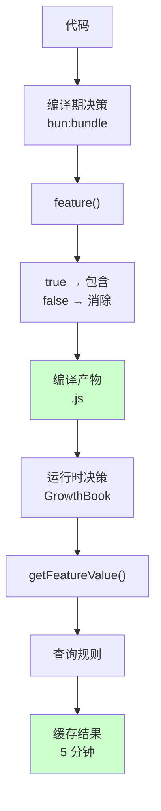
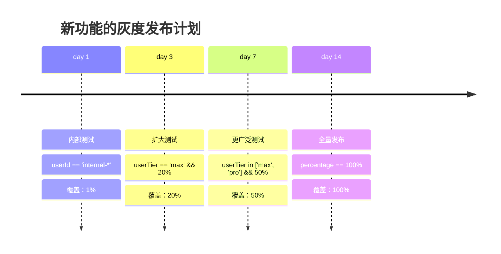
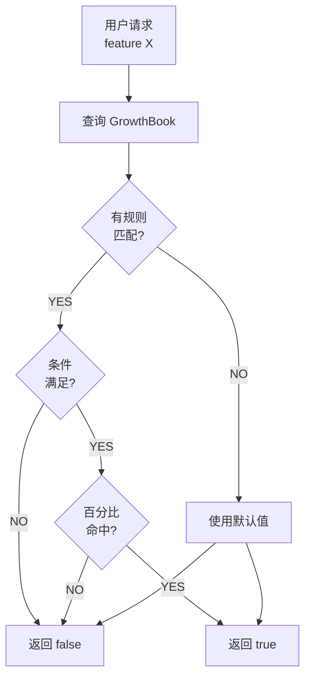

# 第 37 章：Feature Flag 与产品演进 - 隐藏和测试未发布的功能
> Claude Code 的代码中有一个 `COORDINATOR_MODE` 的完整实现，但用户看不到它。一个新的权限系统在测试，但只有 10% 的用户能使用。系统怎样在不改代码的情况下，隐藏、启用或回滚功能？
---
## 37.1 Feature Flag 的设计意图
### 定义
**Feature Flag**（特性开关）= 通过配置而不是代码部署来控制功能的开启/关闭。
```
场景：
  • 某个功能未完成，但代码已 push
  • 一个功能有 bug，需要紧急下线
  • 做 A/B 测试，10% 用户用新功能，90% 用旧功能
  • 在生产环境中逐步灰度发布新功能（1% → 10% → 50% → 100%）
传统做法：
  ❌ 等功能完成才 merge → 无法并行开发
  ❌ 不允许 WIP（work in progress）代码 → 效率低
Flag 做法：
  ✅ 代码先 push（带 flag 包装）
  ✅ 生产环境通过 flag 控制
  ✅ 问题发生时秒级下线，无需重新部署
```
---
## 37.2 Claude Code 的双层 Flag 架构
### 层级 1：编译期 Flag（bun:bundle）
在 `src/main.tsx` 中使用 `bun:bundle` 的 `feature()` API：
```typescript
import { feature } from 'bun:bundle'
// 编译期决策
if (feature('KAIROS')) {
  // 这段代码只在编译时 KAIROS flag 为 true 时才被包含
  import('./assistant/index.js')  // 完全可能被消除
} else {
  assistantModule = null
}
// 通常用于：
// • 大功能模块的 on/off（能节省 100+ KB bundle size）
// • 商业模式区分（Pro vs Free 版本）
// • 平台特定代码（desktop vs web）
```
**特点**：
- **优点**：没有运行时开销，减小 bundle 大小
- **缺点**：需要重新编译才能改变，不能在生产动态改
### 层级 2：运行期 Flag（GrowthBook）
在 `src/services/analytics/growthbook.ts` 中使用 GrowthBook API：
```typescript
import { getFeatureValue_CACHED_MAY_BE_STALE } from './growthbook.js'
async function isFeatureEnabled(
  featureName: string,
  context: {
    userId?: string
    userTier?: 'free' | 'pro' | 'max'
    region?: string
    percentage?: number
  }
): Promise<boolean> {
  // 查询 GrowthBook：这个用户应该有这个特性吗？
  const value = await getFeatureValue_CACHED_MAY_BE_STALE(
    featureName,
    context,
    false  // 默认值（如果无法查询）
  )
  return value === true
}
```
**工作流**：
```
运行时：
  1. Agent 启动
  2. 查询 GrowthBook
  3. 获得 flag 配置（可能包含规则）
  4. 缓存 5 分钟
  5. 根据规则决策用户应该用哪个版本
特点：
  ✅ 动态改变（无需重新部署）
  ✅ 支持复杂规则（百分比、用户分组等）
  ✅ 实时分析（能看到 A/B 测试的效果）
```
---
## 37.3 Feature Flag 的规则引擎
### Flag 定义
在 GrowthBook 中，一个 flag 可能看起来像这样：
```json
{
  "key": "new-permission-system",
  "type": "boolean",
  // 规则：什么情况下返回 true
  "rules": [
    {
      "condition": {
        "userTier": { "$eq": "max" }
      },
      "value": true,
      "percentage": 100  // Max 用户 100% 启用
    },
    {
      "condition": {
        "userTier": { "$in": ["pro", "enterprise"] }
      },
      "value": true,
      "percentage": 10   // Pro/企业用户 10% 启用（灰度）
    },
    {
      "condition": {
        "userTier": { "$eq": "free" }
      },
      "value": false     // 免费用户 0% 启用
    }
  ],
  // 默认值
  "defaultValue": false
}
```
### 条件语言
GrowthBook 使用 MongoDB 查询语言的子集：
```
$eq    → 等于
$ne    → 不等于
$in    → 在列表中
$nin   → 不在列表中
$gt    → 大于
$gte   → 大于等于
$lt    → 小于
$lte   → 小于等于
$regex → 正则匹配
```
**示例**：
```json
{
  "userId": { "$regex": "^admin-" }     // 用户 ID 以 admin- 开头
}
{
  "region": { "$nin": ["cn", "ru"] }    // 不在中国或俄罗斯
}
{
  "createdAt": { "$gte": 1609459200000 }  // 用户在 2021-01-01 之后创建
}
```
---
## 37.4 Claude Code 中的已知 Flag
### 实验阶段的功能
通过代码扫描，我们能发现许多未发布的功能：
| Flag 名称 | 代码位置 | 功能 | 状态 |
|-----------|---------|------|------|
| **COORDINATOR_MODE** | `src/main.tsx:2800+` | Agent 协调器模式 | 实现完整，未启用 |
| **DAEMON** | `src/main.tsx:2850+` | 后台守护进程模式 | 框架完整，需测试 |
| **BG_SESSIONS** | `src/services/sessions.ts:100+` | 后台会话管理 | 部分实现 |
| **EXPERIMENTAL_SKILL_SEARCH** | `src/utils/skills/` | Skill 语义搜索 | 完全实现，实验中 |
| **ULTRAPLAN** | `src/tools/` | 超级规划模式 | 框架完整 |
| **BYOC_ENVIRONMENT_RUNNER** | `src/runner/` | BYOC 环境执行器 | 骨架代码 |
### 日志中的 FLAG 提示
当一个功能被 flag 控制时，通常有诊断日志：
```typescript
if (DEBUG) {
  logInfo(`Feature COORDINATOR_MODE is ${enabled ? 'ENABLED' : 'DISABLED'}`)
}
// 或者
if (isFeatureEnabled('COORDINATOR_MODE')) {
  logDebug('Running in COORDINATOR_MODE')
}
```
---
## 37.5 Rollout 与灰度策略
### 灰度发布流程
```
第 1 天：内部测试
  ├─ GrowthBook rule: userId == 'internal-*'
  └─ 覆盖范围：1%（仅 Anthropic 内部）
第 3 天：扩大测试
  ├─ rule: userTier == 'max' && percentage == 20%
  └─ 覆盖范围：20%（Max 用户的 20%）
第 7 天：更广泛测试
  ├─ rule: userTier in ['max', 'pro'] && percentage == 50%
  └─ 覆盖范围：50%（Max + Pro 用户的 50%）
第 14 天：全量发布
  ├─ rule: percentage == 100%
  └─ 覆盖范围：100%（所有用户）
```
### 回滚策略
如果发现问题：
```typescript
// 在 GrowthBook 中，改规则
{
  "key": "new-permission-system",
  "defaultValue": false,
  "rules": []  // 移除所有规则 → 所有用户都是 false
}
// 效果：立即对所有用户禁用该功能，无需部署
```
**成本**：
- 改规则时间：< 1 秒
- 缓存刷新时间：5 分钟（或手动清缓存立即生效）
- 对比：代码部署可能需要 5-15 分钟
---

## 延伸：Flag 管理的反面教训

### 为什么不把"能否激活"的判断留在运行期？

```typescript
// ❌ 危险的方案：运行期判断
async function isCoordinatorEnabled() {
  const flags = await fetchRemoteFlags()
  return flags.COORDINATOR_MODE && user.isInternal
}
```

问题：如果 `COORDINATOR_MODE` 的代码在外部用户产物中存在，即使运行期判断返回 `false`，攻击者仍然可以通过：
1. 反编译产物找到代码
2. 修改本地的 flag 配置文件
3. 通过代理修改 GrowthBook 响应

`feature('COORDINATOR_MODE')` 的编译期消除是唯一能做到"代码不存在于外部产物"的方法——不是"代码存在但不执行"，而是代码物理消失（`src/coordinator/coordinatorMode.ts:37`）。

### 为什么不把所有 flag 都放在 GrowthBook？

GrowthBook 是远程可配置的运行期 flag 系统，如果把所有 60+ 个 flag 都放在 GrowthBook，会有什么问题？

1. **离线可用性**：Claude Code 需要在没有网络时也能工作（GrowthBook 连接失败时需要有合理的降级值）。编译期 flag 在离线时没有问题（已经烧入产物）

2. **启动性能**：GrowthBook 的初始化需要网络请求，等待响应才能知道某些 flag 的值。编译期 flag 在启动时立即就绪，不影响冷启动时间

3. **代码可见性**：如果 `KAIROS` 在 GrowthBook 里，外部用户可以在浏览器的网络请求中看到 flag 名称，推断出 Anthropic 的内部项目代号。编译期 flag 连 flag 名称也不会出现在外部产物中（`src/main.tsx:80`）

### 为什么 flag 骨架代码不该是"完全未测试的死代码"？

一个常见的误解：被 flag 门控的代码"反正不运行，不用测"。

风险：
```typescript
// COORDINATOR_MODE 骨架代码中有 bug
if (feature('COORDINATOR_MODE')) {
  const coordinator = new CoordinatorMode()
  coordinator.init()  // 如果这里有 null pointer，只有内部用户才会发现
}
```

当这个 flag 对外开放时，可能遇到多年积累的未被发现的 bug。更好的做法是在内部构建（feature flag = true）中对骨架代码进行基本的集成测试，确保代码路径是健康的（`src/coordinator/coordinatorMode.ts`）。

## 图解

**图 37-1：双层 Flag 架构**

**图 37-2：灰度发布的时间线**

**图 37-3：规则引擎的决策流**

**表格 37-1：已知的实验 Flag**
| Flag | 功能 | 完成度 | 预期发布 |
|------|------|--------|----------|
| **COORDINATOR_MODE** | Agent 协调器 | 100% | v3.0+ |
| **DAEMON** | 后台进程 | 60% | 未定 |
| **EXPERIMENTAL_SKILL_SEARCH** | Skill 搜索 | 90% | v2.5+ |
| **BG_SESSIONS** | 后台会话 | 50% | v3.0+ |
| **ULTRAPLAN** | 超级规划 | 40% | 未定 |
**表格 37-2：灰度采样的原理**
| 用户 | hash(id) % 100 | 10% flag | 50% flag | 100% flag |
|------|---|---|---|---|
| user-001 | 12 | ❌ NO | ✅ YES | ✅ YES |
| user-002 | 45 | ❌ NO | ✅ YES | ✅ YES |
| user-003 | 08 | ✅ YES | ✅ YES | ✅ YES |
| user-004 | 92 | ❌ NO | ❌ NO | ✅ YES |
---

## 模式提炼

### 编译期特性门控（Compile-time Feature Gating）

**解决的问题**：内部功能（COORDINATOR_MODE、KAIROS 等）不应该出现在外部用户的产物中——不只是运行时跳过，而是代码物理不存在，防止逆向工程和环境变量绕过。

**核心做法**：用 `bun:bundle` 的 `feature()` 函数包裹内部代码，构建时 `feature()` 被替换为字面量 `false`，整个分支通过 Dead Code Elimination 物理删除。外部用户产物中不存在这段代码，也不可能通过任何环境变量启用。

**前置条件**：构建工具支持编译期常量替换和 DCE（Bun 的 `--target bun`）；内部功能有清晰的边界，可以整块门控。

**源码证据**：`src/coordinator/coordinatorMode.ts:37` — `if (feature('COORDINATOR_MODE'))` 的双层门控；`src/utils/ultraplan/keyword.ts:97` — `findUltraplanTriggerPositions()` 在 ULTRAPLAN flag 下的条件编译。

---

### 关键词启动守卫（Keyword-Triggered Launch Guard）

**解决的问题**：`ultraplan` 这样的触发词需要在用户输入中准确识别，但触发词出现在代码块、路径、注释等上下文中不应该触发，需要复杂的上下文感知。

**核心做法**：实现专门的关键词检测器，跳过成对分隔符内（backtick、引号、括号等）和路径/标识符上下文中的出现，只在"自由文本"中触发。

**前置条件**：有明确的"自由文本"上下文定义；关键词检测的假阴性（漏检）比假阳性（误触发）危害更小。

**源码证据**：`src/utils/ultraplan/keyword.ts:14-40` — 注释详细说明了所有需要跳过的上下文类型；`src/utils/ultraplan/keyword.ts:48` — 核心检测函数，处理单词边界和上下文感知。

---

### 后台会话骨架（Background Session Scaffold）

**解决的问题**：`DAEMON` 和 `BG_SESSIONS` 功能需要在正式发布前就建立基础设施（进程管理、会话类型枚举），这样当 flag 开启时可以直接使用，而不是临时赶工。

**核心做法**：在 flag 开启前就定义完整的类型系统和会话枚举，代码骨架通过 flag 门控处于休眠状态。当 flag 开启时，基础设施已经就绪，只需在上层添加业务逻辑。

**前置条件**：功能的类型和接口相对稳定（避免基础设施变更导致已使用的代码崩溃）；骨架代码经过基本的测试验证，不是完全未经测试的死代码。

**源码证据**：`src/utils/concurrentSessions.ts:18` — `SessionKind = 'interactive' | 'bg' | 'daemon' | 'daemon-worker'`；`bg` 和 `daemon` 类型已在枚举中就绪，等待 `BG_SESSIONS` flag 开启后的调用方。

## 延伸：实验 Flag 的源码骨架分析

### ULTRAPLAN 的关键词触发

```typescript
// src/utils/ultraplan/keyword.ts（关键词检测逻辑）
// 检测用户输入中是否包含 "ultraplan" 触发词
// 支持大小写变体，但跳过在代码块、引号等上下文中的出现
export function findUltraplanKeyword(text: string): TriggerPosition | null {
  // ...复杂的词边界检测逻辑
}
```

`keyword.ts` 的复杂度（127 行只为检测一个词）揭示了触发词检测的工程难点：`ultraplan` 不应该在 `src/ultraplan/foo.ts` 这样的路径中触发，也不应该在代码注释中触发，但在 "Let's ultraplan this" 中应该触发（`src/utils/ultraplan/keyword.ts`）。

### ULTRAPLAN 的远程会话轮询（ccrSession.ts）

`UltraplanPhase`（`src/utils/ultraplan/ccrSession.ts:66`）展示了 ULTRAPLAN 的完整状态机：

```typescript
// src/utils/ultraplan/ccrSession.ts:66
export type UltraplanPhase = 'running' | 'needs_input' | 'plan_ready'

// ULTRAPLAN_TELEPORT_SENTINEL 标记本地执行路径
// src/utils/ultraplan/ccrSession.ts:48
export const ULTRAPLAN_TELEPORT_SENTINEL = '__ULTRAPLAN_TELEPORT_LOCAL__'
```

`ccrSession.ts` 实现了跨设备的 ULTRAPLAN 体验——用户在 terminal 触发 ultraplan，实际的批准可以在浏览器里完成（`src/utils/ultraplan/ccrSession.ts`）。这是 `BG_SESSIONS` 基础设施的典型用例。

### DAEMON/BG_SESSIONS 基础设施

```typescript
// src/utils/concurrentSessions.ts:18
export type SessionKind = 'interactive' | 'bg' | 'daemon' | 'daemon-worker'
```

`SessionKind` 已经有 4 种类型——`bg`（后台任务）和 `daemon`（守护进程）对应 `BG_SESSIONS` 和 `DAEMON` flag。基础设施已经存在，只等 flag 开启（`src/utils/concurrentSessions.ts`）。

### COORDINATOR_MODE 骨架

```typescript
// src/coordinator/coordinatorMode.ts:36
export function isCoordinatorMode(): boolean {
  if (feature('COORDINATOR_MODE')) {
    return isEnvTruthy(process.env.CLAUDE_CODE_COORDINATOR_MODE)
  }
  return false
}
```

`COORDINATOR_MODE` 是编译期 + 运行期的双层 flag——先需要内部构建（编译期），再需要环境变量（运行期）才能激活（`src/coordinator/coordinatorMode.ts:36`）。

## 踩坑

### ❌ 在代码各处散落 flag 检查，删除 flag 时遗漏修改点

```typescript
// 散落在 10 个不同文件里
if (feature('NEW_PERMISSION_UI')) { ... }  // file1.ts
// ...
if (getFeatureValue('NEW_PERMISSION_UI')) { ... }  // file7.ts
```

删除 flag 时需要全局搜索，容易遗漏导致死代码或 bug。应该把 flag 检查封装成命名函数（`isNewPermissionUIEnabled()`），修改只需改一处。

### ❌ 运行期 flag 门控应该物理隔离的内部功能

运行期 GrowthBook flag 只控制代码路径，代码本身仍然存在于所有用户的产物中。用这种方式保护内部功能，攻击者可以通过修改本地存储的 flag 值来启用（`src/utils/featureFlag/`）。

### ❌ 废弃 flag 后不清理对应的旧代码分支

```typescript
// flag 已经全量推送，ENABLE_V2 一直为 true，但旧分支还在
if (feature('ENABLE_V2')) { newCode() } else { oldCode() }  // oldCode() 是死代码
```

积累的死代码增加了包体积和认知负担。全量推送后的 flag 应该在下个 sprint 移除，同时删除 else 分支。

## 你能做什么

- **把 flag 检查封装成命名函数**：`isNewPermissionUIEnabled()` 替代散落各处的 `feature('NEW_PERM_UI')`，删除 flag 时只改一处
- **建立 flag 的生命周期管理**：每个 flag 创建时记录预期删除时间，定期审查并清理已全量推送的 flag
- **用编译期 flag 保护内部代码，用运行期 flag 做 A/B 实验**：明确两者的职责边界，不混用
- **为 flag 的各种组合写测试**：flag 开/关的不同组合可能产生难以预料的交互，自动化测试覆盖关键路径
