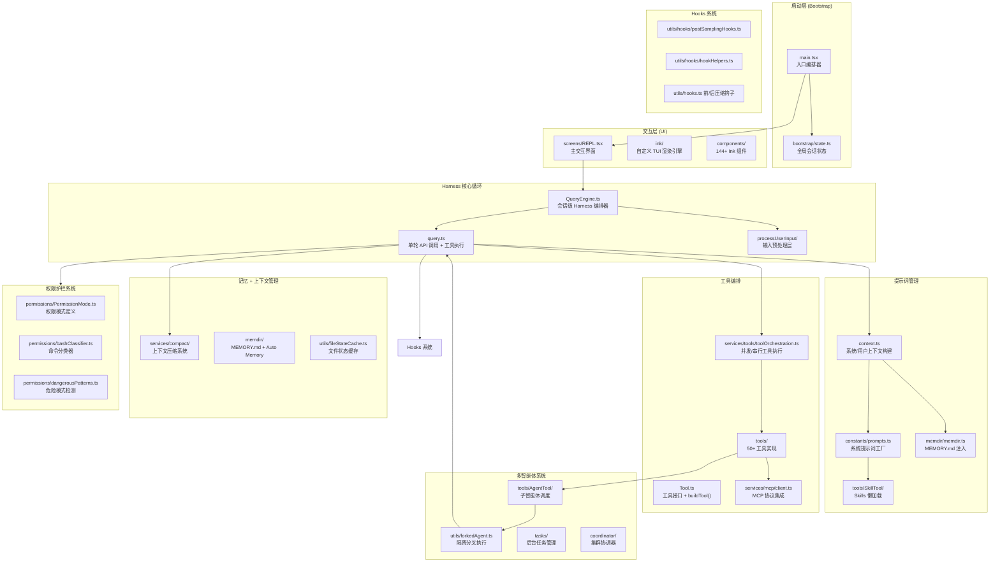
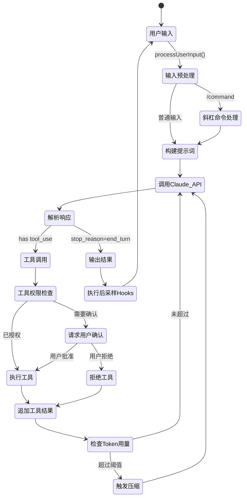
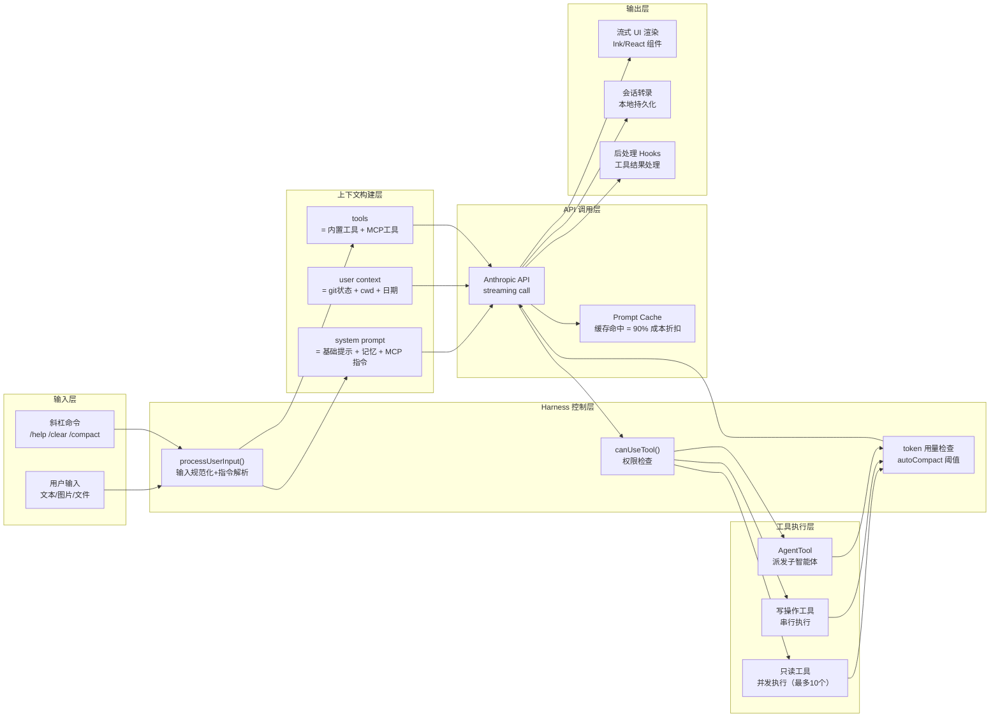

# Claude Code Harness 工程架构分析报告

> 分析日期：2026-04-11  
> 项目语言：TypeScript / React (Ink) / Bun  
> 软件类型：AI Agent Harness — CLI 工具  
> 分析范围：`src/` 目录（约 2000 个文件，51 万行代码）

---

## 执行摘要

Claude Code 是一个**典范级的 AI Harness 工程实现**。它不是一个简单的 Claude API 封装，而是围绕 Claude 模型构建的完整控制层——涵盖提示词管理、工具编排、记忆系统、权限护栏、多智能体协调、上下文压缩等所有核心 Harness 组件。

**核心洞察**：Claude Code 本身就是 Anthropic 工程实践的活标本。它的架构直接体现了《构建有效智能体》和《驾驭 Claude 的智能》文章中描述的第一性原理——模型是大脑，Harness 让大脑有用。每一个设计决策都在回答同一个问题：**什么应该由模型自己管理，什么必须由 Harness 控制？**

---

## 整体架构全图



---

## 第 1 章：Harness 的起点——启动层

### 1.1 main.tsx：Harness 的编排入口

`src/main.tsx`（4683 行）是整个 Harness 的"点火序列"。它在模型调用开始之前完成所有 Harness 基础设施的初始化。

**并行启动设计**（`src/main.tsx:1-20`）：
```typescript
profileCheckpoint('main_tsx_entry');   // 性能基准点
startMdmRawRead();                     // 并行读取 MDM 管理配置
startKeychainPrefetch();               // 并行预取密钥链凭证
```

这是典型的 Harness 优化思路——把所有与模型无关的 I/O 操作并行化，消除启动延迟。

**特性门控（Feature Flag）**（`src/main.tsx`）：
```typescript
const assistantModule = feature('KAIROS') ? require('./assistant/index.js') : null;
const coordinatorModeModule = feature('COORDINATOR_MODE') ? require('./coordinator/coordinatorMode.ts') : null;
```

`bun:bundle` 的 `feature()` 实现编译期死代码消除——这是 Harness 应该随模型能力进化而精简的工程化表达。当某个特性不再需要，直接关闭 flag 而非删除代码。

**Harness 初始化清单**（main.tsx 完成的工作）：
- 权限模式解析（`initialPermissionModeFromCLI`）
- 工具列表加载（`getTools()`）
- MCP 服务器连接（`getMcpToolsCommandsAndResources`）
- 内存迁移（`migrateXxx` 系列）
- Skills 初始化（`initBundledSkills`）
- Feature Flag 加载（`initializeGrowthBook`）
- 会话历史恢复（`loadConversationForResume`）

### 1.2 bootstrap/state.ts：Harness 的全局状态中枢

`src/bootstrap/state.ts` 维护整个会话的共享状态，是 Harness 的神经中枢：

```typescript
type State = {
  cwd: string                    // 当前工作目录
  totalCostUSD: number           // 累计 API 费用
  totalAPIDuration: number       // API 总耗时
  modelUsage: { [model]: ModelUsage }  // 按模型统计用量
  mainLoopModelOverride: ModelSetting  // 主循环模型覆盖
  isInteractive: boolean         // 是否交互模式
  sessionId: SessionId           // 会话 ID
  // ... 50+ 个状态字段
}
```

**设计亮点**：注释明确写着 `// DO NOT ADD MORE STATE HERE - BE JUDICIOUS WITH GLOBAL STATE`。这是对 Harness 复杂度的有意克制——全局状态是 Harness 的技术债。

---

## 第 2 章：Harness 核心循环

这是整个架构最关键的部分：模型如何被驾驭进入工具→响应→工具的循环。

### 2.1 QueryEngine.ts：会话级 Harness 编排器

`src/QueryEngine.ts` 是 Harness 的"主控"，管理整个会话的生命周期：

```typescript
export type QueryEngineConfig = {
  tools: Tools                    // 可用工具集
  commands: Command[]             // 可用命令集
  mcpClients: MCPServerConnection[]  // MCP 服务器
  agents: AgentDefinition[]       // 子智能体定义
  canUseTool: CanUseToolFn        // 工具权限函数
  getAppState: () => AppState     // 应用状态读取
  setAppState: (f) => void        // 应用状态更新
  initialMessages?: Message[]     // 初始消息（会话恢复）
  maxTurns?: number               // 最大轮次限制
  maxBudgetUsd?: number           // 预算上限（Harness 护栏）
  thinkingConfig?: ThinkingConfig // 扩展思考配置
}
```

QueryEngine 负责：
1. 维护完整对话历史（`Message[]`）
2. 触发 `query()` 进行单轮调用
3. 判断是否继续循环
4. 触发上下文压缩
5. 记录会话转录

### 2.2 query.ts：单轮 Harness 执行引擎

`src/query.ts`（1729 行）是 Harness 循环的实际执行单元，对应 Harness 工程文章中描述的"工作流程"：

```
Step 1: 构建系统提示词（fetchSystemPromptParts）
Step 2: 注入记忆（loadMemoryPrompt）
Step 3: 调用 Claude API（accumulateUsage + streaming）
Step 4: 解析工具调用（toolUseMessages）
Step 5: 执行工具（runTools via toolOrchestration.ts）
Step 6: 将工具结果追加回消息历史
Step 7: 检查是否需要继续循环
Step 8: 执行后采样 Hooks（executePostSamplingHooks）
```

**关键设计——流式工具执行器**（`src/services/tools/StreamingToolExecutor.ts`）：
工具执行不是等全部完成再返回，而是通过 AsyncGenerator 流式产出结果，让 UI 能实时显示进度。

**上下文窗口保护机制**（`src/query.ts`）：
```typescript
import { calculateTokenWarningState, isAutoCompactEnabled } from 
  './services/compact/autoCompact.ts'
import { buildPostCompactMessages } from './services/compact/compact.ts'
```

在每轮调用前检查 token 使用量，自动触发压缩——这正是 Harness 解决"上下文焦虑"问题的工程化方案。

### 2.3 Harness 循环的状态机



---

## 第 3 章：提示词管理层

Harness 对提示词的管理是其最精密的部分之一。

### 3.1 系统提示词的分层构建

`src/constants/prompts.ts` 实现了特性门控的分段式系统提示词：

```typescript
const getCachedMCConfigForFRC = feature('CACHED_MICROCOMPACT') ? ... : null
const proactiveModule = feature('PROACTIVE') || feature('KAIROS') ? ... : null
```

系统提示词由多个"节"组成，每节有独立的缓存语义：

```typescript
function systemPromptSection(content: string) { ... }
function DANGEROUS_uncachedSystemPromptSection(content: string) { ... }
```

分为"可缓存节"（静态，跨请求共享 prompt cache）和"不可缓存节"（动态，每轮刷新）。这直接对应文章中**"静态在前，动态在后，最大化缓存命中"**的设计原则。

### 3.2 用户上下文的动态注入

`src/context.ts` 构建环境感知的用户上下文（使用 `memoize` 缓存）：

```typescript
export const getGitStatus = memoize(async (): Promise<string | null> => {
  // 注入 git 状态到系统提示词
})
```

每次调用 `getSystemContext()` / `getUserContext()` 时，Harness 自动将以下信息注入：
- 当前工作目录、文件系统状态
- Git 分支/状态
- 操作系统类型、版本
- 已配置的 MCP 工具列表
- 日期/时间

**精巧设计**：`context.ts` 在检测到 `setSystemPromptInjection()` 时会主动清空缓存（`getSystemContext.cache.clear?.()`），确保调试注入立即生效。

### 3.3 记忆注入系统（MEMORY.md → System Prompt）

`src/memdir/memdir.ts` 实现了 Anthropic 文章中提到的 **memory folder** 模式：

```typescript
export const ENTRYPOINT_NAME = 'MEMORY.md'
export const MAX_ENTRYPOINT_LINES = 200          // 200 行上限
export const MAX_ENTRYPOINT_BYTES = 25_000       // 25KB 上限
```

**分层记忆架构**：
- `MEMORY.md`：入口文件（最多 200 行，25KB），结构化索引
- `CLAUDE.md`：项目级上下文（`src/utils/claudemd.ts` 加载）
- Team Memory（`src/memdir/teamMemPaths.ts`，feature flag `TEAMMEM` 门控）
- Auto Memory（自动提取的上下文记忆）

**截断保护**（`src/memdir/memdir.ts:truncateEntrypointContent`）：
先按行截断（防止长文档），再按字节截断（防止大行），并追加截断提示，让模型知道记忆被裁剪。

### 3.4 Skills 懒加载——按需上下文

`src/tools/SkillTool/` 和 `src/tools/DiscoverSkillsTool/` 实现了文章中描述的 **skills 系统**：

- YAML frontmatter 作为简短描述预加载到系统提示词
- 模型决定是否调用 `SkillTool` 读取完整内容
- **渐进式上下文获取**：只有任务真正需要时才加载完整 skill

这是对"让 Claude 自己管理上下文"原则的直接实现——不预先塞满所有规则，让模型按需拉取。

---

## 第 4 章：工具编排层

### 4.1 工具接口设计

`src/Tool.ts` 定义了所有工具的统一接口：

```typescript
export type Tool = {
  isMcp: boolean
  isEnabled(opts: ToolUseContext): boolean
  isAllowed(opts, context): PermissionResult | Promise<PermissionResult>
  execute(input, context): AsyncGenerator<ToolProgress, ToolResult>
  // ... 权限相关、UI 相关字段
}
```

工具通过 `buildTool()` 工厂函数创建，这确保了所有工具共享统一的权限检查入口。

### 4.2 并发/串行工具执行策略

`src/services/tools/toolOrchestration.ts` 实现了智能化的工具并发策略：

```typescript
export async function* runTools(
  toolUseMessages: ToolUseBlock[],
  ...
): AsyncGenerator<MessageUpdate, void> {
  for (const { isConcurrencySafe, blocks } of partitionToolCalls(toolUseMessages, ...)) {
    if (isConcurrencySafe) {
      // 只读工具并发执行（最多 10 个，CLAUDE_CODE_MAX_TOOL_USE_CONCURRENCY 控制）
      for await (const update of runToolsConcurrently(blocks, ...)) { yield update }
    } else {
      // 写操作工具串行执行
      for await (const update of runToolsSerially(blocks, ...)) { yield update }
    }
  }
}
```

**并发安全性分类**：只读工具（FileRead、Grep、Glob）可并发，写操作（FileEdit、Bash）必须串行。这是 Harness 对工具副作用的系统化管理。

### 4.3 核心工具集——模型的最小能力基座

Claude Code 的核心工具与文章描述的"使用 Claude 已经掌握的工具"完全一致：

| 工具 | 路径 | 职责 |
|------|------|------|
| `BashTool` | `tools/BashTool/` | 任意 shell 命令，Claude 的通用执行器 |
| `FileReadTool` | `tools/FileReadTool/` | 读文件（带行号范围） |
| `FileEditTool` | `tools/FileEditTool/` | 精确文本替换编辑 |
| `FileWriteTool` | `tools/FileWriteTool/` | 写新文件 |
| `GlobTool` | `tools/GlobTool/` | 文件路径匹配 |
| `GrepTool` | `tools/GrepTool/` | 内容搜索（基于 ripgrep） |
| `TodoWriteTool` | `tools/TodoWriteTool/` | 任务管理 |
| `WebFetchTool` | `tools/WebFetchTool/` | 网页内容获取 |
| `AgentTool` | `tools/AgentTool/` | 子智能体派发 |

这套工具组合直接体现了文章的核心原则：**Bash 工具是 Claude 的通用编排器**，允许模型自己决定哪些工具结果需要传递、过滤、还是 pipe 到下一步——不再由 Harness 框架做这些编排决策。

### 4.4 MCP 协议集成

`src/services/mcp/client.ts` 实现了完整的 MCP 客户端，支持三种传输协议：

```typescript
// 三种传输方式
new StdioClientTransport(...)          // 本地进程通信（最常用）
new SSEClientTransport(...)            // Server-Sent Events（云端服务）
new StreamableHTTPClientTransport(...) // HTTP 流式（新版 MCP）
```

MCP 是 Harness 的工具扩展接口——允许第三方开发者向 Harness 注入新工具，而不需要修改核心代码。`officialRegistry.ts` 管理官方认可的 MCP 服务器白名单。

---

## 第 5 章：记忆与上下文管理

### 5.1 上下文压缩系统（Context Compaction）

这是 Claude Code Harness 中最复杂的组件之一，对应文章中"上下文重置 vs 压缩"的讨论：

```
services/compact/
├── compact.ts              # 核心压缩：调用 Claude 总结历史对话
├── autoCompact.ts          # 自动压缩：监控 token 用量，触发阈值时自动压缩
├── microCompact.ts         # 微压缩：局部压缩，保留更多上下文
├── snipCompact.ts          # 片段压缩：选择性移除特定消息（HISTORY_SNIP flag）
├── reactiveCompact.ts      # 响应式压缩：基于事件触发的压缩（REACTIVE_COMPACT flag）
├── cachedMCConfig.ts       # 缓存微压缩配置
└── postCompactCleanup.ts   # 压缩后清理
```

**自动压缩阈值**（`src/services/compact/autoCompact.ts`）：
```typescript
export const AUTOCOMPACT_BUFFER_TOKENS = 13_000
export const WARNING_THRESHOLD_BUFFER_TOKENS = 20_000
export const MAX_CONSECUTIVE_AUTOCOMPACT_FAILURES = 3  // 连续失败 3 次停止重试
```

有效上下文窗口 = 模型上下文窗口 - 20,000 token（为压缩输出预留）。超过阈值时自动触发，最多连续失败 3 次（防止 token 超限后的无限重试）。

**压缩与文章对比**：文章描述的"压缩（Compaction）"正是 `compact.ts` 的实现——Claude 总结早期对话内容，保持连续性而无需完全重置。`snipCompact.ts` 则更激进，直接移除部分历史消息。

### 5.2 forkedAgent：上下文隔离执行

`src/utils/forkedAgent.ts` 实现了文章中"上下文重置"的工程化版本：

```typescript
export type CacheSafeParams = {
  systemPrompt: SystemPrompt
  userContext: { [k: string]: string }
  systemContext: { [k: string]: string }
  toolUseContext: ToolUseContext
  forkContextMessages: Message[]  // 父上下文前缀，用于共享 prompt cache
}
```

**关键设计**：fork 出的子智能体必须与父智能体共享相同的 `systemPrompt`、`tools`、`model`，才能命中父级的 prompt cache（缓存命中率 = API 成本降低 90%）。这是对文章"最大化缓存命中"原则的精确工程实现。

### 5.3 文件状态缓存

`src/utils/fileStateCache.ts` 为 FileReadTool 维护已读文件的状态快照。这让 FileEditTool 能检测自上次读取后文件是否被外部修改——防止模型覆盖用户的手动更改。

---

## 第 6 章：权限护栏系统（Guardrails）

### 6.1 多级权限模式

`src/utils/permissions/PermissionMode.ts` 定义了权限模式的渐进谱系：

```typescript
// 权限模式从严格到宽松
'default'            // 每次写操作都需要确认
'plan'               // 只读探索模式，禁止所有修改
'acceptEdits'        // 自动接受文件编辑，但 Bash 仍需确认  
'bypassPermissions'  // 绕过所有权限检查（高度危险）
'dontAsk'            // 不询问，全部执行
'auto'               // AI 驱动的权限决策（内部测试）
```

**核心权衡**：权限模式是用户信任度的编码。用户可以根据任务风险选择合适的模式——这是 Harness 在"赋能模型"与"保障安全"之间的设计平衡点。

### 6.2 AI 驱动的命令分类器

`src/utils/permissions/bashClassifier.ts` 和 `src/utils/permissions/yoloClassifier.ts` 实现了**用 AI 判断 AI 的行为是否安全**：

```
src/utils/permissions/yolo-classifier-prompts/
```

分类器接收 Bash 命令字符串，调用另一个 Claude 实例判断该命令是否安全。这对应文章中描述的 `auto-mode`：
> "它有第二个 Claude 读取命令字符串并判断是否安全。"

`dangerousPatterns.ts` 则是基于正则/模式匹配的快速护栏，不需要 AI 调用就能拦截明显危险的命令（如 `rm -rf /`）。

### 6.3 权限否决追踪

`src/utils/permissions/denialTracking.ts` 追踪哪些工具调用被用户拒绝，防止模型在同一会话中重复请求已被拒绝的操作——这是 Harness 对"错误处理"的精细化实现，避免打扰用户循环确认。

---

## 第 7 章：多智能体系统（Generator + Evaluator 模式）

这是 Claude Code Harness 中最体现工程深度的部分，直接对应文章中的"生成器 + 评估器分离"模式。

### 7.1 内置智能体分层

`src/tools/AgentTool/built-in/` 定义了四种内置智能体，形成完整的 GAN 式协作：

```
built-in/
├── planAgent.ts          # 规划器（只读，探索代码库，生成实施计划）
├── exploreAgent.ts       # 探索智能体（代码库理解）
├── verificationAgent.ts  # 验证器（评估器，专门找 bug）
├── generalPurposeAgent.ts # 通用实现智能体（生成器）
└── claudeCodeGuideAgent.ts # 引导智能体
```

**planAgent 的 Harness 约束**（`src/tools/AgentTool/built-in/planAgent.ts`）：
```
=== CRITICAL: READ-ONLY MODE - NO FILE MODIFICATIONS ===
You are STRICTLY PROHIBITED from:
- Creating new files
- Modifying existing files
- Running ANY commands that change system state
```

规划器被硬性限制为只读——这是 Harness 通过系统提示词强制执行的边界，不依赖工具权限。

**verificationAgent 的反向校准**（`src/tools/AgentTool/built-in/verificationAgent.ts`）：

这是整个代码库中最有趣的提示词工程：

```
You are a verification specialist. Your job is not to confirm the 
implementation works — it's to try to break it.

You have two documented failure patterns. First, verification avoidance: 
when faced with a check, you find reasons not to run it...
```

验证器的系统提示词专门对抗**自我评估偏差**——它明确列出模型常见的"合理化拒绝验证"的借口，然后要求模型在遇到这些想法时做**相反的事**。这正是文章中"评估器必须调教成天然挑剔"的实践。

### 7.2 AgentTool：子智能体调度层

`src/tools/AgentTool/AgentTool.tsx` 是 Harness 的子智能体调度器：

- 子智能体有独立的工具集（可以是父级工具集的子集）
- 支持自定义系统提示词（通过 Markdown frontmatter 配置）
- 有独立的 MCP 服务器连接（`initializeAgentMcpServers`）
- 有独立的记忆空间（`agentMemory.ts`）
- 支持快照/恢复（`agentMemorySnapshot.ts`）

```typescript
export type AgentDefinition = {
  description: string
  tools?: string[]           // 允许的工具列表
  disallowedTools?: string[] // 禁止的工具列表
  prompt: string             // 系统提示词
  model?: string             // 可以使用不同的模型
  // ... 更多字段
}
```

**精巧设计**：智能体定义通过 Markdown frontmatter 文件配置（`loadAgentsDir.ts`），这意味着用户可以通过编辑 `.md` 文件来定义自定义智能体——**仓库即知识库，配置即代码**。

### 7.3 后台任务系统

`src/tasks/` 实现了后台任务执行框架：

```
tasks/
├── LocalShellTask/         # 本地 Shell 任务（并行 Bash 执行）
├── LocalAgentTask/         # 本地智能体任务
├── InProcessTeammateTask/  # 进程内协作任务
├── RemoteAgentTask/        # 远程智能体任务
├── DreamTask/              # 异步梦境任务（推测性执行）
└── LocalWorkflowTask/      # 工作流任务
```

这允许 Harness 在主循环之外并行执行任务，对应文章中"Worktree + 独立环境"的并行开发模式。

### 7.4 协调器模式（Coordinator）

`src/coordinator/` 实现了 feature flag `COORDINATOR_MODE` 门控的多智能体群组协调：

- 协调器分配任务给工作智能体
- 工作智能体汇报结果给协调器
- 支持权限同步（`utils/swarm/permissionSync.ts`）
- 支持团队视图（`useSwarmInitialization.js`）

---

## 第 8 章：Hooks 系统——Harness 的可扩展性接口

`src/utils/hooks/` 实现了 Harness 的外部扩展点：

```
hooks/
├── postSamplingHooks.ts   # 采样后 hook（模型输出后触发）
├── hookHelpers.ts         # 注册结构化输出强制执行
├── registerFrontmatterHooks.ts  # 从 Markdown frontmatter 读取 hook 配置
├── execAgentHook.ts       # 通过子智能体执行 hook
├── execHttpHook.ts        # 通过 HTTP 执行 hook
├── execPromptHook.ts      # 通过提示词执行 hook
├── sessionHooks.ts        # 会话级 hook
└── fileChangedWatcher.ts  # 文件变更监听
```

**Hook 触发点**：
- 用户提交前（`executeUserPromptSubmitHooks`）
- 模型采样后（`executePostSamplingHooks`）
- 工具执行后（工具内部触发）
- 压缩前/后（`executePreCompactHooks` / `executePostCompactHooks`）
- 会话开始时（`processSessionStartHooks`）

Hooks 系统让 Harness 的行为可由外部配置文件（`.claude/settings.json` 中的 hooks 配置）定制，而无需修改核心代码。

---

## 第 9 章：Plan Mode——Sprint 合约的工程化实现

`src/tools/EnterPlanModeTool/` 和 `src/tools/ExitPlanModeTool/` 实现了 Harness 文章中 **"Sprint 合约机制"** 的简化版：

**Plan Mode 的行为**：
1. 进入 Plan Mode：禁止所有写工具（FileEdit、FileWrite、Bash 写操作）
2. 模型只能读、探索、制定计划
3. 计划通过 `utils/plans.ts` 持久化
4. 用户确认后退出 Plan Mode，进入执行阶段

这是 Harness 通过工具权限编码"先计划后执行"约束的工程化实践。


---

## 第 10 章：Harness 的演进设计——随模型能力自我精简

这是 Claude Code Harness 工程中最具前瞻性的设计：**Harness 应该随着模型能力增强而变薄**。

### 10.1 Feature Flag 驱动的死代码消除

整个代码库充满了这样的模式：

```typescript
const snipModule = feature('HISTORY_SNIP') 
  ? require('./services/compact/snipCompact.js') 
  : null

const contextCollapse = feature('CONTEXT_COLLAPSE')
  ? require('./services/contextCollapse/index.js')
  : null

const reactiveCompact = feature('REACTIVE_COMPACT')
  ? require('./services/compact/reactiveCompact.js')
  : null
```

每个 feature flag 都编码了一个假设：**模型在某件事上还不够好，需要 Harness 辅助**。当模型能力提升，关闭 flag，代码在编译期被消除。这就是文章中"找到最简单的可行方案，随时问什么可以停止做"的工程化表达。

### 10.2 上下文压缩策略的演进

```
autoCompact.ts         → 自动触发压缩（应对上下文焦虑）
microCompact.ts        → 更轻量的局部压缩
snipCompact.ts         → 选择性删除（HISTORY_SNIP，更激进）
reactiveCompact.ts     → 响应式压缩（REACTIVE_COMPACT，更精细）
contextCollapse/       → 上下文折叠（CONTEXT_COLLAPSE，实验性）
```

多套压缩策略并存，通过 feature flag 按需激活——这是在真实生产中探索"什么时候、用什么方式减少 Harness 负担"的工程探索。

### 10.3 模型选择的灵活性

`src/utils/model/` 系统支持：

```typescript
// 主循环模型可覆盖
setMainLoopModelOverride(model)

// Fast Mode：用更便宜的模型处理简单任务
getFastModeState() 

// 子智能体可以用不同模型
model?: string  // 在 AgentDefinition 中
```

这允许 Harness 根据任务复杂度动态调整模型——简单的工具调用用快速小模型，复杂推理用旗舰模型。

---

## 第 11 章：跨层关系与核心数据流



---

## 第 12 章：关键设计理念总结

### 12.1 最小工具原则
Claude Code 选择以 Bash + 文本编辑器为核心工具，而非为每种操作设计专用工具。这与文章的建议完全一致：*使用 Claude 已经掌握的工具*。Bash 是 Claude 的通用编排器，允许模型自己决定如何组合子命令——框架不再做这些编排决策。

专用工具（如 `FileEditTool` 代替 `echo >> file`）只在以下情况出现：
- 需要安全边界（文件未修改检测）
- 需要 UI 展示（权限对话框）
- 需要可观测性（类型化参数可记录追踪）

### 12.2 上下文是第一资源
系统中存在大量针对上下文窗口的精细化管理：多级压缩策略、基于 token 的自动触发、缓存命中优化、记忆懒加载。这体现了 Harness 的核心认知：**上下文不是无限的，Harness 的职责是精确控制什么进入模型的注意力**。

### 12.3 护栏渐进设计
权限模式从 `default`（最严格）到 `bypassPermissions`（无护栏）形成连续谱系。AI 分类器（bashClassifier、yoloClassifier）让护栏本身也由模型驱动——*让 Claude 判断 Claude 的行为是否安全*。这是 Harness 在安全性上的"递归应用"。

### 12.4 Harness 应该会"消失"
整个代码库中，feature flag 驱动的死代码消除模式表明：Claude Code 的 Harness 被设计为**临时脚手架而非永久构造**。随着模型能力增强，每个 feature flag 背后的 Harness 组件都是候选裁减项。这是对文章核心理念的最忠实实践：*每个组件都编码了一个关于模型能力局限的假设。*

### 12.5 仓库即知识库
CLAUDE.md 系统、MEMORY.md、Skills 系统共同构建了"仓库即知识库"——模型的认知边界就是仓库的边界。所有上下文通过文件传递，所有状态通过文件持久化。这直接对应文章中"Agent 看不见的等于不存在"的原则。

---

## 结论

Claude Code 是目前公开可见的最完整的 AI Harness 工程实现。它的设计回答了 Harness 工程的所有核心问题：

| Harness 问题 | Claude Code 的答案 |
|-------------|------------------|
| 如何管理提示词？ | 分段缓存 + 懒加载 Skills + MEMORY.md 注入 |
| 如何编排工具？ | Bash 作通用器 + 只读并发/写操作串行 |
| 如何管理记忆？ | 多级记忆 + 自动压缩 + 文件状态缓存 |
| 如何保障安全？ | 渐进权限模式 + AI 分类器 + 模式匹配 |
| 如何处理长任务？ | 子智能体 + 上下文重置 + 自动压缩 |
| 如何评估质量？ | 验证智能体（天然挑剔设计） |
| 如何随模型进化？ | Feature Flag + 死代码消除 |

> **最终洞察**：Claude Code 不只是 Anthropic 的产品，它也是 Anthropic 关于"如何正确驾驭 Claude 智能"的活文档。每一个工程决策，都是对"什么应该由模型管理，什么必须由 Harness 控制"这个永恒问题的具体作答。

---

*报告生成于 2026-04-11，基于 `src/` 目录约 51 万行 TypeScript 源码分析*
