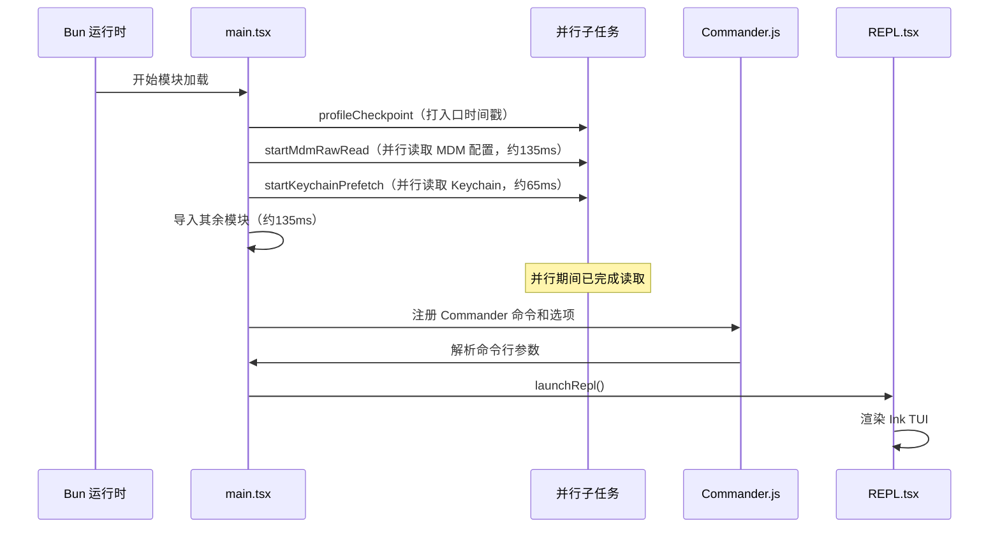
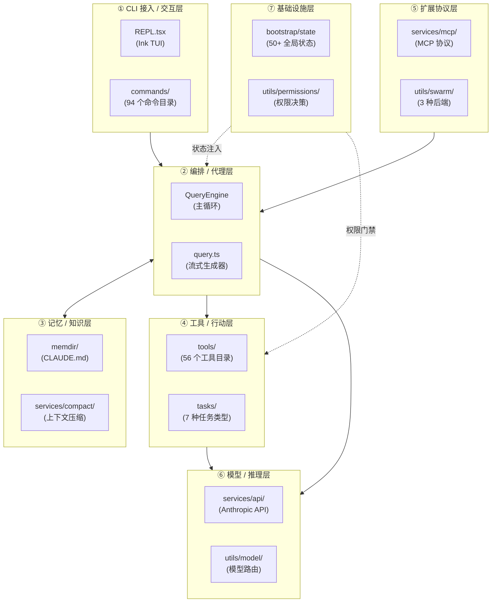
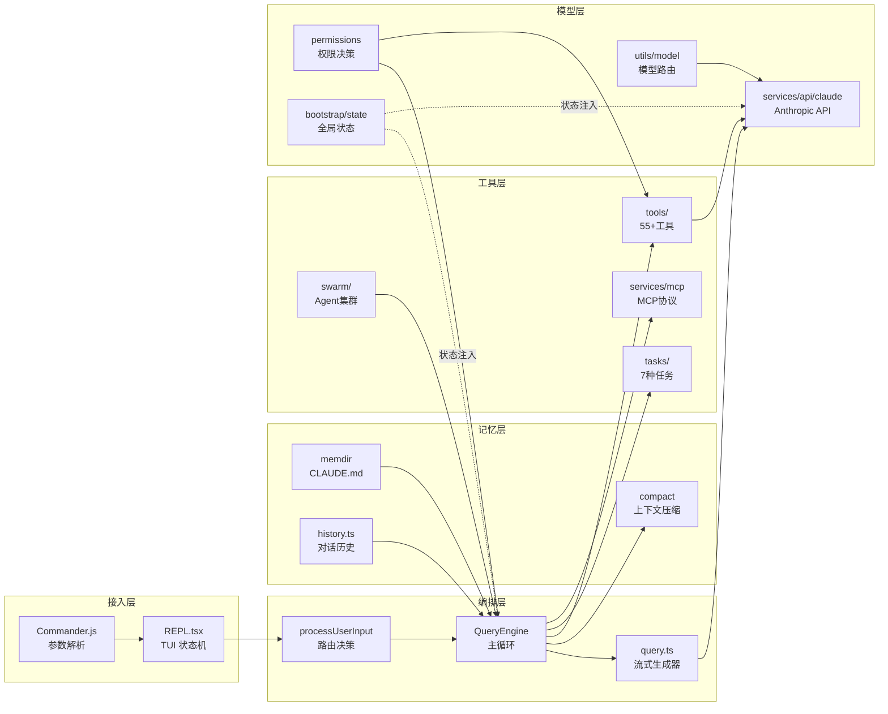
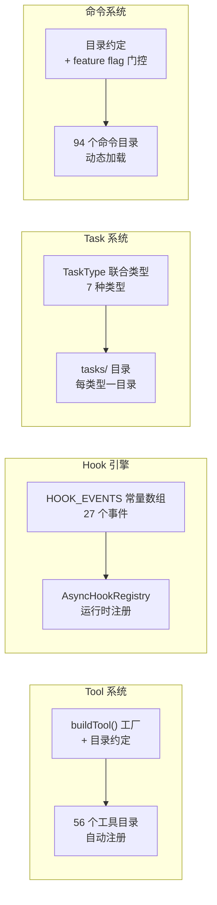

# 第 1 章：系统总体架构与技术栈——Claude Code 的结构地图

> "大型系统的架构，是它所由之构成的那些简单系统的结构。"
> （原文："The architecture of a large system is the structure of the simpler systems that compose it."）


Claude Code 是 Anthropic 推出的 AI 驱动编程助手，外界看到的是一个 CLI 工具，但源码揭示的是一套精密的 **Agent Harness 工程架构**——将不可控的 AI 行为封装进可编排、可拦截、可扩展的工程管道中。

**技术栈**：TypeScript + Bun 运行时，以 Ink（React for CLI）渲染 TUI。

**核心设计理念**：它的每一个子系统——Tool、Hook、Task、Swarm、Context Engineering都在解决同一个核心问题：**在 AI 的不确定性和工程系统的确定性之间，构建可靠的桥梁**。


Claude Code 反复使用同一种模式管理它的工具、命令、Hook 和 Task：**分层注册表（Layered Registry）**——每个功能子系统用目录约定作为隐式注册表，配合工厂函数或联合类型做类型收窄。这个模式在 4 个核心子系统中各自独立演化出了不同的变体，但共享同一骨架：用目录约定替代显式注册，用类型系统替代运行时检查。

读完本章，我们将获得一张完整的架构导航图：7 大功能子系统的职责边界与连接关系、Bun/TypeScript/Ink 技术栈各自放弃了什么换来了什么，以及一种可移植的架构识别方法——**看目录比看文档更快**。

---

## 问题：如何在一个 50 万行代码库中建立全局坐标系？

打开 `src/main.tsx` 的前 22 行，我们会看到一条精心编排的启动序列：

```typescript
// 这些副作用必须在所有其他导入之前运行：
// 1. profileCheckpoint 在重量级模块求值开始前标记入口时间
// 2. startMdmRawRead 启动 MDM 子进程（plutil/reg query），
//    使它们与下方约 135ms 的导入并行运行
// 3. startKeychainPrefetch 并行启动两项 macOS 钥匙串读取（OAuth + 传统 API key）
//    否则 isRemoteManagedSettingsEligible() 会通过同步 spawn 顺序读取（每次约 65ms）
import { profileCheckpoint, profileReport } from './utils/startupProfiler.ts';

profileCheckpoint('main_tsx_entry');
import { startMdmRawRead } from './utils/settings/mdm/rawRead.ts';

startMdmRawRead();
import { ensureKeychainPrefetchCompleted, startKeychainPrefetch } from './utils/secureStorage/keychainPrefetch.ts';

startKeychainPrefetch();
import { feature } from 'bun:bundle';
```

**源码参考：** `src/main.tsx:1-21`

这 21 行不是随意写的。三个副作用（`profileCheckpoint`、`startMdmRawRead`、`startKeychainPrefetch`）被刻意放在所有 `import` 语句之前——不是出于代码美感，而是因为模块加载本身需要约 135ms（注释原文如此），在此期间并行启动的子进程和钥匙串读取可以"免费"完成。**启动延迟是累积的，每一毫秒都要争**——这是 Claude Code 作为一个 CLI 工具最直接面对的工程约束。

注意第 21 行的 `import { feature } from 'bun:bundle'`。这是 Bun 运行时特有的构建时 API，用于**死代码消除（Dead Code Elimination, DCE）**。在第 80 行，它的效果更加直观：

```typescript
// 死代码消除：KAIROS（助手模式）的条件导入
const assistantModule = feature('KAIROS')
  ? require('./assistant/index.js') as typeof import('./assistant/index.js')
  : null;
```

**源码参考：** `src/main.tsx:80-83`

`feature('KAIROS')` 在 Bun 构建时求值：若 KAIROS 未激活，整个 `require('./assistant/index.js')` 分支从产物中消失，不占运行时开销。这不是 `if/else` 的运行时分支，而是**构建时的手术刀**——以零运行时代价实现功能隔离。目前源码中有 828 处 `feature()` 调用，这一机制支撑着 Claude Code 同一份代码在 Anthropic 内外不同版本之间差异化部署（feature() 的完整机制详见第 3 章）。

启动序列揭示了第一个线索：**Claude Code 的架构不是一个"大而全"的单体设计，而是一个经过精细约束的分层体系**。哪些功能属于"本体"，哪些属于"可选特性"，从入口文件第一行就开始划定边界。

**图 1-1：Claude Code 启动序列**



图 1-1 展示了启动序列的关键设计：三条并行预取线索与 135ms 的模块加载"赛跑"，而非顺序等待，将感知延迟压缩至接近于零。

---

## 源码实例 1：七大子系统的全景图与目录约定

理解架构的第二步：把 38 个顶层目录分组。Claude Code 的源码目录并不是随机散落的——**目录结构就是架构文档**，每个功能子系统在 `src/` 下都有对应的目录群。

我们先从一张鸟瞰图建立坐标系：

**图 1-2：七大功能子系统连接关系**



图 1-2 中的七层并非平等的水平层——**编排/代理层（L2）是真正的枢纽**，双向访问记忆层（读写上下文），向下驱动工具层和模型层。扩展协议层（MCP/Swarm）向编排层注入能力，基础设施层以状态和权限控制贯穿全程。

自上而下，编排层是核心枢纽，双向访问记忆层（读写上下文），向下驱动工具层和模型层。横切关注点通过 `bootstrap/state.ts` 这一全局状态单例贯穿全程。

下面逐一验证关键子系统的源码入口：

**QueryEngine**（`src/QueryEngine.ts:184`）是编排层的心脏，定义了 AI 主循环类：
```typescript
export class QueryEngine {
```

这个类持有对话历史（`messages: Message[]`）、可用工具集（`tools: Tools`）、文件状态缓存（`context: ToolUseContext`），以及当前会话的权限模式（`permissionMode: PermissionMode`）。每一次用户输入都通过它进入"AI 响应 → 工具调用 → 再次请求"的往返循环。QueryEngine 的完整主循环逻辑详见第 8 章。

**Tool 系统**（`src/Tool.ts:783`）用一个 56 目录的注册表管理所有工具——从文件读写到网络请求，从 Bash 执行到 MCP 工具代理。每个工具目录下的文件自动成为 Tool 系统的成员，新增工具无需修改任何中央注册文件。Tool 接口契约与 buildTool 工厂详见第 10 章。

**Hook 引擎**（`src/entrypoints/sdk/coreTypes.ts:25`）将系统的生命周期暴露为 27 个可拦截事件：

```typescript
export const HOOK_EVENTS = [
  'PreToolUse',      // 工具调用前
  'PostToolUse',     // 工具调用后
  'PostToolUseFailure',
  'Notification',
  'UserPromptSubmit', // 用户提交提示词前
  'SessionStart',
  'SessionEnd',
  // ...共 27 个
  'FileChanged',
] as const
```

**源码参考：** `src/entrypoints/sdk/coreTypes.ts:25-53`

这 27 个事件构成了 Claude Code 的"神经末梢"——用户可以在每个触发点注入自定义 Shell 命令，实现从审计日志到自动测试的任意生命周期扩展。Hook 系统的完整拦截机制详见第 20 章。

**Task 系统**（`src/Task.ts:6`）将后台任务分为 7 种类型：
```typescript
export type TaskType =
  | 'local_bash'           // 本地 Bash 进程
  | 'local_agent'          // 本地子 Agent
  | 'remote_agent'         // 远程 Agent
  | 'in_process_teammate'  // 进程内 Teammate
  | 'local_workflow'       // 多步工作流
  | 'monitor_mcp'          // MCP 服务监控
  | 'dream'                // 后台异步任务
```

**源码参考：** `src/Task.ts:6-13`

从 `local_bash` 到 `dream`，任务类型的演化轨迹清晰可见：最初只有本地 Shell 任务，随着 Agent 协作和 MCP 集成的引入，类型枚举从 1 种扩展到 7 种。Task 系统的完整状态机详见第 25 章。

七大子系统汇总如下：

| 子系统 | 主要目录 | 核心文件 | 详细章节 |
|-------|---------|---------|---------|
| CLI 接入/交互层 | `screens/`, `components/` | `REPL.tsx`, `main.tsx` | 第 1 章（本章）|
| 编排/代理层 | `src/` 根目录 | `QueryEngine.ts`, `query.ts` | 第 8-9 章 |
| 记忆/知识层 | `memdir/`, `services/compact/` | `memdir.ts`, `autoCompact.ts` | 第 17-18 章 |
| 工具/行动层 | `tools/`（56 目录）| `Tool.ts`, `tools.ts` | 第 10-14 章 |
| 扩展协议层 | `services/mcp/`, `utils/swarm/` | `client.ts`, `backends/` | 第 29-32 章 |
| 模型/推理层 | `services/api/`, `utils/model/` | `claude.ts`, `model.ts` | 第 6-7 章 |
| 基础设施层 | `bootstrap/`, `utils/permissions/` | `state.ts`, `permissions.ts` | 第 2、11 章 |

---

**图 1-3： 跨层数据流图**：



图 1-3 描述了数据流动从输入层到记忆层、再到工具层和模型层，最后返回编排层主循环的过程。

---

## 源码实例 2：技术选型的三重约束

为什么是 Bun 而不是 Node？为什么是 Ink 而不是普通的 `console.log`？技术选型背后是三个相互独立的工程约束——**每一项选型都排除了一个替代方案，并接受了一项代价**。

### Bun：零启动开销 vs. 生态锁定

`src/main.tsx:21` 的 `import { feature } from 'bun:bundle'` 是 Bun 专属 API，Node.js 没有对应物。**选择 Bun 的核心动机是 `bun:bundle` 的构建时 DCE 能力**——以"锁定 Bun 生态"为代价，换取两项优势：

| 维度 | Bun | Node.js（替代方案）|
|------|-----|-----|
| TypeScript 执行 | 原生支持，无需 tsc/ts-node | 需要编译步骤或 tsx |
| 构建时 DCE | `feature()` 在 bundle 时求值，未激活代码从产物消失 | 无原生等价物 |
| 启动速度 | 冷启动约 50-80ms（推断，无实测数据）| 冷启动 100-200ms（推断）|
| 生态兼容 | 兼容大多数 npm 包，但 Bun 特定 API 不可移植 | 完整 Node 生态，零迁移成本 |

**核心权衡**：Claude Code 作为每次交互都需要冷启动的 CLI 工具，启动延迟直接影响用户体验。Bun 的原生 TypeScript 和构建时 DCE 对这个场景是决定性优势。代价是：如果有一天需要迁移回 Node，`feature()` 的 828 处调用都需要重写。

### TypeScript：类型安全 vs. 类型复杂度

`src/Tool.ts:783-792` 展示了 TypeScript 为什么必要：

```typescript
export function buildTool<D extends AnyToolDef>(def: D): BuiltTool<D> {
  // The runtime spread is straightforward; the `as` bridges the gap between
  // the structural-any constraint and the precise BuiltTool<D> return.
  // The type semantics are proven by the 0-error typecheck across all 60+ tools.
  return {
    ...TOOL_DEFAULTS,
    userFacingName: () => def.name,
    ...def,
  } as BuiltTool<D>
}
```

**源码参考：** `src/Tool.ts:783-792`

这个泛型工厂函数保证：每一个传入的工具定义（`AnyToolDef`）都被提升为类型精确的 `BuiltTool<D>`。注释中写道"通过 0 错误类型检查横跨所有 60+ 工具证明了类型语义"——**TypeScript 在这里不是语法糖，而是跨越 56 个工具目录的类型一致性保证**。如果改用纯 JavaScript，每个工具的接口一致性就只能靠运行时检查和开发者纪律来维持，规模一大必然失控。

**核心权衡**：类型安全以复杂度为代价——`buildTool` 函数的泛型约束 `D extends AnyToolDef` 和 `BuiltTool<D>` 返回类型，对 TypeScript 初学者来说是陡峭的阅读门槛。但在 2007 个文件的代码库中，这种复杂度换来的是编译器充当第一道集成测试。

### Ink：React 组件模型 vs. 运行时体积

为什么 Terminal UI 需要 React？答案在 `src/components/` 的规模：144 个 React/Ink 组件。

Ink 将 React 的组件组合模型搬进终端。好处是 Claude Code 的 TUI 复杂度（144 个组件、虚拟滚动列表、多层 Context Provider）在 React 的声明式模型下可以被管理；如果改用 `blessed` 或手写 ANSI 转义序列，这种复杂度会变得不可维护。

**核心权衡**：引入 React 运行时增加了约 200KB 的包体积（推断）。对一个每次都重新加载的 CLI 工具来说，这是明确的成本。Anthropic 判断 TUI 的可维护性优先于这个成本——这个判断至少在 144 个组件建成之前是对的。

---

## 模式剖析：分层注册表的四个变体

现在我们看到了足够多的源码实例，可以提炼出它们的共同骨架。**分层注册表（Layered Registry）**模式在 Claude Code 中有四个变体——它们解决同一个问题（如何让新功能的加入不修改核心代码），但注册机制各不相同：

**图 1-4：分层注册表四变体对比**



逐一对比四个变体的注册机制差异：

| 子系统 | 注册机制 | 类型约束 | 入口数量 | 扩展方式 |
|-------|---------|---------|---------|---------|
| Tool 系统 | `buildTool()` 工厂函数 + 目录约定 | TypeScript 泛型（`BuiltTool<D>`）| 56 个工具目录 | 新建目录 + 调用 buildTool |
| Hook 引擎 | `HOOK_EVENTS` 常量数组 + `AsyncHookRegistry` | `as const` 字面量类型 | 27 个事件 | 修改常量数组（编译时固化）|
| Task 系统 | `TaskType` 联合类型 + 目录约定 | TypeScript 联合类型 | 7 种类型 | 扩展联合类型 + 新建目录 |
| 命令系统 | 目录约定 + `feature()` 门控 | 运行时检查 | 94 个命令目录 | 新建目录（可选 feature 门控）|

**四个变体的关键差异**在于"注册在哪个时机发生、由谁强制执行"：

- **Tool 系统**：注册发生在**编译时**，由 TypeScript 泛型强制——如果某个工具没有实现 `isAllowed()` 方法，`buildTool()` 的类型检查会拒绝编译。这是四个变体中类型安全性最强的。

- **Hook 引擎**：注册发生在**构建时**，`HOOK_EVENTS` 常量数组以 `as const` 固化为字面量类型。新增 Hook 事件需要修改这个数组（`src/entrypoints/sdk/coreTypes.ts:25`），这意味着 Hook 事件集合在 bundle 后是不可动态扩展的——**每新增一个 Hook 事件，都是一次向外部开发者的 API 承诺**。

- **Task 系统**：注册发生在**类型定义时**，`TaskType` 联合类型（`src/Task.ts:6`）是所有任务类型的枚举边界。从 1 种扩展到 7 种的演化历史直接写在类型定义里，每一个 `|` 都是一次功能迭代的痕迹。

- **命令系统**：注册发生在**运行时目录扫描**，结合 `feature()` 门控决定哪些命令在当前 bundle 中可见。这是四个变体中最灵活的，也是类型安全性最弱的——一个命令目录存在但 `feature()` 未激活，在运行时表现为"命令不存在"而非编译错误。

这种变体多样性不是设计疏忽，而是每个子系统的**演化约束不同**造成的——Tool 需要跨 56 个独立团队安全地扩展，Hook 需要保持跨版本兼容性，Task 随新功能迭代渐进扩展，命令需要在商业和内部版本之间差异化。

**模式提炼：分层注册表（Layered Registry）**

> **模式名称**：分层注册表（Layered Registry）
>
> **解决的问题**：在功能种类多、独立性强的大型系统中，如何让新功能的加入不需要修改核心调度代码？
>
> **核心做法**：每个功能子系统用目录约定作为隐式注册表，配合工厂函数（Tool）、常量数组（Hook）或联合类型（Task）做类型收窄，使新成员的加入等价于"新建一个遵守约定的目录"。
>
> **前置条件**：子系统成员间松耦合（Tool A 不直接依赖 Tool B），功能可按目录独立组织，有统一的入口类型约束（无论是泛型工厂还是联合类型）。
>
> **源码证据**：`src/Tool.ts:783`（buildTool 工厂）、`src/Task.ts:6`（TaskType 联合）、`src/entrypoints/sdk/coreTypes.ts:25`（HOOK_EVENTS 常量）

---

## 适用范围

不是所有场景都适合分层注册表。

| 场景 | 适用 | 理由 | 替代方案 |
|------|------|------|---------|
| 功能种类多、各自独立（如工具、命令）| ✓ | 每个成员可独立测试和部署，目录约定降低认知负担 | 显式注册中心（适合功能少但互依赖多的情况）|
| 功能需要动态扩展（运行时插件）| ✓（命令变体）| 目录扫描天然支持运行时发现 | 注意：Hook 变体的 `HOOK_EVENTS` 不支持运行时扩展 |
| 功能间有严格顺序依赖 | ✗ | 目录约定无法表达执行顺序，会产生隐式依赖 | 责任链（Chain of Responsibility）或有向图调度器 |
| 需要精确编译期完整性检查 | ✗（部分）| 目录约定的合法性检查依赖工厂函数，遗漏的成员不会触发编译错误 | 显式枚举 + 类型穷举检查（如 Task 变体的 `switch` + `never`）|
| 成员数量少于 5 | ✗ | 引入目录约定增加的认知成本高于收益 | 简单数组常量或 switch/case |
| 成员共享大量状态 | ✗ | 目录隔离使共享状态管理复杂化 | 单一模块 + 内部分发（Strategy 模式）|

---

## 权衡与局限

**分层注册表最大的盲区**是新成员的"合法性"无法在目录级别强制——工具目录存在，不代表工具实现正确。Claude Code 用两层机制弥补这个缺口：

第一层是 TypeScript 工厂函数（`buildTool()` 的泛型约束）——如果新工具缺少必要字段，编译期就会报错。但这只能检查"接口完整性"，不能检查"行为正确性"（例如工具的 `execute()` 是否按承诺返回正确类型）。

第二层是 Zod 运行时验证——每个工具的 `inputSchema` 是 Zod Schema，在工具执行前验证 AI 传入的参数（详见第 10 章）。这是对"AI 可能产生格式错误的工具调用参数"这一特定风险的补偿。

**注意 `as BuiltTool<D>` 类型断言**（`src/Tool.ts:792`）：注释写道"类型语义被 0 错误类型检查横跨所有 60+ 工具证明"——这意味着类型安全的最终保证依赖于整体编译通过，而非每个调用点的独立推导。如果新增工具绕过 `buildTool()` 直接构造工具对象，类型系统的保护就会失效。这是目录约定模式共同的代价：约定的遵守依赖团队纪律，而非编译器强制。

还有一个**规模风险**：56 个工具目录在逻辑上是平等的，但认知负担不平等——`BashTool` 的逻辑复杂度远超 `SleepTool`。当新开发者需要找一个工具调用时，"看目录"仍然比"看文档"快，但在 56 个目录中定位正确的工具需要对整个注册表有一定了解。这个代价随工具数量线性增长。

---

## 与已知模式的对话

**分层注册表与 GoF 插件模式（Plugin Pattern）**有同一祖先："通过间接层解耦使用者与具体实现"。但 GoF 插件模式的注册发生在**代码级别**（显式调用 `registry.register(plugin)`），而分层注册表的注册发生在**目录级别**（文件存在即注册）。

Martin Fowler 的**服务定位器（Service Locator）**更接近一些——都依赖间接层在运行时（或构建时）解析具体实现。但服务定位器通常是全局单例，而分层注册表是按子系统分布的，每个子系统有独立的"注册表入口类型"。

| 模式 | 注册方式 | 发现机制 | 编译检查 | Claude Code 中的实例 |
|------|---------|---------|---------|---------------------|
| GoF Plugin Pattern | 显式代码调用 `register()` | 运行时查找 | 接口兼容性检查 | 无（Tool 系统更接近 Factory Method）|
| Service Locator | 配置文件或代码注册 | 运行时查找 | 弱（依赖字符串键名）| `services/mcp/client.ts` 的 memoize 缓存（部分相似）|
| **分层注册表** | 目录约定（隐式）| 构建时扫描 + 工厂函数 | 强（泛型工厂）→ 弱（目录约定）| Tool/Hook/Task/Command |
| POSA Service Registry | 显式注册 + 查找 | 运行时动态查找 | 弱 | — |

**分层注册表的独特之处**在于：注册的"物理单元"是文件系统目录，而非代码对象。这使得它对团队协作友好（每个工具目录就是一个独立 PR），但对编译器的语义理解不友好（编译器不懂"目录约定"的含义，只懂类型约束）。这是一个在"工程组织效率"和"编译器静态分析能力"之间的刻意取舍。

---

## 你能做什么

- **用 `ls -d src/tools/*/ | wc -l` 验证工具总数**。当前应得到 56（不含 `shared/`、`testing/`、`utils.ts`）。如果你的项目有类似的"功能目录"，用这个命令每天监控增长速度——增长太快是架构压力的早期信号。

- **追踪 `src/main.tsx:12` 的 `profileCheckpoint`**，找到它在启动序列中的所有调用点（`grep -n "profileCheckpoint" src/main.tsx`）。每个检查点之间的注释解释了为什么要在这个时刻打点，这比任何文档都更诚实地揭示了性能瓶颈所在。

- **尝试引入“目录即注册表”约定到自己的 Agent 项目**。选一个功能种类多的子系统（如 Agent 的工具、提示词模板、评估器），改用目录约定替代显式注册数组。对比一个月后的维护成本变化——通常是减少了“忘记注册新成员”的错误，增加了“目录太多找不到”的问题。

- **阅读 `src/entrypoints/sdk/coreTypes.ts:25-53` 的 HOOK_EVENTS 常量**，统计你的系统需要暴露多少生命周期事件。如果答案超过 15 个，你的系统可能已经演化出了需要统一管理的"生命周期复杂度"——分层注册表中的 Hook 变体值得参考。

- **对比 `buildTool()` 工厂（`src/Tool.ts:783`）和 `TaskType` 联合类型（`src/Task.ts:6`）两种注册机制**，思考你的系统中哪类功能更适合工厂函数（需要编译时完整性检查）、哪类适合枚举类型（需要类型穷举能力）。它们不互斥，可以组合使用。

- **规范命名约定的时机：同类功能超过 30 个**。Claude Code 的工具目录以大写驼峰命名（`BashTool`、`FileReadTool`），命令目录以小写中划线命名（`clear/`、`add-dir/`）——两套约定各自一致，跨套学习成本很低。不要等到目录命名已经混乱再统一。

- **用 `grep -rn "feature('" src/ | wc -l`** 感受死代码消除机制的渗透程度（结果应接近 828 处）。如果你在构建一个同时面向多个部署环境的系统，`feature()` 风格的构建时门控是比运行时 `if/else` 更干净的方案——前者零运行时开销，后者永远带着死代码上线。

---
下一章（第 2 章）深入理解七大子系统之间信息传递的暗线——全局状态单例的 50+ 字段每一个都代表某个子系统无法通过参数传递解决的“会话级共享需求”，读懂它是读懂任何单一子系统“为什么这样设计”的前提。
