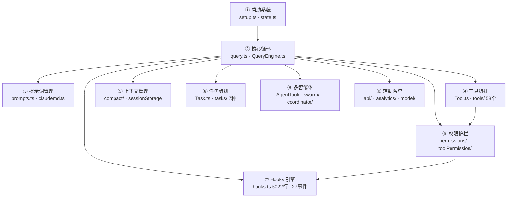
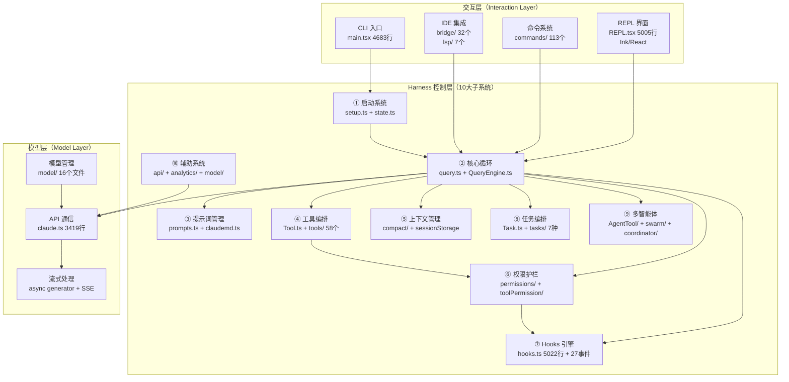
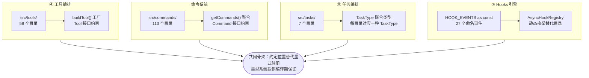

# 第 1 章：系统总体架构——Claude Code 的结构地图

> "好的架构让正确的事情容易做、错误的事情难以发生。"
> （原文："Good architecture makes the right things easy and the wrong things hard."）

同一个代码库里，有人看到一个 CLI 工具，有人看到一套 Agent 平台。这不是视角的差异——而是层次的差异。Claude Code 的 2,000 个源文件、51 万行 TypeScript 背后，有一张可以被命名的结构地图：**三层架构（Three-Layer Architecture）**，加上 Harness 控制层中彼此独立的十大子系统。

这张地图在代码库中反复出现，以同一种方式组织自身：**目录即注册表（Directory-as-Registry）**。工具目录 `src/tools/`（58 个）、命令目录 `src/commands/`（113 个）、任务目录 `src/tasks/`（7 种类型）和 Hooks 目录 `src/utils/hooks/`——每一处都在用相同的骨架：约定文件位置替代显式注册，类型系统替代运行时检查。

读完这章，我们将获得三样东西：一张描述三层架构与十大 Harness 子系统的导航地图；一个可以应用到任何 Agent 系统设计的"目录即注册表"模式；以及一套"**看目录比看文档更快**"的源码阅读方法论。

---

## 问题：50 万行代码，从哪里开始读？

打开一个陌生的大型代码库，最常见的错误是从第一个文件读起。`src/main.tsx` 有 4,683 行——读完它再读 `src/screens/REPL.tsx`（5,005 行）、`src/utils/hooks.ts`（5,022 行），没有地图就是迷宫。

真正的问题不是"这段代码做什么"，而是**"这段代码属于哪一层、解决哪类问题"**。

Claude Code 给了我们一个隐藏的答案：它的目录结构本身就是架构的物理映射。

---

## 源码实例 1：三层架构的物理体现

### 交互层——用户输入的第一道门

交互层（Interaction Layer）负责接收用户输入、渲染 TUI、路由命令、桥接 IDE。它有四个子系统：

| 子系统 | 核心路径 | 规模 |
|--------|---------|------|
| CLI 入口 | `src/main.tsx` | 4,683 行 |
| REPL 界面 | `src/screens/REPL.tsx` | 5,005 行（Ink/React） |
| 命令系统 | `src/commands/`（113 个目录） | `src/commands.ts`（路由） |
| IDE 集成 | `src/bridge/`（32 个文件）+ `src/services/lsp/`（7 个文件） | — |

`src/main.tsx` 的前 9 行揭示了交互层与下层的关系：

```typescript
// src/main.tsx:1-9
// 这些副作用必须在所有其他导入之前运行：
// 1. profileCheckpoint 在重量级模块求值开始前标记入口时间
// 2. startMdmRawRead 启动 MDM 子进程（plutil/reg query），
//    使它们与下方约 135ms 的导入并行运行
// 3. startKeychainPrefetch 并行启动两项 macOS 钥匙串读取
//    （否则顺序读取每次约 65ms）
```

**源码参考**：`src/main.tsx:1-9`

这段注释的工程价值在于：它不只是说明"做什么"，而是解释"为什么要在这里做"——利用 import 求值期间约 135ms 的等待窗口并行执行 I/O 操作。交互层的职责是**把用户输入变成 Harness 控制层能处理的事件序列**，并在此之前尽可能利用启动时间。

### Harness 控制层——十大子系统

Harness 控制层是整个系统的核心。"Harness"（驾驭装置）这个词选得精准：它的作用是把不可控的 LLM 行为约束在可控的工程管道里。

这一层有十个独立子系统：

**图 1-1：Harness 控制层十大子系统**



*图注：② 核心循环是 Harness 的心脏，其他九个子系统通过它协同。⑦ Hooks 引擎被权限护栏（⑥）和工具编排（④）共同依赖，同时接收所有子系统的生命周期事件——这是它作为独立子系统的核心依据。*

每个子系统对应一个可验证的源码锚点：

| 子系统 | 核心锚点 | 规模 |
|--------|---------|------|
| 启动系统 | `src/setup.ts:1`，`src/bootstrap/state.ts:1` | state.ts 1,762 行，含 50+ 状态管理函数 |
| 核心循环 | `src/query.ts:219`（`query()` async generator） | 1,729 行 |
| 提示词管理 | `src/constants/prompts.ts:1`，`src/utils/claudemd.ts:1` | — |
| 工具编排 | `src/Tool.ts:1`（Tool 接口），`src/tools/`（58 个工具目录） | — |
| 上下文管理 | `src/services/compact/`（16 个文件），`src/state/AppStateStore.ts:1` | compact.ts 1,705 行 |
| 权限护栏 | `src/utils/permissions/`（8 个文件），`src/hooks/toolPermission/` | — |
| Hooks 引擎 | `src/utils/hooks.ts:1`（5,022 行），`src/utils/hooks/`（10 个文件） | **27 个命名事件**（`src/entrypoints/sdk/coreTypes.ts:25`） |
| 任务编排 | `src/Task.ts:6`（7 种 `TaskType`），`src/tasks/`（7 个目录） | — |
| 多智能体 | `src/tools/AgentTool/`（14 个文件），`src/utils/swarm/`（14 个文件） | AgentTool.tsx 1,397 行 |
| 辅助系统 | `src/services/api/claude.ts:1`，`src/utils/model/`（16 个文件） | claude.ts 3,419 行 |

`src/utils/hooks.ts` 有 5,022 行，是代码库中最大的工具文件之一。`src/entrypoints/sdk/coreTypes.ts:25` 定义了 27 个命名事件——从 `PreToolUse` 到 `FileChanged`——覆盖工具执行前后、会话开始结束、多智能体协作、上下文压缩等全部生命周期节点。Hooks 引擎是 Harness 的神经系统：所有子系统的关键操作都在这里暴露钩子，外部程序无需修改核心代码就能观测和介入 Agent 的任何行为。把它从权限护栏中分离出来，是因为它的影响范围已经远超权限检查——它是整个 Harness 的**可观测性和可扩展性接口**。

### 模型层——API 通信的最后一公里

模型层（Model Layer）封装了与 Anthropic API 通信的全部细节：

| 子系统 | 核心路径 | 规模 |
|--------|---------|------|
| API 通信 | `src/services/api/claude.ts:1` | 3,419 行 |
| 模型管理 | `src/utils/model/`（16 个文件） | 含 Bedrock/Vertex 适配 |
| 流式处理 | `src/query.ts:219` async generator | — |

`src/query.ts:219` 的函数签名揭示了模型层与 Harness 层的接口契约：

```typescript
// src/query.ts:219
export async function* query(
  params: QueryParams,
): AsyncGenerator<
  | StreamEvent
  | RequestStartEvent
  | Message
  | TombstoneMessage
  | ToolUseSummaryMessage,
  Terminal
>
```

**源码参考**：`src/query.ts:219-228`

这个 async generator 是 Harness 控制层调用模型层的统一入口。它向上 yield 流式事件，向下驱动 API 调用——三层架构的交界面就在这里。

**图 1-2：三层架构全景**



*图注：三层架构的完整连接关系。Harness 核心循环（②）是系统的心脏——所有子系统都通过它协同。Hooks 引擎（⑦）被权限护栏（⑥）依赖，同时也接收来自其他子系统的事件——这是它必须作为独立子系统的原因。*

---

## 源码实例 2：目录即注册表——跨层通用的组织模式

三层架构描述了"如何分层"，但没有回答"每一层内部如何组织"。这里出现了第二个模式，它在代码库中至少出现了 4 次：

**目录即注册表（Directory-as-Registry）**：用文件系统目录作为隐式注册表，每个目录代表一个注册单元，配合联合类型或工厂函数实现类型安全。

### 工具注册表：`src/tools/`

```typescript
// src/Task.ts:6
export type TaskType =
  | 'local_bash'
  | 'local_agent'
  | 'remote_agent'
  | 'in_process_teammate'
  | 'local_workflow'
  | 'monitor_mcp'
  | 'dream'
```

**源码参考**：`src/Task.ts:6-13`

`src/tools/` 有 58 个子目录，每个目录是一个工具。没有中心化的工具表——`src/tools.ts` 的 `getTools()` 函数（`src/tools.ts:271`）用 import 聚合的方式注册，TypeScript 的类型系统保证接口一致性。

### 命令注册表：`src/commands/`

`src/commands/` 有 113 个子目录，每个目录是一个斜杠命令（`/help`、`/compact`、`/model` 等）。`src/commands.ts` 的 `getCommands()` 函数负责聚合。模式与工具注册表完全相同。

### 任务注册表：`src/Task.ts` + `src/tasks/`

`src/Task.ts:6` 用联合类型定义了 7 种 `TaskType`，`src/tasks/` 下有 7 个对应目录（`LocalAgentTask/`、`RemoteAgentTask/` 等）。**类型系统作为注册表的类型层，目录作为注册表的实现层**——两者形成一对一映射。

### Hooks 注册表：`src/utils/hooks/` + `coreTypes.ts`

```typescript
// src/entrypoints/sdk/coreTypes.ts:25-52
export const HOOK_EVENTS = [
  'PreToolUse',    'PostToolUse',       'PostToolUseFailure',
  'Notification',  'UserPromptSubmit',  'SessionStart',
  'SessionEnd',    'Stop',              'StopFailure',
  'SubagentStart', 'SubagentStop',      'PreCompact',
  'PostCompact',   'PermissionRequest', 'PermissionDenied',
  'Setup',         'TeammateIdle',      'TaskCreated',
  'TaskCompleted', 'Elicitation',       'ElicitationResult',
  'ConfigChange',  'WorktreeCreate',    'WorktreeRemove',
  'InstructionsLoaded', 'CwdChanged',  'FileChanged',
] as const
```

**源码参考**：`src/entrypoints/sdk/coreTypes.ts:25-52`

27 个命名事件构成 Hooks 引擎的"注册表"——这次是用 `as const` 数组加联合类型，而非目录。`src/utils/hooks/` 下有 `AsyncHookRegistry.ts`（异步钩子注册）、`hooksConfigSnapshot.ts`（配置快照）、`hookEvents.ts`（事件定义）等 10 个文件分工协作。

**图 1-3：目录即注册表模式的四处实例**



*图注：四处实例共享同一骨架——前三处用目录作注册单元，第四处（Hooks）用常量数组，原因是 Hook 事件是命名的生命周期节点而非独立实现模块。右侧 `PATTERN` 节点是所有四处实例的抽象共性。*

---

## 模式剖析：两个互补的架构决策

本章揭示的两个模式解决不同层面的问题，但都服务于同一目标——让大型 Agent 代码库可读、可扩展、可维护。

| 维度 | 三层隔离架构 | 目录即注册表 |
|------|------------|------------|
| **解决层面** | 跨层职责划分 | 层内扩展点管理 |
| **组织单元** | 层（交互 / Harness / 模型） | 目录或常量数组 |
| **类型保证** | 层间接口（`query.ts:219`） | 工厂函数 + 联合类型 |
| **新增成本** | 新增一层需要重新设计接口 | 新增一个目录即完成注册 |
| **定位速度** | 按职责找层 → 层内找文件 | 按名字找目录 → 进入实现 |

两个模式的关键互补在于：三层架构解决了"这段代码属于哪一层"的问题，目录即注册表解决了"这一层里有哪些扩展单元"的问题。读陌生代码库时，先用三层架构定位层，再用目录即注册表定位具体模块——两步定位法比直接全文搜索快得多。

## 适用范围

| 场景 | 适用 | 原因 | 替代方案 |
|------|------|------|---------|
| Agent 系统有多种工具/命令需要动态扩展 | ✓ | 目录即注册表让新增不触动核心 | 插件化注册表（显式 register()） |
| 系统同时有 TUI + API + Headless 三种界面 | ✓ | 三层隔离可独立替换每一层 | Monolith（适合小型单用途工具） |
| 工具数量 < 10 且无扩展需求 | ✗ | 目录约定带来的结构成本大于收益 | 直接在 main.ts 中内联注册 |
| 实时性要求极高（< 10ms） | ✗ | 三层调用增加延迟，不适合高频路径 | 单层函数调用 |

---

## 权衡与局限

**三层架构的代价**：层间调用增加了调用链深度。当我们追踪一个工具错误时，需要从 REPL.tsx 往下过 query.ts、toolExecution.ts 到具体工具——路径最长可达 5-6 层。这是结构清晰的必要代价。

**目录即注册表的盲点**：`src/commands/` 有 113 个目录，但没有所有命令的统一索引文件。如果不知道命令名，很难快速定位。相比之下，`src/Task.ts:6` 的 `TaskType` 联合类型是一个反向工程的好入口——6 行代码就能看清任务系统的全貌。

**Hooks 引擎的双刃剑**：27 个命名事件（`src/entrypoints/sdk/coreTypes.ts:25`）提供了强大的可观测性，但也意味着任何破坏 Hook 接口的重构都会影响所有外部扩展。这是可扩展性的经典权衡。

---

## 与已知模式的对话

**三层架构 vs 经典三层（表现层-业务层-数据层）**：Claude Code 的交互层对应表现层，模型层不是数据层——它是"智能层"。Harness 控制层扮演了两个经典角色：业务逻辑（工具编排）+ 数据访问（上下文管理）。这种合并是 AI Agent 的特殊性：业务逻辑和上下文访问高度耦合，分开反而更复杂。

**目录即注册表 vs GoF 注册表模式（Registry of Singletons）**：GoF 注册表是运行时的，需要显式 `register()` 调用。Claude Code 的目录即注册表是**构建时（build-time）的**——文件系统结构即注册。这减少了运行时开销，但需要构建步骤来发现和聚合（`getTools()`、`getCommands()`）。

**Hooks 引擎 vs 观察者模式（Observer Pattern）**：Observer 的订阅者通常是在运行时动态注册的。Hooks 引擎的 27 个事件是**静态定义**的（`coreTypes.ts:25`），配合 `hooksConfigSnapshot.ts` 的快照机制——会话开始时"冻结"Hook 配置，防止运行期间的配置变更影响正在执行的会话。这是 Observer 模式的一个经过工程强化的变体。

---

## 模式提炼

### 三层隔离架构（Three-Layer Isolation）

**解决的问题**：AI Agent系统中UI、编排、API三类职责混写，任一层变化牵连另外两层。

**核心做法**：交互层只接收输入并路由，Harness层驱动业务逻辑，模型层只封装API通信——三层间通过明确的接口契约传递数据。

**前置条件**：系统需要同时支持多种交互界面（TUI / Headless / SDK），且各层预期需要独立演化。

**源码证据**：src/query.ts:219，src/main.tsx:1，src/services/api/claude.ts:1

---

### 目录即注册表（Directory-as-Registry）

**解决的问题**：大量同类扩展点（工具、命令、任务）如何不修改核心聚合代码就持续添加新单元。

**核心做法**：约定目录位置替代显式register()调用，聚合函数动态发现，TypeScript接口和联合类型在编译期保证一致性。

**前置条件**：扩展点数量超过 10 个，且需要持续增加新单元；构建步骤可以扫描目录完成聚合。

**源码证据**：src/tools/（58个目录），src/commands/（113个目录），src/Task.ts:6

---

## 你能做什么

1. **用目录结构做架构侦察**：在陌生代码库中，先看顶层目录——`src/tools/` 有多少子目录就有多少工具，比读文档快 10 倍
2. **为自己的 Agent 系统划定三层边界**：明确哪些代码属于"用户输入处理"、哪些属于"编排逻辑"、哪些属于"模型调用"，防止三层混写
3. **用联合类型作注册表的类型层**：参考 `Task.ts:6` 的 `TaskType` 模式，在新增任务类型时先更新类型定义，让编译器告诉你哪里需要同步修改
4. **设计 Hook 系统时先列举所有生命周期节点**：参考 `coreTypes.ts:25` 的 27 个事件，在系统设计阶段就把可观测点全部列出，而非事后打补丁
5. **阅读 Hooks 引擎前先看 `coreTypes.ts:25`**：27 个事件名就是整个 Hook 系统的全景——知道有哪些事件，再去 `hooks.ts` 找实现
6. **区分"三层架构"和"MVC"**：Claude Code 的 Harness 层同时包含业务逻辑和数据访问——这是 AI Agent 的合理选择，不是设计失误
7. **把 `QueryEngine.ts:184` 作为 SDK 集成入口**：`QueryEngine` 封装了 `query()` 的全部复杂性，这是从外部程序调用 Claude Code 的正确姿势

---

*下一章深入 Harness 控制层的基础设施：`src/bootstrap/state.ts` 的 1,762 行是如何用模块级变量实现进程内的全局状态管理，以及为什么 Claude Code 选择了这种单例模式而非依赖注入（详见第 2 章）。*
