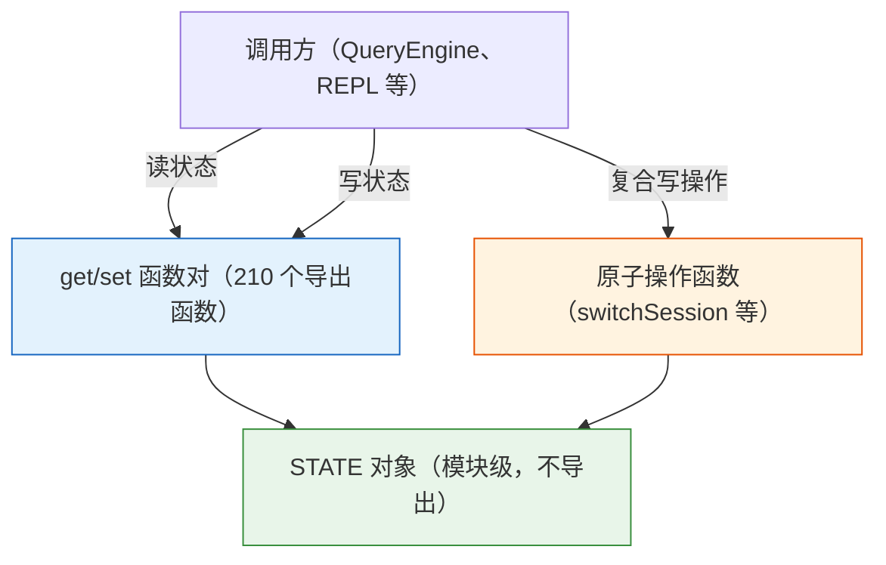
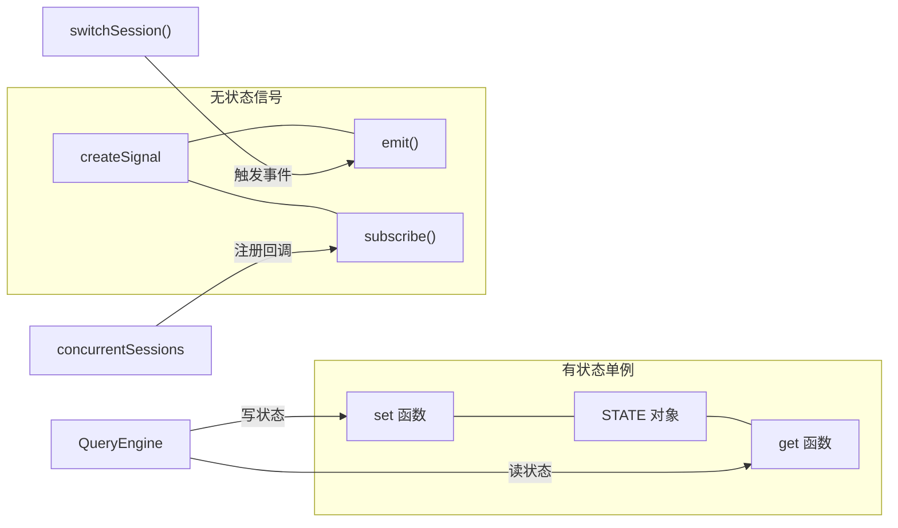

# 第 2 章：Bootstrap 与全局状态——210 个函数背后的单例设计

> "在代码库中，同一个文件里 210 个导出函数共享同一个对象——它们不约而同地选择了最朴素的方式管理全局状态。"

一个 Agent 系统需要共享会话状态、模型选择、权限设置等数十种全局信息——在 CLI 环境下，如何在零依赖的前提下管理这些状态？Claude Code 给出了一个出人意料的答案：**模块级单例（Module Singleton）**——1762 行代码、210 个导出函数，全部围绕一个模块级 `STATE` 对象运作，没有 DI 容器、没有 Store 框架、没有响应式绑定。读完本章，我们将理解这个看似朴素的选择背后的工程考量——以及何时该用、何时该换。

## 问题：如何在一个 1762 行状态模块中管理 50+ 种全局信息？

打开 `src/bootstrap/state.ts`，第 45 行开始是一个庞大的类型定义：

```typescript
type State = {
  originalCwd: string
  // 稳定的项目根目录——启动时设置一次（包括 --worktree 标志），
  // 会话中途的 EnterWorktreeTool 不会更新它。
  // 用于项目身份（历史、技能、会话），不用于文件操作。
  projectRoot: string
  totalCostUSD: number
  totalAPIDuration: number
  // ...省略约 40 个字段...
  mainLoopModelOverride: ModelSetting | undefined
  initialMainLoopModel: ModelSetting
  isInteractive: boolean
  kairosActive: boolean
  strictToolResultPairing: boolean
  // 遥测状态
  meter: Meter | null
  sessionCounter: AttributedCounter | null
  statsStore: { observe(name: string, value: number): void } | null
  sessionId: SessionId
  // ...省略约 10 个字段...
}
```

**源码参考：** `src/bootstrap/state.ts:45-100`

这个 `State` 类型有 **50+ 个字段**，覆盖了会话身份（sessionId）、路径管理（originalCwd、projectRoot）、费用追踪（totalCostUSD）、模型设置（mainLoopModelOverride）、遥测指标（meter 及各种 Counter）等完全不同的关注点。它们全部放在同一个类型中。

第 429 行，这个类型被实例化为一个**模块级常量**：

```typescript
// 特别是在这里（原文：AND ESPECIALLY HERE）
const STATE: State = getInitialState()
```

**源码参考：** `src/bootstrap/state.ts:429`

注释"特别是在这里"（原文："AND ESPECIALLY HERE"）是开发者留下的标记——在 1762 行代码中，这一行是全局状态的"心脏"。此后的 210 个导出函数，全部围绕这个 `STATE` 对象展开。

**为什么把 50+ 种关注点放在同一个对象中，而不是拆分成多个 Store？** 因为 Claude Code 是一个 CLI 工具——它只有一个进程、一个会话、一个用户。在"单进程单会话"的前提下，多 Store 的隔离能力没有用武之地，反而增加了跨 Store 协调的复杂度。注释中"稳定的项目根目录——会话中途的 EnterWorktreeTool 不会更新它"（原文："Stable project root — never updated by mid-session EnterWorktreeTool"）揭示了一个精确的设计意图：**同一个对象中，有些字段是会话级可变的（如 cwd），有些是启动级锁定的（如 projectRoot）——它们的可变性通过注释约定而非类型系统来区分。**（推断：TypeScript 无法在类型层面表达"此字段只能写一次"的语义，所以用注释替代。）

这种"全量状态集中在一个对象"的做法，与第 1 章介绍的分层注册表（详见第 1 章）形成了对比：注册表模式把不同子系统分散到不同目录，而全局状态模式把不同关注点集中到同一个类型。**两种模式并不矛盾——注册表解决"功能的组织"，全局状态解决"运行时数据的共享"。**

## 源码实例 1：STATE 对象与 get/set 函数对的访问控制

`STATE` 对象本身没有被导出——外部代码无法直接访问它。取而代之的是 210 个导出函数，其中大量是 **get/set 配对**。

```typescript
export function getOriginalCwd(): string {
  return STATE.originalCwd
}

export function setOriginalCwd(cwd: string): void {
  STATE.originalCwd = cwd.normalize('NFC')
}
```

**源码参考：** `src/bootstrap/state.ts:500-517`

这对函数展示了一种精确的访问控制策略：**`STATE` 对象不导出，外部只能通过 get/set 函数读写特定字段。** 注意 `setOriginalCwd` 内部调用了 `.normalize('NFC')`——这是一个 Unicode 正规化（Unicode Normalization Form C）操作，确保路径字符串在不同操作系统间一致。这种"在 set 函数中插入校验逻辑"的做法，是 get/set 封装的核心价值：调用方不需要记住"每次设置路径都要 normalize"，set 函数替你做了。

但并非所有字段都有 set 函数。有些字段是**只读的**——只有 get，没有对应的 set：

```typescript
export function getSessionId(): SessionId {
  return STATE.sessionId
}

export function regenerateSessionId(
  options: { setCurrentAsParent?: boolean } = {},
): SessionId {
  if (options.setCurrentAsParent) {
    STATE.parentSessionId = STATE.sessionId
  }
  // 丢弃旧会话的 plan-slug 条目，防止 Map 积累过时键。
  // 需要跨会话携带 slug 的调用方（REPL.tsx clearContext）
  // 会在调用 clearConversation 之前读取它。
  STATE.planSlugCache.delete(STATE.sessionId)
  STATE.sessionId = randomUUID() as SessionId
  STATE.sessionProjectDir = null
  return STATE.sessionId
}
```

**源码参考：** `src/bootstrap/state.ts:431-450`

`sessionId` 的写操作不是简单的 set，而是通过 `regenerateSessionId` 函数——它同时处理了旧会话的 planSlugCache 清理和父会话继承。**这种"用一个命名函数替代通用 set"的模式，把字段的变更语义编码到了函数名中**——读代码的人一看 `regenerateSessionId` 就知道这不是简单的赋值，而是有副作用的操作。

`switchSession`（`src/bootstrap/state.ts:468-479`）的注释进一步揭示了原子性约束："sessionId 和 sessionProjectDir 总是一起变更——没有单独的 setter，所以它们不会漂移不一致（CC-34）。"（原文："sessionId and sessionProjectDir always change together — there is no separate setter for either, so they cannot drift out of sync (CC-34)."）这是 get/set 封装的第二个价值：**通过不提供单独的 set，强制调用方使用原子操作函数**。

**图 2-1：STATE 对象的 get/set 访问模式**



注意两种写路径的区别：简单字段通过 `setXxx()` 直接写入，复合字段通过命名函数（如 `switchSession`）原子地更新多个字段。这种区分防止了 `sessionId` 和 `sessionProjectDir` 漂移不一致。

除了 `STATE` 对象的 50+ 字段，state.ts 中还有 **6 个独立的模块级 `let` 变量**——它们不属于 `STATE`，而是模块私有的"辅助状态"：

| 变量 | 行号 | 用途 |
|------|------|------|
| `interactionTimeDirty` | 665 | 标记交互时间是否需要刷新 |
| `outputTokensAtTurnStart` | 724 | 当前轮次开始时的输出 token 数 |
| `currentTurnTokenBudget` | 725 | 当前轮次的 token 预算 |
| `budgetContinuationCount` | 732 | 预算续写次数 |
| `scrollDraining` | 792 | 滚动排空标志 |
| `scrollDrainTimer` | 793 | 滚动排空定时器 |

这 6 个变量的共同特征是：**它们是与 UI 渲染相关的临时状态，不需要跨会话持久化**。将它们从 `STATE` 中分离出来，保持了 `STATE` 作为"会话级全局状态"的语义纯粹性。

## 源码实例 2（变体）：createSignal 的事件订阅模式

210 个导出函数中有一个与众不同的——它不读写 `STATE`，而是提供**事件通知**能力。

```typescript
import { createSignal } from 'src/utils/signal.js'
// ...
const sessionSwitched = createSignal<[id: SessionId]>()

/**
 * 注册一个回调，当 switchSession 改变活跃 sessionId 时触发。
 * bootstrap 不能直接导入监听者（DAG 叶子节点），所以
 * 调用方自行注册。concurrentSessions.ts 用它保持 PID 文件的
 * sessionId 与 --resume 同步。
 */
export const onSessionSwitch = sessionSwitched.subscribe
```

**源码参考：** `src/bootstrap/state.ts:481-489`

`createSignal` 的完整实现只有 **43 行**，但注释信息量极大：

```typescript
/**
 * 微型监听器集合原语，用于纯事件信号（无存储状态）。
 *
 * 将约 8 行的 `const listeners = new Set(); function subscribe(){…};
 * function notify(){for(const l of listeners) l()}` 样板代码
 * （在代码库中重复了约 15 次）压缩为一行。
 *
 * 与 store（AppState、createStore）不同——没有快照，没有
 * getState。当订阅者只需要知道"某事发生了"，可选地附带事件参数，
 * 而不需要"当前值是什么"时，使用此原语。
 */
export type Signal<Args extends unknown[] = []> = {
  subscribe: (listener: (...args: Args) => void) => () => void
  emit: (...args: Args) => void
  clear: () => void
}
```

**源码参考：** `src/utils/signal.ts:1-25`

**这段注释揭示了一个精确的设计判断**：`createSignal` 刻意不存储状态——没有 `getState()`、没有快照。注释"与 store（AppState、createStore）不同"（原文："Distinct from a store (AppState, createStore)"）直接对比了两种模式：**Store 存储"当前值是什么"，Signal 只传递"某事发生了"**。

在 state.ts 中，`sessionSwitched` 信号的使用方式展示了这一区别：

1. `switchSession` 函数在更新 `STATE.sessionId` 后，调用 `sessionSwitched.emit(sessionId)` 通知所有订阅者
2. `concurrentSessions.ts` 通过 `onSessionSwitch` 注册回调，保持 PID 文件的 sessionId 与实际同步
3. 订阅者不需要知道旧的 sessionId 是什么——它们只关心"会话切换了，新的 ID 是 X"

**与实例 1 的关键区别**：实例 1（STATE + get/set）解决的是"如何共享当前值"——调用方随时可以 `getOriginalCwd()` 获取最新值。实例 2（createSignal）解决的是"如何通知变更事件"——调用方在事件发生时收到通知，但无法通过信号查询当前值。**两种模式互补，不是替代关系**。

**图 2-2：模块级单例的两个变体**



左侧（有状态单例）通过 `get/set` 函数链接到 `STATE` 对象——调用方可以随时主动查询当前值；右侧（无状态信号）通过 `subscribe/emit` 流程传递事件——调用方只在事件发生时被动接收通知。两条路径互不交叉，解决不同的状态共享问题。

## 模式剖析：模块级单例的两个变体

Claude Code 的全局状态管理可以归纳为两个变体：

| 变体 | 存储状态 | 访问方式 | 通知能力 | 实例 |
|------|---------|---------|---------|------|
| **有状态单例** | `STATE` 对象（50+ 字段） | get/set 函数对（210 个导出） | 无（调用方主动轮询） | `getOriginalCwd()` / `setOriginalCwd()` |
| **无状态信号** | 无（`createSignal` 不存储值） | subscribe 注册回调 | 有（emit 通知所有订阅者） | `sessionSwitched` / `onSessionSwitch` |

两个变体共享同一个核心做法：**模块作用域即容器**。不需要 DI 容器、不需要全局注册表——模块加载一次，内部变量天然唯一。差异在于解决的问题不同：有状态单例解决"多个模块如何共享当前值"，无状态信号解决"一个模块如何通知其他模块某事发生了"。


## 适用范围

| 场景 | 适用 | 理由 | 替代方案 |
|------|------|------|---------|
| 单进程 CLI 工具 | ✓ | 一个进程 = 一个全局实例，DI 的多实例隔离无用武之地 | DI 容器（过度设计） |
| 高频读 / 低频写 | ✓ | get 函数直接读 `STATE` 字段，零开销 | 响应式 Store（读写都有通知开销） |
| 需要精确的写入控制 | ✓ | 不提供 set = 只读；命名函数 = 原子操作 | 直接导出对象（无法控制写入粒度） |
| 多进程服务端 | ✗ | 模块级变量在进程间不共享 | Redis / 共享内存 / 消息队列 |
| 需要运行时替换依赖 | ✗ | 模块加载后无法替换 STATE 对象 | 依赖注入容器 |
| 需要精确的变更追踪 | ✗ | set 函数没有自动变更通知（需要手动 emit） | 响应式 Store（MobX、Zustand） |
| 多实例隔离（如多租户） | ✗ | 所有代码共享同一个 STATE | 请求级 Context（如 AsyncLocalStorage） |

## 权衡与局限

模块级单例的核心代价有三个。

**第一，单线程假设。** 整个 `state.ts` 没有任何锁、互斥量或原子操作——它隐含的前提是"Bun 主线程是唯一的写入者"。在单事件循环（Event Loop）的 Node.js/Bun 模型中，这个假设成立：没有真正的并发写入，只有异步交错。但如果未来引入 Web Worker 或多进程（如 Swarm 的 Teammate，详见第 29 章），模块级变量的共享语义将失效——每个 Worker 有自己的模块副本，`STATE` 不再是"全局唯一"。

**第二，测试隔离困境。** 因为 `STATE` 是模块级变量且不导出，测试之间无法"新建一个 STATE"。state.ts 提供了 `regenerateSessionId`（`src/bootstrap/state.ts:435`）和 `resetCostState`（`src/bootstrap/state.ts:864`）等重置函数作为补偿——但它们只重置部分字段，不是完整的重置。**如果测试修改了 `STATE.originalCwd` 但忘记恢复，后续测试可能拿到脏数据。**（推断：这是模块级单例的固有测试成本，Claude Code 选择接受这个成本而非引入 DI，因为测试场景有限。）

**第三，50+ 字段的"上帝对象"倾向。** 当 `State` 类型持续膨胀——从最初的路由状态扩展到遥测、模型选择、权限设置——它可能变成一个无所不包的"上帝对象"（God Object）。目前的 6 个独立 `let` 变量（`src/bootstrap/state.ts:665-793`）是拆分的开始：UI 临时状态已经被分离出 `STATE`，但遥测状态、会话状态、配置状态仍然混在一起。

## 与已知模式的对话

**图 2-3：三种全局状态管理模式的唯一性保证机制**

```mermaid
flowchart TD
    subgraph ModuleSingleton["模块级单例（Module Singleton）"]
        direction LR
        Import2["import {getXxx} from './state'"]
        Module2["模块首次加载 → STATE 初始化"]
        Unique2["唯一性保证：模块系统加载一次"]
        Import2 --> Module2 --> Unique2
    end

    subgraph GoFSingleton["GoF Singleton"]
        direction LR
        Call1["getInstance()"]
        Check1{"_instance
已存在?"}
        Create1["new State()"]
        Return1["返回 _instance"]
        Call1 --> Check1
        Check1 -->|否| Create1 --> Return1
        Check1 -->|是| Return1
    end

    subgraph ServiceLocator["Service Locator (Fowler)"]
        direction LR
        Locate["locate('state')"]
        Registry["注册表查询"]
        Result["返回注册的实例"]
        Locate --> Registry --> Result
    end

    style Unique2 fill:#e8f5e9,stroke:#388e3c
    style Create1 fill:#fff3e0,stroke:#e65100
    style Registry fill:#e3f2fd,stroke:#1565c0
```



三种模式的唯一性保证机制完全不同：模块级单例依赖运行时的模块加载机制（绿色，无额外代码）；GoF Singleton 用私有构造函数+运行时检查实现（橙色，需要自己写锁）；Service Locator 通过注册表查询实现（蓝色，灵活但弱类型）。

| 维度 | 模块级单例 | GoF Singleton | Service Locator (Fowler) |
|------|----------|---------------|------------------------|
| 唯一性保证 | 模块系统加载机制 | 运行时锁 + 私有构造函数 | 注册表查询 |
| 访问方式 | import 具名函数 | `getInstance()` | `locate(name)` |
| 测试隔离 | 困难（需要 reset 函数） | 困难（需要破坏单例） | 容易（替换注册表） |
| 类型安全 | 强（TypeScript 函数签名） | 弱（返回 any 或基类） | 弱（字符串键查找） |
| Claude Code 实例 | 210 个 get/set 函数 | — | — |

**共同祖先**：三种模式都在解决"全局唯一的访问点"问题。**关键区别**在于"唯一性如何保证"：GoF Singleton 用运行时锁（多线程安全），Service Locator 用注册表（灵活但弱类型），模块级单例用**模块系统的加载机制**——模块只加载一次，内部变量天然唯一，不需要额外的保证代码。

这种"借用语言/运行时机制而非自己实现"的做法，在 Go 社区有成熟的先例：Go 的包级变量就是 Go 式单例的标准写法。Claude Code 用 TypeScript 的模块系统做了同样的事。

## 模式提炼

### 模块级单例（Module Singleton）

**解决的问题**：在单进程 CLI 中如何用零依赖管理全局状态？

**核心做法**：利用模块系统加载保证唯一性，get/set 函数对封装访问，createSignal 提供事件通知。

**源码证据**：src/bootstrap/state.ts:429（STATE）、src/utils/signal.ts:27（createSignal）

## 你能做什么

- **用 `grep -c "export function" src/bootstrap/state.ts` 验证 210 个导出函数的数量**。这个数字是否比你的预期多或少？多意味着状态管理可能过度集中，少意味着分散到了其他模块。
- **阅读 `src/bootstrap/state.ts:45-100` 的 State 类型定义**，数一数有多少字段与你项目的全局状态需求重叠。Claude Code 有 50+ 字段——你的项目需要几个？
- **在自己的 CLI 项目中，对比 DI 容器和模块级变量的启动性能**。模块级变量在首次 import 时初始化，DI 容器需要构建对象图——在 CLI 的"快速启动"场景下，差异可能很显著。
- **用 `grep -rn "createSignal" src/ | wc -l` 感受信号模式的渗透程度**。如果数字超过 10，说明"无状态事件通知"在你的代码库中也是一个反复出现的需求。
- **追踪 `getOriginalCwd()` 的一个调用方**（如 `src/QueryEngine.ts`），理解模块级函数如何替代 DI 注入——调用方只需要 `import { getOriginalCwd }`，不需要知道 STATE 的存在。
- **思考你的 Agent 项目是否满足"单进程、单会话"前提**。如果不满足——比如需要 Web Worker 并行推理——模块级单例是否仍然适用？可能需要 `AsyncLocalStorage` 或消息传递替代。

---

下一章（第 3 章）将理解构建时 DCE 如何与模块级单例配合——当 `feature('KAIROS')` 为 false 时，Assistant 模块根本不存在，STATE 中的 `kairosActive` 字段也因此失去了意义。
