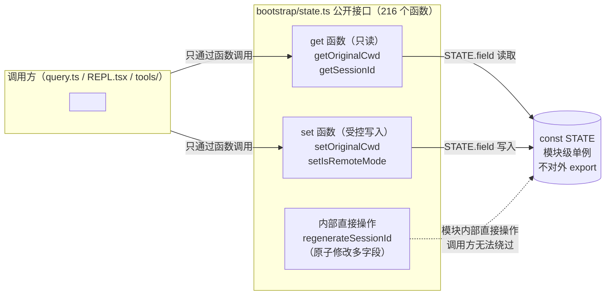
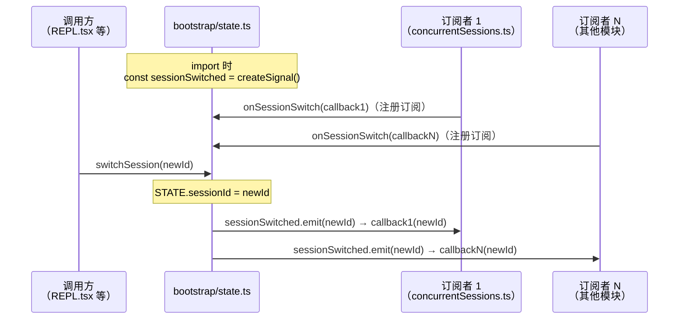

# 第 2 章：Bootstrap 与全局状态——50+ 函数背后的单例设计

> "只有真正需要时才注入依赖，不需要时就别装成需要。"
> （原文："Only inject what you actually need; don't pretend to need what you don't."）

一个 Agent CLI 在整个运行期间只有一个进程、一个会话、一套全局状态。当所有人都在谈论依赖注入（Dependency Injection, DI）的好处时，Claude Code 选择了一条更朴素的路：**模块级单例（Module Singleton）**。`src/bootstrap/state.ts` 用 1,762 行、216 个导出函数实现了一个零框架依赖的全局状态管理方案，没有注入容器，没有 Provider，没有 Context——只有一个名为 `STATE` 的模块级常量和配套的 get/set 函数对。

同一个模式在代码库中出现了不止一次：`createSignal()` 用 43 行代码把原本散落在 15+ 处的监听器样板代码收归一处，同样是"不用框架、只用约定"的思路。

读完本章，我们将理解这一选择背后的工程逻辑——单进程约束下，轻量全局状态比 DI 更实用——并能判断自己的 Agent 项目何时该复用这个模式、何时该换用依赖注入。

---

## 问题：Agent CLI 的状态管理为什么特殊？

构建 Agent 系统时，全局状态是绕不开的话题：当前会话 ID、主模型选择、工作目录、API 费用计数、权限模式……这些值需要在工具执行、Hook 回调、REPL 渲染、日志记录等十几个不相关的模块中被读写。

传统的解法是依赖注入：把状态容器传给每个模块的构造函数，让依赖关系在代码里显式体现。这在服务端框架（Spring、NestJS）里很常见，也是"测试友好"设计的标准做法。

**但 CLI 环境有一个根本约束：单进程、单会话。**

依赖注入的核心价值之一是**多实例隔离**——同一个请求中可以有多个相互独立的上下文。对于服务端来说，每个 HTTP 请求需要自己的数据库连接、自己的用户上下文。但 Claude Code 的一次运行只有一个会话、一个用户、一套状态。DI 框架的多实例能力在这里完全用不上——却要付出接口膨胀的代价：每个函数签名都要多一个 `state: AppState` 参数，或者每个类都要在构造函数里接收注入。

`src/bootstrap/state.ts` 用一个不同的答案回答了这个问题。

---

## 源码实例 1：STATE 对象与 get/set 函数对

### 状态类型：50+ 字段的单一对象

`src/bootstrap/state.ts:45` 定义了 `State` 类型：

```typescript
// src/bootstrap/state.ts:45-96（节选）
type State = {
  originalCwd: string
  // 稳定的项目根目录——在启动时设置一次（包括 --worktree flag），
  // 不会被会话中途的 EnterWorktreeTool 更新。
  // 用于项目身份标识（历史、skills、会话），而非文件操作。
  projectRoot: string
  totalCostUSD: number
  totalAPIDuration: number
  //...
  mainLoopModelOverride: ModelSetting | undefined
  initialMainLoopModel: ModelSetting
  isInteractive: boolean
  //...
  sessionId: SessionId
  //...
}
```

**源码参考**：`src/bootstrap/state.ts:45`

50+ 个字段被集中在同一个 `State` 对象里，而不是拆分到多个独立的 Store。为什么？注释里有线索：`projectRoot` 的注释说"用于项目身份标识，而非文件操作"——字段之间有语义关联，分散存储会让读写逻辑散落各处，反而更难维护。当所有字段都在同一个 `STATE` 对象里，一次快照就能得到进程的完整状态。

### STATE 常量：单例的实例化

```typescript
// src/bootstrap/state.ts:429
const STATE: State = getInitialState()
```

**源码参考**：`src/bootstrap/state.ts:429`

这一行是整个状态管理方案的核心：`STATE` 是模块级常量，在第一次 `import` 时初始化，整个进程生命周期内只有这一个实例。注意它是 `const` 而非 `let`——对象本身不会被替换，只有对象的属性会被修改。这是 JavaScript 模块系统天然提供的"单例保证"：同一个模块在同一个进程里只被求值一次。

### get/set 函数对：显式访问接口

216 个导出函数中，大多数以 get/set 配对形式存在：

```typescript
// src/bootstrap/state.ts:500-515
export function getOriginalCwd(): string {
  return STATE.originalCwd
}

export function getProjectRoot(): string {
  return STATE.projectRoot
}

// src/bootstrap/state.ts:515
export function setOriginalCwd(cwd: string): void {
  STATE.originalCwd = cwd
}
```

**源码参考**：`src/bootstrap/state.ts:500`、`src/bootstrap/state.ts:515`

这种设计不是多此一举。直接 `export { STATE }` 让任何调用方都能随意修改任意字段；get/set 函数对做到了两件事：**一是控制访问粒度**（只读字段只有 get，没有 set），**二是未来可以在 set 函数里加钩子**（触发监听器、记录日志、做验证），而不需要修改所有调用方。

**图 2-1：STATE 对象的 get/set 访问模式**



*图注：所有调用方通过函数接口操作 STATE，而非直接访问对象。get/set 配对提供访问控制，隐藏 STATE 的直接引用。`setIsRemoteMode`（`src/bootstrap/state.ts:1635`）是只写函数——（推断）这个字段的读取由内部逻辑处理，不对外暴露 getter。*

### STATE 的直接变异：必要的特例

并非所有状态访问都严格走 get/set 接口。`regenerateSessionId` 展示了一个内部直接操作 `STATE` 的案例：

```typescript
// src/bootstrap/state.ts:435-450
export function regenerateSessionId(
  options: { setCurrentAsParent?: boolean } = {},
): SessionId {
  if (options.setCurrentAsParent) {
    STATE.parentSessionId = STATE.sessionId
  }
  // 清除旧会话的 plan-slug 缓存，防止 Map 因 /resume 操作无限增长
  STATE.planSlugCache.delete(STATE.sessionId)
  // ...
  STATE.sessionId = randomBytes(16).toString('hex') as SessionId
  return STATE.sessionId
}
```

**源码参考**：`src/bootstrap/state.ts:435`

这个函数同时修改了 `parentSessionId`、`planSlugCache` 和 `sessionId` 三个字段——如果用独立的 set 函数，三次调用之间可能出现中间状态。内部直接操作 `STATE` 保证了这三次修改的原子性（在单线程 JavaScript 中，同步操作天然是原子的）。**这是单例模式在可见范围受控时的合理特例**：模块内部函数可以直接操作 `STATE`，对外仍然暴露受控接口。

---

## 源码实例 2：createSignal——状态变化通知的轻量原语

如果说 `STATE + get/set` 解决了"如何读写状态"，那么 `createSignal` 解决的是"状态变化时如何通知其他模块"。

`src/utils/signal.ts` 只有 43 行，但它的注释说明了存在的理由：

```typescript
// src/utils/signal.ts:1-16
/**
 * Tiny listener-set primitive for pure event signals (no stored state).
 *
 * Collapses the ~8-line `const listeners = new Set(); function subscribe(){…};
 * function notify(){for(const l of listeners) l()}` boilerplate that was
 * duplicated ~15× across the codebase into a one-liner.
 *
 * Distinct from a store (AppState, createStore) — there is no snapshot, no
 * getState. Use this when subscribers only need to know "something happened",
 * optionally with event args, not "what is the current value".
 */
```

**源码参考**：`src/utils/signal.ts:1`

注释里有一个关键数字：**~15 处重复**。在引入 `createSignal` 之前，"创建一个事件监听器集合"的 8 行样板代码在代码库里出现了 15 次以上。`createSignal` 的价值不是功能创新——Observable、EventEmitter 早就存在——而是把这个重复消除掉。

### switchSession 中的 Signal 使用

```typescript
// src/bootstrap/state.ts:468-489
export function switchSession(
  sessionId: SessionId,
  projectDir: string | null = null,
): void {
  STATE.planSlugCache.delete(STATE.sessionId)
  STATE.sessionId = sessionId
  STATE.sessionProjectDir = projectDir
  sessionSwitched.emit(sessionId)   // ← 发出信号，通知所有订阅者
}

const sessionSwitched = createSignal<[id: SessionId]>()

/**
 * Register a callback that fires when switchSession changes the active
 * sessionId. bootstrap can't import listeners directly (DAG leaf), so
 * callers register themselves.
 */
export const onSessionSwitch = sessionSwitched.subscribe   // ← 对外暴露订阅接口
```

**源码参考**：`src/bootstrap/state.ts:468`、`src/bootstrap/state.ts:481`、`src/bootstrap/state.ts:489`

注释里有一个关键词：**"DAG leaf"**（有向无环图叶节点）。`bootstrap/state.ts` 在模块依赖图中处于叶节点位置——它不能 import 任何业务模块（否则会形成循环依赖）。因此，它选择**反向注册**：`onSessionSwitch` 向外暴露订阅接口，让需要感知会话切换的模块自行注册，而不是由 state.ts 主动调用它们。

这是依赖倒置原则（Dependency Inversion Principle, DIP）在单例模式中的实际应用：高层模块（业务逻辑）依赖低层模块（state.ts）的抽象接口（`onSessionSwitch`），而非低层模块调用高层模块。

**图 2-2：createSignal 的订阅-发布模式**



*图注：state.ts 不知道谁是订阅者——它只发出信号。订阅者主动注册自己，这保证了 state.ts 作为 DAG 叶节点不引入任何业务模块的反向依赖。*

---

## 模式剖析：轻量全局状态的五个要素

两个源码实例揭示了同一个模式的不同侧面。"**轻量全局状态（Lightweight Global State）**"模式由五个要素构成：

**① 单一状态对象**：所有全局状态集中在一个类型定义（`State`）里，方便快照和序列化。

**② 模块级初始化**：用 `const STATE = getInitialState()` 在模块求值时初始化，JavaScript 模块系统保证单例。无需 IoC 容器、无需 `getInstance()` 方法。

**③ 受控访问接口**：不 export `STATE` 本身，只 export 受控的 get/set 函数对，保留未来加钩子的能力。

**④ 内部直接操作**：模块内部函数可以直接操作 `STATE` 以保证原子性（如 `regenerateSessionId`），这是受控特例，不是设计缺陷。

**⑤ 信号解耦通知**：状态变化通知通过 `createSignal` + 反向订阅实现，让 state.ts 保持 DAG 叶节点身份，不引入业务模块依赖。

---

## 适用范围

| 场景 | 适用 | 原因 | 替代方案 |
|------|------|------|---------|
| 单进程 CLI，只有一个会话 | ✓ | 无多实例隔离需求，DI 价值为零 | — |
| 需要跨不相关模块共享的配置/会话状态 | ✓ | 模块级单例比逐层传参简洁 | 依赖注入 |
| 状态字段数量 > 20，需要语义分组 | ✓ | 单一 State 对象便于整体快照 | 多个独立 Store |
| 服务端应用，需要请求隔离 | ✗ | 单例在并发请求间共享状态会出问题 | 依赖注入 + 请求 Context |
| 需要做单元测试且状态复杂 | △ | 可以，但需要额外提供 `resetState()` 函数 | 依赖注入（测试更简单） |
| 状态字段 < 5 个 | △ | 可以，但直接传参也够用 | 函数参数传递 |

---

## 权衡与局限

**模块级单例的测试挑战**：单元测试时，如果两个测试用例共享同一个模块实例，状态会相互污染。Claude Code 没有测试套件（这是重建版本的局限），但如果有，需要在每个测试前调用类似 `resetToInitialState()` 的函数。依赖注入在这里更友好——每个测试用例可以注入独立的状态实例。

**216 个导出函数的维护成本**：每增加一个状态字段，通常需要同时写 get 和 set——这是"显式比隐式好"的代价。当字段数量增长到 50+ 时，这个文件本身就成了一个需要理解的系统。

**模块求值顺序依赖**：`STATE` 在模块被第一次 import 时初始化。如果有模块在 `STATE` 初始化之前就读取了某个字段，会得到 `getInitialState()` 的默认值而非最终值。`src/main.tsx` 的注释（`src/main.tsx:1`）提示了这一点：MDM 和 Keychain 预读取在 import 求值期间就开始，需要精心管理初始化顺序（详见第 4 章）。

---

## 与已知模式的对话

**GoF 单例模式（Singleton Pattern）**：经典 GoF 单例用 `getInstance()` 方法保证只有一个实例，通常用 `private` 构造函数防止外部直接构造。Claude Code 的做法更简单——JavaScript 的 ES module 系统本身就保证每个模块只被求值一次，不需要显式的 `getInstance()`。这是利用了语言/运行时特性而非设计模式来实现单例，更轻量，代价是与模块系统深度耦合。

**服务定位器模式（Service Locator Pattern）**：与 DI 容器相比，`bootstrap/state.ts` 更像一个服务定位器——调用方主动拉取（`getOriginalCwd()`），而非由外部推送（构造函数注入）。GoF 认为服务定位器是"反模式"，因为它隐藏了依赖关系。但在 Claude Code 的 CLI 场景里，这些全局依赖关系是显而易见的——所有模块都知道需要"当前会话状态"，把它显式注入反而增加了噪音。

**响应式 Store（MobX/Zustand）**：`createSignal` 与响应式 Store 的区别在于：Signal 是无状态的"只通知"，Store 是有状态的"持有 + 通知"。`signal.ts:1` 的注释明确说明了这一设计意图：当订阅者只需要知道"发生了什么"而不需要知道"当前值是什么"时，用 Signal。这避免了 MobX 式的细粒度追踪所带来的运行时开销。

---

## 模式提炼

### 模块级单例（Module Singleton）

**解决的问题**：CLI工具需跨模块共享状态，但DI的多实例能力在单进程场景下毫无用武之地。

**核心做法**：利用ES module每个模块只求值一次的特性，用const STATE = getInitialState()在模块顶层初始化全局对象，运行时天然保证单例。

**前置条件**：单进程环境，运行期间不需要多实例隔离，状态在进程生命周期内保持稳定。

**源码证据**：src/bootstrap/state.ts:429

---

### 显式访问接口（Explicit Access Interface）

**解决的问题**：直接export单例对象让任意调用方修改任意字段，失去封装控制且无法加钩子。

**核心做法**：只export get/set函数对，不export STATE本身。get控制可读字段，set预留扩展点。


**前置条件**：单例字段数量超过 10，或存在只读字段，或预期需要在读写时注入副作用。

**源码证据**：src/bootstrap/state.ts:500，src/bootstrap/state.ts:515

---

 ### DAG 叶节点信号（DAG Leaf Signal）
 
**解决的问题**：状态模块作为DAG叶节点不能import业务模块（避免循环依赖），却需要通知业务模块状态变化。

**核心做法**：用createSignal暴露订阅接口（onSessionSwitch），让业务模块主动注册回调，反转通知方向保持叶节点身份。

**前置条件**：模块位于 DAG 叶节点，不能引入上游依赖，但需要向上游广播状态变化事件。

**源码证据**：src/bootstrap/state.ts:481，src/bootstrap/state.ts:489

---

## 你能做什么

1. **用 ES module 特性替代 IoC 容器**：在单进程 CLI 项目里，`const STATE = getInitialState()` 加上 get/set 函数对就是完整的状态管理——不需要引入 DI 框架
2. **把全局状态字段集中在单一 `State` 类型里**：50+ 字段放在一起时，语义关联清晰，整体快照方便调试
3. **对外只 export get/set，不 export STATE 本身**：保留未来在 set 函数里加验证、触发事件的能力，而不需要修改所有调用方
4. **识别 DAG 叶节点场景**：当一个模块被所有人依赖但自己不能依赖任何人时，用信号（Signal）暴露订阅接口，让调用方反向注册
5. **用 `createSignal` 消灭重复监听器样板**：`signal.ts` 的 43 行消除了 15+ 处重复——在自己的项目里找到类似的重复，用同样的方法收归
6. **区分 Signal 和 Store 的使用场景**：订阅者只需要"发生了什么"就用 Signal，需要"当前值是什么"就用 Store（如 `src/state/AppStateStore.ts`，详见第 10 章）
7. **为单例状态提供 `resetToInitialState()` 函数**：如果项目有测试需求，预留一个重置函数，让每个测试用例都能从干净状态开始

---

*下一章继续探索 Harness 的基础设施层：`bun:bundle feature()` 如何在构建时消除死代码，实现零运行时成本的特性开关——这是 Claude Code 同时维护 Ant 内部版本和 External 公开版本的工程秘密（详见第 3 章）。*
