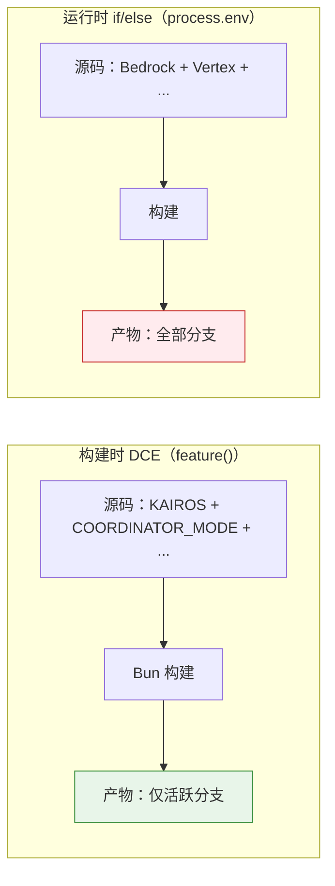
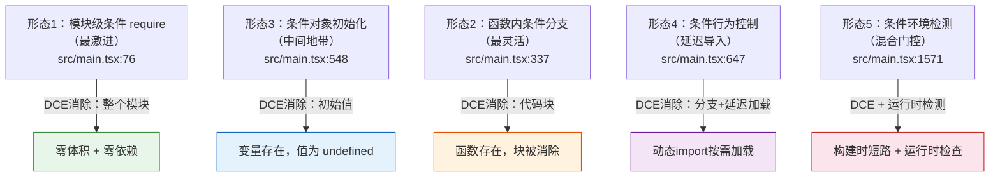
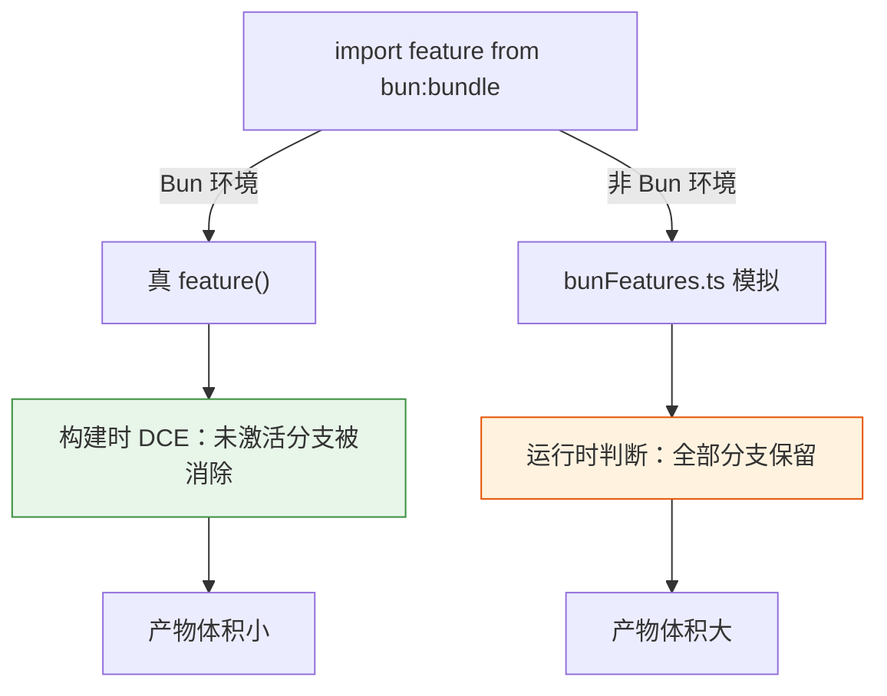

# 第 3 章：构建时特性开关——bun:bundle feature() 的死代码消除

> "18 个特性开关，18 道门。门关上的时候，门背后的房间根本不存在。"

一个 CLI 工具有 18 个特性开关——如果全部用运行时 if/else，每个分支的代码、依赖和潜在安全风险都会进入最终二进制。**构建时门控（Build-time Gate）**——Claude Code 在编译阶段就把不需要的分支从产物中抹去。不是运行时跳过，而是字节码层面消除。读完本章，我们将掌握一种零运行时成本的特性隔离技术，并理解它与传统 Feature Flag 的本质区别。

## 问题：18 个特性开关的运行时成本

第 1 章提到了 `import { feature } from 'bun:bundle'`（详见第 1 章），但没有展开它的工作机制。本章的任务就是展开。

`src/main.tsx` 中有 **18 个不同的 feature flag**，通过 `feature()` 函数判断：

```typescript
// 死代码消除：COORDINATOR_MODE 的条件导入
const coordinatorModeModule = feature('COORDINATOR_MODE')
  ? require('./coordinator/coordinatorMode.ts') as typeof import('./coordinator/coordinatorMode.js')
  : null;

// 死代码消除：KAIROS（助手模式）的条件导入
const assistantModule = feature('KAIROS')
  ? require('./assistant/index.js') as typeof import('./assistant/index.js')
  : null;
const kairosGate = feature('KAIROS')
  ? require('./assistant/gate.js') as typeof import('./assistant/gate.js')
  : null;
```

**源码参考：** `src/main.tsx:74-81`

注释"死代码消除"（原文："Dead code elimination"）直接告诉读者这段代码的工程意图：当 `feature('KAIROS')` 在构建时求值为 `false` 时，三元运算符的 `require('./assistant/index.js')` 分支**从最终产物中消失**——不是运行时跳过，而是字节码级别不存在。

**这与运行时 if/else 有什么本质区别？** 看一下同一个文件中的运行时条件：

```typescript
if (isEnvTruthy(process.env.CLAUDE_CODE_USE_BEDROCK) && !isEnvTruthy(process.env.CLAUDE_CODE_SKIP_BEDROCK_AUTH)) {
  // Bedrock 认证逻辑——这段代码永远存在于产物中
}
```

**源码参考：** `src/main.tsx:408-411`

运行时 `if/else` 保留了全部分支——即使 `CLAUDE_CODE_USE_BEDROCK` 永远为 false，Bedrock 认证的代码、它的依赖、它的安全风险，全部打包进最终二进制。`feature()` 的 DCE 效果则不同：**不需要的分支根本不存在**。这意味着 Assistant 模块的代码和依赖在非 KAIROS 构建中完全不进入最终产物——零体积、零加载时间、零攻击面。

**图 3-1：构建时 DCE vs 运行时 if/else**



DCE 的产物只包含活跃分支（绿色），运行时 if/else 的产物包含全部分支（红色）。产物体积的差异在大型 CLI 中非常显著——Assistant 模块有独立的依赖树，完整引入可能增加数兆字节。

## 源码实例 1：feature() 的 5 种门控形态

18 个 feature flag 在 `src/main.tsx` 中的使用方式并非千篇一律——它们可以分为 **5 种门控形态**：

**形态 1：模块级条件 require（最激进）**

```typescript
const autoModeStateModule = feature('TRANSCRIPT_CLASSIFIER')
  ? require('./utils/permissions/autoModeState.ts')
      as typeof import('./utils/permissions/autoModeState.js')
  : null;
```

**源码参考：** `src/main.tsx:171`

这是最激进的隔离：整个模块在构建时决定是否引入。当 flag 关闭时，`autoModeState.ts` 的代码、它的 import 链、它的依赖——全部从产物中消除。**代价**：后续代码需要通过 `autoModeStateModule?.xxx` 可选链调用，增加了运行时空检查。

**形态 2：函数内条件分支（最灵活）**

```typescript
if (feature('TRANSCRIPT_CLASSIFIER')) {
  resetAutoModeOptInForDefaultOffer();
}
```

**源码参考：** `src/main.tsx:337`

函数级别的条件分支——整个函数仍然存在于产物中，只是 flag 控制的代码块被消除。**比形态 1 灵活**：不需要可选链，但隔离粒度更粗。

**形态 3：条件对象初始化（中间地带）**

```typescript
const _pendingConnect: PendingConnect | undefined = feature('DIRECT_CONNECT') ? {
  url: undefined,
  authToken: undefined,
  dangerouslySkipPermissions: false
} : undefined;

const _pendingAssistantChat: PendingAssistantChat | undefined =
  feature('KAIROS') ? {
    sessionId: undefined,
    discover: false
  } : undefined;

const _pendingSSH: PendingSSH | undefined = feature('SSH_REMOTE') ? {
  host: undefined,
  cwd: undefined,
  permissionMode: undefined,
  dangerouslySkipPermissions: false,
  local: false,
  extraCliArgs: []
} : undefined;
```

**源码参考：** `src/main.tsx:548-584`

条件对象初始化是模块级 require 和函数内分支的中间地带：对象的类型声明和变量名始终存在，但初始值在构建时决定——要么是预设的默认对象，要么是 `undefined`。**关键区别**：变量本身不会被消除（类型 `PendingSSH | undefined` 始终存在），只有初始值被消除。这意味着后续代码可以用 `_pendingSSH` 做类型收窄，而不需要可选链。

**形态 4：条件行为控制（延迟导入）**

```typescript
if (feature('LODESTONE')) {
  const handleUriIdx = process.argv.indexOf('--handle-uri');
  if (handleUriIdx !== -1 && process.argv[handleUriIdx + 1]) {
    const { enableConfigs } = await import('./utils/config.js');
    enableConfigs();
    // ...处理 URI 逻辑
  }
}
```

**源码参考：** `src/main.tsx:647-654`

LODESTONE 的门控不使用 require 而是用动态 `import()`——这是一种延迟加载策略：模块只在真正需要时才加载。**关键区别**：当 flag 关闭时，不仅条件分支被消除，连 `process.argv.indexOf('--handle-uri')` 的检查都不会执行。

**形态 5：条件环境检测（混合门控）**

```typescript
const hint = feature('WEB_BROWSER_TOOL')
  && typeof Bun !== 'undefined'
  && 'WebView' in Bun
  ? CLAUDE_IN_CHROME_SKILL_HINT_WITH_WEBBROWSER
  : CLAUDE_IN_CHROME_SKILL_HINT;
```

**源码参考：** `src/main.tsx:1571`

这是最复杂的形态：`feature()` 与运行时环境检测（`typeof Bun`、`'WebView' in Bun`）组合使用。**构建时只消除 feature 部分**——当 `WEB_BROWSER_TOOL` 关闭时，整个表达式短路为 `CLAUDE_IN_CHROME_SKILL_HINT`；当开启时，还需要运行时检查 Bun 是否支持 WebView。这种混合模式在同一个表达式中结合了构建时确定性和运行时灵活性。

**图 3-2：5 种门控形态的隔离强度对比**



图中五条路径的颜色反映隔离强度从高到低：形态1（绿）彻底消除模块和依赖，形态3（蓝）保留变量但消除初始值，形态2（橙）保留函数但消除分支逻辑，形态4/5为特殊场景设计。

**18 个 feature flag 完整清单**：

| Flag | 行号 | 门控形态 | 门控模块/行为 |
|------|------|---------|-------------|
| COORDINATOR_MODE | 76 | 形态 1（条件 require） | 协调器模式模块 |
| KAIROS | 80-81, 559, 685, 1050, 1058 | 形态 1 + 3 + 2 | 助手模式模块 + 对象 + 行为 |
| TRANSCRIPT_CLASSIFIER | 171, 337, 1399 | 形态 1 + 2 + 2 | 自动权限状态 + 迁移逻辑 |
| DIRECT_CONNECT | 548, 612 | 形态 3 + 2 | 直连会话对象 + 行为 |
| SSH_REMOTE | 577, 706 | 形态 3 + 2 | SSH 会话对象 + 行为 |
| LODESTONE | 647 | 形态 4（延迟导入） | URI 处理 |
| WEB_BROWSER_TOOL | 1571 | 形态 5（混合门控） | Chrome WebView 提示 |
| BG_SESSIONS | 1116 | 形态 2 | 后台会话环境变量 |
| CHICAGO_MCP | 1477, 1608 | 形态 2 | MCP 协议行为 |
| BRIDGE_MODE | — | 形态 2 | 桥接模式 |
| PROACTIVE | — | 形态 2 | 主动建议 |
| HARD_FAIL | — | 形态 2 | 硬失败模式 |
| AGENT_MEMORY_SNAPSHOT | — | 形态 2 | Agent 内存快照 |
| KAIROS_BRIEF | — | 形态 2 | KAIROS 简报 |
| KAIROS_CHANNELS | — | 形态 2 | KAIROS 频道 |
| UDS_INBOX | — | 形态 2 | UDS 收件箱 |
| UPLOAD_USER_SETTINGS | 963 | 形态 2 | 用户设置上传 |
| CCR_MIRROR | — | 形态 2 | CCR 镜像 |

**形态 1 和 3 是最激进的隔离**——它们不仅消除行为，还消除依赖。形态 2 最常见但隔离最弱——只是跳过代码块，函数和模块本身仍在产物中。形态 4 和 5 是特殊场景的优化。

## 源码实例 2（变体）：bunFeatures.ts 的运行时回退

`feature()` 是 Bun 运行时的构建时 API——那在非 Bun 环境（如测试、开发）中如何运行？`src/utils/bunFeatures.ts` 提供了答案：

```typescript
/**
 * Bun Feature Flags 模拟层（原文：Bun Feature Flags Shim）
 * 提供类似 Bun 的 bun:bundle 的 feature() 函数
 */

export interface FeatureConfig {
  KAIROS?: boolean;
  COORDINATOR_MODE?: boolean;
  CLAUDE_CODE_SIMPLE?: boolean;
  [key: string]: boolean | undefined;
}

const DEFAULT_FEATURES: FeatureConfig = {
  KAIROS: false,
  COORDINATOR_MODE: false,
  CLAUDE_CODE_SIMPLE: false
};

let currentFeatures: FeatureConfig = { ...DEFAULT_FEATURES };

export function feature(featureName: string): boolean {
  return currentFeatures[featureName] ?? false;
}

export function setFeatures(features: Partial<FeatureConfig>): void {
  currentFeatures = { ...currentFeatures, ...features };
}
```

**源码参考：** `src/utils/bunFeatures.ts:1-40`

这是一个 **50 行的运行时模拟**——当代码在 Node.js 环境中运行时（如测试），`import { feature } from 'bun:bundle'` 会失败，但 `import { feature } from './utils/bunFeatures.ts'` 可以正常工作。

**关键设计约束**：`DEFAULT_FEATURES` 中所有 flag 默认为 `false`。这确保了非 Bun 环境不会意外启用门控功能——**安全优先于功能**。`setFeatures` 和 `enableFeature`/`disableFeature` 函数只在测试中使用，允许测试用例按需开启特定 flag。

**与实例 1 的关键区别**：实例 1（main.tsx 的 feature 调用）是"构建时 DCE 的使用者"——它依赖 Bun 构建器在编译时消除分支。实例 2（bunFeatures.ts）是"DCE 不可用时的替代实现"——它用 JavaScript 对象模拟 DCE 的接口，但**无法提供真 DCE 效果**。当使用 bunFeatures.ts 时，所有分支都保留在产物中，feature() 只是返回 true/false 控制运行时走向。

**图 3-3：构建时门控的两个执行路径**



同一个 `feature()` 接口背后，隐藏着两条完全不同的执行路径：Bun 环境走构建时消除（绿色），非 Bun 环境走运行时回退（橙色）。调用方不需要关心背后是哪条路径——这种接口统一性是"构建时门控"模式的优雅之处。

## 模式剖析：构建时门控的两个变体

| 变体 | 执行时机 | 代码消除 | 依赖引入 | 适用环境 |
|------|---------|---------|---------|---------|
| **构建时消除** | 编译阶段 | 未激活分支从产物中移除 | 未激活分支的依赖不进入产物 | Bun 生产构建 |
| **运行时回退** | 运行时 | 无消除（全部分支保留） | 所有分支的依赖都进入产物 | Node.js 测试 / 开发 |

两个变体共享同一个接口：`feature('FLAG_NAME')` 返回 boolean。调用方不需要知道背后是 DCE 还是运行时查找。差异在于**"决定在什么时候做"**——构建时消除在生产环境获得零成本隔离，运行时回退在开发环境获得灵活性（通过 `setFeatures` 动态切换 flag）。


## 适用范围

| 场景 | 适用 | 理由 | 替代方案 |
|------|------|------|---------|
| 功能模块独立、互不依赖 | ✓ | 门控的模块可以安全地从产物中移除，不影响其他功能 | 运行时 if/else（保留全部分支） |
| 需要零运行时开销 | ✓ | DCE 后不需要的代码根本不存在，无判断开销 | 环境变量判断（每次调用都要求值） |
| 安全隔离需求 | ✓ | 门控的代码和依赖不进入最终二进制，消除攻击面 | 运行时开关（代码仍在产物中，可被逆向） |
| 需要运行时动态切换 | ✗ | flag 值在构建时确定，无法运行时改变 | Feature Flag 服务（LaunchDarkly 等） |
| flag 依赖运行时输入 | ✗ | `feature()` 不能读取配置文件或用户输入 | 环境变量 + 运行时 if/else |
| 模块间强耦合 | ✗ | 门控模块的移除可能导致依赖它的代码编译失败 | 条件导入 + 空对象模式 |

## 权衡与局限

构建时门控的代价集中在三个方面。

**第一，平台锁定。** `bun:bundle` 的 `feature()` 是 Bun 运行时特有的 API。其他 JavaScript 运行时（Node.js、Deno）没有等价物——Webpack 的 `DefinePlugin` 和 Vite 的 `define` 可以实现类似效果，但需要额外配置。Claude Code 用 `bunFeatures.ts`（`src/utils/bunFeatures.ts`）作为补偿，但运行时回退无法提供真 DCE 效果——它只是把构建时确定性变成了运行时不确定性。

**第二，flag 变更需要重新构建。** 运行时 if/else 的优势是"改配置无需重编译"——修改环境变量即可切换行为。构建时门控则不同：flag 值在构建时烧录，改变 flag 需要重新构建整个产物。在 Claude Code 的场景中，这不是问题（flag 代表的是产品级别的功能模块，不是用户级别的配置项），但在需要频繁切换 flag 的开发调试场景中，这会降低效率。

**第三，调试信息丢失。** DCE 后，被消除的分支在运行时完全不存在——如果 bug 恰好与被消除的代码有关，开发者无法通过断点或日志追踪到它。唯一的调试方式是用运行时回退（bunFeatures.ts）重新构建，但此时行为已经与生产构建不同。

## 与已知模式的对话

| 维度 | 构建时门控 | Feature Flag（运行时） | Strategy Pattern (GoF) |
|------|----------|---------------------|---------------------|
| 决定时机 | 构建时 | 运行时 | 编码时（接口选择） |
| 代码消除 | 是（DCE） | 否（全部分支保留） | 否（所有策略类都在产物中） |
| 运行时开销 | 零（不存在的代码不执行） | 有（每次判断 + 远程调用） | 有（策略查找和分发） |
| 切换方式 | 重新构建 | 改配置 / 远程控制 | 修改调用代码 |
| 典型工具 | Bun feature() / Webpack DefinePlugin | LaunchDarkly / Unleash | TypeScript interface |

**共同点**：三种模式都在解决"如何在不修改主逻辑的前提下切换行为"。**核心区别**在于"决定在什么时候做"——构建时门控在编译阶段做决定（确定性最强），Feature Flag 在运行时做决定（灵活性最高），Strategy Pattern 在编码时做决定（架构层面）。

构建时门控可以看作是 Feature Flag 的一个极端特例：**flag 值提前到构建时就确定了**。这种"提前决定"的代价是丧失了运行时灵活性，但换来的是零开销和安全隔离——在 CLI 工具这种"功能模块在构建时就确定"的场景下，这个交换是合理的。

更有趣的历史对照是 C 语言的预处理器指令 `#ifdef`/`#endif`——两者在本质上做同一件事：**在编译时根据条件消除代码**。`feature('KAIROS') ? require(...) : null` 就是 JavaScript 世界中的 `#ifdef KAIROS ... #endif`。

## 模式提炼

### 构建时门控（Build-time Gate）

**解决的问题**：如何让不需要的特性在编译后完全不存在？

**核心做法**：用 feature('FLAG') 三元运算符包裹条件分支，构建器在编译时求值并移除 false 分支。

**前置条件**：构建工具支持 DCE、flag 值在构建时确定、非 Bun 环境有运行时回退。

**源码证据**：src/main.tsx:80（KAIROS 门控）、src/utils/bunFeatures.ts:25（运行时回退）

## 你能做什么

- **用 `grep -o "feature('[A-Z_]*')" src/main.tsx | sort -u` 列出所有 feature flag**，验证本章提到的 18 个。注意有些 flag（如 BG_SESSIONS、CHICAGO_MCP）只出现在函数内部，需要全文件搜索才能发现。
- **对比 `src/main.tsx:80` 的 KAIROS 门控和 `src/main.tsx:408` 的 Bedrock 环境变量检查**。前者是构建时确定性（flag 关闭 → 代码不存在），后者是运行时不确定性（环境变量可能随时改变）。在你的项目中，哪些条件分支在构建时就能确定？
- **在自己的项目中，尝试用 Webpack 的 `DefinePlugin` 或 Vite 的 `define` 实现类似的构建时门控**。关键配置：`define: { __FEATURE_KAIROS__: JSON.stringify(false) }`，然后代码中用 `if (__FEATURE_KAIROS__) { ... }`——构建器会自动消除 false 分支。
- **阅读 `src/utils/bunFeatures.ts` 完整实现**（约 50 行），理解运行时回退的设计约束——为什么所有 flag 默认关闭？为什么 `setFeatures` 用展开运算符而非直接赋值？
- **追踪 `feature('TRANSCRIPT_CLASSIFIER')` 的两个使用位置**（行 171 和 337），理解同一个 flag 在不同门控形态下的 DCE 效果差异——行 171 的条件 require 会消除整个模块，行 337 的函数内分支只消除代码块。
- **对比 Bun 的 `feature()` 与 C 语言的 `#ifdef` 预处理指令**——它们的共同祖先是什么？差异在于 `feature()` 保留了完整的类型信息（`as typeof import(...)`），而 `#ifdef` 是纯文本替换。

---

第 4 章理解查询引擎如何使用全局状态（第 2 章）和特性开关（本章）协同工作——feature flag 控制哪些模块进入运行时，全局状态控制这些模块如何共享数据。
