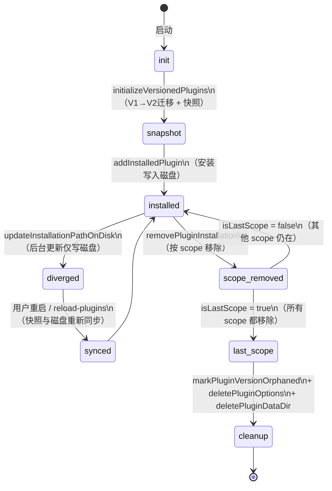
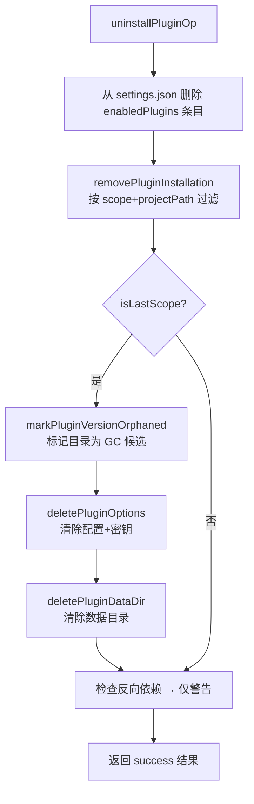

# 第 41 章：Plugin 生命周期——安装、更新、卸载与状态分层

---

运行中的工具升级自己的插件，会遭遇一个经典悖论：后台更新必须修改磁盘状态，而当前会话必须保持稳定。如果安装完成后立即切换到新版本，正在执行的工具调用会指向一个突然消失的目录；如果永远不切换，更新就没有意义。更棘手的是，卸载还需要分辨「这个插件在某个项目里安装了，在另一个项目里也装了」——移除一个项目的安装不该动另一个项目的文件。

Claude Code 用**会话-磁盘双缓冲**（Session-Disk Dual Buffer）模式解决了这个悖论：会话快照在启动时冻结，后台更新只写磁盘，两层状态各司其职，`hasPendingUpdates()` 检测到分叉时通知用户重启。读完本章，你将理解 `installedPluginsManager.ts` 的 1268 行代码如何用两个模块级变量和三种读取路径，实现插件从发现、安装、后台更新到卸载的完整生命周期，并能在自己的可扩展系统中设计类似的双缓冲状态管理器。

---

## 问题：三种读者，一份状态

插件安装系统需要同时服务三种读取场景：

**场景一：当前会话**的工具加载器要找「现在运行的插件在哪个目录」——它需要一个启动时冻结的快照，后台更新不能干扰它。

**场景二：后台自动更新器**要检查磁盘上是否已经写入了新版本——它需要绕过所有缓存直接读磁盘，因为快照正是它要「超过」的那层。

**场景三：UI 和版本检查器**要知道「磁盘和内存是否发生了分叉」——它需要同时读两层，然后对比。

三种读者，三种需求，但底层只有一份 `installed_plugins.json`。

**图 41-1：插件生命周期全景——从初始化到卸载**



生命周期的核心不是「状态机的节点数量」，而是**两层缓冲如何分工**：`inMemoryInstalledPlugins`（会话快照）与 `installedPluginsCacheV2`（读缓存）在不同时刻扮演不同角色——后者随磁盘变化失效，前者只在启动时初始化一次。

---

## 源码实例 1 — 双缓冲初始化：两个变量，三条读路径

`installedPluginsManager.ts` 在模块顶部声明了两个模块级变量，它们是整个双缓冲机制的物质基础：

```typescript
// 读缓存：随磁盘写入失效（clearInstalledPluginsCache 时清空）
let installedPluginsCacheV2: InstalledPluginsFileV2 | null = null

// 会话快照：启动时初始化一次，后台操作不修改它
let inMemoryInstalledPlugins: InstalledPluginsFileV2 | null = null
```

**源码引用：** `src/utils/plugins/installedPluginsManager.ts:66`

两个变量指向相同的数据结构，但生命周期完全不同。它们分别被三个不同的读取函数使用，形成三条读路径：

**路径 A：会话读取**（`getInMemoryInstalledPlugins`）——初始化后冻结

```typescript
export function getInMemoryInstalledPlugins(): InstalledPluginsFileV2 {
  if (inMemoryInstalledPlugins === null) {
    inMemoryInstalledPlugins = loadInstalledPluginsV2() // 第一次调用时从磁盘加载
  }
  return inMemoryInstalledPlugins // 后续返回同一个对象引用
}
```

**源码引用：** `src/utils/plugins/installedPluginsManager.ts:488`

**路径 B：缓存读取**（`loadInstalledPluginsV2`）——读缓存，写入后失效

```typescript
export function loadInstalledPluginsV2(): InstalledPluginsFileV2 {
  if (installedPluginsCacheV2 !== null) {
    return installedPluginsCacheV2 // 命中缓存
  }
  // 从磁盘读取并写入缓存
  const rawData = readInstalledPluginsFileRaw()
  // ... 解析并存入 installedPluginsCacheV2
}
```

**路径 C：磁盘直读**（`loadInstalledPluginsFromDisk`）——完全绕过缓存

```typescript
export function loadInstalledPluginsFromDisk(): InstalledPluginsFileV2 {
  // 不检查任何缓存，直接读文件
  const rawData = readInstalledPluginsFileRaw()
  if (rawData) {
    if (rawData.version === 2) {
      return InstalledPluginsFileSchemaV2().parse(rawData.data)
    }
    const v1Data = InstalledPluginsFileSchemaV1().parse(rawData.data)
    return migrateV1ToV2(v1Data)
  }
  return { version: 2, plugins: {} }
}
```

**源码引用：** `src/utils/plugins/installedPluginsManager.ts:502`

注释明确写道：「Used by background updater to check for changes without affecting the running session's view.」这是三条路径的核心差异——路径 C 专门为后台更新器设计，它的存在就是为了让写入者（更新器）和读取者（会话）操作不同的对象引用。

**图 41-2：三条读取路径与两个缓冲层的关系**

```
                 ┌─────────────────────────────────────────┐
                 │        installed_plugins.json (磁盘)    │
                 └──────────────────┬──────────────────────┘
                                    │
          ┌─────────────────────────┼─────────────────────────┐
          │                         │                         │
   路径C: 直读                  路径B: 缓存读             路径A: 会话读
loadInstalledPluginsFromDisk  loadInstalledPluginsV2   getInMemoryInstalledPlugins
          │                         │                         │
          │                  installedPluginsCacheV2    inMemoryInstalledPlugins
          │                  (写入时 null → 失效)         (启动时初始化，不再更新)
          │                         │                         │
          ▼                         ▼                         ▼
    后台更新器                  UI / 查询                 工具加载器
  (跨越快照写磁盘)              (读最新磁盘状态)            (会话稳定视图)
```

**后台更新**路径是双缓冲设计最精妙的体现。`updateInstallationPathOnDisk` 只修改磁盘和读缓存，刻意不碰会话快照：

```typescript
export function updateInstallationPathOnDisk(
  pluginId: string,
  scope: PersistableScope,
  projectPath: string | undefined,
  newPath: string,
  newVersion: string,
  gitCommitSha?: string,
): void {
  const diskData = loadInstalledPluginsFromDisk() // 路径C：直读磁盘
  // ... 修改 diskData ...
  writeFileSync_DEPRECATED(filePath, jsonStringify(diskData, null, 2), { ... })

  installedPluginsCacheV2 = null // 读缓存失效

  // Note: inMemoryInstalledPlugins is NOT updated  ← 关键注释
}
```

**源码引用：** `src/utils/plugins/installedPluginsManager.ts:537`

那一行注释「is NOT updated」不是遗忘，是设计意图的明确表达。`hasPendingUpdates()` 正是依赖这个分叉来检测是否有待生效的更新：

```typescript
export function hasPendingUpdates(): boolean {
  const memoryState = getInMemoryInstalledPlugins()  // 启动时快照
  const diskState = loadInstalledPluginsFromDisk()    // 当前磁盘

  for (const [pluginId, diskInstallations] of Object.entries(diskState.plugins)) {
    const memoryInstallations = memoryState.plugins[pluginId]
    if (!memoryInstallations) continue
    for (const diskEntry of diskInstallations) {
      const memoryEntry = memoryInstallations.find(
        m => m.scope === diskEntry.scope && m.projectPath === diskEntry.projectPath,
      )
      if (memoryEntry && memoryEntry.installPath !== diskEntry.installPath) {
        return true // 磁盘有不同版本 → 有待生效更新
      }
    }
  }
  return false
}
```

**源码引用：** `src/utils/plugins/installedPluginsManager.ts:595`

**两层状态的分叉** 就是「后台更新已完成，等待重启生效」的信号。这个设计让更新器可以随时把新版本写入磁盘，而不打断当前会话的任何工具调用。

---

## 源码实例 2（变体）— 卸载流：多 Scope 协调与逐层清理

为什么卸载比安装复杂？因为同一个插件可以在多个 scope 下安装：用户全局安装了它（`scope: 'user'`），同时某个项目又安装了它（`scope: 'project'`）。卸载「用户安装」不应该删除文件——文件还被项目安装用着。

`installedPluginsManager.ts` 的 V2 格式用**每插件 scope 数组**解决了这个问题：

```typescript
// V2 格式：每个 pluginId 对应一个安装记录数组（每条记录是一个 scope）
type InstalledPluginsFileV2 = {
  version: 2
  plugins: Record<string, PluginInstallationEntry[]>
}

// 按 scope 移除单条记录（不影响其他 scope）
export function removePluginInstallation(
  pluginId: string,
  scope: PersistableScope,
  projectPath?: string,
): void {
  const data = loadInstalledPluginsFromDisk()
  const installations = data.plugins[pluginId]
  if (!installations) return

  data.plugins[pluginId] = installations.filter(
    entry => !(entry.scope === scope && entry.projectPath === projectPath),
  )

  // 所有 scope 都移除后，整个插件条目删除
  if (data.plugins[pluginId].length === 0) {
    delete data.plugins[pluginId]
  }

  saveInstalledPluginsV2(data)
}
```

**源码引用：** `src/utils/plugins/installedPluginsManager.ts:452`

`removePluginInstallation` 只管注册表，不管文件。真正的资源清理发生在更上层的 `uninstallPluginOp`（`src/services/plugins/pluginOperations.ts:427`），它在调用 `removePluginInstallation` 之后，检查是否这是最后一个 scope：

```typescript
// 来自 pluginOperations.ts:516
removePluginInstallation(pluginId, scope, projectPath)

const updatedData = loadInstalledPluginsV2()
const remainingInstallations = updatedData.plugins[pluginId]
const isLastScope =
  !remainingInstallations || remainingInstallations.length === 0

if (isLastScope && installPath) {
  await markPluginVersionOrphaned(installPath)  // 标记为孤立（GC 候选）
}
if (isLastScope) {
  deletePluginOptions(pluginId)                 // 清除配置项和密钥
  if (deleteDataDir) {
    await deletePluginDataDir(pluginId)         // 清除数据目录
  }
}
```

**源码引用：** `src/services/plugins/pluginOperations.ts:519`

注释解释了为什么 `deletePluginOptions` 和 `deletePluginCache` 有不同的触发条件：「Before this, uninstalling left orphaned entries in settings.pluginConfigs... forever.」选项和密钥是不与文件路径绑定的键值记录，只有在所有 scope 都移除时才能安全删除——否则「此 scope 已卸载但彼 scope 还在用」的情况下就会丢失配置。

卸载时还有一个**反向依赖检查**：

```typescript
// pluginOperations.ts:543
const reverseDependents = findReverseDependents(pluginId, allPlugins)
const depWarn = formatReverseDependentsSuffix(reverseDependents)
```

注释写道：「Blocking creates tombstones — can't tear down a graph with a delisted plugin.」检查发现依赖方时只**警告**，不**阻断**——否则一个已被下架的插件会让依赖它的所有插件永远无法卸载，造成不可解开的依赖死锁。

**图 41-3：卸载流程的 isLastScope 分叉**



与安装时的**双缓冲写路径**不同，卸载直接通过 `loadInstalledPluginsFromDisk` 操作磁盘。原因是卸载是用户主动发起的明确意图，无需「后台悄悄完成、下次重启生效」的缓冲——用户按下卸载，期望的是立即生效。

---

## 模式剖析

会话-磁盘双缓冲模式的四个核心要素：

**第一：两个模块级变量，明确区分职责**

`installedPluginsCacheV2`（读缓存）随每次磁盘写入失效，确保非后台读取者获得最新数据。`inMemoryInstalledPlugins`（会话快照）只在 `initializeVersionedPlugins` 调用时初始化，在整个会话生命周期内保持不变。两者指向同类数据结构，但失效策略完全不同。

**第二：「磁盘直读」路径作为逃逸通道**

`loadInstalledPluginsFromDisk` 不经过任何缓存，专门给需要「超过快照」的操作使用——后台更新器写入新版本后，会调用此路径验证写入结果；`hasPendingUpdates` 调用此路径与快照比对。这个逃逸通道使缓冲架构不会变成「信息孤岛」。

**第三：写入时缓存失效，不更新快照**

`saveInstalledPluginsV2` 在保存后设置 `installedPluginsCacheV2 = data`（写入缓存），但不更新 `inMemoryInstalledPlugins`。`updateInstallationPathOnDisk` 则连 `installedPluginsCacheV2` 也设置为 `null`（失效），但同样不更新快照。这种「写入时差异化失效」策略确保不同读者始终看到它们「该看到的版本」。

**第四：scope 数组而非单条记录**

V2 格式将每个插件的安装记录从单对象升级为数组，每条记录携带 `scope + projectPath`。这让「按 scope 卸载」的 `removePluginInstallation` 可以用一次 `.filter()` 原子地移除单条记录，而不触碰其他 scope 的文件路径——多 scope 协调的复杂性被压缩到一行过滤逻辑里。

---

## 适用范围

| 场景 | 适用性 | 理由 | 替代方案 |
|------|:------:|------|---------|
| 后台更新需要在不打断当前会话的情况下写入新版本 | ✓ | 双缓冲天然隔离两个时间维度 | 锁文件（会阻断读取，用户可感知卡顿）|
| 同一资源可在多个上下文（scope）下安装 | ✓ | 数组记录 + isLastScope 精确控制清理时机 | 单条记录 + 引用计数（并发修改时难以保证原子性）|
| 需要「有多少待生效更新」的可查询视图 | ✓ | `hasPendingUpdates` / `getPendingUpdateCount` 直接对比两层 | 版本号字段（依赖单调递增，不适合路径型版本标识）|
| 工具加载器要求会话期间路径稳定 | ✓ | 快照冻结保证路径不会在会话中途变化 | 每次加载都重读磁盘（路径可能指向已更新目录）|
| 更新期间需要零停机（不重启应用） | ✗（谨慎）| 双缓冲需要重启才能生效，不适合要求热加载的场景 | 动态模块加载（如 Node.js require cache bust）|
| 卸载需要立即生效（不等重启）| ✓ | 卸载直接写磁盘，绕过后台写路径 | 标记删除 + 后台 GC（卸载后工具可能仍可调用）|

---

## 权衡与局限

**权衡 1：快照冻结 vs 热加载**

会话快照的稳定性是有代价的：安装新插件后，当前会话看不到它，必须重启 Claude Code 才能使用。这是设计的有意取舍——稳定性优先于及时性。如果系统改为「安装后立即可用」，需要引入模块热加载机制，复杂度会急剧上升，且可能破坏已加载工具的状态一致性。

**权衡 2：orphanedVersions 的 GC 延迟**

`markPluginVersionOrphaned` 不立即删除文件，而是给目录打一个 `.orphaned_at` 标记，由后续的 GC 任务（`cleanupLegacyCache`）统一清理。这让卸载操作本身足够快，但留下了一个时间窗口：被标记为孤立的目录在 GC 运行之前仍占用磁盘空间。如果用户频繁更新插件，可能积累较多孤立版本目录。

**权衡 3：`isLastScope` 依赖实时磁盘读取**

```typescript
removePluginInstallation(pluginId, scope, projectPath) // 写磁盘
const updatedData = loadInstalledPluginsV2()            // 读缓存（刚失效→从磁盘重读）
const isLastScope = !updatedData.plugins[pluginId]?.length
```

`isLastScope` 是在「移除后立即重读」的结果上计算的。如果并发发生了另一次写入（如两个 `uninstallPluginOp` 同时运行），两者都可能认为自己是 `isLastScope`，导致选项和数据目录被清理两次。当前实现假设 Claude Code 是单进程单用户操作插件，这个假设在绝大多数场景下成立，但在自动化脚本批量操作时可能触发边界情况。

**权衡 4：V1→V2 迁移的一次性设计**

`migrateToSinglePluginFile` 用 `migrationCompleted` 标志保证「每个会话只迁移一次」。迁移失败时也会设置 `migrationCompleted = true`，让会话继续运行，而不是反复重试或崩溃。这是「优雅降级」而非「强保证」的取舍——迁移失败后，系统从空状态重新开始，已安装的插件会在 `migrateFromEnabledPlugins` 中通过 `settings.enabledPlugins` 重新同步。

---

## 与已知模式的对话

**与备忘录模式（Memento Pattern，GoF）**：GoF 的备忘录模式在对象外部保存状态快照，用于撤销操作。`inMemoryInstalledPlugins` 是一个备忘录——启动时保存「安装状态的快照」，整个会话中不被后台操作修改。但它不用于「撤销」，而用于「稳定性保证」：快照不是回退点，是当前会话的唯一真实视图。**区别在于用途**：GoF 备忘录是时间维度的回退工具，此处快照是并发维度的隔离工具。

**与写时复制（Copy-on-Write, COW）**：Linux 内核对 fork 后的内存页、数据库对事务中的数据页都用写时复制——读者看到的是原始页，写入时才复制出新页。`installedPluginsManager.ts` 的双缓冲与 COW 的方向相反：不是「写者在写时复制给自己」，而是「读者（快照）在初始化时复制一份，写者改原本，读者用副本」。**结果相同，方向相反**：两者都实现了读写隔离，但 COW 的复制由写入触发，双缓冲的复制由读取初始化触发。

**与 CQRS（命令查询职责分离）**：CQRS 将写模型（Command）和读模型（Query）完全分离成两个系统。`installedPluginsManager.ts` 是轻量的 CQRS 实践：`loadInstalledPluginsFromDisk`（写路径配套的查询，跟磁盘一致）与 `getInMemoryInstalledPlugins`（会话读模型，跟启动时状态一致）服务两个不同的读取场景。**没有消息总线**，没有事件溯源，只用两个模块级变量实现了读写视图分离的核心效果。

---

## 模式命名框

> **模式名称：会话-磁盘双缓冲（Session-Disk Dual Buffer）**
>
> **问题：** 后台更新需要在不中断当前会话的情况下修改插件的磁盘状态，同时系统需要能够检测「磁盘已更新但会话还未生效」的分叉状态。
>
> **解决方案：** 维护两个独立的模块级状态变量——会话快照（启动时初始化，整个会话内不变）和读缓存（随每次磁盘写入失效，下次读取时从磁盘重建）。后台更新只通过磁盘直读路径操作，刻意不更新快照。`hasPendingUpdates` 通过对比两层状态检测分叉。
>
> **源码锚点：** `src/utils/plugins/installedPluginsManager.ts:66`（两个变量声明）、`:537`（`updateInstallationPathOnDisk` 的 "NOT updated" 注释）、`:595`（`hasPendingUpdates` 的分叉检测）

---

## 你能做什么

- **区分三种读取语义**：会话读（稳定快照）、缓存读（最新已知状态）、磁盘直读（绕过一切缓存）。在设计后台更新时，明确每个读取点属于哪种语义，避免后台写入意外刷新了需要稳定的会话视图。

- **在模块顶部声明两个变量，而非一个**。一个变量既当缓存又当快照，会在「缓存失效」时意外更新快照。用两个变量明确分工，注释说明两者的失效策略差异，是防止后期维护者混淆的最廉价方法。

- **在后台写函数末尾加一行注释**「`inMemoryInstalledPlugins` is NOT updated」。这行注释本身就是一份意图文档，让后来的 reviewer 知道这不是遗漏，而是设计决定。

- **用 scope 数组替代单条记录**管理多上下文资源。当同一个资源（插件、配置、凭据）可以在多个上下文（全局/项目/本地）下分别安装时，用 `entry[]` 存储，用 `isLastScope`（`entries.length === 0`）决定何时触发资源清理，避免「还有其他 scope 在用，却因为移除了一个 scope 而清空了文件」的 bug。

- **把注册表操作与资源清理分层**：`removePluginInstallation` 只管 JSON 注册表，物理文件删除由上层调用者（`uninstallPluginOp`）在确认 `isLastScope` 后决定。每一层只做自己的事，清理时机的判断在调用者处集中，不分散在工具函数里。

- **设计「孤立标记 + 延迟 GC」**而非「立即删除」来处理卸载后的版本目录。标记的成本极低（写一个 `.orphaned_at` 文件），GC 可以在空闲时批量清理，不影响卸载操作本身的响应速度。

- **检测分叉，不要强同步**。后台更新完成后，不要试图在后台重载会话——通知用户「有待生效的更新，重启后生效」比强制刷新更安全。`hasPendingUpdates` + 通知的组合比自动重启的惊喜感要好得多。

---

第 41 章揭示了双缓冲如何让插件系统在「后台悄悄更新」和「当前会话稳定运行」之间取得平衡，而 `isLastScope` 守护着卸载时的资源清理边界。当插件安装到磁盘上之后，它是如何被发现并注册到 Marketplace 的？Marketplace 协议和注册表机制——详见第 42 章。
