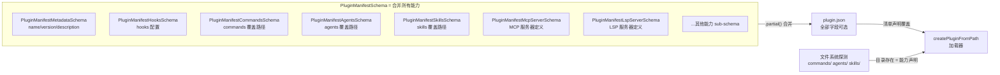
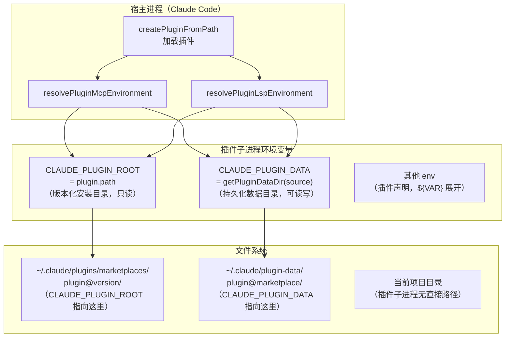
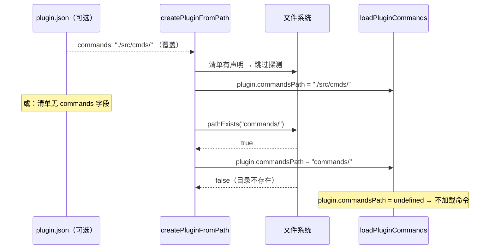

# 第 43 章：Plugin 包结构——目录约定、`package.json` 契约与沙箱边界

> "目录的存在就是声明。"

---

一个 Claude Code 插件想提供自定义命令，只需要在根目录创建 `commands/` 文件夹，放入 Markdown 文件——不需要注册，不需要配置，系统自动发现并加载。想提供 AI Agent？创建 `agents/` 目录。想挂载钩子？创建 `hooks/hooks.json`。**目录的存在就是能力的声明**——Claude Code 用文件系统结构作为插件能力的配置接口，而不是需要维护的注册中心。

这是「目录即能力声明（Directory-as-Capability Declaration）」模式：插件只需遵循约定的目录结构，系统在加载时自动探测并注册对应能力；`plugin.json` 清单可以覆盖默认约定，但对于常规情况不是必须的。本章还揭示了沙箱边界的实现：`CLAUDE_PLUGIN_ROOT` 和 `CLAUDE_PLUGIN_DATA` 两个环境变量如何为子进程插件划定文件系统访问边界。读完这章，你将理解 `pluginLoader.ts` 的目录自动探测机制，以及 MCP/LSP 子进程如何通过注入的环境变量知道自己的「地盘」在哪里。

---

## 节 39.1：问题——目录约定 vs 注册中心

插件系统的设计有两种极端方向：**注册驱动**（插件显式声明自己提供什么能力，注册到中心表）和**约定驱动**（插件按约定目录放置文件，加载器自动探测）。

注册驱动的优点是显式，缺点是繁琐——每次添加新命令需要同时更新注册文件，出现不一致时（命令文件存在但注册表没有）产生运行时错误。约定驱动的优点是声明即文件，缺点是「隐式」——开发者需要记住约定（`commands/` 放命令，`agents/` 放 Agent），系统需要在运行时扫描目录。

Claude Code 选择了约定驱动，但在约定之上提供了 `plugin.json` 清单作为覆盖机制：大多数插件只需要遵守目录约定；需要自定义路径（比如在 monorepo 中把命令放在 `src/claude-commands/` 而不是默认的 `commands/`）的插件，在清单中声明覆盖即可。这是「约定优于配置，配置优先于约定」的经典结构。

**图 43-1：完整插件包目录结构**

```
my-plugin/
├── .claude-plugin/
│   └── plugin.json          ← 可选清单（覆盖默认约定）
│       ├── name: "my-plugin"
│       ├── version: "1.0.0"
│       ├── commands: {...}   ← 可覆盖默认 commands/ 路径
│       ├── agents: [...]     ← 可覆盖默认 agents/ 路径
│       ├── hooks: "..."      ← 可指定额外 hooks 文件
│       ├── mcp: {...}        ← MCP 服务器定义（子进程）
│       └── lsp: {...}        ← LSP 服务器定义（子进程）
│
├── commands/                 ← 自定义斜杠命令（.md 文件）
│   ├── build.md              → /build 命令
│   └── deploy.md             → /deploy 命令
│
├── skills/                   ← 可复用技能（SKILL.md 文件）
│   └── my-skill/
│       └── SKILL.md
│
├── agents/                   ← 自定义 AI Agent（.md 文件）
│   └── reviewer.md           → /reviewer agent
│
├── hooks/                    ← 生命周期钩子
│   └── hooks.json            → PreToolUse/PostToolUse 等事件处理
│
└── output-styles/            ← 自定义输出样式
```

每个顶层目录对应一类能力，缺失的目录意味着插件不提供该类能力——不需要写 `"commands": null` 来声明「我没有命令」，简单地不创建 `commands/` 目录即可。

---

## 节 39.2：源码实例1——createPluginFromPath：并行探测与目录自动注册

`pluginLoader.ts` 的 `createPluginFromPath` 函数是加载器的核心。函数注释里的目录结构图就是规格说明：

```
* my-plugin/
* ├── plugin.json          # 可选清单（含元数据）
* ├── commands/            # 自定义斜杠命令
* │   ├── build.md
* │   └── deploy.md
* ├── agents/              # 自定义 AI Agent
* │   └── test-runner.md
* └── hooks/               # 钩子配置
*     └── hooks.json       # 钩子定义
```

**源码参考：** `src/utils/plugins/pluginLoader.ts:16`

我们来看加载逻辑的 Step 3——并行探测可选目录：

```typescript
export async function createPluginFromPath(
  pluginPath: string,
  source: string,
  enabled: boolean,
  fallbackName: string,
  strict = true,
): Promise<{ plugin: LoadedPlugin; errors: PluginError[] }> {
  // Step 1: 从 .claude-plugin/plugin.json 加载或创建清单
  const manifestPath = join(pluginPath, '.claude-plugin', 'plugin.json')
  const manifest = await loadPluginManifest(manifestPath, fallbackName, source)

  // Step 2: 创建基础插件对象
  const plugin: LoadedPlugin = { name: manifest.name, manifest, path: pluginPath, ... }

  // Step 3: 并行探测可选目录（清单未声明时才检测文件系统）
  const [commandsDirExists, agentsDirExists, skillsDirExists, outputStylesDirExists] =
    await Promise.all([
      !manifest.commands ? pathExists(join(pluginPath, 'commands')) : false,
      !manifest.agents   ? pathExists(join(pluginPath, 'agents'))   : false,
      !manifest.skills   ? pathExists(join(pluginPath, 'skills'))   : false,
      !manifest.outputStyles ? pathExists(join(pluginPath, 'output-styles')) : false,
    ])

  if (commandsDirExists) { plugin.commandsPath = join(pluginPath, 'commands') }
  // ...
}
```

**源码参考：** `src/utils/plugins/pluginLoader.ts:1348`（函数定义）；`src/utils/plugins/pluginLoader.ts:1373`（Step 3 并行探测）

`Promise.all` 的并行探测有一个微妙的设计：只有当 **清单中没有声明对应能力时**，才检测目录是否存在（`!manifest.commands ? pathExists(...) : false`）。这是「清单优于约定」的实现：如果 `plugin.json` 已经声明了 `commands` 字段，就跳过文件系统扫描，直接使用清单中的路径。**清单覆盖默认约定，默认约定通过文件系统自动探测，两者通过这个短路逻辑无缝结合**。

`skills/` 目录的注册逻辑在 Step 4b：

```typescript
// Step 4b: 注册探测到的 skills 目录
const skillsPath = join(pluginPath, 'skills')
if (skillsDirExists) {
  plugin.skillsPath = skillsPath
}

// Step 4c: 处理清单中的额外 skills 路径（覆盖或追加）
if (manifest.skills) {
  const skillPaths = Array.isArray(manifest.skills) ? manifest.skills : [manifest.skills]
  // ... 验证路径后注入 plugin.skillsPaths
}
```

**源码参考：** `src/utils/plugins/pluginLoader.ts:1557`

`skills/` 和 `commands/` 的处理逻辑完全对称：先通过文件系统探测（`skillsDirExists`），再通过清单覆盖（`manifest.skills`）。这种对称性说明「目录即能力」是横跨所有能力类型的统一模式，不是 `commands/` 的特例。

`PluginManifestSchema` 的定义揭示了「能力扩展性」的设计：

```typescript
export const PluginManifestSchema = lazySchema(() =>
  z.object({
    ...PluginManifestMetadataSchema().shape,       // name, version, description
    ...PluginManifestHooksSchema().partial().shape,        // hooks
    ...PluginManifestCommandsSchema().partial().shape,     // commands
    ...PluginManifestAgentsSchema().partial().shape,       // agents
    ...PluginManifestSkillsSchema().partial().shape,       // skills
    ...PluginManifestOutputStylesSchema().partial().shape, // output-styles
    ...PluginManifestChannelsSchema().partial().shape,     // channels
    ...PluginManifestMcpServerSchema().partial().shape,    // mcp
    ...PluginManifestLspServerSchema().partial().shape,    // lsp
    ...PluginManifestSettingsSchema().partial().shape,     // settings overrides
    ...PluginManifestUserConfigSchema().partial().shape,   // user config schema
  }),
)
```

**源码参考：** `src/utils/plugins/schemas.ts:884`

每个能力类型都是独立的 sub-schema，通过 `.partial()` 变为可选字段后合并进清单。**添加新的能力类型只需要新建一个 `PluginManifestXxxSchema` 并 spread 进去**，不需要修改现有字段的验证逻辑。这是 Open/Closed 原则在 schema 设计上的体现：对扩展开放（新增 spread），对修改关闭（不改现有 sub-schema）。

**图 43-2：PluginManifestSchema 的能力组合结构**



---

## 节 39.3：源码实例2——CLAUDE_PLUGIN_ROOT + CLAUDE_PLUGIN_DATA：沙箱边界

插件的 MCP 服务器和 LSP 服务器是作为子进程启动的——它们需要知道「自己的文件在哪里」才能读取插件内嵌的配置、工具脚本或模型文件。直接传递宿主进程的工作目录会打破隔离：插件子进程能访问整个项目树，而不仅仅是自己的安装目录。

`mcpPluginIntegration.ts` 的 `resolvePluginMcpEnvironment` 函数展示了沙箱边界的实现：

```typescript
/**
 * 解析插件 MCP 服务器的环境变量
 * 处理 ${CLAUDE_PLUGIN_ROOT}、${user_config.X} 和通用 ${VAR} 替换
 * 跟踪缺失的环境变量用于错误报告
 * （原文："Resolve environment variables for plugin MCP servers..."）
 */
export function resolvePluginMcpEnvironment(
  config: McpServerConfig,
  plugin: { path: string; source: string },
  userConfig?: UserConfigValues,
  errors?: PluginError[],
): McpServerConfig {
  // ...
  case 'stdio': {
    // 解析环境变量，注入 CLAUDE_PLUGIN_ROOT / CLAUDE_PLUGIN_DATA
    const resolvedEnv: Record<string, string> = {
      CLAUDE_PLUGIN_ROOT: plugin.path,                    // 插件安装目录（只读）
      CLAUDE_PLUGIN_DATA: getPluginDataDir(plugin.source),// 持久化数据目录（可读写）
      ...(stdioConfig.env || {}),                         // 插件声明的其他 env
    }
    for (const [key, value] of Object.entries(resolvedEnv)) {
      if (key !== 'CLAUDE_PLUGIN_ROOT' && key !== 'CLAUDE_PLUGIN_DATA') {
        resolvedEnv[key] = resolveValue(value) // 其他变量做 ${VAR} 展开
      }
    }
    stdioConfig.env = resolvedEnv
```

**源码参考：** `src/utils/plugins/mcpPluginIntegration.ts:462`（函数注释）；`src/utils/plugins/mcpPluginIntegration.ts:510`（CLAUDE_PLUGIN_ROOT/DATA 注入）

两个环境变量划定了不同语义的边界：`CLAUDE_PLUGIN_ROOT` 指向插件的**安装目录**（版本化缓存目录，只读），这是插件随包附带的文件；`CLAUDE_PLUGIN_DATA` 指向插件的**持久化数据目录**，这是插件在运行时可以写入和跨版本保留的数据。

`pluginDirectories.ts` 的注释精确说明了两者的生命周期差异：

> 「持久化的插件数据目录，以 `${CLAUDE_PLUGIN_DATA}` 暴露给插件。与版本化的安装缓存（`${CLAUDE_PLUGIN_ROOT}`，在每次更新时被孤立并等待 GC）不同，这个目录在插件更新时存活——只有在最后一个作用域卸载时才删除。」
>
> （原文："Persistent per-plugin data directory, exposed to plugins as ${CLAUDE_PLUGIN_DATA}. Unlike the version-scoped install cache (${CLAUDE_PLUGIN_ROOT}, which is orphaned and GC'd on every update), this survives plugin updates — only removed on last-scope uninstall."）

**源码参考：** `src/utils/plugins/pluginDirectories.ts:105`

`CLAUDE_PLUGIN_ROOT` 的生命周期与版本绑定（每次更新都会产生新的安装目录，旧目录被 GC）；`CLAUDE_PLUGIN_DATA` 的生命周期与插件的安装状态绑定（只要插件还在至少一个 scope 安装，数据目录就存在）。这种两层设计把「插件代码的不可变快照」（ROOT）和「插件运行时的持久状态」（DATA）分开，消除了代码更新和数据保留之间的耦合。

**这个模式在 LSP 服务器上完全对称**——`lspPluginIntegration.ts` 的 `resolvePluginLspEnvironment` 用几乎相同的代码注入相同的两个环境变量：

```typescript
// Resolve environment variables and add CLAUDE_PLUGIN_ROOT / CLAUDE_PLUGIN_DATA
const resolvedEnv: Record<string, string> = {
  CLAUDE_PLUGIN_ROOT: plugin.path,
  CLAUDE_PLUGIN_DATA: getPluginDataDir(plugin.source),
  ...(resolved.env || {}),
}
```

**源码参考：** `src/utils/plugins/lspPluginIntegration.ts:265`

MCP 和 LSP 是两种不同协议的子进程服务器，但它们的沙箱边界实现完全相同。**「两个环境变量划定沙箱」不是 MCP 特有的，而是所有插件子进程的通用约定**——这正是「模式」的标志：在多处独立实现中出现相同的结构。

**图 43-3：插件子进程的沙箱边界**



---

## 节 39.4：模式剖析——目录约定的三个要素

「目录即能力声明」模式由三个相互配合的要素构成：

**要素一：约定的目录语义**

每个顶层目录名与一类能力绑定（`commands/` → 斜杠命令，`agents/` → AI Agent，`skills/` → 可复用技能，`hooks/` → 生命周期钩子）。**目录名就是能力类型名，不需要额外的映射表**。新插件开发者只需要记住「命令放 commands/，Agent 放 agents/」，不需要了解加载器的内部实现。

**要素二：并行惰性探测**

加载器用 `Promise.all` 并行探测所有约定目录，但只在「清单未显式声明」时才探测——`!manifest.commands ? pathExists(...) : false`。这确保了：清单声明优先（精确控制），文件系统探测兜底（零配置）。两者之间的切换是透明的，从插件开发者的视角看不到差异。

**要素三：探测结果赋值到具名路径字段**

探测结果不是布尔标志，而是具体路径（`plugin.commandsPath = join(pluginPath, 'commands')`）。后续的加载函数（`loadPluginCommands`、`loadPluginAgents`）只依赖这些路径字段，不再检查目录约定——**约定到路径的转换只发生一次（在 `createPluginFromPath`），此后系统只处理路径**。这让测试变得简单：测试时只需要设置 `plugin.commandsPath`，不需要创建真实的目录结构。

**图 43-4：「约定 → 探测 → 路径」的三步转换**



---

## 节 39.5：适用范围

| 场景 | 适用性 | 理由 | 替代方案 |
|------|--------|------|---------|
| 插件生态有多种能力类型（命令/Agent/钩子）| ✓ | 每种能力一个目录，语义清晰无歧义 | 统一配置文件声明所有能力（配置繁琐）|
| 多数插件只需要部分能力类型 | ✓ | 零配置：有哪个目录就有哪个能力 | 必须声明不提供的能力（冗余）|
| 少数插件需要自定义路径（monorepo）| ✓ | plugin.json 清单提供覆盖机制 | 硬编码路径（无扩展性）|
| 能力类型需要随时间扩展 | ✓ | spread sub-schema 模式让扩展不破坏现有结构 | 单一扁平 schema（每次扩展需改动）|
| 子进程插件需要访问自己的文件 | ✓ | CLAUDE_PLUGIN_ROOT 提供精确的安装目录路径 | 相对路径（受工作目录影响）|
| 插件需要跨版本持久化数据 | ✓ | CLAUDE_PLUGIN_DATA 提供独立于版本的数据目录 | 在 ROOT 中存数据（更新时丢失）|
| 能力类型在运行时动态注册 | ✗ | 约定是静态的（目录检测在加载时），不支持运行时注册 | 事件总线 + 动态注册 |
| 不同插件的相同目录名有不同语义 | ✗ | 约定要求全系统语义一致 | 命名空间化的约定（增加认知负担）|

---

## 节 39.6：权衡与局限

**权衡1：约定的可发现性**

「目录即能力」的约定对新用户来说是隐式知识——他们需要通过文档或查看已有插件才能知道「commands/ 文件夹里放什么」。相比之下，显式注册（在配置文件中列出每个命令的路径）让所有能力一目了然。Claude Code 通过在 `pluginLoader.ts` 的注释中嵌入目录结构图来缓解这个问题，但这不能替代正式的文档。

**权衡2：探测开销与启动延迟**

`createPluginFromPath` 在加载每个插件时都对每种能力类型调用 `pathExists`（虽然是并行的）。对于有几十个插件的安装，这意味着每次启动都有 `N×4` 次文件系统探测（N = 插件数，4 = 能力目录类型数）。实际上清单覆盖把这个数字压低了（有清单的能力类型跳过探测），但对于完全依赖约定的插件，探测开销是真实的。

**权衡3：CLAUDE_PLUGIN_ROOT 的只读语义是约定而非强制**

`CLAUDE_PLUGIN_ROOT` 指向安装缓存目录，注释和文档都说明这是「只读」的，但系统没有通过文件系统权限强制只读。插件子进程理论上可以向 ROOT 目录写文件。这个「只读」是语义约定，不是安全边界——真正的权限隔离（如 seccomp/sandbox）不在当前实现范围内。

---

## 节 39.7：与已知模式的对话

**与约定优于配置（Convention Over Configuration, CoC）**：Ruby on Rails 的核心理念——`app/models/` 放模型，`app/controllers/` 放控制器，不需要显式注册。Claude Code 的插件目录约定是这个思想的直接应用：`commands/` 放命令，`agents/` 放 Agent。两者的相同点是「目录名即类型声明」，不同点是 Claude Code 提供了清单覆盖机制（CoC 的 Rails 也有配置覆盖，但粒度不同）。

**与组合模式（Composite Pattern）**：GoF 的组合模式把对象组合成树形结构，让单个对象和组合对象有统一接口。`PluginManifestSchema` 的 spread sub-schema 结构有类似的思路：每个能力类型是独立的 `ComponentSchema`，通过 spread 组合进 `PluginManifestSchema`（叶子 + 根的统一接口）。不同之处在于 GoF 组合模式强调「单个和集合的同一接口」，而这里强调的是「能力的按需组合」——插件不需要实现所有能力类型，只实现自己需要的。

**与 Microkernel（微内核）架构**：Microkernel 架构把核心功能放在最小内核，扩展通过插件提供。Claude Code 的插件系统正是这个模式：核心是 Claude Code 的 Harness，能力（命令/Agent/钩子/MCP 服务器）通过插件包扩展。`CLAUDE_PLUGIN_ROOT` 和 `CLAUDE_PLUGIN_DATA` 是微内核给插件的「宿主 API 代理」——插件通过约定的环境变量访问宿主提供的资源，而非直接调用宿主内部函数。

---

## 模式提炼

### 目录即能力声明（Directory-as-Capability Declaration）

**解决的问题**：插件系统需要发现插件提供的多种能力（命令/Agent/钩子），但显式注册增加开发负担，且注册信息可能与实际文件不一致。

**核心做法**：约定每种能力对应一个固定目录名（`commands/`→斜杠命令，`agents/`→AI Agent，`skills/`→技能），加载时并行探测目录存在性并注册为路径字段；`plugin.json` 清单提供覆盖机制，清单声明优先于目录探测。

**前置条件**：能力类型是有限的、稳定的枚举；插件开发者愿意遵守目录命名约定；需要区分「按约定放置」和「自定义路径」两种使用模式。

**源码证据**：`src/utils/plugins/pluginLoader.ts:16`（目录结构规格注释）；`src/utils/plugins/pluginLoader.ts:1373`（并行探测实现）；`src/utils/plugins/schemas.ts:884`（PluginManifestSchema spread 组合）

---

### 沙箱环境变量（Sandbox Environment Variables）

**解决的问题**：插件子进程需要访问自己的文件（安装目录的配置/脚本）和持久化数据，但不应该通过宿主的工作目录获取路径（受 `cwd` 影响，无法隔离）。

**核心做法**：为每个子进程注入两个固定名称的环境变量——`CLAUDE_PLUGIN_ROOT`（版本化安装目录，只读，每次更新变化）和 `CLAUDE_PLUGIN_DATA`（持久化数据目录，可读写，跨版本存活）。插件的 MCP/LSP 服务器配置中可以用 `${CLAUDE_PLUGIN_ROOT}` 引用自己的文件。

**前置条件**：插件子进程通过标准输入/输出通信（stdio MCP/LSP），可以接收环境变量；需要区分「版本化的代码资产」和「跨版本的数据资产」两类文件访问需求。

**源码证据**：`src/utils/plugins/mcpPluginIntegration.ts:510`（MCP 服务器 ROOT/DATA 注入）；`src/utils/plugins/lspPluginIntegration.ts:265`（LSP 服务器同一模式）；`src/utils/plugins/pluginDirectories.ts:105`（DATA 目录生命周期注释）

---

## 你能做什么

- **用目录名声明能力类型，不用注册文件**。`commands/` 目录的存在就是「这个插件提供自定义命令」的声明——不需要在配置文件中写 `"has_commands": true`。目录是最轻量的声明方式，也是对开发者最友好的接口（创建目录，放文件，能力自动生效）。

- **提供清单覆盖机制，但让约定成为默认路径**。`plugin.json` 里的 `commands` 字段覆盖默认的 `commands/` 目录——这让 monorepo 插件（命令在 `src/claude/commands/` 而非根目录）也能使用约定系统，而不必放弃约定、全量手动配置。约定是默认值，清单是例外处理器。

- **在清单有声明时跳过文件系统探测**（`!manifest.commands ? pathExists(...) : false`）。清单优先于约定，避免了「清单说路径是 A，但探测到的是 B」的不一致；同时也避免了不必要的 I/O——清单已经给出答案，无需再问文件系统。

- **为子进程插件注入两个环境变量划定沙箱**：`PLUGIN_ROOT`（安装目录，只读，随版本更新）和 `PLUGIN_DATA`（数据目录，可读写，跨版本存活）。**把这两类文件访问需求分开**——代码资产跟着版本走，数据资产跟着安装状态走，不要把运行时产生的数据存在 ROOT 目录（更新后会被 GC）。

- **在多种子进程类型中用相同的环境变量名**。`CLAUDE_PLUGIN_ROOT` 在 MCP 和 LSP 两种服务器中使用相同的名称和语义——插件开发者只需要学习一次这两个变量的含义，无论为哪种协议编写服务器都适用。统一命名是约定系统的延伸：约定名称，减少认知负担。

- **把清单 schema 设计成可扩展组合**。`PluginManifestSchema` 通过 spread sub-schema（`...PluginManifestMcpServerSchema().partial().shape`）组合，新增能力类型只需要新建 sub-schema 并 spread，不需要修改现有字段的验证逻辑。为自己的插件系统设计清单 schema 时，优先选择「独立子 schema + 组合」而非「单一扁平对象」。

---

第 43 章揭示了插件包的目录约定、清单覆盖机制，以及沙箱边界的两个环境变量。第 44 章和第 45 章将从更高视角回望全书：提炼 12 个可复用的 Harness 工程模式，并展望从 CLI 到 Agent 平台的架构跃迁路线图（详见第 44 章）。
