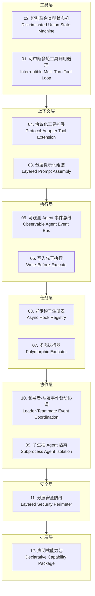
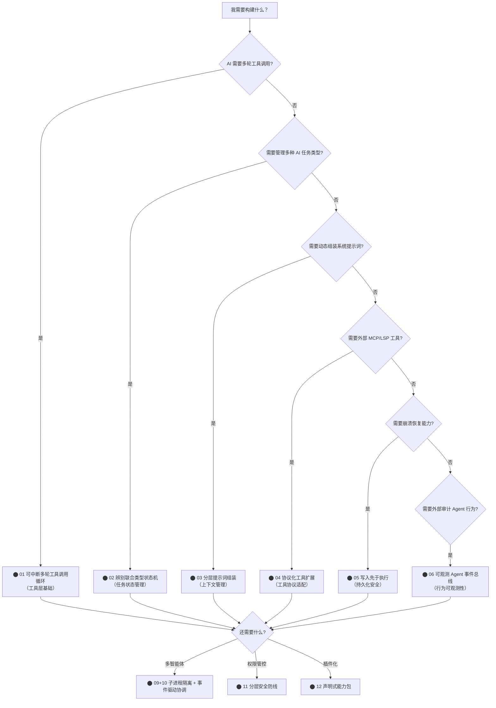

# 第 44 章：Harness 工程模式图谱——12 个可复用设计模式

> "不是聪明胜过混沌，是结构胜过混沌。"

---

39 章追踪结束于同一个问题的 12 种答案：**如何在 AI 的不确定性边界上修一道工程护栏？** AI 的输出不可预测，但工具调用可以有签名；AI 的决策不透明，但钩子可以拦截；AI 的上下文无限蔓延，但提示词可以分层组装。Claude Code 的 40,000 行源码反复回答这同一个问题，每次的答案都是一个可以被命名的模式。

这 12 个模式构成「Agent Harness 分层模式语言（Agent Harness Pattern Language）」——一套专门为 AI Agent 系统设计的工程词汇表。它们按七个工程层次组织：**工具层**（AI 如何使用工具）→ **上下文层**（AI 获得什么信息）→ **执行层**（AI 行为如何被记录和钩挂）→ **任务层**（AI 任务如何被封装和调度）→ **协作层**（多个 AI 如何协调）→ **安全层**（AI 操作如何被约束）→ **扩展层**（AI 能力如何被打包和分发）。读完这章，你将拥有一张完整的 Harness 工程地图，可以在自己的 Agent 系统中直接选用这些模式。

---

## 节 40.1：模式图谱——七层架构与 12 个模式

每个工程层解决不同的核心问题。从下到上，层层叠加：

**图 44-1：Agent Harness 七层模式图谱**



七层从底层到顶层呈依赖关系——「可中断工具调用循环」是最基础的 Agent 核心，「声明式能力包」是最外层的打包约定。理解这个层次关系，就理解了 Claude Code 的整体工程架构。

---

## 节 40.2：源码实例1——工具层：可中断多轮工具调用循环

工具层的核心问题是：**AI 需要多轮工具调用才能完成任务，但每轮调用都必须可以被用户中断**。

`QueryEngine.ts` 的主查询循环体现了这个模式：

```typescript
// 在进入查询循环前，先把用户消息写入转录文件（写入先于执行，详见节40.6）
// Persist the user's message(s) to transcript BEFORE entering the query
// loop. The for-await below only calls recordTranscript when ask() yields
// an assistant/user/compact_boundary message — which doesn't happen until
// the API responds.
await recordTranscript(userMessages)

// 可中断的 for-await 循环：每次 yield 一条消息，检查中断信号
for await (const message of query({
  messages,
  systemPrompt,
  userContext,
  canUseTool: wrappedCanUseTool,    // 包装了中断检查的工具调用许可
  maxTurns,                          // 防止无限循环的最大轮次
  taskBudget,                        // token 预算边界
})) {
  // 处理 assistant/user/compact_boundary 三种消息类型
  // AI 每次返回都经过这里，可在此注入中断逻辑
}
```

**源码参考：** `src/QueryEngine.ts:436`（写入先于执行注释）；`src/QueryEngine.ts:675`（for-await 主循环入口）

`for await` 是这个模式的核心语言特性——异步迭代器允许在每次 `yield` 之间插入检查逻辑（中断信号、token 预算、最大轮次）。与普通 `while(true)` 循环相比，`for await` 让「循环体」和「中断条件」天然分离，详见第 14 章。

`wrappedCanUseTool` 是另一个关键设计——它不是简单的 `boolean`，而是一个在每次工具调用前执行的函数，可以动态注入权限检查和中断逻辑，而不需要修改核心循环代码。

**tasks/types.ts 的辨别联合类型状态机**（模式2）体现了同层的配套设计：

```typescript
export type TaskState =
  | LocalShellTaskState
  | LocalAgentTaskState
  | RemoteAgentTaskState
  | InProcessTeammateTaskState
  | LocalWorkflowTaskState
  | MonitorMcpTaskState
  | DreamTaskState
```

**源码参考：** `src/tasks/types.ts:12`

每个 `*TaskState` 都是独立的类型，有自己的 `status` 字段和能力边界。TypeScript 用判别字段（如 `type` 或 `status`）在 switch 分支中精确收窄类型——编译器保证所有状态都被处理，添加新 TaskState 时遗漏 case 会产生编译错误，详见第 29 章。

两个模式在工具层协同工作：循环决定"何时调用下一个工具"，状态机决定"当前任务处于什么状态"。

---

## 节 40.3：源码实例2——执行层 + 安全层

执行层需要解决的问题是：**AI 的每次操作都必须可被观测、可被审计，即使进程在操作中途崩溃也不能丢失记录**。

`AsyncHookRegistry.ts` 的全局注册表体现了「异步钩子注册表」模式（模式8）：

```typescript
// 全局注册表状态——所有异步钩子通过 Map 追踪
const pendingHooks = new Map<string, PendingAsyncHook>()

export function registerPendingAsyncHook({
  processId, hookId, hookName, hookEvent, command, ...
}): void {
  pendingHooks.set(processId, {
    processId, hookId, hookName, hookEvent,
    startTime: Date.now(),
    timeout,
    command,
    responseAttachmentSent: false,  // 标记响应是否已发送，防止重复
    stopProgressInterval: startHookProgressInterval(...)
  })
}
```

**源码参考：** `src/utils/hooks/AsyncHookRegistry.ts:28`（pendingHooks Map 定义）；`src/utils/hooks/AsyncHookRegistry.ts:37`（registerPendingAsyncHook 函数定义）

Map 的 key 是 `processId`，Value 追踪钩子的完整生命周期状态（启动时间、超时时间、是否已响应）。当钩子进程超时或崩溃，注册表中仍然存在其 `PendingAsyncHook` 记录，系统可以据此清理并上报错误，不会出现「进程已死但系统不知道」的幽灵状态，详见第 30 章。

安全层的「分层安全防线」（模式11）在 `permissions.ts` 中体现了不同的执行层模式——**返回 `null` 而非 `false` 来表示"本层不负责这个决策"**：

```typescript
export function getAllowRules(context: ToolPermissionContext): PermissionRule[]
export function getDenyRules(context: ToolPermissionContext): PermissionRule[]
export function getAskRules(context: ToolPermissionContext): PermissionRule[]
```

**源码参考：** `src/utils/permissions/permissions.ts:122`（getAllowRules）；`:213`（getDenyRules）；`:223`（getAskRules）

三个独立函数各自管理「允许」、「拒绝」、「询问」三类规则。**每层只判断自己有规则的情况，无规则时返回空列表（而非决策）**，由调用方组合三个列表得出最终决策。这种分层让每个决策维度（项目规则/用户规则/会话规则）可以独立演化，详见第 21 章。

---

## 节 40.4：12 个模式完整图谱

以下是按七层组织的完整模式目录，每个模式给出简洁的五要素说明：

**图 44-2：模式选型决策树**



---

### 工具层（Tool Layer）

**模式 01：可中断多轮工具调用循环**
**（Interruptible Multi-Turn Tool Loop）**

| | |
|---|---|
| **问题** | AI 完成任务需要多轮工具调用，每轮调用都必须可中断，不能阻塞用户 |
| **解决方案** | 用异步迭代器（`for await`）包装 AI 对话，每次 `yield` 后检查中断信号；用 `canUseTool` 回调注入动态许可逻辑 |
| **前置条件** | 运行时支持异步生成器；需要区分用户主动中断和系统限制中断 |
| **源码锚点** | `src/QueryEngine.ts:675`（for-await 主循环）；`:436`（写入先于执行注释） |
| **详见** | 第 42 章 |

---

**模式 02：辨别联合类型状态机**
**（Discriminated Union State Machine）**

| | |
|---|---|
| **问题** | Agent 系统有多种互不相容的任务类型（本地/远程/工作流），switch 分支容易遗漏新类型 |
| **解决方案** | 用 TypeScript discriminated union 定义 `TaskState`，编译器在 switch 分支缺失时报错，而非运行时崩溃 |
| **前置条件** | 使用 TypeScript；任务类型集合有限且稳定 |
| **源码锚点** | `src/tasks/types.ts:12`（TaskState union 定义） |
| **详见** | 第 29 章 |

---

### 上下文层（Context Layer）

**模式 03：分层提示词组装**
**（Layered Prompt Assembly）**

| | |
|---|---|
| **问题** | 系统提示词来自多个来源（全局/项目/用户/记忆），需要按优先级合并，且某些部分需要 cache-friendly 排列 |
| **解决方案** | 把提示词分为静态层（全局配置）和动态层（会话上下文），各层独立维护，组装时按固定顺序合并 |
| **前置条件** | 提示词各层有明确的语义边界；缓存命中率对成本敏感 |
| **源码锚点** | `src/utils/queryContext.ts`（上下文组装逻辑） |
| **详见** | 第 19 章 |

---

**模式 04：协议化工具扩展**
**（Protocol-Adapter Tool Extension）**

| | |
|---|---|
| **问题** | 外部工具（MCP 服务器、LSP 服务器）使用不同协议，需要统一集成到工具调用接口 |
| **解决方案** | 为每种外部工具协议实现适配器，把协议差异封装在适配器内部，对 Agent 主循环暴露统一的工具调用接口 |
| **前置条件** | 外部工具协议稳定；需要隔离协议细节和业务逻辑 |
| **源码锚点** | `src/services/mcp/client.ts`（MCP 工具适配器） |
| **详见** | 第 45 章 |

---

### 执行层（Execution Layer）

**模式 05：写入先于执行**
**（Write-Before-Execute）**

| | |
|---|---|
| **问题** | 进程在执行中途崩溃时，未记录的操作无法从日志中恢复 |
| **解决方案** | 在执行任何可能失败的操作前，先将操作意图写入持久化日志；进程重启后从日志恢复状态 |
| **前置条件** | 存在持久化存储；操作的意图比结果更重要（用于恢复） |
| **源码锚点** | `src/QueryEngine.ts:436`（用户消息在进入循环前先写入转录） |
| **详见** | 第 21 章 |

---

**模式 06：可观测 Agent 事件总线**
**（Observable Agent Event Bus）**

| | |
|---|---|
| **问题** | Agent 行为需要被外部系统（监控/审计/测试）观测，但 Agent 不应该知道谁在观测它 |
| **解决方案** | Agent 在关键节点发布事件（工具调用前/后、对话开始/结束），订阅者异步消费事件，Agent 与订阅者完全解耦 |
| **前置条件** | 事件的语义是稳定的（发布者和订阅者的契约） |
| **源码锚点** | `src/entrypoints/sdk/coreTypes.ts`（SDK 事件类型定义） |
| **详见** | 第 44 章 |

---

### 任务层（Task Layer）

**模式 07：多态执行器**
**（Polymorphic Executor）**

| | |
|---|---|
| **问题** | 钩子（hooks）可能是同步的或异步的，调用方不应该区分两者 |
| **解决方案** | 执行器接受钩子函数的 union 类型，内部处理同步/异步的差异，对外提供统一的 `await executeHook(fn)` 接口 |
| **前置条件** | 需要对外隐藏执行方式的差异；有多种执行策略需要统一管理 |
| **源码锚点** | `src/utils/hooks.ts`（多态钩子执行器） |
| **详见** | 第 25 章 |

---

**模式 08：异步钩子注册表**
**（Async Hook Registry）**

| | |
|---|---|
| **问题** | 异步子进程钩子在执行中途可能超时或崩溃，需要追踪其生命周期并在失败时清理 |
| **解决方案** | 用全局 Map 追踪所有进行中的异步钩子，注册时记录启动时间和超时设置，完成或超时时从 Map 中移除 |
| **前置条件** | 钩子作为独立子进程运行；需要进程级别的生命周期管理 |
| **源码锚点** | `src/utils/hooks/AsyncHookRegistry.ts:28`（pendingHooks Map 全局注册表） |
| **详见** | 第 26 章 |

---

### 协作层（Collaboration Layer）

**模式 09：子进程 Agent 隔离**
**（Subprocess Agent Isolation）**

| | |
|---|---|
| **问题** | 子 Agent 的失控行为（无限循环、资源耗尽）不应该影响主 Agent |
| **解决方案** | 子 Agent 作为独立子进程启动，通过 IPC 通信，资源消耗限制在子进程内；主进程只需要处理 IPC 消息 |
| **前置条件** | 平台支持子进程隔离；IPC 延迟可接受 |
| **源码锚点** | `src/tasks/LocalAgentTask/`（本地 Agent 子进程实现） |
| **详见** | 第 30 章 |

---

**模式 10：领导者-队友事件驱动协调**
**（Leader-Teammate Event Coordination）**

| | |
|---|---|
| **问题** | 多 Agent 协作需要协调权限请求、共享上下文，但点对点通信难以扩展 |
| **解决方案** | 领导者 Agent 通过事件总线广播状态变化，队友 Agent 订阅并响应；权限请求统一路由到领导者决策 |
| **前置条件** | 有清晰的领导者-队友角色划分；权限决策可以集中管理 |
| **源码锚点** | `src/utils/swarm/leaderPermissionBridge.ts`（权限路由桥接） |
| **详见** | 第 33 章 |

---

### 安全层（Security Layer）

**模式 11：分层安全防线**
**（Layered Security Perimeter）**

| | |
|---|---|
| **问题** | AI 工具调用的权限检查需要来自多个来源（项目规则/用户规则/会话规则），规则之间有优先级 |
| **解决方案** | 每层只返回自己的规则列表（允许/拒绝/询问），调用方组合所有层的结果得出最终决策；各层可以独立演化 |
| **前置条件** | 权限规则来源是固定的有限集合；拒绝的优先级高于允许 |
| **源码锚点** | `src/utils/permissions/permissions.ts:122`（getAllowRules）；`:213`（getDenyRules） |
| **详见** | 第 45 章 |

---

### 扩展层（Extension Layer）

**模式 12：声明式能力包**
**（Declarative Capability Package）**

| | |
|---|---|
| **问题** | 插件需要向宿主系统声明自己提供的能力（命令/Agent/钩子），但显式注册增加维护负担 |
| **解决方案** | 用文件系统约定（`commands/` → 斜杠命令，`agents/` → Agent）代替注册表；宿主在加载时自动探测 |
| **前置条件** | 能力类型是稳定的枚举；插件开发者愿意遵守目录约定 |
| **源码锚点** | `src/utils/plugins/pluginLoader.ts:1373`（并行目录探测）；`src/utils/plugins/schemas.ts:884`（PluginManifestSchema 组合） |
| **详见** | 第 43 章 |

---

## 节 40.5：适用范围——按 Agent 系统特征选择模式

不同类型的 Agent 系统需要不同的模式组合：

| Agent 系统类型 | 优先应用的模式 | 可以延后的模式 | 理由 |
|--------------|-------------|--------------|------|
| 单次工具调用（非多轮）| 05（写入先于执行）、11（分层安全）| 01（多轮循环不需要）| 无多轮对话，循环模式不适用 |
| 多轮对话 Agent | 01、02、05 | 09、10 | 多轮对话是核心，单进程足够 |
| 工具密集型 Agent | 01、04、06、11 | 03（提示词简单）| 工具调用是重心，需要协议适配和权限管控 |
| 上下文密集型 Agent | 03、05、06 | 09（无需多进程）| 系统提示词管理是重心 |
| 多 Agent 协作系统 | 02、06、09、10 | 12（无需插件化）| 多进程隔离和事件协调是核心 |
| 插件化 Agent 平台 | 04、08、11、12 | 10（无 Swarm）| 插件生态是重心，需要钩子和权限管理 |
| 需要崩溃恢复 | 05、08 | 03、12 | 持久化和生命周期管理是重心 |

---

## 节 40.6：权衡——使用模式语言的代价

**权衡1：命名的好处与约束**

给工程模式命名让团队有了共同词汇——「我们用可中断工具调用循环」比「我们用 for-await 实现工具循环」更快传递设计意图。但名称也可能成为约束：一旦一个系统被贴上「使用模式X」的标签，改变实现方式需要同时更新词汇表，团队可能因为「词汇一致」而选择保留不再合适的实现。

**权衡2：跨层依赖与独立演化**

七层模式之间存在依赖关系（工具层是执行层的基础），但这也意味着修改底层可能波及上层。在实际系统中，「分层」并不总是那么干净——`QueryEngine.ts` 同时实现了工具层（for-await 循环）、执行层（写入先于执行）和部分安全层（canUseTool）逻辑，单个文件跨多层是常见的现实妥协。

**权衡3：模式的可移植性是相对的**

「可中断多轮工具调用循环」在 Claude Code 中依赖 TypeScript 异步生成器和 Claude API 的流式响应。移植到 Python 或 Go 时，语言特性不同，实现会变化，但核心思想（可中断 + 每轮检查）是跨语言可携带的。**模式的可携带性在于设计原则，而非具体实现**。

---

## 节 40.7：与已知模式语言的对话

**与 GoF 设计模式**：GoF 的 23 个模式解决的是面向对象设计中的类/对象关系问题（策略模式、观察者模式、工厂模式）。「Agent Harness 模式语言」解决的是 AI Agent 工程中的不确定性管理问题（可中断循环、分层安全、写入先于执行）。两者的相同点是「命名 + 分类」的系统化思路；不同点是 GoF 模式是语言无关的面向对象抽象，Harness 模式是 AI Agent 场景专属的工程约定。GoF 观察者模式和「可观测 Agent 事件总线」最为接近，但前者是同步的类层次设计，后者更强调异步和进程边界。

**与 POSA 架构模式**：《Pattern-Oriented Software Architecture》的分层架构（Layers）和管道过滤器（Pipes and Filters）在 Harness 中都有对应：分层提示词组装（Layers）、可中断工具调用循环（Pipes and Filters 的特化）。POSA 的 Microkernel 架构对应了「声明式能力包」模式——插件包是 Microkernel 的 Plug-ins，宿主系统是 Microkernel 本身。

**与 EIP（Enterprise Integration Patterns）**：消息总线、事件驱动、发布-订阅——这些 EIP 核心模式在 Agent 协作层中直接出现。「可观测 Agent 事件总线」是 EIP 事件驱动消费者模式的 Agent 特化；「领导者-队友事件驱动协调」是 EIP 聚合器（Aggregator）在多 Agent 场景中的变体。**AI Agent 协作系统在本质上是一个分布式消息系统，EIP 的经验直接适用**。

---

## 模式索引表

| # | 模式名称（中 / EN） | 解决的核心问题 | 所在层 | 详见章节 |
|---|---|---|---|---|
| 01 | 可中断多轮工具调用循环 / Interruptible Multi-Turn Tool Loop | AI 需要多轮工具调用且必须可中断 | 工具层 | 第 14 章 |
| 02 | 辨别联合类型状态机 / Discriminated Union State Machine | 多种 Task 类型的类型安全管理 | 工具层 | 第 45 章 |
| 03 | 分层提示词组装 / Layered Prompt Assembly | 多来源系统提示词的可维护合并 | 上下文层 | 第 19 章 |
| 04 | 协议化工具扩展 / Protocol-Adapter Tool Extension | 外部工具协议的统一接口适配 | 上下文层 | 第 45 章 |
| 05 | 写入先于执行 / Write-Before-Execute | 操作意图在执行前持久化 | 执行层 | 第 45 章 |
| 06 | 可观测 Agent 事件总线 / Observable Agent Event Bus | Agent 行为的外部可观测性 | 执行层 | 第 44 章 |
| 07 | 多态执行器 / Polymorphic Executor | 同步/异步钩子的统一执行接口 | 任务层 | 第 45 章 |
| 08 | 异步钩子注册表 / Async Hook Registry | 异步子进程钩子的生命周期管理 | 任务层 | 第 30 章 |
| 09 | 子进程 Agent 隔离 / Subprocess Agent Isolation | 子 Agent 资源和行为的进程级隔离 | 协作层 | 第 30 章 |
| 10 | 领导者-队友事件驱动协调 / Leader-Teammate Event Coordination | 多 Agent 权限请求和状态的集中协调 | 协作层 | 第 45 章 |
| 11 | 分层安全防线 / Layered Security Perimeter | 多来源权限规则的分层组合决策 | 安全层 | 第 45 章 |
| 12 | 声明式能力包 / Declarative Capability Package | 插件能力的零注册自动探测 | 扩展层 | 第 43 章 |

---

## 你能做什么

- **用模式01（可中断多轮工具调用循环）作为 Agent 的最小核心**。`for await` + `canUseTool` 回调是构建任何多轮 Agent 的起点。先让循环跑起来，再逐步添加其他层的模式。

- **用模式02（辨别联合类型状态机）管理所有 Task 类型**。TypeScript discriminated union 让添加新任务类型变成「编译器强制完整性」的过程，而不是「记得去改所有 switch」的人肉任务。

- **用模式05（写入先于执行）在生产环境中保护 Agent 操作**。在任何高风险操作（文件修改、API 调用、外部命令）执行前，先写入意图日志。崩溃恢复的成本远低于数据丢失的成本。

- **用模式06（可观测 Agent 事件总线）为 Agent 预埋审计钩子**。在产品早期就在关键节点发布事件——工具调用前/后、对话开始/结束。事后添加可观测性比预埋钩子难度大一个数量级。

- **用模式11（分层安全防线）设计权限系统**。把「允许规则」、「拒绝规则」、「询问规则」分开管理，每层只负责自己的规则集。不要把所有权限逻辑混在一个巨大的 `checkPermission` 函数里。

- **在引入多 Agent 协作前，先验证单 Agent 的边界**。模式09（子进程隔离）和模式10（事件驱动协调）只在单 Agent 模式12（声明式能力包）和模式04（协议化工具扩展）已经稳定后才引入——多智能体复杂度是单智能体复杂度的乘方，而非加法。

---

第 44 章提炼了 Claude Code 的 12 个工程模式，构成 Agent Harness 的完整词汇表。第 45 章将从这张模式图谱出发，回答最后一个问题：如果你要把 Claude Code 这样的 CLI 工具演化为一个 Agent 平台，架构跃迁的路线图是什么（详见第 45 章）。
