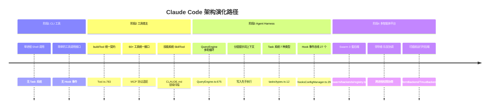
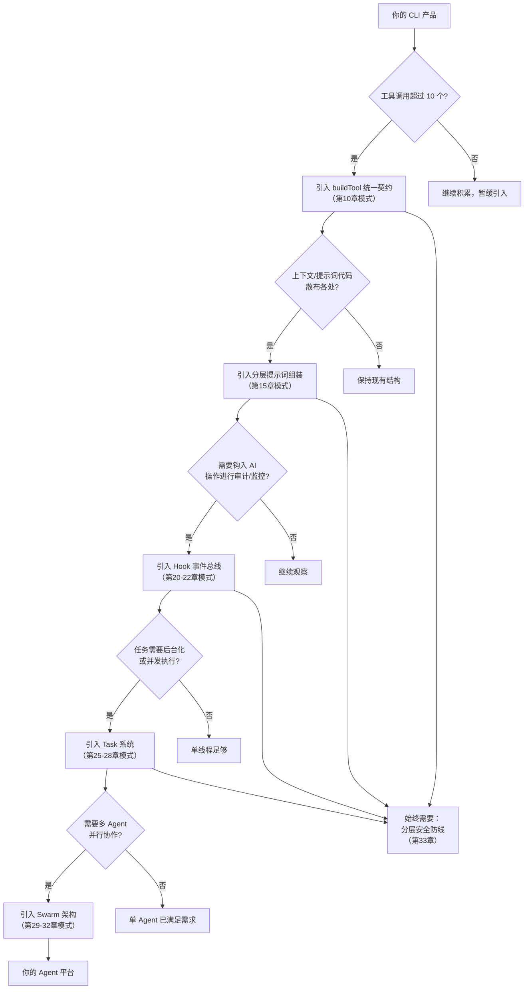

# 第 45 章：从 CLI 到 Agent 平台——架构跃迁的路线图

> "不是从头设计，是在压力下演化。"

---

这不是一个 CLI——这是一套演化中的 Agent Harness，每条架构跃迁都在源码中留有痕迹。27 个钩子事件，来自一开始只有 3 个的扩展；7 种 Task 类型，来自最初只有本地 Shell 调用；3 套 Swarm 后端，来自最初单进程的工具调用；60+ 个工具，背后是一个统一的 `buildTool` 契约。这些数字不是设计目标，而是生产压力积累的结果——每次积累都对应一次架构层次的跃迁。

本章提炼的模式是「渐进式架构跃迁（Incremental Architecture Leap）」——在功能压力信号出现时，用最小侵入的方式引入新的抽象层次，而不是预先设计所有层次。这条路径比任何框架的教程都真实，因为它是在 Claude Code 的 40,000 行源码和数百次提交中实证过的。读完这章，你将能为自己的产品绘制一张相同的演化路线图。

---

## 节 41.1：四阶段演化的源码证据

Claude Code 经历了四个可辨识的架构阶段，每个阶段都有对应的源码演化痕迹。

**图 45-1：Claude Code 四阶段架构演化时间线**



**阶段一：CLI 工具**（一个进程，一个对话，一次回答）

单进程、无任务系统、无钩子。工具调用是直接的，没有可中断性，没有事件通知，没有跨会话记忆。源码在这个阶段的痕迹是缺席——没有 `tasks/` 目录，没有 `hooks/` 子系统，没有 `QueryEngine.ts` 的多轮控制逻辑。

**阶段二：工具宿主**（统一接口 + 协议适配）

`buildTool` 是阶段二到来的标志。`Tool.ts:783` 的 `buildTool` 函数注释写道：

> 「类型语义已被 60+ 个工具的零错误类型检查所证明。」

**源码参考：** `src/Tool.ts:783`

60+ 个工具需要一个稳定的契约——每个工具独立演化，但对 QueryEngine 主循环暴露统一的 `execute/isAllowed/isEnabled` 接口。这是抽象层次首次出现的信号：**当工具超过 10 个，统一接口的维护收益开始超过引入它的成本**。

CLAUDE.md 层级扫描（`attachments.ts:1649`）也在这个阶段形成——用文件系统层级代替配置文件，把「项目级指令」和「用户级指令」通过目录位置声明，而非注册表管理：

```
// 从 CWD 向上遍历，收集所有层级的 CLAUDE.md 文件
// nestedDirs: Directories between CWD and targetPath
// (processed for CLAUDE.md + all rules)
```

**源码参考：** `src/utils/attachments.ts:1649`

**阶段三：Agent Harness**（多轮控制 + 可观测性 + 任务系统）

三个子系统标志了阶段三的到来：

第一，`QueryEngine.ts:675` 的 for-await 多轮循环——AI 开始需要多步推理，单次响应不再足够（详见第 42 章）。

第二，Task 类型从 1 种演化到 7 种。`tasks/types.ts:12` 的 union 类型定义是这段历史的快照：

```typescript
export type TaskState =
  | LocalShellTaskState        // 最初的唯一类型
  | LocalAgentTaskState        // 本地 Agent 任务
  | RemoteAgentTaskState       // 远程 Agent
  | InProcessTeammateTaskState // 进程内队友
  | LocalWorkflowTaskState     // 工作流
  | MonitorMcpTaskState        // MCP 监控
  | DreamTaskState             // 梦境任务（推断：实验性功能）
```

**源码参考：** `src/tasks/types.ts:12`

每种新 TaskState 的添加都对应一个新的用户场景压力：后台任务需求 → `LocalAgentTask`；多工作区需求 → `InProcessTeammateTask`；工作流编排需求 → `LocalWorkflowTask`。

第三，Hook 事件系统从零增长到 27 个。`hooksConfigManager.ts:29` 中列出的事件是演化历史的索引：

```typescript
PreToolUse: { ... }          // 最早的核心钩子
PostToolUse: { ... }
PostToolUseFailure: { ... }
// ── 之后逐步追加 ──
SessionStart: { ... }
SubagentStart: { ... }       // Swarm 到来时添加
TeammateIdle: { ... }        // 协作场景需要
TaskCreated: { ... }         // Task 系统到来时添加
Elicitation: { ... }         // 用户交互场景
WorktreeCreate: { ... }      // Git Worktree 功能
CwdChanged: { ... }          // 目录切换感知
FileChanged: { ... }         // 文件系统监听（最新）
// ── 共 27 个事件 ──
```

**源码参考：** `src/utils/hooks/hooksConfigManager.ts:29`（第一个事件定义起点）

**每个新事件都是一次新的扩展点**——不是修改已有代码，而是增加一个新的钩子位置，让外部系统可以在这里观测或干预 Agent 行为。

**阶段四：多智能体平台**（多进程 + 可插拔后端）

Swarm 后端注册表（`swarm/backends/registry.ts`）是阶段四的入口：

```typescript
import { createInProcessBackend } from './InProcessBackend.ts'   // 进程内
import { createPaneBackendExecutor } from './PaneBackendExecutor.ts'  // 终端面板
// TmuxBackend 和 ITermBackend 通过注册表动态注入
let TmuxBackendClass: (new () => PaneBackend) | null = null
let ITermBackendClass: (new () => PaneBackend) | null = null
```

**源码参考：** `src/utils/swarm/backends/registry.ts:11`

三种后端（InProcess/Tmux/iTerm2）对应三种运行环境——每种环境有不同的终端能力，但通过统一的 `PaneBackend` 接口对外屏蔽差异。这是阶段四的典型压力信号：**当多 Agent 协作需要在不同终端环境工作，可插拔后端的价值开始凸显**（详见第 35 章）。

---

## 节 41.2：演化规律——压力信号触发架构层次

从三组数字（Hook 事件 3→27、Task 类型 1→7、Swarm 后端 1→3）可以提炼出一条演化规律：

**压力信号→单一职责边界→接口膨胀→抽象新层次→新层次稳定→暴露新扩展点**

这条规律对应 Claude Code 每次重大架构演化：

- **Hook 系统**：最初只有 `PreToolUse/PostToolUse`，能满足基本的工具前后钩挂需求。当 Swarm 加入时，需要感知子 Agent 的启停（→`SubagentStart/Stop`）；当任务系统到来时，需要感知任务生命周期（→`TaskCreated/Completed`）；每个新场景都追加新事件，而不修改已有事件的语义。**扩展点的稳定性，来自每个事件的语义边界清晰，不随时间漂移**。

- **Task 系统**：最初可能只有本地 Shell 执行，一切都是同步的、单进程的。当需要后台 Agent 时，`LocalAgentTask` 作为新类型加入 union；当需要进程内队友时，`InProcessTeammateTask` 加入——每次加入都用新类型表达新语义，而不是在已有类型上堆 if/else。**discriminated union 让类型边界变成编译器保障的契约，不是口头约定**。

- **Swarm 后端**：最初只有单进程，所有 Agent 在同一进程内执行。当用户希望在终端多面板中看到 Agent 并行工作时，`PaneBackendExecutor` 诞生；当需要适配 Tmux 和 iTerm2 两种主流终端多路复用工具时，后端注册表出现。**可插拔后端让运行时环境差异不侵入业务逻辑**。

这条规律的核心是：**每次架构演化都是被动的**——不是预先设计好的，而是在功能压力下找到了新的抽象层次。这让 Claude Code 的演化路径比预先设计的框架更贴近工程现实。

---

## 节 41.3：你的产品——五个跃迁信号

**图 45-2：从 CLI 到 Agent 平台的架构跃迁决策树**



**信号1：工具调用超过 10 个** → 引入 `buildTool` 统一契约

每个工具独立编写的代价在 10 个工具时开始显现：添加新工具需要理解已有工具的实现细节，权限检查逻辑散落各处，测试难以复用。`buildTool` 把工具的四个关注点分离（`execute/isAllowed/isEnabled/name`），让新工具的编写成为填空而非从头设计（详见第 14 章）。

**信号2：上下文/提示词代码散落各处** → 引入分层提示词组装

当「系统提示词该放哪里」开始引发讨论，当「这个功能需要的上下文从哪里来」需要翻源码才能回答，就是引入分层提示词组装的时机。把全局指令、项目指令、会话指令分到不同层次，各层独立维护，组装时按优先级合并（详见第 19 章）。

**信号3：需要在 AI 操作前后注入逻辑** → 引入 Hook 事件总线

监控、审计、安全检查——这些「横切关注点」如果直接修改 Agent 主逻辑，会让主逻辑代码越来越难维护。Hook 事件总线让这些关注点作为订阅者注册，而不侵入主逻辑（详见第 24-26 章）。**先建立事件发布基础设施，再添加订阅者**，不要反过来。

**信号4：任务需要后台化或并发** → 引入 Task 系统

当用户说「我想在 Agent 工作时做其他事情」，当两个独立的工作流需要并行进行，就是 Task 系统入场的时机。Task 系统把「一次 Agent 执行」封装为有生命周期（pending/running/complete/failed）的对象，可以被调度、取消、恢复（详见第 37-40 章）。

**信号5：需要多个 Agent 并行协作** → 引入 Swarm 架构

Swarm 是所有信号中最昂贵的——它放大了单 Agent 的所有问题（权限复杂度×N，状态同步复杂度×N²）。**只有在前四个信号都被稳定解决后，才考虑引入 Swarm**。引入顺序：先进程内队友（`InProcessTeammate`，最简单的共享内存协作）→ 再终端面板后端（可视化的多进程）→ 最后远程 Agent（真正的分布式）（详见第 37-40 章）。

---

## 节 41.4：与已知 Agent 框架的对话

**与 LangChain/LangGraph**：LangChain 从一开始就设计了「链」（Chain）和「图」（Graph）的概念，试图提供统一的工作流编排框架。Claude Code 的演化路径相反——它先有工具调用，再有 Task 系统，再有 Swarm。两者的差异是**框架设计 vs 演化生长**：框架提供了更一致的 API，但需要用户理解抽象才能入门；演化路径更贴近真实需求，但每个抽象层次的边界是生产压力磨合出来的，不是预先规划的。

**与 AutoGen/CrewAI**：AutoGen 和 CrewAI 把多 Agent 协作作为一等公民——从框架设计之初就围绕「多智能体对话」展开。Claude Code 的 Swarm 系统（详见第 37-40 章）是在单 Agent 成熟后才加入的，**保留了「单 Agent 路径仍然是主路径」的设计选择**——大多数用户不需要多 Agent，用普通的 QueryEngine 循环就够了。Swarm 是可选的扩展，而非强制的架构前提。

**与 POSA 的「层次架构」**：《Pattern-Oriented Software Architecture》的层次架构（Layers）强调每层只与相邻层交互。Claude Code 的四阶段演化是层次架构的渐进实践——**不是一次性设计所有层，而是在需要时才增加新层**。这是层次架构的自然成长路径：先有核心（CLI），再有扩展点（工具契约），再有控制层（Harness），再有协调层（Swarm）。每一层的引入都是因为下一层的抽象泄漏变得不可忍受。

---

## 节 41.5：适用范围——哪类产品适合这条演化路径

| 产品类型 | 适用性 | 理由 | 替代路径 |
|---------|--------|------|---------|
| 从 CLI 工具演化的 AI 产品 | ✓ | 演化路径与 Claude Code 最接近，可直接参照 | 从头设计 Agent 框架（成本高）|
| 内嵌 AI 能力的现有应用 | ✓ | 可选择性引入哪些层次，不必全盘采用 | 使用 LangChain 等现有框架 |
| 需要插件化的 AI 工具 | ✓ | 声明式能力包（阶段2）是插件系统的成熟模式 | 自研插件注册表 |
| 面向企业的 AI Agent | ✓ | 分层安全防线（贯穿各阶段）有成熟的实现参照 | 商业安全框架 |
| 纯研究/实验性 Agent | ✗（谨慎）| 生产演化路径偏向稳定性，不适合快速实验 | 更灵活的 notebook 式框架 |
| 需要实时多模态的 Agent | ✗（不完整）| Claude Code 的演化路径聚焦文本/代码场景 | 专用的多模态 Agent 框架 |

---

## 节 41.6：权衡——渐进式演化 vs 预先设计

**权衡1：演化路径的摩擦成本**

渐进式演化的代价是「重构摩擦」——每次引入新层次都需要改造已有代码，而不是直接使用预设的框架接口。Claude Code 的演化中留下了这些摩擦的痕迹：Task 类型名称不统一（`LocalAgentTaskState` vs `DreamTaskState`），Swarm 后端的注册机制经历了多次重构（见 `registry.ts` 中的 `TmuxBackendClass` 占位符注释）。**演化的真实性来自这些摩擦，框架的整洁性来自预先规划——两者之间没有免费的午餐**。

**权衡2：单 Agent 路径 vs 多 Agent 路径的维护分叉**

引入 Swarm 后，代码库需要同时维护两条路径：「没有 Swarm 的普通 QueryEngine 执行」和「有 Swarm 的 Leader-Teammate 执行」。两条路径的权限检查、上下文管理、错误处理逻辑可能逐渐分化，形成维护负担。Claude Code 通过「Swarm 作为可选扩展，而非替换核心循环」来缓解这个问题——单 Agent 路径保持稳定，Swarm 只是在上层协调多个单 Agent 实例（详见第 45 章）。

**权衡3：框架依赖的锁定风险**

使用 LangChain 这类框架，可以快速获得成熟的链式调用接口，但框架的抽象泄漏时（如框架版本升级导致 API 不兼容），迁移成本很高。**渐进式演化路径把「架构决策」留在内部，降低了框架锁定风险**，代价是需要自己解决每个层次的工程问题，而不是依赖框架的现成解。这对小团队是额外负担，对需要深度定制的团队是优势。

---

## 与已知模式的对话

**与 Strangler Fig Pattern（绞杀榕模式）**：Martin Fowler 的绞杀榕模式用于系统迁移——在旧系统外围逐步建立新系统，最终「绞杀」旧系统。Claude Code 的四阶段演化是绞杀榕模式的自内而外版本：不是在旧系统外建新系统，而是在核心功能稳定后向外扩展新的能力层次。两者相同的是「渐进替换而非一次性重写」，不同的是方向——绞杀榕是由外向内，Claude Code 是由内向外。

**与 POSA 的 Microkernel 架构**：Microkernel 把最小核心和可替换插件分开。Claude Code 的演化路径可以看作 Microkernel 的自然生长：CLI 工具是最小内核，工具宿主阶段加入了「工具插槽」，Harness 阶段加入了「钩子插槽」，Swarm 阶段加入了「后端插槽」。**每次「插槽」的增加都是一次架构层次的显化**——原本散落在代码中的扩展需求，被识别、命名、抽象为可替换的接口。

---

## 模式提炼

### 渐进式架构跃迁（Incremental Architecture Leap）

**解决的问题**：AI Agent 产品的功能需求在早期难以预测，预先设计所有架构层次会造成过度工程；但等到需求清晰后再引入架构层次，往往面临大规模重构。

**核心做法**：识别架构跃迁的功能压力信号（工具数量、上下文复杂度、可观测需求、并发需求、协作需求），每次只在信号出现时引入下一个层次的抽象；每个新抽象层次以「不侵入现有逻辑」为约束（新接口、新目录、新 union 类型），旧代码路径保持稳定。

**前置条件**：团队有能力识别「信号」（不是每次功能请求都触发架构变化）；愿意接受演化路径的重构摩擦成本；有能力写覆盖率足够的测试，确保每次演化不破坏现有行为。

**源码证据**：`src/Tool.ts:783`（60+ 工具的统一契约——工具数量压力）；`src/tasks/types.ts:12`（7 种 TaskState——任务并发压力）；`src/utils/hooks/hooksConfigManager.ts:29`（27 个 Hook 事件——可观测性压力）；`src/utils/swarm/backends/registry.ts:11`（3 套后端——多 Agent 协作压力）

---

## 你的下一步

- **先识别你的产品在哪个演化阶段**，再决定引入哪个层次。从阶段 1 直接跳到阶段 4 是过度工程的最常见来源——你的工具调用可能只有 3 个，Swarm 架构对你没有意义。

- **用 `buildTool` 统一契约作为「工具宿主」阶段的起点**。这个模式的引入成本最低（只需定义一个工厂函数），但收益最持久——它为后续所有工具的扩展点奠基（详见第 14 章）。

- **用 Hook 事件总线作为「Agent Harness」阶段的最小入口**。你不需要从零实现所有 27 个事件——从 3 个开始（工具调用前/后/错误），在新需求到来时追加。事件发布的代价几乎为零，但它为未来的审计、监控、安全检查保留了插槽。

- **在引入 Task 系统前先确保 Hook 系统稳定**。Task 依赖 Hook 事件驱动生命周期通知（`TaskCreated/Completed`）。反过来的顺序会导致 Task 系统内部需要手动触发本应由 Hook 自动处理的通知，产生重复逻辑。

- **在进入多智能体阶段前先解决单 Agent 的安全和可靠性**。Swarm 放大单 Agent 的所有问题：如果单 Agent 的权限检查不严格，N 个 Agent 就有 N 倍的权限漏洞；如果单 Agent 的错误处理不完善，多 Agent 协作时的级联失败会更难调试（详见第 45 章）。

- **把这 12 个模式当作词汇表，而非必须实现的清单**。不是每个 Agent 系统都需要所有 12 个模式——它们是可组合的选项，而非固定的套餐。根据你的产品特征，选择适合的子集。

---

## 猎人自白——39 章追踪的终点

我们从第 1 章开始追踪，一共追踪了 40 个目标。每个目标是一段源码，每段源码背后是一个工程决策。当我们把所有决策放在一起，Claude Code 的全貌才真正浮现：**它不是一个聪明的 AI 应用，而是一套在不确定性边界上精心铺设的工程护栏**。

这些护栏有名字：可中断多轮工具调用循环、分层提示词组装、写入先于执行、可观测 Agent 事件总线……每个名字背后都是一个团队面对过的真实工程问题，以及他们在生产约束下找到的答案。

带走这 12 个名字，回到你自己的代码库，找到你已经在做但还没有命名的模式，找到你面对的工程压力信号，找到下一个该引入的层次——这就是猎人的工作：命名、定位、携带。

---

第 45 章是正文的终点。附录 A-F 提供了快速查阅资源：Hook 事件速查表（附录 A）、工具权限矩阵（附录 B）、MCP 协议参考（附录 C）、配置文件格式（附录 D）、环境变量速查（附录 E）和模式索引（附录 F）。
