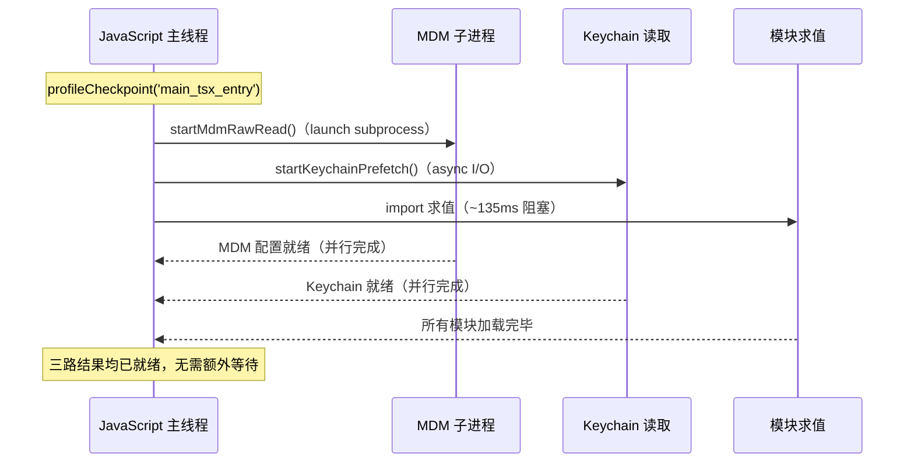
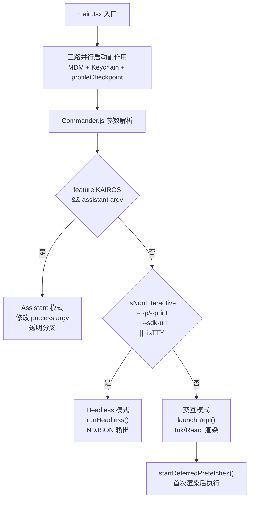

# 第 4 章：CLI 入口与模式分叉——从 main.tsx 到 REPL / Headless / SDK

> "在用户按下回车键之后、终端显示第一个字符之前，有一段没人看到的窗口。"

一个 CLI 工具需要支持四种完全不同的运行场景：交互式终端、无头脚本模式、SDK 程序调用、以及内部助手模式。如果用朴素的方式处理，启动序列就是一段串行代码——解析参数、加载配置、根据 flag 跳转。但 `src/main.tsx` 做的是另一件事：**在 import 求值期间塞入并行 I/O，把不可避免的等待时间变成有用的工作**。

这个模式在 `main.tsx` 的两个不同阶段各出现一次：进程启动时的三路并行副作用，以及首次渲染后的延迟预热序列。两处实例用同一个骨架解决同一个问题——**让等待时间做到不"空转"**。

配合另一个在代码库中大量出现的模式：**模式分叉（Mode Fork）**——在参数解析完成后的第一时间，根据 flag 将控制流永久分叉到四条独立路径，每条路径有自己的 I/O 模型，互不干扰。读完本章，我们将掌握这两个模式及其适用场景。

---

## 问题：CLI 启动的工程挑战

`src/main.tsx` 的前 9 行不是代码，而是一份工程备忘录：

```typescript
// src/main.tsx:1-9
// 以下副作用必须在所有其他 import 之前执行：
// 1. profileCheckpoint 在重量级模块求值开始前标记入口时间戳
// 2. startMdmRawRead 启动 MDM 子进程（plutil/reg query），使其与后续约 135ms 的
//    import 求值并行执行
// 3. startKeychainPrefetch 并行启动两组 macOS Keychain 读取（OAuth + 旧版 API key）
//    ——否则 isRemoteManagedSettingsEligible() 会在
//    applySafeConfigEnvironmentVariables() 内通过同步 spawn 顺序读取
//    （每次 macOS 启动约 65ms）
// （原文：These side-effects must run before all other imports:
//  1. profileCheckpoint marks entry before heavy module evaluation begins
//  2. startMdmRawRead fires MDM subprocesses (plutil/reg query) so they run in
//     parallel with the remaining ~135ms of imports below
//  3. startKeychainPrefetch fires both macOS keychain reads (OAuth + legacy API
//     key) in parallel — isRemoteManagedSettingsEligible() otherwise reads them
//     sequentially via sync spawn inside applySafeConfigEnvironmentVariables()
//     (~65ms on every macOS startup)）
```

**源码参考：** `src/main.tsx:1-9`

注释给出了三个精确数字：约 135ms 的 import 求值时间，以及 ~65ms 的顺序 Keychain 读取成本。这不是猜测，是实测数据的记录。问题的本质在于：**JavaScript 的 `import` 语句是同步阻塞的**——模块求值期间，主线程什么都不能做。对于 Claude Code 这种依赖链深厚的工程，所有模块求值完毕需要约 135ms。如果 MDM 配置读取和 Keychain 预读取都等到 import 完成再开始，用户感知到的启动延迟就是 135ms + 65ms + 业务初始化时间。

**把等待变成并行：** MDM 子进程（`plutil/reg query`）和 Keychain 读取都是独立的 I/O 操作——它们不依赖 import 求值的结果，只是需要尽快拿到数据供后续流程使用。把它们塞在 import 语句之间，让它们在 JavaScript 等待模块求值时已经在操作系统层面并行跑起来，是一个零成本的优化。

**图 4-1：三路并行启动时序**



*图注：三路操作在同一个时间窗口内并行执行。import 求值期间，MDM 和 Keychain 的 I/O 已经在操作系统层面完成，主线程加载完模块就能立即使用它们的结果——等待时间从串行叠加变为并行重叠。*

---

## 源码实例 1：三路并行启动序列

三个操作在 `src/main.tsx` 前 21 行完成部署：

```typescript
// src/main.tsx:12-20
profileCheckpoint('main_tsx_entry');
import { startMdmRawRead } from './utils/settings/mdm/rawRead.ts';

// eslint-disable-next-line custom-rules/no-top-level-side-effects
startMdmRawRead();
import { ensureKeychainPrefetchCompleted, startKeychainPrefetch }
  from './utils/secureStorage/keychainPrefetch.ts';

// eslint-disable-next-line custom-rules/no-top-level-side-effects
startKeychainPrefetch();
import { feature } from 'bun:bundle';
```

**源码参考：** `src/main.tsx:12-20`

注意两处 `eslint-disable` 注释：`custom-rules/no-top-level-side-effects`。这表明 Claude Code 有一条 ESLint 规则专门禁止模块顶层副作用——但这两处是**刻意的例外**，正因为规则的存在，例外才变得显眼。当我们在代码库里看到 `eslint-disable`，往往就是设计意图最集中的地方。

`profileCheckpoint('main_tsx_entry')` 是性能剖析标记——它在第 12 行就打入，记录"模块代码开始执行"的时间戳。这一行配合后续的 `profileCheckpoint` 调用，能精确测量每个启动阶段的耗时，这是三个数字（135ms、65ms）能被记录在注释里的技术基础。

### 延迟预热：首次渲染后的第二波并行

三路并行不是启动阶段的全部。`src/main.tsx:388` 定义了 `startDeferredPrefetches()`——一组延迟到**首次渲染后**才执行的预热操作：

```typescript
// src/main.tsx:388-395
export function startDeferredPrefetches(): void {
  // This function runs after first render, so it doesn't block the initial paint.
  // ...
  void initUser();
  void getUserContext();
  prefetchSystemContextIfSafe();
  void getRelevantTips();
  // ...
  void refreshModelCapabilities();
}
```

**源码参考：** `src/main.tsx:388-428`

这是同一个并行抢跑思路的第二个变体：第一波（启动副作用）的目标是"在 import 阻塞期间完成 I/O"，第二波（延迟预热）的目标是"在用户输入第一条消息之前完成 API 预热"。注释说明了选择 firstRender 后执行的原因："doesn't block the initial paint"——用户看到界面比数据就绪更重要，把"用户还在打字"的时间利用起来预取数据，是感知性能优化的经典手段。

两个变体的**关键区别**：启动副作用需要在 import 求值期间同步部署（利用阻塞窗口），延迟预热是完全异步的（通过 `void` 前缀忽略 Promise 返回值，只要启动、不等结果）。

---

## 源码实例 2（变体）：四种模式分叉

`main.tsx` 的第二个核心模式出现在参数解析完成后。Claude Code 需要处理四种场景，但每种场景的 I/O 模型完全不同：

| 模式 | 触发条件 | 入口 | I/O 模型 |
|------|---------|------|---------|
| 交互模式 | 默认（TTY 终端） | `launchRepl()` | Ink/React 渲染循环 |
| Headless | `-p/--print` flag | `runHeadless()` | NDJSON 流式输出 |
| SDK | `--sdk-url` / `ENTRYPOINT=sdk-ts` | 事件循环 API | 结构化 JSON |
| Assistant | `feature('KAIROS') && _pendingAssistantChat` | `assistantModule` | （stub） |

分叉决策在 `src/main.tsx:800-804` 用一行完成：

```typescript
// src/main.tsx:800-804
const hasPrintFlag = cliArgs.includes('-p') || cliArgs.includes('--print');
const hasInitOnlyFlag = cliArgs.includes('--init-only');
const hasSdkUrl = cliArgs.some(arg => arg.startsWith('--sdk-url'));
const isNonInteractive = hasPrintFlag || hasInitOnlyFlag || hasSdkUrl
  || !process.stdout.isTTY;
```

**源码参考：** `src/main.tsx:800-803`

`isNonInteractive` 这一个布尔值是整个模式分叉的核心：只要进入非交互状态，后续的全部流程都走不同的代码路径。注意条件的设计——`!process.stdout.isTTY` 作为最后一个条件，确保了"重定向到管道"的场景也自动落入非交互模式，无需用户显式指定 `-p`。

Assistant 模式（KAIROS）的分叉逻辑出现得更早，在 Commander.js 解析之前：

```typescript
// src/main.tsx:685-695
if (feature('KAIROS') && _pendingAssistantChat) {
  const rawArgs = process.argv.slice(2);
  if (rawArgs[0] === 'assistant') {
    // ...修改 process.argv，使 commander 接收的参数
    // 去掉 'assistant' 前缀
  }
}
```

**源码参考：** `src/main.tsx:685-695`

这里有个设计细节值得注意：KAIROS 模式通过修改 `process.argv` 实现"透明分叉"——后续的 Commander.js 解析看不到 `assistant` 这个前缀，整个分叉对命令解析层来说是不可见的。与 `isNonInteractive` 的显式判断相比，这是一种更隐式的分叉方式（推断：这可能是为了让 KAIROS 模式完全复用主流程的参数解析逻辑，而不需要在 Commander 里单独注册）。

**图 4-2：四种运行模式分叉决策树**



*图注：分叉在参数解析后立刻发生——KAIROS 检查在 Commander 解析前，isNonInteractive 判断在解析后。一旦进入某条分支，两条路径的 I/O 模型就完全不同，不会再合并。延迟预热只在交互模式下触发（因为 Headless 模式没有"用户在打字"的时间窗口）。*

---

## 模式剖析：两个互补的启动模式

| 维度 | 并行抢跑（Parallel Pre-flight） | 模式分叉（Mode Fork） |
|------|-------------------------------|---------------------|
| **触发时机** | 进程启动的最早期 | 参数解析完成后 |
| **目标** | 利用不可避免的等待时间完成 I/O | 把互不兼容的运行路径彻底隔离 |
| **实现机制** | 模块顶层副作用 + `void` 异步调用 | `isNonInteractive` 布尔 + feature gate |
| **变体** | 启动副作用（import 期间）+ 延迟预热（渲染后） | 显式 flag 检查 + 隐式 argv 修改 |
| **关联模式** | 见 `src/main.tsx:12-20` 和 `:388` | 见 `src/main.tsx:803` 和 `:685` |

两个模式的关键互补在于：并行抢跑解决的是"如何让等待时间不空转"，模式分叉解决的是"如何让不同运行场景互不干扰"。它们在时序上是串联的——并行抢跑发生在分叉之前（甚至在参数解析之前），分叉发生后，不同的路径有各自独立的后续操作（比如延迟预热只在交互路径触发）。

---

## 适用范围

| 场景 | 适用 | 理由 | 替代方案 |
|------|------|------|---------|
| CLI 工具有 > 100ms 的模块加载时间 | ✓ | 并行抢跑收益与模块加载时间正相关 | 减少依赖（根本解法） |
| 启动时需要读取多个独立的外部配置 | ✓ | 多路 I/O 并行能叠加收益 | 懒加载（用时再读） |
| 同一个入口需要支持多种 I/O 模型 | ✓ | 模式分叉让每条路径可独立优化 | 多个独立入口文件 |
| I/O 操作之间有依赖关系 | ✗ | 依赖关系破坏并行性，收益为零或负 | 串行初始化 |
| 模式数量 ≤ 2 且逻辑简单 | △ | 可以，但 if/else 可能已经足够，不必封装 | 简单条件分支 |
| 需要在运行时动态切换模式 | ✗ | 模式分叉是一次性的永久决策 | 策略模式（运行时可替换） |

---

## 权衡与局限

**并行抢跑的时序风险**：模块顶层副作用在所有依赖加载完毕之前就开始执行。如果 `startMdmRawRead()` 的实现意外依赖了后续才加载的模块，会在运行时报错。Claude Code 用 ESLint 规则（`no-top-level-side-effects`）管理这一风险——除了这两处显式例外，所有其他地方都不允许顶层副作用，让这两处特例保持清晰可见。

**延迟预热的不确定性**：`startDeferredPrefetches()` 里的操作都用 `void` 丢弃了 Promise 返回值。这意味着如果某个预热操作失败（网络超时、认证错误），主流程不会感知——失败是静默的。这是刻意的取舍：预热是"尽力而为"的优化，失败了大不了第一个 API 调用慢一点，不能因为预热失败就阻断用户交互。

**模式分叉的维护成本**：四种运行模式意味着同一个 `main.tsx` 需要同时服务四条代码路径。当新增一个全局参数时，需要评估它对四种模式的影响。`src/main.tsx:4,683` 行的体积很大程度上来自于这种"一个入口多条路径"的复杂度积累——这是模式分叉设计的固有代价。

---

## 与已知模式的对话

| 维度 | 并行抢跑 | Promise.all | 服务端并行请求 |
|------|---------|------------|-------------|
| **并行时机** | 模块加载期间（利用阻塞窗口） | 显式创建后并行等待 | 请求处理期间 |
| **等待方式** | 不等待（副作用启动即返回） | 显式 `await Promise.all` | 响应合并后返回 |
| **失败处理** | 静默（错误留给调用方处理） | 任意一个失败即整体失败 | 可配置 |
| **适用场景** | 启动阶段的非关键预读取 | 关键路径上的多个依赖 | 服务端 I/O 密集操作 |

**并行抢跑 vs `Promise.all`**：两者都实现了并行，但时机不同。`Promise.all` 需要显式创建后等待，它不能"利用等待时间"——因为调用 `Promise.all` 时主线程已经进入等待状态。并行抢跑把并行操作塞在一段不可跳过的阻塞之前，让阻塞期间的等待时间"物尽其用"。

**模式分叉 vs GoF Strategy 模式**：Strategy 模式在运行时可以切换策略；模式分叉是一次性永久决策——分叉后两条路径不会合并，也无法切换。Strategy 解决的是"同一操作的多种算法"，模式分叉解决的是"完全不同的运行场景"。可以把模式分叉理解为"静态策略"：策略在参数解析时确定，之后不再改变。

---

## 模式提炼

### 并行抢跑（Parallel Pre-flight）

**解决的问题**：CLI启动时有不可避免的等待窗口（模块加载），等待期间主线程空闲但外部I/O可并行。

**核心做法**：在import语句之间插入副作用调用启动独立I/O，首次渲染后用void异步启动非关键预热操作。

**前置条件**：预热操作与主流程无强依赖（可以独立启动），允许静默失败（预热失败不阻断主流程）。

**源码证据**：src/main.tsx:12-20，src/main.tsx:388

---

### 模式分叉（Mode Fork）

**解决的问题**：同一个CLI入口需支持多种运行场景，各场景I/O模型完全不兼容，混合在同一路径导致大量条件判断。

**核心做法**：参数解析后立即计算isNonInteractive布尔值，后续全部路径基于此分叉；feature gate用于更早期的透明分叉。

**前置条件**：各模式的 I/O 模型确实互不兼容（否则共用一套代码反而更简单），模式数量相对稳定（否则分叉点会持续膨胀）。


**源码证据**：src/main.tsx:803，src/main.tsx:685，src/main.tsx:2826，src/main.tsx:3134

---

## 你能做什么

- **在自己的 CLI 工具里找到那段"不可避免的等待"**：`npm install` 的依赖解析、TypeScript 的类型检查初始化、配置文件扫描——凡是必须执行但不依赖前序结果的 I/O，都可以提前启动
- **用 ESLint 规则管理顶层副作用**：添加 `no-top-level-side-effects` 规则，让所有刻意的例外（并行预读取）显式可见，防止无意的副作用积累
- **用 `void` + async 区分"启动即忘"和"等待结果"**：预热操作用 `void fn()` 明确表达"我不关心结果"，关键路径操作用 `await fn()` 明确表达"我必须等"——这两种语义混在一起是常见的启动性能问题根源
- **用一个布尔值驱动模式分叉**：参考 `isNonInteractive` 的设计——用一个聚合了所有条件的布尔值作为分叉点，而非在代码各处重复检查 `-p` flag
- **对照 `process.stdout.isTTY` 自动检测重定向**：在设计 CLI 工具时，总要考虑"如果输出被重定向到管道会怎样"——`!process.stdout.isTTY` 是自动检测的标准做法，不需要用户显式指定 `--no-color` 或 `--json`
- **在 deferred prefetch 之前检查模式**：延迟预热只对交互模式有意义。参考 `startDeferredPrefetches` 中的 `isBareMode()` 检查（`src/main.tsx:400`）——非交互模式下跳过所有预热，不占用 CI/脚本调用的 CPU 和网络资源

---

*下一章深入第二篇交互层的第二个子系统：`src/screens/REPL.tsx` 的 5,005 行是如何用 Ink（React for CLI）实现消息渲染、权限弹窗和推测执行的——以及"单文件巨组件"在强内聚场景下的工程合理性（详见第 5 章）。*
