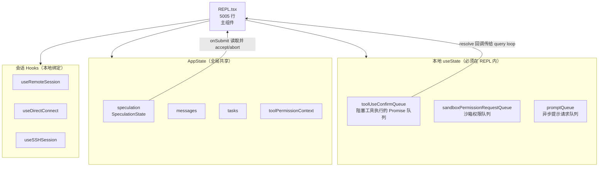
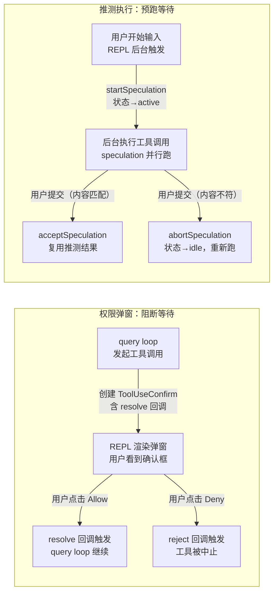

# 第 5 章：REPL 界面架构——5000 行组件的交互设计

> "把所有状态放在一个地方，不是因为懒，而是因为它们本来就属于一个地方。"

软件工程界流行一条建议：组件超过 300 行就该拆分。`src/screens/REPL.tsx` 有 5,005 行，是这条建议的五倍，而且**刻意不拆**。权限弹窗、消息列表、推测执行、远程会话、后台任务面板——所有涉及用户交互的状态全部汇聚在这一个文件里。

同一个架构决策在文件内部出现了两次，以不同形式解决同一类问题：`toolUseConfirmQueue` 用 Promise 回调阻塞工具执行直到用户确认，`SpeculationState` 用状态机预先执行后等待用户接受或放弃。两者都是**异步交互阻断（Async Interaction Gate）**模式——在工具调用或用户提交的关键路径上插入"人在回路"的等待点。

读完本章，我们将理解 5,005 行单文件组件背后的工程动机，以及"强内聚巨组件（Mega-Component）"模式的适用边界——什么时候应该拆分，什么时候合并反而更对。

---

## 问题：5005 行组件，为什么不拆？

`src/screens/REPL.tsx:572` 导出了应用的主组件：

```typescript
// src/screens/REPL.tsx:572
export function REPL({
  commands: initialCommands,
  debug,
  initialTools,
  initialMessages,
  // ...更多参数
```

**源码参考：** `src/screens/REPL.tsx:572`

单看这个签名，它的参数列表就已经很长——初始消息、初始工具、命令列表、调试模式……这反映了一个现实：REPL 组件需要在启动时接收整个 Agent 系统的初始状态。

但真正的耦合不在于参数，而在于组件运行期间需要访问的状态。`src/screens/REPL.tsx:618` 里有七行连续的 `useAppState` 调用：

```typescript
// src/screens/REPL.tsx:618-625
const toolPermissionContext = useAppState(s => s.toolPermissionContext);
const verbose = useAppState(s => s.verbose);
const mcp = useAppState(s => s.mcp);
const plugins = useAppState(s => s.plugins);
const agentDefinitions = useAppState(s => s.agentDefinitions);
const fileHistory = useAppState(s => s.fileHistory);
const initialMessage = useAppState(s => s.initialMessage);
```

**源码参考：** `src/screens/REPL.tsx:618`

这七个字段来自 `AppState`，它们之间没有直接的数据依赖，却都需要在同一个渲染上下文里被访问。如果把它们拆散到七个子组件，每个子组件 `useAppState` 自己需要的切片，表面上看是"职责分离"，但实际上只是**把耦合从组件内部移动到了组件树的协调层**——总复杂度不变，但追踪路径变长了。

更根本的原因在于本地状态的连动需求——但这个要等到看了两个源码实例之后才能完全理解。

**图 5-1：REPL.tsx 的状态与子系统分布**



*图注：REPL.tsx 持有三类状态：必须本地化的 Promise 队列（与渲染强耦合）、从 AppState 读取的全局共享状态、以及生命周期绑定到当前会话的 Hooks。这三类状态的共同点是：它们都需要在用户交互的关键路径上被协调——散落在不同文件里反而会让这条路径更难追踪。*

---

## 源码实例 1：权限弹窗——Promise 阻断工具执行

Claude Code 在执行工具调用之前，有时需要等待用户明确确认（详见第 15 章的权限系统）。这个"等待用户"的机制在 REPL.tsx 里用一个队列实现：

```typescript
// src/screens/REPL.tsx:1101-1109
const [toolUseConfirmQueue, setToolUseConfirmQueue] =
  useState<ToolUseConfirm[]>([]);
// Sticky footer JSX registered by permission request components
// (currently only ExitPlanModePermissionRequest). Renders in
// FullscreenLayout's `bottom` slot so response options stay visible
// while the user scrolls a long plan.
const [permissionStickyFooter, setPermissionStickyFooter] =
  useState<React.ReactNode | null>(null);
const [sandboxPermissionRequestQueue, setSandboxPermissionRequestQueue] =
  useState<Array<{
    hostPattern: NetworkHostPattern;
    resolvePromise: (allowConnection: boolean) => void;
  }>>();
```

**源码参考：** `src/screens/REPL.tsx:1101`

注意 `sandboxPermissionRequestQueue` 的类型：它包含一个 `resolvePromise` 回调。这不是普通的事件处理——这是一个 **Promise 门控（Promise Gate）** 设计：工具执行流程暂停，等待 REPL 渲染出确认弹窗，用户点击后 resolve 回调被调用，暂停的执行流程才继续。

这个机制为什么必须是 REPL 的本地状态，而不是放进 AppState？因为 `resolvePromise` 是一个函数——而 AppState 的类型约束（`DeepImmutable<...>`，见 `src/state/AppStateStore.ts:89`）不允许存储可变函数引用。REPL 的本地 `useState` 没有这个约束，是存放 Promise resolve 回调的天然位置。

`PermissionRequest` 组件在 `src/screens/REPL.tsx:54` 被导入：

```typescript
// src/screens/REPL.tsx:54
import { PermissionRequest, type ToolUseConfirm }
  from '../components/permissions/PermissionRequest.js';
```

**源码参考：** `src/screens/REPL.tsx:54`

`ToolUseConfirm` 类型里包含了 resolve/reject 回调——REPL 在渲染 `PermissionRequest` 组件时把这些回调传下去，用户操作触发回调，工具执行侧的 `await` 得到结果，整个异步流程因此被"人在回路"打断又续上。

### 三种远程会话 Hooks：同一回调接口，不同传输层

`src/screens/REPL.tsx:60-63` 导入了三个远程会话 Hooks：

```typescript
// src/screens/REPL.tsx:60-63
import { useRemoteSession } from '../hooks/useRemoteSession.js';
import { useDirectConnect } from '../hooks/useDirectConnect.js';
import { useSSHSession } from '../hooks/useSSHSession.js';
```

**源码参考：** `src/screens/REPL.tsx:60`

在 `src/screens/REPL.tsx:1389` 可以看到它们的调用：

```typescript
// src/screens/REPL.tsx:1389-1416（节选）
const remoteSession = useRemoteSession({
  config: remoteSessionConfig,
  setMessages,
  setToolUseConfirmQueue,   // ← 直接传入本地状态的 setter
  tools: combinedInitialTools,
  // ...
});
const directConnect = useDirectConnect({
  config: directConnectConfig,
  setMessages,
  setToolUseConfirmQueue,   // ← 同一个接口
  // ...
});
const sshRemote = useSSHSession({
  session: sshSession,
  setMessages,
  setToolUseConfirmQueue,   // ← 同一个接口，不同传输
  // ...
});
```

**源码参考：** `src/screens/REPL.tsx:1389`

三个 Hook 接受完全相同的回调接口：`setMessages`、`setToolUseConfirmQueue`。无论底层传输是 WebSocket、直连 API 还是 SSH 子进程，它们都通过同一套接口把权限请求注入到 REPL 的本地队列里。这正是**强内聚**的收益：所有传输层都依赖 REPL 提供的接口，而不是各自维护独立的权限弹窗状态。

---

## 源码实例 2（变体）：推测执行——从 idle 到 active 到 accept

如果说权限弹窗系统是"阻塞等待确认"，推测执行（Speculation）是同一个模式的镜像：**不等用户，先跑，再看是否接受**。

`src/state/AppStateStore.ts:58` 定义了 `SpeculationState`：

```typescript
// src/state/AppStateStore.ts:58-79
export type SpeculationState =
  | { status: 'idle' }
  | {
      status: 'active'
      id: string
      abort: () => void
      startTime: number
      messagesRef: { current: Message[] }
      writtenPathsRef: { current: Set<string> }
      boundary: CompletionBoundary | null
      suggestionLength: number
      toolUseCount: number
      // ...
    }

export const IDLE_SPECULATION_STATE: SpeculationState = { status: 'idle' }
```

**源码参考：** `src/state/AppStateStore.ts:58`

这是一个二态状态机：`idle`（默认）和 `active`（正在推测执行中）。当推测进入 `active` 状态时，`messagesRef` 和 `writtenPathsRef` 以可变引用形式存储推测过程中产生的消息和写入的文件——注意类型注释 "Mutable ref - avoids array spreading per message"——这是刻意绕过 `DeepImmutable` 约束的设计，因为推测过程是高频写入的，每次都深拷贝数组代价过高。

`src/services/PromptSuggestion/speculation.ts:402` 的 `startSpeculation` 发起推测：

```typescript
// src/services/PromptSuggestion/speculation.ts:402-413
export async function startSpeculation(
  suggestionText: string,
  context: REPLHookContext,
  setAppState: (f: (prev: AppState) => AppState) => void,
  isPipelined = false,
  cacheSafeParams?: CacheSafeParams,
): Promise<void> {
  if (!isSpeculationEnabled()) return
  // Abort any existing speculation before starting a new one
  abortSpeculation(setAppState)
  // ...
```

**源码参考：** `src/services/PromptSuggestion/speculation.ts:402`

当用户提交输入时，REPL 的 `onSubmit` 回调检查是否有待接受的推测：

```typescript
// src/screens/REPL.tsx:3142-3146
const onSubmit = useCallback(async (
  input: string,
  helpers: PromptInputHelpers,
  speculationAccept?: {
    state: ActiveSpeculationState;
    speculationSessionTimeSavedMs: number;
  }
) => {
```

**源码参考：** `src/screens/REPL.tsx:3142`

如果 `speculationAccept` 有值，意味着推测结果被接受——直接复用推测产生的消息，跳过完整的 API 调用。如果用户输入与推测内容不匹配，`abortSpeculation` 丢弃推测状态，系统退回 `idle`。

**图 5-2：推测执行状态机与权限弹窗的对比**



*图注：两种模式解决对称的问题。权限弹窗是"先暂停，等人"——工具执行被 Promise 阻塞，直到用户确认才继续。推测执行是"先跑，等确认"——工具在用户确认前就已经执行，用户提交时检查是否接受结果。两者都让人在流程的关键路径上有介入点。*

---

## 模式剖析：强内聚巨组件的两个实例

| 维度 | 权限弹窗（Promise 阻断） | 推测执行（乐观预跑） |
|------|------------------------|-------------------|
| **等待方向** | 暂停→等用户→继续 | 预跑→等用户→接受/丢弃 |
| **状态载体** | `toolUseConfirmQueue`（本地 useState） | `speculation`（AppState，因需全局共享） |
| **函数引用** | `resolvePromise` 存在本地队列 | `abort` 函数存在 AppStateStore 的 active state |
| **取消语义** | reject 回调 → 工具中止 | `abortSpeculation` → 状态回 idle，重新正常查询 |
| **关联源码** | `REPL.tsx:1101`，`REPL.tsx:54` | `AppStateStore.ts:58`，`speculation.ts:402` |

两个实例共享同一个骨架：在用户交互的关键路径上插入"等待点"，等待点的结果决定主流程继续还是回滚。这正是强内聚巨组件存在的理由——所有这些等待点都需要访问彼此的状态（推测执行需要知道是否有权限弹窗打开，权限弹窗需要知道是否在推测模式下），**把它们都放在 REPL.tsx 里，这条协调逻辑有一个清晰的位置**。

---

## 适用范围

| 场景 | 适用 | 理由 | 替代方案 |
|------|------|------|---------|
| 多个子系统需要共同协调用户的单次交互 | ✓ | 集中管理比跨组件通信更可追踪 | 全局事件总线（复杂度转移，不减少） |
| 本地状态包含不可序列化的函数（Promise 回调） | ✓ | 这类状态无法放入 Redux/Zustand，天然在组件里 | 无合理替代方案 |
| 组件树较浅（深度 < 3 层），props 传递不成问题 | △ | 可以，但 REPL 的复杂度已超出此范围 | 拆分 + Context |
| 子系统完全独立、互不感知 | ✗ | 此时合并没有好处，拆分更清晰 | 独立组件 |
| 团队较大（> 5 人同时修改同一文件） | ✗ | 单文件合并冲突频繁 | 拆分 + 共享 Context |

---

## 权衡与局限

**5005 行的可读性代价**：没有地图很难找到入口。`REPL.tsx` 里的 `onSubmit` 回调在第 3,142 行——如果不知道这个数字，靠搜索也能找到，但绝不是"直觉式可读"。这是强内聚的典型代价：**整体逻辑更简单，但局部定位更困难**。

**状态分布的双轨制**：本章揭示了 REPL 状态的双轨设计——Promise 回调放 `useState`，共享数据放 `AppState`。这条边界不是显式声明的，而是由 `AppState` 的 `DeepImmutable` 约束隐式决定的。新来的开发者如果不知道这个约束，可能会尝试把 `resolvePromise` 放进 AppState，得到类型错误后才明白为什么要用本地状态。这是"隐式约束"的典型缺点——规则存在，但没有文档。

**测试难度**：5,005 行单文件组件在单元测试时需要大量 mock——mock AppState、mock 三个远程会话 Hook、mock speculation 服务……测试设置的复杂度与组件的内聚程度正比。Claude Code 目前没有测试套件（这是重建版本的局限），但如果有，`REPL.tsx` 会是测试难度最高的文件之一。

---

## 与已知模式的对话

| 维度 | 强内聚巨组件 | 微前端（Micro Frontend） | React 组件拆分原则 |
|------|------------|------------------------|------------------|
| **哲学** | 强内聚优于任意拆分 | 独立部署、独立团队、松耦合 | 单一职责、可复用 |
| **适用规模** | 单一交互流程（CLI REPL） | 大型产品的独立模块（导航、支付、用户中心） | 通用 UI 组件（Button、Modal） |
| **状态共享** | 中心化（本地 useState + 全局 AppState） | 通过事件总线或约定接口 | Props drilling 或 Context |
| **代码体积** | 单文件大，但逻辑路径短 | 多仓库多文件，但任意一处都小 | 多文件适中，但协调逻辑散落 |

**与 GoF Facade 模式的对话**：`REPL.tsx` 是一个 Facade——它对外是一个 `<REPL />` 组件，对内协调了权限系统、推测执行、远程会话、消息队列……但 GoF 的 Facade 通常是薄封装，把复杂性委托给子系统。REPL.tsx 不一样：它**本身就是**那个复杂的协调层，没有委托，只有集中。这是"反 Facade"——不是为了简化接口，而是为了让协调逻辑有一个不可分割的家。

---

## 模式提炼

### 强内聚巨组件（Mega-Component）

**解决的问题**：多个子系统需要共同协调同一个用户交互流程，拆分后协调逻辑散落各处更难追踪。

**核心做法**：把所有强耦合的状态和逻辑集中在一个组件文件里，本地useState存不可序列化状态，AppState存共享状态。

**前置条件**：子系统之间存在真实的状态耦合（需要互相感知）；团队规模允许单文件工作流（合并冲突可控）；组件有清晰的单一职责边界（CLI REPL 是一个，不是多个）。

**源码证据**：src/screens/REPL.tsx:572，src/screens/REPL.tsx:1101，src/screens/REPL.tsx:1389

---

### 异步交互阻断（Async Interaction Gate）

**解决的问题**：Agent异步执行流程需要在关键节点等待用户决策，但UI层和执行层需要同步机制。

**核心做法**：在本地state里维护含resolvePromise/reject回调的队列，REPL渲染UI让用户操作触发回调；对称地，推测执行先跑再看是否接受。

**前置条件**：执行流程是异步的（async/await），UI 层和执行层在同一进程内（共享内存），不可序列化的函数引用需要存放在本地 state 而非全局 store。

**源码证据**：src/screens/REPL.tsx:1101，src/state/AppStateStore.ts:58，src/services/PromptSuggestion/speculation.ts:402

---

## 你能做什么

- **在 CLI 工具里，先问"这些状态需要互相感知吗"，再决定拆不拆**：如果两段逻辑都需要读取或修改对方的状态，强行拆分只是把耦合从代码内转移到了组件间通信
- **用 `DeepImmutable` 约束 AppState，把不可序列化的状态（Promise 回调、可变 ref）自然地隔离到本地 useState**：类型系统的约束比文档更可靠
- **为"等待用户决策"的场景设计 Promise 门控**：在队列项里存 `resolvePromise` 和 `reject`，渲染 UI，用户操作触发回调——这比轮询全局状态更精确，也不会有"多余渲染"问题
- **把推测执行理解为"带有 undo 的乐观 UI"**：`SpeculationState` 的 `active` 状态对应乐观更新，`abortSpeculation` 对应 undo——只不过这里 undo 的是一次 Agent 查询而不是一次 HTTP 请求
- **在 Agent CLI 中使用三种传输 Hook 统一接口（WebSocket / SSH / DirectConnect）**：参考 REPL.tsx:1389 的模式，让三种传输都接受相同的回调签名 `{ setMessages, setToolUseConfirmQueue }`，上层组件不需要关心底层传输差异
- **阅读 `src/state/AppStateStore.ts:58` 的 SpeculationState 类型**：注意 `messagesRef: { current: Message[] }` 的设计——用可变 ref 存放高频写入的数据，避免 `DeepImmutable` 包裹带来的深拷贝开销，这是有意绕过类型约束的特例，值得学习

---

*下一章追踪用户输入的第一个毫秒：`processUserInput` 如何在 REPL 接收到输入后，立即决定它是斜杠命令、普通消息还是 Bash 快捷方式——"路由决策先于任何业务逻辑"这一原则在源码里的具体体现（详见第 6 章）。*
