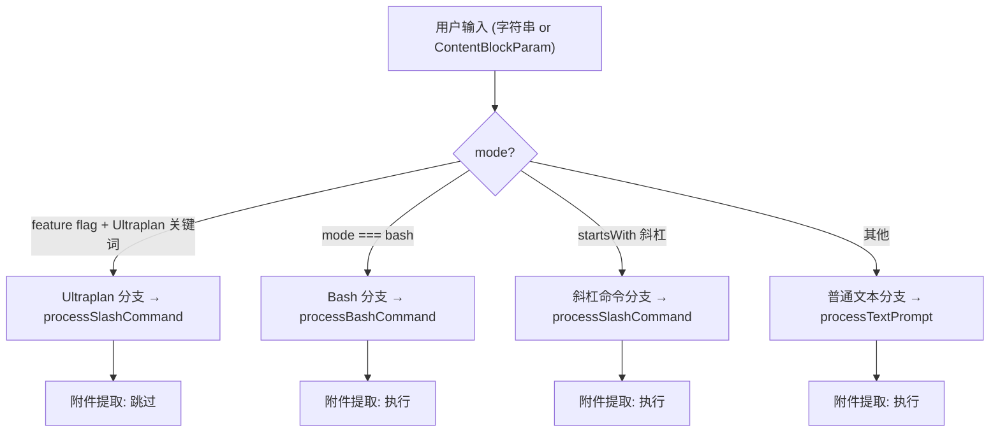
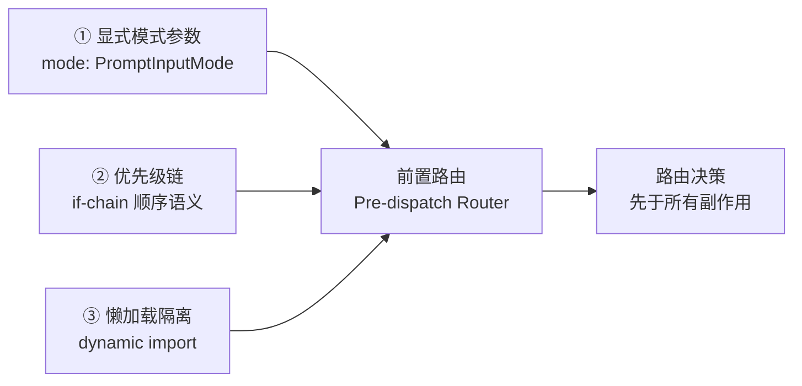
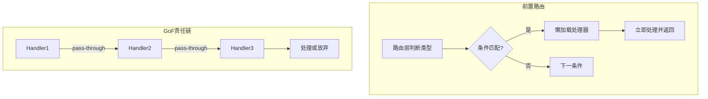

# 第 6 章：用户输入分流——`processUserInput` 的路由决策树

> "在副作用执行之前就完成分流，是这套路由的设计宣言。"
> （原文："Runs before attachment extraction so this path matches the slash-command path below."）

Claude Code 的路由代码里藏着一个令人意外的注释：一段负责「把消息派发给处理器」的代码，却在中间特别强调了 React 的批量渲染——「React batches both into one render, no flash」。路由函数为什么要操心界面闪烁？更奇怪的是，这并不是 bug，而是故意的——有一整条分支被强制排在附件提取逻辑之前，只为和其他分支保持一致的 React 渲染时序。

这个反常现象指向一个更深的设计原则：**副作用必须在路由决策完成之后才能执行**。正是这个原则，让 `processUserInput` 呈现出一种在代码库中反复出现的结构——先判断输入类型，再懒加载处理器，期间不触碰任何业务状态。本章将这个结构命名为「前置路由（Pre-dispatch Router）」模式。

识别它，你就能在自己的 Agent 系统中构建可测试、无副作用的多类型输入分流器。

---

## 问题：Agent 输入的二义性困境

当一条字符串到达 Agent 系统的入口，它可能是任何东西。`/help` 可以是斜杠命令，也可以是普通问题（当用户关闭了斜杠命令功能时）；同一条 `npm install` 在 `bash` 模式下是要直接执行的 shell 命令，在 `prompt` 模式下则是发给 AI 模型的普通消息。

这个「二义性」问题有一个直觉上的解法：在各处理器内部判断。处理斜杠命令的函数自己检查当前 mode，处理 bash 命令的函数自己检查内容格式——每个处理器都做自己认为需要的判断。

**这种做法的问题是 N×M 爆炸**。假设有 4 种 mode（'bash' | 'prompt' | 'orphaned-permission' | 'task-notification'，定义于 `src/types/textInputTypes.ts:265`）和 4 个处理器，理论上就有 16 个判断组合需要维护，而且每次新增一个 mode 或处理器，都要重新审查所有组合点。

更深层的问题是**副作用污染路由逻辑**。如果路由判断与附件提取、权限检查、状态变更混在一起，一旦路由判断发生在副作用之后，就意味着：即使最终要走的是 Bash 分支，系统也已经花时间提取了不需要的图片附件、执行了不必要的权限检查。

Claude Code 的解法是把路由决策提升到函数入口，在任何业务逻辑执行之前完成。这在 `processUserInputBase`（`src/utils/processUserInput/processUserInput.ts:281`）的结构中体现得非常清楚。

---

## 源码实例 1：四条分支的实际路由

我们直接进入路由函数的核心部分。`processUserInput`（`src/utils/processUserInput/processUserInput.ts:85`）是对外暴露的函数，它接收输入后立即委托给内部的 `processUserInputBase`（第 281 行）执行路由决策。

在 `processUserInputBase` 的中段，我们能看到四条分支按优先级顺序排列：

**图 6-1：processUserInput 路由决策树**



注意图中 Ultraplan 分支的特殊性：它是唯一一条在附件提取之前就提前返回的路径（原因见源码注释）。

以下是四个分支的判断条件代码。我们关注的不是每个处理器做了什么，而是**每个 `if` 条件本身的设计**：

```typescript
// src/utils/processUserInput/processUserInput.ts:460-578（精简版，仅保留判断条件和分支入口）

// 分支 1：Ultraplan 特殊路径（优先级最高，附件提取前执行）
// 注释原文："Runs before attachment extraction so this path matches the slash-command
// path below (no await between setUserInputOnProcessing and setAppState —
// React batches both into one render, no flash)."
if (
  feature('ULTRAPLAN') &&
  mode === 'prompt' &&
  !context.options.isNonInteractiveSession &&
  inputString !== null &&
  !effectiveSkipSlash &&
  !inputString.startsWith('/') &&
  !context.getAppState().ultraplanSessionUrl &&
  !context.getAppState().ultraplanLaunching &&
  hasUltraplanKeyword(preExpansionInput ?? inputString)
) {
  // ... 懒加载 processSlashCommand，以 '/ultraplan ...' 调用
}

// [附件提取逻辑在此处，约 20 行]

// 分支 2：Bash 命令（依赖 mode，不检查内容）
if (inputString !== null && mode === 'bash') {
  const { processBashCommand } = await import('./processBashCommand.js')
  // ...
}

// 分支 3：斜杠命令（依赖内容前缀 + mode 兜底）
if (
  inputString !== null &&
  !effectiveSkipSlash &&
  inputString.startsWith('/')
) {
  const { processSlashCommand } = await import('./processSlashCommand.js')
  // ...
}

// 分支 4：普通文本（兜底，无条件）
return addImageMetadataMessage(
  processTextPrompt(normalizedInput, ...),
  imageMetadataTexts,
)
```

**源码参考：** `src/utils/processUserInput/processUserInput.ts:460-578`

这段代码值得仔细读一遍。四个分支之所以以这个顺序排列，背后有具体的工程理由：

**Ultraplan 为什么排第一？** 这是一条"早退路径"（early return）。源码注释说得很清楚：它必须在附件提取之前执行，这样它和斜杠命令路径的 React 渲染行为完全一致（"React batches both into one render, no flash"——React 将两次状态更新合并为一次渲染，避免界面闪烁）。如果把它放到附件提取之后，等待附件的 `await` 会中断合批，产生可见的界面抖动。

**Bash 为什么用 `mode === 'bash'` 而非内容判断？** 这是参数化 mode 模式的核心体现。bash 命令在内容上看起来就是普通字符串，无法通过内容特征区分——必须靠外部传入的 mode 参数明确声明。这个设计把"这是什么类型的输入"的判断权交给了调用方，而不是让处理函数自己猜测。

**斜杠命令为什么需要双重条件（`startsWith('/') && !effectiveSkipSlash`）？** `effectiveSkipSlash` 来自 `skipSlashCommands` 参数（函数签名第 130 行附近），当输入来自远程桥接（CCR 客户端）时为 `true`。这意味着同样以 `/` 开头的输入，在本地运行时走斜杠命令路径，在远程传入时走普通文本路径——**调用方通过参数而非内容格式声明了语义**。

**普通文本为什么不需要条件？** 因为它是兜底路径（fallthrough）——所有无法匹配前三条的输入都会到达这里。这符合"穷举分支"的设计哲学：路由函数覆盖所有可能的输入类型，不存在"未处理的类型"。

---

## 源码实例 2（变体）：懒加载处理器的架构含义

如果仔细看上面的代码，会注意到每个分支的处理器不是在文件顶部 `import`，而是在分支内部用 `await import(...)` 动态加载：

```typescript
// 斜杠命令分支内部：
const { processSlashCommand } = await import('./processSlashCommand.js')

// Bash 命令分支内部：
const { processBashCommand } = await import('./processBashCommand.js')
```

**源码参考：** `src/utils/processUserInput/processUserInput.ts:480, 518`

这不是 JavaScript 的懒加载优化技巧——在这种规模的代码库里，这几个模块的加载时间可以忽略不计。**真正的原因是架构隔离**。

如果在文件顶部 `static import` 所有处理器，`processUserInput.ts` 就需要在模块初始化时就加载 `processSlashCommand`、`processBashCommand`、`processTextPrompt` 的全部依赖——包括这些处理器可能在模块初始化时执行的副作用（例如注册命令、初始化状态）。更微妙的是，一旦 `processUserInput.ts` 的编译单元包含了所有处理器的 `import`，打包工具（如 bun）就可能把这些模块全部打进同一个 bundle，失去了代码分割的机会。

`dynamic import` 的语义是**按需加载**：只有当代码实际走到这个分支时，才去加载对应的处理器模块。路由层对处理器的内部实现一无所知——它只知道处理器的调用签名（`processSlashCommand(inputString, ...)` 接受什么参数、返回什么结果）。

这实现了路由层与处理层的**物理隔离（Physical Isolation）**：

**图 6-2：static import vs dynamic import 的架构差异**

| 维度 | static import（路由层顶部导入）| dynamic import（分支内导入）|
|------|----------------------------|-----------------------------|
| 处理器加载时机 | 模块初始化时（无论走哪条分支） | 实际执行到该分支时 |
| 路由层对处理器的依赖 | 编译时依赖（影响打包和测试） | 运行时依赖（按需引入） |
| 处理器初始化副作用 | 随路由层初始化提前触发 | 在对应分支内才触发 |
| 新增处理器的影响范围 | 需修改路由层顶部 import | 只在新分支内添加，路由层主结构不变 |

**结论**：`dynamic import` 在这里不是性能优化，而是一条**架构边界声明**：路由层宣告"我不依赖处理器的存在"。

这一模式在代码库的另一处得到印证。`src/main.tsx` 是 CLI 入口文件，其命令路由中同样使用了"判断先于加载"的结构——先检查命令行参数，再用 `dynamic import` 按需加载对应模块：

```typescript
// src/main.tsx:615-622（CLI 命令路由，不同文件中的相同模式）
if (ccIdx !== -1 && _pendingConnect) {
  const {
    parseConnectUrl
  } = await import('./server/parseConnectUrl.js')  // 仅当命中 cc:// URL 时才加载
  const parsed = parseConnectUrl(ccUrl)
  // ...
}
```

**源码参考：** `src/main.tsx:619`

两处对比揭示了这个模式的跨层次复用性：在 `processUserInput.ts` 中，路由判断发生在**消息处理层**（根据消息类型选择处理器）；在 `main.tsx` 中，路由判断发生在 **CLI 入口层**（根据命令行参数选择子命令模块）。层次不同，模式相同——"先判断，再按需加载"在系统的多个抽象层次上重复出现。

---

## 模式剖析：前置路由（Pre-dispatch Router）

把前面看到的两个源码实例放在一起，我们能命名一个在系统中反复出现的模式：

**前置路由（Pre-dispatch Router）** 的核心做法是将输入类型判断提升到函数入口的最顶层，在所有副作用（网络请求、文件读写、状态变更）执行之前完成路由决策，然后懒加载对应的处理器。

这个模式有三个关键组成部分：

**组成部分 1：显式的模式参数（Explicit Mode Parameter）**
路由函数接受 `mode: PromptInputMode` 作为参数，而非从全局状态推断。`PromptInputMode` 的 4 个合法值（'bash' | 'prompt' | 'orphaned-permission' | 'task-notification'）在类型定义时就穷举了所有可能的输入语义（`src/types/textInputTypes.ts:265`）。调用方明确声明"这条输入是什么类型"，路由层不猜测。

**组成部分 2：优先级链（Priority Chain）**
四条分支以明确的优先级顺序排列。当多条分支的判断条件理论上可能同时满足时（例如一条以 `/` 开头的字符串，同时满足"以 `/` 开头"和"mode === 'prompt'"），优先级链保证行为确定——先匹配到的分支优先处理，后续分支不再执行。这与 if-else 链的语义完全一致，但比 strategy map 更清晰地表达了优先级意图。

**组成部分 3：懒加载隔离（Lazy-load Isolation）**
路由层通过 `dynamic import` 而非 static import 引用处理器。路由层不需要知道处理器的任何实现细节——只需要知道处理器的调用签名。新增一种处理器时，路由层主结构（判断条件链）保持不变，只在适当位置插入一个新的 if 分支。

**图 6-3：前置路由模式的三个核心组成部分**



三个组成部分缺一不可：只有显式参数（①）才能避免从全局状态推断类型；只有明确的优先级链（②）才能在条件交叉时保证行为确定；只有懒加载（③）才能切断路由层对处理器的编译时依赖。

---

## 适用范围

| 场景 | 适用性 | 理由 | 替代方案 |
|------|--------|------|---------|
| 输入有多种明确语义类型（命令/消息/模式）| ✓ | 类型可以静态区分，不需要执行处理器才知道类型 | N/A |
| 各类型处理路径完全互斥（走了A就不走B）| ✓ | if-chain 语义清晰，不需要组合逻辑 | N/A |
| 分支数量 ≤ 6 | ✓ | if-chain 在 6 条以内可读性高 | 超过后改用 strategy map |
| 类型判断依赖外部状态（如数据库查询）| ✗ | 路由层引入 I/O 副作用，破坏"前置无副作用"原则 | Command Bus 或 Strategy Pattern |
| 输入类型之间有共享的前置步骤 | ✗ | 需要在路由前执行共享逻辑，考虑 Template Method | Template Method + 子类路由 |
| 需要运行时动态注册新的输入类型 | ✗ | if-chain 是静态的，添加新类型需改代码 | 插件注册表（详见第 41 章）|

---

## 权衡与局限

**优先级链的顺序是 breaking change 的来源**。上面看到的四条分支，它们的顺序不是随意的——Ultraplan 排第一是因为它需要在附件提取之前执行，这是 React 批量渲染的要求。如果将来某个开发者把 Bash 分支调整到 Ultraplan 分支之前，在某些边界场景下（mode==='bash' 的输入正好满足 Ultraplan 的所有其他条件），行为会静默改变。**优先级链的顺序变更是隐性的不兼容改动**，在代码审查时需要格外注意。

**dynamic import 引入了异步开销**。`await import(...)` 在 Node.js/Bun 环境下的实际耗时通常是微秒级（模块已经在内存中时），但在测试环境或 CI 中可能产生略高的首次加载延迟。如果 `processUserInput` 需要在高频循环中调用（例如批处理场景），应该评估这个开销是否可接受。在 Claude Code 的实际使用场景中，它是用户按下 Enter 触发的，人类操作频率远低于微秒级，所以这个开销完全可以接受。

**四种 mode 之外的输入如何处理？** `PromptInputMode` 目前有 4 个值，其中 'orphaned-permission' 和 'task-notification' 在路由逻辑中没有专属分支——它们会落入普通文本的兜底路径（processTextPrompt）。这是一个潜在的扩展点：如果未来需要为这两种 mode 增加专属处理逻辑，需要在 if-chain 中添加新分支，同时评估优先级位置。

---

## 与已知模式的对话

**图 6-4：前置路由与 GoF 责任链、策略模式的对比**



上图直观展示了两个模式的核心差异：前置路由是中心化的分流决策，命中即返回，处理器之间不知道彼此；GoF 责任链是去中心化的请求传递，每个处理器可以决定传递或接管。

**这个模式最接近 GoF 责任链（Chain of Responsibility）**。两者的相同点在于：请求沿着一个有序的处理器链传递，直到某个处理器接受并处理它。

不同点有两个：

**第一，GoF 责任链允许"传递"（pass-through）**。链中的每个处理器可以选择处理、或者转给下一个处理器。`processUserInputBase` 的分支是互斥的——一旦命中某个分支，就立即返回，不传递给后续分支。这不是职责链，而是**优先级路由**：谁先匹配谁处理，处理完直接返回。

**第二，GoF 责任链中处理器互相知道彼此的存在**（通过 `next` 引用）。`processUserInputBase` 中，每个处理器完全不知道其他处理器的存在——它们通过 `dynamic import` 独立加载，路由层是唯一知道所有处理器的中心点。这是一种更松散的耦合，更接近 **Strategy Pattern（策略模式）** 的精神，只是这里的"策略选择"发生在调用时而非构造时。

如果用 GoF 的语言来说，`processUserInput` 更像是一个**工厂方法**（Factory Method）的变体：根据 mode 和内容特征，运行时决定调用哪个处理器——而且这个决定不可回退（已经返回了）。

---

## 模式提炼

### 前置路由（Pre-dispatch Router）

**解决的问题**：多类型输入在执行业务逻辑前需要确定处理路径，副作用不能污染路由决策，路由决策不能重复在各处理器内部执行。

**核心做法**：将类型判断提升到函数入口，以参数（mode）和内容特征（startsWith）为依据建立优先级链，在每条分支内用 `dynamic import` 懒加载对应处理器。

**前置条件**：类型判断逻辑无 I/O 副作用；处理路径互斥；优先级关系在编写时已知。

**源码证据**：`src/utils/processUserInput/processUserInput.ts:460-578` — `processUserInputBase` 的四分支路由链。

---

### 懒加载隔离（Lazy-load Isolation）

**解决的问题**：路由层引用了处理器，如果是 static import，处理器的初始化副作用会污染路由层的加载时序；新增处理器时也需要修改路由层顶部的 import 列表。

**核心做法**：在路由分支内用 `dynamic import()` 而非文件顶部 `import` 加载处理器，路由层只知道处理器的调用签名，不知道实现细节。

**前置条件**：处理器是独立模块，加载本身无副作用；运行时允许异步动态加载。

**源码证据**：`src/utils/processUserInput/processUserInput.ts:480, 518` — 斜杠命令和 Bash 命令分支内的 `await import('./processSlashCommand.js')` 和 `await import('./processBashCommand.js')`。

---

### 参数化模式分流（Parameterized Mode Dispatch）

**解决的问题**：同一内容字符串在不同模式下语义不同，路由层不能通过内容猜测模式，必须依赖外部明确声明。

**核心做法**：将 mode 作为显式参数传入分流函数（`mode: PromptInputMode`），而非从全局状态或内容格式推断；`PromptInputMode` 类型枚举所有合法值，TypeScript 编译器保证调用方不能传入非法值。

**前置条件**：输入的模式在调用方已知；不同模式下的处理路径差异足够大，值得用参数显式区分。

**源码证据**：`src/utils/processUserInput/processUserInput.ts:85`（函数签名中的 `mode: PromptInputMode`）和 `src/types/textInputTypes.ts:265`（`PromptInputMode` 类型定义：`'bash' | 'prompt' | 'orphaned-permission' | 'task-notification'`）。

---

## 你能做什么

- **将输入类型判断提升到统一入口函数**。在你的 Agent 系统中，如果处理函数内部有大量 `if (mode === ...)` 判断，考虑把这些判断上移到调用点，在分流前决定走哪条路径。

- **用显式 mode 参数替代从全局状态推断输入模式**。全局状态依赖让路由函数难以测试（测试时需要设置全局状态）；显式参数让单元测试只需要传入不同的 mode 值即可覆盖所有分支。

- **为每种输入类型编写独立的处理器模块，通过 dynamic import 在路由时懒加载**。这确保了路由层和处理层的物理隔离——添加一种新输入类型只需要新增一个处理器模块和一条 if 分支，不需要修改现有处理器。

- **当分支数超过 6 条时，考虑将 if-chain 重构为 strategy map**。Map 的优势在于可以运行时注册新处理器（`handlers.set('newMode', newHandler)`），而 if-chain 是静态的。6 条是一个经验阈值：低于这个数量，if-chain 的优先级语义比 map 更清晰；超过后维护成本开始超过 map 的实现成本。

- **在路由函数的单元测试中，只验证路由决策，不测试业务逻辑**。测试 `processUserInput` 时，mock 掉 `processBashCommand`、`processSlashCommand` 等处理器（只验证它们被正确调用），将处理器的业务逻辑测试独立到各处理器自己的测试文件中。

- **避免在路由层执行任何 I/O 或状态变更**。一旦路由函数包含 `await dbQuery(...)`，它就不再是"前置路由"，而变成了"带副作用的路由"——测试难度指数级上升，且路由顺序变更会产生难以预测的副作用。

---

下一章（第 7 章）将深入斜杠命令系统的内部——当 `processSlashCommand` 收到一条以 `/` 开头的输入时，103 个命令如何注册、加载和执行。
