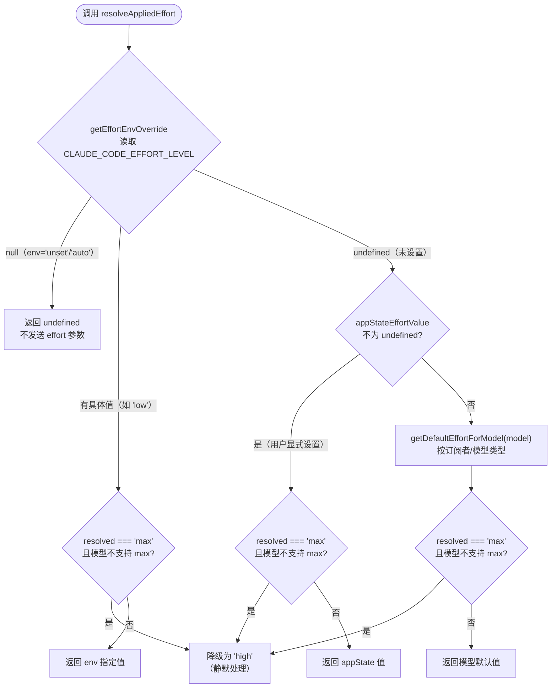
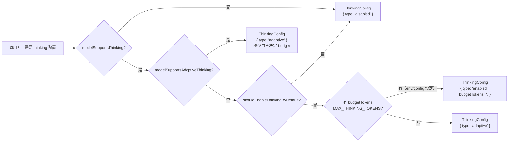
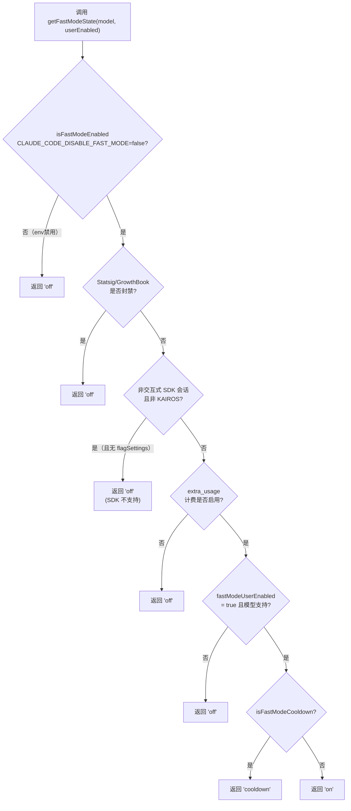
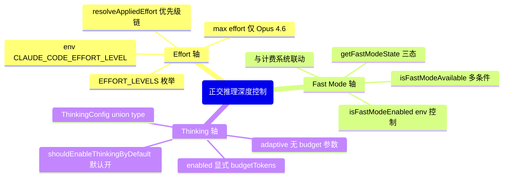
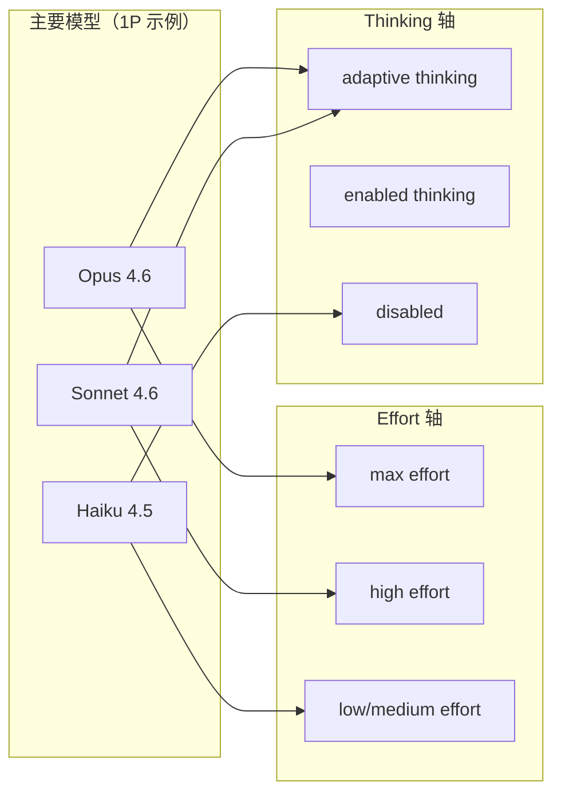

# 第 7 章：Effort、Fast Mode 与 Thinking——推理深度控制的三轴

> "能力可以是参数，而不必是常量。"

一个 AI Agent 系统的推理深度并不是单一旋钮。想象你需要三种不同的控制：在批处理夜间作业中强制低成本（关小 effort 旋钮）；在用户等待的交互场景中追求最低延迟（打开 fast mode）；在处理复杂架构分析时开启深度推理（给 thinking 分配预算）。如果这三个控制互相耦合——比如"低延迟"就意味着"浅推理"——你将永远无法同时满足所有场景的需求。

Claude Code 的代码库里有一个重复出现的解决方案：**正交推理深度控制（Orthogonal Reasoning Depth Control）**——三轴各自独立定义，拥有独立的能力检测和优先级覆盖链，互不干扰地组合。

读完本章，你能理解三轴控制背后的类型设计和优先级逻辑，并在自己的 Agent 系统中设计同样正交的推理深度控制机制。

---

## 7.1 问题：推理深度的多维困境

多模型 Agent 的推理深度调控面临一个不直观的挑战：**"思考多深"和"响应多快"并不是同一个维度的反义词**。

以下三个控制需求在概念上完全正交：

**表 7-1：三轴推理深度控制对比**

| 控制轴 | 主文件 | 核心类型 | 控制的是什么 | 能力检测函数 |
|-------|--------|---------|-----------|------------|
| Effort 级别 | `effort.ts`（329 行） | `EffortLevel = 'low'\|'medium'\|'high'\|'max'` | API 推理计算量（token budget 风格参数） | `modelSupportsEffort()` |
| Fast Mode | `fastMode.ts` | `'off'\|'cooldown'\|'on'` | 网络/计费优化，降低端到端延迟 | `isFastModeSupportedByModel()` |
| Thinking 预算 | `thinking.ts`（162 行） | `ThinkingConfig`（union type） | 扩展推理（extended thinking）的 token 分配 | `modelSupportsThinking()` |

三轴正交意味着可以独立组合：高 effort + thinking 启用（深度慢思考）、低 effort + fast mode（快速浅响应）、高 effort + fast mode（快速深响应）都是合法的配置。**三轴控制的每个轴有自己的文件、自己的类型定义、自己的优先级覆盖链**——这是正交性的代码体现。

正交设计的代价是每个轴都需要独立维护。我们先看最典型的一轴——Effort——来理解优先级链的设计。

---

## 7.2 源码实例 1：resolveAppliedEffort 的三层优先级链

Effort 轴的核心是 `EFFORT_LEVELS` 和 `resolveAppliedEffort`。先看类型定义：

```typescript
// src/utils/effort.ts:13-19
export const EFFORT_LEVELS = [
  'low',
  'medium',
  'high',
  'max',
] as const satisfies readonly EffortLevel[]

export type EffortValue = EffortLevel | number
```

**源码参考：** `src/utils/effort.ts:13-19`

四个级别加上一个数值类型构成了 effort 的值空间。`as const satisfies` 是 TypeScript 4.9 的新写法：`as const` 确保推导出精确的字面量联合类型而非 `string[]`，`satisfies` 在不改变推导类型的前提下检查类型兼容性。这个写法使得 `isEffortLevel('medium')` 这样的类型守卫可以正确工作。

值得注意的是：**`EffortValue = EffortLevel | number`** 而非仅仅是 `EffortLevel`。数值型 effort 允许传入比枚举更细粒度的数字（可能是 API 内部实现的数值化 effort）。但对于普通调用，枚举字符串是标准接口。

现在看决策核心——`resolveAppliedEffort`（line 152）的优先级链注释：

```typescript
// src/utils/effort.ts:144-165（含注释）
// 发送给 API 的 effort 值的完整优先级链：
//   CLAUDE_CODE_EFFORT_LEVEL 环境变量 → appState.effortValue → 模型默认值
//
// 当环境变量设为 'unset' 或 'auto' 时，返回 undefined（不发送 effort 参数）。
//（原文："Resolve the effort value that will actually be sent to the API for a given
//   model, following the full precedence chain:
//     env CLAUDE_CODE_EFFORT_LEVEL → appState.effortValue → model default
//   Returns undefined when no effort parameter should be sent (env set to
//   'unset', or no default exists for the model)."）
export function resolveAppliedEffort(
  model: string,
  appStateEffortValue: EffortValue | undefined,
): EffortValue | undefined {
  const envOverride = getEffortEnvOverride()
  if (envOverride === null) {
    return undefined  // 'unset'/'auto' → 不发送 effort 参数
  }
  const resolved =
    envOverride ?? appStateEffortValue ?? getDefaultEffortForModel(model)
  // API 拒绝非 Opus 4.6 模型的 'max' effort —— 降级为 'high'
  // （原文："API rejects 'max' on non-Opus-4.6 models — downgrade to 'high'."）
  if (resolved === 'max' && !modelSupportsMaxEffort(model)) {
    return 'high'
  }
  return resolved
}
```

**源码参考：** `src/utils/effort.ts:152-167`

这段代码里有两个值得深挖的设计细节。

**第一：NULL case 的语义区分**。`getEffortEnvOverride()` 可能返回三种值：`undefined`（没有设置 env var）、`null`（设置为 'unset' 或 'auto'）、具体值。当返回 `null` 时，`resolveAppliedEffort` 直接返回 `undefined`，表示"不要发送 effort 参数"。这与返回 'high'（发送 effort=high）语义完全不同——前者是"不干预，让 API 用自己的默认值"，后者是"显式告诉 API 用 high"。这是一个精确的三态设计：**明确设定值 / 明确取消 / 未设定（继续向下查找）**。

**第二：max effort 的隐式降级**。`max` 只有 Opus 4.6 支持（`modelSupportsMaxEffort` 检查），如果用户对非 Opus 4.6 模型设置了 `max` effort，系统不报错，而是静默降级到 `high`。注释直接说"API rejects 'max' on non-Opus-4.6 models"——这是防御性降级，保护调用方不因模型升级/降级而产生 API 错误。

**图 7-1：resolveAppliedEffort 三层优先级决策树**



注意图中每个分支都有相同的 max 降级检查——这不是冗余，而是确保无论从哪一层取值都经过安全过滤。

---

## 7.3 源码实例 2（变体）：ThinkingConfig 的类型化联合状态

Effort 用了枚举字符串，Thinking 选择了完全不同的类型表达方式。原因在于 thinking 有三种语义不同的状态，且其中一种需要携带额外参数：

```typescript
// src/utils/thinking.ts:10-13
export type ThinkingConfig =
  | { type: 'adaptive' }
  | { type: 'enabled'; budgetTokens: number }
  | { type: 'disabled' }
```

**源码参考：** `src/utils/thinking.ts:10-13`

这个 union type 的设计揭示了 thinking 的三种模式：`adaptive` 让模型自主决定思考深度（不预设 `budgetTokens`）；`enabled` 显式分配 `budgetTokens` 个 token 给推理过程；`disabled` 完全关闭扩展推理。

**为什么不用 boolean？** `enabled: boolean` 表达不了 `adaptive` 状态（既不是固定 budget 的 enabled，也不是 disabled），也携带不了 `budgetTokens` 数值。如果用 `{ enabled: boolean, budgetTokens?: number }` 表达，会出现 `enabled: true, budgetTokens: undefined`（adaptive）和 `enabled: true, budgetTokens: 1000`（enabled）两种形态，但类型系统无法强制区分这两种情况。**Union type 使每种状态的类型约束精确——`enabled` 状态必须有 `budgetTokens`，`adaptive` 状态不能有 `budgetTokens`**。

这与 Effort 的枚举设计形成了有意思的对比：

| 维度 | Effort 设计 | Thinking 设计 |
|------|------------|--------------|
| 类型表达 | 枚举字符串 + 数值（`EffortLevel \| number`） | Union type（每态可携带不同字段） |
| 为什么选这种 | 4 个状态权重相同，无附加参数 | 状态间的字段结构不同 |
| TypeScript 优势 | 字面量类型，可运行时检查 | 穷举判断，编译器辅助 |

Thinking 的默认行为由 `shouldEnableThinkingByDefault()` 决定（line 146）：

```typescript
// src/utils/thinking.ts:146-162
export function shouldEnableThinkingByDefault(): boolean {
  if (process.env.MAX_THINKING_TOKENS) {
    return parseInt(process.env.MAX_THINKING_TOKENS, 10) > 0
  }

  const { settings } = getSettingsWithErrors()
  if (settings.alwaysThinkingEnabled === false) {
    return false
  }

  // 除非显式禁用，否则默认启用 thinking
  // （原文："Enable thinking by default unless explicitly disabled."）
  return true
}
```

**源码参考：** `src/utils/thinking.ts:146-162`

**Thinking 默认是开启的**——除非 `MAX_THINKING_TOKENS=0` 或 `settings.alwaysThinkingEnabled === false` 显式关闭。这与 Effort 不同（Effort 默认不发送参数，除非模型有特定默认值）。设计逻辑是：thinking 对模型质量有显著提升，应该默认开启，用户主动关闭才不用。


除了全局默认开关，thinking 还有另一条触发路径——用户在 prompt 中输入 "ultrathink" 关键词可显式请求深度推理：

```typescript
// src/utils/thinking.ts:27-30
/**
 * 检查文本中是否包含 "ultrathink" 关键词。
 *（原文："Check if text contains the 'ultrathink' keyword."）
 */
export function hasUltrathinkKeyword(text: string): boolean {
  return /\bultrathink\b/i.test(text)
}
```

**源码参考：** `src/utils/thinking.ts:29`

`hasUltrathinkKeyword` 是一个单行函数——词边界正则 `\b` 确保 "ultrathink" 是独立单词（而非 "ultrathinking" 的子串），大小写不敏感。这个"魔法词"入口让用户无需修改配置，只需在 prompt 里加上 "ultrathink" 即可告诉 Claude Code："这次任务请深入推理"。两种触发路径形成了 thinking 的完整入口：**系统级**（`shouldEnableThinkingByDefault` 默认全开）和**用户级**（`hasUltrathinkKeyword` 按需激活）。

但能否实际启用 thinking，还需要通过 `modelSupportsThinking()` 的能力检测（line 90）：

```typescript
// src/utils/thinking.ts:90-110（精简版）
// 1P 和 Foundry：所有 Claude 4+ 模型支持 thinking（含 Haiku 4.5）
// 3P（Bedrock/Vertex）：只有 Opus 4+ 和 Sonnet 4+ 支持
export function modelSupportsThinking(model: string): boolean {
  // ...3P 覆盖检查...
  const canonical = getCanonicalName(model)
  const provider = getAPIProvider()
  if (provider === 'foundry' || provider === 'firstParty') {
    return !canonical.includes('claude-3-')  // Claude 4+ 全部支持
  }
  return canonical.includes('sonnet-4') || canonical.includes('opus-4')  // 3P 限制
}
```

**源码参考：** `src/utils/thinking.ts:90-110`

1P 和 Foundry 的检测逻辑是**排除式**（排除 claude-3-\* 即可），而 3P 是**包含式**（明确列出支持的模型）。这个差异体现了 1P 的快速迭代策略：新 Claude 4+ 模型默认支持 thinking，不需要每次发布都手动加入白名单；而 3P 平台（Bedrock、Vertex）的模型可用性有独立的发布节奏，必须保守地维护允许列表。

**图 7-2：ThinkingConfig 类型结构与路由**



---

## 7.4 模式剖析：正交推理深度控制（Orthogonal Reasoning Depth Control）

现在提炼三轴正交设计背后的核心模式。

### 模式命名框

**正交推理深度控制（Orthogonal Reasoning Depth Control）**

**解决的问题**：Agent 系统需要独立控制推理的计算量（effort）、响应延迟（fast mode）和扩展推理深度（thinking），三者若耦合则无法精细调优。

**核心做法**：三轴各自独立定义类型（`EffortLevel` 枚举 / `'off'|'cooldown'|'on'` 状态 / `ThinkingConfig` union）、能力检测函数（`modelSupportsEffort` / `isFastModeSupportedByModel` / `modelSupportsThinking`）和优先级覆盖链。调用方按需组合三轴，系统确保每轴的能力门控和降级逻辑独立运行。

**前置条件**：底层 API 分别支持对这三个维度的控制；模型有明确的能力边界（不同模型支持不同的三轴配置）；需要支持 CI/CD 环境通过环境变量覆盖任意轴。

**源码证据**：`src/utils/effort.ts:152`（三层优先级覆盖链）；`src/utils/thinking.ts:10`（union type 状态机）；`src/utils/fastMode.ts:319`（多条件 AND 门控）

---

## 7.5 适用范围

| 场景 | 适用 | 理由 / 替代方案 |
|------|------|----------------|
| Agent 有多种任务复杂度（分类/修改/分析） | ✓ | 轻任务低 effort + 无 thinking，复杂任务高 effort + adaptive thinking |
| 需要 CI/CD 环境强制低成本 | ✓ | `CLAUDE_CODE_EFFORT_LEVEL=low` 或 `MAX_THINKING_TOKENS=0` 无侵入覆盖 |
| 实时交互场景（用户等待） | ✓ | fast mode 降低延迟，effort 设为 low 减少计算量 |
| 批处理/离线场景（质量优先） | ✓ | effort=max（仅 Opus 4.6），thinking=enabled 分配充足预算 |
| 单一模型且 API 无参数控制 | ✗ | 三轴无意义，直接硬编码或用常量 |
| 需要 A/B 测试不同 effort 级别的输出质量 | ✗ | 改用实验框架 + GrowthBook 分流，而非优先级链 |
| 模型层数 > 5 个 effort 级别 | ✗ | 改用数值化 effort（`EffortValue = number`），枚举不够表达 |
| 需要动态 thinking budget（根据任务大小） | ✓ | `adaptive` 状态让模型自己决定 budget，无需调用方计算 |

Claude Code 自身展示了一个经典组合：主循环使用 `getMainLoopModel()`（详见第 6 章）选模型，用 `resolveAppliedEffort` 决定 effort，用 `shouldEnableThinkingByDefault` 决定 thinking 状态——三轴在 API 请求构建时独立被查询和组合，互不影响。

---

## 7.6 权衡与局限

**三轴正交的测试负担**。三个独立的优先级链意味着测试用例数量是单轴的指数级——effort × fast mode × thinking 的组合空间有 `4 × 3 × 3 = 36` 种基本组合（加上 env 覆盖的情况更多）。实践中不可能测试全部组合，需要靠类型系统和单轴边界测试来覆盖。

**图 7-4：Fast Mode 的多条件门控**



Fast mode 是 Claude Code 系统中门控条件最复杂的功能之一——需要 env 允许 + Statsig 未封禁 + 计费开启 + 用户偏好开启 + 模型支持，全部满足才能返回 `'on'`。任何一个条件失败就降级到 `'off'`。这解释了为什么 fast mode 在 CI 环境或非交互式 SDK 中默认不可用（见 `fastMode.ts:99-111`）。

**Fast mode 的隐性约束**。Fast mode 不是一个单纯的"速度开关"——它涉及计费（extra usage billing）和 OAuth 授权，在非交互式 SDK 会话中默认不可用（`getIsNonInteractiveSession() && !getKairosActive()` → unavailable）。**如果你的 Agent 在 CI 环境运行，fast mode 默认不起作用，即使 `isFastModeEnabled()` 返回 true**。这是一个文档不充分就容易踩的隐性约束（见 `fastMode.ts:99-111`）。

**Max effort 的模型锁定**。`max` effort 目前只有 Opus 4.6 支持，且注释直接说"API rejects 'max' on non-Opus-4.6 models"（`effort.ts:163`）。系统通过静默降级（`max → high`）避免 API 错误，但调用方可能误认为发送了 `max` effort。如果你的系统依赖 `max` effort 提供最高质量的输出，需要验证使用的模型确实支持它。

**Thinking 默认开启的代价**。`shouldEnableThinkingByDefault()` 默认返回 `true`——这意味着所有支持 thinking 的 Claude 4+ 模型，在没有显式禁用的情况下会开启扩展推理。对于高频轻量任务，这会额外消耗 token 和增加延迟。如果你的系统有大量轻量调用，应该通过 `alwaysThinkingEnabled: false` 或 `MAX_THINKING_TOKENS=0` 明确关闭。

**Adaptive vs enabled 的选择困境**。`{ type: 'adaptive' }` 让模型自主决定 thinking 深度，不消耗调用方的精力，但成本不可预测（模型可能分配大量 thinking token）。`{ type: 'enabled', budgetTokens: N }` 给调用方明确的成本控制，但 N 的选择需要经验值。生产系统中，建议先用 adaptive 观察实际消耗，再根据数据设定 explicit budget 上限。

---

## 7.7 与已知模式的对话

**与 GoF 装饰器（Decorator）模式的比较**。装饰器模式为对象动态添加职责，三轴控制看起来像是在"装饰" API 调用——加上 effort 参数、加上 fast mode 标志、加上 thinking 配置。**相同点**：都是在核心调用基础上叠加额外能力。**不同点**：装饰器是层层包裹（有执行顺序），三轴控制是平行组合（无顺序依赖）。更准确的说法是"参数化配置对象"而非装饰器。

**与 EIP Routing Slip（路由单）的比较**。Routing Slip 为消息附加一个"处理步骤清单"，每一站执行后把自己从清单上划掉。三轴控制与之相似——在 API 请求上附加多个控制参数。**相同点**：消息携带控制元数据，处理器按元数据行动。**不同点**：Routing Slip 是有序的（顺序处理），三轴是无序的（同时生效）；Routing Slip 是动态的（每站消费一步），三轴是静态的（一次性设定，整个请求生效）。

**Claude Code 的设计选择**。三轴选择了"独立枚举 + union type + 优先级函数"而非"一个统一的 ReasoningConfig 对象"。这个选择的代价是三套独立的优先级链和能力检测；好处是每轴可以独立演化——新增一个 effort 级别不影响 thinking 的类型定义，新增一种 thinking 模式不影响 fast mode 的状态机。**正交性以维护成本换来了演化灵活性**。

---

## 模式提炼

**图 7-3：三轴设计的协作关系**



**图 7-5：三轴能力矩阵（模型 × 控制轴）**



注意图中每个模型支持的能力集合不同：Opus 4.6 独享 `max` effort 和 adaptive thinking；Haiku 4.5 不支持 thinking（1P 上 Claude 3 系列，thinking 从 Claude 4 起支持）。这个矩阵决定了三轴的能力检测函数在不同模型上的返回值。

### 模式 1：正交推理深度控制（Orthogonal Reasoning Depth Control）

**解决的问题**：Agent 系统的推理深度需要从多个独立维度（速度/成本/深度）控制，耦合设计无法精细调优。

**核心做法**：三轴独立定义类型、能力检测函数和优先级覆盖链，调用方按需独立设置各轴，API 请求构建时三轴独立查询并组合。

**前置条件**：底层 API 支持分别控制这三个维度；模型有明确的能力边界；三轴的优先级来源互不重叠。

**源码证据**：`src/utils/effort.ts:13`（EFFORT_LEVELS 枚举）；`src/utils/thinking.ts:10`（ThinkingConfig union）；`src/utils/fastMode.ts:319`（getFastModeState）

---

### 模式 2：NULL 作为"取消覆盖"语义（Null-as-Cancel Override）

**解决的问题**：优先级覆盖链中需要区分三种状态——"有值"/"未设置（继续向下）"/"明确取消（不发送参数）"，布尔类型或 `undefined` 无法表达三态。

**核心做法**：`getEffortEnvOverride()` 返回 `EffortValue | null | undefined`：具体值表示"覆盖"，`undefined` 表示"未设置"，`null` 表示"明确取消，不发送参数"。调用 `resolveAppliedEffort` 时对 `null` 特殊处理。

**前置条件**：存在"不发送参数"和"发送 undefined 值"语义上不同的 API；需要让用户显式取消某个控制参数。

**源码证据**：`src/utils/effort.ts:136-141`（`getEffortEnvOverride` 的三态返回）；`src/utils/effort.ts:156-159`（null → return undefined 的特殊分支）

---

### 模式 3：类型化联合状态（Typed Union State）

**解决的问题**：一个控制参数有多种状态，且不同状态需要携带不同的字段——布尔标志无法携带额外参数，但共用可选字段会损失类型安全。

**核心做法**：用 union type 表达状态集合，每个状态用独立的对象字面量类型，各自声明必要字段。TypeScript 的穷举判断（switch 的 `never` 检查）确保所有状态都被处理。

**前置条件**：不同状态之间的字段结构有本质差异；需要编译时类型检查辅助；状态数量固定且可枚举。

**源码证据**：`src/utils/thinking.ts:10-13`（ThinkingConfig union：`adaptive`无字段 / `enabled`有 budgetTokens / `disabled`无字段）

---

## 你能做什么

- **将 Agent 推理控制拆成正交的轴**：速度（延迟优化）、成本（计算量）、深度（推理预算）三个维度独立定义枚举/类型，不要用单一的"quality"参数混合表达。

- **为每个控制轴添加 env 变量覆盖**：参考 `CLAUDE_CODE_EFFORT_LEVEL` 和 `MAX_THINKING_TOKENS`，让 CI/CD 环境可以无侵入地强制特定配置。别忘了同时支持"取消覆盖"语义（`env=unset`）。

- **用 union type 表达多态状态**：当某种状态需要携带其他状态没有的字段时（如 thinking 的 `budgetTokens`），用 union type 而非可选字段——让编译器帮你检查每种状态的必要字段。

- **为每个轴实现能力检测函数**：`modelSupportsEffort`、`modelSupportsThinking` 是同类函数。在实际组合三轴前，先调用能力检测，不支持的轴静默跳过（而非报错），这与模型版本迭代解耦。

- **理解 NULL 与 undefined 的语义差异**：当需要表达"我知道这个参数，并且我明确不想发送它"时，用 `null`；当需要表达"我不知道这个参数应该是什么"时，用 `undefined`。这两种语义在优先级链中有截然不同的行为。

- **在生产系统中为 thinking 设定明确的 token 预算**：先用 `adaptive` 模式观察实际消耗（通常在几百到几千 token），再根据业务 SLA 设定 `enabled + budgetTokens` 的上限，避免 thinking 在复杂输入上无限扩展。

---

三轴控制是"选定模型后如何使用它"的机制，而 QueryEngine 主循环负责把这些参数组装进实际的 API 请求，并协调工具调用与多轮对话的流程——这将在第 8 章展开。
