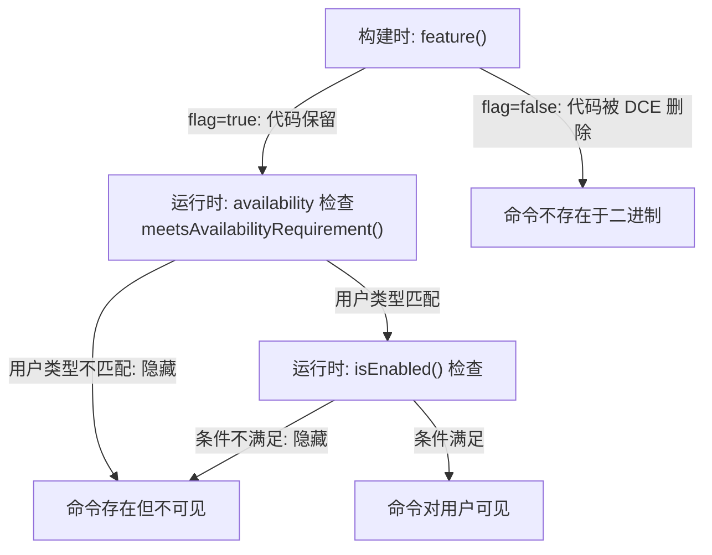
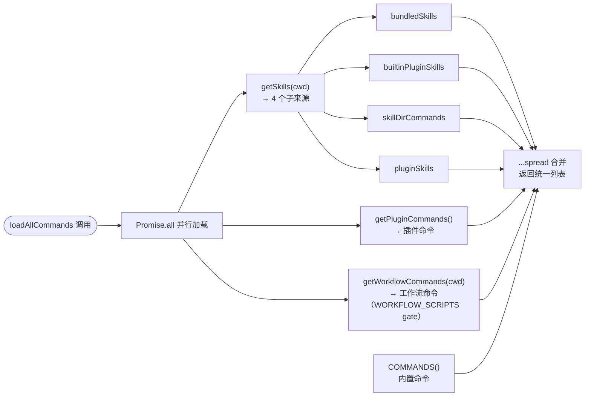
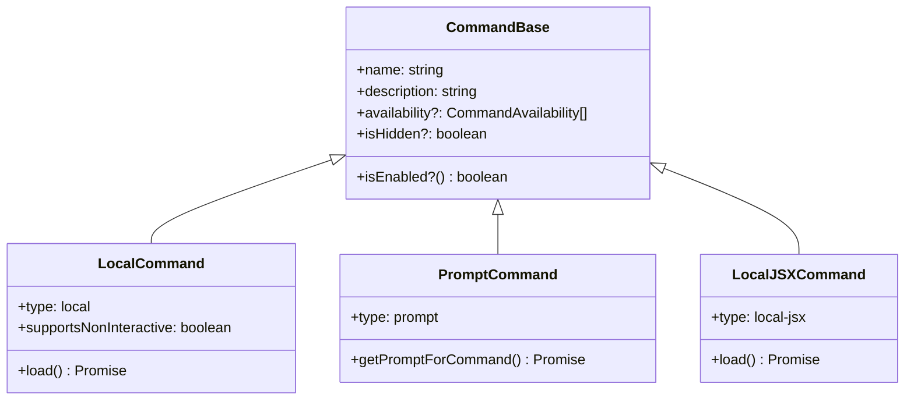
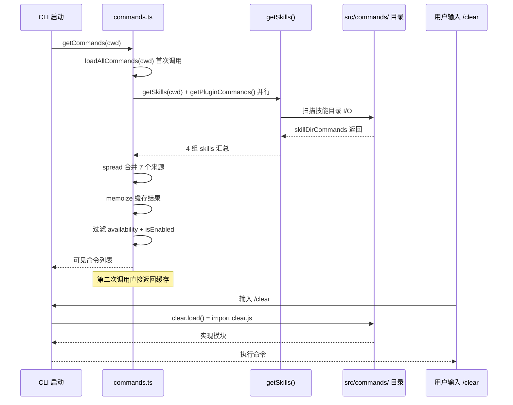
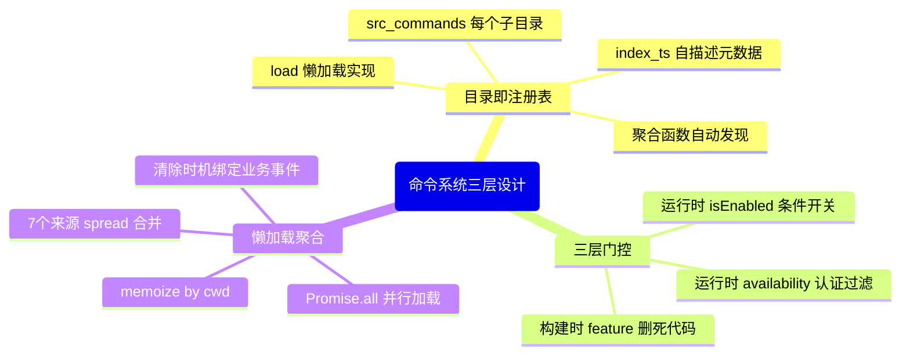

# 第 7 章：斜杠命令系统——103 个命令的注册、加载与执行

> "约定胜于配置，但只有在约定清晰时，才能保持胜利。"

想象一个有 94 个命令的 CLI，每次有人贡献新命令，都需要修改同一个核心注册文件。这个文件成了合并冲突热点——每个 PR 都要碰它，代码审查时大家盯着一个 300 行的数组。更棘手的是，有些命令只在特定部署环境中出现，有些命令依赖外部插件，有些命令在用户登录前应该隐藏。如果这些逻辑都堆在一个文件里，维护者迟早会放弃。

Claude Code 的代码库里有一个模式重复出现：**目录即注册表（Directory-as-Registry）**——不在一个中央文件里枚举所有命令，而是让每个目录代表一个命令，运行时动态聚合。同时，它配套使用了两层门控机制来解决"命令可见性"问题：构建时的 feature flag 消除死代码，运行时的可用性检查过滤不符合条件的命令。

读完本章，你能理解这套三层命令管理机制，并在自己的可扩展 CLI 项目中复用"目录即注册表"和"懒加载聚合"这两个具体模式。

---

## 5.1 问题：94 个命令的注册困境

在 `src/commands.ts:259`，我们能看到系统对内置命令的处理方式：一个 memoize 包裹的函数，返回一个命令对象数组。

```typescript
// src/commands.ts:256-260（注释 + 声明，精简版）

// 声明为函数形式，确保仅在 getCommands 被调用时才执行
// （底层函数需读取配置，而配置在模块初始化时无法访问）
// （原文："Declared as a function so that we don't run this until getCommands is called,
//   since underlying functions read from config, which can't be read at module initialization time"）
const COMMANDS = memoize((): Command[] => [
  addDir,
  advisor,
  // ... 以下还有约 60 个命令
])
```

**源码参考：** `src/commands.ts:259`

这个设计选择揭示了一个初期的务实妥协：**内置命令用静态数组枚举**。原因是类型安全——TypeScript 能在编译时检查每个命令对象是否符合 `Command` 接口（定义于 `src/types/command.ts:205`）。数组里每一项都是有类型的 import，遗漏某个字段会立即报错。

但这种务实妥协带来了一个代价：**每新增一个内置命令，都需要修改 `commands.ts`**。当前这个文件已经超过 530 行，顶部是密密麻麻的 import 语句，中段是 memoize 数组，尾部是工具函数。向它添加新命令的体验，就像往一个已经很满的背包里再塞一件衬衫。

**这个问题在"第三方命令"场景下会更严重。** 如果一个插件作者要贡献一个新的斜杠命令，他不能修改 `commands.ts`——这是 Claude Code 的内部文件。他需要一种完全不同的注册机制：不修改任何核心文件，只需把自己的命令"放到某个地方"，系统自动发现它。

这就是"目录即注册表"模式的触发条件：
1. 命令集开放扩展（第三方不能修改核心代码）
2. 命令之间相互独立（无依赖关系，每个命令是一个自包含模块）
3. 命令数量持续增长（静态枚举变成维护负担）

我们将在 5.4 节正式提炼这个模式。现在先看系统如何用两个具体机制解决这两个层面的问题：**构建时 feature flag 门控**处理内置命令中的"条件可见性"，**多源聚合加载**处理内置 + 外部命令的统一注册。

---

## 5.2 源码实例 1：feature flag 门控的命令隐匿术

`src/commands.ts` 的第 59 行有一条特殊的 import：

```typescript
// src/commands.ts:59
import { feature } from 'bun:bundle'
// 死代码消除：条件导入（构建时 DCE）
// （原文："Dead code elimination: conditional imports"）
/* eslint-disable @typescript-eslint/no-require-imports */
const proactive =
  feature('PROACTIVE') || feature('KAIROS')
    ? require('./commands/proactive.js').default
    : null
const briefCommand =
  feature('KAIROS') || feature('KAIROS_BRIEF')
    ? require('./commands/brief.ts').default
    : null
const assistantCommand = feature('KAIROS')
  ? require('./commands/assistant/index.js').default
  : null
const bridge = feature('BRIDGE_MODE')
  ? require('./commands/bridge/index.ts').default
  : null
```

**源码参考：** `src/commands.ts:59-75`

`feature()` 来自 `bun:bundle`，这是 Bun 打包器提供的一个特殊函数。它的行为与普通运行时条件判断**本质不同**：`feature()` 在**构建时**求值，结果已知后，`if/else` 的另一个分支会被打包器当作死代码直接删除（Dead Code Elimination，DCE）。也就是说，如果 `KAIROS` 特性开关在构建时为 `false`，`assistantCommand` 的 require 语句不只是"不执行"，而是**根本不存在于最终产物中**。

这与我们在第 3 章讲到的 Bun bundle 死代码消除机制完全一致——**此处不再重复，只指出其在命令系统中的具体应用**（详见第 3 章第 3.2 节）。

整个文件中，通过 feature flag 门控的命令共有 **15 个**（含双重条件如 `DAEMON+BRIDGE_MODE` 的联合门控），涵盖以下 feature flag：

| feature flag | 门控的命令 | 描述 |
|--------------|-----------|------|
| `KAIROS` | `assistantCommand`, `proactive`, `briefCommand` | 助手模式相关命令 |
| `BRIDGE_MODE` | `bridge`, `remoteControlServerCommand` | 远程控制桥接命令 |
| `VOICE_MODE` | `voiceCommand` | 语音交互命令 |
| `WORKFLOW_SCRIPTS` | `workflowsCmd` | 工作流脚本命令 |
| `FORK_SUBAGENT` | `forkCmd` | 子代理分叉命令 |
| `BUDDY` | `buddy` | 同伴模式命令 |
| 其他（TORCH, UDS_INBOX, ULTRAPLAN…） | 各 1 个命令 | 实验性功能命令 |

这些命令对应的目录**全部存在于 `src/commands/`**——94 个目录里有相当一部分在标准构建版本中对用户不可见。目录存在，但代码已被打包器抹去。

**feature flag 解决的是"构建变体"问题**，而不是"运行时条件"问题。举一个具体例子：`assistantCommand` 是只有 Anthropic 内部的 KAIROS 部署版本才需要的命令，让它出现在公开发布的二进制文件中没有意义——不只是隐藏起来，而是彻底不存在。

这与另一套机制——`isEnabled()` 和 `availability`——形成了明确的分工。我们来看 `src/types/command.ts` 对三者的注释：

```typescript
// src/types/command.ts:157-159
// 这与 isEnabled() 是分开的：
//   - availability = 谁能用这个命令（认证/提供商要求，静态判断）
//   - isEnabled()  = 这个命令当前是否开启（GrowthBook、平台、环境变量）
// （原文："This is separate from `isEnabled()`:
//   - `availability` = who can use this (auth/provider requirement, static)
//   - `isEnabled()`  = is this turned on right now (GrowthBook, platform, env vars)"）
```

**源码参考：** `src/types/command.ts:157-159`

三层机制的分工由此清晰：

**图 7-1：命令三层门控机制**



注意这三层的性质完全不同：第一层（feature flag）是**构建时**决策，结果固化在二进制文件中；第二层（availability）是**运行时静态检查**，依赖用户的认证状态但在单次会话中不变；第三层（isEnabled）是**运行时动态检查**，可以响应 GrowthBook 实验标志和环境变量的变化。

这就是为什么 `src/commands.ts:411` 的注释特别强调执行顺序：

```typescript
// src/commands.ts:411
// 此处在 isEnabled() 之前运行，确保提供商门控的命令被隐藏，无论 feature-flag 状态如何。
// （原文："This runs before `isEnabled()` so that provider-gated commands are hidden
//   regardless of feature-flag state."）
```

**`availability` 检查必须先于 `isEnabled()` 执行**，是因为两者的优先级不同：`availability` 是"谁有权用"的问题（安全相关），`isEnabled()` 是"当前是否开启"的问题（功能开关）。如果顺序反了，一个 `isEnabled()=true` 的命令可能对无权限的用户短暂闪现。

---

## 5.3 源码实例 2：loadAllCommands 的七源聚合

内置命令用静态数组解决了，外部命令怎么接入？答案在 `src/commands.ts:449` 的 `loadAllCommands` 函数：

```typescript
// src/commands.ts:449-469
const loadAllCommands = memoize(async (cwd: string): Promise<Command[]> => {
  const [
    { skillDirCommands, pluginSkills, bundledSkills, builtinPluginSkills },
    pluginCommands,
    workflowCommands,
  ] = await Promise.all([
    getSkills(cwd),
    getPluginCommands(),
    getWorkflowCommands ? getWorkflowCommands(cwd) : Promise.resolve([]),
  ])

  return [
    ...bundledSkills,
    ...builtinPluginSkills,
    ...skillDirCommands,
    ...workflowCommands,
    ...pluginCommands,
    ...pluginSkills,
    ...COMMANDS(),
  ]
})
```

**源码参考：** `src/commands.ts:449-469`

这个函数是整套命令系统的聚合核心。它用一个 `Promise.all` 并行加载三组来源，最后用 spread 语法把七个子列表合并成一个完整的命令列表：`bundledSkills`（打包技能）、`builtinPluginSkills`（内置插件技能）、`skillDirCommands`（技能目录命令）、`workflowCommands`（工作流命令）、`pluginCommands`（插件命令）、`pluginSkills`（插件技能）、`COMMANDS()`（内置命令）。

**图 7-2：loadAllCommands 七源并行聚合**



左侧三个 `Promise.all` 分支各自负责不同来源，`getSkills` 进一步拆解为 4 个子列表，最终通过右侧的 spread 合并为统一命令列表。**来源的先后顺序即是优先级**——`bundledSkills` 排最前，内置 `COMMANDS()` 排最后，同名命令以靠前的来源为准。

这里有两个设计细节值得关注。

**第一：`getWorkflowCommands` 的空值守卫。**

```typescript
getWorkflowCommands ? getWorkflowCommands(cwd) : Promise.resolve([]),
```

`getWorkflowCommands` 可能是 `null`——因为它本身也被 feature flag 门控（`WORKFLOW_SCRIPTS`，见 `src/commands.ts:398`）。如果构建时该特性未启用，`getWorkflowCommands` 就是 `null`，Promise.all 里用 `Promise.resolve([])` 占位，保持 destructuring 结构不变。这是一种**防御性聚合**：聚合函数不需要知道某个来源是否存在，空值守卫在调用前解决了这个问题。

**第二：memoize 的粒度。**

```typescript
const loadAllCommands = memoize(async (cwd: string): Promise<Command[]> => {
```

函数以 `cwd`（当前工作目录）为 memoize key。这是一个精确的粒度选择：不同工作目录可能有不同的技能目录（`skillDirCommands` 是从 `cwd` 相对路径扫描的），所以相同 `cwd` 的结果可以缓存，不同 `cwd` 的结果必须独立计算。

与此同时，`src/commands.ts:473` 的注释说明了为什么 `getCommands`（调用 `loadAllCommands` 的上层函数）**不** memoize：

```typescript
// src/commands.ts:473-475
// 返回当前用户可用的命令。昂贵的加载操作已 memoize，
// 但 availability 和 isEnabled 检查在每次调用时都重新执行，
// 确保认证变化（例如 /login）立即生效。
// （原文："Returns commands available to the current user. The expensive loading is
//   memoized, but availability and isEnabled checks run fresh every call so
//   auth changes (e.g. /login) take effect immediately."）
```

这揭示了一个精细的性能权衡：**把昂贵的 I/O 操作（目录扫描、动态导入）放在 memoize 层，把便宜的判断操作（可用性检查、isEnabled）放在非 memoize 层**。用户执行 `/login` 后，下一次调用 `getCommands()` 能立即看到新解锁的命令，而不需要重新扫描整个文件系统。

**来源的顺序也是设计决策。** 返回列表中，`...bundledSkills` 排在最前，`...COMMANDS()` 排在最后。这个顺序决定了当同名命令来自多个来源时，谁会被优先采纳（`getCommands` 中有去重逻辑）。将内置命令放在最后，意味着插件和技能可以"覆盖"同名的内置命令——这是一个有意识的可扩展性决定。

---

## 5.4 模式剖析：目录即注册表（Directory-as-Registry）

现在我们来为这个模式命名，并提炼其关键结构。

`src/commands` 目录下有 94 个子目录，每个子目录是一个命令模块。以 `clear` 命令为例，它的目录结构如下：

```
src/commands/clear/
├── index.ts        ← 命令元数据（type、name、description、load）
├── clear.ts        ← 命令实现（懒加载的目标）
├── caches.ts       ← 工具函数
└── conversation.ts ← 工具函数
```

`index.ts` 的内容极简——只有元数据和一个懒加载声明：

```typescript
// src/commands/clear/index.ts:10-18
const clear = {
  type: 'local',
  name: 'clear',
  description: 'Clear conversation history and free up context',
  aliases: ['reset', 'new'],
  supportsNonInteractive: false,
  load: () => import('./clear.js'),  // ← 懒加载：实现只有在命令被调用时才加载
} satisfies Command

export default clear
```

**源码参考：** `src/commands/clear/index.ts:10-18`

`load: () => import('./clear.js')` 是这个模式的关键细节：**元数据（类型、名称、描述）与实现（处理逻辑）分离**。系统在启动时只加载 `index.ts`，读取命令的元数据（用于构建命令列表、自动补全、帮助文档），只有当用户实际输入 `/clear` 时，才触发 `load()` 懒加载实现文件。

这个结构在 94 个命令目录中**完全一致**——这正是"模式"的标志：相同的解决方案在代码库中重复出现，解决相同类型的问题。

**图 7-3：Command 类型层次结构**



`Command` 类型定义于 `src/types/command.ts:205`，是 `CommandBase` 与三种子类型的联合。**`CommandBase` 包含可见性控制字段（`availability`、`isEnabled`、`isHidden`），所有类型共享**；三种子类型的核心差异在 `load()` 的返回值和执行方式上。这个类型设计让聚合函数统一处理所有来源的命令，无需区分类型。

---

## 5.5 适用范围

"目录即注册表"模式不是万能的。以下表格帮助我们判断何时该用、何时该用其他方案：

| 场景 | 适用 | 理由 / 替代方案 |
|------|------|----------------|
| 命令集开放第三方扩展 | ✓ | 第三方只需新建目录，无需修改核心代码 |
| 命令之间相互独立 | ✓ | 目录结构无法表达命令间的依赖关系 |
| 命令数量 > 20 且持续增长 | ✓ | 静态枚举维护负担过重时，约定优于配置 |
| 命令有严格的加载顺序依赖 | ✗ | 目录扫描顺序不稳定，改用显式注册表（可控制顺序）|
| 命令需要在注册时传入共享上下文 | ✗ | 目录扫描无法传构造参数，改用 Factory 模式 |
| 命令数量 ≤ 10 且不再增长 | ✗ | 显式枚举更清晰，无需约定——约定需要文档才能被新人理解 |
| 命令之间有循环引用 | ✗ | 目录独立性假设被打破，需要改用依赖注入容器 |

Claude Code 自身实际上使用了**混合策略**：内置命令用静态数组（类型安全、零 I/O），技能和插件用目录扫描（可扩展、支持第三方）。两种方式在 `loadAllCommands` 中通过 spread 合并，对调用方透明。这个混合策略值得注意：**不必为了纯粹而放弃类型安全**，可以在核心维护一个静态数组，在扩展层使用目录约定。

**图 7-4：命令从目录到可见的完整调用时序**



图中有两个关键分界点：`loadAllCommands` 之后有 memoize 缓存（整个会话只扫描一次目录）；`clear.load()` 只在用户实际触发命令时才执行。这就是为什么 94 个命令目录不会让 CLI 启动变慢——元数据扫描一次性完成并缓存，实现模块按需加载。

---

## 5.6 权衡与局限

**约定依赖文档**。"目录即注册表"的核心是约定：每个目录必须有 `index.ts`，必须 `export default` 一个符合 `Command` 接口的对象，必须有 `load()` 函数。这些约定如果没有文档，新人会困惑——为什么 `src/commands/clear/` 这个目录就是一个命令？`src/commands.ts:449` 的聚合函数在哪里扫描它们？

**文件系统扫描是 I/O 操作**。`getSkillDirCommands`（被 `getSkills` 调用，`src/commands.ts:361`）需要读取磁盘上的技能目录。这是异步 I/O，比内存中的数组查找慢几个数量级。`loadAllCommands` 的 memoize 是必要的缓解措施，但 memoize 意味着热更新需要显式清除缓存。

`clearCommandMemoizationCaches`（`src/commands.ts:522` 附近）正是为此而存在——当用户执行 `/login`、`/logout` 或安装新插件时，系统必须清除 memoize 缓存，确保下一次 `getCommands()` 拿到的是最新状态。

**适用边界**：当命令目录数量达到几十个时，文件系统扫描的开销相对于整个 CLI 启动时间可以忽略不计（毕竟只扫描一次并 memoize）。但如果技能目录包含数百个 Markdown 文件（参考第 18 章的 Skill 系统），扫描和解析的开销就变得可观。

**类型安全降级**。静态数组中，TypeScript 能在编译时检查每个命令对象。目录扫描的命令是在运行时动态加载的，TypeScript 无法静态分析其类型正确性——只能在运行时通过 schema validation（或简单的 duck typing）来检查。这是可扩展性和类型安全之间必要的取舍。

---

## 5.7 与已知模式的对话

**与 GoF Plugin 模式的比较**。Plugin 模式（《设计模式》中描述为"可扩展的抽象工厂"）同样允许在不修改核心代码的情况下添加新功能。两者的共同点是**扩展点的解耦**；不同点在于注册机制：Plugin 模式通常有显式的 `register()` 调用（插件需要主动注册自己），而"目录即注册表"通过约定完全隐式——放对地方就行，无需调用任何 API。隐式注册降低了贡献者的门槛，代价是约定必须通过文档传递，而非代码接口强制。

**与 POSA 微内核（Microkernel）架构的比较**。微内核将核心功能与可插拔扩展分离：核心（`commands.ts` 的聚合逻辑）保持稳定，扩展（各命令目录）可独立添加和移除。Claude Code 的命令系统是一个轻量级的微内核实践——不需要完整的微内核框架，只需要一个聚合函数和一个约定。

**Claude Code 的选择——最简形式**。没有插件注册接口，没有服务定位器，没有 IoC 容器。只有目录约定和一个 `loadAllCommands` 函数。这符合"Convention over Configuration"（约定优于配置）原则——在确保约定被遵守的前提下，最小化框架代码。94 个命令目录，每个都是自包含的，没有一个需要了解其他命令的存在。

---

## 模式提炼

**图 7-5：三个模式的协作关系**



三个模式相互配合：目录即注册表解决「如何扩展」，三层门控解决「谁能看见」，懒加载聚合解决「何时加载」。任何一个单独存在都不完整——没有目录约定，聚合就无处扫描；没有三层门控，可见性逻辑会散落各处；没有懒加载，94 个命令目录的启动代价会拖慢 REPL。

### 模式 1：目录即注册表（Directory-as-Registry）

**解决的问题**：可扩展 CLI 在命令数量增长时，显式注册表成为合并冲突热点，且无法支持第三方扩展。

**核心做法**：每个命令是一个独立目录，目录内用 `index.ts` 声明元数据（含 `load()` 懒加载函数）。系统通过聚合函数动态扫描目录，无需任何中央注册步骤。

**前置条件**：命令之间相互独立；有固定的目录约定（`index.ts` + `Command` 接口）；有统一的聚合入口函数。

**源码证据**：`src/commands.ts:449-469`（`loadAllCommands` 聚合函数）；`src/commands/clear/index.ts:10-18`（典型命令目录结构）

---

### 模式 2：三层门控（Three-Layer Gating）

**解决的问题**：CLI 命令的可见性取决于多个维度（部署环境、用户认证类型、运行时特性开关），这些维度的检查时机和优先级不同，需要分层处理。

**核心做法**：构建时 `feature()` 消除死代码（最高优先级，固化在二进制）；运行时 `availability` 检查用户认证类型（静态，每次调用重新执行）；运行时 `isEnabled()` 检查动态条件（最低优先级，可响应实验标志）。

**前置条件**：使用 Bun bundle 构建（feature flag DCE 依赖 `bun:bundle`）；有清晰的"谁有权用"（availability）与"当前是否开启"（isEnabled）的语义区分。

**源码证据**：`src/commands.ts:59`（feature 导入）；`src/commands.ts:411`（availability 先于 isEnabled 的注释）；`src/types/command.ts:157-159`（availability 与 isEnabled 的语义区分注释）

---

### 模式 3：懒加载聚合（Lazy Aggregation）

**解决的问题**：命令加载是 I/O 密集操作（目录扫描、动态导入），在模块初始化时执行会拖慢 CLI 启动时间。

**核心做法**：`memoize(async (cwd) => Promise.all([...来源]))` 在首次需要时并行加载所有来源，结果缓存到内存；命令实现通过 `load: () => import(...)` 在实际调用时才懒加载，启动时只加载元数据。

**前置条件**：命令加载与使用之间有时间差（如 REPL 启动后才调用命令）；有明确的缓存清除时机（如 `/login`、插件安装）；命令元数据（用于自动补全和帮助显示）比实现文件轻量。

**源码证据**：`src/commands.ts:449`（`loadAllCommands` memoize）；`src/commands/clear/index.ts:16`（`load: () => import('./clear.js')` 懒加载声明）

---

## 你能做什么

- **为自己的 CLI 建立目录约定**：每个子目录是一个命令，`index.ts` 声明元数据 + `load()` 懒加载实现。新增命令只需新建目录，无需改任何已有文件。

- **区分三层门控的语义边界**：构建时 feature flag 用于"部署变体"（不同版本有不同功能集），`availability` 用于"用户类型"（认证级别决定可见性），`isEnabled()` 用于"运行时开关"（实验功能、环境变量）。把它们混在一起会让门控逻辑难以追踪。

- **用 memoize 包裹目录扫描**：文件系统扫描只做一次，结果缓存。但要找到"失效时机"——会改变扫描结果的操作（如安装插件、切换目录）必须触发缓存清除。

- **保留内置命令的静态数组**：类型安全和可发现性是内置命令的核心优势。对第三方扩展使用目录扫描，对内置命令保留显式数组——混合策略不是妥协，而是务实选择。

- **在聚合函数中用 spread 合并来源**：新增来源只需在聚合函数的返回列表里加一行 `...newSource`，不需要修改任何现有来源。扩展点在聚合层，而非各个来源层。

- **如果你在构建多租户 CLI（不同用户有不同命令集）**：参考三层门控模式——把"谁有权用"（availability）和"当前是否开启"（isEnabled）分成两个独立的检查，按 availability → isEnabled 的顺序执行，保证安全性不被功能开关意外覆盖。

---

本章揭示的命令系统设计，为后续章节奠定了基础：命令在调用时实际发生了什么——包括斜杠命令如何被识别和路由（已在第 6 章讲解）、命令处理器如何与 QueryEngine 主循环交互——将在第 9 章详细展开。插件命令的加载机制（`getPluginCommands`）与第 37-39 章的 Plugin 系统深度关联，届时我们会回到本章提到的 `loadPluginCommands.ts` 来看完整的插件命令生命周期。
