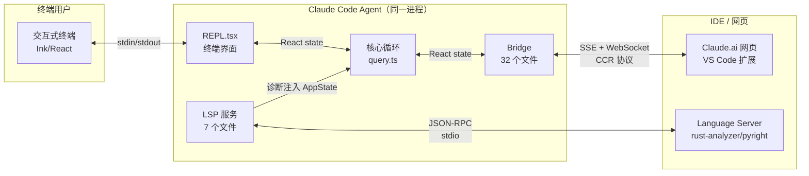
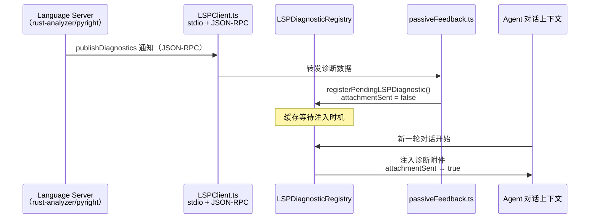

# 第 8 章：IDE 集成——Bridge 协议与 LSP 服务

> "同一个引擎，两张脸——终端用户和 IDE 用户，各自看到最熟悉的界面。"

Claude Code 的核心是一个 Agent——它理解自然语言、调用工具、生成代码。但这个 Agent 可以服务两种完全不同的用户界面：终端里的 Ink/React REPL，以及 Claude.ai 网页和 VS Code 扩展里的图形界面。两种界面都需要同一个 Agent 的能力，但协议、传输方式、消息格式截然不同。

这个挑战在代码库中出现了两次，以不同形式解决：Bridge 协议（32 个文件）用自定义的 CCR（云端中继）协议把 Agent 的输出实时桥接到 Claude.ai 网页；LSP 服务（7 个文件）用标准的语言服务器协议（Language Server Protocol, LSP）把 IDE 的代码诊断结果注入 Agent 的上下文。前者是"Agent 推送给 IDE"，后者是"IDE 反馈给 Agent"。

读完本章，我们将理解**双界面桥接（Dual-Interface Bridge）**——同一个 Agent 如何通过两条独立的协议管道，同时服务终端和 IDE 两种交互界面，以及自定义协议与标准协议的不同选型逻辑。

---

## 问题：一个 Agent，两种界面

`src/bridge/bridgeEnabled.ts:32` 揭示了 Bridge 功能的启用逻辑：

```typescript
// src/bridge/bridgeEnabled.ts:32
export function isBridgeEnabled(): boolean {
  // 正向三元模式（Positive ternary pattern）——见 docs/feature-gating.md。
  // 反向写法（if (!feature(...)) return）无法消除外部构建中的内联字符串字面量。
  // （原文：Positive ternary pattern — see docs/feature-gating.md.
  //  Negative pattern (if (!feature(...)) return) does not eliminate
  //  inline string literals from external builds.）
  return feature('BRIDGE_MODE')
    ? isClaudeAISubscriber() &&
        getFeatureValue_CACHED_MAY_BE_STALE('tengu_ccr_bridge', false)
    : false
}
```

**源码参考：** `src/bridge/bridgeEnabled.ts:32`

两个条件缺一不可：`feature('BRIDGE_MODE')` 是构建时门控（详见第 3 章），只在 Ant 构建中存在；`isClaudeAISubscriber()` 是运行时鉴权，确保只有 Claude.ai 订阅用户才能使用。注释里提到"Positive ternary pattern"——这是刻意的写法，因为 `feature()` 的 DCE 只在正向三元运算符中能消除 false 分支的字符串字面量，`if (!feature(...)) return false` 写法会让 `'tengu_ccr_bridge'` 字符串留在非 BRIDGE_MODE 的产物中。

**图 8-1：双界面架构——终端与 IDE 共享同一个 Agent**



*图注：Agent 进程内有两条对外通道——Bridge（向外推送 Agent 输出到 Claude.ai 网页）和 LSP（从 IDE 拉取代码诊断注入 Agent 上下文）。两者方向相反：Bridge 是 Agent→IDE，LSP 是 IDE→Agent。*

---

## 源码实例 1：Bridge 主循环——持久连接与指数退避

Bridge 的核心是 `src/bridge/bridgeMain.ts:141` 的 `runBridgeLoop()`，一个带指数退避的持久连接循环：

```typescript
// src/bridge/bridgeMain.ts:59
export type BackoffConfig = {
  connInitialMs: number
  connCapMs: number
  connGiveUpMs: number
  generalInitialMs: number
  generalCapMs: number
  generalGiveUpMs: number
  /** SIGTERM→SIGKILL 优雅关闭宽限期。默认 30s。 */
  shutdownGraceMs?: number
  /** stopWorkWithRetry 基础延迟（1s/2s/4s 退避）。默认 1000ms。 */
  stopWorkBaseDelayMs?: number
}
```

**源码参考：** `src/bridge/bridgeMain.ts:59`

`BackoffConfig` 分开管理两类退避：`conn*` 用于连接层（SSE/WebSocket 建立失败），`general*` 用于通用操作失败。这不是过度设计——连接失败和业务操作失败的恢复策略完全不同：连接失败需要快速重试（用户在等待），业务操作失败可以给更长的宽限期（不影响连接本身）。

```typescript
// src/bridge/bridgeMain.ts:141
export async function runBridgeLoop(
  config: BridgeConfig,
  environmentId: string,
  environmentSecret: string,
  api: BridgeApiClient,
  spawner: SessionSpawner,
  logger: BridgeLogger,
  signal: AbortSignal,
  backoffConfig: BackoffConfig = DEFAULT_BACKOFF,
): Promise<void> {
  const controller = new AbortController()
  // ...链接到外部 signal
  const activeSessions = new Map<string, SessionHandle>()
  const sessionStartTimes = new Map<string, number>()
  const sessionWorkIds = new Map<string, string>()
  // ...
```

**源码参考：** `src/bridge/bridgeMain.ts:141`

函数签名里有几个值得注意的设计细节：`spawner: SessionSpawner` 是依赖注入的——Bridge 不直接创建 Claude Code 进程，而是通过 `spawner` 接口委托，这让测试时可以替换成 mock spawner。`signal: AbortSignal` 是外部取消信号，配合内部的 `AbortController` 实现链式取消：当外部终止时，所有活跃会话都能收到取消信号。

`activeSessions` 是一个 `Map<string, SessionHandle>`——Bridge 支持同时管理多个并发会话（`tengu_ccr_bridge_multi_session` feature gate 控制）。每个会话有独立的 `sessionWorkIds`、`sessionIngressTokens` 和超时看门狗计时器。

### 心跳机制：存活证明

`src/bridge/bridgeMain.ts:202` 的 `heartbeatActiveWorkItems()` 定期向 CCR 后端汇报活跃会话的存活状态：

```typescript
// src/bridge/bridgeMain.ts:202
async function heartbeatActiveWorkItems(): Promise<
  'ok' | 'auth_failed' | 'fatal' | 'failed'
> {
  // ...对每个 activeSessions 发送心跳
  // 返回 'auth_failed' 触发 JWT 刷新
  // 返回 'fatal' 触发完整重连
```

**源码参考：** `src/bridge/bridgeMain.ts:202`

心跳返回四种结果，而非简单的成功/失败。`auth_failed`（401/403）触发 JWT 刷新重连，`fatal` 触发完整重连流程，`failed` 记录日志但继续运行。这种细粒度的错误分类——区分"凭证过期"和"真正的连接失败"——是生产级长连接服务的标准做法。

### 权限代理：双向的"人在回路"

`src/bridge/bridgePermissionCallbacks.ts:10` 定义了 Bridge 的权限代理接口：

```typescript
// src/bridge/bridgePermissionCallbacks.ts:10
type BridgePermissionCallbacks = {
  sendRequest(
    requestId: string,
    toolName: string,
    input: Record<string, unknown>,
    toolUseId: string,
    description: string,
    permissionSuggestions?: PermissionUpdate[],
    blockedPath?: string,
  ): void
  sendResponse(requestId: string, response: BridgePermissionResponse): void
  cancelRequest(requestId: string): void
  onResponse(
    requestId: string,
    handler: (response: BridgePermissionResponse) => void,
  ): () => void  // returns unsubscribe
}
```

**源码参考：** `src/bridge/bridgePermissionCallbacks.ts:10`

这是第 5 章讲的"异步交互阻断"模式（详见第 5 章）在 Bridge 场景的跨进程版本：当 Agent 需要执行需要确认的工具时，`sendRequest` 把权限请求发送到 Claude.ai 网页，用户在网页上点击允许/拒绝，`onResponse` 回调被触发，Agent 得到结果继续执行。`cancelRequest` 用于在 Agent 侧取消后通知网页端关闭确认弹窗，保证双端 UI 同步。

---

## 源码实例 2（变体）：LSP 服务集成——标准协议的反向通道

Bridge 是 Agent 向 IDE 推送；LSP 服务是 IDE 向 Agent 反馈。两者方向相反，但都让 Agent 和 IDE 之间有了双向数据流。

`src/services/lsp/LSPClient.ts:51` 的 `createLSPClient()` 用闭包封装了一个完整的 LSP 客户端：

```typescript
// src/services/lsp/LSPClient.ts:51
export function createLSPClient(
  serverName: string,
  onCrash?: (error: Error) => void,
): LSPClient {
  // 闭包内状态
  let process: ChildProcess | undefined
  let connection: MessageConnection | undefined
  let capabilities: ServerCapabilities | undefined
  let isInitialized = false
  // ...
  // 通过 vscode-jsonrpc 建立 stdio 连接
```

**源码参考：** `src/services/lsp/LSPClient.ts:51`

注意传输方式：LSP 用的是 **stdio**（子进程的标准输入/输出），而非 WebSocket 或 HTTP。这是 LSP 规范定义的标准传输方式——语言服务器（rust-analyzer、pyright 等）都实现了 stdio 传输。Claude Code 使用 `vscode-jsonrpc` 库（`LSPClient.ts:3`）来处理消息的序列化和帧格式，而不是自己实现 JSON-RPC 协议。

**这与 Bridge 的核心区别**：Bridge 使用自定义的 CCR 协议（因为 Claude.ai 后端有 Claude Code 专属的消息格式和会话管理需求），而 LSP 使用标准 JSON-RPC（因为复用所有兼容 LSP 的语言服务器是更大的价值）。一个是"接入专属生态需要自定义协议"，一个是"接入通用生态要遵守开放标准"。

`src/services/lsp/LSPServerManager.ts:1` 的 `LSPServerManager` 负责多语言服务器的生命周期：

```typescript
// src/services/lsp/LSPServerManager.ts:16
export type LSPServerManager = {
  initialize(): Promise<void>
  shutdown(): Promise<void>
  getServerForFile(filePath: string): LSPServerInstance | undefined
  ensureServerStarted(filePath: string): Promise<LSPServerInstance | undefined>
  sendRequest: <TResult>(
    method: string,
    params: unknown,
    filePath: string,
  ) => Promise<TResult | undefined>
  // ...
}
```

**源码参考：** `src/services/lsp/LSPServerManager.ts:16`

`getServerForFile(filePath)` 根据文件扩展名路由到对应的语言服务器——`.rs` 文件用 rust-analyzer，`.py` 文件用 pyright，以此类推。`ensureServerStarted` 的懒启动设计意味着语言服务器只在真正需要时才被启动，不会增加 Claude Code 的启动时间。

### 诊断反馈：LSP 结果如何进入 Agent 上下文

`src/services/lsp/LSPDiagnosticRegistry.ts:1` 维护了一个 LRU 缓存，存放待处理的 LSP 诊断：

```typescript
// src/services/lsp/LSPDiagnosticRegistry.ts:12
export type PendingLSPDiagnostic = {
  serverName: string
  files: DiagnosticFile[]
  timestamp: number
  attachmentSent: boolean  // ← 是否已注入对话上下文
}
```

**源码参考：** `src/services/lsp/LSPDiagnosticRegistry.ts:12`

`attachmentSent` 字段是关键：LSP 的 `publishDiagnostics` 通知是异步推送的（语言服务器完成分析后主动推送），但 Agent 对话是轮次制的。`LSPDiagnosticRegistry` 把诊断暂存起来，在下一轮对话时通过 `passiveFeedback.ts` 以"附件"形式注入 Agent 的上下文——诊断从 IDE 跨越协议边界，变成了 Agent 的上下文输入。

**图 8-2：LSP 诊断从 IDE 流向 Agent 上下文**



*图注：LSP 诊断的注入是异步的——语言服务器推送诊断的时机与 Agent 查询的时机不同步。DiagnosticRegistry 充当缓冲区，在合适的时机把诊断转化为 Agent 的上下文输入。`attachmentSent` 标记防止重复注入。*

---

## 模式剖析：两种"双界面"的不同形态

| 维度 | Bridge（CCR 协议） | LSP（JSON-RPC 协议） |
|------|------------------|---------------------|
| **通信方向** | Agent → IDE（推送输出） | IDE → Agent（反馈诊断） |
| **协议类型** | 自定义 CCR 协议（SSE + WebSocket） | 标准 JSON-RPC（stdio） |
| **选型理由** | Claude.ai 有专属消息格式和会话管理 | 复用所有 LSP 兼容语言服务器 |
| **连接管理** | 指数退避重连，心跳保活 | 懒启动，文件类型路由 |
| **失败处理** | `BackoffConfig` 分类退避 | 重试 + crash 回调 |
| **认证** | OAuth JWT，需要 Claude.ai 订阅 | 无认证（本地子进程） |
| **关联源码** | `bridgeMain.ts:141`, `bridgeEnabled.ts:32` | `LSPClient.ts:51`, `LSPServerManager.ts:16` |

两种实现的共同核心是**协议适配器**：Bridge 适配 CCR 后端的专属协议，LSP 适配开放的语言服务器协议——两者都让 Agent 的核心逻辑不需要知道外部接口的细节。Agent 只处理 `Message[]` 和工具调用，Bridge/LSP 层负责把这些与外部世界对接。

---

## 适用范围

| 场景 | 适用 | 理由 | 替代方案 |
|------|------|------|---------|
| Agent 需要同时服务终端和 Web 界面 | ✓ | 双界面桥接让核心不变，只增加适配层 | 为每种界面维护独立的 Agent 实例 |
| 需要接入现有生态的标准协议（LSP、DAP 等） | ✓ | 标准协议复用所有兼容实现，降低集成成本 | 自己实现协议解析 |
| 连接不稳定的长连接服务 | ✓ | BackoffConfig 模式提供结构化的重连策略 | 固定间隔重连（容易引起惊群） |
| Agent 需要实时感知 IDE 的代码变化 | ✓ | LSP 的 publishDiagnostics 推送适合实时反馈 | 轮询文件系统 |
| 工具调用需要 IDE 端的用户确认 | ✓ | BridgePermissionCallbacks 实现跨进程权限代理 | 仅支持终端确认 |
| 离线环境（无 Claude.ai 账号） | ✗ | Bridge 需要 OAuth 订阅，无法离线使用 | 纯终端模式 |
| 语言服务器启动时间 > 5 秒 | △ | 懒启动缓解了这一问题，但首次使用仍有延迟 | 预启动 + 等待就绪 |

---

## 权衡与局限

**Bridge 的延迟成本**：每条消息都要经过 CCR 后端中转——Agent 在终端里输出的内容，要先发送到 Claude.ai 服务器，再推送到 Web 客户端。网络往返增加了 IDE 界面的延迟感，这与终端直接渲染的体验有本质差异。`BackoffConfig` 的 `connCapMs` 字段暗示了这个权衡：连接退避上限越高，重连越慢，用户等待时间越长。

**LSP 的协议版本兼容性**：LSP 规范在持续演化（当前 3.17），不同语言服务器实现的版本不同。`LSPServerInstance.ts` 里的 `LSP_ERROR_CONTENT_MODIFIED = -32801` 和 `MAX_RETRIES_FOR_TRANSIENT_ERRORS = 3` 说明 Claude Code 需要专门处理语言服务器的瞬时错误（如 rust-analyzer 仍在索引项目时的"内容修改"错误）。标准协议的代价是需要处理各种实现的不一致性。

**feature 门控的维护成本**：`isBridgeEnabled()` 中的 `feature('BRIDGE_MODE')` 门控（见第 3 章）意味着 Bridge 的 32 个文件在非 BRIDGE_MODE 构建中完全不存在。这保证了产物体积和安全隔离，但也意味着这 32 个文件只在 Ant 内部构建中能被完整测试。

---

## 与已知模式的对话

| 维度 | 双界面桥接 | GoF Bridge 模式 | IPC（进程间通信） |
|------|----------|---------------|----------------|
| **抽象目标** | 同一 Agent 服务多种界面 | 抽象与实现分离（可独立变化） | 进程间数据传输 |
| **方向** | 双向（Agent↔IDE） | 接口层 → 实现层（单向依赖） | 双向，对等 |
| **协议选择** | 按生态需求（自定义 or 标准） | 无协议概念（同进程接口） | 各异（socket/pipe/共享内存） |
| **失败处理** | 显式退避策略 + 心跳 | 无（同进程不存在连接失败） | 通常由调用方处理 |

**与 GoF Bridge 模式的对话**：GoF 的 Bridge 用于分离"接口层次"和"实现层次"，让两者可以独立变化。Claude Code 的 Bridge 是不同的概念——它是字面意义上的"桥梁"，连接两个独立的进程或系统。名字相同，但设计目标完全不同。更准确的 GoF 类比是 **Adapter 模式**：把 Agent 的输出格式适配成 CCR 协议，把 LSP 的诊断格式适配成 Agent 的上下文格式。

**Bridge vs LSP 的协议选择哲学**：Bridge 选择自定义协议，是因为 Claude.ai 的 CCR 后端和 Claude Code 是"有主合作"——两边都由 Anthropic 控制，可以共同演化协议。LSP 选择标准协议，是因为语言服务器是"开放生态"——Anthropic 无法控制 rust-analyzer、pyright 的实现。**"控制什么就自定义什么，依赖什么就遵守什么"**——这是双界面桥接协议选型的根本逻辑。

---

## 模式提炼

### 双界面桥接（Dual-Interface Bridge）

**解决的问题**：同一个 Agent 需要服务终端和 IDE/Web 两种界面，两种界面协议与消息格式互不兼容，核心层无法直接处理所有差异。

**核心做法**：在 Agent 进程内增加独立适配层（Bridge/LSP），每层只负责自己接口的协议翻译，核心层不感知外部界面。

**源码证据**：src/bridge/bridgeMain.ts:141，src/services/lsp/LSPClient.ts:51

---

### 指数退避持久连接（Backoff Persistent Connection）

**解决的问题**：面向外部服务的长连接在网络波动、服务重启、JWT 过期时会中断，固定间隔重连容易导致服务端惊群。

**核心做法**：用 BackoffConfig 分类管理连接失败与业务失败的退避延迟，区分可恢复错误（JWT 刷新）与致命错误（完整重连），心跳提供存活感知。

**前置条件**：连接是持久的长连接（非请求-响应模式），外部服务可能因多种原因中断（网络/认证/服务端维护），客户端数量多到需要防止惊群效应。

**源码证据**：src/bridge/bridgeMain.ts:59，src/bridge/bridgeMain.ts:202

---

## 你能做什么

- **在 Agent 项目里为"输出给外部"和"从外部接收"设计两条独立管道**：Bridge（推送）和 LSP（接收）的分离是好的架构示范——不要把推送逻辑和接收逻辑混在同一个适配层里
- **接入开放生态时优先考虑标准协议**：LSP 选择 JSON-RPC + stdio 而非自定义协议，换来的是"所有 LSP 兼容语言服务器都可以直接接入"——复用现有生态的价值远超自定义协议的灵活性
- **设计 `BackoffConfig` 时区分"连接退避"和"业务退避"**：网络连接失败和业务操作失败的恢复策略应该独立配置，不要用同一个参数控制两种截然不同的重试场景
- **长连接服务的心跳要返回分类结果，不要只用 true/false**：参考 `heartbeatActiveWorkItems` 的四种返回值（ok / auth_failed / fatal / failed），让调用方能针对不同失败类型做出不同响应
- **用 `attachmentSent` 标记防止诊断重复注入**：LSP 的 `PendingLSPDiagnostic` 模式——缓存异步推送的数据，在合适时机以"已处理/未处理"标记控制注入——可以推广到任何"异步事件 + 同步处理窗口"的场景
- **阅读 `bridgePermissionCallbacks.ts:10` 的 `cancelRequest` 设计**：跨进程的"人在回路"不仅需要请求和响应，还需要取消通知——用户在 IDE 端取消操作时，Agent 侧需要知道以避免继续等待

---

*第九章进入 Harness 控制层的心脏：`query.ts` 的 `while(true)` 循环是如何驱动"用户输入 → API 调用 → 工具执行 → 继续或停止"的完整生命周期的（详见第 9 章）。*
